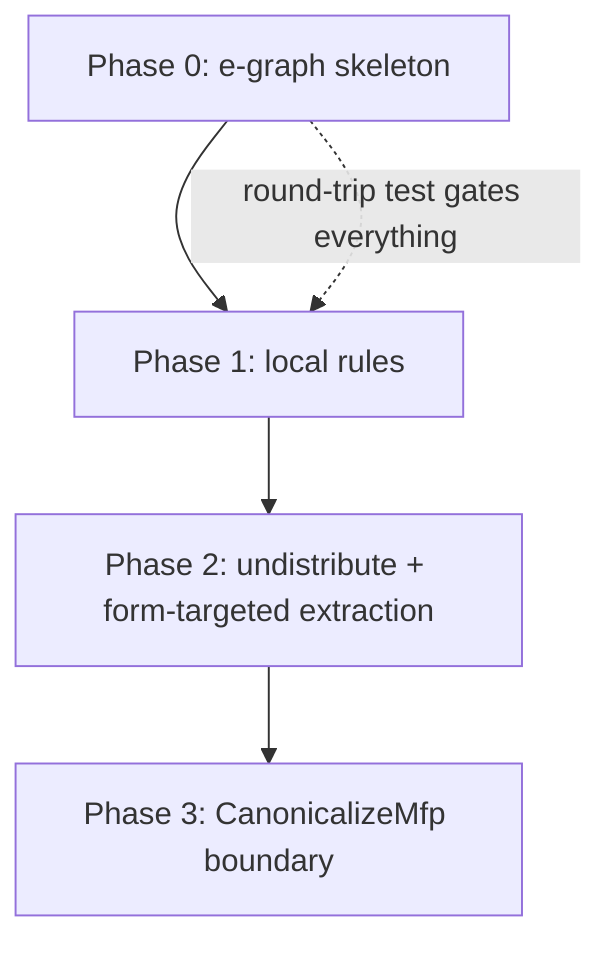

# Plan: scalar equality-saturation canonicalizer

Implements the design note `doc/developer/design/20260625_eqsat_scalar_expressions.md`.
Grounded against branch `claude/mir-equality-optimizer-sodbej`, rev `5a94e4189f`.
Re-verify line references before editing, they drift.

## Goal

Replace the destructive `MirScalarExpr::reduce` scalar simplification in
`canonicalize_predicates` with a non-destructive, form-targeted scalar
canonicalizer built on a contained scalar e-graph.
The structural win is that no rewrite can shadow or disable another, which
eliminates the CLU-137 bug class (factoring disabled by an absorption-only
`could_error` guard).

## Decisions settled before coding

* **Separate scalar e-graph, not unified.**
  Add a standalone `ScalarEGraph` with its own node type, union-find, saturation,
  cost, and extractor.
  Do NOT add scalar variants to the relational `ENode` (`egraph.rs:98`).
  Rationale: the relational WCOJ matcher and arrangement-count cost model must not
  see scalar nodes, the engine has no owner, and containment is the merge argument.
  This is the note's "build the scalar instantiation first, extract the shared core
  later" sequencing.
* **Hand-written rules, not the DSL, for v1.**
  The DSL (`dsl.rs`, `matcher.rs`, `rules/`) is relational-only and moves whole
  scalar payload lists without destructuring.
  Extending it to scalar is its own project.
  Scalar matches are local (an operator plus its children's operators), so plain
  Rust matches over the scalar node type suffice, and no generic join is needed.
* **The shared generic core is deferred.**
  A duplicated ~200-line scalar e-graph core is lower risk than generalizing the
  live `egraph.rs`.
  Extraction of a common core is a later phase, after scalar is a proven second user.

## Open questions to resolve during implementation

* Does the canonicalizer subsume the `coalesce_mfp` crutch, or stay an INCLUDE like
  the relational design did? Decide before Phase 3.
* Exact bonus weights in the form-targeting cost. Driven by the consumer catalog
  below, tuned against goldens.

## Files

New module `src/transform/src/eqsat/scalar/`:

* `mod.rs` — public entry `canonicalize(expr: &MirScalarExpr, col_types: &[ReprColumnType]) -> MirScalarExpr`.
* `node.rs` — `SNode` enum (decomposed scalar operators).
* `egraph.rs` — hash-cons, union-find, congruence closure, saturation loop.
* `lower.rs` — `MirScalarExpr -> Id`.
* `raise.rs` — form-targeted extraction `Id -> MirScalarExpr`.
* `analysis.rs` — e-class analyses (`could_error`, `lit`, arity).
* `rules.rs` — hand-written rewrite rules.
* `cost.rs` — compositional cost plus form-targeting bonuses.

Modified:

* `src/transform/src/eqsat/mod.rs` (or wherever the `eqsat` module tree is declared) — add `pub mod scalar;`.
* `src/expr/src/relation/canonicalize.rs` — flag-gated replacement of `reduce` at `:230` and `:437`.
* The feature-flag registry (locate the existing eqsat flag, mirror it) — add `enable_eqsat_scalar_canonicalize`.

## Phase 0: scalar e-graph skeleton (prerequisite, no rules)

Unblocks everything. Ship and test the round-trip before any rewrite exists.

`node.rs`:

* `enum SNode { Column(usize), Literal(Row, ColumnType), CallUnmaterializable(UnmaterializableFunc), CallUnary { func: UnaryFunc, expr: Id }, CallBinary { func: BinaryFunc, expr1: Id, expr2: Id }, CallVariadic { func: VariadicFunc, exprs: Vec<Id> }, If { cond: Id, then: Id, els: Id } }`.
* Leaves (`Column`, `Literal`, `CallUnmaterializable`) hold no `Id`.
* Operators hold `Id` children. Functions stay as payload.
* Derive `Clone, Debug, PartialEq, Eq, Hash, PartialOrd, Ord` (Ord for deterministic tie-breaks, same reason as `ENode`).

`egraph.rs`:

* `hashcons: HashMap<SNode, Id>`, union-find over `Id`, congruence closure on rebuild.
* `add(node) -> Id`, `union(a, b)`, `find(id)`, `rebuild()`.
* Saturation loop reusing the relational bounds (`MAX_ENODES`, `MATCH_LIMIT`, iteration cap from `egraph.rs:56-93`).
  Bounds are mandatory: commutativity and distributivity rules loop without them.

`lower.rs`:

* Recursive `MirScalarExpr -> Id`, interning each subterm.
* `lit` for the root predicate computed once here against `col_types` (it is
  nullability-sensitive and cannot be recomputed in the type-free graph, see
  `ir.rs:55`). Carry through union, never recompute.

`raise.rs` (Phase 0 version, cost = size only):

* `Id -> MirScalarExpr`, picking the min-cost representative per e-class bottom-up.

**Verify Phase 0:** property test that `raise(lower(e)) == e.clone().reduce(col_types)`
for a corpus of `MirScalarExpr`, with zero rules loaded.
This proves the bridge is faithful before any rewrite can mask a bridge bug.

## Phase 1: local rewrite rules (~40)

`analysis.rs` (e-class analyses, merged on union):

* `could_error(class)`: OR over the class's nodes. Conservative is safe because it
  only ever blocks a rewrite (absorption gate).
* `lit` / `is_literal`, arity.

`rules.rs`:

* Each rule a Rust function matching an `SNode` (and its children's analyses), returning
  equivalent `SNode`s to union into the class. Non-destructive by construction.
* Port order: constant folding, identity elimination, boolean algebra, null and error
  propagation, if-condition resolution, canonical operand ordering, `RecordGet` on
  `RecordCreate`.
* Source of truth is the 54-rewrite inventory of `MirScalarExpr::reduce`
  (`src/expr/src/scalar.rs`, `reduce` at `:689`). 52 are always sound. The ~6 that
  inspect operand metadata (involution elimination, if-then-else function
  distribution) become rules with side conditions on `could_error` /
  `preserves_uniqueness` / type unification.

**Verify Phase 1:** per-rule property test (rewrite preserves evaluation under random
inputs including nulls and error-producing operands). Differential test that the
canonicalizer output is observationally equal to `reduce` output across the corpus.

## Phase 2: undistribute pair + form-targeted extraction

`rules.rs` additions:

* Factoring `(a∧b)∨(a∧c) → a∧(b∨c)`: non-destructive rule. NOT unconditionally
  sound (see the design note: restructuring can move an error to a null at
  `a=null` when a residual short-circuit masks another residual's error, even
  though no operand is dropped). Gate: fire when every recombined residual operand
  has `could_error == false` (sufficient, uses the existing analysis). A second
  independently-sound disjunct, the common factor being non-nullable, is an
  optional later extension (needs nullability, not required for the repro). No
  fixpoint and no heuristic, the e-graph holds all sound factorings at once.
* Absorption `a∨(a∧c) → a`: rule gated on `could_error` of the dropped operand's
  e-class. This is the split that structurally fixes CLU-137: the two gates are on
  different operands (factoring on its residuals, absorption on the dropped
  operand), and neither is reduce's over-broad whole-expression `self.could_error()`
  that blocked factoring on a fallible common factor. The residual-error gate fixes
  the real repro (`s IS NULL` / `s = ''` residuals cannot error; the fallible cast
  sits in the common factor).
* Soundness is an envelope (no single prescribed error semantics; non-strict
  AND/OR may reorder/elide errors; CASE/If are the prescribed exception). Exact-eval
  equivalence is a safe SUBSET, so these conservative gates plus the exact-eval
  differential test ship as-is. Loosening (ungated factoring) needs the envelope
  formalized and a refinement-based test oracle. Deferred.

`cost.rs` and `raise.rs`:

* Cost = compositional size or eval cost for tie-breaking, plus large bonuses that
  make the downstream-required normal forms the cheapest extraction.
* The forms the objective must produce (consumer catalog):
  * Temporal: binary `mz_now() OP expr`, `OP ∈ {Eq, Lt, Lte, Gt, Gte}`, `mz_now()`
    a top-level operand, no `mz_now()` on the other side
    (`as_mut_temporal_filter` `src/expr/src/scalar.rs:568` →
    `extract_temporal_bounds` `src/expr/src/scalar/optimizable.rs:127`).
    Violation is the CLU-137 render panic.
  * Literal equality: `expr = literal`, literal on one side, not under `NOT`, cast on
    the literal side (`literal_constraints.rs`, `invert_casts_on_expr_eq_literal`).
  * Filter characteristics: equality and inequality against a literal at top level
    (`join_implementation.rs`).
  * Flat conjunction: no nested `And` (`canonicalize_predicates`).

**Verify Phase 2:** the CLU-137 repro produces the binary `mz_now() < ts` form.
Goldens for literal-constraint and join-ordering consumers are unchanged.
Design the objective before trusting extraction output, this is the load-bearing risk.

## Phase 3: wire into CanonicalizeMfp

* Add feature flag `enable_eqsat_scalar_canonicalize`, default off.
* In `src/expr/src/relation/canonicalize.rs`, replace the per-predicate `reduce` at
  `:230` and `:437` (and consider `:87`) with: if flag on, call
  `scalar::canonicalize`, else the existing `reduce`.
  Boundary type is a single `&mut MirScalarExpr`, so the swap is local and the
  external contract of `CanonicalizeMfp` is unchanged.
* `CanonicalizeMfp` runs in `physical_optimizer` after `LiteralConstraints` and the
  `JoinImplementation` fixpoint, around `RelationCSE`. No pipeline reorder needed.

**Verify Phase 3:** full sqllogictest and testdrive with the flag on. Optimizer
goldens regenerated and diffed. CLU-137 repro fixed end to end. No regression with the
flag off (the default path is untouched).

## Phase dependencies

Phase 0 is the hard prerequisite. Phases 1 and 2 are additive and independently
testable. Phase 3 is the only change to existing code paths, and it is flag-gated.

## Non-goals

* Proving rules sound automatically. The e-graph gives non-destructive application,
  not rule proofs. Per-rule property tests cover this for now, SMT is a later option.
* Running scalar eqsat on the customer path by default. Land it gated.
* Arithmetic and function-specific identities. The boolean and null layer is where the
  soundness wins concentrate. Optional later expansion.
* Extracting the shared generic e-graph core. Deferred until scalar is a proven second
  user.
