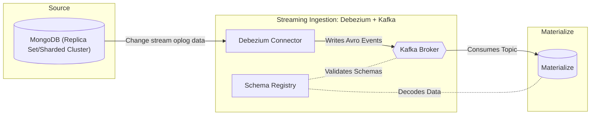

# Ingest data

Best practices for ingesting data into Materialize from external systems.


You can ingest data into Materialize from various external systems:



## Sources and clusters

Materialize ingests data from external systems using
[sources](/concepts/sources/). For the sources, you need to associate a
[cluster](/concepts/clusters/) to provide the compute resources needed to ingest
data.

{}

If possible, dedicate a cluster just for sources.

{}

## Snapshotting

When a new source is created, Materialize performs a sync of all data available
in the external system before it starts ingesting new data — an operation known
as _snapshotting_. Because the initial snapshot is persisted in the storage
layer atomically (i.e., at the same ingestion timestamp), you are **not able to
query the source until snapshotting is complete**.

### Duration

The duration of the snapshotting operation depends on the volume of data in the
initial snapshot and the size of the cluster where the source is hosted. To
reduce the operational burden of snapshotting on the upstream system and ensure
you are only bringing in the volume of data that you need in Materialize, we
recommend:

- If possible, running source creation operations during **off-peak hours** to
  minimize operational risk in both the upstream system and Materialize.

- **Limiting the volume of data** that is synced into Materialize on source
  creation. This will help speed up snapshotting, as well as make data
  exploration more lightweight. See [Limit the volume of
  data](#limit-the-volume-of-data) for best practices.

- **For upsert sources**, overprovisioning the source cluster for snapshotting,
  then right-sizing once the snapshot is complete and you have a better grasp on
  the steady-state resource needs of your upsert source(s). See [Best practices:
  Upsert sources](#upsert-sources).

### Monitoring progress

While snapshotting is taking place, you can monitor the progress of the
operation in the **overview page** for the source in the [Materialize
Console](/console/data/#sample-source-overview). Alternatively, you can manually
keep track of using information from the system catalog. See [Monitoring the
snapshotting
progress](/ingest-data/monitoring-data-ingestion/#monitoring-the-snapshotting-progress)
for guidance.

It's also important to **monitor CPU and memory utilization** for the cluster
hosting the source during snapshotting. If there are signs of resource
exhaustion, you may need to [resize the cluster](#use-a-larger-cluster-for-upsert-source-snapshotting).

### Queries during snapshotting

Because the initial snapshot is persisted atomically, you are **not able to
query the source until snapshotting is complete**. This means that queries
issued against (sub)sources undergoing snapshotting will hang until the
operation completes. Once the initial snapshot has been ingested, you can start
querying your (sub)sources and Materialize will continue ingesting any new data
as it arrives, in real time.

### Modifying an existing source



## Running/steady-state

Once snapshotting completes, Materialize transitions to Running state. During
this state, Materialize continually ingests changes from the upstream system.

### Queries during steady-state

Although Materialize is continually ingesting changes from the upstream system,
depending on the volume of the upstream changes, Materialize may lag behind the
upstream system. If the lag is significant, queries may block until Materialize
has caught up sufficiently with the upstream system when using the default
[isolation level](/get-started/isolation-level/) of [strict
serializability](/get-started/isolation-level/#strict-serializable).

In the Materialize Console, you can see a source's data freshness from the
**Data Explorer** screen. Alternatively, you can run a query to monitor the lag.
See [Monitoring hydration/data freshness status](/ingest-data/monitoring-data-ingestion/#monitoring-hydrationdata-freshness-status).

## Hydration

When a cluster is restarted (such as after resizing), certain objects on that
cluster  (such as sources, indexes, materialized views, and sinks) undergo
hydration. Hydration refers to the reconstruction of in-memory state by reading
data from Materialize's storage layer; hydration **does not** require reading
data from the upstream system.

{}

If possible, use a dedicated cluster just for sources. That is, avoid
using the same cluster for sources and other objects, such as sinks, etc.

See [Best practices](#best-practices) for more details.

{}

### Process

During hydration, data from Materialize's storage layer is read to reconstruct
the in-memory state of the object. As part of the hydration process:

- Internal data structures are re-created.

- Various processes are re-initiated. These processes may also require
  re-reading of their in-memory state.

### Duration

For a source, the duration of its hydration depends on the type and the size
of the source; e.g., large `UPSERT` sources can take hours to complete.

### Queries during hydration

During hydration, queries usually block until the process has been completed.

## Best practices

The following lists some general best practice guidelines as well as additional
guidelines for upsert sources.

### Scheduling

{}

### Dedicate a cluster for the sources

If possible, dedicate a cluster just for sources. That is, avoid using the same
cluster for sources and sinks/indexes/materialized views (and other compute objects).

### Limit the volume of data

If possible, limit the volume of data that needs to be synced into Materialize
on source creation. This will help speed up snapshotting as well as make data
exploration more lightweight.

For example, when creating a PostgreSQL source, you may want to create a
publication with specific tables rather than for all tables in the database.

### Upsert sources

In addition to the general best practices, the following additional best
practices apply to upsert sources.

#### Use a larger cluster for upsert source snapshotting

When you create a new source, Materialize performs a one-time [snapshotting
operation](#snapshotting) to initially populate the source in Materialize. For
upsert sources, snapshotting is a resource-intensive operation that can require
a significant amount of CPU and memory.

Consider using a [larger cluster size](/sql/alter-cluster/#alter-cluster-size)
during snapshotting for upsert sources. Once the snapshotting operation is
complete, you can downsize the cluster to align with the steady-state ingestion.

If the cluster hosting the source restarts during snapshotting (e.g., because it
ran out of memory), you can scale up to a [larger
size](/sql/alter-cluster/#alter-cluster-size) to complete the operation.



#### Right-size the cluster for steady-state

Once the initial snapshot has completed, you can
[resize](/sql/alter-cluster/#resizing)  the cluster
to align with the volume of changes being replicated from your upstream in
steady-state.

```sql
ALTER CLUSTER <cluster_name> SET ( SIZE = <new_size> );
```

{}

Resizing a cluster with sources requires the cluster to restart. This operation
incurs downtime for the duration it takes for all objects in the cluster to
[hydrate](#hydration).

You might want to let the new-sized replica hydrate before shutting down the
current replica. See [zero-downtime cluster
resizing](/sql/alter-cluster/#zero-downtime-cluster-resizing) about automating
this process.

{}


## See also

- [Monitoring data ingestion](/ingest-data/monitoring-data-ingestion)
- [Troubleshooting data ingestion](/ingest-data/troubleshooting)


---

## Amazon EventBridge


This guide walks through the steps to ingest data from [Amazon EventBridge](https://aws.amazon.com/eventbridge/)
into Materialize using the [Webhook source](/sql/create-source/webhook/).





## Before you begin

Ensure that you have:

- An [EventBridge-enabled Amazon Simple Storage Service (S3) bucket](https://docs.aws.amazon.com/AmazonS3/latest/user-guide/Welcome.html).

## Step 1. (Optional) Create a cluster


If you are prototyping and already have a cluster to host your webhook
source (e.g. `quickstart`), **you can skip this step**. For production
scenarios, we recommend separating your workloads into multiple clusters for
[resource isolation](/sql/create-cluster/#resource-isolation).


To create a cluster in Materialize, use the [`CREATE CLUSTER` command](/sql/create-cluster):

```mzsql
CREATE CLUSTER webhooks_cluster (SIZE = '25cc');

SET CLUSTER = webhooks_cluster;
```

## Step 2. Create a secret

To validate requests between Amazon EventBridge and Materialize, you must create
a [secret](/sql/create-secret/):

```mzsql
CREATE SECRET eventbridge_webhook_secret AS '<secret_value>';
```

Change the `<secret_value>` to a unique value that only you know and store it in
a secure location.

## Step 3. Set up a webhook source

Using the secret from the previous step, create a [webhook source](/sql/create-source/webhook/)
in Materialize to ingest data from Amazon EventBridge. By default, the source
will be created in the active cluster; to use a different cluster, use the `IN
CLUSTER` clause.

```mzsql
CREATE SOURCE eventbridge_source
FROM WEBHOOK
  BODY FORMAT JSON
  -- Include all headers, but filter out the secret.
  INCLUDE HEADERS ( NOT 'x-mz-api-key' )
  CHECK (
    WITH ( HEADERS, SECRET eventbridge_webhook_secret AS validation_secret)
    -- The constant_time_eq validation function **does not support** fully
    -- qualified secret names. We recommend always aliasing the secret name
    -- for ease of use.
    constant_time_eq(headers->'x-mz-api-key', validation_secret)
  );
```

After a successful run, the command returns a `NOTICE` message containing the
unique [webhook URL](/sql/create-source/webhook/#webhook-url)
that allows you to `POST` events to the source. Copy and store it. You will need
it for the next step.

The URL will have the following format:

```
https://<HOST>/api/webhook/<database>/<schema>/<src_name>
```

If you missed the notice, you can find the URLs for all webhook sources in the
[`mz_internal.mz_webhook_sources`](/sql/system-catalog/mz_internal/#mz_webhook_sources)
system table.

### Access and authentication


Without a `CHECK` statement, **all requests will be accepted**. To prevent bad
actors from injecting data into your source, it is **strongly encouraged** that
you define a `CHECK` statement with your webhook sources.


The above webhook source uses [basic authentication](https://developer.mozilla.org/en-US/docs/Web/HTTP/Authentication#basic_authentication_scheme).
This enables a simple and rudimentary way to grant authorization to your webhook source.

### Throughput

If your throughput exceeds the [maximum request rate](/sql/create-source/webhook/#request-limits),
we recommend [batching multiple events](/sql/create-source/webhook/#handling-batch-events)
into a single request, for example using [EventBridge Pipes](https://docs.aws.amazon.com/eventbridge/latest/userguide/eb-pipes-batching-concurrency.html).

## Step 4. Create an API destination in Amazon EventBridge

[//]: # "TODO(morsapaes) This needs to be broken down into instructions, same as
the other guides."

For guidance on creating an API destination in Amazon EventBridge to connect to
Materialize, check out [this guide](https://docs.aws.amazon.com/eventbridge/latest/userguide/eb-tutorial-datadog.html).
Use the secret created in **Step 2.** as the **API key name** for request
validation.

## Step 5. Validate incoming data

With the source set up in Materialize and the API destination configured in
Amazon EventBridge, you can now query the incoming data:

1. [In the Materialize console](/console/), navigate to
   the **SQL Shell**.

1. Use SQL queries to inspect and analyze the incoming data:

    ```mzsql
    SELECT * FROM eventbridge_source LIMIT 10;
    ```

## Step 6. Transform incoming data

### JSON parsing

Webhook data is ingested as a JSON blob. We recommend creating a parsing view on
top of your webhook source that uses [`jsonb` operators](/sql/types/jsonb/#operators)
to map the individual fields to columns with the required data types.



### Timestamp handling

We highly recommend using the [`try_parse_monotonic_iso8601_timestamp`](/transform-data/patterns/temporal-filters/#temporal-filter-pushdown)
function when casting from `text` to `timestamp`, which enables [temporal filter
pushdown](/transform-data/patterns/temporal-filters/#temporal-filter-pushdown).

### Deduplication

With the vast amount of data processed and potential network issues, it's not
uncommon to receive duplicate records. You can use the `DISTINCT ON` clause to
efficiently remove duplicates. For more details, refer to the webhook source
[reference documentation](/sql/create-source/webhook/#handling-duplicated-and-partial-events).

## Next steps

With Materialize ingesting your Amazon EventBridge data, you can start exploring it,
computing real-time results that stay up-to-date as new data arrives, and
serving results efficiently. For more details, check out the
[Amazon EventBridge documentation](https://docs.aws.amazon.com/eventbridge/) and the
[webhook source reference documentation](/sql/create-source/webhook/).


---

## AWS PrivateLink connections (Cloud-only)


Materialize can connect to a Kafka broker, a Confluent Schema Registry server, a
PostgreSQL database, or a MySQL database through an [AWS PrivateLink](https://aws.amazon.com/privatelink/)
service.

In this guide, we'll cover how to create `AWS PRIVATELINK` connections and
retrieve the AWS principal needed to configure the AWS PrivateLink service.

## Create an AWS PrivateLink connection





Materialize provides a Terraform module that automates the creation and
configuration of AWS resources for a PrivateLink connection. For more details,
see the Terraform module repositories for [Amazon MSK](https://github.com/MaterializeInc/terraform-aws-msk-privatelink)
and [self-managed Kafka clusters](https://github.com/MaterializeInc/terraform-aws-kafka-privatelink).


{}






Materialize provides a Terraform module that automates the creation and
configuration of AWS resources for a PrivateLink connection. For more details,
see the [Terraform module repository](https://github.com/MaterializeInc/terraform-aws-rds-privatelink).


{}






Materialize provides a Terraform module that automates the creation and
configuration of AWS resources for a PrivateLink connection. For more details,
see the [Terraform module repository](https://github.com/MaterializeInc/terraform-aws-rds-privatelink).


{}





## Related pages

- [`CREATE SECRET`](/sql/create-secret)
- [`CREATE CONNECTION`](/sql/create-connection)
- [`CREATE SOURCE`: Kafka](/sql/create-source/kafka)
- Integration guides: [Self-hosted
  PostgreSQL](/ingest-data/postgres/self-hosted/), [Amazon RDS for
  PostgreSQL](/ingest-data/postgres/amazon-rds/), [Self-hosted
  Kafka](/ingest-data/kafka/kafka-self-hosted), [Amazon
  MSK](/ingest-data/kafka/amazon-msk), [Redpanda
  Cloud](/ingest-data/redpanda/redpanda-cloud/)


---

## CockroachDB CDC using Kafka and Changefeeds






Change Data Capture (CDC) allows you to track and propagate changes in a
CockroachDB database to downstream consumers. In this guide, we’ll cover how to
use Materialize to create and efficiently maintain real-time views with
incrementally updated results on top of CockroachDB CDC data.

[//]: # "TODO(morsapaes) Add Before you begin section for consistency and
details like the minimum required Cockroach version to follow this."

## A. Configure CockroachDB

### 1. Enable rangefeeds

[//]: # "TODO(morsapaes) Add more detailed steps and best practices, including
checking if rangefeeds are already enabled (true for CockroachDB serverless),
creating a dedicated user for replication, granting it the appropriate
permissions, using CDC queries to reduce the amount of data sent over the wire,
and so on."

As a first step, you must ensure [rangefeeds](https://www.cockroachlabs.com/docs/stable/create-and-configure-changefeeds#enable-rangefeeds)
are enabled in your CockroachDB instance so you can create changefeeds for the
tables you want to replicate to Materialize.

1. As a user with the `admin` role, enable the `kv.rangefeed.enabled`
   [cluster setting](https://www.cockroachlabs.com/docs/stable/set-cluster-setting):

   ```sql
   SET CLUSTER SETTING kv.rangefeed.enabled = true;
   ```

### 2. Configure per-table changefeeds

[//]: # "TODO(morsapaes) Instructions to create a changefeed vary depending on
whether users are on CockroachDB core or enterprise."

[Changefeeds](https://www.cockroachlabs.com/docs/stable/change-data-capture-overview)
capture row-level changes resulting from `INSERT`, `UPDATE`, and `DELETE`
operations against CockroachDB tables and publish them as events to Kafka
(or other Kafka API-compatible broker). You can then use the [Kafka source](/sql/create-source/kafka/#using-debezium)
to consume these changefeed events into Materialize, making the data available
for transformation.

1. [Create a changefeed](https://www.cockroachlabs.com/docs/stable/create-and-configure-changefeeds?)
   for each table you want to replicate:

   ```sql
   CREATE CHANGEFEED FOR TABLE my_table
     INTO 'kafka://broker:9092'
     WITH format = avro,
       confluent_schema_registry = 'http://registry:8081',
       diff,
       envelope = wrapped
   ```

   We recommend creating changefeeds using the Avro format (`format = avro`) and
   the default [diff envelope](https://www.cockroachlabs.com/docs/v24.3/create-changefeed#envelope)
   (`envelope = wrapped`), which is compatible with the message format
   Materialize expects. Each table will produce data to a dedicated Kafka
   topic, which can then be consumed by Materialize.


For detailed instructions on configuring your CockroachDB instance for CDC,
refer to the [CockroachDB documentation](https://www.cockroachlabs.com/docs/stable/create-changefeed).

## B. Ingest data in Materialize

### 1. (Optional) Create a cluster


If you are prototyping and already have a cluster to host your Kafka
source (e.g. `quickstart`), **you can skip this step**. For production
scenarios, we recommend separating your workloads into multiple clusters for
[resource isolation](/sql/create-cluster/#resource-isolation).


{}

### 2. Create a connection


Now that you've created an ingestion cluster, you can connect Materialize to
your Kafka broker and start ingesting data. The exact steps depend on your
authentication and networking configurations, so refer to the
[`CREATE CONNECTION`](/sql/create-connection/#kafka) documentation for further
guidance.

1. In the [SQL Shell](/console/), or your preferred SQL
   client connected to Materialize, use the [`CREATE SECRET`](/sql/create-secret/)
   command to securely store the credentials to connect to your Kafka broker
   and, optionally, schema registry:

    ```mzsql
    CREATE SECRET kafka_ssl_key AS '<BROKER_SSL_KEY>';
    CREATE SECRET kafka_ssl_crt AS '<BROKER_SSL_CRT>';
    CREATE SECRET csr_password AS '<CSR_PASSWORD>';
    ```

1. Use the [`CREATE CONNECTION`](/sql/create-connection/#kafka) command to create
   a connection object with access and authentication details for Materialize to
   use:

    ```mzsql
    CREATE CONNECTION kafka_connection TO KAFKA (
      BROKER '<host>',
      SSL KEY = SECRET kafka_ssl_key,
      SSL CERTIFICATE = SECRET kafka_ssl_crt
    );
    ```

    If you're using a schema registry, create an additional connection object:

    ```mzsql
    CREATE CONNECTION csr_connection TO CONFLUENT SCHEMA REGISTRY (
      URL '<csr_url>',
      SSL KEY = SECRET csr_ssl_key,
      SSL CERTIFICATE = SECRET csr_ssl_crt,
      USERNAME = 'foo',
      PASSWORD = SECRET csr_password
    );
    ```

### 3. Start ingesting data

1. Use the [`CREATE SOURCE`](/sql/create-source/) command to connect Materialize
   to your Kafka broker and start ingesting data from the target topic:

   ```mzsql
   CREATE SOURCE kafka_repl
     IN CLUSTER ingest_kafka
     FROM KAFKA CONNECTION kafka_connection (TOPIC 'my_table')
     -- CockroachDB's default envelope structure for changefeed messages is
     -- compatible with the Debezium format, so you can use ENVELOPE DEBEZIUM
     -- to interpret the data.
     ENVELOPE DEBEZIUM;
   ```

    By default, the source will be created in the active cluster; to use a
    different cluster, use the `IN CLUSTER` clause.

### 4. Monitor the ingestion status

{}

### 5. Create a view

{}

### 6. Create an index on the view

{}

## Next steps

With Materialize ingesting your CockroachDB data into durable storage, you can
start exploring the data, computing real-time results that stay up-to-date as
new data arrives, and serving results efficiently.

- Explore your data with [`SHOW SOURCES`](/sql/show-sources) and [`SELECT`](/sql/select/).

- Compute real-time results in memory with [`CREATE VIEW`](/sql/create-view/)
  and [`CREATE INDEX`](/sql/create-index/) or in durable
  storage with [`CREATE MATERIALIZED VIEW`](/sql/create-materialized-view/).

- Serve results to a PostgreSQL-compatible SQL client or driver with [`SELECT`](/sql/select/)
  or [`SUBSCRIBE`](/sql/subscribe/) or to an external message broker with
  [`CREATE SINK`](/sql/create-sink/).

- Check out the [tools and integrations](/integrations/) supported by
  Materialize.


---

## Debezium


You can use [Debezium](https://debezium.io/) to propagate Change Data Capture
(CDC) data to Materialize from databases that are not supported via native
connectors. For PostgreSQL and MySQL databases, we **strongly recommend** using
the native [PostgreSQL](/sql/create-source/postgres/) and [MySQL](/sql/create-source/mysql/)
sources instead.

| Database   | Natively supported? | Integration guide                                                                              |
|------------|---------------------| ---------------------------------------------------------------------------------------------- |
| PostgreSQL | ✓                   | {}                                                    |
| MySQL      | ✓                   | {}                                                       |
| SQL Server | ✓                   | {}                                                  |
| Oracle     |                     | [Kafka + Debezium](https://debezium.io/documentation/reference/stable/connectors/oracle.html)  |
| MongoDB    |                     | [Kafka + Debezium](/ingest-data/mongodb/) |

### Using Debezium

For databases that are not yet natively supported, like Oracle, SQL Server, or
MongoDB, you can use [Debezium](https://debezium.io/) to propagate Change Data
Capture (CDC) data to Materialize.



Debezium captures row-level changes resulting from `INSERT`, `UPDATE`, and
`DELETE` operations in the upstream database and publishes them as events to
Kafka (and other Kafka API-compatible brokers) using Kafka Connect-compatible
connectors. For more details on CDC support in Materialize, check the
[Kafka source](/sql/create-source/kafka/#using-debezium) reference
documentation.


---

## Fivetran




[Fivetran](https://www.fivetran.com/) is a cloud-based automated data movement platform for
extracting, loading and transforming data from a wide variety of connectors.

You can use Fivetran to sync data into Materialize for the following use cases:
- To sync data from SaaS applications or platforms, such as HubSpot, Shopify, or Stripe.
- To sync data from event streaming sources, such as Kinesis or Google Pub/Sub.
- To sync data from other data warehouses, such as Snowflake, Databricks, or Oracle.

For relational databases like PostgreSQL or MySQL, and event streaming sources like Apache Kafka,
you should prefer to use [Materialize native sources](/sql/create-source/).

## Before you begin
### Terminology
Fivetran syncs data from what they call
[sources](https://fivetran.com/docs/getting-started/glossary#source) to what they call
[destinations](https://fivetran.com/docs/getting-started/glossary#destination). Users create
[connectors](https://fivetran.com/docs/getting-started/glossary#connector) to configure the data
pipelines that repeatedly sync the data from each source to the destination at a scheduled cadence.

In this setup, Materialize is the destination. The source is whichever data source you're syncing
into Materialize, such as Hubspot or Shopify.

### Prerequisites
Ensure that you have:
- An active [Fivetran](https://www.fivetran.com/) account with
[permission to add destinations and connectors](https://fivetran.com/docs/using-fivetran/fivetran-dashboard/account-management/role-based-access-control#legacyandnewrbacmodel).
- For the Materialize user that you're using to connect to Fivetran,
[`CREATE`](/security/appendix/appendix-privileges/) privileges on the
target database in Materialize.

## Setup guide
### Step 1: Create the Materialize destination
Follow this
[Materialize-authored guide in the Fivetran docs](https://fivetran.com/docs/destinations/materialize/setup-guide#materializesetupguide) to set up Materialize as a destination in Fivetran.

### Step 2: Create the connector(s)
Follow the
[Fivetran guide on connectors](https://fivetran.com/docs/using-fivetran/fivetran-dashboard/connectors#overview)
to set up your connector(s). Choose your newly created Materialize destination as the destination
for the connector.

Schema changes to existing tables is not currently supported. When creating a Connector you should
select the option to
["Block all" schema changes](https://fivetran.com/docs/using-fivetran/fivetran-dashboard/connectors/schema#defineschemachangehandlingsettings).

You can see the full list of available [Fivetran connectors](https://fivetran.com/docs/connectors)
in their docs.

## Other setup information
### Type transformation mapping
As we extract your data, we match Fivetran data types to types that Materialize supports. If we don't
support a specific data type, we automatically change that type to the closest supported data type.

The data types in Materialize follow Fivetran's standard data type storage.

The following table illustrates how we transform Fivetran data types into Materialize-supported
types:

| FIVETRAN DATA TYPE | MATERIALIZE DATA TYPE |
|--------------------|-----------------------|
| BOOLEAN            | BOOLEAN               |
| SHORT              | INT16                 |
| INT                | INT32                 |
| LONG               | INT64                 |
| BIGDECIMAL         | DOUBLE                |
| FLOAT              | FLOAT                 |
| DOUBLE             | DOUBLE                |
| LOCALDATE          | DATE                  |
| LOCALDATETIME      | TIMESTAMP             |
| INSTANT            | TIMESTAMP             |
| STRING             | STRING                |
| JSON               | JSONB                 |
| BINARY             | STRING                |
| XML                | Unsupported           |

----

### Sync frequency
The highest sync frequency Fivetran offers is 1 minute for Enterprise and Business Critical plans,
and 5 minutes for all other plans. The lowest sync frequency is 24 hours. You can read more about
sync scheduling in the
[Fivetran docs](https://fivetran.com/docs/core-concepts/syncoverview#syncfrequencyandscheduling).


---

## HubSpot


This guide walks through the steps to ingest data from [HubSpot](https://www.hubspot.com/)
into Materialize using the [Webhook source](/sql/create-source/webhook/).





### Before you begin

Ensure that you have:

- A HubSpot account with an [Operations Hub subscription](https://www.hubspot.com/pricing/operations).

## Step 1. (Optional) Create a cluster


If you are prototyping and already have a cluster to host your webhook
source (e.g. `quickstart`), **you can skip this step**. For production
scenarios, we recommend separating your workloads into multiple clusters for
[resource isolation](/sql/create-cluster/#resource-isolation).


To create a cluster in Materialize, use the [`CREATE CLUSTER` command](/sql/create-cluster):

```mzsql
CREATE CLUSTER webhooks_cluster (SIZE = '25cc');

SET CLUSTER = webhooks_cluster;
```

## Step 2. Create a secret

To validate requests between HubSpot and Materialize, you must create a [secret](/sql/create-secret/):

```mzsql
CREATE SECRET hubspot_webhook_secret AS '<secret_value>';
```

Change the `<secret_value>` to a unique value that only you know and store it in
a secure location.

## Step 3. Set up a webhook source

Using the secret the previous step, create a [webhook source](/sql/create-source/webhook/)
in Materialize to ingest data from HubSpot. By default, the source will be
created in the active cluster; to use a different cluster, use the `IN
CLUSTER` clause.

```mzsql
CREATE SOURCE hubspot_source
  FROM WEBHOOK
    BODY FORMAT JSON
    CHECK (
      WITH (
        HEADERS,
        BODY AS body,
        SECRET hubspot_webhook_secret AS validation_secret
      )
      -- The constant_time_eq validation function **does not support** fully
      -- qualified secret names. We recommend always aliasing the secret name
      -- for ease of use.
      constant_time_eq(headers->'authorization', validation_secret)
);
```

After a successful run, the command returns a `NOTICE` message containing the
unique [webhook URL](/sql/create-source/webhook/#webhook-url)
that allows you to `POST` events to the source. Copy and store it. You will need
it for the next step.

The URL will have the following format:

```
https://<HOST>/api/webhook/<database>/<schema>/<src_name>
```

If you missed the notice, you can find the URLs for all webhook sources in the
[`mz_internal.mz_webhook_sources`](/sql/system-catalog/mz_internal/#mz_webhook_sources)
system table.

### Access and authentication


Without a `CHECK` statement, **all requests will be accepted**. To prevent bad
actors from injecting data into your source, it is **strongly encouraged** that
you define a `CHECK` statement with your webhook sources.


The `CHECK` clause defines how to validate each request. At the time of writing,
HubSpot supports API key authentication, which you can use to validate
requests.

The above webhook source uses [basic authentication](https://developer.mozilla.org/en-US/docs/Web/HTTP/Authentication#basic_authentication_scheme).
This enables a simple and rudimentary way to grant authorization to your webhook
source.

## Step 4. Create a webhook workflow in HubSpot

A [webhook in HubSpot](https://knowledge.hubspot.com/workflows/how-do-i-use-webhooks-with-hubspot-workflows)
is a workflow action that sends data to a webhook URL. You can create a webhook
workflow in HubSpot to send data to the webhook source you created in the
previous step.

1. In HubSpot, go to **Automation > Workflows**.

1. Click the **Name** of the workflow you want to add the webhook to, or create a new one.

1. Click the **+** icon to add an action.

1. In the right panel, search for **Send a webhook**.

1. Click the **Method** dropdown menu, then select `POST`.

1. Enter the URL from **Step 3.**.

1. Authenticate the request using the **API key** option. Use the secret created in **Step 2.**.

1. For the **API Key Name**, enter `authorization`. This is the key used in the `CHECK` clause of the webhook source.

1. Click **Save**.

## Step 5. Configure the request body in HubSpot

The request body is the data that HubSpot sends to the webhook URL. You can
configure the request body to send the data you want to ingest into
Materialize.

1. In HubSpot, go to the webhook workflow created in **Step 4.**.

1. Go to the **Request body** section, and click **Customize request body**.

1. In the **Request body** section, click **Add property**.

1. From the dropdown menu, select the property you want to send to Materialize.
   Repeat this step for each property you want to send to Materialize.

1. Click **Test Mapping** to validate that the webhook is working. If **Test Mapping** fails and throws a `failed to validate the request` error, this means that the secret is not correct. To fix this:

    1. In **HubSpot**, go to the webhook workflow.
    1. Go to the **Authentication** section.
    1. Enter the secret created in **Step 2.**.
    1. Verify that the **API Key Name** is `authorization`.
    1. Click **Save**.

1. After a succesful test, click **Save**.

## Step 6. Validate incoming data

With the source set up in Materialize and the webhook workflow configured in
HubSpot, you can now query the incoming data:

1. [In the Materialize console](/console/), navigate to
   the **SQL Shell**.

1. Use SQL queries to inspect and analyze the incoming data:

    ```mzsql
    SELECT * FROM hubspot_source LIMIT 10;
    ```

## Step 7. Transform incoming data

### JSON parsing

Webhook data is ingested as a JSON blob. We recommend creating a parsing view on
top of your webhook source that uses [`jsonb` operators](/sql/types/jsonb/#operators)
to map the individual fields to columns with the required data types.

```mzsql
CREATE VIEW parse_hubspot AS SELECT
    body->>'city' AS city,
    body->>'firstname' AS firstname,
    body->>'ip_city' AS ip_city,
    -- Add all of the fields you want to ingest
FROM hubspot_source;
```



### Timestamp handling

We highly recommend using the [`try_parse_monotonic_iso8601_timestamp`](/transform-data/patterns/temporal-filters/#temporal-filter-pushdown)
function when casting from `text` to `timestamp`, which enables [temporal filter
pushdown](/transform-data/patterns/temporal-filters/#temporal-filter-pushdown).

### Deduplication

With the vast amount of data processed and potential network issues, it's not
uncommon to receive duplicate records. You can use the `DISTINCT ON` clause to
efficiently remove duplicates. For more details, refer to the webhook source
[reference documentation](/sql/create-source/webhook/#handling-duplicated-and-partial-events).

## Next steps

With Materialize ingesting your HubSpot data, you can start exploring it,
computing real-time results that stay up-to-date as new data arrives, and
serving results efficiently. For more details, check out the
[HubSpot documentation](https://knowledge.hubspot.com/workflows/how-do-i-use-webhooks-with-hubspot-workflows) and the
[webhook source reference documentation](/sql/create-source/webhook/).


---

## Kafka


Materialize provides native connector for Kafka message broker. To ingest data
from Kafka, you need to

1. Create a connection that specifies access and authentication parameters.
2. Create a source that specifies the format of the data you want to ingest.

## Supported versions

The Kafka source supports **Kafka 3.2+** and is compatible with most common Kafka hosted services, including all supported versions of the [Confluent Platform](https://docs.confluent.io/platform/current/installation/versions-interoperability.html).

## Formats

Materialize can decode incoming bytes of data from several formats:

- Avro
- Protobuf
- CSV
- Plain text
- Raw bytes
- JSON

## Envelopes

What Materialize actually does with the data it receives depends on the
"envelope" your data provides:

Envelope | Action
---------|-------
**Append-only** | Inserts all received data; does not support updates or deletes.
**Debezium** | Treats data as wrapped in a "diff envelope" that indicates whether the record is an insertion, deletion, or update. The Debezium envelope is only supported by sources published to Kafka by [Debezium].<br/><br/>For more information, see [`CREATE SOURCE`: Kafka - Using Debezium](/sql/create-source/kafka/#using-debezium).
**Upsert** | Treats data as having a key and a value. New records with non-null value that have the same key as a preexisting record in the dataflow will replace the preexisting record. New records with null value that have the same key as preexisting record will cause the preexisting record to be deleted. <br/><br/>For more information, see [`CREATE SOURCE`: Kafka - Handling upserts](/sql/create-source/kafka/#handling-upserts).


## Integration guides

- [Amazon MSK](/ingest-data/kafka/amazon-msk/)
- [Confluent Cloud](/ingest-data/kafka/confluent-cloud/)
- [Self-hosted Kafka](/ingest-data/kafka/kafka-self-hosted/)
- [Warpstream](/ingest-data/kafka/warpstream/)

## See also

- [Redpanda Cloud](/ingest-data/redpanda/redpanda-cloud/)
- [Redpanda Self-hosted](/ingest-data/redpanda/)


---

## MongoDB


Using Change Data Capture (CDC), you can track and propagate changes from
MongoDB to downstream consumers. This guide outlines how to ingest data from a
MongoDB replica set (`rs0`) into Materialize; specifically from the collections
`items` and `orders` in the `test` database.

## High-level architecture



The architecture consists of the following components:

- **Source Component: MongoDB**
  - **MongoDB**: MongoDB must be deployed as a **replica set** or **a sharded
  cluster** to generate an oplog (operations log), which records all data
  modifications. To deploy as a replica set or a sharded cluster, refer to the
  official MongoDB documentation on [replica
  sets](https://www.mongodb.com/docs/manual/replication/) and [sharded
  clusters](https://www.mongodb.com/docs/manual/sharding/).

- **Streaming Ingestion Component: Debezium + Kafka (with Schema Registry)**
  - **Debezium:** A connector that [obtains the oplog data via MongoDB change
    streams](https://debezium.io/documentation//reference/stable/connectors/mongodb.html#change-streams).
  - **Kafka & Schema Registry:** The streaming transport layer. Debezium pushes
    the events to a Kafka topic, while the Schema Registry ensures the data
    structure (schema) is consistent and readable.

- **Materialize:** Materialize uses connects to Kafka to ingests data from
  MongoDB.

## Prerequisites

- **MongoDB:** Version 6.0 or later. Must be deployed as a [**replica
  set**](https://www.mongodb.com/docs/manual/replication/) or a [**sharded
  cluster**](https://www.mongodb.com/docs/manual/sharding/).

- **Kafka Cluster:** A running Kafka broker and Schema Registry (e.g.,
  Confluent Platform or Redpanda).

- **Debezium Connect:** Version 2.5.4+ or later. A Kafka Connect cluster with
  the MongoDB connector plugin installed.

## A. Create a Debezium user in MongoDB.


For Debezium to capture changes, your MongoDB deployment must be configured as a
replica set or a sharded cluster.


Create a user (e.g., `debezium_materialize_user`) with the necessary permissions
to read from the database. Depending on the connector's
[`capture.scope`](https://debezium.io/documentation/reference/stable/connectors/mongodb.html#required-user-permissions)
property, the user may need `read` on a specific database or all databases.

For this guide, the example will ingest `items` and `orders` collections in the
`test` database.  As such, the example uses `capture.scope` of `database` to
read from the `test` database only:

```javascript
db.getSiblingDB("test").createUser({
    user: "debezium_materialize_user",
    pwd: passwordPrompt(),         // Or  "<cleartext password>"
    roles: [
      { role: "read", db: "test" }
    ]
});
```

For simplicity, the user is created in the `test` database; however, the user
can be created in a different database.

## B. Configure the streaming layer

The streaming layer requires Kafka, Schema Registry, and Kafka Connect with the
Debezium MongoDB connector. If you have not set up these services, see:

- [Confluent Platform
  Quickstart](https://docs.confluent.io/platform/current/platform-quickstart.html)(*Recommended
  for Testing*): Docker-based setup  for Kafka, Schema Registry, and Kafka
  Connect.

- [Debezium
    Tutorial](https://debezium.io/documentation/reference/stable/tutorial.html):
    Example using Docker Compose.

  For this tutorial, ensure your Debezium container allows outbound traffic to
  your external MongoDB host.

### 1. Configure Kafka Connect worker

Configure your Kafka Connect worker to use Avro serialization for Schema
Registry integration; specifically, set the following environment
variables/properties are set on your Connect worker:

| Property | Value |
|----------|-------|
| `KEY_CONVERTER` | `io.confluent.connect.avro.AvroConverter` |
| `VALUE_CONVERTER` | `io.confluent.connect.avro.AvroConverter` |
| `CONNECT_KEY_CONVERTER_SCHEMA_REGISTRY_URL` | `http://schema-registry:8081` |
| `CONNECT_VALUE_CONVERTER_SCHEMA_REGISTRY_URL` | `http://schema-registry:8081` |

### 2. Configure the Debezium connector for MongoDB

Register the MongoDB connector with the following configuration:

| Parameter | Description |
|-----------|-------------|
| `name` | A unique name for the connector instance. |
| [`connector.class`](https://docs.confluent.io/kafka-connectors/debezium-mongodb-source/current/mongodb_source_connector_config.html) | The Debezium MongoDB connector class, `"io.debezium.connector.mongodb.MongoDbConnector"`. |
| [`mongodb.connection.string`](https://debezium.io/documentation/reference/stable/connectors/mongodb.html#mongodb-property-mongodb-connection-string) | Your [MongoDB connection string](https://www.mongodb.com/docs/manual/reference/connection-string-formats/) with the `debezium_materialize_user`.  |
| [`topic.prefix`](https://debezium.io/documentation/reference/stable/connectors/mongodb.html#mongodb-property-topic-prefix) | A unique prefix for Kafka topics. Topics are created as `<prefix>.<db>.<collection>`. **Recommended** Once set, do not change the value of this property. See the [official documentation](https://debezium.io/documentation/reference/stable/connectors/mongodb.html#mongodb-property-topic-prefix) for details. |
| [`collection.include.list`](https://debezium.io/documentation/reference/stable/connectors/mongodb.html#mongodb-property-collection-include-list) | Comma-separated list of collections to capture in the format `<db>.<collection>`, e.g., `"test.orders,test.items"`. |
| [`capture.mode`](https://debezium.io/documentation/reference/stable/connectors/mongodb.html#mongodb-property-capture-mode) | <red>**Must**</red> be `"change_streams_update_full"` (the default). This captures full document state on updates, which is required for Materialize's `UPSERT` envelope. |
| [`capture.scope`](https://debezium.io/documentation/reference/stable/connectors/mongodb.html#mongodb-property-capture-scope) | The scope of the change stream: `"database"` or `"deployment"`. This value affects the required MongoDB user permissions. |
| [`capture.target`](https://debezium.io/documentation/reference/stable/connectors/mongodb.html#mongodb-property-capture-target) | The database to monitor for changes. Required only when `capture.scope` is `"database"`. |
| [`transforms`](https://debezium.io/documentation/reference/stable/transformations/mongodb-event-flattening.html#mongodb-event-flattening-configuration) | Optional. Set to `"unwrap"` to extract the document state from Debezium's change event envelope. |
| [`transforms.unwrap.type`](https://debezium.io/documentation/reference/stable/transformations/mongodb-event-flattening.html#mongodb-event-flattening-configuration) | Optional. Set to `"io.debezium.connector.mongodb.transforms.ExtractNewDocumentState"` to use the MongoDB-specific unwrap transform. |


The `capture.mode` must be `change_streams_update_full`, the default. This
forces Debezium to send the entire document state for every change, which allows
Materialize to use the `UPSERT` envelope.


1. Create a `dbz_mongodb_connector.json` file with your connector configuration:

   ```json
   {
      "name": "mongodb-connector",
      "config": {
        "connector.class": "io.debezium.connector.mongodb.MongoDbConnector",
        "mongodb.connection.string": "mongodb://debezium_materialize_user:<associated_pwd>@host1:27017,host2:27017,host3:27017/?replicaSet=rs0&authSource=test",
        "topic.prefix": "mdb-prod-rs0",
        "collection.include.list": "test.orders,test.items",
        "capture.mode": "change_streams_update_full",
        "capture.scope": "database",
        "capture.target": "test",
        "transforms": "unwrap",
        "transforms.unwrap.type": "io.debezium.connector.mongodb.transforms.ExtractNewDocumentState"
      }
   }
   ```

   **Required updates:**
   - Update `mongodb.connection.string` with your [MongoDB connection
     string](https://www.mongodb.com/docs/manual/reference/connection-string-formats/)
     for the `debezium_materialize_user`. For example:

     - `"mongodb+srv://debezium_materialize_user:<associated_pwd>@host[/[defaultauthdb][?options]]"`
     - `"mongodb://debezium_materialize_user:<associated_pwd>@host1[:port1][,...hostN[:portN]]/?replicaSet=<replica_set_name>&authSource=test"`

   - Update `collection.include.list` with the collections you want to capture.

   - Update `topic.prefix` with unique prefix for your environment.

   **Optional modifications:**
   - `capture.scope`: To monitor changes across all databases, you  can change
      to `"deployment"` to monitor all databases (requires
     broader MongoDB permissions for your debezium user).
   - `capture.target`: Only needed if `capture.scope` is `"database"`.
   - `transforms` and `transforms.unwrap.type`: You can omit or customize.

   
   When using the `unwrap` transform of type `ExtractNewDocumentState` with
   MongoDB and Avro serialization, the Avro schema is inferred from the first
   document processed. Because MongoDB allows the same field to have
   different BSON types across documents, ensure that same field uses a
   consistent BSON type across the collection to avoid schema inference
   errors.

   For example, if the first document has `price: 40`, the registered Avro
   schema infers the `price` field type to be `int`. If a subsequent document
   has `price: 2.25` (a decimal value), it will cause a schema mismatch error.
   To avoid this, explicitly specify the BSON type in your documents using
   `NumberDecimal()`, e.g., `price: NumberDecimal("40.00")` and `price:
   NumberDecimal("2.25")`.

   If you cannot enforce a consistent BSON type, you can omit the unwrap.
   

2. Register the connector with Kafka Connect:

   ```bash
   curl -X POST -H "Content-Type:application/json" \
     http://<your-host>:8083/connectors \
     -d @dbz_mongodb_connector.json
   ```

   Replace `<your-host>` with your Kafka Connect hostname or IP address.


## C. Ingest data in Materialize

### 1. Create the Kafka and CSR connections.

In Materialize, Create the [Kafka connection](/sql/create-connection/#kafka) and the [Confluent
Schema Registry connection](/sql/create-connection/#confluent-schema-registry)


1. Create the [Kafka connection](/sql/create-connection/#kafka). For example,   if using `SASL_PLAINTEXT`:

   ```mzsql
    CREATE SECRET IF NOT EXISTS kafka_secret AS '<kafka-password>';

    CREATE CONNECTION IF NOT EXISTS kafka_connection TO KAFKA (
      BROKER '<kafka-bootstrap-server>:9092',
      SECURITY PROTOCOL = 'SASL_PLAINTEXT',
      SASL MECHANISMS = 'SCRAM-SHA-256',
      SASL USERNAME = '<kafka-SASL-username>',
      SASL PASSWORD = SECRET kafka_secret
    );
   ```

1. Create the [Confluent Schema Registry
connection](/sql/create-connection/#confluent-schema-registry):

   ```mzsql
   CREATE CONNECTION csr_connection TO CONFLUENT SCHEMA REGISTRY (
      URL 'http://schema-registry:8081'
   );
   ```

### 2. Start ingesting data

Create the sources for the specific Kafka topic
(`<topic.prefix>.<database>.<collection>`).

```mzsql
CREATE SOURCE mdb_items
FROM KAFKA CONNECTION kafka_connection (TOPIC 'mdb-prod-rs0.test.items')
FORMAT AVRO USING CONFLUENT SCHEMA REGISTRY CONNECTION csr_connection
ENVELOPE UPSERT;

CREATE SOURCE mdb_orders
FROM KAFKA CONNECTION kafka_connection (TOPIC 'mdb-prod-rs0.test.items')
FORMAT AVRO USING CONFLUENT SCHEMA REGISTRY CONNECTION csr_connection
ENVELOPE UPSERT;
```

### 3. Query the data

Query the data using standard SQL.

- To query the mdb_items:

  ```mzsql
  SELECT * FROM mdb_items;
  ```

  
  The query includes the Kafka message `id` field as a column in the table.
  

  ```none
              id            |           _id            | item_id |         item          | price | currency
  --------------------------+--------------------------+---------+-----------------------+-------+----------
  693c608a8de2a41c2ba365f3 | 693c608a8de2a41c2ba365f3 |       8 | donut                 | 1.25  | USD
  693c608a8de2a41c2ba365ec | 693c608a8de2a41c2ba365ec |       1 | brownie               | 2.25  | USD
  693c608a8de2a41c2ba365f2 | 693c608a8de2a41c2ba365f2 |       7 | cupcake               | 3.00  | USD
  693c608a8de2a41c2ba365f4 | 693c608a8de2a41c2ba365f4 |       9 | egg tart              | 2.50  | USD
  ```

  

  If you did not use the `unwrap` transform, the document is stored as a JSON
  string in the `after` field in `mdb_items`. You can create a [parsing
  view](/sql/types/jsonb/#parsing) to map the individual document fields to columns instead.

  

- To query the mdb_orders:

  ```mzsql
  SELECT * FROM mdb_orders;
  ```

  
  The query includes the Kafka message `id` field as a column in the table.
  

  ```none
              id            |           _id            | order_id |       order_date        |         item          | quantity |   status
  --------------------------+--------------------------+----------+-------------------------+-----------------------+----------+------------
  693c608a8de2a41c2ba365d4 | 693c608a8de2a41c2ba365d4 |        3 | 2025-12-12 18:05:54.648 | donut                 |       36 | Pending
  693c608a8de2a41c2ba365e3 | 693c608a8de2a41c2ba365e3 |        8 | 2025-12-10 18:50:54.648 | donut                 |       12 | Shipped
  693c608a8de2a41c2ba365cc | 693c608a8de2a41c2ba365cc |        1 | 2025-12-12 18:35:54.648 | brownie               |       10 | Pending
  693c608a8de2a41c2ba365d2 | 693c608a8de2a41c2ba365d2 |        2 | 2025-12-12 18:20:54.648 | brownie               |       20 | Pending
  ```

  

  If you did not use the `unwrap` transform, the document is stored as a JSON
  string in the `after` field in `mdb_orders`. You can create a [parsing
  view](/sql/types/jsonb/#parsing) to map the individual document fields to
  columns instead.

  

## Troubleshooting

See also: [Debezium documentation on the MongoDB
Connector](https://debezium.io/documentation/reference/stable/connectors/mongodb.html#mongodb-when-things-go-wrong)


---

## Monitoring data ingestion


## Monitoring the snapshotting progress

In the Materialize Console, the Overview page for the source displays the
snapshotting progress.


Alternatively, you can run a query to monitor its progress.

```sql
SELECT
	o.name,
	s.snapshot_records_staged,
	s.snapshot_records_known,
	round(100.0 * s.snapshot_records_staged / NULLIF(s.snapshot_records_known, 0), 2) AS snapshot_completed_pct
FROM mz_internal.mz_source_statistics AS s
INNER JOIN mz_objects AS o ON (s.id = o.id)
WHERE NOT s.snapshot_committed;
```

It's also important to monitor CPU and memory utilization for the cluster
hosting the source during snapshotting. If there are signs of resource
exhaustion, you may need to [resize the cluster](/sql/alter-cluster/#alter-cluster-size).

In the Materialize Console, the Overview page for the source displays the CPU
and memory utilization. See image above.

## Monitoring hydration/data freshness status

To monitor the hydration/data freshness status of a source (and its
sub-sources), in the Materialize Console, you can go to the Workflow page of a
source (or its sub-sources) to check for data freshness status; that is, whether
the source is **Up to date** or **Lagging**. If lagging, the page also displays
the lag amount.


Alternatively, you can run the following query:

```sql
SELECT
	s.name,
	h.hydrated
FROM mz_sources AS s
INNER JOIN mz_internal.mz_hydration_statuses AS h ON (s.id = h.object_id);
```

## Monitoring data lag

In the Materialize Console, you can go to the Workflow page of a
source (or its sub-sources) to check for data freshness status. If the source
(or its sub-sources) is lagging, its Workflow page displays **Lagging** status
as well as the lag amount.

Alternatively, the following query indicates the difference between the largest offset that is known from the external system and the last offset that has been processed (committed) by the source. The units depend on the source type.  you want `offset_delta` to be close to 0.

```sql
SELECT
	o.name,
	o.id,
	s.offset_committed,
	s.offset_known,
	s.offset_known - s.offset_committed AS offset_delta
FROM mz_internal.mz_source_statistics AS s
INNER JOIN mz_objects AS o ON (s.id = o.id)
WHERE s.snapshot_committed;
```

## Monitoring data ingestion progress

In the Materialize Console, you can go to the source overview page to view the
data ingestion progress (e.g., rows_received, bytes_received, ingestion rate).

Alternatively, you can query the
[`mz_source_statistics`](/sql/system-catalog/mz_internal/#mz_source_statistics)
table and look for ingestion statistics that advance over time:

```mzsql
SELECT
    bytes_received,
    messages_received,
    updates_staged,
    updates_committed
FROM mz_internal.mz_source_statistics
WHERE id = <SOURCE_ID>;
```

You can also look at statistics for individual worker threads to evaluate
whether ingestion progress is skewed, but it's generally simplest to start
by looking at the aggregate statistics for the whole source.

The `bytes_received` and `messages_received` statistics should roughly match the
external system's measure of progress. For example, the `bytes_received` and
`messages_received` fields for a Kafka source should roughly match the upstream
Kafka broker reports as the number of bytes (including the key) and number of
messages transmitted, respectively.

During the initial snapshot, `updates_committed` will remain at zero until all
messages in the snapshot have been staged. Only then will `updates_committed`
advance. This is expected, and not a cause for concern.

After the initial snapshot, there should be relatively little skew between
`updates_staged` and `updates_committed`. A large gap is usually an indication
that the source has fallen behind, and that you likely need to scale it up.

`messages_received` does not necessarily correspond with `updates_staged`
and `updates_commmited`. For example, a source with `ENVELOPE UPSERT` can have _more_
updates than messages, because messages can cause both deletions and insertions
(i.e. when they update a value for a key), which are both counted in the
`updates_*` statistics. There can also be _fewer_ updates than messages, as
many messages for a single key can be consolidated if they occur within a (small)
internally configured window. That said, `messages_received` making
steady progress while `updates_staged`/`updates_committed` doesn't is also
evidence that a source has fallen behind, and may need to be scaled up.

Beware that these statistics periodically reset to zero, as internal components
of the system restart. This is expected behavior. As a result, you should
restrict your attention to how these statistics evolve over time, and not their
absolute values at any moment in time.


---

## MySQL


## Change Data Capture (CDC)

Materialize supports MySQL as a real-time data source. The [MySQL source](/sql/create-source/mysql/)
uses MySQL's [binlog replication protocol](/sql/create-source/mysql/#change-data-capture)
to **continually ingest changes** resulting from CRUD operations in the upstream
database. The native support for MySQL Change Data Capture (CDC) in Materialize
gives you the following benefits:

* **No additional infrastructure:** Ingest MySQL change data into Materialize in
    real-time with no architectural changes or additional operational overhead.
    In particular, you **do not need to deploy Kafka and Debezium** for MySQL
    CDC.

* **Transactional consistency:** The MySQL source ensures that transactions in
    the upstream MySQL database are respected downstream. Materialize will
    **never show partial results** based on partially replicated transactions.

* **Incrementally updated materialized views:** Materialized views are **not
    supported in MySQL**, so you can use Materialize as a
    read-replica to build views on top of your MySQL data that are efficiently
    maintained and always up-to-date.

## Supported versions and services


MySQL-compatible database systems are not guaranteed to work with the MySQL
source out-of-the-box. [MariaDB](https://mariadb.org/), [Vitess](https://vitess.io/)
and [PlanetScale](https://planetscale.com/) are currently **not supported**.


The MySQL source requires **MySQL 5.7+** and is compatible with most common
MySQL hosted services.

| Integration guides                          |
| ------------------------------------------- |
| {}    |

If there is a hosted service or MySQL distribution that is not listed above but
you would like to use with Materialize, please submit a [feature request](https://github.com/MaterializeInc/materialize/discussions/new?category=feature-requests&labels=A-integration)
or reach out in the Materialize [Community Slack](https://materialize.com/s/chat).

## Considerations

{}


---

## PostgreSQL


## Change Data Capture (CDC)

Materialize supports PostgreSQL as a real-time data source. The
[PostgreSQL source](/sql/create-source/postgres//) uses PostgreSQL's
[replication protocol](/sql/create-source/postgres/#change-data-capture)
to **continually ingest changes** resulting from CRUD operations in the upstream
database. The native support for PostgreSQL Change Data Capture (CDC) in
Materialize gives you the following benefits:

* **No additional infrastructure:** Ingest PostgreSQL change data into
    Materialize in real-time with no architectural changes or additional
    operational overhead. In particular, you **do not need to deploy Kafka and
    Debezium** for PostgreSQL CDC.

* **Transactional consistency:** The PostgreSQL source ensures that transactions
    in the upstream PostgreSQL database are respected downstream. Materialize
    will **never show partial results** based on partially replicated
    transactions.

* **Incrementally updated materialized views:** Materialized views in PostgreSQL
    are computationally expensive and require manual refreshes. You can use
    Materialize as a read-replica to build views on top of your PostgreSQL data
    that are efficiently maintained and always up-to-date.

## Supported versions and services

The PostgreSQL source requires **PostgreSQL 11+** and is compatible with most
common PostgreSQL hosted services.

## Integration guides

The following integration guides are available:

{}

## Considerations

{}


---

## Redpanda


[//]: # "TODO(morsapaes) The Kafka guides need to be rewritten for consistency
with the Postgres ones. We should include spill to disk in the guidance then."

Because [Redpanda](https://www.redpanda.com/) is Kafka API-compatible,
Materialize can process data from it in the same way it processes data from
Kafka sources.





## Configuration

Two configuration parameters that are enabled by default in Kafka need to be
enabled explicitly in Redpanda:

```nofmt
--set redpanda.enable_transactions=true
--set redpanda.enable_idempotence=true
```

For more information on general Redpanda configuration, see the
[Redpanda documentation](https://docs.redpanda.com/home/).

## Supported versions

Materialize supports **Redpanda 24.1+** and is compatible with most common Redpanda hosted services. This includes [all officially supported versions of Redpanda](https://support.redpanda.com/hc/en-us/articles/20617574366743-Redpanda-Supported-Versions).

## Related pages

- [`CREATE SOURCE`](/sql/create-source/kafka/)
- [`CREATE SINK`](/sql/create-sink/)


---

## RudderStack


This guide walks through the steps to ingest data from [RudderStack](https://rudderstack.com/)
into Materialize using the [Webhook source](/sql/create-source/webhook/).





## Before you begin

Ensure that you have:

- A RudderStack [account](https://app.rudderstack.com/signup)
- A RudderStack [source](https://www.rudderstack.com/docs/sources/overview/) set up and running.

## Step 1. (Optional) Create a cluster


If you are prototyping and already have a cluster to host your webhook
source (e.g. `quickstart`), **you can skip this step**. For production
scenarios, we recommend separating your workloads into multiple clusters for
[resource isolation](/sql/create-cluster/#resource-isolation).


To create a cluster in Materialize, use the [`CREATE CLUSTER` command](/sql/create-cluster):

```mzsql
CREATE CLUSTER webhooks_cluster (SIZE = '25cc');

SET CLUSTER = webhooks_cluster;
```

## Step 2. Create a secret

To validate requests between Rudderstack and Materialize, you must create a [secret](/sql/create-secret/):

```mzsql
CREATE SECRET rudderstack_webhook_secret AS '<secret_value>';
```

Change the `<secret_value>` to a unique value that only you know and store it in a secure location.

## Step 3. Set up a webhook source

Using the secret from the previous step, create a [webhook source](/sql/create-source/webhook/)
in Materialize to ingest data from RudderStack. By default, the source will be
created in the active cluster; to use a different cluster, use the `IN
CLUSTER` clause.

```mzsql
CREATE SOURCE rudderstack_source
  FROM WEBHOOK
    BODY FORMAT JSON
    CHECK (
      WITH (
        HEADERS,
        BODY AS request_body,
        SECRET rudderstack_webhook_secret AS validation_secret
      )
      -- The constant_time_eq validation function **does not support** fully
      -- qualified secret names. We recommend always aliasing the secret name
      -- for ease of use.
      constant_time_eq(headers->'authorization', validation_secret)
);
```

After a successful run, the command returns a `NOTICE` message containing the
unique [webhook URL](/sql/create-source/webhook/#webhook-url)
that allows you to `POST` events to the source. Copy and store it. You will need
it for the next step.

The URL will have the following format:

```
https://<HOST>/api/webhook/<database>/<schema>/<src_name>
```

If you missed the notice, you can find the URLs for all webhook sources in the
[`mz_internal.mz_webhook_sources`](/sql/system-catalog/mz_internal/#mz_webhook_sources)
system table.

### Access and authentication


Without a `CHECK` statement, **all requests will be accepted**. To prevent bad
actors from injecting data into your source, it is **strongly encouraged** that
you define a `CHECK` statement with your webhook sources.


The above webhook source uses [basic authentication](https://developer.mozilla.org/en-US/docs/Web/HTTP/Authentication#basic_authentication_scheme).
This enables a simple and rudimentary way to grant authorization to your webhook source.

## Step 4. Create a webhook destination in RudderStack

To configure the webhook endpoint as a destination in RudderStack, follow the
steps outlined below:

1.  **Select your RudderStack source**

    Identify the source you wish to add a webhook endpoint to. If you don't have
    a source set up, follow the steps outlined in the Rudderstack
    [Getting Started](https://www.rudderstack.com/docs/dashboard-guides/sources/) guide.

1.  **Add a webhook destination and connect it to the Rudderstack source**
    1. Navigate to the **Add Destination** menu.
    1. Select the **Webhook** option.
    1. Assign a name to your destination and click **Continue**.

#### Connection settings

On the **Connection Settings** page:

- **Webhook URL**: Define the endpoint where events will be dispatched by RudderStack. Use the URL from **Step 3.**.

- **URL method**: Use the `POST` method to send events to Materialize.

- **Headers**: These headers get added to the RudderStack request sent to your webhook. For this setup, ensure that the following headers are added:

    - `Content-Type`: `application/json`
    - `Authorization`: Use the secret created in **Step 2.**.

## Step 5. Validate incoming data

With the source set up in Materialize and the webhook destination configured in
Rudderstack, you can now query the incoming data:

1. [In the Materialize console](/console/), navigate to
   the **SQL Shell**.

1. Use SQL queries to inspect and analyze the incoming data:

    ```mzsql
    SELECT * FROM rudderstack_source LIMIT 10;
    ```

    If you don't see any data, head over to the [RudderStack console](https://app.rudderstack.com/)
    and try to sync your source to trigger a new data ingestion.

## Step 6. Transform incoming data

### JSON parsing

Webhook data is ingested as a JSON blob. We recommend creating a parsing view on
top of your webhook source that uses [`jsonb` operators](/sql/types/jsonb/#operators)
to map the individual fields to columns with the required data types.

```mzsql
CREATE VIEW json_parsed AS
  SELECT
    (body -> '_metadata' ->> 'nodeVersion')::text AS nodeVersion,
    (body ->> 'channel')::text AS channel,
    (body ->> 'event')::text AS event,
    (body ->> 'userId')::text AS userId
  FROM rudderstack_source;
```



### Timestamp handling

We highly recommend using the [`try_parse_monotonic_iso8601_timestamp`](/transform-data/patterns/temporal-filters/#temporal-filter-pushdown)
function when casting from `text` to `timestamp`, which enables [temporal filter
pushdown](/transform-data/patterns/temporal-filters/#temporal-filter-pushdown).

### Deduplication

With the vast amount of data processed and potential network issues, it's not
uncommon to receive duplicate records. You can use the `DISTINCT ON` clause to
efficiently remove duplicates. For more details, refer to the webhook source
[reference documentation](/sql/create-source/webhook/#handling-duplicated-and-partial-events).

## Next steps

With Materialize ingesting your Rudderstack data, you can start exploring it,
computing real-time results that stay up-to-date as new data arrives, and
serving results efficiently. For more details, check out the
[Rudderstack documentation](https://rudderstack.com/docs/) and the
[webhook source reference documentation](/sql/create-source/webhook/).


---

## Segment


This guide walks through the steps to ingest data from [Segment](https://segment.com/)
into Materialize using the [Webhook source](/sql/create-source/webhook/).





### Before you begin

Ensure that you have:

- A Segment [source](https://segment.com/docs/connections/sources/) set up and running.

## Step 1. (Optional) Create a cluster


If you are prototyping and already have a cluster to host your webhook
source (e.g. `quickstart`), **you can skip this step**. For production
scenarios, we recommend separating your workloads into multiple clusters for
[resource isolation](/sql/create-cluster/#resource-isolation).


To create a cluster in Materialize, use the [`CREATE CLUSTER` command](/sql/create-cluster):

```mzsql
CREATE CLUSTER webhooks_cluster (SIZE = '25cc');

SET CLUSTER = webhooks_cluster;
```

## Step 2. Create a secret

To validate requests between Segment and Materialize, you must create a [secret](/sql/create-secret/):

```mzsql
CREATE SECRET segment_webhook_secret AS '<secret_value>';
```

Change the `<secret_value>` to a unique value that only you know and store it in a secure location.

## Step 3. Set up a webhook source

Using the secret from the previous step, create a [webhook source](/sql/create-source/webhook/)
in Materialize to ingest data from Segment. By default, the source will be
created in the active cluster; to use a different cluster, use the `IN
CLUSTER` clause.

```mzsql
CREATE SOURCE segment_source IN CLUSTER webhooks_cluster FROM WEBHOOK
  BODY FORMAT JSON
  INCLUDE HEADER 'event-type' AS event_type
  INCLUDE HEADERS
  CHECK (
    WITH ( BODY BYTES, HEADERS, SECRET segment_webhook_secret BYTES AS validation_secret)
    -- The constant_time_eq validation function **does not support** fully
    -- qualified secret names. We recommend always aliasing the secret name
    -- for ease of use.
    constant_time_eq(decode(headers->'x-signature', 'hex'), hmac(body, validation_secret, 'sha1'))
  );
```

After a successful run, the command returns a `NOTICE` message containing the
unique [webhook URL](/sql/create-source/webhook/#webhook-url)
that allows you to `POST` events to the source. Copy and store it. You will need
it for the next step.

The URL will have the following format:

```
https://<HOST>/api/webhook/<database>/<schema>/<src_name>
```

If you missed the notice, you can find the URLs for all webhook sources in the
[`mz_internal.mz_webhook_sources`](/sql/system-catalog/mz_internal/#mz_webhook_sources)
system table.

### Access and authentication


Without a `CHECK` statement, **all requests will be accepted**. To prevent bad
actors from injecting data into your source, it is **strongly encouraged** that
you define a `CHECK` statement with your webhook sources.


The `CHECK` clause defines how to validate each request. At the time of writing,
Segment validates requests by signing them with an HMAC in the `X-Signature`
request header. The HMAC is a hex-encoded SHA1 hash using the secret
from **Step 2.** and the request body. Materialize decodes the signature using
the [`decode`](/sql/functions/#decode) function, getting the raw bytes, and
generate our own HMAC using the [`hmac`](/sql/functions/#hmac) function. If the
two values are equal, then the request is legitimate!

## Step 4. Create a webhook destination in Segment

1. In Segment, go to **Connections > Catalog**.

2. Search and click **Webhooks (Actions)**.

3. Click **Add destination**.

4. Select a data source and click **Next**.

5. Jot a *Destination Name* and click **Create Destination**.

## Step 5. Configure the mapping in Segment

A webhook destination in Segment requires a [data mapping](https://segment.com/blog/data-mapping/)
to send events from the source to the destination. For this guide, the
destination is the Materialize source. Follow these steps to create the correct
mapping:

1. Go to your webhook destination created in the previous step.

2. Click on **Mappings > New Mapping**.

3. Click **Send** and fill the configuration as follows:
   1. In **Select events to map and send**, fill the conditions as you wish.
   2. In **Add test**, select any of the events.
   3. In **Select mappings**, fill the fields as follows:
    Field               | Value
    ------------------- | ----------------------
    Url                 | Use the URL from the [Step 3](#step-3-set-up-a-webhook-source).
    Method              | `POST`
    Batch Size          | `0`
    Headers             | -
    Data                | `$event`
    Enable Batching     | `No`.

4. Click **Test Mapping** and validate the webhook is working.

5. After a succesful test, click **Save**.

  
  If **Test Mapping** fails in and throws a *"failed to validate the request"* error, it means the shared secret is not right. To fix this, follow this steps:
 1. In **Segment**, go to your webhook destination created in the **Step 4**.
 2. Click **Settings**.
 3. In **Shared Secret**, enter the secret created in the **Step 2**.
 4. Click **Save Changes**.
  

## Step 6. Validate incoming data

With the source set up in Materialize and the webhook destination configured in
Segment, you can now query the incoming data:

1. [In the Materialize console](/console/), navigate to
   the **SQL Shell**.

1. Use SQL queries to inspect and analyze the incoming data:

    ```mzsql
    SELECT * FROM segment_source LIMIT 10;
    ```

## Step 7. Transform incoming data

### JSON parsing

Webhook data is ingested as a JSON blob. We recommend creating a parsing view on
top of your webhook source that uses [`jsonb` operators](/sql/types/jsonb/#operators)
to map the individual fields to columns with the required data types.




```mzsql
CREATE VIEW parse_segment AS SELECT
    body->>'anonymousId' AS anonymousId,
    body->>'channel' AS channel,
    body->'context'->>'ip' AS context_ip,
    body->'context'->>'userAgent' AS context_user_agent,
    (body->'integrations'->>'All')::bool AS integrations_all,
    (body->'integrations'->>'Mixpanel')::bool AS integrations_mixpanel,
    (body->'integrations'->>'Salesforce')::bool AS integrations_salesforce,
    body->>'messageId' AS messageId,
    body->>'name' AS name,
    body->'properties'->>'title' AS properties_title,
    body->'properties'->>'url' AS properties_url,
    try_parse_monotonic_iso8601_timestamp(body->>'receivedAt') AS received_at,
    try_parse_monotonic_iso8601_timestamp(body->>'sentAt') AS sent_at,
    try_parse_monotonic_iso8601_timestamp(body->>'timestamp') AS timestamp,
    body->>'type' AS type,
    body->>'userId' AS user_id,
    body->>'version' AS version
FROM segment_source;
```




```mzsql
CREATE VIEW parse_segment AS SELECT
    body->>'anonymousId' AS anonymous_id,
    body->'context'->'library'->>'name' AS context_library_name,
    (body->'context'->'library'->>'version') AS context_library_version,
    body->'context'->'page'->>'path' AS context_page_path,
    body->'context'->'page'->>'referrer' AS context_page_referrer,
    body->'context'->'page'->>'search' AS context_page_search,
    body->'context'->'page'->>'title' AS context_page_title,
    body->'context'->'page'->>'url' AS context_page_url,
    body->'context'->>'userAgent' AS context_userAgent,
    body->'context'->>'ip' AS context_ip,
    body->>'event' AS event,
    body->>'messageId' AS message_id,
    body->'properties'->>'title' AS properties_title,
    try_parse_monotonic_iso8601_timestamp(body->>'receivedAt') AS received_at,
    try_parse_monotonic_iso8601_timestamp(body->>'sentAt') AS sent_at,
    try_parse_monotonic_iso8601_timestamp(body->>'timestamp') AS timestamp,
    body->>'type' AS type,
    body->>'userId' AS user_id,
    try_parse_monotonic_iso8601_timestamp(body->>'originalTimestamp') AS original_timestamp
FROM segment_source;
```




```mzsql
CREATE VIEW parse_segment AS SELECT
    body->>'anonymousId' AS anonymous_id,
    body->>'channel' AS channel,
    body->'context'->>'ip' AS context_ip,
    body->'context'->>'userAgent' AS context_user_agent,
    (body->'integrations'->>'All')::bool AS integrations_all,
    (body->'integrations'->>'Mixpanel')::bool AS integrations_mixpanel,
    (body->'integrations'->>'Salesforce')::bool AS integrations_salesforce,
    body->>'messageId' AS messageId,
    try_parse_monotonic_iso8601_timestamp(body->>'receivedAt') AS received_at,
    try_parse_monotonic_iso8601_timestamp(body->>'sentAt') AS sent_at,
    try_parse_monotonic_iso8601_timestamp(body->>'timestamp') AS timestamp,
    body->'traits'->>'name' AS traits_name,
    body->'traits'->>'email' AS traits_email,
    body->'traits'->>'plan' AS traits_plan,
    (body->'traits'->>'logins')::numeric AS traits_logins,
    body->'traits'->'address'->>'street' AS traits_address_street,
    body->'traits'->'address'->>'city' AS traits_address_city,
    body->'traits'->'address'->>'state' AS traits_address_state,
    (body->'traits'->'address'->>'postalCode') AS traits_address_postalCode,
    body->'traits'->'address'->>'country' AS traits_address_country,
    body->>'type' AS type,
    body->>'userId' AS user_id,
    body->>'version' AS version
FROM segment_source;
```





### Timestamp handling

We highly recommend using the [`try_parse_monotonic_iso8601_timestamp`](/transform-data/patterns/temporal-filters/#temporal-filter-pushdown)
function when casting from `text` to `timestamp`, which enables [temporal filter
pushdown](/transform-data/patterns/temporal-filters/#temporal-filter-pushdown).

### Deduplication

With the vast amount of data processed and potential network issues, it's not
uncommon to receive duplicate records. You can use the `DISTINCT ON` clause to
efficiently remove duplicates. For more details, refer to the webhook source
[reference documentation](/sql/create-source/webhook/#handling-duplicated-and-partial-events).

## Next steps

With Materialize ingesting your Segment data, you can start exploring it,
computing real-time results that stay up-to-date as new data arrives, and
serving results efficiently. For more details, check out the
[Segment documentation](https://segment.com/docs/connections/destinations/catalog/actions-webhook/) and the
[webhook source reference documentation](/sql/create-source/webhook/).


---

## SnowcatCloud


This guide walks through the steps to ingest data from [SnowcatCloud](https://www.snowcatcloud.com/)
into Materialize using the [Webhook source](/sql/create-source/webhook/).





## Before you begin

Ensure that you have:

- A [SnowcatCloud account](https://app.snowcatcloud.com/register)
- A Snowplow or Analytics.js compatible pipeline set up and running.

## Step 1. (Optional) Create a cluster


If you are prototyping and already have a cluster to host your webhook
source (e.g. `quickstart`), **you can skip this step**. For production
scenarios, we recommend separating your workloads into multiple clusters for
[resource isolation](/sql/create-cluster/#resource-isolation).


To create a cluster in Materialize, use the [`CREATE CLUSTER` command](/sql/create-cluster):

```mzsql
CREATE CLUSTER webhooks_cluster (SIZE = '25cc');

SET CLUSTER = webhooks_cluster;
```

## Step 2. Create a secret

To validate requests between SnowcatCloud and Materialize, you must create a [secret](/sql/create-secret/):

```mzsql
CREATE SECRET snowcat_webhook_secret AS '<secret_value>';
```

Change the `<secret_value>` to a unique value that only you know and store it in a secure location.

## Step 3. Set up a webhook source

Using the secret from the previous step, create a [webhook source](/sql/create-source/webhook/)
in Materialize to ingest data from SnowcatCloud. By default, the source will be
created in the active cluster; to use a different cluster, use the `IN
CLUSTER` clause.

```mzsql
CREATE SOURCE snowcat_source IN CLUSTER webhooks_cluster
  FROM WEBHOOK
    BODY FORMAT JSON
    CHECK (
      WITH (
        HEADERS,
        BODY AS body,
        SECRET snowcat_webhook_secret AS validation_secret
      )
      -- The constant_time_eq validation function **does not support** fully
      -- qualified secret names. We recommend always aliasing the secret name
      -- for ease of use.
      constant_time_eq(headers->'authorization', validation_secret)
);
```

After a successful run, the command returns a `NOTICE` message containing the
unique [webhook URL](/sql/create-source/webhook/#webhook-url)
that allows you to `POST` events to the source. Copy and store it. You will need
it for the next step.

The URL will have the following format:

```
https://<HOST>/api/webhook/<database>/<schema>/<src_name>
```

If you missed the notice, you can find the URLs for all webhook sources in the
[`mz_internal.mz_webhook_sources`](/sql/system-catalog/mz_internal/#mz_webhook_sources)
system table.

### Access and authentication


Without a `CHECK` statement, **all requests will be accepted**. To prevent bad
actors from injecting data into your source, it is **strongly encouraged** that
you define a `CHECK` statement with your webhook sources.


The above webhook source uses [basic authentication](https://developer.mozilla.org/en-US/docs/Web/HTTP/Authentication#basic_authentication_scheme).
This enables a simple and rudimentary way to grant authorization to your webhook source.

## Step 4. Create a webhook destination in SnowcatCloud

To configure a Materialize webhook as a destination in SnowcatCloud, follow the
steps outlined below:

1.  **Select your SnowcatCloud pipe**

    Identify the pipeline you wish to add Materialize to as a destination.

1.  **Select Materialize as a destination**
    1. Navigate to the destinations section.
    1. Click **Configure** on the **Materialize** destination.

#### Connection settings

On the **Materialize Settings** page:

- **Webhook URL**: Define the endpoint where events will be dispatched by
    SnowcatCloud. Use the URL from **Step 3.**.

- **Secret**: Use the secret created in **Step 2.**.

- **Click Save & Test**: If the webhook is configured successfully, you will see
    a success message and the destination will start `PROVISIONING`; once it is
    `ACTIVE`, all your data will be streaming to Materialize's webhook.

## Step 5. Validate incoming data

With the source set up in Materialize and the webhook destination configured in
SnowcatCloud, you can now query the incoming data:

1. [In the Materialize console](/console/), navigate to
   the **SQL Shell**.

1. Use SQL queries to inspect and analyze the incoming data:

    ```mzsql
    SELECT * FROM segment_source LIMIT 10;
    ```

    Note that while the destination is `PROVISIONING`, you will only see the
    test event.

## Step 6. Transform incoming data

Webhook data is ingested as a JSON blob. We recommend creating a parsing view on
top of your webhook source that uses [`jsonb` operators](/sql/types/jsonb/#operators)
to map the individual fields to columns with the required data types.

To see what columns are available for your pipeline (enrichments), refer to
the [SnowcatCloud documentation](https://docs.snowcatcloud.com/).

```mzsql
CREATE VIEW events AS
SELECT
    body ->> 'app_id' AS app_id,
    body ->> 'platform' AS platform,
    try_parse_monotonic_iso8601_timestamp(body ->> 'etl_tstamp') AS etl_tstamp,
    try_parse_monotonic_iso8601_timestamp(body ->> 'collector_tstamp') AS collector_tstamp,
    try_parse_monotonic_iso8601_timestamp(body ->> 'dvce_created_tstamp') AS dvce_created_tstamp,
    body ->> 'event' AS event,
    body ->> 'event_id' AS event_id,
    body ->> 'txn_id' AS txn_id,
    body ->> 'name_tracker' AS name_tracker,
    body ->> 'v_tracker' AS v_tracker,
    body ->> 'v_collector' AS v_collector,
    body ->> 'v_etl' AS v_etl,
    body ->> 'user_id' AS user_id,
    body ->> 'user_ipaddress' AS user_ipaddress,
    body ->> 'user_fingerprint' AS user_fingerprint,
    body ->> 'domain_userid' AS domain_userid,
    body ->> 'domain_sessionidx' AS domain_sessionidx,
    body ->> 'network_userid' AS network_userid,
    (body -> 'contexts_com_dbip_location_1' -> 0 -> 'country' -> 'names' ->> 'en')::text AS geo_country,
    (body -> 'contexts_com_dbip_location_1' -> 0 -> 'subdivisions' -> 0 -> 'names' ->> 'en')::text AS geo_region,
    (body -> 'contexts_com_dbip_location_1' -> 0 -> 'city' -> 'names' ->> 'en')::text AS geo_city,
    (body -> 'contexts_com_dbip_location_1' -> 0 -> 'postal' ->> 'code')::text AS geo_zipcode,
    (body -> 'contexts_com_dbip_location_1' -> 0 -> 'location' ->> 'latitude')::numeric AS geo_latitude,
    (body -> 'contexts_com_dbip_location_1' -> 0 -> 'location' ->> 'longitude')::numeric AS geo_longitude,
    (body -> 'contexts_com_dbip_isp_1' -> 0 -> 'traits' ->> 'organization')::text AS ip_organization,
    (body -> 'contexts_com_dbip_isp_1' -> 0 -> 'traits' ->> 'isp')::text AS ip_isp,
    (body -> 'contexts_com_dbip_isp_1' -> 0 -> 'traits' ->> 'asn')::text AS ip_asn,
    (body -> 'contexts_com_dbip_isp_1' -> 0 -> 'traits' ->> 'connection_type')::text AS ip_connection_type,
    (body -> 'contexts_com_dbip_isp_1' -> 0 -> 'traits' ->> 'user_type')::text AS ip_user_type,
    body ->> 'page_url' AS page_url,
    body ->> 'page_title' AS page_title,
    body ->> 'page_referrer' AS page_referrer,
    body ->> 'page_urlscheme' AS page_urlscheme,
    body ->> 'page_urlhost' AS page_urlhost,
    body ->> 'page_urlport' AS page_urlport,
    body ->> 'page_urlpath' AS page_urlpath,
    body ->> 'page_urlquery' AS page_urlquery,
    body ->> 'page_urlfragment' AS page_urlfragment,
    body ->> 'refr_urlscheme' AS refr_urlscheme,
    body ->> 'refr_urlhost' AS refr_urlhost,
    body ->> 'refr_urlport' AS refr_urlport,
    body ->> 'refr_urlpath' AS refr_urlpath,
    body ->> 'refr_urlquery' AS refr_urlquery,
    body ->> 'refr_urlfragment' AS refr_urlfragment,
    body ->> 'refr_medium' AS refr_medium,
    body ->> 'refr_source' AS refr_source,
    body ->> 'refr_term' AS refr_term,
    body ->> 'mkt_medium' AS mkt_medium,
    body ->> 'mkt_source' AS mkt_source,
    body ->> 'mkt_term' AS mkt_term,
    body ->> 'mkt_content' AS mkt_content,
    body ->> 'mkt_campaign' AS mkt_campaign,
    body ->> 'se_category' AS se_category,
    body ->> 'se_action' AS se_action,
    body ->> 'se_label' AS se_label,
    body ->> 'se_property' AS se_property,
    (body ->> 'se_value')::numeric AS se_value,
    body ->> 'unstruct_event' AS unstruct_event,
    body ->> 'tr_orderid' AS tr_orderid,
    body ->> 'tr_affiliation' AS tr_affiliation,
    (body ->> 'tr_total')::numeric AS tr_total,
    (body ->> 'tr_tax')::numeric AS tr_tax,
    (body ->> 'tr_shipping')::numeric AS tr_shipping,
    body ->> 'tr_city' AS tr_city,
    body ->> 'tr_state' AS tr_state,
    body ->> 'tr_country' AS tr_country,
    body ->> 'ti_orderid' AS ti_orderid,
    body ->> 'ti_sku' AS ti_sku,
    body ->> 'ti_name' AS ti_name,
    body ->> 'ti_category' AS ti_category,
    (body ->> 'ti_price')::numeric AS ti_price,
    body ->> 'ti_quantity' AS ti_quantity,
    body ->> 'pp_xoffset_min' AS pp_xoffset_min,
    body ->> 'pp_xoffset_max' AS pp_xoffset_max,
    body ->> 'pp_yoffset_min' AS pp_yoffset_min,
    body ->> 'pp_yoffset_max' AS pp_yoffset_max,
    body ->> 'useragent' AS useragent,
    (body -> 'contexts_nl_basjes_yauaa_context_1' -> 0 ->> 'agentNameVersion')::text AS br_name,
    (body -> 'contexts_nl_basjes_yauaa_context_1' -> 0 ->> 'agentName')::text AS br_family,
    (body -> 'contexts_nl_basjes_yauaa_context_1' -> 0 ->> 'agentVersion')::text AS br_version,
    (body -> 'contexts_nl_basjes_yauaa_context_1' -> 0 ->> 'layoutEngineClass')::text AS br_type,
    body ->> 'br_lang' AS br_lang,
    body ->> 'br_features_pdf' AS br_features_pdf,
    body ->> 'br_features_flash' AS br_features_flash,
    body ->> 'br_features_java' AS br_features_java,
    body ->> 'br_features_director' AS br_features_director,
    body ->> 'br_features_quicktime' AS br_features_quicktime,
    body ->> 'br_features_realplayer' AS br_features_realplayer,
    body ->> 'br_features_windowsmedia' AS br_features_windowsmedia,
    body ->> 'br_features_gears' AS br_features_gears,
    body ->> 'br_features_silverlight' AS br_features_silverlight,
    body ->> 'br_cookies' AS br_cookies,
    body ->> 'br_colordepth' AS br_colordepth,
    body ->> 'br_viewwidth' AS br_viewwidth,
    body ->> 'br_viewheight' AS br_viewheight,
    (body -> 'contexts_nl_basjes_yauaa_context_1' -> 0 ->> 'operatingSystemName')::text AS os_name,
    (body -> 'contexts_nl_basjes_yauaa_context_1' -> 0 ->> 'operatingSystemClass')::text AS os_family,
    (body -> 'contexts_nl_basjes_yauaa_context_1' -> 0 ->> 'deviceBrand')::text AS os_manufacturer,
    body ->> 'os_timezone' AS os_timezone,
    (body -> 'contexts_nl_basjes_yauaa_context_1' -> 0 ->> 'deviceClass')::text AS dvce_type,
    (body ->> 'dvce_screenwidth')::numeric AS dvce_screenwidth,
    (body ->> 'dvce_screenheight')::numeric AS dvce_screenheight,
    body ->> 'doc_charset' AS doc_charset,
    (body ->> 'doc_width')::numeric AS doc_width,
    (body ->> 'doc_height')::numeric AS doc_height,
    body ->> 'tr_currency' AS tr_currency,
    (body ->> 'tr_total_base')::numeric AS tr_total_base,
    (body ->> 'tr_tax_base')::numeric AS tr_tax_base,
    (body ->> 'tr_shipping_base')::numeric AS tr_shipping_base,
    body ->> 'ti_currency' AS ti_currency,
    (body ->> 'ti_price_base')::numeric AS ti_price_base,
    body ->> 'base_currency' AS base_currency,
    body ->> 'geo_timezone' AS geo_timezone,
    body ->> 'mkt_clickid' AS mkt_clickid,
    body ->> 'mkt_network' AS mkt_network,
    body ->> 'etl_tags' AS etl_tags,
    try_parse_monotonic_iso8601_timestamp(body ->> 'dvce_sent_tstamp') AS dvce_sent_tstamp,
    body ->> 'refr_domain_userid' AS refr_domain_userid,
    try_parse_monotonic_iso8601_timestamp(body ->> 'refr_dvce_tstamp') AS refr_dvce_tstamp,
    body ->> 'domain_sessionid' AS domain_sessionid,
    try_parse_monotonic_iso8601_timestamp(body ->> 'derived_tstamp') AS derived_tstamp,
    body ->> 'event_vendor' AS event_vendor,
    body ->> 'event_name' AS event_name,
    body ->> 'event_format' AS event_format,
    body ->> 'event_version' AS event_version,
    body ->> 'event_fingerprint' AS event_fingerprint
FROM
    snowcat_source;
```

### Timestamp handling

We highly recommend using the [`try_parse_monotonic_iso8601_timestamp`](/transform-data/patterns/temporal-filters/#temporal-filter-pushdown)
function when casting from `text` to `timestamp`, which enables [temporal filter
pushdown](/transform-data/patterns/temporal-filters/#temporal-filter-pushdown).

### Deduplication

With the vast amount of data processed and potential network issues, it's not
uncommon to receive duplicate records. You can use the `DISTINCT ON` clause to
efficiently remove duplicates. For more details, refer to the webhook source
[reference documentation](/sql/create-source/webhook/#handling-duplicated-and-partial-events).

## Next steps

With Materialize ingesting your SnowcatCloud data, you can start exploring it,
computing real-time results that stay up-to-date as new data arrives, and
serving results efficiently. For more details, check out the
[SnowcatCloud documentation](https://docs.snowcatcloud.com/) and the
[webhook source reference documentation](/sql/create-source/webhook/).


---

## SQL Server


## Change Data Capture (CDC)

Materialize supports SQL Server as a real-time data source. The [SQL Server source](/sql/create-source/sql-server/)
uses SQL Server's change data capture feature to **continually ingest changes**
resulting from CRUD operations in the upstream database. The native support for
SQL Server Change Data Capture (CDC) in Materialize gives you the following benefits:

* **No additional infrastructure:** Ingest SQL Server change data into Materialize in
    real-time with no architectural changes or additional operational overhead.
    In particular, you **do not need to deploy Kafka and Debezium** for SQL Server
    CDC.

* **Transactional consistency:** The SQL Server source ensures that transactions in
    the upstream SQL Server database are respected downstream. Materialize will
    **never show partial results** based on partially replicated transactions.

* **Incrementally updated materialized views:** Incrementally updated Materialized
    views are considerably **limited in SQL Server**, so you can use Materialize as
    a read-replica to build views on top of your SQL Server data that are
    efficiently maintained and always up-to-date.

## Supported versions

Materialize supports replicating data from SQL Server 2016 or higher with Change
Data Capture (CDC) support.

## Integration Guides

- [Self-hosted SQL Server](/ingest-data/sql-server/self-hosted/)

## Considerations

{}


---

## SSH tunnel connections




{}


{}




## Create a source connection

In Materialize, create a source connection that uses the SSH tunnel connection you configured in the previous section:



```mzsql
CREATE CONNECTION kafka_connection TO KAFKA (
    BROKER 'broker1:9092',
    SSH TUNNEL ssh_connection
);
```

You can reuse this Kafka connection across multiple [`CREATE
SOURCE`](/sql/create-source/kafka/) statements.



```mzsql
CREATE SECRET pgpass AS '<POSTGRES_PASSWORD>';

CREATE CONNECTION pg_connection TO POSTGRES (
  HOST 'instance.foo000.us-west-1.rds.amazonaws.com',
  PORT 5432,
  USER 'postgres',
  PASSWORD SECRET pgpass,
  SSL MODE 'require',
  DATABASE 'postgres'
  SSH TUNNEL ssh_connection
);
```

You can reuse this PostgreSQL connection across multiple [`CREATE SOURCE`](/sql/create-source/postgres/)
statements:

```mzsql
CREATE SOURCE mz_source
  FROM POSTGRES CONNECTION pg_connection (PUBLICATION 'mz_source')
  FOR ALL TABLES;
```



```mzsql
CREATE SECRET mysqlpass AS '<POSTGRES_PASSWORD>';

CREATE CONNECTION mysql_connection TO MYSQL (
  HOST '<host>',
  SSH TUNNEL ssh_connection,
);
```

You can reuse this MySQL connection across multiple [`CREATE SOURCE`](/sql/create-source/postgres/)
statements.





## Related pages

- [`CREATE SECRET`](/sql/create-secret)
- [`CREATE CONNECTION`](/sql/create-connection)
- [`CREATE SOURCE`: Kafka](/sql/create-source/kafka/)
- [`CREATE SOURCE`: MySQL](/sql/create-source/mysql)
- [`CREATE SOURCE`: PostgreSQL](/sql/create-source/postgres/)


---

## Static IP addresses (Cloud-only)


Each Materialize Cloud region is associated with a unique set of static egress
[Classless Inter-Domain Routing (CIDR)](https://aws.amazon.com/what-is/cidr/)
blocks. All connections to the public internet initiated by your Materialize
region will originate from an IP address in the provided blocks.


On rare occasion, we may need to change the static egress CIDR blocks associated
with a region. We make every effort to provide advance notice of such changes.


When connecting Materialize to services in your private networks (e.g., Kafka,
PostgreSQL, MySQL), you must configure any firewalls to allow connections from
all CIDR blocks associated with your region. **Connections may originate from
any address in the region**.

Region          | CIDR
----------------|------------
`aws/us-east-1` | 98.80.4.128/27
`aws/us-east-1` | 3.215.237.176/32
`aws/us-west-2` | 44.242.185.160/27
`aws/us-west-2` | 52.37.108.9/32
`aws/eu-west-1` | 108.128.128.96/27
`aws/eu-west-1` | 54.229.252.215/32


## Fetching static egress IPs addresses

You can fetch the static egress CIDR blocks associated with your region by
querying the [`mz_egress_ips`](/sql/system-catalog/mz_catalog/#mz_egress_ips)
system catalog table.

```mzsql
SELECT * FROM mz_egress_ips;
```

```nofmt
  egress_ip    | prefix_length |      cidr
---------------+---------------+-----------------
 3.215.237.176 |            32 | 3.215.237.176/32
 98.80.4.128   |            27 | 98.80.4.128/27
```

As an alternative, you can also submit an HTTP request to Materialize's
[SQL API](/integrations/http-api/) querying the [`mz_egress_ips`](/sql/system-catalog/mz_catalog/#mz_egress_ips)
system catalog table. In the request, specify the username, app password, and
host for your Materialize region:

```
curl -s 'https://<host-address>/api/sql' \
    --header 'Content-Type: application/json' \
    --user '<username:app-password>' \
    --data '{ "query": "SELECT cidr from mz_egress_ips;" }' |\
    jq -r '.results[].rows[][]'
```


---

## Striim Cloud


[Striim](https://www.striim.com/) is a real-time data integration platform that
offers a variety of connectors for databases, messaging systems, and other data
sources. This guide walks through the steps to ingest Striim Change Data
Capture (CDC) into Materialize using the [Kafka source](/sql/create-source/kafka/).

## Before you begin

Integrating Striim Cloud with Materialize requires using a message broker (like
Apache Kafka) and a schema registry (like Confluent Schema Registry) configured
for Avro schema management.

Ensure that you have:

- An active [Striim account](https://go2.striim.com/free-trial) and [Striim Cloud service](https://www.striim.com/docs/en/create-a-striim-cloud-service.html).
- A Kafka cluster up and running with access to a Confluent Schema Registry
  service.

## Step 1. Configure Striim CDC

### Database configuration

Follow Striim's guidance to enable and configure CDC from your source relational
database:

   * [Oracle Database CDC guide](https://www.striim.com/docs/en/oracle-database-cdc.html).
   * [SQL Server CDC guide](https://www.striim.com/docs/en/sql-server-cdc.html).

### Kafka writer configuration

1. In Striim, create a [`KafkaWriter`](https://www.striim.com/docs/en/kafka-writer.html)
   using the version that corresponds to your target Kafka broker.

1. Select the writer created in the previous step as the **Input stream**.

1. Configure the Kafka broker details and the target topic name.

   1. Under **Advanced settings > Kafka Config**, add the
      `value.serializer=io.confluent.kafka.serializers.KafkaAvroSerializer`
      configuration to serialize records using the [Confluent wire format](https://docs.confluent.io/platform/current/schema-registry/fundamentals/serdes-develop/index.html#wire-format).

   1. Add a `MESSAGE KEY` field to specify the primary key of the table. This
      will configure the `KafkaWriter` to use the table’s primary key as the Kafka
      message key.

### Schema registry configuration

1. From the **Formatter** dropdown menu, select `AvroFormatter` to serialize records using the [Avro](https://avro.apache.org/) format.

1. Configure the Schema Registry URL, and its authentication credentials
(if necessary).

1. Set the format to `Table`.

1. Leave the **Schema Registry Subject Name** and **Schema Registry Subject Name
Mapping** fields empty.

### Known limitations

#### Supported types

Some data types might not be correctly supported in Striim's Avro handling (e.g.
[`bigint`](https://community.striim.com/product-q-a-6/suitable-avro-type-not-found-for-field-error-when-using-mysql-striim-kafka-125)).
If you run into Avro serialization issues with the `KafkaWriter`, please reach
out to [Striim support](https://striim.zendesk.com/) or the [Striim community](https://community.striim.com/community).

<br>

Once your Striim Cloud service is configured for CDC, **start the app** to begin
streaming changes from your source relational database into the specified Kafka
cluster. Next, you'll configure Materialize to consume this data.

## Step 2. Start ingesting data


If you are prototyping and already have a cluster to host your Kafka source
(e.g. `quickstart`), you don't need to create a new cluster. For production
scenarios, we recommend separating your workloads into multiple clusters for
[resource isolation](/sql/create-cluster/#resource-isolation).


1. In the [SQL Shell](/console/), or your preferred SQL
   client connected to Materialize, use the [`CREATE CONNECTION`](/sql/create-connection/)
   command to create connection objects with access and authentication details
   to your Kafka cluster and schema registry:

   ```mzsql
    CREATE SECRET kafka_password AS '<your-password>';
    CREATE SECRET csr_password AS '<your-password>';

    CREATE CONNECTION kafka_connection TO KAFKA (
        BROKER '<broker-url>',
        SECURITY PROTOCOL = 'SASL_PLAINTEXT',
        SASL MECHANISMS = 'SCRAM-SHA-256', -- or `PLAIN` or `SCRAM-SHA-512`
        SASL USERNAME = '<your-username>',
        SASL PASSWORD = SECRET kafka_password
        SSH TUNNEL ssh_connection
    );

    CREATE CONNECTION csr_connection TO CONFLUENT SCHEMA REGISTRY (
        URL '<schema-registry-url>',
        USERNAME = '<your-username>',
        PASSWORD = SECRET csr_password
    );
    ```

1. Use the [`CREATE SOURCE`](/sql/create-source/kafka/) command to connect
   Materialize to your Kafka broker and schema registry using the connections you
   created in the previous step.

   ```mzsql
   CREATE SOURCE src
     FROM KAFKA CONNECTION kafka_connection (TOPIC '<topic-name>')
     KEY FORMAT TEXT
     VALUE FORMAT AVRO USING CONFLUENT SCHEMA REGISTRY CONNECTION csr_connection
     VALUE STRATEGY ID <id>
   ENVELOPE UPSERT;
   ```

   **Fetching the `VALUE STRATEGY ID`**

   Striim uses nonstandard subject names in the schema registry, which prevents
   Materialize from finding the schema using the default configuration. You
   must manually fetch and add the schema identifier. To get this value,
   open a terminal and use the following command:

   ```bash
   curl <schema-registry-url>:8081/subjects/<schema-name>/versions/latest | jq .id
   ```

## Related pages

- [`CREATE SECRET`](/sql/create-secret)
- [`CREATE CONNECTION`](/sql/create-connection/)
- [`CREATE SOURCE`: Kafka](/sql/create-source/kafka/)


---

## Stripe


This guide walks through the steps to ingest data from [Stripe](https://stripe.com/)
into Materialize using the [Webhook source](/sql/create-source/webhook/).





### Before you begin

Ensure that you have a Stripe account.

## Step 1. (Optional) Create a cluster


If you are prototyping and already have a cluster to host your webhook
source (e.g. `quickstart`), **you can skip this step**. For production
scenarios, we recommend separating your workloads into multiple clusters for
[resource isolation](/sql/create-cluster/#resource-isolation).


To create a cluster in Materialize, use the [`CREATE CLUSTER` command](/sql/create-cluster):

```mzsql
CREATE CLUSTER webhooks_cluster (SIZE = '25cc');

SET CLUSTER = webhooks_cluster;
```

## Step 2. Create a secret

To validate requests between Stripe and Materialize, you must create a [secret](/sql/create-secret/):

```mzsql
CREATE SECRET stripe_webhook_secret AS '<secret_value>';
```

Change the `<secret_value>` to a unique value that only you know and store it in a secure location.

## Step 3. Set up a webhook source

Using the secret from the previous step, create a [webhook source](/sql/create-source/webhook/)
in Materialize to ingest data from Stripe. By default, the source will be
created in the active cluster; to use a different cluster, use the `IN
CLUSTER` clause.

```mzsql
CREATE SOURCE stripe_source IN CLUSTER webhooks_cluster
FROM WEBHOOK
    BODY FORMAT JSON;
    CHECK (
        WITH (BODY, HEADERS, SECRET stripe_webhook_secret AS validation_secret)
        (
            -- The constant_time_eq validation function **does not support** fully
            -- qualified secret names. We recommend always aliasing the secret name
            -- for ease of use.
            constant_time_eq(
                -- Sign the timestamp and body.
                encode(hmac(
                    (
                        -- Extract the `t` component from the `Stripe-Signature` header.
                        regexp_split_to_array(headers->'stripe-signature', ',|=')[
                            array_position(regexp_split_to_array(headers->'stripe-signature', ',|='), 't')
                            + 1
                        ]
                        || '.' ||
                        body
                    ),
                    validation_secret,
                    'sha256'
                ), 'hex'),
                -- Extract the `v1` component from the `Stripe-Signature` header.
                regexp_split_to_array(headers->'stripe-signature', ',|=')[
                    array_position(regexp_split_to_array(headers->'stripe-signature', ',|='), 'v1')
                    + 1
                ],
            )
        )
    );
```

After a successful run, the command returns a `NOTICE` message containing the
unique [webhook URL](/sql/create-source/webhook/#webhook-url)
that allows you to `POST` events to the source. Copy and store it. You will need
it for the next step.

The URL will have the following format:

```
https://<HOST>/api/webhook/<database>/<schema>/<src_name>
```

If you missed the notice, you can find the URLs for all webhook sources in the
[`mz_internal.mz_webhook_sources`](/sql/system-catalog/mz_internal/#mz_webhook_sources)
system table.

### Access and authentication


Without a `CHECK` statement, **all requests will be accepted**. To prevent bad
actors from injecting data into your source, it is **strongly encouraged** that
you define a `CHECK` statement with your webhook sources.


The `CHECK` clause defines how to validate each request. For details on the
Stripe signing scheme, check out the [Stripe documentation](https://stripe.com/docs/webhooks#verify-manually).

## Step 4. Create a webhook endpoint in Stripe

1. In Stripe, go to **Developers > Webhooks**.

2. Click **Add endpoint**.

3. Enter the webhook URL from the previous step in the *Endpoint URL* field.

4. Configure the events you'd like to receive.

5. Create the endpoint.

6. Copy the signing secret and save it for the next step.

## Step 5. Validate incoming data

1. [In the Materialize console](/console/), navigate to
   the **SQL Shell**.

1. Use SQL queries to inspect and analyze the incoming data:

    ```mzsql
    SELECT * FROM stripe_source LIMIT 10;
    ```

    You may need to wait for webhook-generating events in Stripe to occur.

## Step 6. Transform incoming data

### JSON parsing

Webhook data is ingested as a JSON blob. We recommend creating a parsing view on
top of your webhook source that uses [`jsonb` operators](/sql/types/jsonb/#operators)
to map the individual fields to columns with the required data types.

```mzsql
CREATE VIEW parse_stripe AS SELECT
    body->>'api_version' AS api_version,
    to_timestamp((body->'created')::int) AS created,
    body->'data' AS data,
    body->'id' AS id,
    (body->'livemode')::boolean AS livemode,
    body->'object' AS object,
    body->>'pending_webhooks' AS pending_webhooks,
    body->'request'->'idempotency_key' AS idempotency_key,
    body->>'type' AS type
FROM stripe_source;
```



### Timestamp handling

We highly recommend using the [`try_parse_monotonic_iso8601_timestamp`](/transform-data/patterns/temporal-filters/#temporal-filter-pushdown)
function when casting from `text` to `timestamp`, which enables [temporal filter
pushdown](/transform-data/patterns/temporal-filters/#temporal-filter-pushdown).

### Deduplication

With the vast amount of data processed and potential network issues, it's not
uncommon to receive duplicate records. You can use the `DISTINCT ON` clause to
efficiently remove duplicates. For more details, refer to the webhook source
[reference documentation](/sql/create-source/webhook/#handling-duplicated-and-partial-events).

## Next steps

With Materialize ingesting your Stripe data, you can start exploring it,
computing real-time results that stay up-to-date as new data arrives, and
serving results efficiently. For more details, check out the
[Stripe documentation](https://stripe.com/docs/webhooks) and the
[webhook source reference documentation](/sql/create-source/webhook/).


---

## Troubleshooting


As you wire up data ingestion in Materialize, you might run into some snags or
unexpected scenarios. This guide collects common questions around data ingestion
to help you troubleshoot your sources. See also [Monitoring data
ingestion](/ingest-data/monitoring-data-ingestion/)

If you're looking for troubleshooting guidance for slow or unresponsive queries,
check out the [`Transform data`
troubleshooting](/transform-data/troubleshooting) guide instead.





## Why isn't my source ingesting data?

First, check the status of your source in the Materialize console by navigating
to https://console.materialize.com/, clicking the **Sources** tab in the
navigation bar, and clicking the affected source.

Alternatively, you can get this information from the system catalog by querying
the [`mz_source_statuses`](/sql/system-catalog/mz_internal/#mz_source_statuses)
table:

```mzsql
SELECT * FROM mz_internal.mz_source_statuses
WHERE name = <SOURCE_NAME>;
```


| Status        | Description/recommendation                                                                                                                                             |
|---------------|---------------------------------------------------------------------------------------------------------------------------------------------------------|
| `paused`      | Source is running on a cluster with 0 replicas. To resolve this, [increase the replication factor](/sql/alter-cluster/#replication-factor-1) of the cluster.                                                                                                          |
| `stalled` | You likely have a configuration issue. The returned `error` field will provide more details.                                                     |
| `failed` | You likely have a configuration issue. The returned `error` field will provide more details.                                                     |
| `starting`    | If this status persists for more than a few minutes, [reach out to our team](http://materialize.com/convert-account/) for support.      |
| `running`     | If your source is in a `running` state but you are not receiving data when you query the source, the source may still be ingesting its initial snapshot. See [Has my source ingested its initial snapshot?](#has-my-source-ingested-its-initial-snapshot). |

## Has my source ingested its initial snapshot?

[//]: # "This page as a whole (as well as some of our other troubleshooting
    pages) can undergo a rewrite since the page is a bit of troubleshooting/faq.
    That is, the troubleshooting might relate to 'why is my query not returning'
    and the answer is check if the source is still snapshotting.  For now, just
    tweaking the changes made for this PR and will address how to rework this
    page in the future."

While a source is [snapshotting](/ingest-data/#snapshotting), the source (and the associated subsources)
cannot serve queries. That is, queries issued to the snapshotting source (and
its subsources) will return after the snapshotting completes (unless the user
breaks out of the query).



To determine whether your source has completed ingesting the initial snapshot,
you can query the [`mz_source_statistics`](/sql/system-catalog/mz_internal/#mz_source_statistics)
system catalog table:

```mzsql
SELECT snapshot_committed
FROM mz_internal.mz_source_statistics
WHERE id = <SOURCE_ID>;
```

You generally want to aggregate the `snapshot_committed` field across all worker
threads, as done in the above query. The snapshot is only considered committed
for the source as a whole once all worker threads have committed their
components of the snapshot.

Even if your source has not yet committed its initial snapshot, you can still
monitor its progress. See [Monitoring data ingestion](/ingest-data/monitoring-data-ingestion/).

## How do I speed up the snapshotting process?



To speed up the snapshotting process, you can scale up the [size of the cluster
](/sql/alter-cluster/#alter-cluster-size) used for snapshotting, then scale it
back down once the snapshot completes.



For upsert sources, a larger cluster can not only speed up snapshotting, but may
also be necessary to support increased memory usage during the process. For more
information, see [Use a larger cluster for upsert source
snapshotting](/ingest-data/#use-a-larger-cluster-for-upsert-source-snapshotting).

## Adding a new subsource to an existing source blocks replication. Should I just create a new source instead?

It depends. Materialize provides transactional guarantees for subsource of the
same source, not across different sources. So, if you need transactional
guarantees across the tables between the two sources, you cannot use a new
source. In addition, creating a new source means that you are reading the
replication stream twice.

To use the same source, consider resizing the cluster to speed up the
snapshotting process for the new subsource and once the process finishes, resize
the cluster for steady-state.

## See also

- [Monitoring data ingestion](/ingest-data/monitoring-data-ingestion/)


---

## Webhooks quickstart


Webhook sources let your applications push webhook events into Materialize. This
quickstart uses an embedded **webhook event generator** that makes it easier for
you to learn and prototype with no external dependencies.





## Before you begin

All you need is a Materialize account. If you already have one —
great! If not, [sign up for a free trial account](https://materialize.com/register/?utm_campaign=General&utm_source=documentation) first.

When you're ready, head over to the [Materialize console](/console/),
and pop open the SQL Shell.

## Step 1. Create a secret

To validate requests between the webhook event generator and Materialize, you
need a [secret](/sql/create-secret/):

```mzsql
CREATE SECRET demo_webhook AS '<secret_value>';
```

Change the `<secret_value>` to a unique value that only you know and store it in
a secure location.

## Step 2. Set up a webhook source

Using the secret from the previous step, create a webhook source to ingest data
from the webhook event generator. By default, the source will be created in the
current cluster.

```mzsql
CREATE SOURCE webhook_demo FROM WEBHOOK
  BODY FORMAT JSON
  CHECK (
    WITH (
      HEADERS,
      BODY AS request_body,
      SECRET demo_webhook AS validation_secret
    )
    -- The constant_time_eq validation function **does not support** fully
    -- qualified secret names. We recommend always aliasing the secret name
    -- for ease of use.
    constant_time_eq(headers->'x-api-key', validation_secret)
  );
```

After a successful run, the command returns a `NOTICE` message containing the
unique [webhook URL](/sql/create-source/webhook/#webhook-url)
that allows you to `POST` events to the source. Copy and store it. You will need
it for the next step.

## Step 3. Generate webhook events

The webhook event generator uses [Faker.js](https://fakerjs.dev/) under the
covers, which means you can use any of the [supported modules](https://fakerjs.dev/api/)
to shape the events.

{}

In the SQL Shell, validate that the source is ingesting data:

```mzsql
SELECT jsonb_pretty(body) AS body FROM webhook_demo LIMIT 1;
```

As an example, if you use the `Sensor data` module of the webhook event
generator, the data will look like:
```json
{
  "location": {
    "latitude": 6,
    "longitude": 0
  },
  "sensor_id": 48,
  "temperature": 89.38,
  "timestamp": "2029-10-07T10:44:13.456Z"
}
```

## Step 4. Parse JSON



Webhook data is ingested as a JSON blob. We recommend creating a parsing view on
top of your webhook source that uses [jsonb operators](/sql/types/jsonb/#operators)
to map the individual fields to columns with the required data types. Using the
previous example:

```mzsql
CREATE VIEW webhook_demo_parsed AS SELECT
    (body->'location'->>'latitude')::numeric AS location_latitude,
    (body->'location'->>'longitude')::numeric AS location_longitude,
    (body->>'sensor_id')::numeric AS sensor_id,
    (body->>'temperature')::numeric AS temperature,
    try_parse_monotonic_iso8601_timestamp(body->>'timestamp') AS timestamp
FROM webhook_demo;
```

## Step 5. Subscribe to see the output

To see results change over time, let’s [`SUBSCRIBE`](/sql/subscribe/) to the
`webhook_demo_parsed ` view:

```mzsql
SUBSCRIBE(SELECT * FROM webhook_demo_parsed) WITH (SNAPSHOT = FALSE);
```

You'll see results change as new webhook events are ingested. When you’re done,
cancel out of the `SUBSCRIBE` using **Stop streaming**.

## Step 6. Clean up

Once you’re done exploring the generated webhook data, remember to clean up your
environment:

```mzsql
DROP SOURCE webhook_demo CASCADE;

DROP SECRET demo_webhook;
```

## Next steps

To get started with your own data, check out the [reference documentation](/sql/create-source/webhook/)
for the webhook source.


