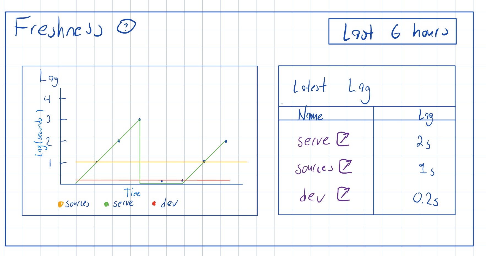
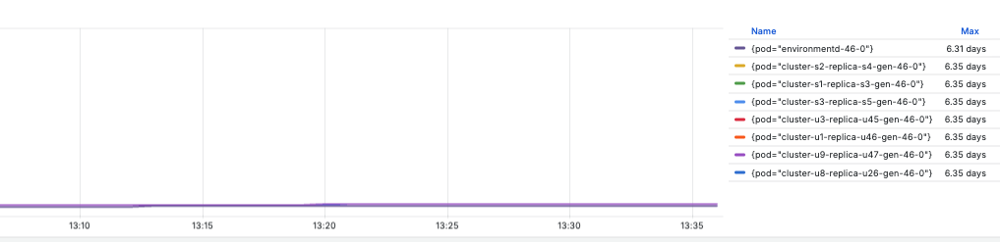
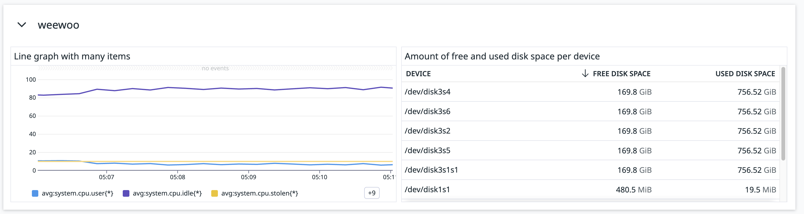
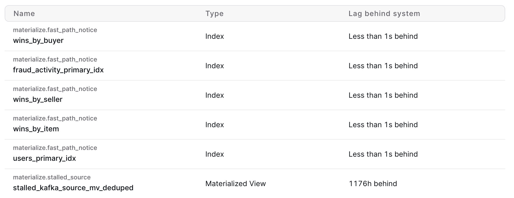
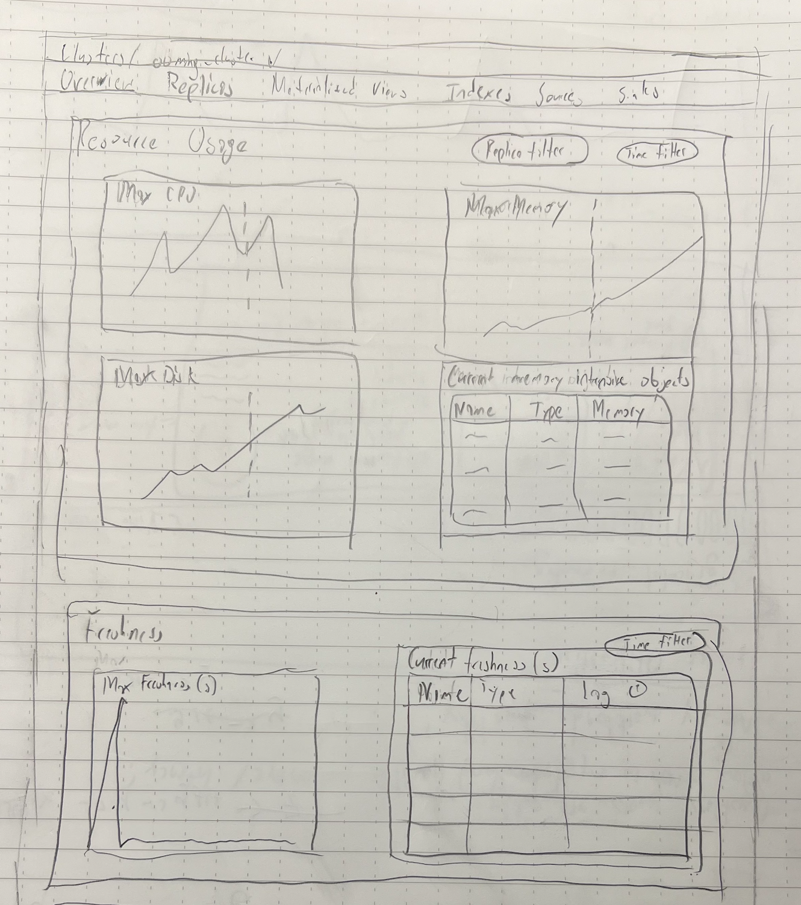
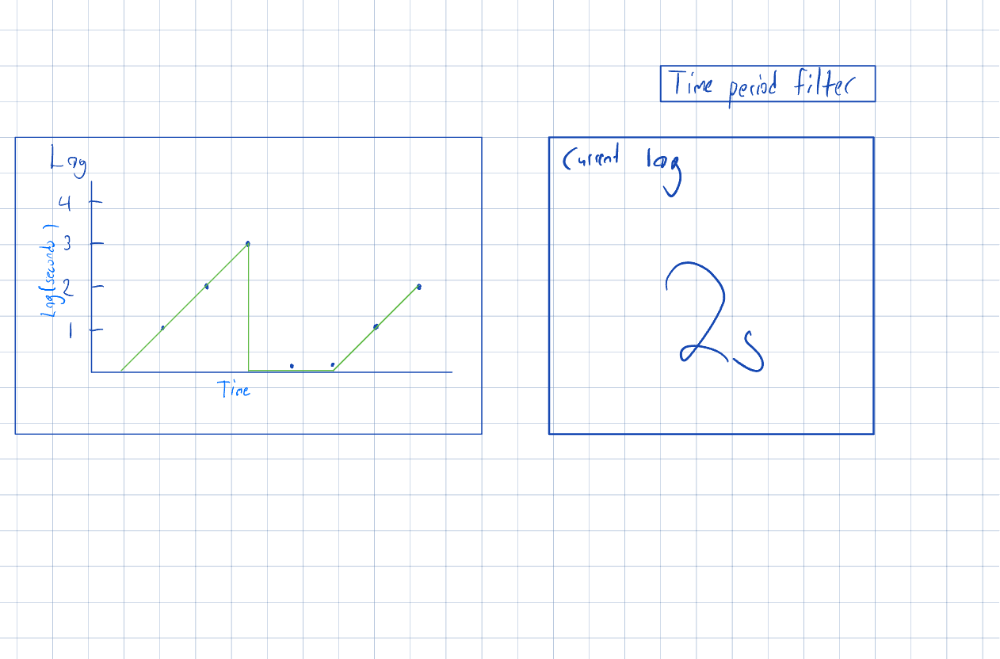
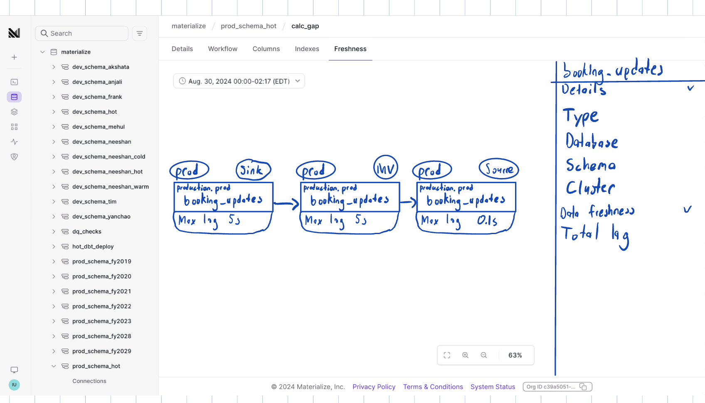

# Freshness in the Console

- Associated: (Insert list of associated epics, issues, or PRs)

Freshness in the Console original design: [https://www.notion.so/materialize/Freshness-in-the-Console-82d6ad6e23894f10b01d9c39e386f015?pvs=4](https://www.notion.so/Freshness-in-the-Console-82d6ad6e23894f10b01d9c39e386f015?pvs=21)

Epic: https://github.com/MaterializeInc/console/issues/2855

Freshness metric product brief: [https://www.notion.so/materialize/Freshness-metric-7f1003f7ed7449d79a442d74d718bb3b?pvs=4](https://www.notion.so/Freshness-metric-7f1003f7ed7449d79a442d74d718bb3b?pvs=21)

This design document is a continuation of the above and follows the same problem and success criteria. I’ve duplicated them in this doc for posterity. In this design document, we’ll focus on the technical implementation of the solution proposal.

## The Problem

Users want a top level overview of how fresh their data is.

## Success Criteria

Users can ask the Console how “fresh” their system’s been in a specified time period and can identify which objects aren’t fresh. Objects include sources, indexes, sinks, and materialized views.

The objects that the user will most likely care about are whatever’s directly referenced in any of their outputs of Materialize. This includes sinks, indexes of serving views, and materialized views. We’ll call these _serving objects._ Some ideal flows that come to mind:

### Alerting → Diagnosis

1. A user has some alerting set up to tell them if a group of serving objects aren’t fresh.
2. The user can view said group for that time period in the Console. They can then drill down to each object to see what in its DAG caused the staleness
3. Given the time period and the object, they can diagnose what changed in the system to cause the staleness. Changes include 0dt upgrades, increased volume in upstream sources, CPU and memory spikes from unrelated objects in the same cluster

### Morning coffee diagnosis

1. The first thing in the morning customers like Chris from Braidwell like to do is grab a cup of coffee, sit down, and open pganalyze
2. We want to simulate this experience **with a single page** that highlights if anything has been stale
3. If anything is, they can drill deeper and follow the flow above

## Solution Proposal

We’ll have a new Freshness card that’ll appear in the environment overview dashboard, cluster overview dashboard, and a new tab in an object’s detail page labelled “Freshness”:



The freshness card will consist of a time filter with options `last hour, last 6 hours, last 24 hours`. We map each object (depending on the dashboard) on a line graph on the left and we show the current/latest lag as a table on the right. The table will be sorted by lag descending. The table serves as navigation, a place to get current values, and follows a similar design to the resource intensive object table. In terms of components and actual design, we’ll reuse as much as we can from our cluster overview dashboard and figure out a table variant that’ll look good in a card. The following are my inspirations for this layout:

Grafana:



Datadog:



### Environment overview dashboard

We’ll use all extant clusters as our objects and for the lag of each cluster, the highest lag of any object in it. For any given customer, the highest number of clusters is roughly 10 which is fine to show in a single graph. The query to get this data would look like:

```sql
-- Get the object with the highest lag per cluster
SELECT
	DISTINCT ON(occurred_at, cluster_id)
	occurred_at,
	cluster_id,
	lag,
	id,
	name
FROM
	recent_global_lag -- (id, lag, occurred at)
	-- assume occurred_at is bucketed per minute
	JOIN object_history  -- (id, name, cluster_id)
		USING (id)
	WHERE
		occurred_at >= <lookback_start>
	ORDER BY
		occurred_at,
		cluster_id,
		lag DESC
;
```

To get the data for the table, we’d sort the above by `occurred_at` and take the first row per cluster.

We’ll need to create a view like `object_history` via `mz_audit_events` for the following case:

- You have a cluster w/ many compute objects
- Bc. of a materialized view in that cluster, the aggregated peak staleness of that cluster is super high causing a spike in the chart
- The user is debugging, and decides to remove that materialized view
- If we’d joined on `mz_objects` instead of `mz_audit_events`, we’d filter out the materialized view and remove the spike, thus corrupting history

The SQL for `object_history` would look something like:

```sql
WITH creates AS (
  SELECT details->>'id' AS id,
    details->>'database' AS database,
    details->>'schema' AS schema,
    details->>'item' AS name,
    COALESCE(details->>'cluster_id', objects.cluster_id) AS cluster_id,
    object_type,
    event_type,
    occurred_at
  FROM mz_catalog.mz_audit_events AS events -- Because we never migrated the cluster ids of deleted AND current items in mz_audit_events, we backfill with data from mz_objects
    LEFT JOIN mz_objects AS objects ON details->>'id' = objects.id
  WHERE event_type = 'create'
    AND details->>'item' IS NOT NULL
),
drops AS (
  SELECT details->>'id' AS id,
    occurred_at
  FROM mz_catalog.mz_audit_events
  WHERE event_type = 'drop'
),
user_objects AS (
  SELECT creates.id,
    creates.database,
    creates.schema,
    creates.name,
    creates.cluster_id,
    creates.object_type,
    creates.event_type,
    creates.occurred_at AS created_at,
    drops.occurred_at AS dropped_at
  FROM creates
    LEFT JOIN drops USING(id)
),
-- We have a separate CTE for built-in objects given they don't appear in the audit log
builtin_objects AS (
  SELECT DISTINCT ON (id) id,
    names.database_name as database,
    names.schema_name as schema,
    names.name,
    names.cluster_id,
    objects.type,
    'create' AS event_type,
    NULL::timestamptz AS created_at,
    NULL::timestamptz AS dropped_at
  FROM mz_catalog.mz_objects objects
    INNER JOIN mz_internal.mz_object_fully_qualified_names names USING (id)
  WHERE id LIKE 's%'
)
SELECT *
FROM user_objects
UNION ALL
SELECT *
FROM builtin_objects;
```

### Cluster overview dashboard

We can’t show all objects of a cluster because for some customers(i.e. General Mills), they can have 50 objects in a cluster which would clutter the graph. There are a few alternatives that might work but would love some input:

1. If the graph for a cluster consists of separate trees, we take the object that has the highest lag per tree. Since each tree most likely represents a separate use case, it would allow easier debugging if anything went wrong. The issue here is we don’t have access to object dependencies across history.
2. We take the top 10 objects with the current highest lag, similar to the resource intensive objects table. I can foresee this not being too useful in a line chart because as soon as one object in the tree lags, you’ll see a cascading effect of its downstream neighbors.
3. We can use approach 2’s for the table and a single line in the chart of the max lag of all objects in a cluster. This pairing will look very similar to our resource graphs and our resource intensive objects table.

Ideally the table will look like the following, sorted by lag descending:



Then when users want to debug further, they can navigate to its Freshness tab.

For the SQL queries, it’ll essentially look like the environment dashboard query with a filter on cluster ID.

Here’s a rough sketch of how I see this all fitting together in the Cluster overview page.



We move the “Memory intensive objects” table into the “Resource Usage” card and remove the “Lag behind source” column. We’ll also replace “Lag behind source” columns in each Cluster subpage with our new freshness metric.

### Freshness tab

The freshness tab will consist of a graph with the lag of the object and its current lag.



Ideally we’d add a freshness workflow graph below like in the previous design doc below:



but I’ll discuss why this is out of scope later on.

## Special cases

### Navigating to deleted objects?

Because objects could’ve been dropped in a cluster, we’ll disable navigation and signify that they were dropped.

### Hydration affecting lag

During initial hydration of objects, the lag can be 54 years since its write frontier will be initialized to 0 until hydration finishes. For rehydration, the lag of an object can climb until it finishes rehydration too. We can clamp the lag value to something like ≥10 minutes for our line graphs and tables. That way staleness is captured in both cases.

## Out of scope

A Freshness workflow graph would be perfect since it can tell you what caused the staleness during that time. However I feel as though this should be merged with the workflow graph given a historical analysis of lag is more useful than the current lag of an object. This would be a much bigger refactor given:

- We don’t have historical information of each object’s downstream compute dependencies (we can assume its upstream compute dependencies are rarely changed)
- We’d need a historic mode and a “live” mode since the live mode is useful for seeing an object’s downstream dependencies hydrate.

In the mean time, we can still replace the current lag values in our workflow graph with the new wallclock lag by taking the lag values of the latest bucket.
