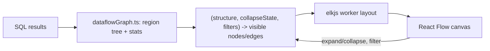

# Dataflow visualizer rebuild

- Associated: [CNS-108](https://linear.app/materializeinc/issue/CNS-108), [CNS-109](https://linear.app/materializeinc/issue/CNS-109)

## The Problem

The dataflow visualizer (`src/platform/clusters/DataflowVisualizer.tsx`) builds a Graphviz DOT string by hand and renders it with `d3-graphviz`, which pulls in a WASM Graphviz build.
This design has produced two open bugs.
CNS-108: `scopeToGv` concatenates catalog strings into DOT and only escapes double quotes, allowing XSS through crafted object names.
CNS-109: `useSqlApiRequest` never clears previous results, so a failed refetch leaves the stale graph on screen.
Beyond the bugs, the visualizer lacks features operators need: no dataflow selection (one object, one dataflow), no whole-graph overview (drill-down replaces the canvas), no filtering, and no way to find hotspots in large dataflows.

## Success Criteria

* A user can pick any dataflow running on a replica, including transient ones, and see its operator graph.
* Regions expand and collapse in place, with aggregated stats and rerouted edges on collapsed regions.
* Nodes show scheduling time and arrangement size, edges show message counts and container type.
* Filter tools let a user locate operators by name, hide idle elements, heat-color by metric, and filter edges by container type.
* Rendering strings from the catalog cannot inject markup (closes CNS-108 by construction).
* A failed refetch always replaces the graph with an error state (closes CNS-109, with a regression test).
* No `d3-graphviz` or WASM dependency remains.

## Out of Scope

* Backend changes.
  All required data exists in `mz_introspection` relations already queried today.
* Live-updating stats via `SUBSCRIBE`.
  The data layer separates structure from stats so this can be added later, but v1 ships manual refresh only.
* Per-worker breakdowns and skew analysis.
  V1 uses the non-per-worker introspection views, as today.
  Note their semantics differ: structural views (operators, addresses, channels) restrict to worker 0, stats views (elapsed, arrangement sizes, message counts) sum across workers.
* URL-persisted filter and collapse state.
* New end-to-end tests.

## Solution Proposal

Rebuild the visualizer on React Flow (`@xyflow/react`) for rendering and interaction, with elkjs (`elk.layered`) for hierarchical layout in a web worker.
Nodes become React components styled with Chakra, so all catalog strings render as text nodes and the DOT injection class disappears.
React Flow provides pan, zoom, minimap, selection, nested parent nodes, and viewport culling (`onlyRenderVisibleElements`), which matters for dataflows with over a thousand operators.
elkjs is the only mainstream JS layout engine with real compound-graph support: nested regions and edges routed across hierarchy boundaries.
elkjs is GWT-compiled JavaScript, not WASM.

### Product surface

Two entry points share one graph implementation.

* A new "Dataflows" tab on cluster detail: replica selector, then a dataflow list from `mz_dataflows` joined with `mz_records_per_dataflow` and summed `mz_scheduling_elapsed` (name, records, size, elapsed). Clicking a row opens the graph view. This covers transient dataflows such as peeks and subscribes.
* The existing "Visualize" tab on index and materialized view detail deep-links into the cluster page with the object's dataflow preselected, resolved via `mz_compute_exports`.

Both remain behind the `visualization-features` LaunchDarkly flag.
The old `DataflowVisualizer.tsx` and the `d3-graphviz` dependency are deleted once the new view lands, since the visualizer is its only consumer.
No e2e test references `DataflowVisualizer`, so deletion needs no test migration.

### Data layer

The three structure queries from `useDataflowStructure.ts` (operators, channels, LIR operators) are kept, but keyed by dataflow id instead of export id so transient dataflows work.
Channels need no extra join for this: the first element of an operator address is the dataflow id, so the channel query filters on `from_operator_address[1]`.
`mz_lir_mapping` is keyed by `global_id`, so the LIR query joins `mz_compute_exports` on `dataflow_id` to find the dataflow's export ids.
Transient dataflows (peeks, subscribes) are logged in both relations while alive (`CollectionLogging::new` runs for every export id in `compute_state.rs`, `log_lir_mapping` for every built object in `render.rs`), so LIR data works for them too.
A dataflow can have multiple exports, so the LIR panel groups entries by export id.
A new cheap query feeds the dataflow selector list.

The full pre-collapse structure is fetched client-side in one shot.
Assumption: dataflows stay within tens of thousands of operators and channels, which fits comfortably in memory and within the existing 30 second query timeout, which v1 keeps.

A new hook returns results tagged with the parameters that produced them.
The render layer discards results whose tag does not match the current selection, and an error always wins over retained data.
This closes CNS-109 without depending on the broken `requestIdRef` logic in `useSqlApiRequest`.

Refresh is manual: a refresh button plus a "last fetched" timestamp.
Layout, collapse state, and viewport survive a refresh.
Stats update in place, and relayout happens only if the structure changed.
The structure/stats split makes a later `SUBSCRIBE`-driven live mode a drop-in: stats stream into node badges without relayout.

### Graph model and collapse

Pure functions in a new `dataflowGraph.ts` build the region tree from `mz_dataflow_addresses` alone, replacing `collateOperators`.
An operator's parent is the operator whose address is its own minus the last element, so `mz_dataflow_operator_parents` (itself derived from addresses) is dropped to avoid two sources of truth that can disagree across query times.
Regions map to React Flow parent (group) nodes, operators to leaf nodes.
Every node carries own and transitive stats: arrangement records, size, elapsed.
Transitive stats are computed once when the structure is built, not per collapse toggle.

Each region is expanded or collapsed in place.
A collapsed region renders as a single node with aggregated stats and a child count.
Edges crossing a collapsed boundary are remapped to the region node and aggregated: one edge per direction pair, summed records and batches, and the set of container types.
The derivation is a pure function from `(structure, collapseState)` to visible nodes and edges.
The default state shows the root's direct children with everything below collapsed.

Regions and LIR spans are two different hierarchies, so only regions get the nesting.
LIR information appears as a badge and operator text on each node, plus a side panel listing the dataflow's LIR operators from `mz_lir_mapping`.
Hovering or clicking a panel entry highlights the member operators on the canvas.
Scope inputs and outputs stay as small port nodes on the region boundary, as today.



### Type contracts

The units communicate through these shapes, pinned up front so the graph model, the layout worker, and the rendering layer can be built independently.

```typescript
type Address = number[];
type NodeId = string; // JSON.stringify(address), as today

interface NodeStats {
  arrangementRecords: bigint;
  arrangementSize: bigint;
  elapsedNs: bigint;
}

interface DataflowNode {
  id: NodeId;
  address: Address;
  name: string;
  parent: NodeId | null;
  children: NodeId[]; // empty for leaf operators
  own: NodeStats;
  transitive: NodeStats; // own + subtree, precomputed
  lir: { exportId: string; lirId: string; operator: string } | null;
}

interface DataflowStructure {
  nodes: Map<NodeId, DataflowNode>;
  root: NodeId;
  channels: Channel[]; // as fetched, operator-level
}

type CollapseState = ReadonlySet<NodeId>; // collapsed region ids

interface VisibleEdge {
  id: string;
  source: NodeId; // visible node after remapping
  target: NodeId;
  messagesSent: bigint;
  batchesSent: bigint;
  channelTypes: string[]; // set union when aggregated
}

interface VisibleGraph {
  nodes: DataflowNode[]; // only visible ones, regions included
  edges: VisibleEdge[]; // directed; A->B and B->A stay separate
}

// Worker protocol. One in-flight request, stale responses dropped by id.
interface LayoutRequest {
  requestId: number;
  graph: VisibleGraph;
}
interface LayoutResponse {
  requestId: number;
  positions: Map<NodeId, { x: number; y: number; width: number; height: number }>;
}
```

Filter and collapse state are owned by the top-level visualizer page component and passed down.
The visible-graph derivation is `deriveVisibleGraph(structure, collapseState, filters): VisibleGraph`, a pure function.

### Rendering and layout

elkjs runs `elk.layered` in a web worker, direction left to right, over exactly the visible post-collapse graph.
The console builds with Vite, so layout runs in a Vite module worker (`new Worker(new URL("./layout.worker.ts", import.meta.url), { type: "module" })`) that imports `elkjs/lib/elk.bundled.js` and implements the layout request protocol below.
Phase 1 verifies this in both `vite dev` and the production build.
If the module worker fails to bundle or run `elk.bundled.js`, the fallback is running elkjs on the main thread in a lazily loaded chunk, accepting UI stalls during layout.
Toggling collapse recomputes layout, memoized per collapse state so toggling back is instant.
A small "layouting" overlay shows during computation while the canvas stays interactive.

The node component shows name, arranged records, size, and elapsed time.
Default colors keep today's two-by-two palette (region versus operator, has arrangement versus not).
Heatmap mode overrides node color.
Edges are labeled with records and batches, dashed when zero messages were sent, with the container type as an edge badge and tooltip.

Perf guards: collapse-by-default keeps the initial node count small, and viewport culling handles large expanded graphs.
A constant `MAX_VISIBLE_NODES = 1500` bounds the visible graph, counting leaf and region nodes but not edges.
An expand that would exceed it is refused with a warning toast.

### Filters and interactions

A toolbar above the canvas offers:

* Name search: matching operators highlighted, others dimmed, next/previous jump that auto-expands ancestor regions of a match.
* Hide idle: hides zero-message edges and zero-elapsed operators, with region aggregates recomputed over the visible set.
* Heatmap: mode select (off, elapsed, arrangement size), sequential color scale, threshold slider that dims nodes below the cutoff, with a legend.
  The scale domain is `[0, max]` over the visible nodes' transitive metric.
  If the max is zero, all nodes get the neutral base color and the slider is disabled.
* Channel type: multi-select over the container types present, non-matching edges dimmed.

Filters are pure derivations over the visible graph and compose.
Filter state lives in component state.
Clicking a node opens a detail side panel (full name, all stats, LIR operator, address).
Double-clicking a region toggles collapse.

### Error handling

The first fetch for a selection shows a centered spinner, as today.
An error always replaces the graph.
The CNS-109 regression test from the issue lands, adapted to the new component.
`INSUFFICIENT_PRIVILEGE` keeps the existing USAGE-privilege alert.
A timeout shows an error box with retry.
A replica or dataflow that disappeared on refresh shows a "dataflow no longer exists" empty state and refreshes the selector.

## Minimal Viable Prototype

The riskiest assumption is elkjs layout quality and speed on real dataflow shapes.
Phase 1 of the implementation plan is a thin vertical slice: fetch one dataflow, build the region tree, lay out the default collapsed view with elkjs, and render it in React Flow with expand/collapse only.

The slice runs against a local environmentd with a reference dataflow: an index on a five-way join with at least two aggregations, producing at least 300 operators.
The exact SQL is fixed in the implementation plan.
The gate, all parts required to proceed:

* Worker loading works in `vite dev` and the production build (see rendering section for the pinned mechanism and fallback).
* Default collapsed view lays out in under 500 ms.
* A fully expanded view of 1500 visible nodes lays out in under 5 s in the worker, UI responsive throughout.
* No overlapping nodes, edges follow left-to-right flow.
* Manual sign-off on visual readability by the requester, from screenshots of the reference dataflow collapsed and expanded.

If the gate fails, work stops and the decision returns to this document: tune ELK options, or fall back to the in-house Canvas alternative, decided with the reviewer rather than unilaterally.

## Alternatives

* Extend the in-house `src/components/Graph` Canvas plus dagre stack (used by WorkflowGraph, RoleGraph, CriticalPathGraph).
  No new dependencies, but dagre's compound-graph support is weak, in-place collapse and boundary edge rerouting would be hand-built, and the plain SVG canvas has no viewport culling for graphs with over a thousand nodes.
  The hard part of this feature is exactly the part dagre is bad at.
* In-house Canvas rendering with elkjs layout.
  Keeps console rendering conventions and solves hierarchy, but rebuilds interaction machinery React Flow ships (nested nodes, culling, minimap, selection).
* Keep Graphviz but sanitize DOT properly.
  Fixes CNS-108 but keeps the WASM dependency, string-based pipeline, and none of the requested interaction features.

## Open questions

* None blocking.
  The `SUBSCRIBE` live mode and per-worker views are deliberate follow-ups, not open design points.

## Testing

* Unit (vitest): `dataflowGraph.ts` pure functions.
  Region tree construction, collapse edge remapping and aggregation, filter derivations, LIR membership.
  Most logic lives here, so most coverage lands here.
* Component (vitest plus msw): selector flow, error-on-refetch (the CNS-109 case), permission alert, empty states.
  React Flow renders with the elk worker stubbed to deterministic positions.
