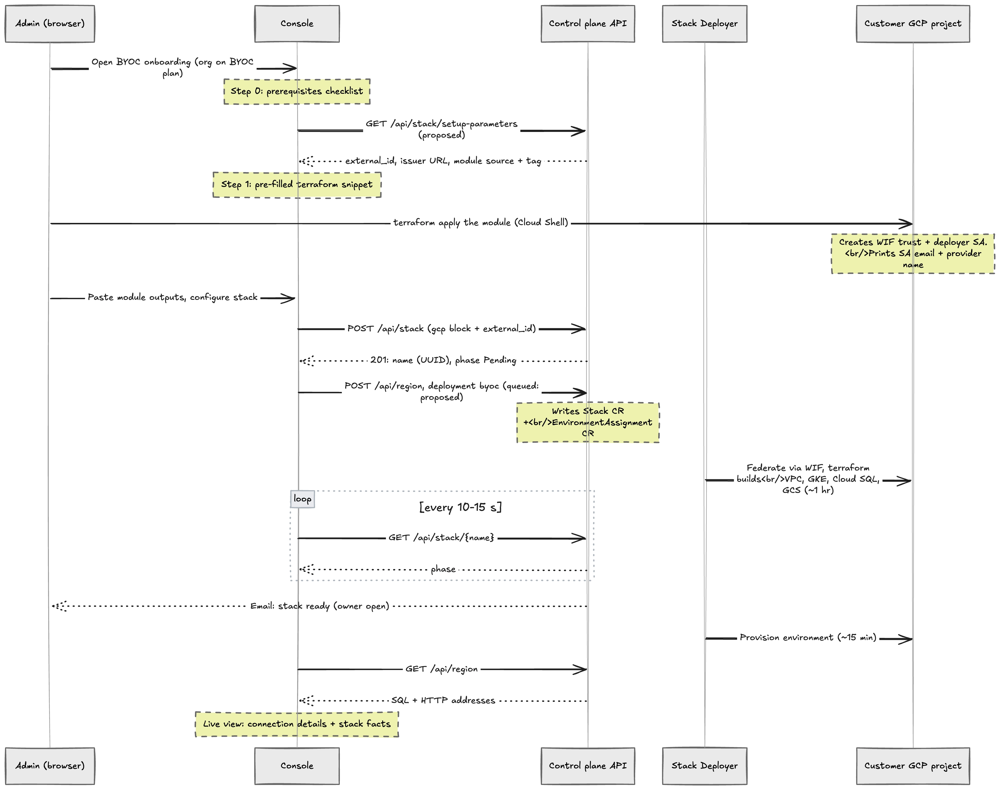

# BYOC console support

- Associated: MaterializeInc/cloud#13390, MaterializeInc/cloud#13291

## Problem

BYOC setup and management needs to be done via the cloud console. A BYOC
organization needs to be detected on a day one setup flow that provisions a
stack and an environment. Day 2 stack management handles control plane API
contracts that the console needs.

This design doc is scoped around the control plane, based on the BYOC
authentication design (MaterializeInc/cloud#13291): the cloud console
authenticates against the control plane and manages the account.

## Goals

- A guided day one setup flow for GCP: prereqs, federated access grant, stack
  configuration and a single submit that deploys the first stack and
  environment.
- Progress and failure UX for a provisioning window of roughly an hour for the
  stack plus 15 minutes for the environment.
- Day 2 UX surfaces: stack inventory and detail, add environment scoped to a
  stack and stack deletion.
- Organization gating based on BYOC plans that branch an org into the BYOC
  experience, SaaS orgs that would be untouched, or orgs that can hold SaaS
  and BYOC stacks side by side.
- Enumerate the API contracts that the console needs from the control plane
  and work as a compass for when we need one.

## Non-goals

- Cluster log in and identity.
- UI changes for license keys and billing.
- AWS and Azure setup flows. The design would be generic and cloud agnostic
  but focusing on GCP.
- Observability UI in BYOC.
- Reachability of the connection details the console shows. With a private
  NLB, the SQL and HTTP addresses and the in-cluster console link are only
  reachable from inside the customer's network path (VPN, peering), and that
  private connectivity is undesigned on the cloud side. The console presents
  them as copyable facts, not reachability guarantees. Revisit when the
  customer networking design lands.

## Background

The console asks the control-plane API for a stack (`/api/stack` and
`/api/region`). The Stack CR describes one customer cluster in one region of
their project, and the EnvironmentAssignment CRs carry what the environment
terraform needs, such as the storage bucket, metadata database, or license
secrets. The Stack Deployer reconciles these by federating into the customer's
GCP project with short-lived credentials via Workload Identity Federation. The
console only sees `StackResponse.phase` and environment status.

### Glossary

- `Stack`: one customer cluster in one region of the project. This is the
  isolation boundary and deployment unit that the setup flow creates.
- `Environment`: a Materialize instance that exists inside a stack. Multiple
  environments per stack are supported, created through the existing region
  endpoint.
- `deployment_mode`: stack field distinguishing `byoc` from SaaS.
- Stack phase: `Pending | Provisioning | Ready | Updating | Deleting |
  Failed`. The console's status display and notification triggers use this
  enum.

### Current APIs

| Endpoint | Purpose | Notes |
| --- | --- | --- |
| `POST /api/stack` | Create a stack | Body is `CreateStackRequest` |
| `GET /api/stack/{name}` | Read one stack | Returns `StackResponse`, poll target during setup |
| `DELETE /api/stack/{name}` | Tear down a stack | Destructive |
| `POST /api/region` | Create an environment | With `deployment: byoc {stack}` targeting a Stack CR by name |

## Design

### Org modes and information architecture

The console needs to learn at login time when the org is on a BYOC plan.

- SaaS org: nothing changes.
- BYOC org, no stack: onboarding lands on the setup wizard.
- Mixed org: the environment switcher lists all environments the org can
  reach, labeled with Materialize regions or stack names.

## Day one setup wizard

This would take about an hour to set up the stack and fifteen minutes for an
environment.

### Prereqs

A dedicated, empty GCP project. Rights to configure Workload Identity
Federation and grant IAM roles on it. This would also need the quota for the
machine types, local SSDs and IPs the stack needs.

### Grant

The console shows a ready-to-copy terraform snippet looking like:

```hcl
module "materialize_byoc" {
  source      = <the module, pinned version>
  project_id  = <customer types this>
  name_prefix = <from the stack name they chose>
  external_id = <Materialize-issued secret>
  materialize_oidc_issuer_url = <Materialize's issuer URL>
}
```

The console would need control plane APIs such as
`GET /api/stack/setup-parameters` to fill out these values that the customer
can run in their dedicated cloud project. The module creates a deployer
service account with custom-role permissions, and a Workload Identity pool
and provider that trust Materialize's OIDC issuer. It will only accept the
stack deployer's subject and only a token audience derived from the external
ID.

The console renders the apply instructions with the module inputs filled in,
then collects the module's outputs back: `deployerServiceAccountEmail` and
`workloadIdentityProvider` feed the create request together with the project
ID.

`project_id` and `name_prefix` are user inputs and `name_prefix` must match
the eventual create request. The setup wizard collects the stack name and
project before rendering the grant step. Once the customer pastes the two
outputs, the console sends them (along with project ID, region, name prefix,
external ID) in the create request.

Pasted values are validated twice, with specific errors, mirroring the AWS
flow's checks (such as "this is a policy ARN, not a role ARN"). Client-side
format checks: the deployer service account is an email ending in
`.iam.gserviceaccount.com`, the Workload Identity provider is the full
resource name
(`projects/<number>/locations/global/workloadIdentityPools/<pool>/providers/<provider>`)
and not the short provider name, and `name_prefix` matches
`^[a-z][a-z0-9-]{0,13}[a-z0-9]-$` (MaterializeInc/cloud#13517). The server
rejects with a readable error before anything is queued.

### Configure the stack

Inputs for stack display name, cloud region, network CIDRs (defaulted; the
GCP request splits subnet, pods and services ranges) and a URL-safe name for
the first environment will be validated. The console will show a warning that
these inputs will be hard to change later.

Endpoint exposure is not chosen here. Per the Cloud Office Hours discussion
(2026-09-10), exposure is switchable after provisioning (a second NLB behind
a toggle) rather than a one-time choice, so it lives in day 2 stack
management. The default posture follows the pending customer networking
design.

### Submitting

A single submit button creates the stack and its first environment. The
console issues `POST /api/stack` and then the environment create. This
requires the control plane to accept and queue the environment create (see
API requirements); holding it client-side would not let the user pick it up
if they come back in a new tab, so this doc treats queuing as a requirement,
not a preference. Every piece of the UX would be derivable from the server
objects and a closed tab wouldn't lose progress.

Resume also matters before submit. If the customer runs the grant module and
closes the tab without submitting, the external ID has to survive, since a
regenerated one would no longer match the module they already applied. The
external ID is per stack and stored on the Stack object, so the control plane
needs an initial call that persists the generated values before the stack
exists (its own CRD, or a reuse of the Stack CRD, still under discussion with
the cloud team).

### Progress

In the deploying step, the console would show the progress for the stack
being deployed and the environment created. Two indicators: stack (Pending,
Provisioning, Ready) and environment (pending until the stack is ready).
Polling `GET /api/stack/{name}` and the environment status around an interval
of 10-15 seconds would keep updating the progress. Nice to have: an email
confirmation that the stack is ready and the environment is ready. The
console has no push notification to send to the user to notify them that
their stack is ready.

### Failure

A failed stack creation shows phase, `failureMessage` and remediation copy
keyed to the common causes (quota, org policy, revoked grant). Remediation
copy is keyed to cause categories the control plane exposes, never raw
terraform output, which must not leak to customers. There is no retry button
for the user since the deployer already retries with backoff. Users have an
option to contact support.

### Stack is live

Connection details for the environment and a landing view that would seed
into the day 2 flow. Connection details for the environment (the SQL and
HTTP addresses behind the customer's NLB) come from the existing region API,
`GET /api/region`. The stack metadata gets populated from
`GET /api/stack/{name}`. Today `StackResponse` carries phase, `appliedCommit`
and the cluster management endpoint. It doesn't provide settled display
fields (project, network CIDRs, egress IPs, NLB).

The console presents these as copyable connection details, not reachability
guarantees: with a private NLB the addresses are only reachable from inside
the customer's network path, and the operator's browser generally cannot
connect to them (see Non-goals).

### Day 2 stack management

What day 2 can display is bounded by open cloud-side work: `StackResponse`
lacks the display fields, and connectivity from the customer's browser to a
private NLB is undesigned. This section lists the intended surfaces;
reachability-dependent pieces are out of scope until the networking design
lands (see Non-goals).

**Stack list.** Every stack in the org with name, region, phase, and
environment count. Blocked on a list endpoint that does not exist yet.

**Create stack.** Additional stacks are a day 2 flow: a create action on the
stack list reuses the day 1 wizard from the grant step onward, since the org
and subscription already exist and the prereqs screen can be skipped. Any
stacks-per-subscription limit stays a control plane gate that the console
surfaces as an error.

**Stack detail.** Fields settled in the mockups and thread notes: egress IPs,
VPC CIDR, customer project, status, applied version, and the NLB, which is
internal by default. Subnets were dropped from the display in favor of the
NLB. No license material anywhere on the page. Actions: add environment
(scoped to this stack) and delete. Most of these fields are missing from
`StackResponse` today (see API requirements).

**Version display.** `appliedCommit` is what the stack runs and lags the spec
during an apply. Render it as the stack version, with an "updating" treatment
while phase is `Updating`. Upgrades are control-plane driven, roughly weekly,
so this is informational, not an action.

**Endpoint exposure.** Exposure is switchable after provisioning rather than
fixed at create time (a second NLB behind a toggle). Stack detail hosts the
toggle and the allowlist CIDR editing once the control plane exposes a
contract for it. The default posture follows the pending customer networking
design.

**Edit.** No stack edit capability exists in the API today (there is no
`PATCH /api/stack`), so stack detail is read-only apart from the actions
here. When an update path lands, stack detail is where editable fields (for
example observability destinations) would live.

**Delete.** Environments first, then the stack. Both are destructive,
long-running operations, so both use a type-the-name confirmation and then
surface the `Deleting` phase in place. The API semantics need deciding:
whether `DELETE /api/stack/{name}` refuses while environments exist or
cascades. The console UX differs accordingly, a disabled delete with a hint
versus one type-the-name confirm that covers everything (see API
requirements). What the customer must clean up afterward (the WIF trust, the
project itself) is documentation, but the completion state should link to
it.

**Link to the in-cluster console.** The stack detail page can link to the
in-cluster console at the cluster endpoint, but the cloud console cannot
authenticate the user into it. Different identity domain. The link is a plain
navigation with copy explaining that login happens against the customer's own
IdP. When the endpoint is private, the link may not resolve from the
operator's browser, the same reachability bound as above.



### API requirements

- Setup parameters: the grant module's inputs and where each comes from:

| Value | Description |
| --- | --- |
| `external_id` | Minted by Materialize per stack and stored on the Stack object. The customer needs it in their terraform so their project only accepts tokens minted for this stack. The console needs it for the pasted-in module and for stack deployment |
| `oidc_issuer_url` | Materialize's ID-badge printer: tells the customer's project to only trust badges from this address |
| `project_id` | Customer's project ID |
| `source` + version | The customer downloads Materialize's setup terraform pinned to an exact release |
| `name_prefix` | Stack name the user chose |
| `materialize_deployer_subject` | Kubernetes service account name of the deployer (`system:serviceaccount:stack-deployer:stack-deployer-jobs`) |

The console would show terraform code that the user would run in their
project. One endpoint that returns these values for this org would help
populate them in the UI:

```json
{
  "externalId": "mz1e…f42a",
  "oidcIssuerUrl": "https://oidc.eks.us-east-1.amazonaws.com/id/ABC123",
  "deployerSubject": "system:serviceaccount:stack-deployer:stack-deployer-jobs",
  "module": { "source": "<published repo>//misc/byoc/gcp", "ref": "v0.3.0" }
}
```

The same endpoint should return the supported regions per cloud, so the
console never hardcodes a region list, and the control plane needs to persist
the generated values before the stack exists so the grant step is resumable
(see Submitting).

- List of stacks so the console can render a stack inventory.
- `StackResponse` needs to have GCP project, network CIDRs, egress IPs and
  NLB values so day 2 can expose the status object of provisioning outputs.
- Endpoint exposure contract: exposure is switchable after provisioning (a
  second NLB behind a toggle) rather than fixed at create time. The console
  needs an API to read and toggle exposure and to edit allowlist CIDRs from
  stack detail. Default and mechanism follow the pending customer networking
  design.
- Delete semantics: whether `DELETE /api/stack/{name}` refuses while
  environments exist or cascades, so the console knows whether to disable
  delete with a hint or offer one confirm that covers everything.
- Stack edit (later): no `PATCH /api/stack` exists. Nothing in v1 needs it,
  but re-editing a stack, and future editable fields such as observability
  destinations, will.
- Org entitlement flag: to show an org is on a BYOC plan or SaaS.
- Routing: currently the console reads from the Global API's region list but
  would need a designated base URL for stack calls.
- Queued environment create: accept `POST /api/region` with
  `deployment: byoc {stack}` while the stack is still provisioning.
- Notification ownership: the control plane needs to send the stack-ready and
  environment-ready emails.

### Security considerations

- The console would not hold data-plane credentials, never render secrets or
  license keys. The control plane would hold the necessary credentials.
- Stack and environment deletion are the only destructive actions.
- Authorization is enforced server side.
- Grant step content is trust sensitive. The external ID and issuer URL that
  the console displays must come from Materialize-controlled APIs and should
  never be assembled in the browser from user inputs.

## Alternatives

- A separate hosted lightweight setup site that was discarded during design
  discussions. This site would have increased the auth surface and the org
  context already lives behind console auth.
- Docs-only setup: a runbook plus API calls, with the console UI only
  reflecting the state.
- Push-based status instead of polling for stack phase. Email updates should
  cover that gap.

## Open questions

- How the per-stack external ID and setup parameters are persisted before the
  stack exists: an initial call creating its own CRD, or a reuse of the Stack
  CRD.
- Exact grouping and labeling of SaaS environments next to environments that
  live inside stacks?
