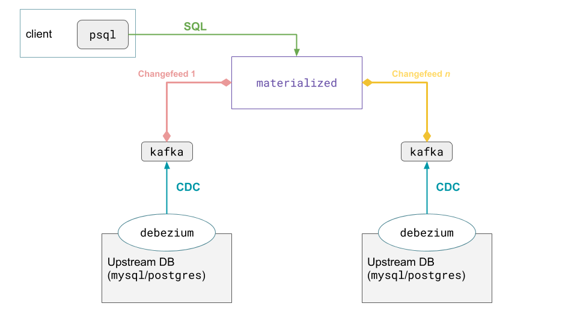

# Architecture overview

## Historical context

Materialize refers to the SQL materialized view engine that lives in this
repository. It sits atop [Differential Dataflow], which in turn sits atop
[Timely Dataflow], and those two components together provide a Rust API to an
extremely efficient streaming dataflow engine. The history of Timely and
Differential, hereafter referred to as T/D for brevity, is interesting, and
details can be found elsewhere for the curious [[1]].

For now, just know that T/D predates Materialize, the company, by several years.
There are several folks who have found use for T/D using their existing APIs,
both in research and industry. We intend to make T/D available under those terms
in perpetuity, in the spirit of scientific advancement.

Our goal with Materialize, the product, is to build a "better" interface on top
of T/D, and then sell that software to businesses with streaming data problems
for a tidy profit. The reason I say "better" is because the existing APIs for
T/D are, in fact, well designed and quite powerful; their problem is that they
are inaccessible to the average developer. Using T/D today requires being
intimately familiar with the Rust programming language, which takes even
experienced developers several months to learn. Perhaps worse, the T/D API is an
extremely unfamiliar programming model (in other words, it's not SQL) and
requires understanding the core ideas of the [Naiad paper], upon which T/D is
based.

The exact terms of the licensing of Materialize have yet to be worked out, so
for now this entire repository is both proprietary and private.

## Design overview

_TODO(benesch): complete design overview._

The best way I have of describing the product concisely is a "streaming SQL
materialized view engine." That means it takes SQL queries, like...

```sql
SELECT state, avg(total)
  FROM orders
 WHERE product IN ('widget')
 GROUP BY state
```

...and keeps them perpetually up to date.

What does it mean, though, for a query to be always up to date? In a traditional
database, you pose your query once. The database then sequences your query with
whatever writes it might be receiving, tabulates a consistent result, and then
gives you the answer that is up-to-date as of a particular time. If you want an
updated answer, you pose the same query again, and get an updated result.

There are two ways you might think about the output of the SQL query. You can
ask for a stream of updates, in which case you might get output like this:

```
(timestamp, data, diff)
(20190411034000, ('NY', 30.22), -1)
(20190411034000, ('NY', 30.25), +1)
```

The information here indicates that the average order value for widgets in New
York increased three cents, from $30.22 to $30.25. The first stream update
indicates that the previous average of $30.22 is no longer valid, and the next
stream update indicates the new average.

## Architecture

Everything in Materialize is currently handled by the `materialized` process
(pronounced _materialize-dee_; the "`d`" is for daemon), which interacts with
the outside world by interfacing with:

- **SQL shells** for interacting with clients, including defining sources,
  creating views, and querying data.
- **Kafka** to ingest data, i.e. writes.



_Above: Materialize deployed with multiple Kafka feeds._

_Below: Materialize's internal structure in the above deployment._


### SQL shell: interacting with clients

Right now, Materialize provides its interactive interface through `psql` running
locally on a client machine; this uses the PostgreSQL wire protocol (`pgwire`)
to communicate with `materialized`. _NOTE: We have a client called
[`mzcli`](https://github.com/MaterializeInc/mzcli) that we recommend using, but
it's just a modified wrapper around `pgcli`._

Because this is a SQL shell, Materialize lets you interact with your node
through SQL statements sent over `pgwire` to an internal `queue`, where they are
dequeued by a `sql` thread that parses the statement. Broadly, there are three
classes of statements in Materialize:

- **Creating sources** to ingest data from a Kafka topic, which is how data gets
  inserted into Materialize
- **Reading data** from sources
- **Creating views** to maintain the output of some query

#### Creating sources

When Materialize receives a `CREATE SOURCES...` statement, it attempts to
connect to a Kafka stream, which it plumbs into its local instance of
Differential. You can find more information about how that works in the
**Kafka** section below.

#### Reading data

Like any SQL API, you read data from Materialize using `SELECT` statements. When
the `sql` thread parses some arbitrary `SELECT` statement, it generates a
plan––plans in Materialize are dataflows, which can be executed by Differential.
This plan gets passed to the `dataflow` package, which works as the glue between
Materialize and its internal Differential engine.

Differential then passes this new dataflow to all of its workers, which begin
processing. Once Differential determines that the computation's complete, the
results are passed back to the client, and the dataflow is terminated.

Unfortunately, if the user passes the same query to Materialize again, it must
repeat the entire process––creating a new dataflow, waiting for its execution,
etc. The inefficiency of this is actually Materialize's _raison d'être_, and
leads us to the thing you actually want to do with the software: creating views.

#### Creating views

If you know that you are routinely interested in knowing the answer to a
specific query (_how many widgets were sold in Oklahoma today?_), you can do
something much smarter than repeatedly ask Materialize to tabulate the answer
from a blank slate––instead, you can create a view of the query, which
Materialize will persist and continually keep up to date.

When users define views '(i.e. `CREATE MATERIALIZED VIEW some_view AS
SELECT...`), the internal `SELECT` statement is parsed––just as it is for ad hoc
queries––but instead of only executing a single time, the generated dataflow
persists. Then, as data comes in from Kafka, Differential workers collaborate to
maintain the dataflow and its attendant view.

To read data from views (as opposed to ad hoc queries), users target the view
with `PEEK some_view` (or its equivalent ANSI Standard SQL: `SELECT * FROM
some_view`); from here, Materialize can simply return the result from the
already-up-to-date view. No substantive processing necessary.

**Reading Data vs. Creating Views**

As a quick summary: the difference between simply reading data and creating a
view is in terms of how long the generated dataflow persists.

- In the case of performing an ad hoc `SELECT`, the dataflow only sticks around
  long enough to generate an answer once before being terminated.
- For views, the dataflows persist indefinitely and are kept up to date. This
  means you can get an answer an indefinite number of times from the generated
  dataflow. Though getting these answers isn't "free" because of the incremental
  work required to maintain the dataflow, it is dramatically faster to perform a
  read on this data at any given time than it is to create an answer from
  scratch.

The only "wrinkle" in the above explanation is when you perform reads on views:
no dataflow gets created, and Materialize instead serves the result from an
existing dataflow.'

### Kafka: ingesting data

Materialize subscribes to Kafka topics and monitors the stream for data it
should ingest; this is how writes happen in Materialize.

As this data streams in, all Differential workers receive updates and determine
which––if any––of their dataflows should process this new data. This works
because each Differential worker determines the partitions it's responsible for;
the isolation this self-election process provides prevents contention. Phrased
another way, you don't have to worry about two workers both trying to process
the same piece of data.

The actual processing of Differential workers maintaining materialized views is
also very interesting and one day we hope to explain it to you here. In the
meantime, more curious readers can [take the first step towards enlightenment
themselves](https://timelydataflow.github.io/differential-dataflow/).

Implicit in this design are a few key points:

- State is all in totally volatile memory; if `materialized` dies, so too does
  all of the data.
- There is no way to "prime" `materialized` with data; it must all come in from
  Kafka.

## What's next?

Now that you understand Materialize, [give it a spin](demo.md).

[1]: https://paper.dropbox.com/doc/Materialize-Product--AbHSqqXlN5YNKHiYEXm3EKyNAg-eMbfh2QTOCPrU7drExDCm
[Naiad paper]: http://sigops.org/s/conferences/sosp/2013/papers/p439-murray.pdf
[Timely Dataflow]: https://github.com/TimelyDataflow/timely-dataflow
[Differential Dataflow]: https://github.com/TimelyDataflow/differential-dataflow
