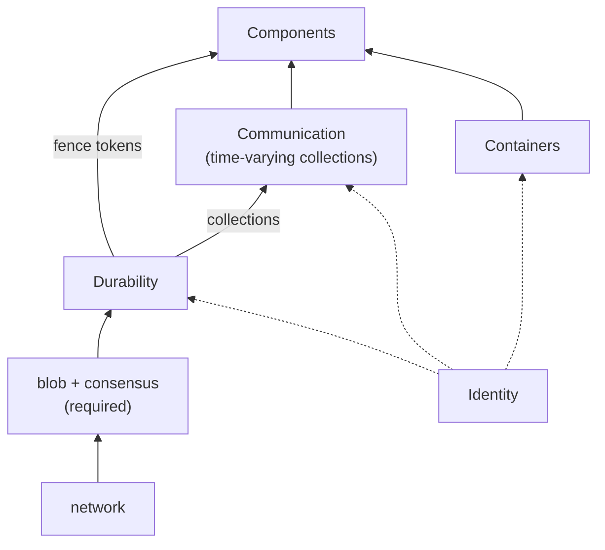

# Materialize architecture

## How to read this document

This document describes the architecture Materialize is built toward. It is a target, not a
conformance report. Where the deployed system differs, that is a deviation to be closed or a
decision to be revisited, and the known deviations are named in [Consequences](#consequences).
Every factual claim about the deployed system cites the file that supports it, because the value of
an architecture document is exactly the distance between what it says and what the code does.

The document is in two parts. **Mechanisms** are the primitives a large-scale distributed system is
built from, together with the contracts they offer. **System** is the composition of components
across defined boundaries, each built on those mechanisms. The split matters because the mechanisms
are what make decoupling possible, while the components are where the decoupling is spent.

Component and mechanism names are ordinary words, written in ordinary case. They name contracts. A
component is whatever satisfies its contract, and nothing in this document should be read as naming
a process, a binary, or a crate. Where a crate is cited it is evidence for a claim, not the
definition of a component.

## Why decouple

Materialize removes scaling limits by removing coupling. Coupling here means any requirement that
one part of the system observe another part's actions in a particular order, because such a
requirement forces the two to coordinate and coordination does not scale. The goal is to reduce the
number of places where order is load-bearing, not to make coordination faster. The places that
remain are enumerated in [Coordination points](#coordination-points), because a goal of reducing
them is only checkable against a list.

Explicit timestamps are the tool. If a read and a write both carry a time, their relative order in
wall clock is irrelevant to the outcome, so they need no sequencing between them. Removing the
sequencing requirement is what lets the physical behavior of components be decoupled from each
other. This is multiversioning, as traditional databases use it to decouple updates from query
execution, applied at the scale of a distributed system rather than of a row.

## Definite collections

A definite collection is an explicitly timestamped changelog of a data collection. Its defining
property is that any two independent readers, reading as of the same timestamp, see the same
contents. What definiteness rules out is agreement reached by exchanging messages or by
coordinating: readers agree without talking to each other or to the writer about what they read.
The property is per collection and per time, and says nothing about how the collection came to
have those contents.

There are two routes to it. A **recorded** collection is definite because its readers read the same
record. A **computed** collection is definite because it is a deterministic function of definite
inputs, so its readers agree whether or not anybody wrote the result down. Both routes give the same
property, and a collection's route is not visible to its readers.

Definiteness is agreement on contents, and only that. A reader still needs the history it reads to
be retained, which is a channel to whoever compacts the collection, and a computed collection's
readers need the same code, which is a constraint across versions. Both limits are stated where they
bite, under [Communication](#communication) and [Versioning](#versioning-and-upgrade-order). Every
guarantee in this document ultimately rests on definiteness, and every mechanism is either what
supplies it or what consumes it.

## Mechanisms

Materialize builds on three mechanisms. It provides two of them and requires one from its
environment. Durability is the required one, communication is built on it, and containers run the
programs that use both. Identity threads through all three without being one.

Each mechanism below states its operations, its guarantees, its **non-guarantees**, its failure and
recovery behavior, and its enforcement obligation. The non-guarantees are the load-bearing part: a
mechanism that promised everything would be a component, and the whole value of naming a mechanism
is knowing what it declines to do. Where the deployed implementation offers more than the contract,
the contract still governs, so that the surplus can be withdrawn. Where it offers less, that is a
deviation and is named as one.

### Durability

Durability records data and makes it survive. It imposes no data model on what is recorded.
Materialize requires it from its environment, as the `Blob` and `Consensus` traits in
`src/persist/src/location.rs`. Everything durable in the system, collections and fence tokens
alike, is ultimately a set of objects and per-key logs behind these two traits.

* **Operations.** On an object store: write a keyed immutable object, read one, list them with
  metadata, delete one, and restore a deleted one where the store can
  (`src/persist/src/location.rs:570-606`). On a log store: per key, read the head, append a version
  whose sequence number is exactly one greater than the previous (or zero on an empty log), scan
  versions from a sequence number in ascending order, and truncate versions below a sequence number
  (`src/persist/src/location.rs:446-483`).
* **Guarantees.** An acknowledged write survives. Object writes are atomic and the store is
  linearizable (`src/persist/src/location.rs:560`, `584-588`). The conditional append is
  linearizable with respect to its key, and the dense sequence numbers give a total order over that
  key's history.
* **Non-guarantees.** **No data model, and therefore no definiteness.** No timestamps. No collection
  semantics, no multiplicities, no retraction. No ordering or atomicity across keys. No reclamation:
  nothing is deleted that a caller did not delete.
* **Failure and recovery.** Durability is a remote service. Every operation may fail and must be
  retried, and a retry may duplicate a write. A process may crash between writing an object and
  recording a reference to it, so an unreferenced object is a normal state rather than an error.
* **Enforcement.** None. Neither `Blob::get` nor `Consensus::head` takes a principal
  (`src/persist/src/location.rs:452`, `572`). Whatever access control exists is the environment's,
  applied per credential, and every operation is performed with whatever credential the process
  holds.

The log store is a **log**, not a register. Persist depends on this structurally: a shard's state is
a chain of diffs in the log, read by scanning from the minimum sequence number and replaying, with
periodic rollups in the object store so the scan is bounded
(`src/persist-client/src/internal/state_versions.rs:53-98`, `605-668`). A register that kept only
the latest version would not support that, so the contract names the history and the truncation
that bounds it. The distinction matters to anyone implementing durability against a new store,
because a store that offers only a compare-and-swap register does not satisfy this contract.

Reclamation is the caller's job, and the obligation on the caller is about **crash safety of
reference tracking**, not about a reclamation policy. Persist's garbage collector scans every live
version of a shard's state, computes the set of objects no live version references, deletes them,
and truncates the log (`src/persist-client/src/internal/gc.rs:66-114`). A writer killed between
writing an object and linking it into state leaks the object, and the same scan finds and deletes it
later. What anything built on durability must therefore guarantee is that its references are
themselves recorded before they are relied on, and that an unreferenced object is never treated as
evidence of anything.

The split between durability and communication is justified by **fencing**, which uses durability
without a collection. The conditional append is enough to build a token that a later process sets
and an earlier process fails against. Two such uses exist today: the opaque token on a critical
since handle, which persist compares and swaps alongside the since
(`src/persist-client/src/critical.rs:94-96`, `286-296`), and the catalog's fence token carrying a
deploy generation, whose loser gets `FenceError::DeployGeneration`
(`src/catalog/src/durable/persist.rs:108-151`). Neither is a collection, and both are what
[Containers](#containers) rely on.

### Communication

Communication conveys data between programs as time-varying collections recorded in durability. It
is where definiteness comes from. It is implemented by persist. Its contract is the one every
component in the [System](#system) consumes, so its non-guarantees are the ones that shape every
component's recovery story.

* **Operations.** Append updates to a collection, conditional on the collection's current seal. Seal
  a collection through a time. Read the seal. Read a collection as of a time. Observe updates and
  seal advances as they happen. Hold a collection's history from a time. Release or advance a hold.
* **Guarantees.** **Definiteness**: two readers of a collection as of the same time see the same
  contents. Writes to different collections are independent. History at or beyond a hold is
  retained while the hold exists.
* **Non-guarantees.** No ordering or atomicity across collections. No bound on how long a time
  remains unsealed, so a reader waiting for a time may wait indefinitely. No idempotence of an
  append. No retention below the collection's oldest hold. No hold that outlives its holder's
  liveness without further arrangement.
* **Failure and recovery.** A reader that loses its place re-reads from the record, from any time
  at or beyond its hold. A writer that loses an acknowledgment retries, and the retry may fail with
  the current seal, at which point the writer must read the collection back to learn whether its
  write landed. Loss is detectable, not absent.
* **Enforcement.** None beyond durability's. A reader or writer that can reach durability can
  reach every collection in it.

Appends are linearized on the **seal**, not on the time. `compare_and_append` takes the seal the
writer expects and the seal it wants, applies the updates only if the collection's seal is the
expected one, and otherwise returns the current seal
(`src/persist-client/src/write.rs:376-405`). Two writers to one collection therefore conflict
whatever times their updates carry, and a write at a given time is not idempotent: a retry after an
indeterminate error sees a mismatched seal and cannot tell whether the earlier attempt landed. The
storage controller's managed collections handle exactly this by reading the collection back and
recomputing what remains to be written (`src/storage-controller/src/collection_mgmt.rs:945-1008`).
That is the general shape of a writer on this mechanism: it holds a desired state and reconciles the
record toward it, rather than assuming its own appends.

Reading needs the history, and the history is held by a **hold**. A collection has a since, below
which reads are refused (`src/persist-client/src/read.rs:259`, `904`), and every reader keeps the
since at or below the time it reads by holding it. A hold is a live object: persist's leased holds
expire on wall clock unless heartbeated, and a listener that outlives its lease is told so
(`src/persist-client/src/read.rs:338-360`). The system's own read holds carry a channel back to
their issuer and fail if the issuer is gone (`src/storage-types/src/read_holds.rs:19-27`,
`29-55`). So a reader has no channel to the writer about contents, and a permanent channel to the
compactor about retention.

Reading the seal is an operation in its own right. A writer can fetch the current seal
(`src/persist-client/src/write.rs:279`), and a listener receives seal advances as events alongside
updates (`src/persist-client/src/read.rs:154`). The [clock](#clock) is built on nothing else, which
is why the operation is declared rather than folded into reading. A component that waits for a time
to be complete is reading the seal, not the data, and the two have different costs.

Communication is a pipe, with three differences. Reading does not consume, so a second reader is not
starved by the first. A reader names a point in time rather than a position in a stream. And
independent readers agree, which no pipe promises.

**The network is not a mechanism.** It is how blob and consensus are reached, which places it
beneath durability, not beside communication. A component never conveys data to another component
by sending it a message. It writes a collection, and the other reads it. Control is different, and
is covered under [Control plane](#control-plane).

**One semantics, two latitudes.** There is one communication semantics. An implementation may elide
the durable write where the caller can reconstruct the data, and may convey a payload out of band by
parking it in durability and sending a reference to it. Both are performance choices, invisible
above the mechanism, and neither is a second kind of communication. Both oblige the implementation
to make loss **detectable**, so that a caller retries rather than silently receiving a truncated or
wrong answer.

The peek stash is the out-of-band latitude in use, and it is instructive that it does not escape the
data model. A stashed peek result is written with a batch builder over `SourceData` under a shard id
with a schema (`src/compute/src/compute_state/peek_stash.rs:64-72`, `120-130`), which is the full
collection representation. The latitude is in skipping the collection's registration and seal, not
in writing something that is not a collection. A reference lost in flight leaks the parked batch,
and deletion of consumed batches is best-effort for exactly the crash-safety reason stated under
[Durability](#durability) (`src/adapter/src/coord/peek.rs:1104-1120`).

### Containers

Containers run programs with the mechanisms available to them.

* **Operations.** Run a program, with a given configuration and principal. Stop it.
* **Guarantees.** A program asked to run eventually runs, in an environment where durability and
  communication are reachable.
* **Non-guarantees.** **No exactly-once execution.** A program may run more than once, and two runs
  may overlap in time. No bound on when a stopped program stops. No guarantee that a program
  observes its own termination.
* **Failure and recovery.** A program may be killed at any point, including mid-write. Recovery is
  the program's own responsibility and proceeds from what it can read out of durability.
* **Enforcement.** A container runs a program as a principal, and the program cannot exceed it.

Because a program may run twice, every program that writes must decide what happens when its
predecessor is still writing. There are two answers, and the system uses one of them almost
everywhere. The choice is made per writer, not per system, because it depends on whether the
writer has a token in durability that its predecessor will check. Both answers are stated here
because both derive from the container contract rather than from any component.

**Fencing** is the primary answer. The later run acquires a token in durability that the earlier run
cannot match, and the earlier run's next operation fails and halts. This is buildable from the
conditional append alone, and it is how every concurrency question in the deployed system is
resolved. The environment process announces itself leader only after opening the catalog has fenced
every prior environment (`src/environmentd/src/lib.rs:719-726`), and stamps its epoch into the
critical since of every storage collection so that a stale environment's next since downgrade halts
with the newer epoch (`src/storage-client/src/storage_collections.rs:696-719`). The catalog's fence
token is the same pattern with a deploy generation (`src/catalog/src/durable/persist.rs:108-151`).
The compute protocol opens with a nonce that a replica uses to reject a stale controller
(`src/compute-client/src/protocol/command.rs:46-53`), and the Kafka sink calls `init_transactions`
to fence every prior producer before it reads its own progress
(`src/storage/src/sink/kafka.rs:411-417`).

**Renditions** are the fallback where no fence is available: a collection has more than one
concurrently written version of its contents, and readers reconcile. The word does not occur under
`src/`, and the only multi-writer-tolerant writer in the tree does not reconcile anything. The
materialized view sink tolerates conflicting instances from other replicas by having each compute
the same desired contents and correct the record toward them, treating a failed append as the
expected signal to re-read (`src/compute/src/sink/materialized_view.rs:12-19`, `63-66`,
`1384-1387`). It works only because the instances agree on what is desired. Multi-writer tolerance
therefore **requires** compute determinism rather than substituting for it, and even that sink
starts read-only and is promoted by an explicit controller command
(`src/compute/src/sink/materialized_view.rs:105-115`), which is a fence by another name.

Where renditions are the answer, the earlier design in
[`architecture-storage.md`](../platform/architecture-storage.md) has a handover protocol, and a
checked model of it in [`RenditionHandover.lean`](RenditionHandover.lean). The model found that
"readers interpret advances of the metadata frontier as proof that no rendition change occurred"
conflates *sealed* with *empty*: a seal advance proves that no further updates will appear below it,
not that none exist there, so a reader must observe the metadata over every interval it crosses. It
also found that the protocol needs the metadata collection to be append-only in time order, which
persist supplies through its seal, and that exactly one rendition must be active across the whole
suffix beyond the seal. None of the three is stated in that document.

**Symmetric suspicion** follows from either answer. Since any program may run twice, every component
must treat every other component's output as possibly duplicated or possibly from a run that lost
its fence. This is stronger than a rule that lower layers distrust higher ones, and it does not
depend on a layering to state.

### Identity

Identity is cross-cutting rather than a fourth mechanism. Every mechanism operation names a
principal, and each mechanism enforces what that principal may do. Deciding what a principal may do
is policy, and policy is a component. Separating the two is what lets enforcement be uniform while
the rules change.

This is the target. Today no mechanism operation takes a principal, and every process reaches
durability with one unrestricted credential. Access control lives in the SQL front end
(`src/sql/src/rbac.rs`), evaluated on statements before anything reaches a mechanism, and a
cluster process receives the full durability location of every collection it is told about
(`src/storage-types/src/controller.rs:35`). The enforcement clauses on each component below state
what the component must enforce itself, and [Consequences](#consequences) records that the
mechanism-level clauses are not yet satisfied.

## System

The system is a set of components composed over the mechanisms. Each component's contract states:

* **Mechanisms consumed.** Which mechanisms, used how.
* **Guarantees offered.** What a consumer may rely on.
* **Unit of isolation and scaling.** Stated separately from the unit the contract is written in.
  These are routinely different: a contract may be per collection while the isolation unit is a
  cluster.
* **Durable state and recovery.** What survives a restart, and how the rest is rebuilt.
* **Principal and enforcement.** Which principal it runs as, and what it must enforce itself.
* **Versioning.** What this component must remain compatible with across a version boundary, and
  in which direction.

### Peers for data, ordered for control

For data, components are peers. There is no total order among them in which each may only assume
things about those below it. The earlier architecture ordered storage below compute below adapter,
and the ordering was real at the time, because storage was two things at once: the mechanism that
made collections definite, and the component that ingested data. Factor the mechanism out into
durability and communication and what remains of storage is ingest and egress, which are ordinary
peers.

What survives on the data path is a **data dependency**: a component that reads a collection depends
on whoever writes it. Data dependencies are per collection, they are not transitive through a
component, and no row crosses a control channel to satisfy one. They do not form cycles. The catalog
rejects a dependency cycle outright (`src/adapter/src/util.rs:548-551`), and nothing in the tree
constructs one, so this document does not claim them.

For control, an order exists and is load-bearing. Bootstrap applies catalog items in a fixed order
over object kinds, with the comment that all sinks are ordered greater than all tables
(`src/adapter/src/catalog/apply.rs:2350-2404`). The controller-to-replica protocol requires in-order
delivery and three stages entered in order, and a dataflow whose imports are not readable at its
as-of or whose objects are not topologically ordered is undefined behavior, with the instruction
that a replica should prefer panicking over producing incorrect results
(`src/compute-client/src/protocol.rs:28-46`, `src/compute-client/src/protocol/command.rs:105-114`).
As-of selection at bootstrap is driven by the coordinator rather than by the controller, and its
own header says it would rather be otherwise (`src/compute-client/src/as_of_selection.rs:10-16`).
The rule is: peers for data, ordered for control, and the next section is the vocabulary for the
ordered part.

### Control plane

The control plane is everything that tells a component what collections to produce, as opposed to
the collections themselves. It is where all of the system's ordering lives, and it is not a
mechanism, because nothing in it is a collection read. A controller sends a replica a description of
a dataflow, the replica reports frontiers back, and both sides must tolerate the other acting on
stale information (`src/compute-client/src/protocol.rs:20-26`). Naming it separately is what lets
the data path claim to be free of ordering without the claim being false.

Its contract is narrower than communication's, and stronger in one respect. Commands from one
controller to one replica are delivered in order (`src/compute-client/src/protocol.rs:28-32`).
Commands from a controller whose fence has been lost are rejected by the nonce
(`src/compute-client/src/protocol/command.rs:46-53`). Nothing on the control plane is durable: a
restarted controller recomputes its desired state from the catalog and reconciles the replica toward
it, and a restarted replica is told everything again.

The ordering the control plane imposes is what the data plane is free of. A replica cannot create a
dataflow until its inputs exist and are readable, so a controller must sequence creation along the
dependency graph, and the coordinator must sequence controllers at bootstrap. That sequencing is
a cost of the peer model, not a contradiction of it, and it belongs in the
[Coordination points](#coordination-points) list because it is a place where order is load-bearing.
Reducing it means moving decisions from commands into collections, which is the direction every
component contract below points.

### Ingest

Ingest makes an external system's data available as a definite collection.

* **Mechanisms.** Communication, to write the collection. Containers, to run.
* **Guarantees.** The named collection is definite, and its contents correspond to the external
  system's according to a stated correspondence. Recovery after a restart does not require the
  external system to retain data already ingested past the collection's seal.
* **Isolation and scaling.** Contract per collection. Isolation per cluster.
* **Durable state.** The collection itself, plus whatever mapping from external positions to times
  the correspondence requires. Everything else is rebuilt.
* **Enforcement.** Holds credentials for the external system, and must not lend them to its callers.
* **Versioning.** Must read the position mapping written by any prior version that could have
  written it, since it is the only record of where to resume.

An ingested collection is definite by the recorded route, and only by that route. A source's write
path deliberately omits the self-correction that compute's write path has, because source
collections "cannot be reliably re-produced once written down"
(`src/storage/src/render/persist_sink.rs:65-80`). The external system may have dropped or rewritten
the data, or the correspondence may depend on when it was read. The record is therefore the only
copy, and this is the same shape as retained history under [Compute](#compute): a recorded
collection whose contents are not recoverable from anything else.

**Clocks.** The norm is a coordinated clock, because minting times from a local wall clock is only
correct given a guaranteed single writer, and guaranteeing a single writer is itself a consensus
problem. An ingest may mint its own times only where the external world already forces a single
reader of the upstream, which supplies the single writer for free. Where an ingest has that
exception available, whether it takes it is a performance question about the cost of the coordinated
clock, not an architectural one.

### Egress

Egress makes a definite collection's contents available as an effect in an external system.

* **Mechanisms.** Communication, to read the collection. Containers, to run.
* **Guarantees.** Every update in the collection through some time is reflected in the external
  system, **at least once**, for an egress that offers that guarantee. An egress that offers less
  must say so in its own contract.
* **Non-guarantees.** Not exactly once, in general.
* **Isolation and scaling.** Contract per collection. Isolation per cluster.
* **Durable state.** Its progress through the collection, recorded in the external system where
  it can be, since durability on this side survives only as long as the collection does.
* **Enforcement.** Holds credentials for the external system, and must not lend them to its callers.
* **Versioning.** Must read the progress record written by any prior version, and must write one
  the external system's consumers still understand.

Egress is where the container contract bites hardest. Inside the system a duplicate is absorbed by
whoever reads the collection: the same records written twice accumulate to the same contents, and a
subscribe's controller trims a replica's batch below the frontier it already delivered
(`src/compute-client/src/controller/instance.rs:2252-2276`). An external effect has no reader who
knows the frontier, so the duplicate is visible to someone else. Whatever absorption exists must be
built on the external system's side, out of whatever that system offers.

Exactly-once egress needs three things, and Materialize supplies two of them itself. The external
system must support atomic commit. The egress must be able to fence its predecessor, because a
predecessor that keeps writing after the successor has read the progress makes that read unsound.
And the egress must be able to read what it already wrote, which no supported external system
offers: Materialize manufactures the log, as a progress record committed inside the same Kafka
transaction as the data (`src/storage/src/sink/kafka.rs:543-550`), or as a frontier property on the
Iceberg snapshot (`src/storage/src/sink/iceberg.rs:79-83`). The Kafka sink documents the ordering:
fencing must precede reading the progress topic (`src/storage/src/sink/kafka.rs:909-912`).

None of the three is required for every egress. A one-shot copy to object storage has no
transaction and no log, runs concurrently on every replica by design, and is correct because every
file's key is a deterministic function of its batch and position, so replicas write identical
objects and the first to finish removes the in-progress sentinel
(`src/compute/src/sink/copy_to_s3_oneshot.rs:57-60`,
`src/storage-types/src/sinks/s3_oneshot_sink.rs:137-143`,
`src/storage-operators/src/s3_oneshot_sink.rs:269-283`). Idempotent addressing substitutes for both
transaction and log. The general statement is that exactly-once needs *some* way to make a
duplicate write a no-op, and a transaction plus a manufactured log is one way among several.

Two egresses offer **less** than at least once, and the contract above requires them to say so. A
failed one-shot copy retires its statement with the error and nothing re-drives the upload
(`src/adapter/src/coord/message_handler.rs:764-773`), so its effect on failure is partial. A metric
sink exposes the current fold of its input to whoever scrapes it, and drops rows it cannot
represent, counting them rather than failing
(`src/compute/src/sink/metric_sink.rs:475-499`). Both live in compute rather than in a storage
cluster, which is a fact about deployment, not about the contract: an external effect is an egress
wherever it runs. What is not an egress is an output written back to a collection, whoever consumes
it afterward.

### Compute

Compute maintains definite collections derived from definite collections.

* **Mechanisms.** Communication, to read inputs and write outputs. Containers, to run.
* **Guarantees.** Each output collection is definite and equals the declared function of the inputs
  as of each time, with the carve-outs below.
* **Non-guarantees.** No bound on how far behind its inputs an output may be.
* **Isolation and scaling.** Contract per output collection. Isolation per cluster.
* **Durable state.** A hold on each input's history from the output's as-of, held in durability on
  its behalf (`src/storage-client/src/storage_collections.rs:557-590`). Recording an output is a
  cache of a value the inputs already determine, so everything else is recoverable.
* **Enforcement.** Should run as a principal that may read its inputs and write its outputs, and no
  more. Today it runs with unrestricted access, see [Consequences](#consequences).
* **Versioning.** A recorded output must be readable by the next version. Two versions computing
  the same output concurrently must not both write, see
  [Versioning](#versioning-and-upgrade-order).

**Compute's durable output is a cache.** A computed collection takes the second route to
definiteness, so its contents are determined by its inputs whether or not they are written down. An
index is the same kind of object with the cache omitted, and a materialized view is the same kind of
object with the cache kept. The hold is the durable state that makes this true: without it, the
inputs compact past the as-of and the output stops being recoverable.

The determinism this rests on is enforced, with three carve-outs. Every maintained plan is checked
for calls to unmaterializable functions and rejected if it has any
(`src/adapter/src/optimize/dataflows.rs:153-199`), with temporal filters admitted as plan
transformations rather than as calls (`163-173`). Floating-point sums accumulate in a fixed-point
integer domain whose addition is a group operation, so the result is independent of the order in
which updates arrive (`src/compute/src/render/reduce.rs:1675-1702`). No operator under
`src/compute/src/render/` consults its worker index or peer count.

The carve-outs are where the realized function is not of the inputs alone.

* **Errors.** If a dataflow's error stream is non-empty, the ok stream has no defined contents, and
  which error surfaces is selected arbitrarily (`src/compute/src/render.rs:62-66`, `85-86`). The
  materialized view sink normalizes error multiplicity before writing because otherwise the written
  value depends on plan shape (`src/compute/src/render/sinks.rs:134-142`). The realized function is
  of the inputs and the plan.
* **Expiration.** A replica folds its start wall clock plus an offset into every dataflow's
  `until`, and stops advancing outputs at that time
  (`src/compute/src/compute_state.rs:605-621`, `773-782`, `src/compute/src/render.rs:797-808`).
  The output is correct where it exists, but where it stops is a function of when the replica
  started.
* **Introspection.** A materialized view over a log source is rejected because replicas are not
  producing the same definite collection for those
  (`src/adapter/src/coord/sequencer/inner/create_materialized_view.rs:349-360`). An index over the
  same source is not rejected, so an index can be a computed collection whose two replicas disagree.

`REFRESH EVERY` is not a carve-out. The next refresh time is a pure function of a timestamp, the
interval, and the alignment (`src/repr/src/refresh_schedule.rs:99-119`), and the alignment is
purified to a literal when the view is created (`src/sql/src/pure.rs:2954-2985`). The refresh
schedule is therefore part of the declared function, not an input to it. What does strain the
cache claim is **retained history**: a collection that holds times its inputs have compacted away
has a recorded output that is the only copy. That is the ingest shape rather than the compute shape,
and is why it is listed under [Open questions](#open-questions).

### Transactions

Transactions offer atomicity across collections, which no mechanism provides.

* **Mechanisms.** Communication, for the proposal and outcome collections. Containers, to run the
  decider.
* **Guarantees.** For a proposed transaction naming any set of collections, either all of its
  updates appear at one time or none do, and readers agree on which.
* **Isolation and scaling.** Contract per timeline.
* **Durable state.** The proposal and outcome collections.
* **Versioning.** The proposal record is read by the decider and by every reader of a participating
  collection, so its format is compatible in both directions across a boundary.

A proposed transaction is data: a record naming the collections it touches and the updates it makes,
appended to a definite collection at a time. A decider reads the proposal collection and writes an
outcome collection saying which proposals won. Because the transaction names its own collections,
there is no membership registry to keep outside the data. That removes the registry, and nothing
else: a writer that appends to a participating collection directly, unaware of the transaction
protocol, still produces a collection whose contents disagree with the outcome, and only a fence on
the collection's writers can prevent it.

The deployed implementation registers participating shards, and the registration is a **read-path**
guarantee rather than bookkeeping. A commit advances the logical upper of every registered shard,
including shards the transaction did not touch (`src/txn-wal/src/lib.rs:83-89`), so a reader of
shard A learns that A is complete through the commit time without reading any of A's potential
writers. Removing the registry moves that cost onto readers, who must then consult the proposal
collection to learn whether a time is complete. Whether that trade is worth taking is open, and the
direct-write hazard the deployed design warns about (`src/txn-wal/src/lib.rs:20-22`) is present in
both designs.

The decider is a serialization point in the *data*, not necessarily in the compute. It is a
deterministic function of a definite collection, so several instances may run and produce the same
outcome collection, given the determinism obligations under [Compute](#compute). Whether that
redundancy is worth taking is a performance question. The deployed implementation instead
linearizes every commit through one shard (`src/txn-wal/src/lib.rs:60-61`), which is the same
serialization point placed in the write path rather than in a decider.

### Clock

The clock publishes a coordinated time that components read to agree on when they are.

* **Mechanisms.** Communication, for the seal. Containers, to run whatever advances it.
* **Guarantees.** A definite collection with no data, whose seal advances monotonically. Readers
  agree on the seal for the same reason they agree on anything else, which is that they read the
  same record.
* **Non-guarantees.** No bound on the seal's distance from wall clock. No allocation of distinct
  times to distinct callers.
* **Isolation and scaling.** Contract per timeline.
* **Versioning.** The seal is a timestamp and nothing else, so nothing to version.

A data-less collection is an unusual shape and it is the point: the collection's entire content is
its seal. Reading the clock as of a time means waiting for the seal to pass it. This makes the shared
clock an ordinary definite object rather than a service with its own semantics, and it makes an
ingest that drives its own time distinguishable from one that reads the clock by which collection it
reads, not by which code path it takes. Advancing the seal is one conditional append per step, which
is the cost that [Open questions](#open-questions) weighs against the current clock.

What this clock does not supply is the oracle the deployed system has. The timestamp oracle
*allocates* a write timestamp strictly greater than every prior read and write timestamp, and must
be *told* when a write completes, after which every read timestamp is at least that write
(`src/timestamp-oracle/src/lib.rs:40-66`). That is a linearizability relation between reads and
writes, per timeline (`src/adapter/src/coord/timeline.rs:69-73`), and it is not expressible as
observing a seal. This document assigns the allocation and the read-after-write relation to
[timestamp selection](#catalog-planning-and-control), and leaves the clock with the seal only.
Whether the seal alone earns its place is under [Open questions](#open-questions).

### Catalog, planning, and control

The remaining components are what the earlier architecture called adapter. It is not one component.
Their full contracts are not written below, because the decomposition itself is an open question and
writing six fields each would assert a split that is not yet settled. What follows is the split as
currently understood, with each component's distinguishing guarantee.

* **Catalog.** Holds the durable record of what objects exist. Its guarantees are that the record is
  definite, so independent readers agree, and that a process opening it for writing fences every
  prior writer (`src/catalog/src/durable/persist.rs:108-151`). The second is what lets a second
  process serve from it safely, and the first is what lets it serve at all.
* **Planning.** Parses user input and produces the descriptions that compute, ingest, and egress
  consume. Stateless, and a function of the catalog as of a time.
* **Controllers.** One per resource kind, for durability, ingest, egress, and compute. Each
  translates a desired state from the catalog into instructions to its resource over the
  [control plane](#control-plane), and reconciles what it finds against what is wanted.
* **Compaction policy.** Decides how much history each collection retains, by holding and advancing
  holds. Separate because it is policy over every collection rather than a property of any one of
  them.
* **Timestamp selection.** Chooses the times at which a user's reads and writes happen. This owns
  the allocation of write times and the read-after-write relation that the [clock](#clock) does
  not, and reads the clock for the rest.
* **Policy.** Decides what a principal may do. The mechanisms enforce. This decides.

These components hold substantial in-memory state, and that state is reconstructable from the durable
catalog but **not equivalent to it**. The difference is the part that matters for their contracts:
what is derived can be rebuilt after a restart, and what is not derived either has its own durable
record or is lost. Each component must say which of its state is which. The controllers' picture of
what a replica currently runs is the clearest case, since it is derived from the catalog and
rebuilt by reconciliation, while the timestamp oracle's last allocated time is not derived and has
its own record (`src/timestamp-oracle/src/postgres_oracle.rs:10-12`).

## Coordination points

The objective stated under [Why decouple](#why-decouple) is to reduce the places where order is
load-bearing. That is only checkable against a list, so here is the list. Each entry is a place
where two participants must agree on an order, and the mechanism that supplies the agreement. An
entry is removed by turning the agreement into a collection read, and added whenever a component
acquires a decision that two of its instances could make differently.

| Point | Order it imposes | Supplied by |
| --- | --- | --- |
| Conditional append per collection | Which writer's append lands on a given seal | Durability's log per key |
| Clock seal advance | Which times are complete on a timeline | Conditional append on the clock collection |
| Transaction decider | Which proposals commit at a time | Conditional append on the outcome collection |
| Catalog write path | Which DDL is applied, and by which process | Conditional append on the catalog, with the fence token |
| Timestamp selection per timeline | Read-after-write across sessions | The oracle, one per timeline |
| Program handover | Which run of a program may write | Fence tokens in durability, or renditions where none exist |
| Control-plane sequencing | Creation along the dependency graph, and stages of the replica protocol | In-order delivery on one connection, and bootstrap order in the coordinator |

Comparable systems each name theirs, and it is the naming that lets the count be argued down. The
first four are one mechanism used four times, which is the sense in which durability is the only
thing Materialize requires. The fifth is the one this document has not yet folded into a collection
read. The last two are the cost of running programs that may run twice, and of telling programs
what to run.

## Versioning and upgrade order

A layer ordering is also a versioning ordering: a layered system upgrades bottom-up and each layer
owes compatibility only to the layers above it. A peer graph has no such order. Every pair of
components that share a collection owe each other compatibility on that collection's format, and
there is no topological deploy order to fall back on. That is the price of the peer model, and it is
paid by the **versioning** field on every component contract.

Communication's contract is a **format**, and a one-directional one. Every version of a collection's
state is tagged with the code version that wrote it, newer code may read older data, and older code
halts on newer data (`src/persist-client/src/cfg.rs:766-790`,
`src/persist-client/src/internal/encoding.rs:299-310`). A process that opens a collection for writing
upgrades its version tag (`src/storage-client/src/storage_collections.rs:580-590`). The format is
not third-party readable in practice, since the only reader is the shared crate, but the
compatibility rule is stated on the data rather than on the crate, which is what makes a rolling
upgrade possible.

Two versions of compute coexist exactly during an upgrade, and they are not the same function. A
computed collection's readers agree because they run the same code, and across a version boundary
the optimizer and the operators differ. Two versions of a materialized view are therefore not two
renditions of one value, and the deployed system does not let them both write: the new generation's
sink starts read-only and is promoted by an explicit command once the old generation has been fenced
(`src/compute/src/sink/materialized_view.rs:105-115`, `src/environmentd/src/lib.rs:715-726`). Until
promotion the new generation holds only leased, not critical, holds on its inputs
(`src/storage-client/src/storage_collections.rs:576-579`). That is a fence at the boundary, and it is
what the compute contract's versioning field requires.

## Consequences

**Known deviations, mechanisms.** No mechanism operation takes a principal, and every process
reaches durability with one unrestricted credential. The compute enforcement clause is therefore
unsatisfied today: a cluster process holds the same access as the environment process, and receives
every collection's full durability location. Durability's contract says none, which is honest, and
the identity contract is entirely target.

**Known deviations, components.** Ingest mints times from a local wall clock and the coordinated
clock is used only on the user write path. Cross-collection atomicity registers its participating
shards, so writing to one directly is undefined behavior, and this document has stated what removing
the registry would cost readers. Two egresses offer less than at least once. An index over an
introspection source is a computed collection whose replicas may disagree, and only the materialized
view form is rejected. Each is stated at the component that owns it.

**Two documents disagree on conflicting writes.** `architecture-storage.md` says the contents of a
collection are undefined if two writers write conflicting data into one shard. This document says
that communication linearizes appends on the seal, so the contents are defined and the readers
agree. The real hazard is not the record but the writer that lost the race: its own state disagrees
with what won, and unless it reads the record back and reconciles, its next append is built on a
value the collection does not hold. The managed-collection writer under [Communication](#communication)
is the pattern, and any writer that does not follow it is the undefined behavior that document names.

**The handover model is not normative.** `RenditionHandover.lean` is checked by no build or CI job,
and the three obligations it found are recorded here in prose. Whether prose or a model is normative
is under [Open questions](#open-questions).

**What this costs.** Every component now states a contract, including its non-guarantees, and a
contract is a commitment that constrains implementations. The previous architecture let a layer do as
it liked internally so long as it satisfied those above it. Peers with published non-guarantees have
less room, in exchange for the caller being able to reason without reading the implementation, and
in exchange for an all-pairs compatibility obligation where a layering would have had a deploy order.

## Open questions

* **A contract for names.** Nothing in this document says what a name means. A name resolves to an
  identifier and the identifier to a collection, and the two bindings have different lifetimes: a
  schema swap is three renames and touches no identifier
  (`src/adapter/src/coord/sequencer/inner.rs:3288-3300`), and an identifier's shard may not change
  at all (`src/storage-types/src/controller.rs:61-64`). A catalog version is not a collection time,
  so two readers resolving a name at different moments disagree unless they ask the catalog, and
  asking the catalog is a coordination channel. Whether names are a component, a mechanism, or a
  property of the catalog is unsettled.
* **Whether the clock earns its place.** With allocation and read-after-write assigned to timestamp
  selection, the clock is a seal and nothing else. Whether a data-less collection is worth having as
  a distinct object, or whether the oracle simply is the clock and the collection framing should be
  dropped, is open.
* **Whether retained history survives the cache claim.** A collection holding times its inputs have
  compacted away has a recorded output that is the only copy, which is the ingest shape. Whether it
  is a compute feature with a stronger durable-state clause or a different kind of object is open.
* **Whether renditions are needed at all.** Every concurrency question in the deployed system is
  answered by a fence. If a fence is always available, renditions are a fallback for a case that
  does not arise, and the handover protocol and its model describe something the system does not
  do.
* **Whether a coordinated clock is affordable for ingest.** Advancing a durable seal costs a
  conditional append per step per collection, and a non-durable seal is a correctness violation, so
  the exchange is close to like-for-like with the current clock rather than free.
* **Whether the transaction registry should go.** Self-naming proposals remove registry state and
  push the cost of learning that a time is complete onto readers. The trade is stated under
  [Transactions](#transactions) and not decided.
* **Whether the split of catalog, planning, controllers, compaction policy, timestamp selection, and
  policy is the right one**, or whether some of these are one component seen from different angles.
* **Whether this document's prose or a machine-checked model is normative.** There is one model,
  [`RenditionHandover.lean`](RenditionHandover.lean), and it found three obligations the document it
  models relies on without stating, which is an argument for models being worth writing. It is
  checked by no build or CI job, which is an argument against them being normative until one does.
