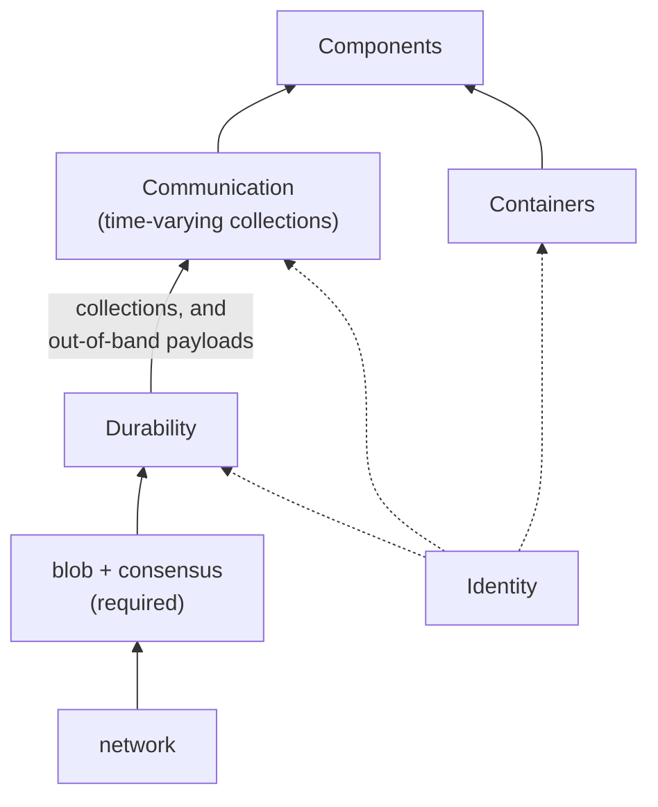

# Materialize architecture

## How to read this document

This document describes the architecture Materialize is built toward. It is a target, not a
conformance report. Where the deployed system differs, that is a deviation to be closed or a
decision to be revisited, and the largest known deviations are named in [Consequences](#consequences).

The document is in two parts. **Mechanisms** are the primitives a large-scale distributed system is
built from, together with the contracts they offer. **System** is the composition of components
across defined boundaries, each built on those mechanisms. The split matters because the mechanisms
are what make decoupling possible, while the components are where the decoupling is spent.

Component and mechanism names are ordinary words, written in ordinary case. They name contracts. A
component is whatever satisfies its contract, and nothing in this document should be read as naming
a process, a binary, or a crate.

## Why decouple

Materialize removes scaling limits by removing coupling. Coupling here means any requirement that
one part of the system observe another part's actions in a particular order, because such a
requirement forces the two to coordinate and coordination does not scale. The goal is to reduce the
number of places where order is load-bearing, not to make coordination faster.

Explicit timestamps are the tool. If a read and a write both carry a time, their relative order in
wall-clock is irrelevant to the outcome, so they need no sequencing between them. Removing the
sequencing requirement is what lets the physical behavior of components be decoupled from each
other. This is multiversioning, as traditional databases use it to decouple updates from query
execution, applied at the scale of a distributed system rather than of a row.

## Definite collections

A definite collection is an explicitly timestamped changelog of a data collection. Its defining
property is that any two independent readers, reading as of the same timestamp, see the same
contents. What definiteness rules out is agreement reached by exchanging messages or by
coordinating: readers agree without talking to each other or to the writer.

There are two routes to it. A **recorded** collection is definite because its readers read the same
record. A **computed** collection is definite because it is a deterministic function of definite
inputs, so its readers agree whether or not anybody wrote the result down. Both routes give the same
property, and a collection's route is not visible to its readers.

Definiteness is what makes a collection safe to share without coordinating. A reader needs no
channel to the writer and no knowledge of other readers.

Every guarantee in this document ultimately rests on definiteness, and every mechanism is either
what supplies it or what consumes it.

## Mechanisms

Materialize builds on three mechanisms. It provides two of them and requires one from its
environment.

Each mechanism below states its operations, its guarantees, its **non-guarantees**, its failure and
recovery behavior, and its enforcement obligation. The non-guarantees are the load-bearing part: a
mechanism that promised everything would be a component, and the whole value of naming a mechanism
is knowing what it declines to do.

### Durability

Durability records data and makes it survive. It imposes no data model on what is recorded.

* **Operations.** Write a keyed, immutable object. Read one. List them. Read the current version of
  a keyed register, and set it conditional on its version being unchanged.
* **Guarantees.** An acknowledged write survives. The conditional set on a register is linearizable
  with respect to that register.
* **Non-guarantees.** **No data model, and therefore no definiteness.** No timestamps. No collection
  semantics, no multiplicities, no retraction. No ordering or atomicity across keys. No promptness in
  reclaiming data nothing references.
* **Failure and recovery.** Durability is a remote service. Every operation may fail and must be
  retried, and a retry may duplicate a write. A process may crash between writing an object and
  recording a reference to it, so unreferenced data is a normal state rather than an error.
* **Enforcement.** Every operation names a principal, and durability enforces that principal's
  access to the keys it touches.

Data that nothing references is reclaimed **lazily**. Eager reclamation is not available, because a
process can crash between writing an object and linking it, so at any instant an unreferenced object
may be one a live writer is about to reference. Anything built on durability must therefore tolerate
garbage that outlives its referent, and must not treat the presence of an unreferenced object as
evidence of anything.

### Communication

Communication conveys data between programs as time-varying collections recorded in durability. It
is where definiteness comes from.

* **Operations.** Append updates at a time to a collection. Seal a collection through a time. Read a
  collection as of a time. Observe updates to a collection as they are appended.
* **Guarantees.** **Definiteness**: two readers of a collection as of the same time see the same
  contents. Writes carrying distinct times do not conflict, and a write at a given time is
  idempotent, so retrying it is safe.
* **Non-guarantees.** No ordering or atomicity across independent collections. No bound on how long
  a time remains unsealed, so a reader waiting for a time may wait indefinitely. No promise about
  which of several writers to the same time wins, only that readers agree on the outcome.
* **Failure and recovery.** A reader that loses its place re-reads from the record. A writer that
  loses an acknowledgement retries, and idempotence at a time makes the retry harmless.
* **Enforcement.** Operations name a principal, and communication enforces that principal's access
  to the collection, delegating to durability for the objects beneath it.

Communication is a pipe, with three differences. Reading does not consume, so a second reader is not
starved by the first. A reader names a point in time rather than a position in a stream. And
independent readers agree, which no pipe promises.

**The network is not a mechanism.** It is how blob and consensus are reached, which places it
beneath durability, not beside communication. A component never communicates with another component
by sending it a message. It writes a collection, and the other reads it.

**One semantics, two latitudes.** There is one communication semantics. An implementation may elide
the durable write where the caller can reconstruct the data, and may convey a payload out of band by
parking it in durability and sending a reference to it. Both are performance choices, invisible above
the mechanism, and neither is a second kind of communication. Both oblige the implementation to make
loss **detectable**, so that a caller retries rather than silently receiving a truncated or wrong
answer. Silent loss is the failure that a performance optimization must not introduce.

### Containers

Containers run programs with the mechanisms available to them.

* **Operations.** Run a program, with a given configuration and principal. Stop it.
* **Guarantees.** A program asked to run eventually runs, in an environment where durability and
  communication are reachable.
* **Non-guarantees.** **No exactly-once execution.** A program may run more than once, and two runs
  may overlap in time. No bound on when a stopped program stops. No guarantee that a program
  observes its own termination.
* **Failure and recovery.** A program may be killed at any point, including mid-write. Recovery is
  the program's own responsibility and proceeds from what it can read out of durability.
* **Enforcement.** A container runs a program as a principal and the program cannot exceed it.

Two structural consequences follow from the absence of exactly-once execution, and both are cheaper
to derive here than to justify later.

The first is **renditions**. Because a program may run twice, a collection may have more than one
concurrently-written version of its contents. These are renditions, and reconciling them is a
communication-level policy, not an accident to be prevented. Renditions exist because of the
container contract, not because of a storage quirk.

The second is **symmetric suspicion**. Since any program may run twice, every component must treat
every other component's output as possibly duplicated. This is stronger than a rule that lower
layers distrust higher ones, and it does not depend on a layering to state.

### Identity

Identity is cross-cutting rather than a fourth mechanism. Every mechanism operation names a
principal, and each mechanism enforces what that principal may do. Deciding what a principal may do
is policy, and policy is a component.

## System

The system is a set of components composed over the mechanisms. Each component's contract states:

* **Mechanisms consumed.** Which mechanisms, used how.
* **Guarantees offered.** What a consumer may rely on.
* **Unit of isolation and scaling.** Stated separately from the unit the contract is written in.
  These are routinely different: a contract may be per collection while the isolation unit is a
  cluster.
* **Durable state and recovery.** What survives a restart, and how the rest is rebuilt.
* **Principal and enforcement.** Which principal it runs as, and what it must enforce itself.

### Peers, not layers

Components are peers. There is no total order among them in which each may only assume things about
those below it.

The earlier architecture ordered storage below compute below adapter, and the ordering was real at
the time, because storage was two things at once: the mechanism that made collections definite, and
the component that ingested data. The mechanism genuinely sat at the bottom. Factor it out into
durability and communication and what remains of storage is ingest and egress, which are ordinary
peers and always were. The layering was the mechanism's position, attributed to a component.

What survives is a **data dependency**: a component that reads a collection depends on whoever
writes it. Data dependencies are per collection, they are not transitive through a component, and
they may form cycles that a layering would forbid. The old rule that storage must treat compute's
output with suspicion survives with the better derivation given under Containers, and in symmetric
form.

### Ingest

Ingest makes an external system's data available as a definite collection.

* **Mechanisms.** Communication, to write the collection. Containers, to run.
* **Guarantees.** The named collection is definite, and its contents correspond to the external
  system's according to a stated correspondence. Recovery after a restart does not require the
  external system to retain data already ingested past the collection's seal.
* **Isolation and scaling.** Contract per collection. Isolation per cluster.
* **Durable state.** The collection itself, plus whatever mapping from external positions to times
  the correspondence requires. Everything else is rebuilt.
* **Enforcement.** Holds credentials for the external system, and must not lend them to its callers.

**Clocks.** The norm is a coordinated clock, because minting times from a local wall clock is only
correct given a guaranteed single writer, and guaranteeing a single writer is itself a consensus
problem. An ingest may mint its own times only where the external world already forces a single
reader of the upstream, which supplies the single writer for free. Where an ingest has that
exception available, whether it takes it is a performance question about the cost of the coordinated
clock, not an architectural one.

### Egress

Egress makes a definite collection's contents available to an external system.

* **Mechanisms.** Communication, to read the collection. Containers, to run.
* **Guarantees.** Every update in the collection through some time is reflected in the external
  system, **at least once**.
* **Non-guarantees.** Not exactly once, in general.
* **Isolation and scaling.** Contract per collection. Isolation per cluster.
* **Durable state.** Its progress through the collection, to the extent the external system can be
  asked what it already received.
* **Enforcement.** Holds credentials for the external system, and must not lend them to its callers.

Egress is where the container contract bites hardest, because it is the only place a duplicate
cannot be absorbed. Inside the system a program that runs twice writes the same records twice and
readers still agree, so definiteness absorbs the duplication. An external effect has no such
absorption and the duplicate is visible to someone else.

Exactly-once egress is therefore available only where the external system supports transactions
**and** offers a log the egress can read to determine what it already wrote. Both halves are
required: transactions without a readable log leave the egress unable to resume, and a readable log
without transactions leaves it unable to commit atomically. Where the external system offers neither,
at-least-once is the contract, and downstream consumers absorb the duplication.

### Compute

Compute maintains definite collections derived from definite collections.

* **Mechanisms.** Communication, to read inputs and write outputs. Containers, to run.
* **Guarantees.** Each output collection is definite and equals the declared function of the inputs
  as of each time.
* **Non-guarantees.** No bound on how far behind its inputs an output may be.
* **Isolation and scaling.** Contract per output collection. Isolation per cluster.
* **Durable state.** None required. Recording an output is a cache of a value the inputs already
  determine, so everything compute holds is recoverable from what is durable beneath it.
* **Enforcement.** Runs as a principal that may read its inputs and write its outputs, and no more.

An output written back to durability is not an egress. It is compute's output, and the fact that
some outputs are consumed by users and others by further computation is not an architectural
distinction.

**Compute's durable output is an optimization, not a requirement.** A computed collection takes the
second route to definiteness, so its contents are determined by its inputs whether or not they are
written down. An index is the same kind of object with the cache omitted, and a materialized view is
the same kind of object with the cache kept. This is also why a compute container may run twice
without harm: two renditions of a deterministic computation over the same definite inputs as of the
same times are equal, so reconciling them is a choice between identical values.

Two features strain this. A collection with retained history holds times its inputs have already
compacted away, so its recorded output stops being a cache and becomes the only copy. `REFRESH EVERY`
produces output that depends on when it refreshed, which is determined only once the clock it reads
is itself a definite collection, which is one of the arguments for the [clock](#clock) being one.
Both are deterministic in principle, both may fail to be in the current implementation, and both are
candidates for reconsideration.

### Transactions

Transactions offer atomicity across collections, which no mechanism provides.

* **Mechanisms.** Communication only.
* **Guarantees.** For a proposed transaction naming any set of collections, either all of its
  updates appear at one time or none do, and readers agree on which.
* **Isolation and scaling.** Contract per timeline.
* **Durable state.** The proposal and outcome collections.

A proposed transaction is data: a record naming the collections it touches and the updates it makes,
appended to a definite collection at a time. A decider reads the proposal collection and writes an
outcome collection saying which proposals won. Because the transaction names its own collections, the
set of participating collections is per transaction and needs no registration, so there is no
membership state to hold outside the data and no way to violate it by writing to a collection
directly.

The decider is a serialization point in the *data*, not necessarily in the compute. It is a
deterministic function of a definite collection, so several instances may run redundantly and
produce the same outcome collection, which is the rendition property the container contract already
requires. Whether that redundancy is worth taking is a performance question.

### Clock

The clock publishes a coordinated time that components read to agree on when they are.

* **Mechanisms.** Communication.
* **Guarantees.** A definite collection with no data, whose seal advances monotonically and tracks
  wall-clock within a stated bound. Readers agree on what time it is for the same reason they agree
  on anything else, which is that they read the same record.
* **Isolation and scaling.** Contract per timeline.

A data-less collection is an unusual shape and it is the point: the collection's entire content is
its seal. Reading the clock as of a time means waiting for the seal to pass it. This makes the shared
clock an ordinary definite object rather than a service with its own semantics, and it makes an
ingest that drives its own time distinguishable from one that reads the clock by which collection it
reads, not by which code path it takes.

### Catalog, planning, and control

The remaining components are what the earlier architecture called adapter. It is not one component.
Their full contracts are not written below, because the decomposition itself is an open question and
writing five fields each would assert a split that is not yet settled. What follows is the split as
currently understood, with each component's distinguishing guarantee.

* **Catalog.** Holds the durable record of what objects exist. Its guarantee is that the record is
  definite, so independent readers of the catalog agree, which is what lets a second process serve
  from it.
* **Planning.** Parses user input and produces the descriptions that compute, ingest, and egress
  consume. Stateless, and a function of the catalog as of a time.
* **Controllers.** One per resource kind, for durability, ingest, egress, and compute. Each
  translates a desired state from the catalog into instructions to its resource, and reconciles what
  it finds against what is wanted.
* **Compaction policy.** Decides how much history each collection retains. Separate because it is
  policy over every collection rather than a property of any one of them.
* **Timestamp selection.** Chooses the times at which a user's reads and writes happen, reading the
  clock to do so. Distinct from the clock, which publishes time rather than choosing it.
* **Policy.** Decides what a principal may do. The mechanisms enforce. This decides.

These components hold substantial in-memory state, and that state is reconstructable from the durable
catalog but **not equivalent to it**. The difference is the part that matters for their contracts:
what is derived can be rebuilt after a restart, and what is not derived either has its own durable
record or is lost, and each component must say which of its state is which.

## Consequences

**Known deviations.** Ingest currently mints times from a local wall clock rather than reading a
coordinated clock, and the coordinated clock is used only on the user write path. Cross-collection
atomicity is implemented by a coordinating collection with a registered membership set, so writing
to a participating collection directly is undefined behavior, which is the membership state this
document says should live in the transaction instead. Both are deviations with the same shape, which
is state held outside the data.

**Non-collection uses of durability.** Durability declining to impose a data model is what allows
communication to park an out-of-band payload in it. That is currently the only such use. A second
imaginable one is recording an external system's raw stream, which need not be a collection, and
whether that would be a performance optimization or a structural use of append-only storage is not
settled. If the answer is that nothing else will ever want it, the durability and communication split
is real but thin, and worth revisiting.

**What this costs.** Every component now states a contract, including its non-guarantees, and a
contract is a commitment that constrains implementations. The previous architecture let a layer do as
it liked internally so long as it satisfied those above it. Peers with published non-guarantees have
less room, in exchange for the caller being able to reason without reading the implementation.

## Open questions

* Whether retained history and `REFRESH EVERY` survive the claim that a computed collection's
  recorded output is only a cache. Retained history makes that output the only copy of times the
  inputs have dropped, which is a different kind of object, and both features are candidates for
  reconsideration rather than for enshrining.
* Whether recording an external system's raw stream is a performance optimization or a structural use
  of append-only durability. It determines whether the durability and communication split carries
  weight beyond out-of-band payloads.
* Whether a coordinated clock is affordable for ingest. Advancing a durable seal costs a conditional
  set per step per collection, and soft non-durable seals are a correctness violation, so the
  exchange is close to like-for-like with the current clock rather than free.
* Where timestamp selection ends and the clock begins, given that a timeline's read timestamp is
  itself a decision that several processes must agree on.
* Whether the split of catalog, planning, controllers, compaction policy, timestamp selection, and
  policy is the right one, or whether some of these are one component seen from different angles.
* Whether this document's prose or a machine-checked model is normative, once there is a model.
