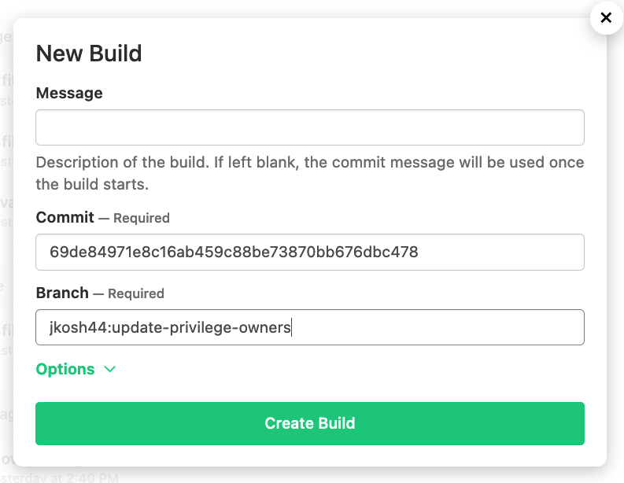
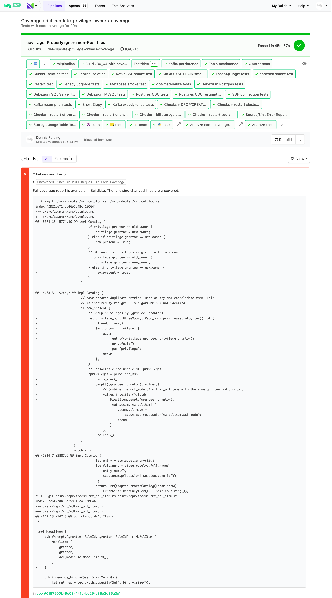
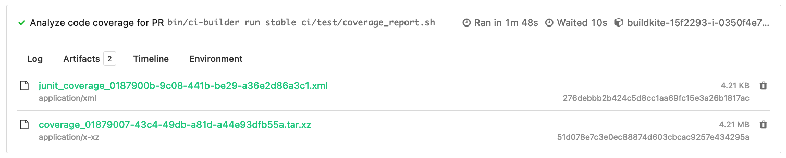

# Code Coverage for Pull Requests

## Motivation

A full code coverage report allows you to check for each part of the code if there is a test that currently covers it by executing the relevant lines of code. Unfortunately the motivation to increase code coverage using full reports is low, and the effort to understand why no existing mzcompose-based test covers the code in question is high.

Thus to prevent regressions and new bugs we instead want to ensure that new and changed productive code in a pull request (PR) is adequately tested. This makes sense both when code is refactored as well as when new functionality is added. For each PR you or someone from the QA team can use the [Coverage](https://buildkite.com/materialize/coverage/builds) Buildkite pipeline to trigger a coverage build and test run with coverage information for it. After the test runs the resulting coverage information will be aggregated and analyzed to indicate which changed lines of productive code are not covered.

## Triggering Coverage for your PR

As an example let's take the *[adapter: Update privileges when an owner is updated](https://github.com/MaterializeInc/materialize/pull/18777)* pull request. To run PR code coverage against it, go to the [Coverage Buildkite pipeline](https://buildkite.com/materialize/coverage), click on "New Build" and enter the full commit hash and branch with your Github username:

After some time your [Coverage run](https://buildkite.com/materialize/coverage/builds/26) will be finished and contain a summary of any uncovered lines in the form of a `git diff` where each line highlighted with a `!` is not covered:

We can see that some of the newly added code is not covered. This is the point where we should think about if we can write an explicit test case that tests this code adequately.

Additionally you can also download the full coverage report in HTML format from the artifacts of the "Analyze code coverage for PR" step. This should only be necessary if you are interested in seeing coverage of the entire product:

## Limitations

The [Coverage](https://buildkite.com/materialize/coverage/builds) Buildkite pipeline runs a subset of tests from the [Tests](https://buildkite.com/materialize/tests) pipeline, which is already automatically run against each pull request. The excluded tests are marked with a `coverage: skip` in the [`pipeline.template.yml`](https://github.com/MaterializeInc/materialize/blob/main/ci/test/pipeline.template.yml):

- Cargo test: Code should be tested in a real environment using SQL/Kafka/etc., unit test can give an incomplete picture of reliability
- Miri test: Subset of cargo test
- Maelstrom coverage of persist: Randomized testing probably shouldn't count for coverage, not stable
- Feature benchmark (Kafka only): Benchmarks shouldn't count for coverage
- Cloudtest (WIP)

https://github.com/MaterializeInc/materialize/blob/8147c0b1a6a4b6d0c318f947a23ca4c57ad47142/ci/test/pipeline.template.yml#L155-L162

We don't run code coverage automatically against each PR yet. This has three reasons:
1. Code coverage runs can take twice as much time as regular test runs
2. Timing-related issues could only show up without coverage, so we can't just replace the normal tests with coverage tests
3. Running both tests and coverage tests more than doubles our infrastructure cost for each PR

Thus we are at the moment running code coverage manually for the PRs. You are welcome to trigger coverage for your own PRs though.

## Known Issues

Unfortunately there are [many known issues](https://github.com/rust-lang/rust/labels/A-code-coverage) in Rust's code coverage. These were encountered in our code base:
- [Missing coverage for entire function with #[tracing::instrument(...)]](https://github.com/rust-lang/rust/issues/110486)
- [Bad coverage with macro_rules!](https://github.com/rust-lang/rust/issues/110487)

For this reason you can't trust the coverage data 100%. For now we can just use it as guidance to find code we expect to be tested, but which is not.
