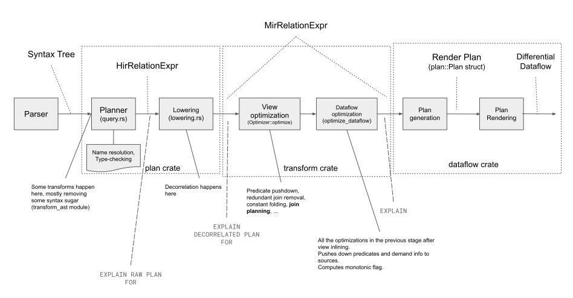
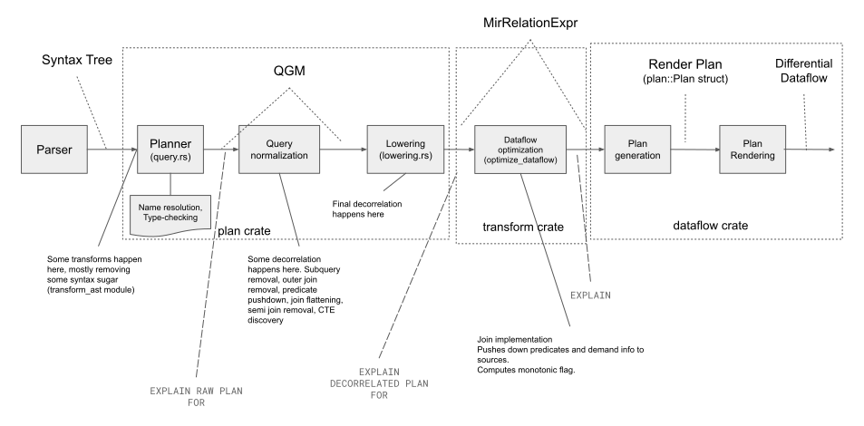
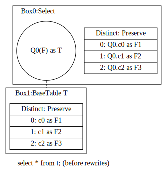
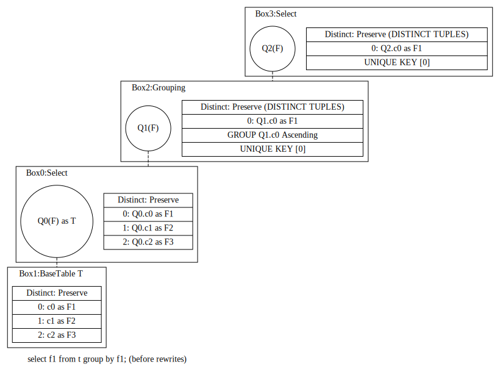
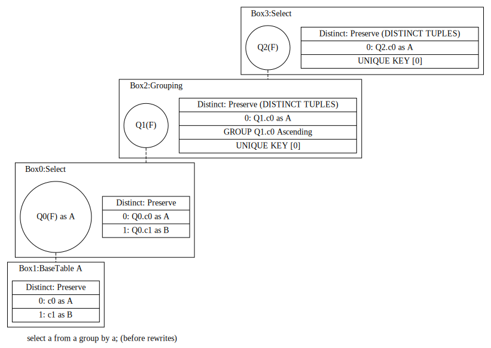
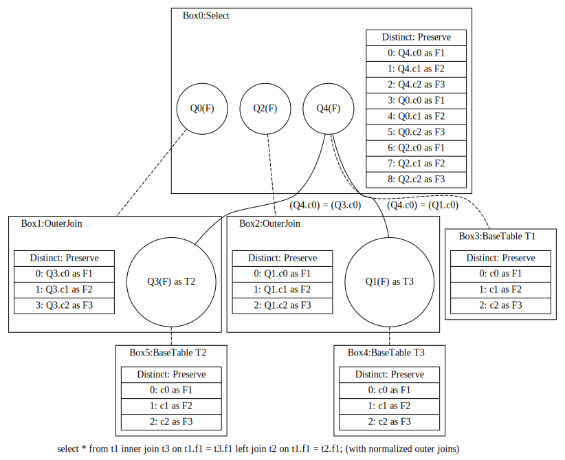

# QGM as high level representation for SQL queries

## Summary

<!--
// Brief, high-level overview. A few sentences long.
// Be sure to capture the customer impact - framing this as a release note may be useful.
-->

This document proposes to replace the current `HirRelationExpr` enum with a new representation
based on the Query Graph Model representation first introduced in
[H. Pirahesh et al](http://projectsweb.cs.washington.edu/research/projects/db/weld/pirahesh-starburst-92.pdf).

This new representation would allow us to introduce a new normalization stage before lowering the query
into a dataflow, before important concepts for the normalization of SQL queries, such as outer joins and
subquery boundaries, are blurred. The following two diagrams show the current view/query compilation pipeline
and the one proposed in this document, which adds normalization at the SQL level:





## Goals

<!--
// Enumerate the concrete goals that are in scope for the project.
-->

* The high level representation of SQL queries must:
    * represent the query at a conceptual level, free of syntactic concepts,
    * be a self-contained data structure,
    * be easy to use,
    * be normalization-friendly.
    * allow supporting complex features such as recursion in CTEs,
* Proper support of `LATERAL` joins ([#6875](https://github.com/MaterializeInc/materialize/issues/6875))
* Support for functional dependency analysis during name resolution.

## Non-Goals

* List transformations that will be applied during normalization

<!--
// Enumerate potential goals that are explicitly out of scope for the project
// ie. what could we do or what do we want to do in the future - but are not doing now
-->

## Description

<!--
// Describe the approach in detail. If there is no clear frontrunner, feel free to list all approaches in alternatives.
// If applicable, be sure to call out any new testing/validation that will be required
-->

In QGM, a query, as its name implies, is represented as a graph. This graph will be represented
by a `Model` struct, that will be declared as follows:

```rust
/// A Query Graph Model instance represents a SQL query.
struct Model {
    /// The ID of the box representing the entry-point of the query.
    top_box: BoxId,
    /// All boxes in the query graph model.
    boxes: HashMap<BoxId, Box<RefCell<QueryBox>>>,
    /// Used for asigning unique IDs to query boxes.
    next_box_id: Boxid,
    /// All quantifiers in the query graph model.
    quantifiers: HashMap<QuantifierId, Box<RefCell<Quantifier>>>,
    /// Used for assigning unique IDs to quantifiers.
    next_quantifier_id: QuantifierId,
}
```

The graph has a top level box, which is the entry point of the query. In this proposal, all boxes and quantifiers
are owned by the model and are referenced by their unique identifiers.

Boxes represent high-level conceptual operators, ie. they don't correspond to any execution strategy. Each box
has a set of input quantifiers, which describe the semantics of how the underlying boxes will be accessed.

The following snippet contains the definition of the different types of operators and quantifiers. Since
all type of boxes and quantifiers have some elements in common, both boxes and quantifiers are not directly
represented as enum, but as struct with an enum type, containing the per-type specific members.

```rust

type QuantifierId = usize;
type BoxId = usize;
type QuantifierSet = BTreeSet<QuantifierId>;

/// A semantic operator within a Query Graph.
struct QueryBox {
    /// uniquely identifies the box within the model
    id: BoxId,
    /// the type of the box
    box_type: BoxType,
    /// the projection of the box
    columns: Vec<Column>,
    /// the input quantifiers of the box
    quantifiers: QuantifierSet,
    /// quantifiers ranging over this box
    ranging_quantifiers: QuantifierSet,
    /// list of unique keys exposed by this box. Each unique key is made by
    /// a list of column positions. Must be re-computed every time the box
    /// is modified.
    unique_keys: Vec<Vec<usize>>,
    /// whether this box must enforce the uniqueness of its output, it is
    /// guaranteed by structure of the box or it must preserve duplicated
    /// rows from its input boxes.
    distinct: DistinctOperation,
}

enum BoxType {
    BaseTable(BaseTable),
    Except,
    Grouping(Grouping),
    Intersect,
    OuterJoin(OuterJoin),
    Select(Select),
    TableFunction(TableFunction),
    Union,
    Values(Values),
}

enum DistinctOperation {
    Enforced,
    Guaranteed,
    Preserve,
}

struct Quantifier {
    /// uniquely identifiers the quantifier within the model
    id: QuantifierId,
    /// the type of the quantifier
    quantifier_type: QuantifierType,
    /// the input box of this quantifier
    input_box: BoxId,
    /// the box that owns this quantifier
    parent_box: BoxId,
    /// alias for name resolution purposes
    alias: Option<Ident>,
}

/// Type of quantifiers (with their abbreviations)
enum QuantifierType {
    All,               // 'All'
    Any,               // 'Any'
    Existential,       // 'E'
    Foreach,           // 'F'
    PreservedForeach,  // 'P'
    Scalar,            // 'S'
}
```

Note that input quantifiers are logically owned by a single box, but there may be several quantifiers ranging
over the same box. That is the case, for example, for base tables, views or CTEs, either explicit CTEs used in
the query or discovered via some query transformation.

As shown above, there aren't many different types of operators, since QGM is meant to be a representation for
query normalization. The set of operators listed above is very close to the one suggested in
[#692](https://github.com/MaterializeInc/materialize/issues/692).

The core operator is represented by the `Select` box, which represents a whole query block (sub-block).

```rust
struct Select {
    predicates: Vec<Box<Expr>>,
    order_key: Option<Vec<Box<Expr>>>,
    limit: Option<Expr>,
    offset: Option<Expr>,
}
```

There a few subtle constraints that are not explicit in the representation above:

* `BaseTable`, `TableFunction` and `Values` cannot have input quantifiers.
* `Union`, `Except` and `Intersect` can only have input quantifiers of type `Foreach`.
* Distinctness can only be enforced in `Select`, `Union`, `Except` and `Intersect` boxes.
* Subquery quantifiers (`All`, `Any`, `Existential` and `Scalar`) are only allowed in `Select` boxes.
* `Grouping` must have a single input quantifier of type `Foreach` ranging over a `Select` box.
* A `Grouping` box is always ranged-over by a `Select` box.
* `OuterJoin` must have at least an input quantifier of type `PreservedForeach` and at most one quantifier of type
  `Foreach`. An `OuterJoin` with all `PreservedForeach` input quantifiers represents a `FULL OUTER JOIN`.
  Note: temporarily during the generation of the query model we could allow subquery quantifiers in `OuterJoin` boxes for
  subqueries in the `ON`-clause of the outer join, but should push down the subquery to the non-preserving side.
  Note 2: In QGM there is no distinction between a `LEFT JOIN` and a `RIGHT JOIN`, since that's a concept that belongs
  only in the AST.

Some of the constraints above are just conventions for making query transformation easier due to having to cover
fewer cases. The rest are just constructions that don't make sense semantically speaking.

We could make some of these constraints explicit by making the type system enforce them, by, for example
moving the `quantifiers` set to each of the `BoxType` that can/must have input quantifiers, which are all of
them but `BaseTable`, `TableFunction` and `Values`.

All boxes have an ordered projection, represented as a vector of columns, defined as:

```rust
struct Column {
    expr: Expr,
    alias: Option<String>,
}
```

### Notes on expression representation

Columns have two representations in QGM: base columns and column references. Base columns are only allowed in expressions
contained in data source operators, specifically in the projection of boxes of type `BaseTable` and `TableFunction`.

```rust
enum Expr {
    // ...
    ColumnReference(ColumnReference),
    BaseColumn(usize),
}

struct ColumnReference {
    quantifier_id: QuantifierId,
    position: usize,
}
```

`ColumnReference` is used everywhere else. A `ColumnReference` may either reference a quantifier of the same
box that owns the containing expression or a quantifier from some parent box.

The underlying expression behind a column reference can be obtained via a `dereference` method, whose implementation
could be as follows:

```rust
impl ColumnReference {
    fn dereference<'a>(&self, model: &'a Model) -> &'a Expr {
        let input_box = model
            .quantifiers
            .get(&self.quantifier_id)
            .unwrap()
            .input_box;
        &model.boxes.get(&input_box).unwrap().columns[self.position].expr
    }
}
```

Since this proposal uses identifiers instead of pointers, most methods in the implementation `Expr` will need to
receive a reference to the model as a parameter. For example, a method for determining whether an expression is
nullable or not may need to dereference a column reference, for which it needs access to the model:

```rust
impl Expr {
    fn nullable(&self, model: &Model) -> bool {
        match self {
            ...
            Expr::ColumnReference(c) => c.dereference(model).nullable(model),
        }
    }
}
```

### Name resolution

As shown above, the query graph already contains almost all the information needed for name resolution. Since the
query graph is built in a bottom-up manner, we can use the input quantifiers for resolving names within the
current part of the query being processed.

It is important to restate the constraint mentioned above: all column references in expressions within each box
*must* only point to quantifiers either within the same box or within an ancestor box through a chain of unique
children (correlation).

This section explains how the query graph model being built can be used for name resolution purposes using the following
query as an example:


When planning the `WHERE` clause, belongs in box 0 as shown above, the resulting expression must only reference
quantifiers Q0 and Q5, however the relations visible in the scope according to the SQL standard are the relations
represented by Q0, Q1 and Q4, ie. the leaf quantifiers of the comma join (represented by box 0).

A new `NameResolutionContext` struct will encapsulate the name resolution logic, which resolves column names
against the leaf quantifiers but lifts the column references through the projection of the intermediate boxes,
all the way up to the current box.

Following with the example, when resolving the reference to `y` in the `WHERE` clause, we will find that among
the leaf quantifiers (Q0, Q1, Q4), only quantifier Q4 projects a column named `y`, so the column is resolved as
`Q4.c0`, ie. the first column among the columns projected by Q4's input box (box 4).
Since we must return a expression referencing only Q0 and Q5, we need to follow the linked chain made by
`Quantifier::parent_box` and `QueryBox::ranging_quantifiers` until we reach a quantifier ranged over by
box 0. The parent box of `Q4` is box 2, which projects `Q4.c0` as its forth column and it's ranged over by Q5.
Therefore, following that chain, we have resolved that `y` means `Q5.c3` within the context of box 0.

In the query above had and explicit projection or an ORDER BY clause names would be resolved against the same
leaf quantifiers and the resulting column references lifted following the same process.

Basically, a `NameResolutionContext` instance will represent the context of the `FROM` clause.

#### Name resolution within subqueries

Expressions within subqueries must see the symbols visible from the context the subquery is in. To support that
`NameResultionContext` will contain an optional reference to a parent `NameResolutionContext`, that is passed
down for planning the subquery, so that if a name cannot be resolved against the context of the `FROM` clause of
the subquery, we go through the chain of parent contexts until we find a symbol that matches in one of them.

#### Name resolution within the `ON` and `USING` clauses

In the following example, the binary `LEFT JOIN` is represented by box 2, and hence, the `ON` clause belongs in
that box.


When planning a binary join, we will create a new `NameResolutionContext` which parent context is the same
as the parent context of the parent comma join. The `NameResolutionContext` for the comma join is the sibling
context, only visible by `LATERAL` join operands (more on that in the next subsection).

The leaf quantifiers for the binary `LEFT JOIN` in the example above are Q1 and Q4. Once we are done planning
the binary join, these leaf quantifiers are added as leaf quantifiers in the `NameResoltionContext` of the
parent join.

#### Name resolution within `LATERAL` joins

When planning a `LATERAL` join operand, the `NameResolutionContext` for the join the `LATERAL` operand
belongs to will be put temporarily in `lateral` mode, and passed down as the parent context of the query
within the `LATERAL` join operand. When in `lateral` mode, a `NameResolutionContext` tries to resolve
a name against its sibling context before it goes to its parent context.

#### Name resolution of `GROUP BY` queries

Symbols in the `GROUP BY` clause will be resolved as well against the `NameResoltionContext` representing
the scope exposed by the `FROM` clause, but then lifted through the projection of the `Select` box representing
the join that feeds the `Grouping` box created for the `GROUP BY` clause.

Symbols in the `HAVING` clause and in the projection of the `GROUP BY` are also resolved against the
`NameResoltionContext` of the `FROM` clause, but then lifted twice: once through the `Select` box representing
the join that feeds the `Grouping` box and then through the `Grouping` box itself (since the projection
of a `GROUP BY` and the predicates in the `HAVING` clause belong in `Select` box on top of the `Grouping` box).

Lifting expressions through a grouping box is a bit special:

* The projection of a `Grouping` box can only contain: columns references from the input quantifier that are
  present in the grouping key, references to columns from the input quantifier that functionally depend on a column
  in the grouping key, or aggregate expressions, which parameters must be column references from the input quantifier.
* Aggregate expressions are lifted as column references.
* Columns from the input quantifier that neither appear in the grouping nor functionally depend on any column in the
  grouping key, cannot be lifted and hence an error is returned.

#### Name resolution of CTEs

A `NameResolutionContext` instance will be created for storing the processed CTEs. When resolving an unqualified
table name, we will first traverse the list of active contexts, ie. through the list made by `parent_context`,
until matching CTE is found. Otherwise, we will use the system catalog.

#### Name resolution implementation

An example of implementation of the name resolution process described in this section can be seen
[here](https://github.com/asenac/rust-sql/blob/master/src/query_model/model_generator.rs#L19).
The code will be very similar, with the difference being that in that implementation boxes and quantifiers
are referenced using shared pointers, rather than identifiers.

```rust
struct NameResolutionContext<'a> {
    owner_box: Option<BoxId>,
    quantifiers: Vec<QuantifierId>,
    ctes: Option<HashMap<String, BoxId>>,
    parent_context: Option<&'a NameResolutionContext<'a>>,
    sibling_context: Option<&'a NameResolutionContext<'a>>,
    is_lateral: bool,
}
```

### Distinctness and unique keys

The `DISTINCT` handling in the QGM paper cite above is a bit messy, so the solution proposed here differs a bit
of the one described in the paper.

As shown in the definition of `QueryBox` above, each box has a `DistinctOperation` flag, that indicates
whether the box must enforce the uniqueness of its output rows, the uniqueness is already guaranteed by the
underlying structure of the box, or the duplicated rows must be preserved in the output of the box.

Each box also exposes the sets of its columns that make unique keys on its output. A `BaseTable` instance
will contain a unique key for every unique indexes on the table. A `Select` with `DistinctOperation::Enforce`
or `DistinctOperation::Guaranteed` will have at least a unique key containing all the columns in its
projection. A `Grouping` box will have at least a unique key containing all the columns in the grouping key.

This information must be re-computed every time the underlying structure of the box is modified.

`GROUP BY` and `DISTINCT` have a different representation in QGM, where the latter is always preferred since
it makes query flattening easier. Because of that, a normalization rule will convert any `Grouping` box without
aggregate functions into a `Select` box with `DistinctOperation::Enforce`.

### Query model transformations: query normalization stage

Some normalization transformations are better/easier done with a representation at a higher level than our current
`MirRelationExpr` representation. Specially those around SQL-specific concepts such as outer joins that are
lost during lowering. Several examples of this are [#6932](https://github.com/MaterializeInc/materialize/issues/6932),
[#6987](https://github.com/MaterializeInc/materialize/issues/6987) or
[#6988](https://github.com/MaterializeInc/materialize/issues/6988), but the list of unsupported cases that are
hard to support at the moment is much longer.

### Query decorrelation during normalization

Consider the following two equivalent queries:

```
materialize=> explain select * from t1, lateral (select count(*) from t2 group by t1.f1);
                Optimized Plan
----------------------------------------------
 %0 =                                        +
 | Get materialize.public.t1 (u254)          +
                                             +
 %1 =                                        +
 | Get materialize.public.t1 (u254)          +
 | Distinct group=(#0)                       +
 | ArrangeBy ()                              +
                                             +
 %2 =                                        +
 | Get materialize.public.t2 (u256)          +
                                             +
 %3 =                                        +
 | Join %1 %2                                +
 | | implementation = Differential %2 %1.()  +
 | | demand = (#0)                           +
 | Reduce group=(#0)                         +
 | | agg count(true)                         +
 | ArrangeBy (#0)                            +
                                             +
 %4 =                                        +
 | Join %0 %3 (= #0 #2)                      +
 | | implementation = Differential %0 %3.(#0)+
 | | demand = (#0, #1, #3)                   +
 | Project (#0, #1, #3)                      +

(1 row)
materialize=> explain select * from t1, (select count(*) from t2);
               Optimized Plan
--------------------------------------------
 %0 = Let l0 =                             +
 | Get materialize.public.t2 (u256)        +
 | Reduce group=()                         +
 | | agg count(true)                       +
                                           +
 %1 =                                      +
 | Get materialize.public.t1 (u254)        +
                                           +
 %2 =                                      +
 | Get %0 (l0)                             +
 | Negate                                  +
 | Project ()                              +
                                           +
 %3 =                                      +
 | Constant ()                             +
                                           +
 %4 =                                      +
 | Union %2 %3                             +
 | Map 0                                   +
                                           +
 %5 =                                      +
 | Union %0 %4                             +
 | ArrangeBy ()                            +
                                           +
 %6 =                                      +
 | Join %1 %5                              +
 | | implementation = Differential %1 %5.()+
 | | demand = (#0..#2)                     +

(1 row)
materialize=>
```

Ideally, any two semantically equivalent queries should result in the same execution plan: the most optimal one
for obtaining/computing the desired results. However, after lowering the first query above, we are not able to
detect that the grouping key is constant wrt the input of the aggregation and can then be removed, reducing the
complexity of the resulting dataflow as shown in the plan for the second query, where the transformation has been
manually applied. A `RemoveConstantKeys` normalization rule applied to the query graph could easily detect
any grouping key item that is constant wrt the input of the `Grouping` box and remove it.

Another example, among the long list of them, is the one below:


```sql
create table a(a, b); create table b(c, d); create unique index bc on b(c);
select a from a where a = (select d from b where c = a.b);
select a from a, b where a = d and c = b;
```

A `ScalarToForeach` normalization rule could convert the `Scalar` subquery quantifier into a `Foreach`
quantifier since the subquery contains an equality predicate on a unique key of its input (table `b`) and
the `NULL` value returned when the subquery is empty is rejected by the equality predicate.

With a small set of normalization transformations applied on the high level representation of the query, before
lowering it, we could easily fix many cases like the ones listed above. These transformations could be used to
decorrelate some, if not all, cases where the query can be expressed with equivalent non-correlated SQL. The big
hammer used in `lowering.rs` will then be used for everything else that cannot be expressed with valid SQL in
a decorrelated manner (for example, a correlated lateral non-preserving side of an outer join cannot be decorrelated
in SQL since no predicate can cross the non-preserving boundary).

### Recursive CTEs support

A recursive CTE is a CTE with a union with two branches where one of the branches references the CTE and the other
one doesn't (representing the base case). This can be easily supported by the proposed implementation. Circular
memory ownership issues are avoided by making the model own all the nodes.

Any traversal of the query graph must keep a set/bitset of visited boxes since the same box can be ranged over by
several quantifiers. The same set/bitset will prevent infinite loops/stack overflows when traversing a recursive
query.

### Testing and debuggability of the normalization transformations

The normalization transformations will be mostly tested using `datadriven` unit tests that will take raw SQL
queries as their input and a list of transformations to be applied, and will dump the content of the graph after
applying each of them. The query graph will be dumped as a `dot` graph which, once rendered, looks like the
ones in the appendix with examples.

The `dot` graph generator will also be very handy for debugging transformations. Also, for better debuggability
Jthe rules themselves should not drive the traversal of the graph, but just make explicit the type of traversal
they require. The traversal of the graph will be driven by some external code, that could be instrumentalized for
dumping the full graph before and after applying the rule to every node of the graph. That way, by just patching
one method, we could follow step by step the evolution of a query graph as it goes through the different
transformations.

### Lowering

The lowering code will have to be modified so that it takes a Query Graph as its input.

When lowering a `Select` box we will first build the join within that box. To do so, we will first build a
dependency graph where each quantifier is connected to the quantifiers it is correlated with. We will lower
the quantifiers in dependency order, starting with the uncorrelated ones. When lowering
a correlated quantifier, we will apply its plan to the result of the sub-join of all the quantifiers it is
connected to, resulting in simpler dataflow plans for lateral joins.

The dependency graph will be built by traversing the sub-graph of the input quantifiers collecting the
column references from the current context.

Note that the lowering code will no longer produce binary joins exclusively.

After lowering the join, a `Map` operator will be added with the non-column expressions in the projection
of the box. Then, a `Projection` will be added. If the box must enforce distinctness, the corresponding
`Reduce` operator will be added. If the box has `LIMIT`/`OFFSET`/`ORDER BY` a `TopK` operator will
then be added.

### View inlining

View inlining could be implemented as a normalization rule where only non-materialized views are inlined.

We could also do the opposite: find query patterns that match existing materialized views. Furthermore,
we could even have a view compaction step where we load all the views in the system into the same model
and find common sub-expressions within it, to identify intermediate results worth materializing.

## Alternatives

<!--
// Similar to the Description section. List of alternative approaches considered, pros/cons or why they were not chosen
-->

* QGM with interior mutability, shared pointers and so on as implemented [here](https://github.com/asenac/rust-sql).
    * Making all boxes to be directly owned by the model makes recursion easier to support.
* Relational algebra representation
* Convert `MirRelationExpr` into a normalization-friendly representation with explicit `outer join` operator
  and fewer number of operators.

## Milestones

The first milestone will consist in an end-to-end prototype with support for a simple `select a from a`, including
lowering the query graph to a dataflow and `dot` graph generator.

The second milestone will add full support for joins, including lateral joins, and subqueries, including correlated
ones.

The follwing milestones will add support for `GROUP BY`, `UNION` and the rest of the SQL constructs currently
supported.

In parallel, after the second milestone, work could be done on introducing query normalization before lowering,
starting with the core `SelMerge` rule described in the paper.

## Open questions

* Duplication in `transform` crate

<!--
// Anything currently unanswered that needs specific focus. This section may be expanded during the doc meeting as
// other unknowns are pointed out.
// These questions may be technical, product, or anything in-between.
-->

### Appendix A: Examples

This section includes examples of how some queries look like in QGM. This visual representation will be generated
from the representation described in the previous section. Note that having a visual way of representing the query
is very helpful during query transformation development/troubleshooting.

In this visual representation, predicates referencing columns from 1 or 2 quantifiers are represented as edges
connecting the quantifiers involved in the predicate.

#### Simple `SELECT *`



#### Simple `GROUP BY`




#### `GROUP BY + HAVING`


Note that the having filter is just a regular predicate on the `Select` box ranging over the `Grouping` box.

#### `GROUP BY` vs. `DISTINCT`

As mentioned above, `GROUP BY` and `DISTINCT` use different representation in QGM. The following diagram
shows a simple `DISTINCT` query.


As shown below, the equivalent `GROUP BY` query is automatically converted into the query graph above
during the normalization process.




#### Comma join


#### Inner join


Note that the inner join above is semantically equivalent to the comma join in the previous example. Boxes 1 and 2
represent the binary inner joins in the query, but they can be squashed into box 0, without altering the results of
the query. In fact, the normalization step will simplify this query leaving it exactly as the one in the example above:


#### Outer join


Note that in QGM there is no join direction, so left and right joins have the same exact representation. Only the type
of the quantifiers change its order.

Representing outer joins as explicit boxes goes against the goal of removing any sense of direction or join order
from the query graph. For example, the following two queries are semantically equivalent but they lead to different
query models where the join ordering is implied. We could add a normalization rule that always pushes inner joins
through the preserving side of an outer join, assuming that it is always better to do inner joins first.


However, we would still have the explicit join ordering issue if both joins in the query above where outer joins.
To fix that issue, normalization will lift the preserving quantifier of an outer join to the parent `Select`
making it a `Foreach` quantifier, leaving the `OuterJoin` box with just a `Foreach` quantifier, which
will represent a special potentially-correlated operator that produces a `NULL` row if none of the rows
produced by its input matches the predicate. With this normalization, the query mentioned above will look as
follows:



#### Cross join

A `CROSS JOIN` can be represented as a `Select` box with no predicates as shown below:


#### CTEs


Quantifiers 2 and 3 are ranging over the same box, which represents the CTE. Box 2 doesn't alter the results of
box 0, but just adds aliases for the columns, for name resolution purposes. Normalization will get rid of all
the intermediate `Select` boxes, leaving the query as follows:


#### Lateral joins

A `LATERAL` join is just a join where one of its operands is correlated with the remaining ones, ie. a sub-graph
containing column references from quantifiers belonging in the parent context. For instance, in the following
example quantifier 4 is correlated within box 0, since its sub-graph references a column from quantifier 0 which
belongs in box 0. This correlation is made explicit by the edge going from Q1 in box 2 to Q0 in box 0.


We will see later how we could decorrelate a query like that via transformations of the query model.

#### `NATURAL` joins

`NATURAL` joins don't have an explicit representation in QGM since, like `LATERAL`, it is a name resolution concept
that doesn't make sense anymore after it.

#### Subqueries

##### `EXISTS` and `IN SELECT`

`EXISTS` and `IN SELECT` subqueries are represented via `Existential` quantifiers. In fact, `EXISTS` subqueries
are represented as `1 IN (SELECT 1 FROM (<exists subquery>))` as shown in the second example below.


Given that the two queries above are equivalent, the normalization process should normalize both to the same
representation.

##### Scalar subqueries


Scalar subqueries are represented via `Scalar` quantifiers as shown above. These quantifiers can be converted into
regular `Foreach` quantifiers iff the inner subquery is guaranteed to always return one row at most and the NULL
value returned when the subquery is empty is ignored. Otherwise, no predicate can cross the boundary of a `Scalar`
quantifier.

##### `ANY`/`ALL` subqueries

`ANY`/`ALL` subqueries are represented via `Any` and `All` quantifier types respectively.


#### `VALUES`


#### `UNION`


