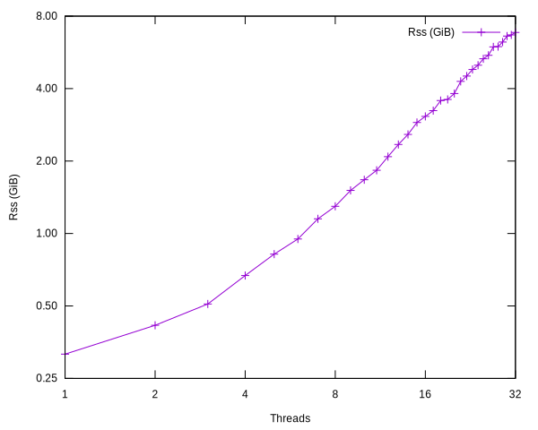
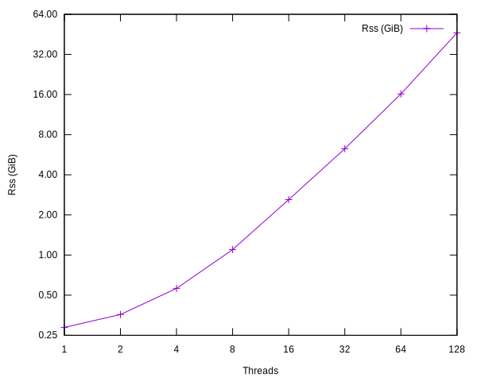
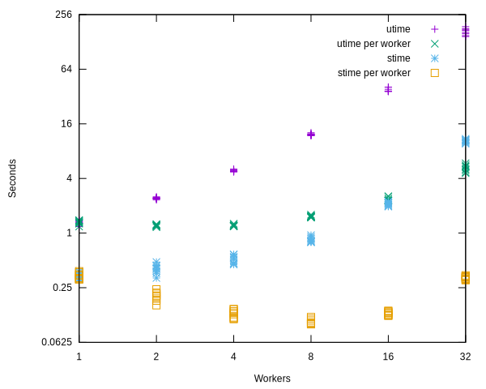

# Systems challenges in Materialize

## Summary

<!--
// Brief, high-level overview. A few sentences long.
// Be sure to capture the customer impact - framing this as a release note may be useful.
-->

Materialize shows a sublinear behavior when scaling the number of worker threads.
While some of this is expected, we need to gain a better understanding of how much this affects as and potential remedies to improve the scaling behavior.
This document outlines problems and suggests solutions that can help avoid the problems in the future.

## Goals

<!--
// Enumerate the concrete goals that are in scope for the project.
-->

We present a set of challenges and provide ideas on how to solve them.

## Non-Goals

<!--
// Enumerate potential goals that are explicitly out of scope for the project
// ie. what could we do or what do we want to do in the future - but are not doing now
-->

The goal is to provide insights into Materialize's behavior assuming a fixed set of queries.
It is a non-goal to improve the performance within the SQL/optimization layer.

## Description

<!--
// Describe the approach in detail. If there is no clear frontrunner, feel free to list all approaches in alternatives.
// If applicable, be sure to call out any new testing/validation that will be required
-->

We need to validate the following three challenges.

1. Materialize's memory consumption increases superlinearly with the number of worker threads.
   The number of worker threads influences buffer allocations for exchange channels.
   The communication between workers follows an all-to-all pattern which means that the buffer space alone increases quadratically with the number of workers.

2. Timely communicates updates to operator capabilities through broadcasts to all worker threads.
   In some situations this results in many fine-grained updates carrying only little information.
   A downside is that each update might be a small allocation.
   We should investigate if this is a problem and what magnitude it has.

3. Materialize needs to transfer relatively large pieces of data between operators, including across thread boundaries.
   It has the potential impact of stressing the memory allocator, which needs to pass back memory to other threads.

For the first and second challenge, Timely does not yet expose the right mechanisms to provide a different policy.
The last problem could be addressed by not passing owned data but instead only revealing references to data.

The set of challenges are based on experience and observations, but not on reproducible tests.
Before we tackle any of them, we should establish a benchmark that clearly highlights the problem and can be used to validate any solution.

Let's look at the problems in detail.

### Memory consumption when scaling worker threads

We conduct an experiment to measure the idle memory consumption of Materialize.
First, we build Materialize in release mode and clean the `mzdata` directory, which only preserves the system tables and collections.
Next, we start Materialize with a specific amount of workers and measure the Rss after a fixed delay, after which we stop the instance.

The following graphs shows the idle memory consumption of Materialize.
The x-axis shows the number of threads, the y-axis indicates the Rss in GiB.
The data is presented in a log-log plot.
The first plot shows data up to 32 threads, the second up to 128 threads.
We collect the data on an AMD Ryzen 3955wx CPU with 16 physical cores and 32 hardware threads, combined with 128 GiB RAM.
Note that the second graph oversubscribes the available CPU cores.

We observe that the memory consumption grows with the number of threads and seems to follow an exponential pattern.
A single worker consumes 330 MiB Rss, which grows to 7.2 GiB for 32 workers and increases further to 48.6 GiB at 128 worker threads.

### Worker CPU time overhead

In this experiment, we again start an idle and unconfigured Materialize instance while varying the number of Timely workers.
After 2 minutes, we measure how much time it spend in user and kernel mode (utime and stime).
Each test is repeated eight times.

For each worker configuration on the x-axis, we show how much time Materialize spends in user and kernel mode on the y-axis, and the same number normalized by the number Timely worker threads.

We observe that the time Materialize spends in user and kernel mode increases with the number of Timely worker threads.
Normalizing the time by the number of workers first shows a decrease in the number of time per worker until it start to increase again.
Both user and system time follow a similar pattern, alebit the system time at a lower magnitude.

### Memory allocator stress

## Alternatives

* An obvious alternative is not to do anything, because Materialize currently works fine.

<!--
// Similar to the Description section. List of alternative approaches considered, pros/cons or why they were not chosen
-->

## Open questions

<!--
// Anything currently unanswered that needs specific focus. This section may be expanded during the doc meeting as
// other unknowns are pointed out.
// These questions may be technical, product, or anything in-between.
-->
