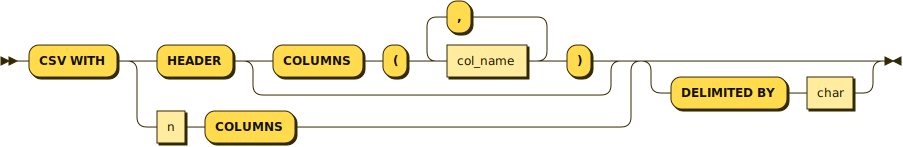

# S3 Sources with Headers

## Summary

<!--
// Brief, high-level overview. A few sentences long.
// Be sure to capture the customer impact - framing this as a release note may be useful.
-->

S3 and in the future, multi-file, [GCS][], and other sources have multiple
independent objects that may have their own headers.

For example, imagine an S3 bucket that has historical data encoded as CSV
formatted files, one file per day. Each CSV file has its own header line, which
is semantically meaningful but should not be included as data rows.

This feature adds support for decoding multiple CSV objects without garbage from
headers making it into query results, and lays the groundwork for future file
types (e.g. Avro OCF, Parquet) that all require their own header lines.

[GCS]: https://cloud.google.com/storage/docs/

## Goals

<!--
// Enumerate the concrete goals that are in scope for the project.
-->

Supporting decoding multiple CSV headers within a framework that will function
for future multi-object sources.

## Non-Goals

<!--
// Enumerate potential goals that are explicitly out of scope for the project
// ie. what could we do or what do we want to do in the future - but are not doing now
-->

The first version of this will only support the CSV format, Avro OCF objects
should be extendable with the current work, but will be prioritized separately.

## Description

<!--
// Describe the approach in detail. If there is no clear frontrunner, feel free to list all approaches in alternatives.
// If applicable, be sure to call out any new testing/validation that will be required
-->

User-facing changes are limited to an expansion of the ability to combine
existing formats with S3 sources, for example `FORMAT CSV WITH HEADER` or Avro
Object Container Files.

When a user specifies a source format that has a header, we will obtain an
arbitrary file from the source declaration and inspect its header, making it the
canonical schema. All files must have exactly the same schema -- if any are
encountered that do not match, the dataflow will be put into an error state. If
it is not immediately possible to determine the header, the `CREATE SOURCE`
invocation will fail.

Internally, there are only a few changes that need to be made.

* Add some code in purify that can obtain an object according to the source
  declaration and use it to extract the schema.
* Modify the messages sent from sources to include a signifier for "beginning of
  object", which will cause the decode loop to perform schema validation and
  drop the header line.

### Purification strategy

We will extend the [purification strategy from existing formats][csv-purify]
into their combination with S3, introducing new syntax for the CSV format that
explicitly lists all column names, which will be the purification target for all
CSV format clauses.

The new syntax is `WITH HEADER COLUMNS (colname (, colname)*)`, making the full
pseudo-grammar for CSV format:



See examples below.

[csv-purify]: https://github.com/MaterializeInc/materialize/blob/88cf93c3309ca62/src/sql/src/pure.rs#L480-L501

#### CSV format examples

A CSV source containing files with header lines like `id,value` as:

```sql
CREATE SOURCE example
FROM S3 DISCOVER OBJECTS USING BUCKET SCAN 'bucket'
FORMAT CSV WITH HEADER;
```

will be rewritten via purify to:

```sql
CREATE SOURCE example
FROM S3 DISCOVER OBJECTS USING USING BUCKET SCAN 'bucket'
FORMAT CSV WITH HEADER COLUMNS (id, value);
```

We preserve column aliases if present, so the following statement with the same
file containing `id,value` header line:

```sql
CREATE SOURCE example (a, b)
FROM S3 DISCOVER OBJECTS USING BUCKET SCAN 'bucket'
FORMAT CSV WITH HEADER;
```

will be rewritten to:

```sql
CREATE SOURCE example (a, b)
FROM S3 DISCOVER OBJECTS USING USING BUCKET SCAN 'bucket'
FORMAT CSV WITH HEADER COLUMNS (id, value);
```

and the columns will have the names "a" and "b". If a source file or object is
encountered that has a header column that does not match the `COLUMNS (name,
..)` declaration, the dataflow will be put in an error state. But see future
work below for how we may handle this more gracefully in the future.

#### Handling missing objects for header discovery

As part of purification any source that must read a header will fail immediately
if it is not possible to determine the header.

Consider, the following create source statement will be rejected if it is not
immediately possible to determine the headers because there is no object in the
queue:

```sql
CREATE SOURCE example
FROM S3 DISCOVER OBJECTS USING SQS NOTIFICATIONS 'queuename'
FORMAT CSV WITH HEADER;
```

it will instead require that users specify the column names using the following
syntax:

```sql
CREATE SOURCE example
FROM S3 DISCOVER OBJECTS USING SQS NOTIFICATIONS 'queuename'
FORMAT CSV WITH HEADER COLUMNS (id, value);
```

All syntaxes for CSV-formatted sources (`WITH n COLUMNS` without an alias, `WITH
n COLUMNS` with aliases, `WITH HEADER`) will always be rewritten to include
their column names columns syntax inside the catalog. This will either use
column aliases for bare numbered column syntax, or the `HEADER COLUMNS` syntax
for files with headers.

This means that the following create source statement:

```sql
CREATE SOURCE example
FROM ...
FORMAT CSV WITH 2 COLUMNS;
```

will be rewritten to:

```sql
CREATE SOURCE example (column1, column2)
FROM ...
FORMAT CSV WITH 2 COLUMNS;
```

If both column aliases and the named column syntax is used simultaneously the
header columns will be verified against the source files/objects, and the
columns presented into the dataflow will get the names from the column aliases.

## Alternatives and future work

### Supporting a subset of schema fields

For some use cases -- imagine an ETL job that has added or dropped columns over
time -- it would be useful to support only a few required fields, or allowing a
subset or reordering of fields.

Supporting this is not planned for the initial implementation, but may be
considered if it is requested.

In particular, we may add modes that support any combination of the following:

* Reordering of columns -- so `FORMAT CSV WITH COLUMNS (a, b)` will support CSV
  files with headers like `a,b` or `b,a`
* Subsets of columns -- so `FORMAT CSV WITH COLUMNS (a, b)` will support CSV
  files with headers like `a,b,c,d`

### Lazy sources

For S3 sources, it's possible to specify that the *only* objects to ingest are
the ones specified in an SQS queue. For this use case, reading from the SQS
queue in order to determine the header columns, and it's possible that the SQS
queue does not have any objects inside of it at source creation time.

Currently, we intend to require that for this case the schema or header be
included literally in the create source declaration, the CREATE SOURCE statement
will error if it is not immediately possible to determine column names.

## Open questions

### Recovering from an invalid S3 object

If the S3 source encounters a CSV object that does not match the create source
schema we will put its dataflow into an error state to prevent users from
reading invalid data. Currently there is no way to recover from this state.
There are a few options:

* Issue [#6605](https://github.com/MaterializeInc/database-issues/issues/2060#issuecomment-880101445)
  suggests that with a full sql-accessible catalog we could use standard sql to
  retract S3 objects that are invalid, thereby recovering.
* We could add specific syntax for S3 sources that allow retracting invalid CSV
  files

Neither of those can handle a CSV object that has a subset of rows that are
incorrect, like the following:

```csv
a,b
1,2
3,4
5,6,7
8,9
```

I don't believe that we have any plans for resolving this specific kind of
invalid data, though.
