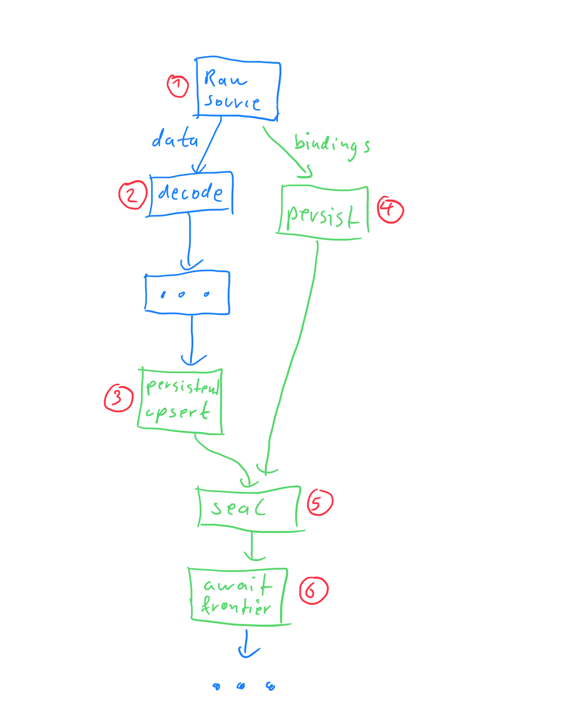

# Persistent Kafka Upsert Source (v0)

## Summary

We want to enable persistence for a first source, to allow us to run load tests
and get a feel for what the API of persistence should be and where we still
have work to do. This should also allow us to run load tests to help understand
where our performance bottlenecks are.

We picked the Kafka Upsert source as first candidate because it's popular and
because the size of the persisted collection is bounded.

## Goals

- Allow load testing and validating the design of persistence APIs/semantics

## Non-Goals

- Pretty much everything else.
- This is not meant for users, initially.
- Performance is not expected to be good.
- Correctness may or may not be guaranteed.

## Description

**Note:** All of this would be behind the `--experimental` flag and an
additional `--persistent-kafka-upsert-source` flag. Not even experimental users
should be using this if they don't explicitly opt in.

We want to augment the existing source dataflow, as rendered in
`dataflow/render/sources.rs`, to include additional operators that persist both
timestamp bindings from the source and the current state of the upsert
operator to persistent collections.

An important concept here is the _seal timestamp_. We seal persistent
collections to signal completeness of data up to that point. This is somewhat
analogous to downgrading (advancing a frontier).

As long as we're careful to use the same time domain to seal up both timstamp
bindings and upsert state, we can read these collections up to a minimum common
seal timestamp `t`, when restarting, to put the source pipeline into a
consistent state that it had at time `t`. The source starts reading from the
Kafka offsets that correspond to the state in the upsert operator. That is, all
records from Kafka up to the start offsets are reflected in the upsert state
and we don't need to read them again. Instead, the upsert operator will emit
updates upon restart that will put downstream collections/arrangements into the
same state that they had _as of_ the time at which we persisted.

### Required changes in existing source pipeline

We need extension points in the existing source pipeline:

- Sources must be able to emit finished timestamp bindings as a `Stream`, which
  will allow us to persist them. 
- Sources (`SourceReader` only, in our initial v0 version) must be able to
  initialize from given timestamp bindings. The bindings include
  partition/offset information, which allows the Kafka source to set an initial
  read position.
- We will replace the regular `upsert` operator with a new
  `persistent_upsert()` operator that behaves the same but additionally writes
  updates persistence.

Here's a visual representation of the changes in the source pipeline:

Existing operators are in blue and new additions in green.

## Alternatives

Many, including moving the whole source pipeline out of timely. But these would
seem to involved.

## Open questions

