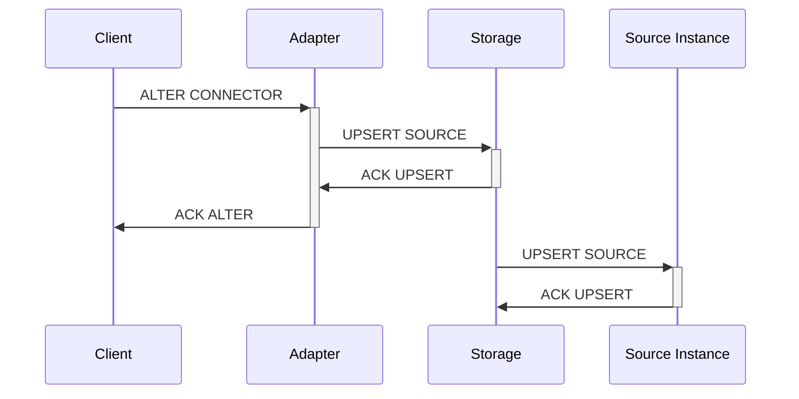
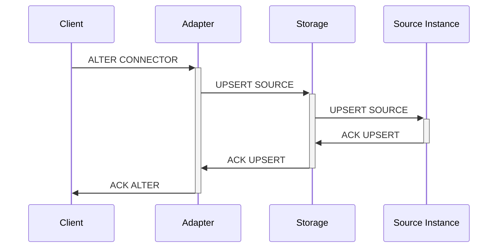

# Connectors

## Summary

This document proposes a design for **connectors**, a new type of catalog object
that allows common configuration parameters to be shared across sources and
sinks.

## Overview

Many users of Materialize create families of sources and sinks that share many
configuration parameters. The current design of `CREATE SOURCE` and `CREATE
SINK` make this a verbose affair. The problem is particularly acute with
Avro-formatted Kafka sources that configure authentication:

```sql
CREATE SOURCE kafka1
FROM KAFKA BROKER 'kafka:9092' TOPIC 'top1' WITH (
    security_protocol = 'SASL_SSL',
    sasl_mechanisms = 'PLAIN',
    sasl_username = 'username',
    sasl_password = 'password',
)
FORMAT AVRO USING CONFLUENT SCHEMA REGISTRY 'https://schema-registry' WITH (
    username = 'username',
    password = 'password'
);

CREATE SOURCE kafka2
FROM KAFKA BROKER 'kafka:9092' TOPIC 'top2' WITH (
    security_protocol = 'SASL_SSL',
    sasl_mechanisms = 'PLAIN',
    sasl_username = 'username',
    sasl_password = 'password'
)
FORMAT AVRO USING CONFLUENT SCHEMA REGISTRY 'https://schema-registry' WITH (
    username = 'username',
    password = 'password'
);
```

These two source definition differ only in their topic specification, but
must duplicate eight other configuration parameters.

With the connectors proposed in this document, the `CREATE SOURCE` can instead
share all the relevant configuration:

```sql
CREATE CONNECTOR kafka FOR
KAFKA BROKER 'kafka:9092' WITH (
    security_protocol = 'SASL_SSL',
    sasl_mechanisms = 'PLAIN',
    sasl_username = 'username',
    sasl_password = 'password'
);

CREATE CONNECTOR schema_registry FOR
CONFLUENT SCHEMA REGISTRY 'https://schema-registry' WITH (
    username = 'username',
    password = 'password'
);

CREATE SOURCE kafka1
FROM KAFKA CONNECTOR kafka TOPIC 'top1'
FORMAT AVRO USING CONFLUENT SCHEMA REGISTRY CONNECTOR schema_registry;

CREATE SOURCE kafka2
FROM KAFKA CONNECTOR kafka TOPIC 'top2'
FORMAT AVRO USING CONFLUENT SCHEMA REGISTRY CONNECTOR schema_registry;
```

## Design

### SQL syntax and semantics

Connector create syntax will come in type specific variants and will not include `with_options`, instead completely specifying the potential options in each variant. 

Using connectors syntactically means replacing the source specific keyword such as BROKER or CONNECTION with CONNECTOR and supplying one or more connector names. 

Properties will be merged by applying values in the supplied order with the last write winning, this supports a usage pattern of supplying base values and then progressively more specific overrides while remaining easy to reason about.  

As long as connectors do not support ALTER then it is strictly not necessary to store the relationship between source and connector in the catalog, instead during planning of the CREATE SOURCE statement the values from the connector can be substituted into relevant places in the `CreateSourceConnector` without requiring any parsing changes for any part of the `CreateSourceStatement`. 

While technically supporting ALTER does not have to require changing the catalog representation of sources, the utility of supporting ALTER without CASCADE is very small and supporting CASCADE requires that relations are discoverable.

## Staged Implementation
Since there is significant user experience value in the base feature without ALTER, not being able to ALTER is not a regression since sources are already immutable, and implementation is significantly less complex if connectors are only used during initial planning of a `CREATE SOURCE` statement I propose we break things into several distinct stages:

1. Connectors as syntactic sugar during `CREATE SOURCE`
2. Refactor Sources in the catalog such that connectors are referenced by relation (either implicitly or explicitly)
    - unblock `ALTER ... CASCADE` behavior in the planner 
    - unlocks other desirable features as well
3. Determine exact semantics around `ALTER` and running sources once Platform has decoupled Sources into the STORAGE layer
    - Upsert command?
    - Consistency semantics between layers
      - If eventual for running instance, how to convey progress to user   
4. Implement `CASCADE` in planner/ADAPTER and source/STORAGE pieces according to the new semantics

## Reference

### Kafka connector
```ebnf
create_connector_kafka ::=
  'CREATE' 'CONNECTOR' ('IF NOT EXISTS')? connector_name
  'FOR' 'KAFKA BROKER' host ('USING AUTH' (ssl_security_protocol_options | sasl_plain_protocol_options | sasl_gssapi_protocol_option) )?
ssl_security_protocol_options ::=
  '(' 'security_protocol' '=' ('ssl' | 'sasl_ssl') ','
  'ssl_key_location' '=' ssl_key_location ','
  'ssl_certificate_location' '=' ssl_certificate_location ','?
  ('ssl_ca_location' '=' ssl_ca_location ','
  'ssl_key_password' '=' ssl_key_password)? ')'
sasl_plain_protocol_options ::=
  '(' 'security_protocol' '=' ('sasl_plaintext' | 'plaintext') ','
  'sasl_mechanisms' '=' ('PLAIN' | 'SCRAM-SHA-256' | 'SCRAM-SHA-512') ','
  'sasl_username' '=' sasl_username ','
  ( ('sasl_password' '=' sasl_password) | ('sasl_password_env' '=' sasl_password_env) ) ')'
sasl_gssapi_protocol_option ::=
  '(' 'security_protocol' '=' ('sasl_plaintext' | 'plaintext') ','
  'sasl_mechanisms' '=' 'GSSAPI' ','
  'sasl_kerberos_keytab' '=' sasl_kerberos_keytab ','
  'sasl_kerberos_kinit_cmd' '=' sasl_kerberos_kinit_cmd ','
  'sasl_kerberos_min_time_before_relogin' '=' sasl_kerberos_min_time_before_relogin ','
  'sasl_kerberos_principal' '=' sasl_kerberos_principal ','
  'sasl_kerberos_service_name' '=' sasl_kerberos_service_name ')'
```
### Confluent Schema Registry connector
```ebnf
create_connector_confluent_schema_registry ::=
  'CREATE' 'CONNECTOR' connector_name 'FOR'
  'CONFLUENT SCHEMA REGISTRY' registry_url 'WITH' '('
  'username' '=' username ',' 
  'password' '=' password ','
  ( 'ssl_certificate_location' '=' ssl_certificate_location ',')?
  ( 'ssl_key_location' '=' ssl_key_location ',')?
  ( 'ssl_ca_location' '=' ssl_ca_location)? ')'
```
### PostgreSQL connector
```ebnf
create_connector_postgres ::=
  ( ('host' '=' hostname) | ('hostaddr' '=' hostaddr) ) ','
  'port' '=' port_number ','
  ( 'dbname' '=' dbname ',')?
  'user' '=' username ','
  ('password' '=' password ',')?
  ('application_name' '=' application_name ',')?
  ('keepalives' '=' keepalives ',')?
  (postgres_ssl_options)?
postgres_ssl_options ::=
  ('sslmode' '=' ( 'disable' | 'allow' | 'prefer' | 'require' | 'verify-ca' | 'verify-full' ) ',')?
  ('sslcert' '=' ssl_certificate_location ',')?
  ('sslkey' '=' ssl_key_location (',' 'sslpassword' '=' ssl_key_password )? ',')?
  ('sslsni' '=' ssl_sni ',')?
```
### AWS connector
```ebnf
create_connector_aws ::=
  ( ('access_key_id' '=' access_key_id ',' 'secret_access_key' '=' secret_access_key (',' 'token' '=' token)?) | 'profile' '=' profile ) 
  ('role_arn' '=' role_arn)?
  ('region' '=' region)?
```

## Alter Table complexities
Catalog support for these relations would require more extensive changes to properly disentangle the shareable portions of a source description from the elements which are expected to be unique. This may be a desirable evolution of these structures anyhow to organize them more modularly, primarily along boundaries of responsibility such as authentication.

This would need to be done with some care to avoid leaking unnecessary implementation details into the grammar, while still avoiding `WITH options` wherever possible. The initial connector specification would provide a solid baseline of moving all Source but not implementation specific details out of `WITH options` and into the grammar. 

Creating a more universal abstraction of authentication for sources is valuable beyond just the potential for Connector usage, since several source types support distinctly different auth modes when using cloud hosted versions;  Kafka and Postgres in AWS supporting IAM authentication are the most obvious example where the current representation of the source effectively disallows representing this auth method in any way.

#### CASCADE specific complexities

While allowing ALTER to CASCADE to all sources which reference the connector makes certain operational tasks for users easier, such as changing rotating authentication certificates or passwords, updating broker host names, or even completely changing auth methods. Implementation brings with it a significant amount of essential complexity to ensure robust, correct behavior even with eventually consistent updates of running sources.

Before considering the transactional consistency required to communicate changes from ADAPTER to STORAGE, the first added complexity comes in ensuring that only ALTERs which actually change the value in a specific source are propagated which requires re-evaluating the entire set of connectors involved in specifying a source.s 

Upsert would be simplest way to extend this; however, this introduces distributed coordination requirements in any mode of operation. By making Upsert semantically fallible STORAGE can incrementally support live ALTER on a source by source and property by property basis.

- Eventually consistent changes would involve Adapter and Storage participating in 2 phase commit


- Strongly consistent changes would require Adapter, Storage and the Instantiated Source to participate in a 3 phase commit




