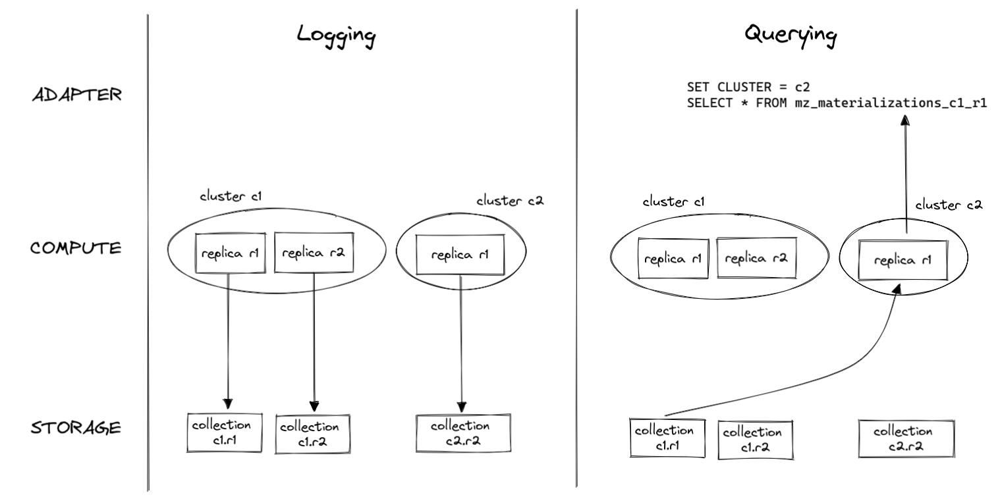

# Replicated Compute Introspection

## Summary

This document proposes a design for surfacing dataflow introspection data from
replicated compute instances.   

## Goals

* Make it possible for Materialize users to query compute introspection data for
  replicas in any of their clusters through the SQL interface.
* Make it possible to filter introspection data by cluster and replica name.
* Ensure that introspection data is surfaced in a way that makes it possible to
  implement replica health monitoring on top.
* Maintain compute performance, i.e., ensure that the new approach to logging
  introspection data does not significantly reduce compute instance performance,
  compared to the old approach.
* Maintain compute instance isolation, i.e., ensure that compute instances
  producing large amounts of introspection data don't negatively impact the
  performance of other compute instances.

## Non-Goals

As we are still in an early stage of building the Platform architecture, several
parts required for the full design (persist compaction, storage renditions,
replicated sinks) are not yet ready. To still make progress, we propose a
simplified design that defers the following goals to later:

* Bound the amount of storage space used for introspection data.
* Produce consistent introspection data in the face of "zombie replicas", i.e.
  replicas that keep running even though they have already been replaced.
* Distribute sinking and sourcing of introspection data between compute workers.

See [Future Improvements](#future-improvements) for our plans for achieving
these goals in the future.

## Description

The general idea is that replicas sink their introspection dataflows (which
they already maintain) to persistent storage. The resulting storage collections
are exposed to the user as per-replica persist sources. As persistent storage
is shared between all replicas, any replica is able to access all introspection
sources and yield consistent introspection data back to the user.



### COMPUTE

#### Sinking Introspection Data

Compute replicas already maintain introspection dataflows that feed arrangements
that can be peeked by ADAPTER. These dataflows are extended to also sink their
output to persistent storage.

Eventually there will be a STORAGE client for interacting with storage
collections, but it doesn't exist yet. Instead, replicas need to use the
`persist` API directly. `persist` only abstracts a single storage shard that
cannot be written to by multiple compute workers, so all introspection data from
the same dataflow will be sinked through the same worker initially. We can still
distribute the sinking of different introspection dataflows between different
workers.

The proposed design does not strictly require the existing arrangements, but we
keep them in around for two reasons:

  * Because persist compaction is not implemented yet, introspection storage
    collections can grow without bounds. We therefore don't want to enable
    sinking to persist for long-running Materialize deployments (like cloud). To
    still be able to collect introspection data for such deployments, we need to
    keep the existing mechanism of peeking introspection arrangements around
    (even if it only works reliably for single-replica clusters).
  * Once we have sinks working for replicated clusters, we'll want to think
    about using them to sink the introspection arrangements instead of the
    hand-rolled solution proposed in this design.

To sink introspection data, replicas need the following storage connection
information:

  * Blob URI
  * Consensus URI
  * A shard ID for every log variant

This connection information is passed to replicas through the
`CreateInstance` compute command.

#### Changes to the Compute API

The `LoggingConfig` contained in `ComputeCommand::CreateInstance` is extended to
also contain the storage connection information mentioned above (details subject
to bike-shedding):

```rust
use mz_dataflow_types::client::controller::storage::CollectionMetadata;

pub struct LoggingConfig {
    pub granularity_ns: u128,
    pub log_logging: bool,
    pub active_logs: HashMap<LogVariant, GlobalId>,
    pub sink_logs: HashMap<LogVariant, CollectionMetadata>,
}
```

`sink_logs` communicates to the replica, which log variants should be sinked to
which target storage collections. The set of log variants contained in this list
should be either the same as in `active_log`, or empty, if logging to persist is
disabled (see [Feature Flag](#feature-flag)).

The `CollectionMetadata` type contains blob URI and consensus URI in its current
definition. It needs to be extended to also contain the shard ID (or a list of
shard IDs).

The compute controller generally assumes that it can send the same commands to
all replicas in a cluster. This will not be the case anymore with the updated
`LoggingConfig`, since shard IDs are specific to replicas. Therefore, the
compute controller must take care of adjusting `CreateInstance` commands to the
respective target replicas before sending them.

#### Cleanup on Replica Restart

When a replica is restarted for whatever reason, we need to make sure that the
persist shards they log their introspection data to are cleared. Otherwise,
we might end up with stale introspection data that was written by a previous
incarnation of the replica and never retracted because subsequent incarnations
were not aware of the stale data's existence.

Replicas should clear their introspection shards as soon as they receive a
`CreateInstance` command, before they initialize the introspection dataflows.

`persist` does not offer a convenient API to clear shards, but it should
still provide all necessary means. To clear a shard, we can:

  1. Make a snapshot at the current time.
  1. Issue retraction updates for each record in the snapshot.

Note that this way of clearing shards in-place will not work if an old
incarnation of the replica is still around logging new data to the same shard,
as the presence of multiple writers can lead to inconsistent/undefined shard
contents. This issue will be resolved in the future by the use of storage
renditions.

### ADAPTER

#### Replica-specific Introspection Configuration

In the coordinator, the compute introspection/logging configuration is
currently global to clusters (i.e. part of the `CreateComputeInstance`
operation). This must be changed to make the introspection configuration
replica-specific (part of `CreateComputeInstanceReplica`).

When a new replica is created, the coordinator creates a new random persist
shard ID (`ShardId::new()`) for each log variant and stores these shard IDs
persistently in stash. It then passes the shard IDs as part of the per-replica
introspection configuration to `Controller::add_replica_to_instance`, which
takes care of translating to the appropriate `CreateInstance` compute command.

When a replica is dropped, the coordinator removes its introspection shard IDs
together with the rest of the replica state.

On the SQL-side nothing needs to be changed, users will still be able to
configure introspection (granularity and debug mode) on a per-cluster basis
only.

#### Introspection Sources

When a new replica is created, the coordinator creates a new replica-specific
persist source (referred to as an "introspection source") for each log variant.

Replica IDs are global between all clusters, so introspection sources can be
uniquely named by log variant and replica ID:

```text
<mz-log-variant>_<replica-id>
```

... where `<mz-log-variant>` is the value of `BuiltinLog::name` for the
respective log variant. For example, for log variant `Timely(Operates)` and
replica `5` the introspection source name is `mz_dataflow_operators_5`.

When a replica is dropped, the coordinator removes all associated introspection
sources.

Introspection data being exposed as unmaterialized sources means that they have
worse ergonomics than the existing arrangement-backed introspection tables. To
query them, users must either specify an explicit `AS OF` or create an index.
We consider this loss in ergonomics acceptable.

#### Introspection Views

For convenient access to introspection data from all replicas, the coordinator
maintains a built-in introspection view for each log variant. An introspection
view contains the union of all replica-specific introspection sources for the
respective log variant, tagged with cluster name and replica name:

```sql
CREATE VIEW <mz-log-variant>_persist AS
  (
    SELECT 'c1' AS cluster, 'r1' AS replica, *
    FROM <mz-log-variant>_1
  ) UNION (
    SELECT 'c1' AS cluster, 'r2' AS replica, *
    FROM <mz-log-variant>_2
  ) UNION (
    SELECT 'c2' AS cluster, 'r1' AS replica, *
    FROM <mz-log-variant>_3
  ) ...
```

Note that the `_persist` (or some other) suffix to the view name is required
because the old arrangement-based introspection tables already occupy the plain
`<mz-log-variant>` names. Once we remove the arrangement-based introspection
tables, we can also drop the suffix.

When a new replica is created, the coordinator adds its introspection sources
to the respective introspection views.

When a replica is dropped, the coordinator removes its introspection sources
from the respective introspection views.

### Feature Flag

As mentioned previously, we don't want to enable logging to persist by default
as long as persist does not support compaction, as otherwise we would risk
unbounded growth of the introspection collections. Therefore, logging to
persist is disabled by default.

We add a feature flag `--replicated-compute-introspection` to both
`materialized`, to opt into logging introspection data to persist.
`materialized` passes the flag (if set) on to `computed` through the
`LoggingConfig::sink_logs` field of the `CreateInstance` command.

If the flag is not set, the coordinator does not create the introspection
sources and views described above, and replicas don't sink introspection data to
persist.

## Future Improvements

Once persist supports compaction, the risk of unbounded storage usage is
mitigated and we can enable replicated compute introspection by default. At that
point, we can also drop the old arrangement-based introspection tables.

Once a STORAGE client that abstracts persist is available, replicas should sink
introspection data using this client instead of invoking `persist` directly. We
expect the STORAGE client to (eventually) support sharded collections, which
would allow us to distribute the work of writing and reading introspection data
between all available compute workers.

Once the STORAGE client supports renditions, we can make use of that feature to
clear introspection collections without potentially running into "zombie
replica" issues. Instead of writing retraction updates to the same persist
shards, replicas can, upon restart, create new renditions of their introspection
collections and continue writing to these. All concurrent readers will
transparently switch to the new rendition. If there are previous incarnations of
the replica still running, they will continue writing to the old rendition,
without causing any harm.

Once we have figured out how to implement sinks in the face of compute
replication, we might be able to use a standard sink for writing introspection
data to persistent storage. In this future, the coordinator would no longer pass
shard IDs to replicas in `CreateInstance`, but would instead instruct each
replica to create appropriate sinks that read from their introspection
arrangements. The hope is that this would reduce complexity as existing code
paths can be reused. 

## Alternatives

### Accept Unreliable Introspection Data for Replicated Clusters

In the existing implementation, querying of introspection data works as expected
for clusters that only have a single replica. Only when more than one replica is
present the query results become inconsistent, as queries might be answered by
either of the replicas.

While inconsistent query results are obviously undesirable, this approach
involves the least implementation effort (none) and might be something we can
accept for the time being, until the STORAGE infrastructure has been fleshed out
more.

### Merge Responses from All Replicas

The compute controller can, instead of immediately returning the peek response
of the fastest replica, wait for all responses and then return their union. This
way, the collected introspection data is complete.

The compute controller needs to decide which queries require a "peek-all"
instead of the usual "peek-one", based on whether they read from introspection
tables or not. However, "peek-all" queries will often return wrong results. For
example:

```sql
SELECT count(*) FROM mz_materializations
```

... should return a single row, but would instead return one row for each replica
response, if responses are merged via UNION.

If replicas are slow to respond (e.g. because they are overloaded), the whole
query becomes slow. If a replica is not responding at all, the compute
controller waits forever and the query never returns. We could work around this
by enforcing a timeout, but then we risk getting back a response that lacks data
about the slowest (and therefore probably most interesting) replicas.

### Replica-targeted Queries

The compute controller can be extended to support sending compute commands to
specific replicas only. This way, the response is guaranteed to originate from
the target replica and any returned introspection data is consistent for that
replica.

With this approach, replicas are only able to answer introspection queries about
themselves. If ADAPTER wants to provide a unified view over all replicas (and
clusters) to the user, it has to explicitly query every replica and merge the
results. This, again, causes issues if replicas are slow to respond or don’t
respond at all.

It is also not clear how introspection query capabilities should be made
accessible to the user. We might need a new SQL construct like
`SELECT … AT <replica>`.

## Open questions

* **Who is responsible for maintaining the `since` frontier of introspection
  collections?**

  Some component needs to periodically downgrade `since` of the introspection
  storage collections to enable compaction when there are no other readers.
  Also, some component needs to downgrade `since` to the empty frontier when a
  collection should be cleaned up (its replica is dropped). What should this
  component be? Does the storage controller already handle this for us?

* **Should introspection sources be created inside `mz_catalog` or a separate
  schema?**

  Adding them all to `mz_catalog` might get noisy if we have a lot of replicas.

* **How should replicas handle errors writing to/reading from storage?**

  We cannot simply log and ignore errors, as that would lead to inconsistent
  data if subsequent reads/writes succeed. We can retry, but we shouldn't retry
  writes forever, lest we run out of memory buffering pending writes (retrying
  reads forever is probably okay). What should we do when we give up trying to
  write? Panic?
