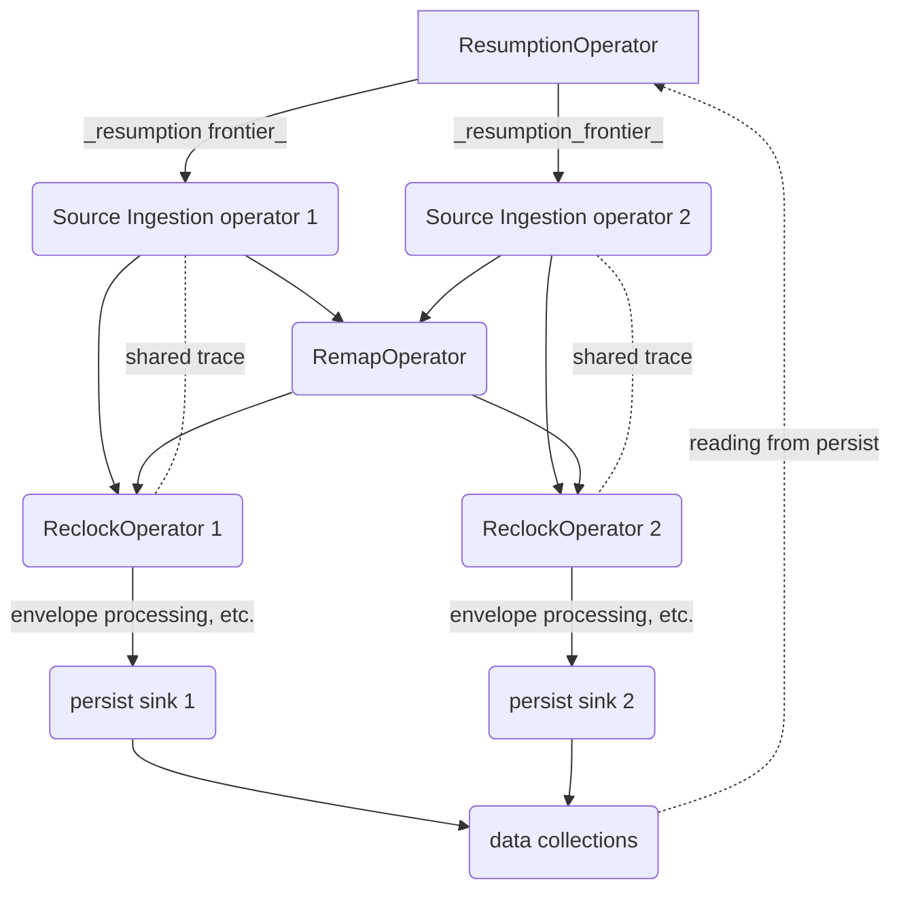

# Bounded Input Reliance

**Note**: This design document relies on changes in [this pr], which is expected
to merge soon.

[this pr]: https://github.com/MaterializeInc/materialize/pull/14355

## Summary

The [source ingestion pipeline design doc] describes that Materialize must
guarantee _bounded input reliance_.
This means that sources should not re-read data that has already been written to persist.
This requires that Materialize _bound_ the information we need to restart a source.

[source ingestion pipeline design doc]: https://github.com/MaterializeInc/materialize/pull/12109/files
[Epic task]: https://github.com/MaterializeInc/materialize/issues/13534

## Jargon

**Note**: this section uses terminology defined in [the original reclocking design doc].

- _resumption frontier_: A _target gauge_ (whose type is `IntoTime`, or currently, an ordinary `Timestamp`) frontier that is
safe to restart a specific source at.
- _upstream commit frontier_: A _source gauge_ (whose type is `FromTime`, e.g. a Postgres LSN or a Kafka `(partition, offset)`) frontier
that can be safely committed to the upstream service. The details and exact semantics of this commit frontier
are specific to the source type, and some sources may ignore any such frontier.
- _remap collection_: A pTVC that stores the (bi-directional) mapping between a _source_gauge_ and _target_gauge_.
- source: (or "upstream source" or "upstream service") a service like Kafka or Postgres that produces a stream of data.
- `SourceReader`: as in "a `SourceReader` implementer", the Rust type that produces actual data from an upstream source.
- `Source Ingestion operator`: The Timely operator that uses a `SourceReader`
  to read messages from a source. This produces "un-timestamped" batches of updates.
- `RemapOperator`: The Timely operator that produces the _remap collection_
- `ReclockOperator`: The Timely operator that consumes the _remap collection_ and "un-timestamped" batches
  to produce timestamped data for a source.

[the original reclocking design doc]: https://github.com/MaterializeInc/materialize/blob/main/doc/developer/design/20210714_reclocking.md

## Goals

- Primary Goal:
  - Regularly commit advancing _upstream commit frontiers_ for all sources
- Additional Goals:
  - Restart sources with up-to-date _resumption frontiers_.
    - Note that this is _required_, as the upstream sources could could compact data that is not beyond the _upstream commit frontier_.
  - Compact the _remap collection_
  - Localize _resumption frontier_ and _upstream commit frontier_ management inside `storaged` instances
  (i.e. not in the storage controller).

## Non-goals

- Expose the _remap collection_ to sql (for now).

## Overview

To accomplish the **Primary Goal** for a source, Materialize will semi-regularly provide an _upstream commit frontier_
to the underlying `SourceReader`, which will communicate that frontier to the upstream source. After such a frontier
has been exchanged, the upstream source may choose to forgo providing data from before that frontier when Materialize
restarts ingestion for that source.

**Source types that do not provide such an API may not be able to provided _bounded input reliance_**

The _upstream commit frontier_ can be derived from the source's _resumption frontier_, by mapping the
_resumption frontier_ to the _upstream commit frontier_ using the sources _remap collection_.

The _resumption frontier_ can be calculated by combining the `uppers` of all persist shards that are related to this source
(see the [persist design doc] for more information about these `uppers`). Currently this is only:
- The "data" persist shard.
- The _remap collection_ persist shard.

In the future this will contain other shards like "intermediate state shards".
The specifics of the "combination" is unspecified in this
document, but is most likely equivalent to a [`Lattice::meet`].

### Additional Goals

#### Restart sources with up-to-date _resumption frontiers_

Because the upstream source is allowed to drop data from before the _upstream commit frontier_, sources **must** be
restarted at the frontier that has been committed upstream. Because we must calculate the _resumption frontier_
periodically (in service of constructing the _upstream commit frontier_), we can additionally calculate such a frontier
when restarting sources, to accomplish this goal. This is already accomplished in the storage controller, but a future
extension to this design may move it into storaged instances.

#### Compact the _remap collection_
Currently we never compact the _remap collection_, which is stored in persist. This design allows us to forget about all
data from before the _resumption frontier_ (as it will already be persisted), so we can additionally use the
periodically calculated _resumption frontier_ as a `since` for the _remap collection_

## Implementation

The **Primary Goal** requires regularly calculating a relatively up-to-date _upstream commit frontier_, and
communicating that frontier to ALL active [`SourceReaders`] for the given source.

The _upstream commit frontier_ can be calculated by mapping it from the _resumption frontier_
using the trace stored in the [`ReclockOperator`]s. The _resumption frontier_ can be calculated, as
described above, by combining the `uppers` of all persist shards that are related to the source.

For each source, we are going to add a new `ResumptionFrontier` timely operator, that periodically reads all the relevant persist shards'
`uppers`, and combines them to produce a _resumption frontier_. This operator will produce no meaningful data, but will advance its
_output frontier_ to the calculated _resumption frontier_.

This _resumption frontier_ will be an input to the core `Source Ingestion Operator`, which, when receiving an update (in the form of
the input frontier advancing) will use the trace of the timely-worker local [`ReclockOperator`],
(shared with and [`Rc`] and [`RefCell`]), to map it to an _upstream commit frontier_, passing it along to the
`SourceReader` instance.

A flowchart of the above design:

[`SourceReaders`]: https://github.com/MaterializeInc/materialize/blob/72cac94bb5a8883f6a3cb4e5637e0b3f5d84d22b/src/storage/src/source/mod.rs#L389
[`RelockOperator`]: https://github.com/MaterializeInc/materialize/blob/72cac94bb5a8883f6a3cb4e5637e0b3f5d84d22b/src/storage/src/source/reclock.rs#L69
[persist design doc]: https://github.com/MaterializeInc/materialize/blob/main/doc/developer/design/20220330_persist.md
[`Lattice::meet`]: https://docs.rs/differential-dataflow/latest/differential_dataflow/lattice/trait.Lattice.html#tymethod.meet
[`Rc`]: https://doc.rust-lang.org/std/rc/struct.Rc.html
[`RefCell`]: https://doc.rust-lang.org/std/cell/struct.RefCell.html

### Subtleties

#### Frontier value management
In reality, the new _resumption frontier_ will be passed to the `Source Ingestion operator`, but needs to
be communicated to the `SourceReader` driven by this operator.

This **may** require some kind of coordination (most likely a [tokio `watch`]) to move the frontier into the async stream. Additionally, the
`SourceReader` is currently turned into a boxed [`Stream`], to receive values from the source. Because we now need to pass frontiers back,
we may need some kind of coordination introduced so we can both send and receive. This document does not specify how this should be implemented.

[tokio `watch`]: https://docs.rs/tokio/latest/tokio/sync/watch/index.html
[`Stream`]: https://docs.rs/futures-core/latest/futures_core/stream/trait.Stream.html

## Implementation of Additional Goals

### Implementation of: Restart sources with up-to-date _resumption frontiers_
Because the `ResumptionFrontier` operator will _periodically_ emit up-to-date _resumption frontier_, it cannot be relied on
when we are **starting** new source ingestion instances. Currently, we calculate the _resumption frontier_ in the storage
controller, using the same technique that the `ResumptionOperator` uses. In the future, we may want to move this
initial calculation into storaged instances, but complexities around how dataflows are created (that rely on this frontier)
prevent us from doing so easily.

### Implementation of: Compact the _remap collection_
The `ReclockOperator` can be altered to take as input frontier updates from the `ResumptionFrontier` operator,
which can drive the currently unused [`compact` method].

**Note** that _when_ we call `ReclockOperator::compact` can happen in any order with when we commit the upstream frontier.

[`compact` method]: https://github.com/MaterializeInc/materialize/blob/72cac94bb5a8883f6a3cb4e5637e0b3f5d84d22b/src/storage/src/source/reclock.rs#L209

### Localize frontier management in storage instances
The above design accomplishes this, if, in the future, we move initial _resumption frontier_ calculation into storaged instances.

## Alternatives
- This proposed design uses persist to create a circular link between the end of source ingestion and the beginning
(for example, the "data" persist shard `upper` used in _resumption frontier_ calculation is produced at the very END of
the source ingestion pipeline, but the `ResumptionFrontier` is at the very beginning. A alternative design could use
native feedback structure in Timely (like [this]) to move this data around.
  - We avoided this design because the data being fed backwards is a _frontier_, which makes it non-trivial to
  correctly feedback in Timely, which requires frontier adjustments. Additionally, the future addition of more
  frontiers as inputs to the _resumption frontier_ made maintenance of this scheme seem worryingly complex
  - We also think the additional load on persist will be negligible, and will be fanned out from multiple
  storage instances

[this]: https://docs.rs/timely/latest/timely/dataflow/operators/feedback/trait.Feedback.html

## Open questions
- How should `SourceReader` be altered to support both _receiving_ (values) and _sending_ (frontiers)? Does it need to be split into multiple
traits?
- How, _exactly_, should we share the trace between the `ReclockOperator` and `Source Ingestion operator`?
- When are we confident we can compact the _remap collection_? Does this depend on some ordering on when we
finalize the upstream commit?
