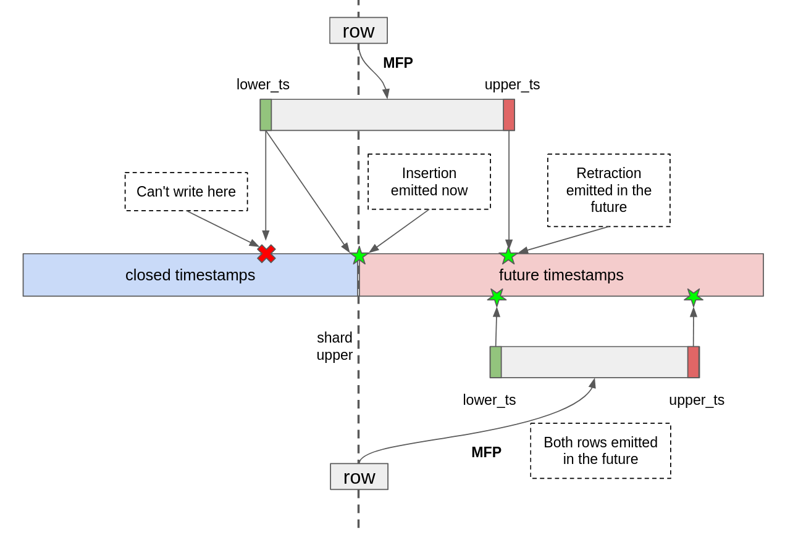

# Overview

*Allow users to transform a source before persisting it using SQL*

# Goals

- Make append-only sources viable by retaining a bounded number of updates
- Thin-down sources by filtering before consuming storage

This design doc proposes supporting arbitrary data transformations during ingestion made available
to users by extending the syntax of the `CREATE SOURCE` statement. The goal is to allow expressing
any transformation that can be written as a SQL query with one candidate syntax being a `TRANSFORM
USING <query>` fragment that can be optionally specified at the end of a `CREATE SOURCE` statement.

**Example**

```sql
CREATE SOURCE foobar FROM POSTGRES ...
TRANSFORM USING SELECT colA, colB FROM foobar WHERE colC > 4;
```

**Example with temporal filter**

```sql
CREATE SOURCE foobar FROM POSTGRES ...
TRANSFORM USING SELECT colA, colB FROM foobar WHERE created_at > mz_now()
```

### Non-goals

- Express existing envelopes and decoders in terms of a transformation query instead of custom code.
  It seems possible but it’s out of scope for the initial implementation of this feature

## Product Details

While the proposed syntax allows arbitrary queries to be written that transform a source there is a
wide spectrum of product behavior that affects the kind of queries that the system is willing to
accept and the promises to the user we are willing to make as to the effect of the queries will have
to their cost model.

In the engineering section a method for accepting arbitrary transform queries is described, but we
might want to constraint them. The engineering section presents some engineering reasons we might
want to do that but there are product considerations too.

I postulate that a user typing a `TRANSFORM USING` query in their `CREATE SOURCE` statement would
have the expectation that the only state stored by materialize would be the result of applying that
query on top of their source. If that is the case, then even if engineering wise we are able to
accept arbitrary queries with a less efficient implementation we might want to outright reject
queries that cannot be fully applied before we start persisting data. In practice this would mean
that we accept any query in the form of: `SELECT expr1, expr2, .. exprN WHERE pred1 && pred2
..`which should be enough for users to apply temporal filters and thin down their data.

The counterargument to this is that users already accept that the resource usage of their COMPUTE
queries in terms of RAM usage is at the mercy of the optimizer and surprising behaviors might arise
so it is possible to imagine them being fine with `STORAGE` also being less predictable in its usage
of S3 storage.

I will expand this section once I get the chance to talk with more people about it.

## Engineering Details

### Storage execution model

Running dataflows in storage has some unique characteristics which are important to keep in mind
when evaluating the various options laid out in the rest of the document so I will describe it here
briefly.

First, some definitions. We will represent the data in the external system that we want to ingest as
a remote differential collection `RAW`. Storage is tasked with producing a durable storage
collection `C = PERSIST(TRANSFORM(RAW)`). Currently `TRANSFORM` includes things like format decoding
and envelope processing. For each remote collection `RAW` storage maintains a read cursor in it at
some frontier `F` that allows it to read the updates to `RAW` that happened at times `t: F <= t`.
Ingestion dataflows are fault-tolerant and are re-executed when one fails. Executions share no state
between them except for any data durably stored in `persist`. Each execution is tasked with resuming
the production of updates to `C` by only observing updates to `RAW` that happened beyond `F`.

The unique characteristic is that `RAW` collections do not offer the ability to read a snapshot at
an arbitrary time `t`, even if that time is beyond our read cursor. `RAW` collections are only able
to provide the updates that happened at `t` and it is up to the reader to remember past values if
that is important. The reason for that is that we want to be giving permission to upstream systems
to *delete* (not just compact) data that we have already seen, if desired.

As a result the `TRANSFORM` function cannot rely on any in-memory state since its current execution
can be interrupted any moment and restarted in a new machine with a blank in-memory state. This
limits the kinds of dataflow operators that we can use. Stateless operators like `map` and `filter`
are safe and so are operators that can re-construct their in-memory state by reading a snapshot of
`C` (not `RAW`). The upsert envelope is an instance of the latter case.

### Adding arbitrary SQL to `TRANSFORM`

Given the constraints of the transformation function that can be ran during ingestion we can explore
a few different avenues to incorporate an arbitrary query `Q` as a transformation step. Every query
in materialize, after planning and optimizing, can be decomposed into a `MapFilterProject` (MFP from
now on) part (`Q_mfp`) and a relation expression part (`Q_expr`). Depending on the query any of
these can be trivial (i.e the identity).

This decomposition is relevant to what we’re trying to accomplish because `Q_mfp` has the property
that it’s stateless (state for temporal filters discussed below) and can performed without having
access to input snapshots whereas `Q_expr` might include arrangements and therefore need an input
snapshot before it can resume.

With this decomposition we can instantiate two dataflows:

1. `C_intermediate = PERSIST(Q_mfp(RAW))`
2. `C = PERSIST(Q_expr(C_intermediate))`

Where the first is scheduled in the storage timely cluster and the second in the compute timely
cluster. In a future where the two timely clusters get unified this could be a single big dataflow.

### Handling MFPs with temporal filters

Evaluation of `MFP`s is parameterized by the `Row` that we want to map, filter and project and the
time `t` that this evaluation is happening at. When the `MFP` contains no temporal filters the
output is a single transformed `Row` at the same time `t`. However when there is a temporal filter
involved there is a possibility that we get `Row`s that happen in the future. This is because for
each `Row` the temporal filter will calculate a `lower_ts` or an `upper_ts` or both, and these
timestamps will be entirely dependent on the expression the user typed. This is best depicted in
this diagram:



This is a problem because we have related the updates of the collection at some time `t` to the
contents of the collection before `t`, and if we were to restart execution we wouldn’t be able to
obtain a snapshot of `RAW` to re-create that state.

In order to solve this we will need to decompose `Q_mfp` into three parts: `Q_safemfp`,
`Q_temporal_filter`, `Q_final_projection`

<aside>
💡 To understand the following decomposition it is important to keep in mind that all temporal
predicates are internally converted into expressions that produce a candidate timestamp either the
lower or upper bound of the validity period. For example, the predicate `expr <= mz_now()` will get
converted into just the expression `expr` and will be stored in a `lower_bounds` list. To calculate
the lower and upper bounds of the validity period of a row during a temporal MFP evaluation all the
lower bound expressions are evaluated and the maximum is selected and all the upper bound
expressions are evaluated and minimum is selected.

</aside>

The goal of the decomposition is to come up with a `Q_safemfp` that contains no temporal filters,
performs the maximum amount of mapping and filtering, and retains enough information to later run
the original temporal filters. We can define the three parts like so:

1. `Q_safemfp` will contain the non-temporal part of `Q_mfp` combined with two additional `Map`
   expressions. These two additional map expressions will correspond to the lower and upper bounds
   and will be calculating the final timestamp for them.
2. `Q_temporal_filter` will contain two predicates:
    1. `lower_ts <= mz_now()`
    2. `mz_now() <= upper_ts`
3. `Q_final_projection` will be simply throwing away the two last columns of the row

Given this decomposition we can now define the ingestion as:

1. `C_intermediate = PERSIST(Q_temporal_filter(Q_safemfp(RAW)))`
2. `C = PERSIST(Q_expr(Q_final_projection(Q_temporal_filter(C_intermediate))))`

### Planner/Optimizer/Data structure stabilization

The inability to have `RAW` snapshots readily available has some deep implications on how much of
our internal choices we are willing to stabilize, which in turn have deep implication on the kind of
queries we want to allow users to use in the `TRANSFORM USING` position.

In the equations above we had to define `C_intermediate` to effectively be a collection whose schema
is very much dependent on planner and optimizer choices. Since the transformation from `RAW` to
`C_intermediate` is not described by high level `SQL` that can be stored in the catalog we must
explore what else we must stabilize in order to be able to continue ingesting a source across
versions.

There are various flavors of how this could go. I will lay out some of them below.

**Option 1: Only accept transforms `Q` whose `Q_expr` is the identity, stored as SQL**

We make the guarantee that if a version of Materialize plans and optimizes a piece of SQL to just an
MFP then all future versions will continue to do so and will be producing an identical MFP. No data
structure stabilization needed.

**Option 2: Only accept transforms `Q` whose `Q_expr` is the identity, stored as raw MFP**

We make the guarantee that an MFP produced by some version of Materialize will be able to be read
and interpreted in the intended way by all future versions. In practice this means stabilizing
`MirScalarExpr`.

**Option 3: Accept any transform `Q`, stored as SQL**

We make the guarantee that if a version of Materialize plans and optimizes a piece of SQL to a pair
of `Q_mfp` and `Q_expr` then all future versions will continue to produce an identical `Q_mfp` but a
potentially different `Q_expr`. No data structure stabilization needed.

**Option 4: Accept any transform `Q`, stored as `MirRelationExpr`**

We make no guarantees to the properties of the planner/optimizer over time but we guarantee that a
`MirRelationExpr` produced by a version of Materialize will be readable in the intended way by all
future versions.

> Petros’ take: Stabilizing data structures is easier to think about then stabilizing code behavior
> so I would shy away from options 1 and 3. Stabilizing `MirScalarExpr` seems tractable given its
> simplicity so I would go for option 2 unless an amazing option 5 appears.
