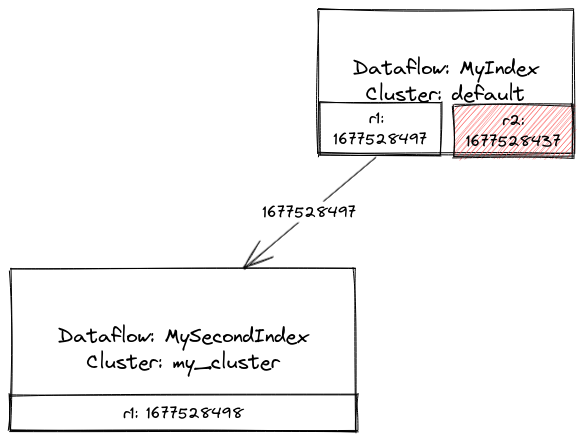
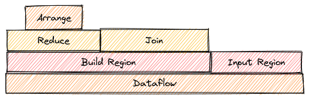

- Feature name: External introspection
- Associated: (Insert list of associated epics, issues, or PRs)

# Summary
[summary]: #summary

In this document we will propose a few features related to "external"
introspection; that is, introspection by end-users. These features
will be exposed in the web UI.

# Motivation
[motivation]: #motivation

It is currently difficult for anyone but the most unusually
sophisticated users to debug issues with compute-maintained features:
understand the health and stability of their replicas, understand the
performance of their queries, and so on.

# Explanation
[explanation]: #explanation

We will explain each proposed feature separately.

## Hierarchical dataflow visualizer

This will provide the functionality available now in the `memory` and
`/hierarchical-memory` visualizations: visualizing the graph of
operators in a dataflow, including the transfer of data along channels
and the number of records in arrangements.

This will differ from the presently-available GUIs in the following
ways:

* It will be externally visible
* The user will be able to dynamically refine the zoom level by
  clicking (rather than having to scroll down as in the current
  hierarchical UI)
* We will include scheduling durations alongside the other per-node
  information (arrangement sizes / channel traffic)
* If possible (TBD) we should figure out how to filter out the error
  paths.

Mockup: 

## Global frontier lag visualizer

The global frontier lag visualizer will allow users to see at a glance
whether dataflows are falling behind. It will display the controller's
view of each source and export frontier, and color nodes if their
outputs lag significantly behind their inputs.

There may be multiple values corresponding to a single export, if
the cluster on which the source dataflow is running has more than one
replica. Each edge between dataflows will be labeled with the maximum
frontier across all replicas.

The view will incorporate all possible inputs and outputs of a
dataflow: indexes, MVs, sources, and sinks.

Mockup: 

## "Flamegraph" views of resource usage information

By "resource usage information" we mean the same things that are displayed
per-node in the hierarchical dataflow visualizer.

The scope structure should let us compute various values (time spent,
records contained) and display them in a tree-like visualization, as
shown below.

## Per-query metadata

We should collected the following metadata for each query:

* The timestamp at which the query executed
* The frontiers of all dependencies
* The optimized and physical query plans
* The ID of the dataflow (if it is not a simple peek) used to service
  the query
* The SQL text of the query

We can then save all this information in a table with non-trivial
retention, and surface it from the web UI.

## User-friendly rendering of query plans

Currently we have text-only `EXPLAIN PLAN` output. We should render
this data in visual form, as a graph. We should also (whenever
possible) flow column names from the source relations through the
nodes, so that we can show something more useful than `#0`, etc.

# Reference explanation
[reference-explanation]: #reference-explanation

## Data sources
All features will be implemented in the web UI using React, querying
the `mz_internal` relations for the necessary data. Relations that
will be used include:

* For the hierarchical dataflow visualizer:
    * `mz_dataflow_operators`
    * `mz_dataflow_channels`
    * `mz_arrangement_sizes`
    * `mz_dataflow_addresses`
* For the global frontier lag visualizer:
    * `mz_object_dependencies`
    * `mz_cluster_replica_frontiers`
* For the flamegraph views: same as the hierarchical dataflow
  visualizer
* For the per-query metadata: New table to be created
  (`mz_query_metadata`).
* For the user-friendly plan rendering: parsed `EXPLAIN PLAN` output
  (possibly from `mz_query_metadata`, or entered manually by the user).

## Layout and rendering

We will use the [d3-graphviz](https://github.com/magjac/d3-graphviz)
library for layout and rendering of the hierarchical dataflow
visualizer, global frontier lag visualizer, and user-friendly plan
rendering. We will use
[d3-flame-graph](https://github.com/spiermar/d3-flame-graph) -- which
we are already using on the internal side -- for the flamegraph
visualizer.

# Rollout and Lifecycle

We will be considering this an experimental feature until such time as
we can involve professional product designers and front-end
engineers. Until that time, the level of polish of the UX may not
reach the same standards as the rest of the site, so we will require
users to click a link with a label like "Advanced Features" or similar
in order to access the tools.

We will also use LaunchDarkly to gate access to the feature, and not
launch it at all to the public until we have gotten some internal
feedback from support and DevEx that it is useful.

We will have a separate LaunchDarkly flag just for the
`mz_query_metadata` table, since this will have potentially large cost
in high-QPS scenarios.

## Testing and observability

(TBD -- will cover this in our meeting with Robin tomorrow and get an
overview from him of the testing strategy for this kind of feature)

# Drawbacks
[drawbacks]: #drawbacks

* If any of the features don't prove useful, we are cluttering our UX
  unnecessarily.
* Maintaining the `mz_query_metadata` table will introduce overhead on
  persist. We should 

# Conclusion and alternatives
[conclusion-and-alternatives]: #conclusion-and-alternatives

- I am unaware of any other possible designs

# Unresolved questions
[unresolved-questions]: #unresolved-questions

* What will be the overhead of the `mz_query_metadata` table, and is
  it acceptable?
* How can we communicate query IDs back to the user for looking up the
  query in the per-query metadata view? Is it acceptable to use
  `NOTICE` messages in this case?

# Future work
[future-work]: #future-work

Not sure of any. We should launch an MVP, get feedback and then iterate.
