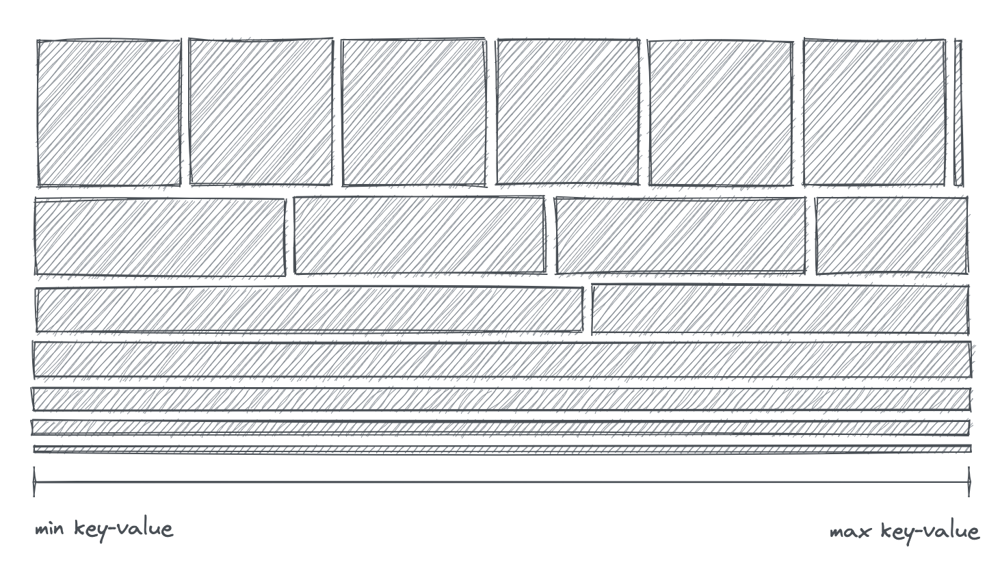
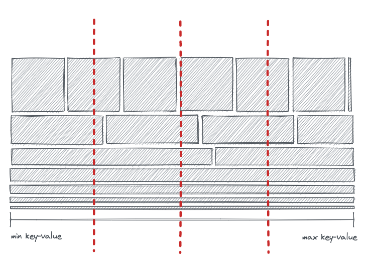
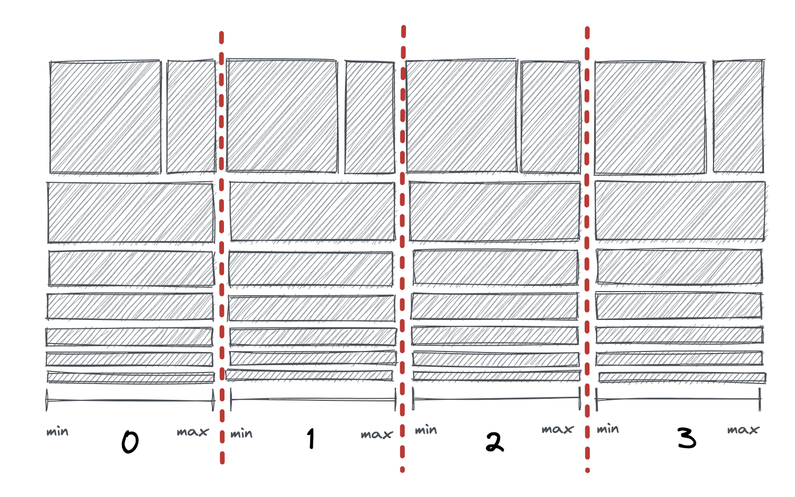

# Consolidation on read
- Feature name: consolidation on read
- Associated: <https://github.com/MaterializeInc/materialize/issues/16858>

# Summary

A Persist shard stores its data in sorted order, and sorted data can be efficiently consolidated using a streaming merge.

This design proposes changes to the Persist source that take advantage of the sortedness of Persist data to:

- Reduce the amount of unconsolidated outputs the Persist source produces, in a best-effort fashion;
- Optionally allow clients to request having the data fully consolidated as it is read from durable storage, to allow further optimizations downstream.

# Motivation

## Background

Persist’s data is organized into batches, ordered by frontier; each batch consists of multiple runs of data, in no particular order; a run consists of multiple parts, ordered by the key-value range they contain; each part contains multiple differential updates, sorted by the serialized key-value. Importantly, this guarantees that entire runs of data are sorted lexicographically by key-value-time.

The source will generally emit one batch of updates at a time… with the exception of the first snapshot, where a number of batches may all be emitted in one go, with the lower frontier advanced to the as-of. Otherwise, the snapshot is not generally handled specially by the source; like the individual batches, it’s just a set of runs.

> 📋 A set of parts representing some initial snapshot. (The horizontal axis represents the ordered range of key-values, min to max; parts in the same row are parts of the same run.) A typical snapshot will have many parts that cover the entire key-value range, with perhaps a small number of longer runs from the oldest/largest batches of data.

A single worker can efficiently and fully consolidate a set of runs using a streaming merge: iterate through each of the runs concurrently, pulling from whichever run has the smallest next key-value, and consolidating updates with equal key-value-time as you go.

However — the Persist source runs concurrently across multiple workers and operators, so this simple approach is not available. Instead, we need some design that allows all workers to make progress in parallel.

## Goals

This design covers two related initiatives in the Persist source:

- **Best-effort consolidation.** Any consolidation we can do in the source means fewer allocations and less data for downstream nodes to process; even if we’re not striving for perfect consolidation, it’s still worth expending some modest effort to make our distributed implementation reduce down the dataset more effectively.
- **Guarantees around full consolidation, or snapshot monotonicity.** Certain downstream operations can be made more efficient when the data they process is monotonic. It’s already possible for downstream code to ensure this for ad-hoc queries by running the output of the Persist source through differential’s `consolidate` operator… but the source can take advantage of the sortedness of the data to make this consolidation more efficient.
    - Even if this is cheaper than doing consolidation outside the source, it is unlikely to be cheaper than not guaranteeing consolidation at all — so it’s important that this capability have effectively no cost for users that haven’t opted in.

While related, these two goals are separable — we could do the former without the latter — and they will generally be treated separately in the rest of the text.

# Explanation

## Best-effort consolidation

The Persist source consists of three separate stages: assigning part descriptions to workers, fetching the parts, and decoding them and applying MFP. Notably, decoding *already* involves a `ConsolidateBuffer` to help consolidate down data within a single part. One way to think of the best-effort consolidation work is a set of changes to make that existing consolidation more effective, by improving the odds that consolidate-able updates end up in the same consolidation buffer.

1. Currently, the decode operator will process parts one after the other. Instead of draining an entire part before starting on the next, we can iterate through multiple parts in key-value order. (This is similar to the streaming merge mentioned above, but only operating on the parts that happen to be assigned to a single worker.)
    - This makes it more likely that, if our worker is assigned the same key-value in distinct parts, those updates will be added to the same buffer and consolidate down.
2. Currently, we fetch a single part from our blob store before moving on to the next. Instead, we can fetch multiple parts from S3 in parallel.
    - Aside from the possible concurrency benefit, this makes it more likely that the decode operator will have more than one part to iterate through at a time.
3. Currently, parts are assigned in random order to workers. Ideally, we’d like to hand out parts such that downstream workers will be handling similar ranges of the key-value space at the same time, without impacting fairness.
    - If we track statistics for each part — planned as part of work on MFP pushdown — we can sort parts by the minimum key-value they contain before assigning them out.
    - Even without per-part statistics, various heuristics may help improve the odds that overlapping parts end up on the same worker at the same time. (In the diagram above, for example, the first part of the first run is likely to overlap with the first part of the second run… and will definitely not overlap with any other part of the first run.)

Note that none of these changes increase the amount of work done in the source, or change the semantics of the output; they simply rearrange when existing work is done. The primary effect is to reduce the number of updates passed along to downstreams… but they also make it easier to support users opting in to additional guarantees, as described below.

## Full consolidation / snapshot monotonicity

In the compute layer, certain operations can be made much more efficient if their input is monotonic. For example, the monotonic TopK implementation only needs to track the top **k** records, while the more general implementation may need to track state proportional to the input size. Similarly, an ad-hoc `SELECT ... LIMIT k` query can return the first **k** updates it sees to the user, if its input is monotonic… but if not, it also will need to store state proportional to the size of the snapshot.

It has been observed that [one-off select statements would be monotonic if Persist output was consolidated](https://github.com/MaterializeInc/materialize/issues/17358). (We’ll refer to this property — where the initial snapshot of the data from the source is monotonic — as **snapshot monitonicity**.) One way to ensure snapshot monotonicity for a source is to slap a consolidate operator on the output. This may be worthwhile (if expensive) for TopK, but does not help for the select-limit case, where [buffering up the entire snapshot in the consolidate operator would defeat the point](https://github.com/MaterializeInc/materialize/issues/15962). (We’ll refer to operators that can emit output before the full snapshot is complete as **smooth**.)

However, it is possible to take advantage of the data’s sortedness in the source to fully and smoothly consolidate the data in the shard, which can both be less memory-intensive than an out-of-source consolidate and decrease the “time-to-first-byte” of the output. This could optimizations like the above for users that specifically request it.

### Fine-grained source timestamps

Like most of Materialize, the Persist source is currently timestamped with the standard 64-bit system timestamp. The decoding operator in the source maintains a separate capability for each in-progress part, which allows it to emit data at any time within that part’s lower and upper bounds. From the perspective of a downstream operator, the effect is that the frontier will stay the same for long periods as we decode all the parts in a batch or snapshot, then leap forward to the next frontier.

The core idea of this section is to allow decoding in a nested scope, with a timestamp that can be continually downgraded while processing a batch. This allows any downstream operator that can only make progress when the frontier makes progress — like consolidation! — to progress incrementally as a batch is being decoded, instead of buffering up the entire batch and then emitting it all at once.

Specifically, when a user requests a monotonicity guarantee from the source, we can:

- Open a nested scope, enriching our usual system timestamp with an inner timestamp that measures progress through the ordered key-value space within a batch.
- As the decode operator progresses through a sorted part, periodically downgrade its capability to reflect its progress through that part.
- Perform the consolidation in the nested scope. Any two updates in the shard with identical key-value-time will consolidate in this nested scope. However, the frontier will progress — and output would be emitted — much more frequently.
- Leave the scope, returning our decoded updates to their usual system timestamps.

This is not free: it will generally be more expensive than relying on best-effort consolidation. However, if the downstream dataflow can make use of the snapshot monotonicity guarantee to make other optimizations, enabling this option should be worthwhile.

# Reference explanation

We’ve [prototyped](https://github.com/bkirwi/materialize/tree/fine-arrangement) the fine-grained timestamping idea, since it’s the most technically fraught aspect of the proposal. When the text below refers to decisions made “in the prototype”, this is the relevant branch.

## Timestamp types

Our design for fine-grained timestamps requires a timestamp type that captures progress through our totally ordered key-value space. Using the entire serialized key-value as a timestamp is possible but allocation-intensive. The prototype instead uses a 16-byte prefix of the serialized key of the data — small enough to keep on the stack, still reasonably fine-grained — but any monotonically non-decreasing function of the input data is fine. (For example, if we decide to break up rows into individual columns to enable MFP pushdown, we might choose to pack the first column or two into the timestamp.) In this doc, we’ll refer to this as the **prefix timestamp**, and our usual 64-bit Materialize timestamp as the **system timestamp**.

The full timestamp in the nested scope is a pair of system time and prefix time. This **hybrid timestamp** is lexicographically ordered. Timely’s implementation for pairs is almost exactly what we need here, but it does not implement `Refines`; the prototype includes a reimplementation with a `Refines` implementation and some other small niceties.

Decoding happens in our nested scope. When it receives a part as input, it also receives a hybrid-timestamp capability with the prefix timestamp at its minimum value. As we iterate through a sorted part, we timestamp each update using the prefix time of that update’s key-value pair, and periodically downgrade the prefix timestamp on our capability to reflect the largest prefix time we’ve seen for any update. (Since our prefix timestamp is monotonic in our sorted input data, we know any later data in the part will have a prefix timestamp at least that large!) Once all parts have downgraded their timestamp past a certain prefix time, our output frontier will advance. The frequency of downgrades is tunable; downgrading and yielding more frequently allows smoother progress, while downgrading less often will tend to lead to larger output batches.

## Interaction with MFP

Our decoding operator in the source is actually `decode_and_mfp`: our parts are decoded, passed through MFP, then the result is best-effort consolidated in a `ConsolidateBuffer` and forwarded on. This MFP is important for performance! Take, for example, a `SELECT count(*) from table` query: MFP will project every row into an empty row, and these will consolidate extremely well in our consolidation buffer. Queries like this are common both in our benchmark suite and in real life.

By grouping similar rows together, the “best-effort consolidation” changes should only improve the effectiveness of this MFP step. Attempting full consolidation will interact with MFP in various ways, however:

- Fine-grained timestamps can cause the best-effort consolidation buffer in `decode_and_mfp` to consolidate less, since updates that were previously made identical by MFP are now distinguishable by timestamp.
    - Adding an additional `ConsolidateBuffer` at `leave` time mitigates this issue, though we still end up exchanging more data within the source.
- If mapping or projection is applied, the output from the source may not be fully consolidated. (Put another way: the source behaves as though the raw data was fully consolidated *before* being passed to MFP.)
    - We only have the opportunity to optimize consolidation in the source because our part data is sorted, but the output of MFP is not necessarily sorted. We believe there is no approach that both provides fully consolidated data post-MFP and is any more efficient than doing a consolidate outside the source.
    - MFP does not affect our “snapshot monotonicity” property. When full consolidation is requested, the output will be snapshot monotonic regardless of the complexity of the MFP.
- If the MFP filters out a row, nothing will be emitted from `decode_and_mfp` or go through consolidation, which is ideal. (And none of the optimizations in this doc affect our ability to do things like filter pushdown.)

These tradeoffs generally seem worth it for dataflows that benefit from our smoothness property, or dataflows that do not aggressively transform data during MFP. Dataflows with very aggressive MFPs that don’t benefit from smoothness (like our `count(*)` query) may prefer to consolidate outside the source.

## Unsorted parts

The above text has generally assumed parts are sorted, but this is not always true… in particular, user-provided data is currently not sorted before it’s written out to S3. The output of compaction is always sorted, though, and for large shards most of the stored data will have been through at least one round of compaction. It’s possible to recognize these two categories of parts from the part metadata.

One approach to dealing with unsorted parts is to sort them before processing. Another approach — taken in the prototype — is to never downgrade the frontier for those parts, but prioritize emitting them over sorted parts so they don’t unnecessarily hold back the overall frontier. And finally: we’re exploring [sorting every part at write time](https://github.com/MaterializeInc/materialize/pull/17116), which would obviate this concern entirely.

# Rollout

The best-effort consolidation work consists of small interventions that can be made incrementally and do not overlap with any other team’s code. These are well covered by existing tests, including nightlies, and can be rolled out in the same way as any ordinary improvement to Persist’s code.

The full consolidation effort should have no impact on downstream code when the option is disabled. Our existing correctness and performance tests should help ensure this is the case.

The most fraught aspect of the rollout is expected to be the first *usage* of the new full-consolidation option, since that is unlikely to be covered well by existing tests and touches a net-new codepath.

## Testing and observability

As noted elsewhere, existing tests do a good job of spotting regressions in correctness or performance for existing Persist functionality, since virtually every Materialize query relies on Persist. However, these tests will not cover the new full-consolidation option, since it’s disabled by default.

- We should run the existing test suite, including nightlies, with full consolidation enabled. Performance-sensitive tests might fail, but we can verify that it does not impact correctness.
- For any new feature that *does* enable the full-consolidation option, we can test that the output of the query is the same as if it did not, and add a feature benchmark to lock in any improved performance.

Metrics we should either add or watch more closely for this work:

- The count of updates emitted from the source. These numbers should go down as best-effort consolidation improves.
- Time-to-first-byte: the interval between when the dataflow is created and when the first update is emitted from the source. This allows us to verify that we’re smoothly emitting data on real-world queries.

## Lifecycle

Any uses of the new full-consolidation flag will need targeted tests that cover both performance and correctness. We should work with any future users of the feature to determine an appropriate lifecycle for that particular feature, ensuring that our coverage is good and that we’re seeing the improvements we’d expect.

# Drawbacks

The best-effort consolidation work is purely an optimization, with no drawbacks outside of possible complication to the code. We may decide to skip or postpone this work if we have higher-priority things to address in the source than efficiency or performance.

Full consolidation provides a new option to downstream users. It is only worth providing a new option if it will actually be used, and if it provides a capability that can *only* be performed within the source. We should convince ourselves that the compute layer is likely to take advantage of any knob we provide before doing the work of adding it.

# Conclusion and alternatives

## Alternatives to timestamp-based full consolidation

### Duplicate fetching

Looking back at the diagram above, you can imagine slicing up the keyspace into roughly evenly-sized chunks, one per worker.

Each worker could then download every part that overlapped with its assigned section of the key-value range, filter out any extra updates that don’t belong in its section of the range, and consolidate down and emit the remaining data.

- This involves quite a lot more part fetching from S3. Fetching parts is the second most expensive part of our S3 usage in Persist, comprising about a third of the cost… and most large shards have dozens of parts that span the full key-value range and would need to be downloaded on every worker. (And if there are too many runs to hold in memory at once, we may even need to refetch the same part multiple times.)
  - If we gain the ability to push down filters, the read amplification is reduced... but we'd still need the GETs.
- This has similar smoothness benefit to the timestamp-based option, without the complexity of actually needing a novel timestamp.
- Each worker needs to download at least one part from every run before emitting any data. The timestamp-based design can start emitting data as soon as it arrives, leading to possibly-smoother progress.
- This option requires us to track statistics with the min and max key-value for each part. Without stats, we’ll need to pessimistically assume that the part covers the full range. (The timestamp design works fine with or without stats, and the prototype does not include them.)

While we believe this is technically viable, it seems more expensive in cost and complexity than the proposed design.

## Write-time bucketing

One issue with the above “duplicate fetching” approach is that our runs don’t split up nicely between workers: there’s just no way to assign parts to workers such that parts with identical key-values will always land on the same worker.

A common approach to this sort of problem is to divide our data into **n** buckets. At write time, we could assign each unique key-value to a particular bucket. (Probably by taking the hash of the key-value modulo **n**.) In the source, we could allocate each bucket to a particular worker. Since each key-value is in at most one bucket, consolidating locally in each worker means that the overall dataset is consolidated as well. Compaction and other operations on the shard would also need to be reworked to proceed bucketwise.

- This avoids the costs associated with fetching the same part multiple times. It also adds new costs: runs that previously consisted of single part are now split into $n$ parts, one per bucket; and each of those $n$ parts will need to be fetched in the source.
    - The write amplification might be addressed by grouping multiple buckets into a single part file. The read amplification seems inherent to the design.
- It’s hard to choose a bucket count that behaves reasonably from `2xsmall` to `6xlarge`; a single shard may be read across replicas with a wide variety of worker counts; those worker counts change over time; the shard itself may grow and shrink. Even a dynamic bucket count struggles to balance this diversity of needs.
- The bucketing interferes with filter pushdown on a prefix of the row. If you’re filtering down to a reasonably narrow range — but not all the way to a point lookup — Persist’s current design lets you filter to one part per run. With the bucketing approach, you’ll need to fetch one part per run **in every bucket.** For realistic bucket counts and shard sizes, this eliminates most or all of the benefits of pushing down the filter.

Since this interferes with filter pushdown — our best and most exciting optimization opportunity — and significantly constrains how Persist’s data is written, this is not our favourite option.

### Fast paths

If a snapshot or batch consists of a single run, and the parts in that run have been compacted, the contents of that snapshot or batch are already fully consolidated and can be forwarded along without additional work.

If we don’t care about full consolidation, but we *do* care about snapshot monotonicity, we could add an additional part statistic that tracks whether a run contains retractions or not. If none of the runs in the snapshot or batch contain retractions, it’s certainly monotonic.

- It’s rare that a snapshot will consist of a single run. Append-only sources and similar collections are expected to be retraction-free, though we expect most collections to see occasional retractions.
- If a user requests a consolidated or snapshot-monotonic source, and these fast paths don’t apply, we’d need a fallback approach.

These fast paths seems like a good complement to one of the more general approaches to consolidation or snapshot monotonicity discussed above.

# Unresolved questions

**Will compute be able to take advantage of the proposed full-consolidation option to optimize downstream dataflows?** In previous discussions, it’s been unclear whether the current optimizer has enough context to determine when enabling consolidation in the source would be a net benefit, or whether the types of queries that benefit from consolidation in the source are an overall priority. We should make sure this knob will be used before adding it in!

**Can we safely rely on Persist’s ordering of data in consolidation?** The only reason we can hope to fully consolidate more efficiently in the source than elsewhere is because Persist stores its data in sorted order, but that means that we’re very reliant on the exact details of how Persist orders data. Today, Persist sorts data by its serialized representation… so if two different rows are identical in memory but serialize to different bytes, they may not be sorted similarly and thus might not consolidate out.

For any approach to consolidation on read to work, we’ll need to ensure Persist’s sorting puts equal data together. Today, that means ensuring that when rows are equal, their serializations are too. In a columnized MFP future, we’d need to take similar care with our columnar representation.

**Are there other users that could benefit from a finer-grained timestamp on source data?** This design has a relatively unusual approach to “smooth rehydration” — is this approach useful outside the source?

For example, Kafka sinks are currently forced to write the entire snapshot in a single transaction… which can be flaky for large snapshots. Could they take advantage of finer-grained timestamps to write smaller, more incremental transactions?

# Future work

Depends largely on the answers to the unresolved questions above.
