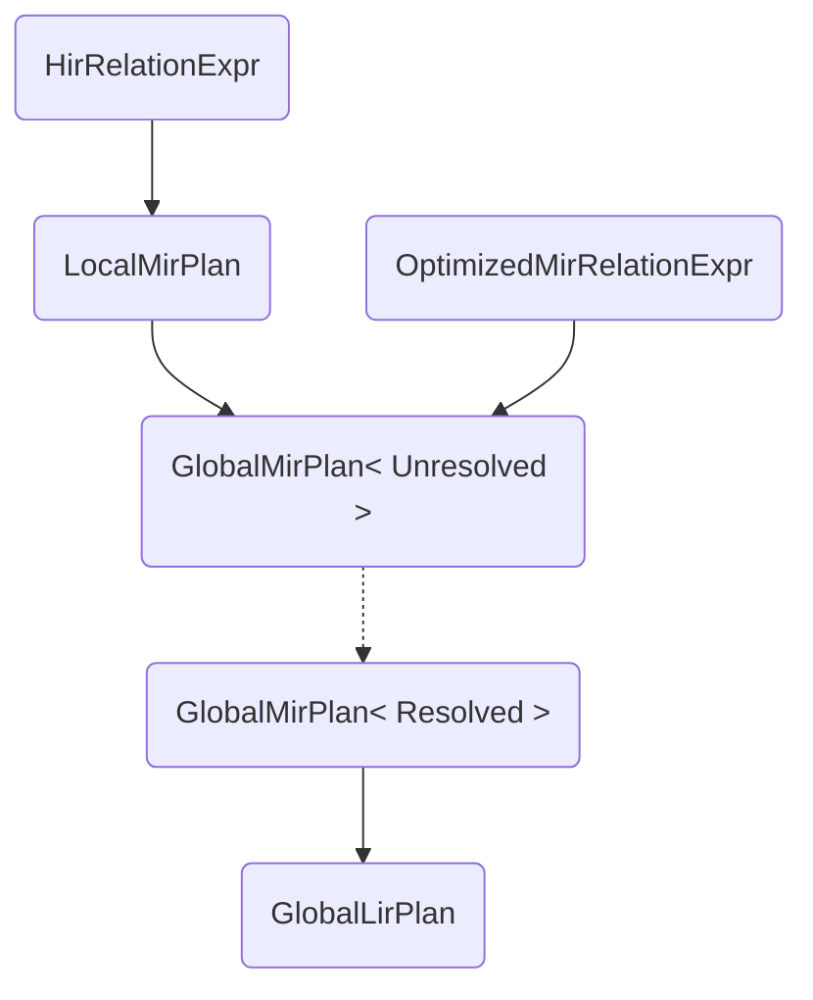

# Unified optimizer API

- Associated:
  - MaterializeInc/materialize#19223
  - MaterializeInc/database-issues#5301

<!--
The goal of a design document is to thoroughly discover problems and
examine potential solutions before moving into the delivery phase of
a project. In order to be ready to share, a design document must address
the questions in each of the following sections. Any additional content
is at the discretion of the author.

Note: Feel free to add or remove sections as needed. However, most design
docs should at least keep the suggested sections.
-->

## The Problem

<!--
What is the user problem we want to solve?

The answer to this question should link to at least one open GitHub
issue describing the problem.
-->

Currently, Materialize executes optimization pipelines in the following situations:

1. In `Coordinator::bootstrap`, when re-installing `MaterializedView` and`Index`
   catalog items.
1. In `Coordinator::sequence_plan`, when sequencing statements that result in an
   executable dataflow or a `View` creation.
1. In `Coordinator::sequence_plan`, when explaining statements that result in an
   executable dataflow (`SELECT`, `CREATE MATERIALIZED VIEW`, or `CREATE
   INDEX`).

The optimization pipeline that we run nowadays consists of multiple IRs,
lowerings (transformations between adjacent IRs), and optimizations (rewrites
within the same IR). Because these steps have evolved slowly over time, they
have never been unified under a single API.

Consequently, all client code the `Coordinator` that runs an optimizer pipeline
currently constructs this pipeline implicitly using ad hoc calls of relatively
low level APIs spread over a number of crates. Examples are:

- `mz_sql::plan::HirRelationExpr` (the `lower` method).
- `mz_transform::Transform` and its methods.
- `mz_adapter::coord::dataflows::DataflowBuilder` and its methods.
- `mz_transform::optimize_dataflow`.
- `mz_compute_types::plan::Plan::finalize_dataflow` called transitively by
   - `mz_adapter::coord::Coordinator::finalize_dataflow`.
      - `mz_adapter::coord::Coordinator::must_finalize_dataflow`.
   - `mz_adapter::coord::Coordinator::ship_dataflow`.
      - `mz_adapter::coord::Coordinator::must_ship_dataflow`.

This results in redundant or — worse still — _near_ redundant code.

Keeping the optimization pipelines for each statement type `T` in sync across
its client sites ("bootstrap `T`", "execute `T`", and "explain `T`") therefore
is constantly at risk of getting out of sync. When this happens, it negatively
impacts the overall product experience. For example, in the past we had
situations with "`EXPLAIN` drift", where "explain `SELECT`" results were not
faithfully representing the optimization path stages of the "execute `SELECT`"
code path. Obviously, this can cause a lot of frustration for users that rely on
`EXPLAIN` output in order to tune their queries.

This design doc aims to provide a mechanism that mitigates that risk. In
addiion, we want to address the following shortcomings of the current state:

1. The optimizer boundary is a natural boundary between the COMPUTE and ADAPTER
   teams. However, because this boundary is fuzzy, it's often not clear which
   changes in `mz_adapter` consistute changes to the optimizer internals and
   need an explicit stamp from COMPUTE, and which go the other way.
2. Optimization is not ready for the Platform v2 effort. More speificially, we
   are not ensuring that optimization phases can be spawned into a different
   thread for all statement types.

## Success Criteria

<!--
What does a solution to this problem need to accomplish in order to
be successful?

The criteria should help us verify that a proposed solution would solve
our problem without naming a specific solution. Instead, focus on the
outcomes we hope result from this work. Feel free to list both qualitative
and quantitative measurements.
-->

Provide a first-class optimizer interface that explicitly models our current
understanding of the query optimization lifecycle as seen in Materialize. The
interface should:

1. Seal query optimization internals from the client and serve as a contract
   between ADAPTER and COMPUTE in a way which allows ADAPTER to run optimization
   pipelines at multiple client sites. This should happen while providing high
   confidence that the pipeline for a specific statement type is consistent
   throughout the ADAPTER code, even as both the ADAPTER and COMPUTE code
   continue to evolve.
2. Be flexible enought so it can be integrated in the current ADAPTER layer
   without major refactoring of the ADAPTER call sites.
3. Be aligned with the Platform V2 goals.

## Out of Scope

<!--
What does a solution to this problem not need to address in order to be
successful?

It's important to be clear about what parts of a problem we won't be solving
and why. This leads to crisper designs, and it aids in focusing the reviewer.
-->

1. Immediately solve long-standing issues with the optimizer pipeline. While the
   design should accomodate natural mechanisms for solving those, we don't want
   to implement everything within the initial migration effort. For example: an
   optimizer might want to provide shared context (for typing invariants, for
   Prometheus metrics, for feature flags) across all of its phases. While
   introducing the notion of a shared context is part of the scope, threading it
   through is not.
2. Consolidate the various stages of the optimization pipeline into a single
   stage. Again, while this can be a long-term goal, it seems too much of an ask
   to do this refactor when we introduce the new optimizer interface. Rather, we
   can revisit the (hopefully now cleaner) code when we are done and design a
   path towards merging adjacent stages together whenever possible.
3. The new API will also allow us to have a clearer notion of "optimizer
   version", which could be a useful tool in migration. For example, we can do
   A/B migration testing: when we are considering a change to the optimizer, we
   can optimize all queries with both — identifying and anonymously logging
   production queries that will behave differently in the new optimizer. Again,
   this is something that can be facilitated by the proposed changes, but will
   not be scoped as part of them.

## Solution Proposal

<!--
What is your preferred solution, and why have you chosen it over the
alternatives? Start this section with a brief, high-level summary.

This is your opportunity to clearly communicate your chosen design. For any
design document, the appropriate level of technical details depends both on
the target reviewers and the nature of the design that is being proposed.
A good rule of thumb is that you should strive for the minimum level of
detail that fully communicates the proposal to your reviewers. If you're
unsure, reach out to your manager for help.

Remember to document any dependencies that may need to break or change as a
result of this work.
-->

At the high level, we want to have a minimalistic API defined by the following
trait:

```rust
/// A trait that represents an optimization stage.
///
/// The trait is implemented by structs that encapsulate the context needed to
/// run an end-to-end optimization pipeline for a specific statement type
/// (`Index`, `View`, `MaterializedView`, `Subscribe`, `Select`).
///
/// Each implementation represents a concrete optimization stage for a fixed
/// statement type that consumes an input of type `From` and produces output of
/// type `Self::To`.
///
/// The generic lifetime `'ctx` models the lifetime of the optimizer context and
/// can be passed to the optimizer struct and the `Self::To` types.
///
/// The `'s: 'ctx` bound in the `optimize` method call ensures that an optimizer
/// instance can run an optimization stage that produces a `Self::To` with
/// `&'ctx` references.
pub trait Optimize<'ctx, From>: Send + Sync
where
    From: Send + Sync,
{
    type To: Send + Sync + 'ctx;

    /// Execute the optimization stage, transforming the input plan of type
    /// `From` to an output plan of type `To`.
    fn optimize<'s: 'ctx>(&'s mut self, plan: From) -> Result<Self::To, OptimizerError>;
}
```

This simple trait allows us to adhere to the following principles:

- Implementors of this trait are structs that encapsulate all context required
  to optimize a statement of type `T` end-to-end (for example `OptimizeIndex`
  for `T` = `Index`).
- Each struct implements `Optimize` once for each optimization stage. The `From`
  type represents the input of the stage and `Self::To` the associated stage
  output. This allows to have more than one entrypoints to a pipeline.
- The concrete types used for stage results are opaque structs that are
  specific to the pipeline of that statement type.
  - We use different structs even if two statement types might have structurally
    identical intermediate results. This ensures that client code cannot first
    execute some optimization stages for one type and then some stages for a
    different type.
  - The only way to construct such a struct is by running the `Optimize` stage
    that produces it. This ensures that client code cannot interfere with the
    pipeline.
  - In general, the internals of these structs can be accessed only behind a
    shared reference. This ensures that client code can look up information from
    intermediate stages but in general cannot modify it.
  - Timestamp selection is modeled as a conversion between structs that are
    adjacent in the pipeline.
  - The struct representing the result of the final stage of the optimization
    pipeline can be destructed to access its internals.
- The `Send + Sync` trait bounds on the `Self` and `From` types ensure that
  `Optimize` instances can be passed to different threads.

As an example, here is the definition of the `OptimizeMaterializedView` struct
which implements the optimizer pipeline for `CREATE MATERIALIZED VIEW`
statements:

```rust
pub struct OptimizeMaterializedView {
    /// A typechecking context to use throughout the optimizer pipeline.
    typecheck_ctx: TypecheckContext,
    /// A snapshot of the catalog state.
    catalog: Arc<Catalog>,
    /// A snapshot of the compute instance that will run the dataflows.
    compute_instance: ComputeInstanceSnapshot,
    /// A durable GlobalId to be used with the exported materialized view sink.
    exported_sink_id: GlobalId,
    /// A transient GlobalId to be used when constructing the dataflow.
    internal_view_id: GlobalId,
    /// The resulting column names.
    column_names: Vec<ColumnName>,
    /// A human-readable name exposed internally (useful for debugging).
    debug_name: String,
    // Optimizer flags.
    flags: OptimizerFlags,
}
```

The following diagram illustrates the pipeline implemented by `OptimizeMaterializedView`



The pipeline can be entered both from an `HirRelationExpr` and from an
`OptimizedMirRelationExpr` — the latter is needed because the
`Coordinator::bootstrap` code path starts from a catalog item that stores an
already locally optimized `MirRelationExpr`.

Solid edges represent transitions done by `optimize` calls on the various
`Optimize<From>` implementations on `OptimizeMaterializedView`. The dotted edge
represents a transition between a non-timestamped `GlobalMirPlan` to a
timestamped `GlobalMirPlan` that the client can perform after determining the
execution timestamp for the given statement. The code stubs for the edges will
have the following signature:

```rust
impl<'ctx> Optimize<'ctx, HirRelationExpr> for OptimizeMaterializedView {
    type To = LocalMirPlan;
    ...
}

impl<'ctx> Optimize<'ctx, OptimizedMirRelationExpr> for OptimizeMaterializedView {
    type To = GlobalMirPlan<Unresolved>;
    ...
}

impl<'ctx> Optimize<'ctx, LocalMirPlan> for OptimizeMaterializedView {
    type To = GlobalMirPlan<Unresolved>;
    ...
}

impl GlobalMirPlan<Unresolved> {
    pub fn resolve(self, ...) -> GlobalMirPlan<Resolved> {
      ...
    }
}

impl<'ctx> Optimize<'ctx, GlobalMirPlan<Resolved>> for OptimizeMaterializedView {
    type To = GlobalLirPlan;
    ...
}
```

The `LocalMirPlan`, `GlobalMirPlan`, and `GlobalLirPlan` types encapsulate
intermediate results that wrap the resulting plan and structure and associated
metadata. For example, `GlobalLirPlan` has the following structure and
implementation:

```rust
pub struct GlobalLirPlan {
    pub df_desc: DataflowDescription<Plan>,
    pub df_meta: DataflowMetainfo,
}

impl GlobalLirPlan {
    pub fn unapply(self) -> (DataflowDescription<Plan>, DataflowMetainfo) {
        (self.df_desc, self.df_meta)
    }

    pub fn df_desc(&self) -> &DataflowDescription<Plan> {
        &self.df_desc
    }

    pub fn df_meta(&self) -> &DataflowMetainfo {
        &self.df_meta
    }

    pub fn desc(&self) -> RelationDesc {
        let sink_exports = &self.df_desc.sink_exports;
        let sink = sink_exports.values().next().expect("valid sink");
        sink.from_desc.clone()
    }
}
```


## Minimal Viable Prototype

<!--
Build and share the minimal viable version of your project to validate the
design, value, and user experience. Depending on the project, your prototype
might look like:

- A Figma wireframe, or fuller prototype
- SQL syntax that isn't actually attached to anything on the backend
- A hacky but working live demo of a solution running on your laptop or in a
  staging environment

The best prototypes will be validated by Materialize team members as well
as prospects and customers. If you want help getting your prototype in front
of external folks, reach out to the Product team in #product.

This step is crucial for de-risking the design as early as possible and a
prototype is required in most cases. In _some_ cases it can be beneficial to
get eyes on the initial proposal without a prototype. If you think that
there is a good reason for skpiping or delaying the prototype, please
explicitly mention it in this section and provide details on why you you'd
like to skip or delay it.
-->

MaterializeInc/materialize#22115 contains an MVP of the design proposed above
and a safe path towards integrating the new `Optimize` API into the existing
code base.

The `Optimize` trait itself and its implementations are contained in the
`mz_adapter::optimize` module. As part of the implementation work, we will also
move the `mz_adapter::coord::dataflows` module under `mz_adapter::optimize`. In
its end state, the contents of the `mz_adapter::optimize` module should have a
minimal set of dependencies against `mz_adapter` so it should be easy to move
them around and/or create a dedicated `mz_optimizer` crate as part of the
Platform V2 effort if needed.

More specifically we propose to (a) introduce a `enable_unified_optimizer_api`
feature flag (turned `on` by default), and (b) repeat the following sequence of
refactoring steps (modeled as separate commits) for each statement type `T`:

1. Duplicate the `Catalog` code that is handling the "bootstrap `T`", "sequence
   `T`", and "explain `T`" into a dedicated `old_optimizer_api.rs` file.
   - Mark the new code as "deprecated", referencing this section of the current
     design doc. This should prevent other engineers from making changes to only
     one of the two methods while they co-exist in `main`.
   - Dispatch between the original and cloned versions of the code based on the
     feature flag value.
1. Modify the original version of the code to use the new `Optimize` API. This
   should produce a clean diff that is easy to review.

We will create a PR against `main` with the above changes for each of the
following types:

- `OptimizeMaterializedView` (for `MaterializedView` statements).
- `OptimizeIndex` (for `Index` statements).
- `OptimizeView` (for `View` statements).
- `OptimizePeek` (for `Select` statements).
- `OptimizeSubscribe` (for `Subscribe` statements).

This would allow us to divide the workload and the risk of introducing the new
code over several weeks and provide a fallback mechanism for rolling back to the
old behavior without a fixup release.

Once an `Optimize` implementation have been rolled out and baked in `production`
for a week without issues, we will remove the old code path.

## Alternatives

<!--
What other solutions were considered, and why weren't they chosen?

This is your chance to demonstrate that you've fully discovered the problem.
Alternative solutions can come from many places, like: you or your Materialize
team members, our customers, our prospects, academic research, prior art, or
competitive research. One of our company values is to "do the reading" and
to "write things down." This is your opportunity to demonstrate both!
-->

The optimizer is a core notion in the database engine, and it should be
representable/nameable as an object.

We also discussed making the `Coordinator::sequence_~` methods the source of
truth for each statement type. This approach was rejected because the
`sequence_~` methods interleave query optimization with aspects such as
validation and execution. In the context of an "explain `T`" pipeline, however,
these will need to be either supressed or excluded, leading to even more
branches in the current code. Also, the validation and execution aspects differ
between the "explain `T`" and "bootstrap `T`" paths.

Another alternative is to do nothing. We have been doing okay with core
optimizer code scattered about, and nothing urgently cries out for fixing. That
said, a clear interface will clean things up and — if we design the API
correctly — help prevent `EXPLAIN` drift.


## Open questions

<!--
What is left unaddressed by this design document that needs to be
closed out?

When a design document is authored and shared, there might still be
open questions that need to be explored. Through the design document
process, you are responsible for getting answers to these open
questions. All open questions should be answered by the time a design
document is merged.
-->

N/A
