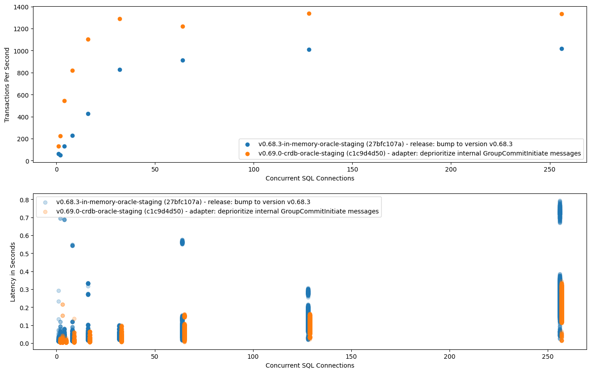
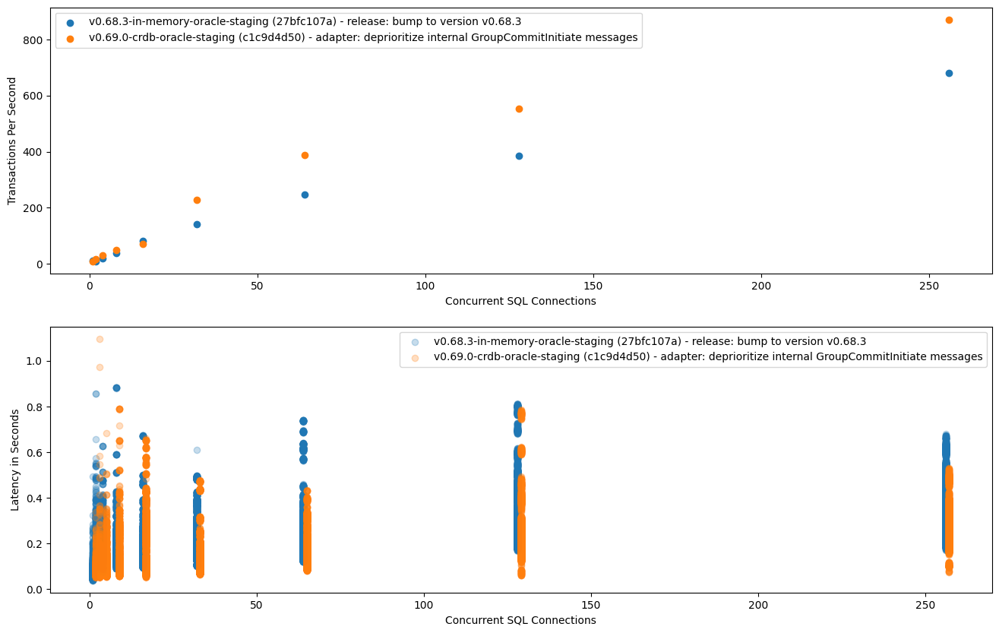
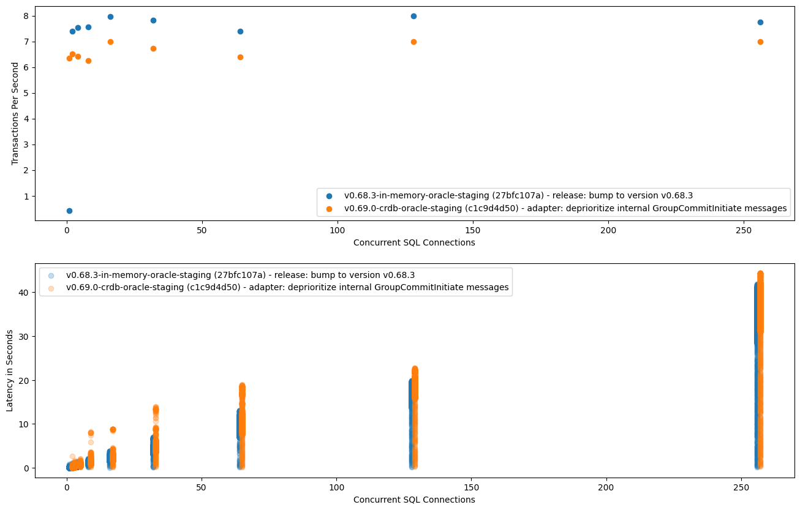

# Platform v2: Distributed/External Timestamp Oracle

## Context

As part of the platform v2 work (specifically use-case isolation) we want to
develop a scalable and isolated serving layer that is made up of multiple
processes that interact with distributed primitives at the moments where
coordination is required. In order to do that, we need to introduce strict
boundaries (APIs) between the different responsibilities of the Coordinator and
Adapter, where Adapter are those parts of the current `environmentd` process
that comprise today's serving layer.

The distributed TimestampOracle is one of these distributed primitives/APIs that
we want to extricate from the Coordinator.

Creating a distributed timestamp oracle is one of the necessary prerequisites
for the full realization of use-case isolation, but it is not sufficient. As we
will show below, though, implementing our proposal now can already improve
Coordinator/serving performance today (both for throughput and latency) and we
want to implement the necessary primitives incrementally and roll them out as
early as we can and as it makes sense. This way, we can incrementally provide
customer benefit on the path to implementing full use-case isolation.

## Goals

- implement a distributed TimestampOracle that is independent of the rest of
  Coordinator/the Catalog/state stored in Stash, such that it _could_ be
  interacted with from multiple processes concurrently
- provide the same correctness guarantees as the current timestamp oracle:
  _strict serializable_ reads/writes when requested
- don't regress in performance (latency and throughput), within _reasonable_
  bounds
- (side effect) actually improve performance (latency and throughput) for the types
  of queries that we care about in the context of use-case isolation

## Non-Goals

- the rest of the use-case isolation milestones, including an actually
  distributed serving layer
- linearization (or _strict serializable_ guarantees) around DDL beyond what we
  support currently
- getting rid of the (process-)global write lock for tables

## Overview

The [design doc for transactional
consistency](./20220516_transactional_consistency.md) describes how the
TimestampOracle is used in service of our consistency guarantees and what
requirements we have for its behavior. The oracle, as currently implemented,
cannot easily be used from multiple processes so we have to implement a
replacement for use in the distributed serving layer. Our proposal for this
replacement is a distributed TimestampOracle that uses CRDB as the backing
store.

Below, we first outline the expected behavior of any TimestampOracle (in the
context of Materialize) at a high level, then we describe the current oracle,
and finally we propose our distributed oracle. We will also examine the
implications of the new oracle for performance (both good and bad), mitigations
we have to apply so we don't regress in performance, and how we plan to roll out
this change.

> [!NOTE]
> Keep in mind that whenever we write _reads_ below we are talking about
> _linearized reads_. For serializable reads we don't need to consult the
> timestamp oracle.

## TimestampOracle state and operations

A timestamp oracle logically has to keep this state (distributed or not):

- `read_ts`: the timestamp at which to perform reads
- `write_ts`: the most recent timestamp that has been allocated for a write

And it has to provide these operations:

- `allocate_write_ts()`: Allocates a new timestamp for writing. This must be
  strictly greater than all previous timestamps returned from
  `allocate_write_ts()` and `get_read_ts()`. For a real-time oracle, we
  additionally want to make it so that allocated timestamps closely track
  wall-clock time, so we pick a timestamp that obeys both requirements.
- `peek_write_ts()`: Returns the most recently allocated `write_ts`.
- `get_read_ts()`: Returns the current `read_ts`. This must be greater than or
  equal to all previously applied writes (via `apply_write()`) and strictly less
  than all future timestamps returned from `allocate_write_ts()`.
- `apply_write(write_ts)`: Marks a write at `write_ts` as completed. This has
  implications for what can be returned from the other operations in the future.

It is important to note that these operations have to be linearized across all
interaction with the timestamp oracle, potentially from multiple processes. For
the current implementation this is easier, because we only have a single
serving-layer process. Although there is some complexity around ensuring that
there _is_ actually only one process serving queries. We will see how the
proposed distributed TimestampOracle solves this problem below.

## The current in-memory/backed-by-stash TimestampOracle

The current TimestampOracle is an in-memory, single-process oracle that relies
on the Stash for persisting the read/write timestamp. Stash is used for failure
recovery and correctness (read linearization) guarantees:

- the oracle reserves ranges of timestamps by writing a timestamp to Stash
- timestamp operations are "served" out of memory
- periodically, a higher timestamp is written to Stash to reserve more time
- there can only be one "leader" `environmentd` process, meaning one process
  that does serving work and interacts with the timestamp oracle
- the Stash is used to fence out other processes, both in case of
  failure/restart and during upgrades

The upside of this approach is that oracle operations are very fast,
essentially "free", because they are served out of memory and modify in-memory
state.

The downsides are:

- it's not (easily) possible to extend the approach to multiple processes
- at some point between getting a read timestamp and returning a result, the
  serving process has to assert that it is still the leader
- asserting leadership incurs a costly Stash transaction, through
  `confirm_leadership()`

Those last two points are subtle, but what could happen if we did not do that is:

1. old leader reserves timestamps up until t1
2. a new leader (new `environmentd` process) starts up
3. it reserves a new range of timestamps up until t2
4. a write happens at a timestamp higher than t1
5. the old leader could accidentally serve a read at a timestamp lower than t1
   -> a linearization anomaly

We will see below how doing the costly Stash transaction is amortized, making
it viable in practice, and how we have to do a similar thing to make the
distributed TimestampOracle viable.

## The proposed distributed TimestampOracle backed by CRDB

The core idea of the distributed TimestampOracle is that oracle state for a
timeline is stored in a row in CRDB. And all timestamp operations become
queries against CRDB. We outsource correctness/linearization to CRDB, which
comes with the obvious cost of doing a CRDB query for every timestamp
operation. We will see below what optimizations we have to apply to make this
approach viable and not regress performance (latency and throughput).

The backing table looks like this:

```sql
CREATE TABLE IF NOT EXISTS timestamp_oracle (
    timeline text NOT NULL,
    read_ts bigint NOT NULL,
    write_ts bigint NOT NULL,
    PRIMARY KEY(timeline)
);
```

And for completeness we also spell out all the oracle operations.

`allocate_write_ts(timeline, wall_clock_ts)`:

```sql
UPDATE
    timestamp_oracle SET write_ts = GREATEST(write_ts + 1, $wall_clock_ts)
    WHERE timeline = $timeline
    RETURNING write_ts;
```

`peek_write_ts(timeline)`:

```sql
SELECT write_ts FROM timestamp_oracle
    WHERE timeline = $timeline;
```

`get_read_ts(timeline)`:

```sql
SELECT read_ts FROM timestamp_oracle
    WHERE timeline = $timeline;
```

`apply_write(timeline, write_ts)`:

```sql
UPDATE
    timestamp_oracle SET write_ts = GREATEST(write_ts, $write_ts),
    read_ts = GREATEST(read_ts, write_ts)
    WHERE timeline = $timeline;
```

> [!NOTE]
> All of these queries go through the 1-phase commit fast path in CRDB: the
> output for `EXPLAIN ANALYZE (VERBOSE)` contains `auto commit`.

An important thing to note here is that timestamp operations are now correct by
themselves: we don't need the `confirm_leadership()` call anymore for
preventing linearization anomalies.

## Optimizations that are required to make the distributed TimestampOracle viable

As part of query processing, we perform multiple oracle operations per each
single query so simply replacing the current in-memory TimestampOracle with the
distributed TimestampOracle would not be viable: operations that were
previously "free" would now take multiple milliseconds.

The solution for this is that we have to batch oracle operations, both for read
and write queries. We will examine below how this is similar to the current
code where we perform expensive `confirm_leadership()` calls, but batch them to
amortize cost.

### Batching of `get_read_ts` operations

Currently, the pipeline for read queries (peeks, in internal parlance) looks like this:

1. peek comes in
2. determine read timestamp using `get_read_ts()`
3. render query graph and send off to compute
4. wait for results from compute
5. when results are ready add them to a `pending_peek_results` buffer
6. whenever we are not busy and have pending query results: perform
   `confirm_leadership()` and send results back to client

The salient points here are that the oracle operations in step #2 are "free",
so we are doing one oracle operation per peek, and that the
`confirm_leadership()` operation of step #6 translates to a CRDB transaction,
which is expensive. Batching up those pending results and doing a single
`confirm_leadership()` operation is what makes this approach viable.

We have to do a similar optimization for the distributed TimestampOracle but
instead of batching up results for `confirm_leadership()` we need to batch up
incoming peeks and determine a timestamp for multiple peeks using one oracle
operation. We can do this because the distributed TimestampOracle operations
provide linearization in and of themselves and we no longer need the
`confirm_leadership()` operation.

The modified pipeline for peeks will look like this:

1. peek comes in
2. add peek to `pending_peeks`
3. whenever we are not busy, determine a read timestamp for all pending peeks
   using `get_read_ts()`
4. render query graph and send off to compute
5. wait for results from compute
6. when results are ready, immediately send back to client

Looking at a processing trace for a single peek, we see that we are doing
roughly the same work but at different moments in the pipeline. Additionally,
the oracle `get_read_ts()` will be ever so slightly faster because it is a
simple read query instead of a write transaction as we have to do for
`confirm_leadership()`.

### Batching of `allocate_write_ts` operations

Each write query needs at least an `allocate_write_ts()` and an `apply_write()`
operation. We already have the concept of a _group commit_ for batching
multiple incoming write queries together, see the [design doc for transactional
consistency](./20220516_transactional_consistency.md). This makes it so that we
a) need to perform fewer table writes, and b) have to do fewer timestamp
operations. With the current in-memory TimestampOracle this is a nice
optimization but with the distributed TimestampOracle it becomes necessary
because, again, timestamp operations become much more expensive than "free".

We mention this here because the way the coordinator main loop is currently
structured we barely batch up any writes, meaning the optimization doesn't
work. This becomes more apparent with the distributed TimestampOracle. Before
enabling the distributed TimestampOracle we therefore have to make sure that
batching of write operations into group commits works as expected.

## Optimizations that are enabled by the distributed TimestampOracle

The current in-memory TimestampOracle is not easily shareable (even amongst
threads/tasks) and the `confirm_leadership()` operation has to be performed "on
the coordinator main loop". The new durable TimestampOracle will not have these
limitations: it can be shared within a process and by multiple processes. This
will enable some optimizations, even before we implement more of the use-case
isolation milestones.

> [!NOTE]
> Some of these optimizations could be achieved by restructuring/reworking the
> existing abstractions, but we get them "for free" with the distributed
> TimestampOracle.

### Removal of `confirm_leadership()` for linearized reads

The distributed TimestampOracle is self-contained and relies on CRDB for
linearizability. We therefore don't need the `confirm_leadership()` operations
anymore. These operations were a) "costly", and b) were blocking the
coordinator main loop. Removing both of these will improve both latency and
throughput for user queries because the coordinator is now free to do other
work more often.

### Moving TimestampOracle operations off the Coordinator main loop

Because the distributed TimestampOracle is easily shareable, we can move the
`get_read_ts()` operations (and possibly other operations as well) off the
coordinator main loop, again chipping away at things that block said main loop.
Which will again improve latency and throughput.

## Implementation

We will not go into implementation details but instead list all sub-tasks such
that someone sufficiently familiar with the involved parts of the code base
will be able to understand the required work.

1. Extract an object-safe TimestampOracle trait: During rollout we will keep
   both the legacy TimestampOracle and the new distributed TimestampOracle and
   have a LaunchDarkly (LD) flag for switching between them. We therefore need
   to abstract the concrete implementation away from the code that uses
   oracles.
2. Extract an `mz_postgres_client` from the persist postgres Consensus impl: We
   will re-use the code that persist already has for interacting with
   Postgres/CRDB using a thread pool.
3. Implement new distributed TimestampOracle backed by CRDB: This uses the
   previously extracted `mz_postgres_client` and implements the previously
   extracted TimestampOracle trait.
4. Add optimization for batching `get_read_ts()` calls for pending peeks: We
   can only do this optimization when the new oracle is used, because the
   in-memory one is not easily shareable.
5. Add optimization for batching write queries: That is, make group commit
   batching more aggressively
6. Add temporary code where on bootup we pick the highest timestamp of all
   oracles to initialize the configured oracle: We need this while still in the
   rollout phase, such that we can switch between oracle implementations when
   needed. More on this in Rollout, below.
7. Add LD machinery for switching between oracle implementations.
8. Expose new metrics (which we added where required, in the above tasks) in
   relevant Grafana dashboards.

Intermission: We eventually flip the switch and enable the new oracle in
production. See Rollout below.

9. Remove `confirm_leadership()` call.
10. Remove now-unused in-memory TimestampOracle.
11. Various further refactorings that we can do now that _all_ oracle
    implementations are (easily) shareable: We will put the oracle behind an
    `Arc<dyn TimestampOracle>`. We will move the oracle code out into it's own
    crate, if we didn't manage to do that before because of dependency
    shenanigans.

## Observability

We will get observability for the thread-pool-enabled Postgres client by
relying on `mz_postgres_client`, which we extracted from the persist Consensus
implementation. We do, however, have to add specific metrics for the timestamp
oracle itself such that we can observe:

- number of timestamp operations, per operation type: this way, we can see
  whether batching (both for read and write queries) is working as expected
- latency histogram per operation type
- depending on whether we perform retries inside the TimestampOracle
  implementation itself, we also want to add metrics for the number of
  failed/succeeded postgres operations

## Rollout

We will make the TimestampOracle implementation configurable using LaunchDarkly
and roll the distributed oracle out to first staging and then production. The
existing metrics around query latency plus the new metrics for the oracle
itself will allow us to detect any bad performance impact. Additionally, we
will use the `test/scalability` framework to test performance (latency and
throughput) and compare the distributed TimestampOracle to the in-memory one.
See also Appendix A for benchmark results from our current code/oracle
implementation.

One detail is that we put code in place such that we can switch back and forth
between the oracle implementations, as a safety precaution. This is the reason
why we need to leave the `confirm_leadership()` operation in place, even when
using the new distributed TimestampOracle. If we did not do that, we could
produce linearization anomalies when switching in either direction.

Only once we have switched production over to the distributed TimestampOracle
and once we are certain that we do not have performance regressions will we
remove the in-memory TimestampOracle and apply the last refactorings and code
cleanups that this enables.

## Alternatives

### Keep the current TimestampOracle in the singleton Coordinator process

We could keep relying on Stash for storage and on the singleton Coordinator
process fencing out other processes. We would also have to keep doing a
`confirm_leadership()` at some point before returning query results.

The distributed serving-layer processes would do timestamp operations via RPC to
the Coordinator.

### Add a separate (highly available) TimestampOracle service

We would essentially pull the current in-memory/backed-by-stash implementation
out into it's own service that clients talk to via (g)RPC. However, we can
either accept that it is not highly available or we would have to do work that
is similar to the current `confirm_leadership()` checks to ensure that operations
return a linearizable timestamp. Operating a distributed, highly available
service is hard, and by using CRDB (our main proposal) we delegate the hard work
to that. Plus, we don't want to be operating yet more services as part of a
customer deployment.

## Open questions

### What SQL type to use for the read/write timestamp?

- `bigint`, so a rust `i64`: This goes until `+9223372036854775807`, which is
  roughly `AD 292278994`.
- `timestamp`, which goes until `AD 294276`. This would give us microsecond
  resolution so we could squeeze in more than 1000 timestamps per second (which
  is what we currently get), if we ever wanted to.

When using a `timestamp` datatype, we would use `interval` types for our
arithmetic, and we could even use `now()` instead of passing in the wall-clock
time, though that latter part is not needed:

```sql
UPDATE
    timestamp_oracle SET write_ts = GREATEST(write_ts + '1 millisecond', now()::timestamp)
    WHERE timeline = $timeline
    RETURNING write_ts;
```

Preliminary tests on a M1 Max Macbook with an in-memory CRDB deployment in
Docker show no discernible difference for the different data types, which makes
sense because their execution plans are largely the same and query execution
time is dominated by reading from and writing to the underlying KV storage.

### A separate TimestampOracle for syncing Catalog state?

In the future, multiple serving-layer processes listen to differential changes
to Catalog state and we have to have a method for knowing if we are up to date.
We can either use a `ReadHandle::fetch_recent_upper()` that guarantees
linearizability, _or_ we could use a TimestampOracle.

If we use a TimestampOracle, we could either use a completely separate oracle
for Catalog state or we could re-use the TimestampOracle that we use for the
real-time timeline but add another time dimension to it. For example, `read_ts`
would become `(table_read_ts, catalog_read_ts)`.

The benefit of the multi-dimensional timestamps approach is that we need fewer
oracle operations and that the timestamps that are mostly used together are
stored in one CRDB row. However, it does not provide good separation/doesn't
seem a good abstraction. Additionally, we would have to make that call now or
add the second dimension later, with a migration. The risk with adding this now
is that we might find out later that we added the wrong thing.

Storing Catalog timestamps in a separate oracle seems like the right
abstraction but we have to make more oracle operations. The good thing is that
timestamp operations can be pipelined/we can make requests to both oracles
concurrently. It _does_ mean, however, that a single read now needs two oracle
operations: one for getting the Catalog `read_ts` and one for getting the
real-time `read_ts`.

I'm proposing that we store the Catalog timestamp in a separate
TimestampOracle, if we decide to use oracles at all.

## Appendix A - Benchmark Results

Here we have a comparison between the in-memory TimestampOracle and the new
distributed TimestampOracle. For both of these, the `test/scalability`
benchmarks were executed against my staging environment. For the distributed
TimestampOracle, I have a PoC-level branch that implements the oracle and all
the required/enabled optimizations mentioned above, which I manually deployed
to my environment.

For both peeks and inserts, performance (throughput and latency) is better when
using the distributed TimestampOracle because we block the coordinator loop
less _and_ because the oracle operations are cheaper than the
`confirm_leadership()` operation, which we are not doing anymore with that
oracle.

For updates, performance is worse with the distributed oracle, because
`apply_write()` is now a CRDB operation where previously it was an in-memory
operation. Updates are a particularly bad case because all updates are
serialized by the (process) global write lock, so we pay the full CRDB overhead
_per_ update query and cannot amortize the costs.

### Peek/Select



### Insert



### Update


