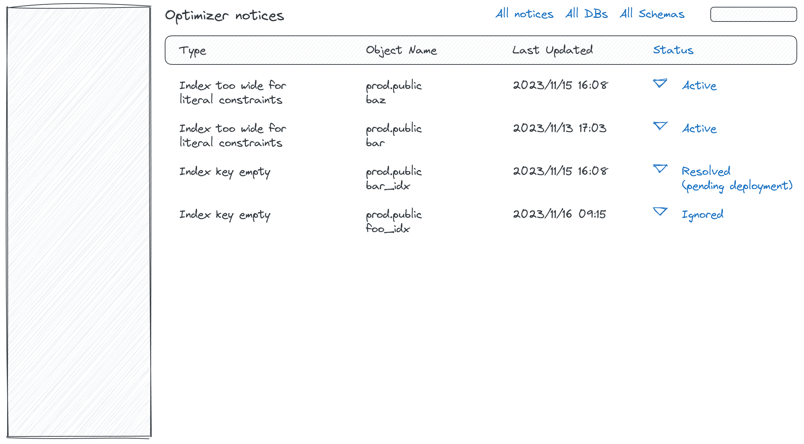
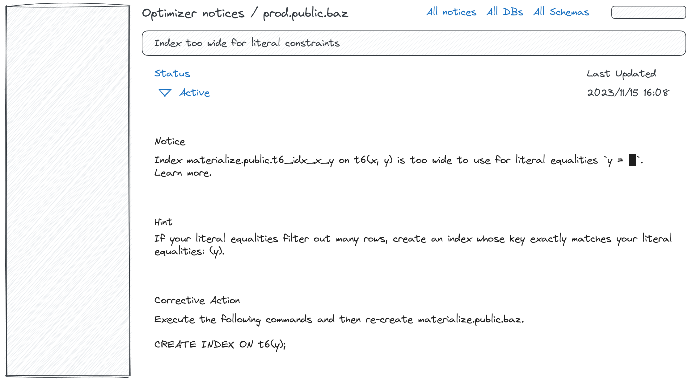

# Catalog tables for Optimizer Notices

- Associated:
  - MaterializeInc/database-issues#6468 (part of MaterializeInc/console#549)
  - MaterializeInc/database-issues#5916 (add `redacted_..._sql` columns to system catalog)

<!--
The goal of a design document is to thoroughly discover problems and
examine potential solutions before moving into the delivery phase of
a project. In order to be ready to share, a design document must address
the questions in each of the following sections. Any additional content
is at the discretion of the author.

Note: Feel free to add or remove sections as needed. However, most design
docs should at least keep the suggested sections.
-->

## The Problem

<!--
What is the user problem we want to solve?

The answer to this question should link to at least one open GitHub
issue describing the problem.
-->

Currently, the optimizer collects and emits notices as a by-product of
sequencing or bootstrapping `CREATE MATERIALIZED VIEW` and `CREATE INDEX`
statements. In order to see a notice, the user has to either:

1. use `psql` (or a compatible client) when executing a `CREATE` statement, or
2. look at the `EXPLAIN PLAN` output for the created catalog items.

Applications that want to expose optimizer notices are also stuck with these two
choices, making it hard to integrate them in the console UX. In order to lay the
foundations for both future UX work and for adding more optimizer notice types
(including types not related to a single catalog item) in this document we
propose:

1. A catalog schema for keeping track of optimizer notices.
2. A vision of how the schema can be integrated into a console-based UX.
3. A vision of how we will add support for more notice types in the backend.

Some critical (but not obvious at first glance) associated problems that are
addressed by necessity in this design doc are stated below.

### SOC2 Compliance

Some of the notices print literal constraints appearing in the

```sql
CREATE MATERIALIZED VIEW AS <query>
CREATE VIEW AS <query>
```

statements. Since literal constrains appearing in these statements are
[classified as "Customer Data"][data_mgmt_policy], we should obfuscate those in
`redacted_~` columns similarly to the `redacted_create_sql` columns proposed in
MaterializeInc/database-issues#5916.

### Notice state transitions

**Note**: Issues related to this section are out of scope for the MVP.

Most of the notices will suggest a concrete corrective action that resolves
them. However, teaching the system to automatically recognize when a corrective
action was taken has some challenges. For example, in a blue-green setup,
notices based on production objects should not be handled directly and instead
should be resolved in the current development environment.

The proposed design therefore assumes that the console UX will provide workflows
where users will explicitly transition the state of a specific notice (similar
to workflows on issue tracking websites such as Jira or GitHub).

### Lifespan issues

**Note**: Issues related to this section are out of scope for the MVP.

Even though not all optimizer notices will be scoped to a catalog entry (a
materialized view or an index), for those that are we run into the following
lifespan issue.

On the one hand, the lifespan of the notice corresponds to the lifespan of the
dataflow backing the catalog entry that produced that notice. This is the case
because (a) we re-optimize dataflow-backed catalog entries on every
`environmentd` restart, and (b) the notice might disappear or change when we
re-optimize the entry due to changes in the optimizer code or in the catalog
state.

On the other hand, for a frictionless UX we should be able to remember a user's
decision to ignore noisy notices across `environmentd` restarts.

Consequently, the lifespan of an "ignored notice" should outlive multiple
incarnations of the same notice caused by `environmentd` restart or
user-initiated re-creation of the associated catalog entry.

## Success Criteria

<!--
What does a solution to this problem need to accomplish in order to
be successful?

The criteria should help us verify that a proposed solution would solve
our problem without naming a specific solution. Instead, focus on the
outcomes we hope result from this work. Feel free to list both qualitative
and quantitative measurements.
-->

Stakeholders have agreed on:

1. The primary use cases and UX workflows that the schema will facilitate.
2. The design of a catalog schema that contains the optimizer notices
   corresponding to the current catalog state.
3. The design of code that will maintain the contents of that schema at runtime,
   including the mechanisms used to align the externally set notice status with
   the internal system state.

## Out of Scope

<!--
What does a solution to this problem not need to address in order to be
successful?

It's important to be clear about what parts of a problem we won't be solving
and why. This leads to crisper designs, and it aids in focusing the reviewer.
-->

1. Design details about the actual console UX beyond basic wireframe diagrams.
2. Implementation details about the integration path for optimizer notices
   associated with `SELECT` queries (although the design should have at least
   some idea how these will work out).
3. Implementation details about the mechanisms that we are going to adopt in
   order to implement notice lifecycle management in a way that will be able to
   survive environmentd restarts and DDL re-runs. This will be covered by a
   future design revision if product decides that state management is a feature
   that our customers want to see.

## Solution Proposal

<!--
What is your preferred solution, and why have you chosen it over the
alternatives? Start this section with a brief, high-level summary.

This is your opportunity to clearly communicate your chosen design. For any
design document, the appropriate level of technical details depends both on
the target reviewers and the nature of the design that is being proposed.
A good rule of thumb is that you should strive for the minimum level of
detail that fully communicates the proposal to your reviewers. If you're
unsure, reach out to your manager for help.

Remember to document any dependencies that may need to break or change as a
result of this work.
-->

3. [Console UX and Workflows](#console-ux-and-workflows) sketches the main UX
   workflows that the current design aims to support.
1. [Catalog Schema](#catalog-schema) section describes the design of a catalog
   schema that contains the optimizer notices corresponding to the current
   catalog state.
2. [Notice Generation and Management](#notice-generation-and-management)
   elaborates how notices are generated and managed by the optimizer and adapter
   code in order to keep the contents of the proposed catalog schema maintained
   at runtime, including the mechanisms used to align the (externally visible)
   status attached to a notice with the internal system state.

### Console UX and Workflows

This section contains wireframe diagrams that illustrate the console UX and
workflows that will be supported by the proposed notices schema. Each wireframe
links to [an Excalidraw scene][excalidraw_sources] which contains the wireframe
sources and supports leaving comments directly on the diagram.

Parts highlighted in blue color are not going to be part of the MVP.

#### Listing all Notices



- For the MVP, all notices will be listed in a single page. In the future, we
  can have scoped versions of this view as a tab on the clusters page.
- The customer will be able to change the status of a notice directly from the
  list view:
  - A notice marked as "resolved" indicates that the customer has performed the
    suggested corrective correction. This does not imply that the notice is
    already resolved, but that we expect this to happen once the related catalog
    objects have been (re-)created.
  - A notice marked as "ignored" indicates that the user considers it irrelevant
    or low priority and they don't want to see it in the foreseeable future.
- The page will contain an extra filter dropdown that will allow customers to
  filter out notices with a certain status:
  - hide ignored and resolved - probably this should be the default,
  - hide ignored - probably most useful for field engineers using the
    impersonated console,
  - show all.

#### Inspecting a Notice



- The _Notice_ and the _Hint_ sections correspond to what is currently rendered
  in the `EXPLAIN` output. In addition, the detailed view contains a _Corrective
  Action_ statement which contains concrete instructions that will resolve the
  issue. If possible, the corrective action is given as a concrete SQL snippet,
  otherwise it is a valid markdown string.
- Literals referenced in the `notice`, `hint`, and `action` fields are redacted
  (replaced by █) unless the feature is used by a Materialize superuser.
- Every detailed view has a "Learn more" link below the notice section that
  references the public docs for this notice type. The notice docs are
  structured similar to [the Rust error codes page][rust_error_codes] and will
  provide more context, a minimal reproducing example, and a corrective action
  for the example for each notice type for customers that want to understand
  where and why a specific notice is emitted.

### Catalog Schema

As part of the feature we will add the following builtin objects to
`mz_internal`.

#### `mz_optimizer_notices`

Optimizer notices are exposed through a new `BuiltinTable` that contains an
unfiltered list of all optimizer notices emitted by the optimizer when planning
materialized views and indexes. The table contents are [maintained directly by
the adapter](#notice-generation-and-management). The table has the following
schema.

| Field                   | Type                         | Meaning                                                                                                                                           |
| ----------------------- | ---------------------------- | ------------------------------------------------------------------------------------------------------------------------------------------------- |
| `notice_type`           | `text`                       | The notice type. Each type will correspond to a Materialize docs sub-page.                                                                        |
| `message`               | `text`                       | A brief description of the issue highlighted by this notice.                                                                                      |
| `hint`                  | `text`                       | A high-level hint that tells the user what can be improved.                                                                                       |
| `action`                | `text`                       | A concrete action that will resolve the notice.                                                                                                   |
| `redacted_message`      | `text`                       | A redacted version of the `message` column. `NULL` if no redaction is needed.                                                                     |
| `redacted_hint`         | `text`                       | A redacted version of the `hint` column. `NULL` if no redaction is needed.                                                                        |
| `redacted_action`       | `text`                       | A redacted version of the `action` column. `NULL` if no redaction is needed.                                                                      |
| `action_type`           | `text`                       | The type of the `action` string (`sql_statements` for a valid SQL string or `plain_text` for plain text).                                         |
| `object_id`             | `text`                       | The ID of the materialized view or index. Corresponds to [`mz_objects.id`](../mz_catalog/#mz_objects). For global notices, this column is `NULL`. |
| `dependency_ids`        | `text list`                  | A list of dependency IDs that need to exist for this notice to be still valid. Corresponds to [`mz_objects.id`](../mz_catalog/#mz_objects).       |
| `created_at`            | `timestamp with time zone`   | The time at which the notice was created.                                                                                                         |
| `updated_at`            | `timestamp with time zone`   | The time at which the notice was last updated.                                                                                                    |
| `fingerprint`           | `uuid`                       | A fingerprint for this notice computed in a way that survives re-creation of all associated objects using identical DDL statements.               |

<!--
The `(object_id, dependency_ids, message, hint)` tuple is a natural key of relation modeled by `mz_notices`.
-->

#### `mz_notices`

The data from `mz_optimizer_notices` table is integrated into a `mz_notices` view
which has identical schema and in the long run is meant to be defined as
follows:

```sql
notices_part_1 UNION ALL
notices_part_2 UNION ALL
...
notices_part_n
```

where each of the `n` inputs corresponds to a catalog entry that provides
notices managed by a different subsystem (optimizer, sources and sinks,
adapter). At the moment, however, the view is defined with `n = 1` and only
selects from `mz_optimizer_notices`.

#### `mz_ignored_optimizer_notices`

**Note**: this section is out of scope for the MVP.

A new `BuiltinSource` used to keep track of ignored notices. Because of the
`fingerprint` characteristics ignored notices will continue to be ignored even
if we re-create the objects associated via `object_id` and `dependency_ids` as
long as we use identical DDL statements.

### Notice Generation and Management

#### Notice Generation

An optimizer pass produces a vector of notices as a side effect of an
optimization run. In order to persist those notices in
`mz_optimizer_notices` we need to be able to emit retractions for a
previously inserted notice (for example when we delete the associated catalog
item). However, the notice structure of the notices generated by the optimizer
is not suitable for emitting retractions - for example:

1. It doesn't have an optional `created_at` field.
2. Some of the text fields need to be resolved against catalog items that might
   be renamed or removed in the meantime.

In order to protect ourselves against invalid retraction issues arising from
these problems we make a distinction between the notice type produced by the
optimizer (`RawOptimizerNotice`) and the notice type stored in the
`CatalogPlans` struct (`OptimizerNotice`).

Further, the type of the notices stored in `DataflowMetainfo::optimizer_notices`
depends on the execution stage - within the optimizer we still need to use
`RawOptimizerNotice`, but before storing the final result in the `CatalogPlans`
struct we need to move to a `OptimizerNotice` vector (done with a
`CatalogState::render_notices` call). We use the `CatalogPlans` entries to
generate insertions and deletions in the `mz_optimizer_notices` table.

Also, since we expect to have more than two notice types in the long term, we
reorganize the code a bit so adding a new notice is easier in the future. The
required steps are as follows:

1. Create a `mz_transform::notice::<notice_type>` submodule.
2. Define a struct for the new notice in that module.
3. Implement `OptimizerNoticeApi` for that struct.
4. Re-export the notice type in `mz_transform::notice`.
5. Add the notice type to the `raw_optimizer_notices` macro which generates the
   `RawOptimizerNotice` enum and other boilerplate code.

#### `mz_optimizer_notices` maintenance

Notices associated with an `object_id` or `dependency_ids` are immediately
removed from the `BuiltinTable` when the associated catalog entry is deleted. We
install a `CatalogState::pack_optimizer_notices` helper that is

- Called with `diff = 1`:
  - In `Coordinator::bootstrap` for each re-hydrated materialized view and index.
  - In `Coordinator::sequence_create_materialized_view` for new entries.
  - In `Coordinator::sequence_create_index` for new entries.
- Called with `diff = -1`:
  - For each `id` in `drop_ids` towards the end of `Catalog::transact`.

#### `mz_ignored_optimizer_notices` maintenance

**Note**: this section is out of scope for the MVP.

The design here follows the pattern adopted by MaterializeInc/materialize#21379.

The `BuiltinSource` is maintained by API extensions in the `StorageController`
in the `sequence_~` methods handling the [SQL syntax
extensions](#sql-syntax-extensions) proposed below:

- A SQL statement that marks a notice as ignored results in an insertion added
  to the source.
- A SQL statement that marks a notice as no longer ignored results in a
  retraction added to the source.

#### SQL syntax extensions

**Note**: this section is out of scope for the MVP.

In order to support the ability to ignore notices as advertised in the [Listing
all Notices](#listing-all-notices) diagram we need a SQL extensions to be wired
with the console dropdown. To facilitate this we propose the following syntax:

```sql
ALTER NOTICE <fingerprint> SET STATUS = '<status>';
ALTER NOTICE <fingerprint> RESET STATUS;
```

The new SQL command will translate into changes into the base tables
contributing to [`mz_notices`](#mz_notices). In order to do
that, we will extend the `Coordinator` with `sequence_` method that handle the
corresponding plan type as follows:

- If the status is `new` or we have a `RESET` plan:
  - Update the notice in the `CatalogPlans` in-memory state.
  - Change the `mz_optimizer_notices` entry.
  - Remove the `<fingerprint>` entry from `mz_ignored_optimizer_notices`.
- If the status is `resolved`:
  - Update the notice in the `CatalogPlans` in-memory state.
  - Change the `mz_optimizer_notices` entry.
  - Remove the `<fingerprint>` entry from `mz_ignored_optimizer_notices`.
- If the status is `ignored`:
  - Add a `<fingerprint>` entry to `mz_ignored_optimizer_notices`.

## Minimal Viable Prototype

<!--
Build and share the minimal viable version of your project to validate the
design, value, and user experience. Depending on the project, your prototype
might look like:

- A Figma wireframe, or fuller prototype
- SQL syntax that isn't actually attached to anything on the backend
- A hacky but working live demo of a solution running on your laptop or in a
  staging environment

The best prototypes will be validated by Materialize team members as well
as prospects and customers. If you want help getting your prototype in front
of external folks, reach out to the Product team in #product.

This step is crucial for de-risking the design as early as possible and a
prototype is required in most cases. In _some_ cases it can be beneficial to
get eyes on the initial proposal without a prototype. If you think that
there is a good reason for skipping or delaying the prototype, please
explicitly mention it in this section and provide details on why you you'd
like to skip or delay it.
-->

A prototype of the backend part of the design proposed above can be found in
[#23360](https://github.com/MaterializeInc/materialize/pull/23360).


The current prototype does not implement the following parts of the proposed design:

1. The [`mz_ignored_optimizer_notices`](#mz_ignored_optimizer_notices) builtin
   source.
2. Filtering based on `fingerprint` in the [`mz_notices`](#mz_notices).
4. The proposed [SQL syntax extensions](#sql-syntax-extensions).


### RBAC handling

Currently, `Builtin` objects are created with a `sensitivity` field that
is assigned a `DataSensitivity` value.

```rust
/// The extent to which data in a builtin object
/// should be considered "sensitive" and therefore
/// access to it restricted.
#[derive(Clone, Debug, Hash, Serialize)]
pub enum DataSensitivity {
    /// Any user may query the object.
    Public,
    /// Superusers or Materialize staff may query the object.
    SuperuserAndSupport,
    /// Only superusers may query the object.
    Superuser,
}
```

Some of the builtin objects proposed in the [Catalog Schema](#catalog-schema)
(such as `mz_optimizer_notices`) are only meant to store raw data and
support the construction of user-facing builtin views. Those can be all defined
with sensitivity `DataSensitivity::Superuser`.

For the MVP, we decided to go with a combination of a `Superuser` and
`SuperuserAndSupport` policies where:

- `mz_optimizer_notices` uses `Superuser`.
- `mz_optimizer_notices_redacted` uses `SuperuserAndSupport`. The view is redacted by
  re-binding `~` to `redacted_~`.

This means that.

- ☑ All notices will be only to superusers.
- ☑ All notices will be only to Materialize support engineers.
- ☑ The design is SOC2 compliant.
- ☒ Regular users and will see redacted hints by default and might require
  assistance from a superuser if there are ambiguities.

Discussed Alternatives can be found in [the alternatives
section](#rbac-handling-alternatives).

In the long term, we will most probably adopt the dedicated roles mechanism
proposed by MaterializeInc/database-issues#7261 in order to allow admins to grant
read access to other users.

<!--
### Notes:

- `Catalog::open` returns a `builtin_table_updates` vector.
- The vector is then moved to the `Coordinator::bootstrap` call.
- The `bootstrap` method than calls `Coordinator::send_builtin_table_updates_blocking`.
  - Luckily for us this happens after the `for entry in &entries` loop.
  - Call sites:
    - `Coordinator::bootstrap`.
    - `Coordinator::catalog_transact_with`.
    - `Coordinator::add_active_subscribe`.
    - `Coordinator::remove_active_subscribe`.
- The code in `builtin_table_updates.rs` handles update generation.
  - For example see `CatalogState::pack_materialized_view_update`.
    - Called by `CatalogState::pack_item_update`.
      - Called in `Catalog::transact_inner`.
      - Called in `Catalog::transact_alter_set_cluster`.
      - Called in `Catalog::open`.
- Should the design be i18n-ready?
  - We cannot do that at the moment because we need to write fully-resolved notices to the tables.
- When do we call `OptimizerNotice::to_string()`?
  - When writing in the `mz_internal` table?
    - We are kind of forced to do it like that at the moment.
  - When reading from the `mz_internal` table?
    - This can be quite tricky to achieve.
-->

## Alternatives

<!--
What other solutions were considered, and why weren't they chosen?

This is your chance to demonstrate that you've fully discovered the problem.
Alternative solutions can come from many places, like: you or your Materialize
team members, our customers, our prospects, academic research, prior art, or
competitive research. One of our company values is to "do the reading" and
to "write things down." This is your opportunity to demonstrate both!
-->

There are no fundamentally different architectures, but several places of the
outlined proposal can be implemented in a different way. Those are listed here
along with reasons why we opted for the current design.

### Eager cleanup of notices when a dependency is deleted

There is a design choice in how to ensure that notices that are no longer valid
don't show up in `mz_optimizer_notices`. A notice is no longer valid when
either its dependant `object_id` or one of its `dependency_ids` disappears.

We can maintain this in two ways:

1. In the adapter by emitting retractions for notices whenever the associated
   catalog object is deleted. At the moment we do this for `object_id`.
2. In the view maintenance DDL by filtering out `mz_optimizer_notices`
   entries that are not present in `mz_objects`. At the moment we do this for
   `dependency_ids`.

This asymmetry is a bit odd. In the long term we should handle both cases in the
same way unless there are some very good reasons against that.

### More efficient `notice_type` and `action_type` fields

We can change the type of these fields to be `int` instead of `string` and
define auxiliary `BuiltinTable` sources that are populated with the currently
available sources on startup.

The current design is simpler and optimizes for speed of delivering the MVP.
This alternative is a performance optimization that can be done as a follow-up
if needed.

### RBAC handling alternatives

Besides the accepted [RBAC handling](#rbac-handling) alternative, we have
considered the following two options.

1. Use `DataSensitivity::Public` everywhere.
   - ☑ All notices will be visible to all Materialize users.
   - ☒ The `mz_notices` view might leak information about DDL
     statements in the text fields of notices scoped to these statements (for
     example the `hint` text might leak a literal constraint from a `WHERE`
     clause for a `CREATE MATERIALIZED VIEW` statement).
2. Use `DataSensitivity::SuperuserAndSupport` everywhere.
   - ☑ All notices will be visible to all Materialize users.
   - ☒ Notices will be visible to non-superuser customers only from the UX which
     will run SQL queries under the `mz_support` user for everybody.
   - ☒ The UX might leak information by listing notices for catalog items that
     are not owned by the current user with the same implications as above.

## Open questions

<!--
What is left unaddressed by this design document that needs to be
closed out?

When a design document is authored and shared, there might still be
open questions that need to be explored. Through the design document
process, you are responsible for getting answers to these open
questions. All open questions should be answered by the time a design
document is merged.
-->

What to use to compute the `fingerprint`?
1. `GlobalID` values (survive restarts but not DDL evolution).
2. Names of objects (ultimately they are also subject to change).
3. Alpha-equivalent versions of the create SQL.
4. Re-associating once an object has been re-created (REPLAN) would render the
   first two of the above alternatives useless.

---

If we use an extra `BuiltinSource` for the fingerprints of ignored statements,
how are we ensure that we periodically clean up the ignored table?

---

Why not save the notices in a `BuiltinTable`?

### Changes required for Platform V2

The current design is in general compatible with the "Platform V2" effort, but
the implementation will need to be adapted.

More specifically, in Platform V2 we expect to have multiple `coordd` instances
that will hydrate identical in-memory version of the persisted catalog. DDL
statements will be routed to one of the available `coordd` instances which will
act as a leader and perform the catalog transaction. Follower instances will get
notified about the catalog change and will have to react to an `Op`
corresponding to a new materialized view or index entry by populating their
internal memory structures with identical copies of the catalog plans and
associated notices. In terms of `BuiltinTable` maintenance, however, follower
instances will have to be careful not to emit insertions or retractions against
[`mz_optimizer_notices`](#mz_optimizer_notices).


[rust_error_codes]: https://doc.rust-lang.org/stable/error_codes/
[data_mgmt_policy]: https://docs.google.com/document/d/1eC-BxjNK52zRkVgvvEjdl-OU-Hyfp1Th
[excalidraw_sources]: https://app.excalidraw.com/o/6NqJ5ikTEpv/6buoyYIj8it
