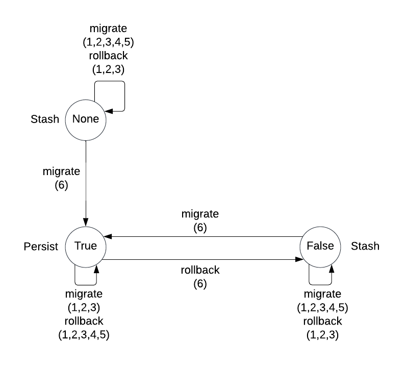
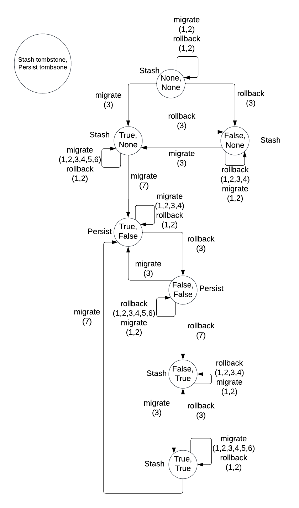

# Catalog Backend Migration

- Associated: https://github.com/MaterializeInc/database-issues/issues/6310
- Associated: https://github.com/MaterializeInc/database-issues/issues/6762

## The Problem

Currently, we persist all users catalog data in the stash. We would like to move all of that data
to Persist. This will have the following benefits:

- A step towards architecting a shareable catalog that will contribute to use case isolation.
- Reduced operational overhead related to maintaining the stash. Note, the overhead is not
  completely removed because the storage controller still uses the stash.

## Success Criteria

All user catalog data is stored in Persist.

## Out of Scope

- Fully shareable differential catalog.
- Use case isolation.
- Zero downtime upgrades.

## Solution Proposal

### Config Collection

The config collection is a subset of catalog data that can never be migrated. As a consequence, this
data can be read before the catalog is fully opened and can be used to bootstrap an environment. The
config collection has keys of type `String` and values of type `u64`. Booleans can be modeled using
this collection by storing a `0` for `false` and `1` for `true`. This proposal will add a key called
`tombstone`, with a boolean value that indicates if a specific catalog backend is retired. A value
of `false` means that the backend is not retired (i.e. is still in use) and a value of `true` means
the backend is retired (i.e. is not still in use).

### Epoch Fencing

The catalog durably stores a fencing token called the epoch. All catalog writers and readers also
store an in-memory epoch. When a new writer or reader connects to the catalog they store the
previous epoch plus one in memory and persist this new value durably. Every time a reader or write
performs a read or write, they compare their in-memory token with the persisted token, and if
there's a difference, the operation fails. As a result, whenever a reader/write increments the epoch
durably, they are effectively fencing out all previous readers/writers.

### Catalog Open

Opening a catalog involves the following two steps:

1. Increment the epoch.
2. Either initialize the persisted catalog state if it's uninitialized, or migrate the data format
   if there are any migrations, otherwise do nothing.

### Migrate From Stash to Persist

Below are the steps to migrate from the stash to persist.

1. Open the stash catalog.
2. Open the persist catalog.
3. If the stash tombstone is `true`, then we're done.
4. Read stash catalog snapshot.
5. Replace the contents of the persist catalog with the stash catalog snapshot.
6. Set the stash tombstone to `true`.

### Rollback From Persist to Stash

Below are the steps to rollback from persist to the stash.

1. Open the stash catalog.
2. Open the persist catalog.
3. If the stash tombstone is `false` or doesn't exist, then we're done.
4. Read persist catalog snapshot.
5. Replace the contents of the stash catalog with the persist catalog snapshot.
6. Set the stash tombstone to `false`.

NOTE: Steps (5) and (6) can be done as a single write as a performance optimization.

### States

Below is a table describing all possible states of the stash tombstone and what they
indicate about where the source of truth catalog data is located.

| Stash Tombstone | Source of Truth | Explanation                                                                 |
|-----------------|-----------------|-----------------------------------------------------------------------------|
| None            | Stash           | Migration has never fully completed.                                        |
| Some(true)      | Persist         | Migration has completed successfully or rollback crashed before completing. |
| Some(false)     | Stash           | Rollback has completed successfully or migration crashed before completing. |

### State Transitions

Below is a state transition diagram that shows all possible states of the stash tombstone and how
the states transition. Each node has the value of the stash tombstone. Each edge indicates what
steps from the algorithm above triggers that specific state transition. Next to each node is either
`Stash` if the stash is the source of truth, or `Persist` if persist is the source of truth.

## Alternatives

Below is a similar algorithm that uses two tombstone values, one in persist and one in the stash.
Some may find that the individual states are slightly easier to reason about, but the state
transitions are harder to reason about.

### Migrate From Stash to Persist

Below are the steps to migrate from the stash to persist.

1. Open the stash catalog.
2. Open the persist catalog.
3. Set the stash tombstone to `true`.
4. If the persist tombstone is `false`, then we're done.
5. Read stash catalog snapshot.
6. Write catalog snapshot to persist.
7. Set the persist tombstone to `false`.

NOTE: Steps (6) and (7) can be done as a single compare and append operation as a performance
optimization.

### Rollback From Persist to Stash

Below are the steps to rollback from persist to the stash.

1. Open the stash catalog.
2. Open the persist catalog.
3. Set the stash tombstone to `false`.
4. If the persist tombstone is `true` or doesn't exist, then we're done.
5. Read persist catalog snapshot.
6. Write catalog snapshot to stash.
7. Set the persist tombstone to `true`.

### States

Below is a table describing all possible states of (stash_tombstone, persist_tombstone) and what
they
indicate about where the source of truth catalog data is located.

| Stash Tombstone | Persist Tombstone | Source of Truth | Explanation                           |
|-----------------|-------------------|-----------------|---------------------------------------|
| None            | _                 | Stash           | Migration has never been initiated.   |
| _               | None              | Stash           | Migration has never fully completed.  |
| Some(true)      | Some(false)       | Persist         | Migration has completed successfully. |
| Some(false)     | Some(true)        | Stash           | Rollback has completed successfully.  |
| Some(true)      | Some(true)        | Stash           | Migration crashed before completing.  |
| Some(false)     | Some(false)       | Persist         | Rollback crashed before completing.   |

### State Transitions

Below is a state transition diagram that shows all possible states of
(stash_tombstone, persist_tombstone) and how the states transition. Each node has the format of
(stash_tombstone, persist_tombstone). Each edge indicates what steps from the algorithm above
triggers that specific state transition. Next to each node is either `Stash` if the stash is the
source of truth, or `Persist` if persist is the source of truth.

## Open questions

- There are certain classes of optimizations we can make to the startup process depending on the
  initial state. For example, if we are migrating from the stash to persist and the stash has never
  been initialized, then don't initialize the stash. Another example is that if we're rolling back
  from persist to the stash and there's data format migrations, then we should skip migrations in
  persist. Should we make these optimizations? My opinion is no because they will complicate the
  code for something that will hopefully only be run once during a single release and will probably
  not save us that much latency.
