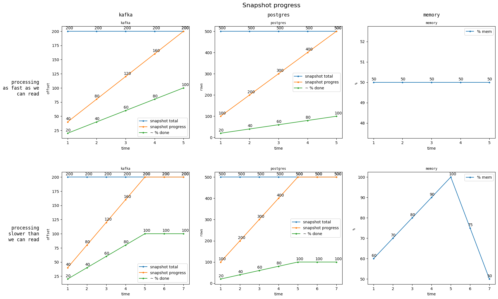
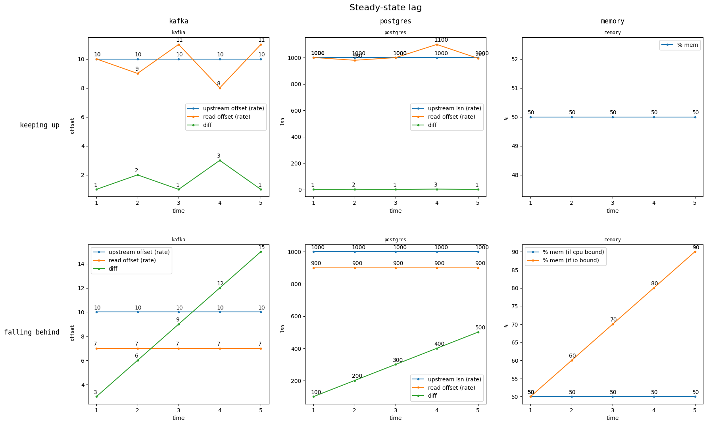

# Source Metrics for Users, v2

- Associated Epic: https://github.com/MaterializeInc/database-issues/issues/6974


## The Problem

The [existing source statistics](https://materialize.com/docs/sql/system-catalog/mz_internal/#mz_source_statistics_raw)
we expose to users for sources answer _some important questions_, like:
- _Generally_, how fast we are reading data from upstream?
- Have we committed the source's snapshot?

but fail to answer **two** critical questions users regularly ask about their sources:

1. How much of its snapshot has this source processed?
2. Is this source keeping up with _upstream_? (This is usually related to: can I resize this source?)


This design document proposes metrics that answer these questions, and goes into detail about their
implementation.

## Success Criteria

This design has succeeded when we are able to present these metrics to users in the console,
and they can use them to answer questions about their source's snapshotting and sizing.

## Out of Scope

- Expose new metrics for sinks.
- Solve the _hydration backpressure problem_ (more on this later)
- Expose detailed, _granular_ metrics that are 100% accurate.

## Solution Proposal

### Progress Aggregation

Sources implementations expose their progress in various incompatible ways. This progress
information can be partially ordered and have various shapes. In the context of metrics,
we want to be able to _calculate rates_ and _compare progress against a total_ in a
way consistent across all sources.

This means sources will need to implement a way to aggregate their notions of progress into
a single 64-bit unsigned integer. Clients processing this data can then consistently calculate rates
and percentages from these numbers. Note that the _unit_ of the single integer does not need to be
consistent across sources.

#### Kafka progress aggregation

For example, consider the following expression of progress that can be exposed by the Kafka
source implementation.
```
# Partition Id: Offset
{0: 100, 1: 150}
```

In this case, the Kafka source can be said to have processed 240 offsets.

#### Postgres frontier aggregation

The Postgres source has 1 way to expose progress: the lsn of the replication slot.
However, during snapshotting it can also sum the number of rows it has read across
all tables. For example:
```
{table1: 110 rows, table2: 15 rows} = 125 rows processed
```

During replication, the source can report the `lsn` as the number of bytes processed.

#### MySQL frontier aggregation

Similar to Postgres, The MySQL source has a rows-per-table defined during snapshotting.

However, during replication, MySQL's source timestamp is partially ordered, instead of just a single
lsn number:
```
# source id: transaction id
{0: 1000th txid, 1: 10th txid} = 1010 transactions processed.
```


## Snapshot Progress

The first set of metrics this design document proposes involve _snapshot progress_, which is a _lower bound estimate_
on the _percentage_ of the source's snapshot Materialize has _read_. These metrics are designed to
answer #1 in [the problem statement](#the-problem).

We will introduce 2 new columns in `mz_source_statistics_raw`:

```
| `snapshot_records_known`     | [`uint8`] | The total number of upstream values that are part of the snapshot. |
| `snapshot_progress`  | [`uint8`] | The number of upstream values Materialize has read so far.         |
```

The unit of _values_ depends on the source type, and will be _rows_ for MySQL and Postgres, and _offsets_ for kafka.

These values can be summed across workers and compared (`snapshot_progress / snapshot_records_known`) to produce
a _lower-bound_ estimate on the % progress we have made reading the source's snapshot.

### Source specifics

The `SourceReader` implementation for each source will be required to produce a `snapshot_records_known`, as well as
a continuously updated `snapshot_progress` frontier on each worker.

#### Kafka

`snapshot_records_known` can be be trivially exposed by exposing the snapshot frontier already tracked within its source operator,
and summing across partitions. Similarly, `snapshot_progress` can be derived from the operator's output frontier.

#### Postgres and MySQL

`snapshot_records_known` will need to be calculated, in the unit of rows by performing `SELECT count(*)` on the tables that participate in the snapshot.
Both the Postgres and MySQL implementations will be required to perform this query, per-table, during snapshotting. Note that `count(*)` is not
guaranteed to be cheap on Postgres and MySQL. To avoid this, we will perform this query _concurrently_ with the beginning of
snapshotting, allowing the user to see their source's progress before a percentage can be calculated.


`snapshot_progress` will need to be exposed by the source operators themselves, as the data itself during snapshotting all has
the same frontier. This means the operators will need to track and periodically report a frontier describing the progress they
have made reading the snapshot. In practice, this is the number of rows they have read, per-table.

#### Example Scenarios and Hydration Backpressure

Below is a set of charts for that these new metrics and the derived percentage would look like in 2 difference scenarios.




These charts make it clear that if we can _read_ from upstream faster than we can process that data, we may present a `snapshot_progress`
that is artificially inflated. This is considered reasonable for this design because:

- We will present the metrics as the _percentage of the snapshot Materialize has read_.
- The console will present the user will the memory usage of the replica doing snapshotting, which makes it clear when this scenario is occurring
(This is why memory is included on the above charts).
- In general, once we have read the entire snapshot from upstream, we process the remaining data quite quickly. This is particularly true for non-UPSERT sources.
- Categorically fixing this means implementing _Hydration Backpressure_, which effectively locks Materialize's _read-rate_ to its _process-rate_.
This is considered [out of scope](#out-of-scope) for this design, but, _critically_: if and when _Hydration backpressure_ is implemented, these proposed
metrics _become even more useful_, as opposed to becoming irrelevant.


## Steady-state

The second set of metrics this design document proposes describe the _rate_ at which upstream and Materialize are processing data.
These metrics are designed to answer #2 in [the problem statement](#the-problem).

```
| `outstanding_values`    | [`uint8`] | The total number of outstanding values in the upstream source. The unit is source-specific.        |
| `processed_values`      | [`uint8`] | The total number of upstream values Materialized has processed. Same unit as `outstanding_values`. |
```

These values are primarily designed to be calculated into _rates_ (which will happen client-side), and users should
not be expected to understand them as anything else. These rates have units that depend on the source type
(replication bytes for Postgres, offsets for Kafka, transactions for MySQL). Note that we may add prometheus metrics
for these metrics that are broken down by partition/mysql-source-id/etc.

These rates are also designed to be _compared_ with each other. The following charts show what these metrics will look like, depending on whether Materialize is keeping up
or falling behind.




Note that when our _process rate_ is consistently below the _outstanding rate_, the user knows their source isn't keeping up with upstream.

### Implementation

Each source's `SourceReader` implementation will be required to expose a continuous stream of `outstanding_values` values. This means:

- The Kafka source will periodically fetch metadata and expose aggregated per-partition offset high-watermarks.
- The MySQL source will periodically expose the result of `SELECT @gtid_executed`, which is the set of gtids representing the latest transactions committed,
aggregated as defined above.
- The Postgres source will periodically expose the result of `SELECT pg_current_wal_lsn()`, which is the lsn of the latest transaction.

Additionally, the source pipeline will periodically invert the latest frontier we have committed for the source, from the Materialize timestamp
domain to the source-timestamp domain. For MySQL and Postgres sources, this frontier will the `meet` of the subsource frontiers (as in,
calculate their minimum). These will be aggregated just like the above.


## Existing metrics

Existing metrics such as `messages_received` and `bytes_received` continue to be useful for understanding the general performance of a given source.
If users find some of them confusing or not useful, we can remove them in the future.

## Minimal Viable Prototype

N/A for now. This design document is primarily designed to capture the two core metrics we should add to sources, and how to
implement them in a feasible way. The attached example charts capture the desired output.


## Alternatives

- Expose 100% accurate information about how much of the snapshot we have processed, as opposed to how much we have read.
    - Rejected as it's considered as difficult as implementing Hydration Backpressure.
- Expose progress information in a different format per source type.
    - Rejected as it adds undue complexity in the system catalog, console, and for the user to interpret.
        - In the future, if customers want per-partition information for Kafka sources, we can do so easily using this same general design.
- Consolidate the two metric sets proposed in this design document into one.
    - Rejected due to its complexity.
- Expose more information to users about their sources.
    - This design document is intentionally constrained, to help users answer 2 well-known questions about their sources.
- Replace the 2nd metric set with [Relocking the upstream frontier](https://github.com/MaterializeInc/database-issues/issues/7020).
    - Rejected to decouple this design with a reclocking policy decision.
    - Note that the schema and semantics of this design document are forward-compatible with that policy change.


## Open questions

- Are there any edge cases around _source frontier differences_ that can't be reconciled into a relatively meaningful number for the purpose of metrics?
- Are there other scenarios than the ones predicted in the above charts that we aren't capturing?
    - One case might be: people's sources that fall behind upstream just use more memory, while Materialize continues to read as fast as possible.
    The metrics added by this proposal would allow us to easily distinguish between those cases.
- Will `count(*)` be prohibitively expensive, or do we need to use estimates?
