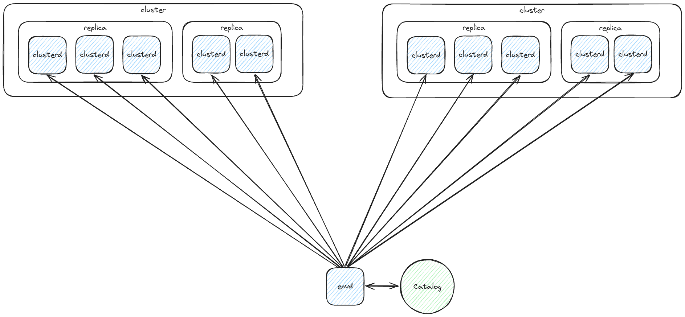
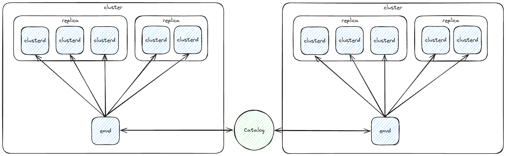

# Platform v2: Physical, Distributed Architecture of the Query/Control Layer

> [!WARNING]
> Currently, mostly a draft! For exploration and discussion. I'm explaining the
> difficulties with a _clusterd-only_ architecture, mostly coming up with
> questions that we'd need to answer. And I show how we can easily evolve our
> current architecture to a _multi-envd-clusterd_ architecture.
>
> This has "I think", and "I" phrases, because this is really me (aljoscha)
> exploring questions.

## Context

As part of the platform v2 work (specifically use-case isolation) we want to
develop a scalable and isolated query/control that is made up of multiple
processes that interact with distributed primitives at the moments where
coordination is required.

In Platform v2: Logical Architecture of the Query/Control Layer [(in-progress
PR)](https://github.com/MaterializeInc/materialize/pull/23543) we lay out the
logical architecture and reason about how we _can_ provide correctness in a
more decoupled/distributed setting. Here, we will lay out the physical
architecture: what kinds of processes make up an environment, how are they
connected, how are queries routed, etc.

## Goals

- Specify what processes and how many we run
- Specify how those processes interact to form a distributed query/control layer
- More, TBD!

## Non-Goals

- TBD!

## Overview

TBD!

## Current Architecture

With our current architecture, one environment runs multiple `clusterd` and a
single `environmentd` (`envd`) process.

The single `envd` process is responsible for/does:

- interacts with durable Catalog
- hosts the adapter layer, including the Coordinator
- hosts Controllers, which instruct clusters and process their responses
- has read holds:
  - for storage objects, these are ultimately backed by persist `SinceHandles`,
    which Coordinator holds via a `StorageController`
  - for compute objects, these are ephemeral, the `ComputeController` ensures
    these holds by choosing when to send `AllowCompaction` commands to clusters
  - a compute controller is the single point that is responsible for
    instructing a cluster about when it can do compaction, this is how it
    logically has "holds" on compute objects
- processes user queries: for this, it needs both types of read holds mentioned above
- downgrades read holds based on outstanding queries and policies, and
  responses about write frontiers from clusters

How are queries routed/processed:

1. simple!
2. all queries arrive at single `envd`, in the adapter layer
3. adapter instructs responsible controller to spin up computation on a cluster
4. responsible controller sends commands to all replicas of the cluster
5. responsible controller eventually receives responses from replicas
6. adapter sends results back to client

### Commentary

Pros:

- Empirically works quite well so far!

Cons:

- Single `envd` is single point through which all query/control processing must
  pass, limiting scalability and isolation.
- We run more than one type of process, which cloud might find harder to
  operate. But it's what we've done for an while now.

## Multi-envd, Multi-clusterd Architecture

With this architecture, we would run multiple `clusterd`, which make up
replicas which make up clusters. Same as with our current architecture.

The difference is that we shard the work of `envd` by cluster (the logical
CLUSTER that users know, _not_ `clusterd`).

> [!NOTE]
> We assume there is a balancer layer that can understand enough about
> selecting clusters and can route user queries to the correct `envd`.
>
> And we are in fact working on that, it's `balancerd`!

- the `envd` can all write to the Catalog
- the `envd` subscribe to the Catalog to learn about changes that other `envd`
  are adding and update their in-memory view of the Catalog and instruct
  the controller for their cluster when necessary
- the `envd` use the distributed Timestamp Oracle to make reads/writes
  linearizable
- the `envd` use the Tables-Txn abstraction for writing to tables from multiple
  processes
- a given `envd` hosts one controller (one for compute and one for storage)
  that is _only_ responsible for the objects running on that cluster
- that controller instructs the cluster (replicas), same as before, and
  receives responses
- the `envd` has read holds:
  - for storage objects, these are ultimately backed by persist `SinceHandles`,
    which Coordinator holds via a `CollectionsController` (todo: ref to design
    doc)[]
  - the single compute controller is the single point that is responsible for
    instructing _its_ cluster about when it can do compaction, this is how it
    logically has "holds" on compute objects
- adapter downgrades read holds based on outstanding queries and policies, and
  responses about write frontiers from _its_ cluster
- a given `envd` only has read holds on compute objects in its cluster
- a given `envd` can only process queries that exclusively use compute objects
  on that cluster. This is the same today, a query cannot mix compute resources
  from different clusters!
- a given `envd` holds `SinceHandles` for all storage collections (at least
  those that it is interested in), because storage collections can be accesses
  from any cluster

How are queries routed/processed:

1. simple-ish!
2. the balancer layer routes a query to the responsible `envd`
3. query arrives in the adapter layer
4. adapter instructs _its_ controller to spin up computation on _its_ cluster
5. controller sends commands to all replicas of _its_ cluster
6. controller eventually receives responses from replicas
7. adapter sends results back to client

### Commentary

Pros:

- Easy to migrate to from our current architecture.
- Easy-ish to think about how information flows in the system, who "holds" read
  holds, how queries are routed through adapter and to replicas.
- Nothing changes in the UX, users still interact with clusters, it's just that
  the query/control work is now sharded, meaning there is better
  isolation/scalability.

Cons:

- We run more than one type of process, which cloud might find harder to
  operate. But it's what we've done for an while now.
- We run more than one `envd`-shaped processes (one per cluster), which we
  previously didn't.

## Multi-clusterd, No-envd Architecture

It's certainly possible, but hard for me to see how we get there with how
controllers, read holds, and query processing work today.

Remember: a user-facing CLUSTER is made up of replicas, which themselves are
made up up `clusterd` processes.

Questions:

- How does Catalog content (the source of truth) get translated to instructions
  for clusters/replicas?
  - In the multi-envd-multi-colusterd design, there is still a single point
    (the controller, in that clusters `envd`) that instructs all cluster
    replicas, based on the Catalog. Which is easy to reason about.
  - Do all replicas participate in a distributed protocol to figure out what to
    do amongst themselves?
- Who holds on to `SinceHandles` for storage collections? Is it all `clusterd`
  processes?
  - The `n*m` problem, where `n` is number of `clusterd` processes, and `m` is
    number of storage collections,  doesn't seem to problematic, because our
    `n` is small. This one seems tractable, at least.
- Who holds on to read holds for compute objects, and how?
  - In the multi-envd-multi-colusterd design, there is still a single point
    (the controller, in that clusters `envd`) that instructs all cluster
    replicas, allows them to do compaction when desired. It can therefore
    logically keep read holds.
  - Would all `clusterd` processes somehow logically keep read holds for all
    replicas? They would need this to do query processing!
- How do queries get routed?
  - In the multi-envd-multi-clusterd design, there is still a single entrypoint
    _per cluster_: that clusters `envd` process.
  - The balancer could choose one `clusterd` process, round-robin. And then
    that `clusterd` process (the piece of adapter logic in it) has to process
    the query, talk to the other replicas/processes?
  - There could be one "special" `clusterd` process that does the query/control
    work. Feels very iffy!

### Commentary

Pros:

- We only run one type of process.
- Plus maybe one super-slim `envd` for bootstrapping things?

Cons:

- Hard to see how we can evolve our design to there from our current
  architecture. At least for me, aljoscha.

## Alternatives

TBD!

## Open questions

