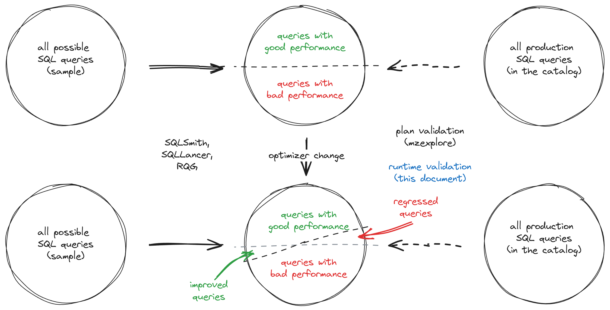

# Cluster-specific optimization

-   Associated:
    -   [optimizer: Flag for controlling join
        planning (#23318)](https://github.com/MaterializeInc/materialize/pull/23318)
    -   [DNM: Draft for variadic outer join
        lowering (#24345)](https://github.com/MaterializeInc/materialize/pull/24345)
    -   [misc: add `mzexplore` command for catalog
        exploration (#22892)](https://github.com/MaterializeInc/materialize/pull/22892)
    -   [explain: control outer join lowering via
        `ExplainConfig` (#22744)](https://github.com/MaterializeInc/materialize/pull/22744)
    -   [design: A unified optimizer
        interface (#20569)](https://github.com/MaterializeInc/materialize/pull/20569)

<!--
The goal of a design document is to thoroughly discover problems and
examine potential solutions before moving into the delivery phase of
a project. In order to be ready to share, a design document must address
the questions in each of the following sections. Any additional content
is at the discretion of the author.

Note: Feel free to add or remove sections as needed. However, most design
docs should at least keep the suggested sections.
-->

## The Problem

<!--
What is the user problem we want to solve?

The answer to this question should link to at least one open GitHub
issue describing the problem.
-->

Optimizer changes are tricky to implement and deploy in a robust and predictable
manner. The main problem is depicted by the following diagram.



Most of the time, a change to our optimizer will not only improve the
performance of some SQL queries (hopefully a majority), but also introduce
performance regressions to others.

The expected plan regressions and improvements of an optimizer change _in
general_ can be identified by running random query workloads using one of the
fuzzers available in our CI pipeline (RQG, SQLSmith, SQLLancer). However, we
currently lack the right tooling to determine the _specific impact_ of such
changes to our current `production` environments.

The latter is of particular practical importance when prototyping and validating
possible optimizer changes behind a feature flag:

1.  It will help us to quickly get a feeling of the potential improvements that
    our customers will see. This in turn can help us determine whether it is
    worthwhile to invest the necessary time to make the change production-ready.
2.  It will help us to identify potential performance regressions that will be
    observed by our customers once we roll out the change. This in turn can help
    us to improve the robustness of our rollout strategy for optimizer changes.

There are two dimensions of assessing the quality of SQL queries in production:

1.  **Assessing the quality of the optimized plans.** To a large extent this is
    already supported with the introduction of the `mzexplore` tool
    (MaterializeInc/materialize#22892) and with adding the ability to control
    optimizer feature flags using the `EXPLAIN WITH(...)` syntax
    (MaterializeInc/materialize#22744). There are some known issues with the
    current state of the code, but we have fixes for those that should be merged
    soon (pending review).
2.  **Assessing the quality of the running dataflows.** This is needed because
    sometimes the impact of an optimizer change is not directly evident in the
    optimized plan. Instead, we need to deploy and run the modified dataflow and
    compare its performance against its current version.

The current document proposes tooling and workflows in aid of (2).

## Success Criteria

<!--
What does a solution to this problem need to accomplish in order to
be successful?

The criteria should help us verify that a proposed solution would solve
our problem without naming a specific solution. Instead, focus on the
outcomes we hope result from this work. Feel free to list both qualitative
and quantitative measurements.
-->

-   Members of the compute team have agreed upon the developed the minimal amount of
    tooling and code infrastructure required to enable the evaluation of proposed
    optimizer changes in production.

-   The new feature has been used to asses the potential impact of the following
    optimizer changes:
    -   [optimizer: Flag for controlling join
        planning (#23318)](https://github.com/MaterializeInc/materialize/pull/23318)
    -   [DNM: Draft for variadic outer join
        lowering (#24345)](https://github.com/MaterializeInc/materialize/pull/24345)

## Out of Scope

<!--
What does a solution to this problem not need to address in order to be
successful?

It's important to be clear about what parts of a problem we won't be solving
and why. This leads to crisper designs, and it aids in focusing the reviewer.
-->

Things that will be nice to have, but are intentionally left out of scope from
the current proposal are listed below with a brief motivation for that decision.

-   **Not requiring `mz_system` access in order to do a runtime validation
    experiment.** This doesn't seem urgent because we will always use
    `mzexplore` to first identify a small set of candidate dataflows. For those,
    we will in turn run a dedicated experiment together with a designated
    engineer that can temporarily request `mz_system` privileges with Teleport
    (similar to the `lgalloc` experiments).
-   **Provide tooling to automatically duplicate dataflow-backed catalog items
    from a reference cluster to a temporary cluster used to run an experiment.**
    While this might be very helpful in general, we believe that most of our
    customers deploy their DDL statements with a script. For the first iteration
    of this feature it should be therefore sufficient to ask them to run a
    modified version of this script (with changed catalog item names) against
    the temporary cluster while running our experiments.
-   **Support experimentation on unmanaged clusters.** Extending the syntax for
    managed clusters should be sufficient for an MVP. Since the clusters will be
    short-lived it doesn't make a huge difference which syntax the Materialize
    employees will use to create them. Adding `FEATURES` support for unmanaged
    clusters will require more code changes. Since the syntax is now deprecated,
    there is no need to additionally complicate this code.
-   **Support changes of `CLUSTER`-specific features with `ALTER CLUSTER`.** For
    the same reasons as above—for experimentation purposes we only need
    short-lived clusters.

## Solution Proposal

The suggested high-level workflow for assessing the potential impact of an
optimizer feature will be:

1.  Use `bin/mzexplore` to identify dataflows and clusters that might be affected
    by an optimizer change gated behind a feature flag.
2.  For each such cluster, run the following experiment:

The suggested workflow for running an experiment on a specific customer
environment will be:

1.  Obtain `mz_system` privileges through Teleport.
2.  Create a dedicated cluster for the experiment. Use the feature flag to
    enable the tested feature in the `CREATE CLUSTER` definition.
3.  Create an `UNBILLED` replica for that cluster.
4.  Ask the customer to replicate (a subset of) dataflow-backed catalog items
    defined on the original cluster to the experiment cluster.
5.  Monitor and record observed differences between the dataflows running in the
    original cluster and the (modified) dataflows running in the experiment
    cluster.

<!--
What is your preferred solution, and why have you chosen it over the
alternatives? Start this section with a brief, high-level summary.

This is your opportunity to clearly communicate your chosen design. For any
design document, the appropriate level of technical details depends both on
the target reviewers and the nature of the design that is being proposed.
A good rule of thumb is that you should strive for the minimum level of
detail that fully communicates the proposal to your reviewers. If you're
unsure, reach out to your manager for help.

Remember to document any dependencies that may need to break or change as a
result of this work.
-->

In order to facilitate this workflow, we propose the following changes
(discussed in detail below):

-   Extensions to the `CREATE CLUSTER` syntax.
-   Extensions to the optimizer API.

### Extensions to the `CREATE CLUSTER` syntax

Extend the `CREATE CLUSTER SYNTAX` for managed cluster plans as follows:

```sql
CREATE CLUSTER <name> ... FEATURES (...)
```

The newly added `FEATURES` clause will be only visible by `mz_system`. We will
extend `CreateClusterManagedPlan` and `CreateClusterManaged` with a new
`ClusterFeatures` struct that models the feature flag configuration that can be
overridden on a per-cluster level.

### Extensions to the `optimize` API

Here we can benefit from the unified optimizer interface introduced with
MaterializeInc/materialize#20569. As part of the associated changes we
introduced an `mz_adapter::optimize::OptimizerConfig` struct that currently can
can already be configured in a layered way:

1. A top layer of settings bound from `SystemVars`.
2. A layer of `EXPLAIN`-specific overrides bound from the `ExplainContext`,
   which is available when the `Coordinator` methods that drive the optimization
   process are initiated from `sequence_explain_plan`.

Since all `Optimizer::new(...)` constructor calls in the `Coordinator` happen at
a time where the target cluster for the optimized statement is already resolved,
we can just add a new layer for cluster-specific overrides between (1) and (2).

## Minimal Viable Prototype

An sketch of the proposed design can be found in the MVP draft PR[^3].

<!--
Build and share the minimal viable version of your project to validate the
design, value, and user experience. Depending on the project, your prototype
might look like:

- A Figma wireframe, or fuller prototype
- SQL syntax that isn't actually attached to anything on the backend
- A hacky but working live demo of a solution running on your laptop or in a
  staging environment

The best prototypes will be validated by Materialize team members as well
as prospects and customers. If you want help getting your prototype in front
of external folks, reach out to the Product team in #product.

This step is crucial for de-risking the design as early as possible and a
prototype is required in most cases. In _some_ cases it can be beneficial to
get eyes on the initial proposal without a prototype. If you think that
there is a good reason for skpiping or delaying the prototype, please
explicitly mention it in this section and provide details on why you you'd
like to skip or delay it.
-->

Nothing is done yet, but once we agree on the SQL extensions the changes to get
something working end-to-end should be done quite quickly.

## Alternatives

<!--
What other solutions were considered, and why weren't they chosen?

This is your chance to demonstrate that you've fully discovered the problem.
Alternative solutions can come from many places, like: you or your Materialize
team members, our customers, our prospects, academic research, prior art, or
competitive research. One of our company values is to "do the reading" and
to "write things down." This is your opportunity to demonstrate both!
-->

### Managing cluster-specific parameters with LaunchDarkly

There is prior art for this in PostgreSQL: you can set (most) system
parameters at the database level, and they take precedence in order of:

```
system < database < role < session
```

or something lke that. If we get more use cases for such layering we can invest
the time to teach the `SystemVars` about cluster-specific parameters. Once we do
that, we should be able to enable feature flags on a per-cluster basis through
LaunchDarkly.

The approach is rejected (for now) because it requires more substantial changes
to the current state of our LaunchDarkly setup in `main`. Basically at the
moment we pull parameters from LaunchDarkly in a loop using a fixed
`ld::Context`[^1] that consists of:

1. A context of `kind = environment` that models the current Materialize
   environment.
2. A context of `kind = organization` that models the environment owner.

If we want to provide cluster-specific configuration through LaunchDarkly, we
would need to extend the `system_parameter_sync` loop[^2] to run a
`frontend.pull(...)` call with a different `ld::Context` for each cluster. We
would then use the `CLUSTER`-specific `ALTER SYSTEM` extensions in `SystemVars`
in the `backend.push(...)` call.

## Open questions

<!--
What is left unaddressed by this design document that needs to be
closed out?

When a design document is authored and shared, there might still be
open questions that need to be explored. Through the design document
process, you are responsible for getting answers to these open
questions. All open questions should be answered by the time a design
document is merged.
-->

N/A

## Future work

From @benesch:

> As future work, it seems like it'd also be interesting to allow users to use the
> `FEATURES` flag, limited to a restricted set of features that are worth allowing
> users to control.
>
> We might also consider introducing
>
> ```sql
> CREATE TEMPORARY CLUSTER ... FEATURES(...)
> ```
>
> and limit certain features for use only in temporary clusters. These clusters
> would only last for a single SQL session, and therefore wouldn't survive an
> `envd` restart, and therefore wouldn't prevent us from removing the feature
> flag in a future version of Materialize.

---

[Automatically duplicate dataflow-backed catalog items for experimentation](https://github.com/MaterializeInc/materialize/issues/25166)

---

[^1]: [`ld_ctx` definition](https://github.com/MaterializeInc/materialize/blob/d44bd11b02e0c4cf11aa8307e44ffc5c5132eb12/src/adapter/src/config/frontend.rs#L145C1-L208C2)
[^2]: [`system_parameter_sync` definition](https://github.com/MaterializeInc/materialize/blob/d44bd11b02e0c4cf11aa8307e44ffc5c5132eb12/src/adapter/src/config/sync.rs#L23-L78)
[^3]: [MVP sketch (draft PR)](https://github.com/MaterializeInc/materialize/pull/25165)
