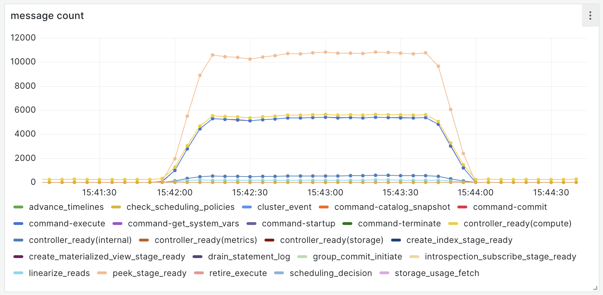
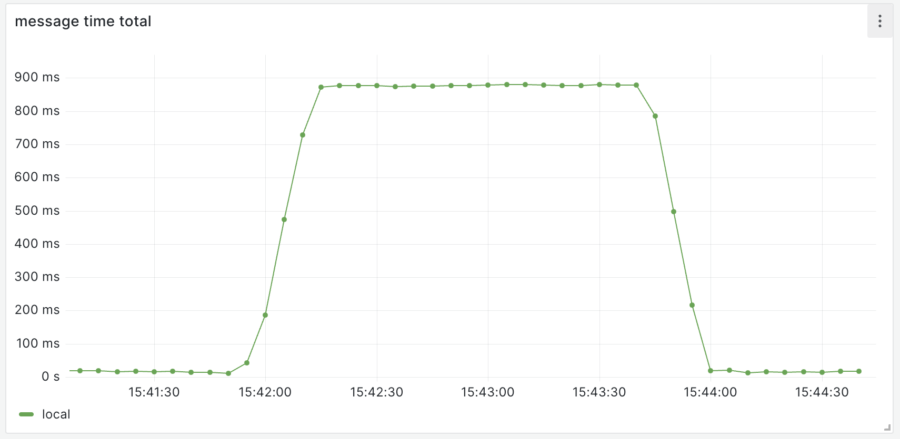
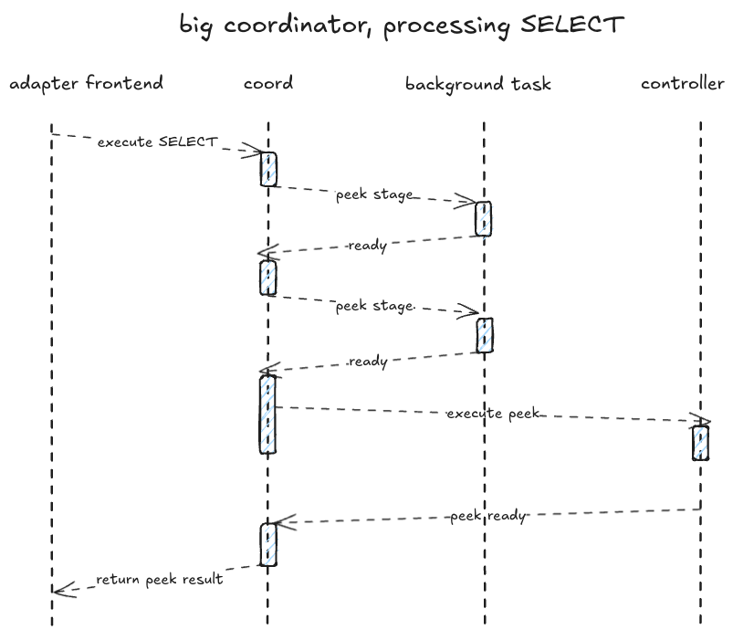
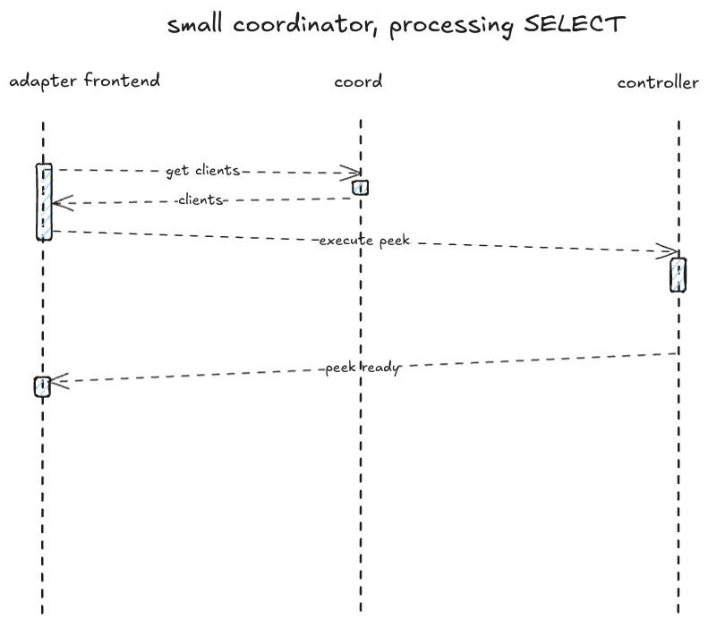
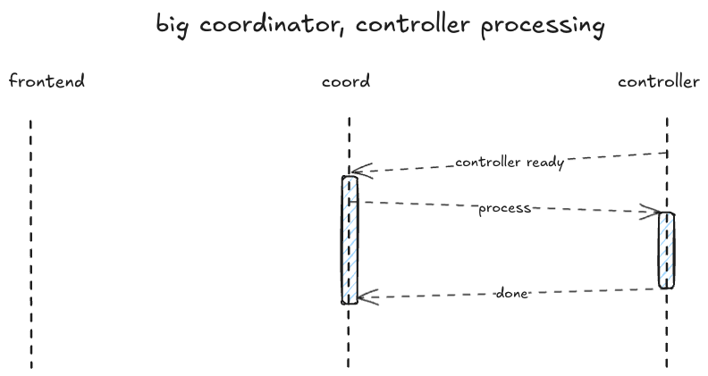
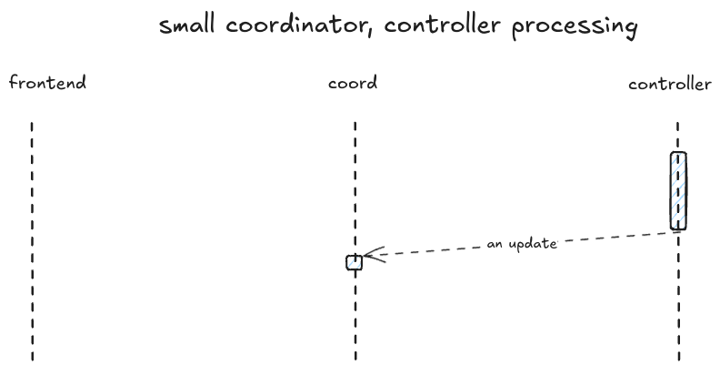

# A Small Coordinator for A More Scalable and Isolated Materialize

As part of the platform v2 working group, we were working towards making
Materialize more scalable and provide (physical) use-case isolation. We managed
to implement the required basic building blocks, a [distributed timestamp
oracle](20230921_distributed_ts_oracle.md), [a decoupled storage
controller](20240117_decoupled_storage_controller.md), and the [txn
system](20230705_v2_txn_management.md), but never got to assembling the whole
vision because priorities shifted.

This is a concrete proposal for working towards a "smaller" Coordinator, that
is, a Coordinator that is less involved in processing user requests. This will
lead to a more scalable _and_ more isolated system, without grander ambitions
of implementing full horizontal scalability and isolation of Materialize.

- Decoupled Compute Controller: https://github.com/MaterializeInc/materialize/pull/29559
- decoupled storage controller: [decoupled storage controller](20240117_decoupled_storage_controller.md)

## The Problem

The Coordinator is a component of the ADAPTER layer that is sequentializing
most interactions and goings-on in Materialize through a single-threaded
command-processing loop (aka. the coordinator main loop or simply main loop).
Crucially, this includes processing user queries and controller (STORAGE and
COMPUTE) updates. There are two important consequences of that:

1. A limit to scalability: It is generally accepted that you can only do a
   second's worth of work in a second, so this puts an upper bound on the
   number of interactions we can process. For example, if processing a SELECT
   needed 10ms of time on the main loop that would impose a strict upper limit
   of 100 SELECTs/s, regardless of how much capacity other parts of the system
   have for processing.
2. Lack of use-case isolation: When, because of bugs or because of unexpected
   behavior or just because, an operation takes more time on the main loop than
   expected, this will "steal" time from other operations that are vying for
   time on the loop. One use-case that is using a lot of Materialize will make
   Materialize worse for other use cases.

We can see the first of these when running benchmarks. We have metrics about
how many commands the main loop is processing and how much time they're taking
(a histogram). And so we can see that when running a SELECT throughput
benchmark, the time spent processing messages is close to 1 second, so at the
theoretical limit of the architecture. More on this in a detailed section
below.

We can see the second consequence in action most acutely when there are bugs in
operations that are thought to be fast but take a long time. In such cases,
Materialize as a whole becomes unresponsive or "sluggish" for a customer.
Another way of seeing this in action is of course when one use-case is using
the environment a lot, say high SELECT throughput: this will also make the
system less responsive for other use cases/users of the system.

Both of these _might_ not obviously be problematic today, but we think we will
have customers soon for which our scalability limits become a blocker for
expansion and we do see a trickle of bugs where the lack of isolation makes it
so that Materialize becomes unresponsive for customers, for multiple seconds at
a time. This can shake confidence in Materialize, which would also be a blocker
for adoption or expansion. There is some recency bias to thinking how urgend
these bugs are, but here's the latest example, where we had to disable a
feature because it can block the coordinator main loop for 10s of seconds or
more: https://github.com/MaterializeInc/materialize/pull/33070.

## Success Criteria

We want to address both of the problems mentioned above, but scalability is the
one where its easier to give more quantitative goals. Isolation is covered by
the more qualitative goals.

- When running throughput benchmarks, the metric showing time spend processing
  messages on the main loop must be nowhere near 1 second. That is the main
  loop must not be the bottleneck.
- The Coordinator is so small, in terms of types of commands and the complexity
  of each command, that it is feasible to audit all of them and conclude that
  nothing can block the main loop unreasonably long.

## Out of Scope

- We want to do this work within the current singleton `environmentd` process.
  No aspirations beyond that. So no horizontal scalability of the Coordinator.
- We don't want to improve numbers in throughput benchmarks. Only remove the
  Coordinator as a bottleneck. Our work _might_ increase throughput numbers, or
  it might show that there are similar bottlenecks in other parts of the
  system.

## Background

The Coordinator has had its current design since the early days of the code
base. The fact that it is a single control loop that sequentializes all
modifications of durable state was necessary for providing the Materialize
correctness experience, our consistency guarantees, strict serializability.

It had to sequence DDL, regular queries, the storage/compute controllers
changing state, everything. Putting it in Rust terms, all of the persistent or
ephemeral state was a `&mut`, that is it was not shareable and required that a
single loop mediate access to it. Timestamp selection (important for
consistency) was using in-memory state (backed by periodically synced disk
state), that was not shareable, not the distributed timestamp oracle we have
now.

Today, the distributed timestamp oracle provides correctness, and DDL goes
through catalog modifications which would realize concurrent modifications.

The platform v2 design doc on [a logical architecture for a scalable and
isolated Materialize](20231127_pv2_uci_logical_architecture.md) goes into more
detail and argues how the primitives that we have now suffice to provide
correctness. The arguments there serve as the basis for the proposed changes to
the Coordinator below.

> [!NOTE]
> The coordinator main loop runs inside an `async` task, but throughout this
> doc we will also use the term single-threaded, or single thread. For the
> discussion it is not important whether it's an async task or a thread. It's
> an implementation detail.

### Interesting Components

For this doc, were are interested in ADAPTER components and how they interact:

- _adapter frontend_: this is the code that terminates a `pgwire` connection
  from the user/client. Each connection is being run by an `async` task that
  sends commands to the Coordinator and sends responses from the Coordinator
  back to the client.
- Coordinator: the component that sits in between the frontend and the
  controllers and is responsible for durable environment state, including the
  catalog, and mediating access to it. The Coordinator talks to the controllers
  to affect things.
- Controller(s): the storage and compute controllers. For the purposes of this
  document the interesting facets are that we need to talk to the controllers
  to acquire read holds for a SELECT and that we need to talk to the compute
  controller for executing a SELECT. But anything else that is affecting
  clusters or collections also has to go through the controller(s).

### Small vs. Big Coordinator

In this document, we are arguing for a _Small Coordinator_ and we retroactively
call what we have right now a _Big Coordinator_. The coordinator is big in
terms of the types of commands it supports, how complex ("big") those commands
are, and how much time the coordinator has to spend on its main loop for
processing those commands. Currently, the frontend sends commands of the shape
EXECUTE SELECT or EXECUTE DDL. These are higher-level, complex commands. The
alternative is a Small Coordinator that supports a much reduced set of simpler
commands: most of the work would have to happen in other parts of the system
and the Coordinator only has too be involved when absolutely necessary. A good
analogy might be CISC vs RISC instruction sets, where CISC has fewer, more
complex opcodes and RISC has possibly more, but simpler opcodes.

### Staged Processing

To work around the limitation that time on the coordinator main loop is limited
the concept of _stages_, or _staged processing_ was introduced. First for peeks
(aka SELECT) but then also for other things. The idea is that the Coordinator
gathers the pieces that are required for a certain step in processing a peek,
on the main loop, then fires of an async task to do the actual work. The task
will then send a command back to the Coordinator when ready, which will then
resume processing on the main loop, potentially firing off more stages.

This is a band aid because it doesn't fix the ultimate scalability problems
_and_ it makes the code more complicated and harder to understand. It makes it
harder to audit code running in the main loop.

## "Benchmarks"

We did not run comprehensive benchmarks, the purpose here is to show how the
Coordinator behaves when there is a sustained workload and how command
processing becomes the bottleneck.

The benchmark runs `SELECT` statements with concurrent clients (128
connections). On my machine, I get about 5000 qps. And we see these metrics on
the rate of commands being processed (also known as "messages" in the code and
elsewhere):

Around 5000 we see a number of interesting message types, these correspond with
our 5000 qps. They are:

- `command-execute`: this is the command that starts execution of the SELECT.
- `command-catalog_snapshot`: this is a command for getting a snapshot of the
  catalog, needed for processing SELECT.
- `command-commit`: this is the command that will be executed for finalizing a
  single SELECT execution.
- `controller_ready(compute)`: this is the compute controller signaling that a
  peek result is ready, and the the Coordinator needs to do something about it.

The top line is `peek_stage_ready`, which originate in the staged processing
machinery explained above. We can see that there are two async stages that are
fired off for processing each SELECT.

When we look at the metric that shows the total time spend processing commands
on the main loop, we see that we are very near our 1 second theoretical
maximum. Especially when accounting for overhead of the loop machinery, message
channels, etc., we can say that this is currently the bottleneck:

## Proposal

### Implementation Plan

## Alternatives

An alternative is that we keep the big Coordinator and invest more into staged
command processing. I don't think this helps because we cannot audit easily
what is and isn't blocking for a long time, and ultimately a single loop that
sequentializes will keep being a bottleneck.

## Open questions
