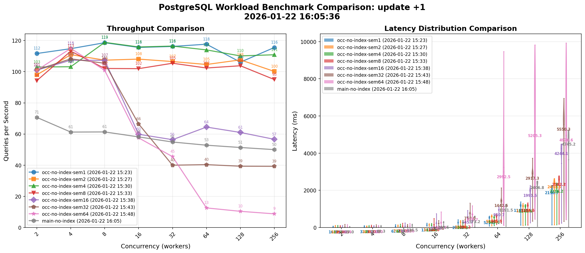

# Incremental, OCC-based Read-Then-Write for Concurrent Writers

## Context

Read-then-write operations (DELETE, UPDATE, INSERT...SELECT) in Materialize
currently rely on in-process pessimistic locking. The Coordinator acquires
write locks before reading, holds them through the write, and releases them
only after the write has been applied to the timestamp oracle. This ensures
that no other write can interleave between the read and write phases of a
single operation.

This approach is correct for a single `environmentd` process, but it does not
extend to multiple processes: the locks are in-memory mutexes that cannot be
shared across process boundaries. We need concurrent multi-process writes for:

- **Zero-downtime upgrades v2**: the old and new `environmentd` processes must
  both be able to serve writes during the handover window
- **High availability**: multiple `environmentd` processes must be able to
  serve queries concurrently
- **Physical isolation**: separate serving-layer processes (aka.
  `environmentd`) for different workloads

This design doc proposes replacing the pessimistic locking approach with
optimistic concurrency control (OCC) for read-then-write operations, backed by
a subscribe that continually tracks the current state of the data.

## Goals

- Make read-then-write operations correct with concurrent writers, including
  writers in different `environmentd` processes
- Provide the same user-visible semantics as the current implementation: writes
  are based on the latest committed state of the table at the time the write is
  applied
- Don't regress performance within reasonable bounds

## Non-Goals

- High-performance writes under heavy contention. The current implementation
  serializes writes behind a global lock; the new implementation serializes
  them via OCC retries. Neither is designed for high write throughput.
- Removing the in-process locks immediately. During rollout, the old lock-based
  path and the new OCC path coexist behind a feature flag. The locks can be
  removed once the OCC path is fully rolled out.
- Multi-statement transactions. The OCC approach as described here applies to
  single-statement implicit transactions. Explicit multi-statement write
  transactions continue to use the existing path. And there are not plans to
  support mixed read/write transactions.

## Overview

The core idea is to replace the "lock, peek, write" sequence with a
subscribe-based OCC loop:

1. Open a subscribe on the read expression (the `selection` from the
   `ReadThenWrite` plan), starting at the timestamp determined by the oracle
2. Accumulate diffs from the subscribe
3. When the subscribe frontier advances to T (meaning we have a consistent
   snapshot), attempt to write the accumulated diffs at timestamp T
4. If the write succeeds, done
5. If the write fails because another writer already committed at timestamp T,
   the subscribe will deliver the new state; go back to step 3 with the updated
   diffs

This approach is correct by construction: the subscribe always reflects the
committed state of the data, and the timestamped write mechanism ensures that
the write is applied at exactly the timestamp the diffs were computed for. If
anything changes between the read and the write, the write fails and is retried
with fresh data.

Below we describe the current approach, the proposed approach, correctness
arguments, and performance implications.

## The current lock-based approach

The current `sequence_read_then_write` in the Coordinator works as follows:

1. **Acquire write locks**: For each table involved in the read-then-write, an
   in-process `OwnedMutexGuard` is acquired. All locks are acquired atomically
   (all-or-nothing) to prevent deadlocks. If any lock is unavailable, the
   entire operation is deferred until the lock becomes available.
2. **Peek**: A one-shot peek is executed at `QueryWhen::FreshestTableWrite`,
   reading the current state of the data.
3. **Compute diffs**: The adapter computes retractions and additions from the
   peek results (e.g., for DELETE: negate each row; for UPDATE: negate old rows
   and add new rows).
4. **Linearize** (for strict serializable isolation): Wait for the timestamp
   oracle to confirm that the read timestamp has been linearized.
5. **Write**: Submit the diffs via `send_diffs`, which adds them to the pending
   group commit queue.
6. **Release locks**: Locks are held until after the group commit applies the
   write to the timestamp oracle, ensuring no other write can sneak in between
   the read and the write.

The correctness of this approach depends entirely on the in-process locks. If
the locks were removed or if a second `environmentd` process were to execute a
concurrent write, the read-then-write would be susceptible to lost updates.

The complexity of this locking mechanism is significant:

- `WriteLocks` uses an all-or-nothing builder pattern to prevent deadlocks
- `GroupCommitWriteLocks` merges compatible locks across concurrent blind
  writes
- Deferred write operations must be carefully managed when locks aren't
  immediately available
- The lock validation code in `group_commit()` has multiple branches for
  different lock states (pre-validated, no locks needed, missing locks)

## The proposed OCC approach

### Architecture

The new approach moves read-then-write sequencing from the Coordinator to the
_session task_ (the per-connection async task), similar to how frontend peek
sequencing already works. The session task does the planning, optimization, and
OCC retry loop. It communicates with the Coordinator only for specific
operations that require Coordinator state:

- Creating and dropping the internal subscribe (which needs Coordinator
  bookkeeping for the compute sink)
- Submitting timestamped writes (which go through group commit)

### The OCC loop

```
Session Task                         Coordinator
  |                                      |
  |-- plan & optimize MIR/LIR            |
  |                                      |
  |-- acquire OCC semaphore              |
  |                                      |
  |-- CreateReadThenWriteSubscribe ----> |
  | <------------ subscribe channel -----|
  |                                      |
  |   +-- OCC Loop ------------------+   |
  |   | receive diffs from subscribe |   |
  |   | on frontier advance:         |   |
  |   |   consolidate diffs          |   |
  |   |   AttemptTimestampedWrite -> |-->|-- group_commit()
  |   |   <-- Success/Failed --------|<--|
  |   |   if Failed: continue loop   |   |
  |   |   if Success: break          |   |
  |   +------------------------------+   |
  |                                      |
  |-- DropReadThenWriteSubscribe ------> |
  |                                      |
```

### Timestamped writes

A timestamped write is a write that must be committed at a specific timestamp.
The group commit machinery has to be extended to supports this by:

1. Checking if the target timestamp is still valid (hasn't been passed by the
   oracle)
2. Using the target timestamp directly instead of allocating a new one from the
   oracle
3. Advancing the oracle past the target timestamp after the write

Only one timestamped write is processed per group commit round. If multiple
timestamped writes target the same timestamp, one is selected and the others
are failed with a _timestamp passed_ error. This is necessary because
independently computed timestamped writes may be inconsistent with each other:
they were each computed from the state at their respective read timestamps and
could conflict if applied together.

### MIR transformations

The subscribe needs to produce the right diffs directly, rather than raw rows
that the adapter then transforms. We apply the mutation transformation at the
MIR level:

- **DELETE**: Wraps the selection expression in a `Negate`, producing `(row,
  -1)` diffs
- **UPDATE**: Uses a `Let` binding to share the selection. The body unions a
  negated `Get` (old rows with diff -1) with a mapped `Get` (new rows with diff
  +1, applying the assignment expressions)
- **INSERT...SELECT**: The selection passes through unchanged; the subscribe
  naturally emits each row with diff +1

### Concurrency limiting

When multiple read-then-write operations run concurrently, each maintains a
subscribe that continuously receives and processes updates. With N concurrent
OCC loops, whenever one loop succeeds, the other N-1 loops must process the
resulting updates and retry. This leads to O(N^2) total work.

To bound this, a semaphore has to limit the number of concurrent OCC operations
(default: 4). Additional operations wait for a permit before starting their
subscribe.

### Internal subscribes

The subscribes created for read-then-write are internal: they do not appear in
`mz_subscriptions` or other introspection tables, and they don't increment the
active subscribes metric. They are created and dropped via dedicated `Command`
variants (`CreateReadThenWriteSubscribe`, `DropReadThenWriteSubscribe`).

## Correctness

The correctness argument has two parts: (1) the OCC loop produces the right
diffs, and (2) the timestamped write mechanism ensures they are applied at the
right timestamp.

### The subscribe produces the right diffs

The subscribe starts at the oracle read timestamp and emits the current state
of the selection expression as its initial snapshot. As other writes commit,
the subscribe emits updates that reflect those writes. At any point, if we
consolidate all diffs received so far, we get the current state of the
expression.

The MIR transformations (Negate for DELETE, Let/Union for UPDATE) ensure that
the diffs represent the correct mutation. For example, after consolidation, a
DELETE subscribe contains `(row, -1)` for each row currently matching the
selection.

### The timestamped write ensures atomicity

The write is submitted at the timestamp corresponding to the subscribe's
frontier. The group commit machinery checks that this timestamp hasn't been
passed by the oracle:

- If the timestamp is still valid: the write is committed at exactly that
  timestamp, and the oracle is advanced past it. Any concurrent OCC loops that
  were targeting the same timestamp will fail and retry.
- If the timestamp has already passed (another write committed first): the
  write also fails. The OCC loop continues, the subscribe delivers the updates
  from the intervening write, and the loop retries at the new frontier.

This ensures that the write is always based on the state of the data at exactly
the write timestamp. There is no window for lost updates: either the write
succeeds because nothing changed since the read, or it fails and retries with
fresh data.

### Linearization

Semantically, a read-then-write is a SELECT followed by a write. Normally we
have to linearize reads, ensuring that the oracle read timestamp is at least
the timestamp chosen for a peek, so that results can't "go backwards". With the
subscribe-based OCC loop, we might observe data timestamped beyond the current
oracle read timestamp. However, actually applying the write bumps the oracle
read timestamp to at least the write timestamp, so at write time it holds that
`write_ts <= oracle_read_ts`. The linearization invariant is maintained.

### Single timestamped write write per group commit round

Only one timestamped write is processed per group commit round. This is correct
because:

1. Each timestamped write is computed independently, based on the state at its
   own read timestamp
2. Two independently computed timestamped writes could be inconsistent if
   applied at the same timestamp (e.g., both try to delete the same row, but
   after one succeeds the other's diff is stale)
3. After committing at timestamp T, the oracle advances past T, so additional
   writes at T would fail anyway. We fail them early to avoid unnecessary work.

### Timeouts

We have to be careful about bounding the lifetime of the occ loop, both in
wallclock time and number of retries. With the old approach, a read-then-write
could take arbitrarily long, and block the rest of the system. With the new
approach, the occ loop might try arbitrarily long, without ever succeeding. It
will not block the rest of the system, though, which is a big benefit.

As a safety net, we should bound the lifetime of the occ loop with our existing
statement timeout, and potentially add a hard upper limit on the number of
attempts per occ loop.

### Comparison with the old approach

In the old approach, correctness depends on:
1. No other writer interleaving between read and write (ensured by in-process
   locks)
2. Leadership confirmation via the catalog fencing mechanism

In the new approach, correctness depends on:
1. The subscribe reflecting committed state accurately (guaranteed by the
   compute/storage layers)
2. The timestamped write succeeding only if the target timestamp is still valid
   (guaranteed by the group commit / timestamp oracle)

The new approach is arguably easier to reason about: there is no global lock
state to consider, no deferred operations, no lock merging. The correctness
argument is local to the OCC loop and the group commit mechanism.

## Performance

The goal is not to make writes faster, but to not regress significantly.
Benchmarking a PoC-level implementation of the OCC approach against `main` for
`UPDATE t SET x = x + 1` shows the following:



The benchmark varies concurrency (number of workers) on the x-axis and shows
throughput (left) and latency (right). Key observations:

- At low concurrency (1-7 workers), the OCC approach is comparable or _better_
  than `main`. This is because the OCC path begins preparing the write (opening
  the subscribe, receiving the snapshot) before the write timestamp is claimed,
  whereas the old path only starts the peek after acquiring the lock.
- At higher concurrency, performance degrades as expected due to the O(N^2)
  retry behavior: with more concurrent writers, more retries are needed. The
  concurrency semaphore (default 4 permits) bounds this in practice.
- The benchmark is for a worst-case workload (all writers updating the same
  table). Real workloads with writes to different tables won't experience the
  contention.

## Rollout

The new path is controlled by a `enable_adapter_frontend_occ_read_then_write`
dyncfg (default: disabled).

If we did a partial rollout where we check the dyncfg per read-then-write
operation, an OCC write could slip between an old-path reader's read and write
phases without the old path detecting it (since the OCC path doesn't acquire
write locks). We therefore must make the flag sticky per `environmentd` process
lifetime (check on bootstrap only) to avoid this, and keep the current
`confirm_leadership` checks.

Once the OCC path is fully rolled out and validated:

1. Remove the old `sequence_read_then_write` code path
2. Remove the in-process write lock machinery (`WriteLocks`,
   `WriteLockBuilder`, `GroupCommitWriteLocks`, deferred write operations)
3. Remove the `confirm_leadership()`-style lock validation in group commit

This removes a significant amount of complexity and uncertainty from the
codebase.

## Alternative: distributed locking service

Instead of OCC, we could extend the current pessimistic locking approach to
work across processes by using a distributed locking service.

The flow would be:

1. Acquire a distributed lock for the target table
2. Peek at `FreshestTableWrite`
3. Compute diffs
4. Write
5. Release the distributed lock

This preserves the familiar lock-based model but has significant drawbacks:

- **Latency**: Every read-then-write would pay the cost of a CRDB round-trip
  (or equivalent) to acquire and release the lock, adding milliseconds to every
  single write operation. With OCC, the common case (no contention) succeeds on
  the first try without extra round-trips.
- **Brittleness**: Distributed locks require careful handling of lock expiry,
  holder crashes, and network partitions. A process that acquires a lock and
  then crashes (or becomes slow) must be fenced out, adding the same kind of
  complexity we already deal with for the `confirm_leadership()` check.
- **Complexity preservation**: The fundamental complexity of the lock-based
  approach remains: deferred operations when locks aren't available, all-or-
  nothing lock acquisition to prevent deadlocks, lock merging for concurrent
  blind writes. We would add distributed systems complexity on top of the
  existing in-process lock complexity, rather than replacing it.
- **Scalability**: The distributed lock would serialize all writes to a table
  across all processes, even when they don't conflict. OCC allows concurrent
  non-conflicting writes to proceed without coordination.

The OCC approach avoids all of these issues. Contention is handled by retrying,
which is simple and local. The cost is paid only when there _is_ actual
contention, and the subscribe ensures that retries are based on fresh data.

## Alternative: an occ loop running on `clusterd`

Instead of sending subscribe results back to `environmentd` and running the OCC
loop there, we could run the OCC loop right on the cluster. This should work,
if we give `clusterd` access to the timestamp oracle. A benefit of this
approach is that we take `environmentd` as much out of the processing path as
possible, and so we get better distribution of work.

Another school of thought will say that we _want_ `environmentd` to be in the
path, because we can maybe be smarter about how we commit data to persist.
There's a separation between data layer, which comes up with the changes and
runs the dataflow, and the control layer, which takes pointers to the changes
and appends them durably, with maybe some smarts in the middle.
