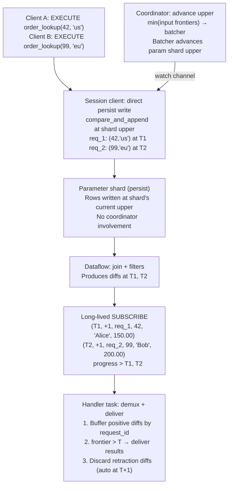
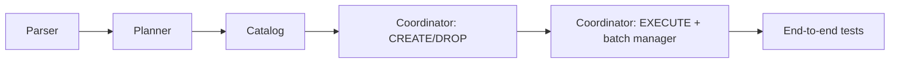

# Standing queries

## The problem

Materialize's current query path processes each SELECT independently: parse, plan, optimize, execute.
For high-throughput workloads where many clients issue the same parameterized query, this per-query overhead dominates.
Session-scoped prepared statements help with planning overhead but still execute each query individually.
There is no mechanism to amortize execution cost across multiple clients issuing the same parameterized query.

## Success criteria

* A user can create a durable, parameterized query object that lives on a cluster.
* Multiple clients can execute the query concurrently, with the system batching executions for higher throughput.
* End-to-end latency is <100ms at p99 under moderate load.
* Throughput significantly exceeds the equivalent SELECT path (aspirational target: 100k executions/s).
* Standard DDL operations work: DROP, EXPLAIN, SHOW, RBAC.

## Out of scope

* **Isolation**: v1 uses serializable isolation (min input frontier, 1s lag). Strict serializable would use max input frontier.
* **ALTER**: Changing the query body requires drop and recreate.
* **Complex queries**: Multi-object joins, aggregations, GROUP BY, CTEs, subqueries.
* **SELECT \***: v1 may require explicit column lists if it simplifies the implementation.
* **Expression support in SELECT list**: v1 requires column references only; expressions are a fast follow-up.
* **Per-row error reporting**: A single error taints the entire collection (existing Materialize limitation).
* **Backpressure**: The coordinator buffers without rejecting requests.
* **Ephemeral tables**: v1 uses regular tables with explicit retractions.

## Solution proposal

### User-facing syntax

**CREATE**:

```sql
CREATE STANDING QUERY [IF NOT EXISTS] <name>(<param> <type>, ...) IN CLUSTER <cluster>
AS SELECT <columns> FROM <object> WHERE <param> = $N [AND ...] [AND <static_filters>];
```

Example:

```sql
CREATE STANDING QUERY order_lookup(oid INT, region TEXT) IN CLUSTER analytics
AS SELECT order_id, customer, amount
FROM orders
WHERE order_id = $1 AND region = $2 AND status = 'shipped';
```

Restrictions (v1):
* The body must be a simple SELECT from a single object (table, view, materialized view).
* Each parameter must appear in exactly one equality predicate in the WHERE clause.
* Additional static (non-parameterized) filter predicates are allowed.
* The SELECT list contains explicit column references only.

**EXECUTE**:

```sql
EXECUTE STANDING QUERY <name>(<value>, ...);
```

Returns results like a normal SELECT: row description, data rows, command complete.
A single execution can return 0..N rows.

**Other DDL**:

```sql
DROP STANDING QUERY [IF EXISTS] <name> [CASCADE];
EXPLAIN STANDING QUERY <name>;  -- shows the dataflow plan of the internal subscribe
SHOW STANDING QUERIES [IN CLUSTER <cluster>];
```

Standard RBAC applies (USAGE on the standing query, SELECT on the underlying object).

### Internal architecture

#### Catalog objects

Creating a standing query produces two catalog objects:

1. **The standing query itself** — a first-class catalog item with name, parameter types, result schema, cluster, and an embedded view definition (the rewritten join query). This follows the same pattern as materialized views, which embed their expression directly rather than referencing a separate view.
2. **Parameter table** — `mz_standing_queries.params_<id>(request_id UUID, param_1 <T1>, param_2 <T2>, ...)`. A regular table in a dedicated `mz_standing_queries` schema to avoid namespace collisions. The `request_id` is a coordinator-generated unique ID that maps to `(session_id, request_id)` on the coordinator side.

The parameter table is not user-modifiable.
It is dropped when the standing query is dropped.
Dependency tracking reuses the existing cascade infrastructure: dropping the underlying object cascades to the standing query.

#### Query rewrite

The user's query:

```sql
SELECT order_id, customer, amount FROM orders
WHERE order_id = $1 AND region = $2 AND status = 'shipped'
```

Is rewritten to the standing query's embedded expression:

```sql
SELECT p.request_id, o.order_id, o.customer, o.amount
FROM mz_standing_queries.params_<id> p
JOIN orders o ON o.order_id = p.param_1 AND o.region = p.param_2
WHERE o.status = 'shipped'
```

The equality predicates on parameters become join conditions.
Static filters remain as WHERE predicates on the target object.
`request_id` is projected through so the coordinator can demux results.
The dataflow creates indexes/arrangements as needed on both sides of the join.

#### Execution flow



#### Execution architecture

The execution path bypasses the coordinator entirely.
Each standing query has three components:

1. **`StandingQueryExecuteClient`**: shared handle holding a `WriteHandle` for the param shard.
   Session clients write param rows via direct `compare_and_append` at the shard's current upper.
   This avoids the collection manager's idle tick (1s) and `now()`-based timestamp inflation.
   The param collection uses `DataSource::Other` — no write task manages it.

2. **Handler task**: per-standing-query async task (off the coordinator loop) that:
   * Receives subscribe batches forwarded by the coordinator.
   * Receives flush notifications from clients (write_ts → request_ids).
   * Buffers result rows per request_id.
   * When the subscribe frontier advances past a write timestamp T, delivers results via oneshot channels.
   * Retracts delivered param rows.
   * Advances the param shard upper when notified by the coordinator.

3. **Upper tracking**: the coordinator computes the minimum write frontier of the standing query's non-param input collections (the base tables) on every `AdvanceTimelines` message.
   It sends the target upper (lagged by 1s) to the handler task via a `watch` channel.
   The handler advances the param shard upper to that target.
   This breaks the circular dependency: subscribe frontier = min(all input uppers), so if param upper were driven by the subscribe frontier, it would never advance.

#### Param shard upper and isolation

The param shard upper determines the timestamp at which param writes land.
The lag between input frontiers and param shard upper controls isolation:

* **Serializable** (current): use min(input frontiers) - 1s. All inputs have reached this timestamp.
* **Strict serializable** (future): use max(input frontiers). Results reflect the latest state of every input.

The 1s lag provides a serializable isolation window while allowing compaction to proceed.

#### Batch lifecycle

1. **Write**: The session client generates a `request_id` (UUID), registers a result oneshot channel, and sends the param row to the batcher task. The batcher writes self-retracting pairs via `compare_and_append`: `(row, T, +1)` and `(row, T+1, -1)` in a single batch, advancing the upper by 2. Each param row exists for exactly one timestamp.
2. **Notify**: The batcher sends a flush notification to the handler task mapping write_ts T → request_ids for the batch.
3. **Observe**: The SUBSCRIBE emits positive diffs at timestamp T (join results) and negative diffs at T+1 (automatic retractions).
4. **Progress**: When the SUBSCRIBE frontier advances past T, the handler knows all results for this request are in. Empty result sets (request_ids with no diffs) are detected at this point.
5. **Deliver**: The handler groups result rows by `request_id` and sends them via the oneshot channel. Only positive diffs are buffered; negative diffs (retractions at T+1) are discarded.

Multiple requests can be in-flight concurrently.
The handler demuxes by timestamp and request_id.

#### Future: SUBSCRIBE to a standing query

The self-retracting write pattern naturally extends to a streaming mode where clients subscribe to a standing query's results rather than executing one-shot queries. In this mode, the param row would be written *without* the automatic retraction at T+1 — only the `(row, T, +1)` is written. The param row persists in the arrangement, and the client receives ongoing updates (inserts and deletes on the result set) as the underlying data changes. When the client cancels the subscribe or disconnects, the retraction `(row, T', -1)` is emitted to clean up.

This would give users a way to say "watch this parameterized query" and receive a stream of diffs, combining the convenience of standing query parameters with the streaming semantics of SUBSCRIBE.

#### SUBSCRIBE lifecycle

* One long-lived SUBSCRIBE per standing query, started when the standing query is created.
* Runs on the standing query's cluster.
* Modeled after existing introspection subscribes, extended for this use case.
* The SUBSCRIBE is not replica-targeted; cluster restarts are invisible to the coordinator. On environmentd restart, the coordinator clears all parameter tables (removes stale rows from the previous incarnation) and re-establishes the SUBSCRIBE for each standing query.
* When idle (no parameter rows), the SUBSCRIBE consumes minimal resources.

#### Observability

A system table `mz_standing_queries` exposes:

| Column | Type | Description |
|--------|------|-------------|
| id | text | Global ID |
| name | text | User-given name |
| cluster_id | text | Cluster the dataflow runs on |
| parameter_types | text[] | Parameter type names |
| statement | text | The standing query's SQL statement |

## Minimal viable prototype

The prototype would demonstrate the core execution path without full catalog integration:

1. Manually create a parameter table and join view using existing SQL.
2. Use a long-lived SUBSCRIBE on the view.
3. Write a coordinator-side script that batches INSERTs, reads SUBSCRIBE output, and delivers results.
4. Measure latency and throughput to validate the <100ms target.

This can be done without any Rust changes and would validate the fundamental data-plane design.

## Alternatives

### Per-execution SUBSCRIBE

Instead of a long-lived SUBSCRIBE with a parameter table, each batch could issue a fresh `SUBSCRIBE AS OF <timestamp> UP TO <timestamp+1>` against a view parameterized differently.
This was rejected because each new SUBSCRIBE renders a fresh dataflow, which is expensive and defeats the purpose of amortizing setup cost.

### Extend session prepared statements

Session-scoped prepared statements could be extended with batching and caching.
This was rejected because prepared statements are inherently session-scoped and single-use, making cross-client batching impossible.

### Materialized view per parameter combination

Users could create a materialized view for each parameter combination they care about.
This was rejected because it requires knowing parameter values in advance, doesn't scale to arbitrary parameter spaces, and wastes resources maintaining arrangements for all combinations.

## Evaluation

### Benchmark setup

* **Dataset**: 100k orders, `customer_id = g % 100` (~1000 rows per customer).
* **Standing query**: `SELECT id, customer_id, amount FROM orders WHERE customer_id = cid` — returns ~1000 rows per execution.
* **SELECT baseline**: Same query as `SELECT id, customer_id, amount FROM orders WHERE customer_id = 42` — uses fast-path index lookup (no dataflow rendered).
* **Duration**: 15s per data point, single-threaded Python benchmark client with psycopg3.
* **Environment**: Local `bin/environmentd --optimized`, single `quickstart` cluster.

### Results

| Connections | SQ QPS | SQ p50 (ms) | SQ p99 (ms) | SELECT QPS | SELECT p50 (ms) | SELECT p99 (ms) | Speedup |
|-------------|--------|-------------|-------------|------------|-----------------|-----------------|---------|
| 1           | 59     | 12          | 43          | 6          | 65              | 725             | 10x     |
| 4           | 137    | 17          | 675         | 13         | 307             | 690             | 11x     |
| 8           | 259    | 20          | 828         | 26         | 290             | 604             | 10x     |
| 16          | 426    | 30          | 82          | 54         | 210             | 573             | 8x      |
| 32          | 718    | 35          | 109         | 131        | 239             | 486             | 5x      |
| 64          | 386    | 148         | 945         | 137        | 444             | 902             | 3x      |
| 128         | 567    | 236         | 1104        | 149        | 776             | 2016            | 4x      |
| 256         | 898    | 286         | 356         | 144        | 1259            | 10083           | 6x      |

### Analysis

**Throughput.** Standing queries achieve 5–10x higher throughput than index SELECTs across all concurrency levels. Peak throughput is ~900 QPS at 256 connections. SELECT throughput plateaus at ~150 QPS beyond 32 connections due to coordinator contention. Standing query throughput scales with concurrency because the batcher amortizes persist writes — larger batches at higher concurrency.

**Latency.** At low concurrency (1–32 connections), standing query median latency is 12–35ms vs 65–239ms for SELECTs. At high concurrency (128–256), standing query latency increases to 236–286ms due to batch queuing, but SELECT latency degrades much worse (776–1259ms) since each query contends for the coordinator.

**Throughput dip at 64 connections.** There's a noticeable dip in standing query QPS at 64 connections (386 QPS vs 718 at 32). This likely reflects a transition point where the batcher's adaptive collect window hasn't yet scaled up to match the increased concurrency. At 128+ connections, larger batch sizes compensate and throughput recovers.

**Tail latency.** Standing query p99 is volatile at low concurrency (4–8 connections show ~700–800ms spikes) due to occasional persist write latency outliers. At 32+ connections, p99 stabilizes because batching amortizes these spikes across more requests. SELECT p99 degrades monotonically with concurrency.

**Distance from targets.** The 100k QPS aspirational target remains far off. The bottleneck is persist write latency (~10–30ms per `compare_and_append`), which bounds batch throughput regardless of batch size. Achieving 100k QPS would require either sub-millisecond persist writes or a fundamentally different write path (e.g., in-memory parameter passing without persistence).

### Known issue: subscribe accumulation

Under sustained load, the subscribe's internal arrangements accumulate param rows and join results faster than compaction can clean them up. After extended runs (minutes), this triggers `max_result_size` errors. The self-retracting write pattern (each param row exists for exactly one timestamp) bounds the *logical* working set, but the *physical* arrangement retains data until the `since` frontier advances. This needs investigation into compaction pacing for the param shard.

## Implementation plan

This section maps the design to the Materialize codebase.
The implementation is organized into layers, bottom-up: parser → planner → catalog → coordinator → pgwire.
Each layer can be built and tested incrementally.

### Layer 1: SQL parser (`src/sql-parser/`, `src/sql-lexer/`)

**Keywords.**
Add `Standing` to `src/sql-lexer/src/keywords.txt`.
The build script auto-generates the `Keyword` enum from this file.

**AST nodes** in `src/sql-parser/src/ast/defs/statement.rs`:

* Add `ObjectType::StandingQuery` to the `ObjectType` enum (used by DROP, SHOW, EXPLAIN).
  Wire it through `lives_in_schema() → true` and `AstDisplay → "STANDING QUERY"`.
* Define `CreateStandingQueryStatement<T>` struct:
  ```
  name: UnresolvedItemName
  params: Vec<(Ident, DataType)>      // named, typed parameters
  in_cluster: T::ClusterName
  query: Query<T>                     // the AS SELECT body
  if_not_exists: bool
  ```
* Add `Statement::CreateStandingQuery(CreateStandingQueryStatement<T>)` variant.
* Define `ExecuteStandingQueryStatement<T>` struct:
  ```
  name: UnresolvedItemName
  params: Vec<Expr<T>>                // positional parameter values
  ```
* Add `Statement::ExecuteStandingQuery(ExecuteStandingQueryStatement<T>)` variant.
* DROP and SHOW reuse existing `DropObjectsStatement` and `ShowObjectsStatement` via `ObjectType::StandingQuery`.
* EXPLAIN reuses `ExplainPlanStatement` by extending `Explainee` with a `StandingQuery` variant.

**Parser rules** in `src/sql-parser/src/parser.rs`:

* `parse_create()`: after the `CONTINUAL TASK` branch, add a `peek_keywords(&[STANDING, QUERY])` branch that calls `parse_create_standing_query()`.
* `parse_create_standing_query()`: parse `name`, `(param_name type, ...)`, `IN CLUSTER`, `AS`, then delegate to `parse_query()` for the SELECT body.
* `parse_statement_inner()`: add an `EXECUTE STANDING` branch that calls `parse_execute_standing_query()`.
  This is distinct from the existing `EXECUTE` (prepared statements) because the next token is `STANDING`.
* `expect_object_type()` / `expect_plural_object_type()`: add `STANDING QUERY` / `STANDING QUERIES` arms.

### Layer 2: SQL planner (`src/sql/`)

**Plan types** in `src/sql/src/plan.rs`:

* `CreateStandingQueryPlan`:
  ```
  name: QualifiedItemName
  params: Vec<(String, ScalarType)>       // parameter names and types
  result_desc: RelationDesc               // output columns (from SELECT list)
  target_id: GlobalId                     // the FROM object
  raw_expr: HirRelationExpr              // the validated query body
  cluster_id: ClusterId
  resolved_ids: ResolvedIds
  if_not_exists: bool
  ```
* `ExecuteStandingQueryPlan`:
  ```
  id: GlobalId                            // resolved standing query
  params: Vec<(Row, ScalarType)>          // evaluated parameter values
  ```
* Add `Plan::CreateStandingQuery` and `Plan::ExecuteStandingQuery` variants.

**Planning functions** in `src/sql/src/plan/statement/ddl.rs`:

* `plan_create_standing_query()`:
  1. Resolve parameter names and types.
  2. Call `query::plan_root_query()` on the SELECT body with the declared parameter types.
  3. **Validate restrictions**: single FROM item (no joins), no aggregations/GROUP BY/HAVING, no CTEs/subqueries.
     Walk the planned `HirRelationExpr` to check these structurally.
  4. **Validate parameter usage**: each parameter must appear in exactly one top-level `WHERE col = $N` predicate.
     Extract these by walking `HirScalarExpr` predicates.
  5. **Validate SELECT list**: only column references, no expressions.
  6. Resolve `IN CLUSTER`.
  7. Return `CreateStandingQueryPlan`.

**Planning functions** in `src/sql/src/plan/statement/scl.rs` (or a new `standing_query.rs`):

* `plan_execute_standing_query()`:
  1. Resolve the standing query name to a `CatalogItemId`.
  2. Look up the standing query's parameter types from the catalog.
  3. Evaluate and type-check the provided parameter expressions against declared types (similar to `query::plan_params()`).
  4. Return `ExecuteStandingQueryPlan`.

**Statement dispatch** in `src/sql/src/plan/statement.rs`:

* Wire `Statement::CreateStandingQuery` → `plan_create_standing_query()`.
* Wire `Statement::ExecuteStandingQuery` → `plan_execute_standing_query()`.

### Layer 3: Catalog (`src/catalog/`)

**New item type** in `src/catalog/src/memory/objects.rs`:

* Add `CatalogItem::StandingQuery(StandingQuery)` variant to the `CatalogItem` enum.
* Define `StandingQuery` struct (modeled after `MaterializedView`):
  ```
  create_sql: String
  global_id: GlobalId
  params: Vec<(String, ScalarType)>       // parameter names and types
  result_desc: RelationDesc               // output columns
  target_id: GlobalId                     // the FROM object
  param_table_id: CatalogItemId           // internal parameter table
  raw_expr: Arc<HirRelationExpr>          // the rewritten join query
  optimized_expr: Arc<OptimizedMirRelationExpr>
  resolved_ids: ResolvedIds
  dependencies: DependencyIds
  cluster_id: ClusterId
  ```
  The standing query embeds the view definition directly (like materialized views) rather than referencing a separate catalog view.
* Wire through all `CatalogItem` match arms: `typ()`, `uses()`, `references()`, `relation_desc()` (returns the result desc), `into_serialized()`, `global_id_for_version()`.

**Persistence** in `src/catalog-protos/src/objects.rs`:

* Add `StandingQuery = 12` to the `CatalogItemType` protobuf enum.

**Item type detection** in `src/catalog/src/durable/objects.rs`:

* Add `"STANDING" => CatalogItemType::StandingQuery` branch in `item_type()`.

**Schema** in `src/sql/src/catalog.rs`:

* Add `CatalogItemType::StandingQuery` variant to the SQL-layer enum.

**Internal objects.**
The parameter table is a standard `CatalogItem::Table` created in the `mz_standing_queries` schema.
The internal view is not a separate catalog item; instead, the standing query itself holds the view definition (the rewritten join query as `raw_expr` / `optimized_expr`), following the same pattern as materialized views.
The standing query's dataflow is rendered from this embedded expression, not from a separate view.
Dependency edges: standing query → param table, standing query → target object.
Dropping the standing query cascades to the param table.
Dropping the target object cascades to the standing query (and its param table).

**Builtin table** in `src/catalog/src/builtin.rs`:

* Define `MZ_STANDING_QUERIES` builtin table in `mz_internal` schema with columns: `id`, `name`, `cluster_id`, `parameter_types`, `statement`.

### Layer 4: Coordinator (`src/adapter/`)

**Sequencing** in `src/adapter/src/coord/sequencer.rs`:

* Add `Plan::CreateStandingQuery` and `Plan::ExecuteStandingQuery` arms to `sequence_plan()`.

**CREATE sequencing** in a new file `src/adapter/src/coord/sequencer/inner/create_standing_query.rs`:

`sequence_create_standing_query()`:
1. Allocate `CatalogItemId`s for the standing query and parameter table.
2. **Create parameter table**: build a `CreateTablePlan` for `mz_standing_queries.params_<id>` with columns `(request_id UUID, param_1 <T1>, param_2 <T2>, ...)`.
3. **Rewrite query**: transform the user's query into a join between the parameter table and the target object.
   Parameter equality predicates (`col = $N`) become join conditions (`target.col = params.param_N`).
   Static filters remain as WHERE clauses.
   Project `request_id` as the first output column.
   The rewritten expression is stored directly in the standing query catalog item (like a materialized view's expression).
4. **Create standing query catalog entry**: insert the `StandingQuery` item with the rewritten expression and a reference to the parameter table.
5. **Start SUBSCRIBE**: create a long-lived `ActiveSubscribe` on the standing query's dataflow, modeled after introspection subscribes (`src/adapter/src/coord/introspection.rs`).
   The subscribe runs on the standing query's cluster with `emit_progress: true`.
6. **Register handler**: install a coordinator-side handler that reads from the SUBSCRIBE channel and demuxes results.

**EXECUTE path** — bypasses the coordinator entirely:

Session clients obtain a `StandingQueryExecuteClient` handle (cached after first use) and call `execute()` directly.
The coordinator is not involved in the hot path.

`StandingQueryExecuteClient` (`src/adapter/src/standing_query_client.rs`):
* Holds a `WriteHandle` for the param shard (sole writer).
* Holds an `mpsc` sender for flush notifications to the handler task.
* Holds a shared `BTreeMap<Uuid, oneshot::Sender<Vec<Row>>>` for result delivery.
* `execute()`:
  1. Generate `request_id` (UUID).
  2. Build param row: `(request_id, param_1, ..., param_N)`.
  3. Register result oneshot channel.
  4. `compare_and_append` the param row at the shard's current upper.
  5. Send flush notification (write_ts → request_id) to the handler task.
  6. Await results on the oneshot channel.

**Handler task** (`src/adapter/src/coord/standing_query_handler.rs`):

One async task per standing query, runs off the coordinator loop.
Uses `tokio::select!` over three channels:
1. **Subscribe batches** (from coordinator): buffer positive diffs by request_id. When frontier advances past a write_ts, deliver results via oneshot and retract param rows.
2. **Flush notifications** (from clients): register write_ts → request_id mappings.
3. **Advance upper** (from coordinator via `watch` channel): advance param shard upper to keep it in sync with input frontiers.

**Coordinator state** (`src/adapter/src/coord/standing_query_state.rs`):

`ActiveStandingQuery` per standing query:
* `input_ids: BTreeSet<GlobalId>` — non-param input collections for upper tracking.
* `subscribe_tx` — forwards subscribe batches to the handler task.
* `advance_upper_tx: watch::Sender<Timestamp>` — sends target upper to handler.
* `client: StandingQueryExecuteClient` — shared with session clients via `GetStandingQueryClient` command.

`advance_standing_query_uppers()` runs on every `AdvanceTimelines` message:
computes min(input write frontiers) - 1s and sends it via the watch channel.

**Response path.**
The standing query's `ExecuteResponse` uses `SendingRowsImmediate { rows }` to return results like a normal SELECT.
The row description is the standing query's result schema (fixed at CREATE time), excluding the internal `request_id` column.

**Environmentd restart.**
The SUBSCRIBE is not replica-targeted; cluster restarts are invisible to the coordinator.
On environmentd startup:
1. Clear all parameter tables (DELETE all rows) to remove stale requests from a previous incarnation.
2. Re-establish the long-lived SUBSCRIBE for each standing query.
There are no pending `ExecuteContext`s to error since environmentd restarted — all client connections are gone.

**DROP sequencing.**
Handled by the existing `DropObjectsPlan` path.
The cascade infrastructure drops the parameter table.
The coordinator must also: cancel the SUBSCRIBE, drain and error any pending requests, and clean up the batch manager state.

**Message types** in `src/adapter/src/coord.rs`:

* Add `Message::StandingQueryResults { standing_query_id, rows }` — sent by the SUBSCRIBE reader task to the coordinator for result delivery.

Wire these through `message_handler.rs`.

### Layer 5: pgwire (`src/pgwire/`)

**Minimal changes.**
`EXECUTE STANDING QUERY` is a regular SQL statement parsed and planned like any other.
It flows through the standard `query()` or `execute()` path in `src/pgwire/src/protocol.rs`.
The coordinator returns `ExecuteResponse::SendingRowsImmediate`, which pgwire already handles — it sends `RowDescription`, `DataRow`s, and `CommandComplete`.

No new pgwire protocol handling is needed.

### Implementation order

The layers have the following dependency order:



Suggested implementation phases:

1. **Phase 1 — Parse and plan**: parser AST, keywords, planner validation.
   Testable with `EXPLAIN` (parse → plan → print).
2. **Phase 2 — Catalog**: new item type, persistence, builtin table, internal object creation.
   Testable by verifying `CREATE STANDING QUERY` creates the expected catalog entries.
3. **Phase 3 — CREATE/DROP sequencing**: wire up catalog writes, internal table/view creation, SUBSCRIBE startup.
   Testable by creating a standing query and inspecting `mz_standing_queries` and the parameter table.
4. **Phase 4 — EXECUTE path**: batch manager, SUBSCRIBE reader, result demux, response delivery.
   Testable end-to-end with `EXECUTE STANDING QUERY`.
5. **Phase 5 — Edge cases**: cluster restart recovery, concurrent batches, empty results, error propagation, DROP with in-flight requests.

## Open questions

* **Error propagation**: A single error taints the entire collection in Materialize's current model. Standing queries amplify this since many clients share one dataflow. Should we add error detection and dataflow restart as a mitigation?
* **Subscribe accumulation**: Under sustained load, the subscribe's arrangements grow because compaction doesn't keep pace with param writes. Self-retracting writes bound the logical working set (each param row exists for one timestamp), but the physical arrangement retains data until the `since` frontier advances. This causes `max_result_size` errors after extended runs.
* **Persist write latency floor**: The minimum persist write latency (~10-30ms) dominates the end-to-end budget. Peak throughput of ~900 QPS at 256 connections is far from the 100k aspirational target. Achieving higher throughput would require sub-millisecond persist writes or a non-persistent parameter path.
* **Isolation level**: Currently serializable (min input frontier). Strict serializable would use max input frontier. Should this be configurable?
