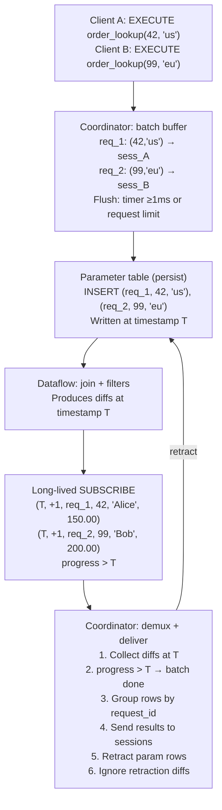
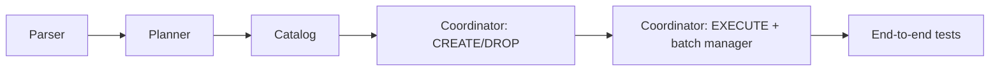

# Standing queries

## The problem

Materialize's current query path processes each SELECT independently: parse, plan, optimize, execute.
For high-throughput workloads where many clients issue the same parameterized query, this per-query overhead dominates.
Session-scoped prepared statements help with planning overhead but still execute each query individually.
There is no mechanism to amortize execution cost across multiple clients issuing the same parameterized query.

## Success criteria

* A user can create a durable, parameterized query object that lives on a cluster.
* Multiple clients can execute the query concurrently, with the system batching executions for higher throughput.
* End-to-end latency is <100ms at p99 under moderate load.
* Throughput significantly exceeds the equivalent SELECT path (aspirational target: 100k executions/s).
* Standard DDL operations work: DROP, EXPLAIN, SHOW, RBAC.

## Out of scope

* **Isolation**: v1 uses table-determined timestamps. A future design could use a future timestamp to insert the query.
* **ALTER**: Changing the query body requires drop and recreate.
* **Complex queries**: Multi-object joins, aggregations, GROUP BY, CTEs, subqueries.
* **SELECT \***: v1 may require explicit column lists if it simplifies the implementation.
* **Expression support in SELECT list**: v1 requires column references only; expressions are a fast follow-up.
* **Per-row error reporting**: A single error taints the entire collection (existing Materialize limitation).
* **Backpressure**: The coordinator buffers without rejecting requests.
* **Ephemeral tables**: v1 uses regular tables with explicit retractions.

## Solution proposal

### User-facing syntax

**CREATE**:

```sql
CREATE STANDING QUERY [IF NOT EXISTS] <name>(<param> <type>, ...) IN CLUSTER <cluster>
AS SELECT <columns> FROM <object> WHERE <param> = $N [AND ...] [AND <static_filters>];
```

Example:

```sql
CREATE STANDING QUERY order_lookup(oid INT, region TEXT) IN CLUSTER analytics
AS SELECT order_id, customer, amount
FROM orders
WHERE order_id = $1 AND region = $2 AND status = 'shipped';
```

Restrictions (v1):
* The body must be a simple SELECT from a single object (table, view, materialized view).
* Each parameter must appear in exactly one equality predicate in the WHERE clause.
* Additional static (non-parameterized) filter predicates are allowed.
* The SELECT list contains explicit column references only.

**EXECUTE**:

```sql
EXECUTE STANDING QUERY <name>(<value>, ...);
```

Returns results like a normal SELECT: row description, data rows, command complete.
A single execution can return 0..N rows.

**Other DDL**:

```sql
DROP STANDING QUERY [IF EXISTS] <name> [CASCADE];
EXPLAIN STANDING QUERY <name>;  -- shows the dataflow plan of the internal subscribe
SHOW STANDING QUERIES [IN CLUSTER <cluster>];
```

Standard RBAC applies (USAGE on the standing query, SELECT on the underlying object).

### Internal architecture

#### Catalog objects

Creating a standing query produces two catalog objects:

1. **The standing query itself** — a first-class catalog item with name, parameter types, result schema, cluster, and an embedded view definition (the rewritten join query). This follows the same pattern as materialized views, which embed their expression directly rather than referencing a separate view.
2. **Parameter table** — `mz_standing_queries.params_<id>(request_id UUID, param_1 <T1>, param_2 <T2>, ...)`. A regular table in a dedicated `mz_standing_queries` schema to avoid namespace collisions. The `request_id` is a coordinator-generated unique ID that maps to `(session_id, request_id)` on the coordinator side.

The parameter table is not user-modifiable.
It is dropped when the standing query is dropped.
Dependency tracking reuses the existing cascade infrastructure: dropping the underlying object cascades to the standing query.

#### Query rewrite

The user's query:

```sql
SELECT order_id, customer, amount FROM orders
WHERE order_id = $1 AND region = $2 AND status = 'shipped'
```

Is rewritten to the standing query's embedded expression:

```sql
SELECT p.request_id, o.order_id, o.customer, o.amount
FROM mz_standing_queries.params_<id> p
JOIN orders o ON o.order_id = p.param_1 AND o.region = p.param_2
WHERE o.status = 'shipped'
```

The equality predicates on parameters become join conditions.
Static filters remain as WHERE predicates on the target object.
`request_id` is projected through so the coordinator can demux results.
The dataflow creates indexes/arrangements as needed on both sides of the join.

#### Execution flow



#### Batch lifecycle

1. **Buffer**: The coordinator buffers incoming EXECUTE requests per standing query.
2. **Flush**: A timer fires (≥1ms) or the outstanding request limit is reached. The coordinator assigns a `request_id` (UUID) to each request and maps `request_id → (session_id, connection state)` in an internal lookup table.
3. **Insert**: A single multi-row INSERT writes all parameter rows to the param table. This lands at some table-determined timestamp T.
4. **Observe**: The long-lived SUBSCRIBE emits diffs at timestamp T containing the join results. Each result row includes the `request_id`.
5. **Progress**: When the SUBSCRIBE frontier advances past T, the coordinator knows all results for this batch are in. Empty result sets (request_ids with no diffs) are detected at this point.
6. **Deliver**: The coordinator groups result rows by `request_id`, looks up the corresponding session, and sends the result set using the standard SELECT response path. Only the first snapshot at timestamp T is returned; results at later timestamps are not delivered.
7. **Retract**: The coordinator issues a DELETE to remove the parameter rows. This lands at some T' > T.
8. **Ignore retractions**: The SUBSCRIBE emits negative diffs at T'. The coordinator recognizes these request_ids as already-fulfilled and discards the diffs.

Multiple batches can be in-flight concurrently (batch at T1 still awaiting progress, new batch at T2 inserted).
The coordinator demuxes by timestamp and request_id.

#### SUBSCRIBE lifecycle

* One long-lived SUBSCRIBE per standing query, started when the standing query is created.
* Runs on the standing query's cluster.
* Modeled after existing introspection subscribes, extended for this use case.
* The SUBSCRIBE is not replica-targeted; cluster restarts are invisible to the coordinator. On environmentd restart, the coordinator clears all parameter tables (removes stale rows from the previous incarnation) and re-establishes the SUBSCRIBE for each standing query.
* When idle (no parameter rows), the SUBSCRIBE consumes minimal resources.

#### Observability

A system table `mz_standing_queries` exposes:

| Column | Type | Description |
|--------|------|-------------|
| id | text | Global ID |
| name | text | User-given name |
| cluster_id | text | Cluster the dataflow runs on |
| parameter_types | text[] | Parameter type names |
| statement | text | The standing query's SQL statement |

## Minimal viable prototype

The prototype would demonstrate the core execution path without full catalog integration:

1. Manually create a parameter table and join view using existing SQL.
2. Use a long-lived SUBSCRIBE on the view.
3. Write a coordinator-side script that batches INSERTs, reads SUBSCRIBE output, and delivers results.
4. Measure latency and throughput to validate the <100ms target.

This can be done without any Rust changes and would validate the fundamental data-plane design.

## Alternatives

### Per-execution SUBSCRIBE

Instead of a long-lived SUBSCRIBE with a parameter table, each batch could issue a fresh `SUBSCRIBE AS OF <timestamp> UP TO <timestamp+1>` against a view parameterized differently.
This was rejected because each new SUBSCRIBE renders a fresh dataflow, which is expensive and defeats the purpose of amortizing setup cost.

### Extend session prepared statements

Session-scoped prepared statements could be extended with batching and caching.
This was rejected because prepared statements are inherently session-scoped and single-use, making cross-client batching impossible.

### Materialized view per parameter combination

Users could create a materialized view for each parameter combination they care about.
This was rejected because it requires knowing parameter values in advance, doesn't scale to arbitrary parameter spaces, and wastes resources maintaining arrangements for all combinations.

## Evaluation

Benchmark the standing query path against the equivalent SELECT path using the following methodology:

* **Varying parallelism**: Test with 1, 10, 50, 100, 500 concurrent connections, each issuing standing query executions in a tight loop.
* **Throughput**: Measure total executions/s at each concurrency level. Compare against the same query issued as individual SELECTs.
* **Latency**: Measure end-to-end latency (client sends EXECUTE to client receives last result row). Report as a CCDF (complementary cumulative distribution function) to reveal tail latency behavior.
* **Batch efficiency**: Vary the batch window (1ms, 5ms, 10ms) and measure the throughput/latency tradeoff.
* **Query complexity**: Test with simple key lookups and with additional static filters to understand how query complexity affects the pipeline.

The parameter table size under load is O(outstanding requests), bounded by the batch window and processing latency.

## Implementation plan

This section maps the design to the Materialize codebase.
The implementation is organized into layers, bottom-up: parser → planner → catalog → coordinator → pgwire.
Each layer can be built and tested incrementally.

### Layer 1: SQL parser (`src/sql-parser/`, `src/sql-lexer/`)

**Keywords.**
Add `Standing` to `src/sql-lexer/src/keywords.txt`.
The build script auto-generates the `Keyword` enum from this file.

**AST nodes** in `src/sql-parser/src/ast/defs/statement.rs`:

* Add `ObjectType::StandingQuery` to the `ObjectType` enum (used by DROP, SHOW, EXPLAIN).
  Wire it through `lives_in_schema() → true` and `AstDisplay → "STANDING QUERY"`.
* Define `CreateStandingQueryStatement<T>` struct:
  ```
  name: UnresolvedItemName
  params: Vec<(Ident, DataType)>      // named, typed parameters
  in_cluster: T::ClusterName
  query: Query<T>                     // the AS SELECT body
  if_not_exists: bool
  ```
* Add `Statement::CreateStandingQuery(CreateStandingQueryStatement<T>)` variant.
* Define `ExecuteStandingQueryStatement<T>` struct:
  ```
  name: UnresolvedItemName
  params: Vec<Expr<T>>                // positional parameter values
  ```
* Add `Statement::ExecuteStandingQuery(ExecuteStandingQueryStatement<T>)` variant.
* DROP and SHOW reuse existing `DropObjectsStatement` and `ShowObjectsStatement` via `ObjectType::StandingQuery`.
* EXPLAIN reuses `ExplainPlanStatement` by extending `Explainee` with a `StandingQuery` variant.

**Parser rules** in `src/sql-parser/src/parser.rs`:

* `parse_create()`: after the `CONTINUAL TASK` branch, add a `peek_keywords(&[STANDING, QUERY])` branch that calls `parse_create_standing_query()`.
* `parse_create_standing_query()`: parse `name`, `(param_name type, ...)`, `IN CLUSTER`, `AS`, then delegate to `parse_query()` for the SELECT body.
* `parse_statement_inner()`: add an `EXECUTE STANDING` branch that calls `parse_execute_standing_query()`.
  This is distinct from the existing `EXECUTE` (prepared statements) because the next token is `STANDING`.
* `expect_object_type()` / `expect_plural_object_type()`: add `STANDING QUERY` / `STANDING QUERIES` arms.

### Layer 2: SQL planner (`src/sql/`)

**Plan types** in `src/sql/src/plan.rs`:

* `CreateStandingQueryPlan`:
  ```
  name: QualifiedItemName
  params: Vec<(String, ScalarType)>       // parameter names and types
  result_desc: RelationDesc               // output columns (from SELECT list)
  target_id: GlobalId                     // the FROM object
  raw_expr: HirRelationExpr              // the validated query body
  cluster_id: ClusterId
  resolved_ids: ResolvedIds
  if_not_exists: bool
  ```
* `ExecuteStandingQueryPlan`:
  ```
  id: GlobalId                            // resolved standing query
  params: Vec<(Row, ScalarType)>          // evaluated parameter values
  ```
* Add `Plan::CreateStandingQuery` and `Plan::ExecuteStandingQuery` variants.

**Planning functions** in `src/sql/src/plan/statement/ddl.rs`:

* `plan_create_standing_query()`:
  1. Resolve parameter names and types.
  2. Call `query::plan_root_query()` on the SELECT body with the declared parameter types.
  3. **Validate restrictions**: single FROM item (no joins), no aggregations/GROUP BY/HAVING, no CTEs/subqueries.
     Walk the planned `HirRelationExpr` to check these structurally.
  4. **Validate parameter usage**: each parameter must appear in exactly one top-level `WHERE col = $N` predicate.
     Extract these by walking `HirScalarExpr` predicates.
  5. **Validate SELECT list**: only column references, no expressions.
  6. Resolve `IN CLUSTER`.
  7. Return `CreateStandingQueryPlan`.

**Planning functions** in `src/sql/src/plan/statement/scl.rs` (or a new `standing_query.rs`):

* `plan_execute_standing_query()`:
  1. Resolve the standing query name to a `CatalogItemId`.
  2. Look up the standing query's parameter types from the catalog.
  3. Evaluate and type-check the provided parameter expressions against declared types (similar to `query::plan_params()`).
  4. Return `ExecuteStandingQueryPlan`.

**Statement dispatch** in `src/sql/src/plan/statement.rs`:

* Wire `Statement::CreateStandingQuery` → `plan_create_standing_query()`.
* Wire `Statement::ExecuteStandingQuery` → `plan_execute_standing_query()`.

### Layer 3: Catalog (`src/catalog/`)

**New item type** in `src/catalog/src/memory/objects.rs`:

* Add `CatalogItem::StandingQuery(StandingQuery)` variant to the `CatalogItem` enum.
* Define `StandingQuery` struct (modeled after `MaterializedView`):
  ```
  create_sql: String
  global_id: GlobalId
  params: Vec<(String, ScalarType)>       // parameter names and types
  result_desc: RelationDesc               // output columns
  target_id: GlobalId                     // the FROM object
  param_table_id: CatalogItemId           // internal parameter table
  raw_expr: Arc<HirRelationExpr>          // the rewritten join query
  optimized_expr: Arc<OptimizedMirRelationExpr>
  resolved_ids: ResolvedIds
  dependencies: DependencyIds
  cluster_id: ClusterId
  ```
  The standing query embeds the view definition directly (like materialized views) rather than referencing a separate catalog view.
* Wire through all `CatalogItem` match arms: `typ()`, `uses()`, `references()`, `relation_desc()` (returns the result desc), `into_serialized()`, `global_id_for_version()`.

**Persistence** in `src/catalog-protos/src/objects.rs`:

* Add `StandingQuery = 12` to the `CatalogItemType` protobuf enum.

**Item type detection** in `src/catalog/src/durable/objects.rs`:

* Add `"STANDING" => CatalogItemType::StandingQuery` branch in `item_type()`.

**Schema** in `src/sql/src/catalog.rs`:

* Add `CatalogItemType::StandingQuery` variant to the SQL-layer enum.

**Internal objects.**
The parameter table is a standard `CatalogItem::Table` created in the `mz_standing_queries` schema.
The internal view is not a separate catalog item; instead, the standing query itself holds the view definition (the rewritten join query as `raw_expr` / `optimized_expr`), following the same pattern as materialized views.
The standing query's dataflow is rendered from this embedded expression, not from a separate view.
Dependency edges: standing query → param table, standing query → target object.
Dropping the standing query cascades to the param table.
Dropping the target object cascades to the standing query (and its param table).

**Builtin table** in `src/catalog/src/builtin.rs`:

* Define `MZ_STANDING_QUERIES` builtin table in `mz_internal` schema with columns: `id`, `name`, `cluster_id`, `parameter_types`, `statement`.

### Layer 4: Coordinator (`src/adapter/`)

**Sequencing** in `src/adapter/src/coord/sequencer.rs`:

* Add `Plan::CreateStandingQuery` and `Plan::ExecuteStandingQuery` arms to `sequence_plan()`.

**CREATE sequencing** in a new file `src/adapter/src/coord/sequencer/inner/create_standing_query.rs`:

`sequence_create_standing_query()`:
1. Allocate `CatalogItemId`s for the standing query and parameter table.
2. **Create parameter table**: build a `CreateTablePlan` for `mz_standing_queries.params_<id>` with columns `(request_id UUID, param_1 <T1>, param_2 <T2>, ...)`.
3. **Rewrite query**: transform the user's query into a join between the parameter table and the target object.
   Parameter equality predicates (`col = $N`) become join conditions (`target.col = params.param_N`).
   Static filters remain as WHERE clauses.
   Project `request_id` as the first output column.
   The rewritten expression is stored directly in the standing query catalog item (like a materialized view's expression).
4. **Create standing query catalog entry**: insert the `StandingQuery` item with the rewritten expression and a reference to the parameter table.
5. **Start SUBSCRIBE**: create a long-lived `ActiveSubscribe` on the standing query's dataflow, modeled after introspection subscribes (`src/adapter/src/coord/introspection.rs`).
   The subscribe runs on the standing query's cluster with `emit_progress: true`.
6. **Register handler**: install a coordinator-side handler that reads from the SUBSCRIBE channel and demuxes results.

**EXECUTE sequencing** in a new file `src/adapter/src/coord/sequencer/inner/execute_standing_query.rs`:

`sequence_execute_standing_query()`:
1. Look up the standing query and validate RBAC.
2. Generate a `request_id` (UUID).
3. Map `request_id → ExecuteContext` in a per-standing-query lookup table (new coordinator state).
4. Enqueue `(request_id, param_values)` into the standing query's batch buffer.
5. Return without retiring the `ExecuteContext` — it stays open until results arrive.

**Batch manager** (new coordinator component):

A single task per standing query is responsible for flushing pending requests and retractions.
This provides natural elasticity: more incoming requests mean larger batches, which increases throughput at the cost of higher latency.

Per standing query, the coordinator maintains:
* A **batch buffer**: `Vec<(Uuid, Row)>` of pending requests.
* A **request map**: `BTreeMap<Uuid, ExecuteContext>` mapping request IDs to open sessions.
* An **in-flight set**: `BTreeMap<Timestamp, Vec<Uuid>>` tracking which request IDs were written at which timestamp.

The flush task runs in a loop:
1. Wait for at least one pending request (or a minimum interval since the last flush).
2. Drain the batch buffer.
3. Build a multi-row INSERT into the parameter table (reuse existing `insert_constant()` path from `src/adapter/src/coord/sequencer/inner.rs:2486`).
4. Record the set of request IDs against the write timestamp in the in-flight set.
5. After results are delivered, issue a batched DELETE for the parameter rows (retractions can be coalesced across multiple batches).

**SUBSCRIBE reader** (new coordinator component):

A task that reads from the `ActiveSubscribe` channel (`mpsc::UnboundedReceiver<PeekResponseUnary>`).
For each batch of rows received:
1. **Positive diffs** (diff = +1): group rows by `request_id` column, buffer them per request.
2. **Progress message** (frontier advances past timestamp T): for each request_id written at T, deliver results.
   * Look up the `ExecuteContext` from the request map.
   * Send results using `ExecuteResponse::SendingRowsImmediate` (rows are already materialized).
   * For request IDs with no rows at T, send empty result sets.
   * Issue a DELETE for the parameter rows at T (batch the retraction).
3. **Negative diffs** (retractions at T'): discard — the request IDs are already fulfilled.

**Response path.**
The standing query's `ExecuteResponse` uses `SendingRowsImmediate { rows }` to return results like a normal SELECT.
The row description is the standing query's result schema (fixed at CREATE time), excluding the internal `request_id` column.

**Environmentd restart.**
The SUBSCRIBE is not replica-targeted; cluster restarts are invisible to the coordinator.
On environmentd startup:
1. Clear all parameter tables (DELETE all rows) to remove stale requests from a previous incarnation.
2. Re-establish the long-lived SUBSCRIBE for each standing query.
There are no pending `ExecuteContext`s to error since environmentd restarted — all client connections are gone.

**DROP sequencing.**
Handled by the existing `DropObjectsPlan` path.
The cascade infrastructure drops the parameter table.
The coordinator must also: cancel the SUBSCRIBE, drain and error any pending requests, and clean up the batch manager state.

**Message types** in `src/adapter/src/coord.rs`:

* Add `Message::StandingQueryResults { standing_query_id, rows }` — sent by the SUBSCRIBE reader task to the coordinator for result delivery.

Wire these through `message_handler.rs`.

### Layer 5: pgwire (`src/pgwire/`)

**Minimal changes.**
`EXECUTE STANDING QUERY` is a regular SQL statement parsed and planned like any other.
It flows through the standard `query()` or `execute()` path in `src/pgwire/src/protocol.rs`.
The coordinator returns `ExecuteResponse::SendingRowsImmediate`, which pgwire already handles — it sends `RowDescription`, `DataRow`s, and `CommandComplete`.

No new pgwire protocol handling is needed.

### Implementation order

The layers have the following dependency order:



Suggested implementation phases:

1. **Phase 1 — Parse and plan**: parser AST, keywords, planner validation.
   Testable with `EXPLAIN` (parse → plan → print).
2. **Phase 2 — Catalog**: new item type, persistence, builtin table, internal object creation.
   Testable by verifying `CREATE STANDING QUERY` creates the expected catalog entries.
3. **Phase 3 — CREATE/DROP sequencing**: wire up catalog writes, internal table/view creation, SUBSCRIBE startup.
   Testable by creating a standing query and inspecting `mz_standing_queries` and the parameter table.
4. **Phase 4 — EXECUTE path**: batch manager, SUBSCRIBE reader, result demux, response delivery.
   Testable end-to-end with `EXECUTE STANDING QUERY`.
5. **Phase 5 — Edge cases**: cluster restart recovery, concurrent batches, empty results, error propagation, DROP with in-flight requests.

## Open questions

* **Error propagation**: A single error taints the entire collection in Materialize's current model. Standing queries amplify this since many clients share one dataflow. Should we add error detection and dataflow restart as a mitigation?
* **Retraction batching**: Every batch requires two persist writes (INSERT and DELETE). Can retractions be batched across multiple execution batches to reduce write frequency?
* **Persist write latency floor**: The minimum persist write latency (~5-10ms) dominates the end-to-end budget. How much can this be improved, and does it change the batching strategy?
