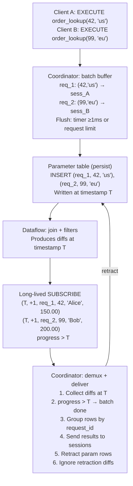

# Standing queries

## The problem

Materialize's current query path processes each SELECT independently: parse, plan, optimize, execute.
For high-throughput workloads where many clients issue the same parameterized query, this per-query overhead dominates.
Session-scoped prepared statements help with planning overhead but still execute each query individually.
There is no mechanism to amortize execution cost across multiple clients issuing the same parameterized query.

## Success criteria

* A user can create a durable, parameterized query object that lives on a cluster.
* Multiple clients can execute the query concurrently, with the system batching executions for higher throughput.
* End-to-end latency is <100ms at p99 under moderate load.
* Throughput significantly exceeds the equivalent SELECT path (aspirational target: 100k executions/s).
* Standard DDL operations work: DROP, EXPLAIN, SHOW, RBAC.

## Out of scope

* **Strict serializable isolation**: v1 uses table-determined timestamps. Inserting parameters at a coordinator-chosen future timestamp is deferred.
* **ALTER**: Changing the query body requires drop and recreate.
* **Complex queries**: Multi-object joins, aggregations, GROUP BY, CTEs, subqueries.
* **SELECT \***: v1 requires explicit column lists.
* **Expression support in SELECT list**: v1 requires column references only; expressions are a fast follow-up.
* **Per-row error reporting**: A single error taints the entire collection (existing Materialize limitation).
* **Backpressure**: The coordinator buffers without rejecting requests.
* **Ephemeral tables**: v1 uses regular tables with explicit retractions.

## Solution proposal

### User-facing syntax

**CREATE**:

```sql
CREATE STANDING QUERY [IF NOT EXISTS] <name>(<param> <type>, ...) IN CLUSTER <cluster>
AS SELECT <columns> FROM <object> WHERE <param> = $N [AND ...] [AND <static_filters>];
```

Example:

```sql
CREATE STANDING QUERY order_lookup(oid INT, region TEXT) IN CLUSTER analytics
AS SELECT order_id, customer, amount
FROM orders
WHERE order_id = $1 AND region = $2 AND status = 'shipped';
```

Restrictions (v1):
* The body must be a simple SELECT from a single object (table, view, materialized view).
* Each parameter must appear in exactly one equality predicate in the WHERE clause.
* Additional static (non-parameterized) filter predicates are allowed.
* The SELECT list contains explicit column references only.

**EXECUTE**:

```sql
EXECUTE STANDING QUERY <name>(<value>, ...);
```

Returns results like a normal SELECT: row description, data rows, command complete.
A single execution can return 0..N rows.

**Other DDL**:

```sql
DROP STANDING QUERY [IF EXISTS] <name> [CASCADE];
EXPLAIN STANDING QUERY <name>;  -- shows the dataflow plan of the internal subscribe
SHOW STANDING QUERIES [IN CLUSTER <cluster>];
```

Standard RBAC applies (USAGE on the standing query, SELECT on the underlying object).

### Internal architecture

#### Catalog objects

Creating a standing query produces three internal objects:

1. **The standing query itself** — a first-class catalog item with name, parameter types, result schema, cluster, and references to the internal objects below.
2. **Parameter table** — `mz_standing_queries.params_<id>(request_id UUID, param_1 <T1>, param_2 <T2>, ...)`. A regular table in a dedicated `mz_standing_queries` schema to avoid namespace collisions. The `request_id` is a coordinator-generated unique ID that maps to `(session_id, request_id)` on the coordinator side.
3. **Internal view** — encodes the join between the parameter table and the target object.

The parameter table and view are not user-modifiable.
They are dropped when the standing query is dropped.
Dependency tracking reuses the existing cascade infrastructure: dropping the underlying object cascades to the standing query.

#### Query rewrite

The user's query:

```sql
SELECT order_id, customer, amount FROM orders
WHERE order_id = $1 AND region = $2 AND status = 'shipped'
```

Is rewritten to an internal view:

```sql
SELECT p.request_id, o.order_id, o.customer, o.amount
FROM mz_standing_queries.params_<id> p
JOIN orders o ON o.order_id = p.param_1 AND o.region = p.param_2
WHERE o.status = 'shipped'
```

The equality predicates on parameters become join conditions.
Static filters remain as WHERE predicates on the target object.
`request_id` is projected through so the coordinator can demux results.
The dataflow creates indexes/arrangements as needed on both sides of the join.

#### Execution flow



#### Batch lifecycle

1. **Buffer**: The coordinator buffers incoming EXECUTE requests per standing query.
2. **Flush**: A timer fires (≥1ms) or the outstanding request limit is reached. The coordinator assigns a `request_id` (UUID) to each request and maps `request_id → (session_id, connection state)` in an internal lookup table.
3. **Insert**: A single multi-row INSERT writes all parameter rows to the param table. This lands at some table-determined timestamp T.
4. **Observe**: The long-lived SUBSCRIBE emits diffs at timestamp T containing the join results. Each result row includes the `request_id`.
5. **Progress**: When the SUBSCRIBE frontier advances past T, the coordinator knows all results for this batch are in. Empty result sets (request_ids with no diffs) are detected at this point.
6. **Deliver**: The coordinator groups result rows by `request_id`, looks up the corresponding session, and sends the result set using the standard SELECT response path. Only the first snapshot at timestamp T is returned; results at later timestamps are not delivered.
7. **Retract**: The coordinator issues a DELETE to remove the parameter rows. This lands at some T' > T.
8. **Ignore retractions**: The SUBSCRIBE emits negative diffs at T'. The coordinator recognizes these request_ids as already-fulfilled and discards the diffs.

Multiple batches can be in-flight concurrently (batch at T1 still awaiting progress, new batch at T2 inserted).
The coordinator demuxes by timestamp and request_id.

#### SUBSCRIBE lifecycle

* One long-lived SUBSCRIBE per standing query, started when the standing query is created.
* Runs on the standing query's cluster.
* Modeled after existing introspection subscribes, extended for this use case.
* On cluster restart: the controller automatically resumes the SUBSCRIBE. The coordinator clears the parameter table (removes all rows) to avoid processing stale requests. Clients with pending requests at the time of crash receive an error.
* When idle (no parameter rows), the SUBSCRIBE consumes minimal resources.

#### Observability

A system table `mz_standing_queries` exposes:

| Column | Type | Description |
|--------|------|-------------|
| id | text | Global ID |
| name | text | User-given name |
| cluster_id | text | Cluster the dataflow runs on |
| parameter_types | text[] | Parameter type names |
| target_object_id | text | ID of the queried object |
| pending_requests | int | Current in-flight requests |
| total_executions | bigint | Total executions since creation |

## Minimal viable prototype

The prototype would demonstrate the core execution path without full catalog integration:

1. Manually create a parameter table and join view using existing SQL.
2. Use a long-lived SUBSCRIBE on the view.
3. Write a coordinator-side script that batches INSERTs, reads SUBSCRIBE output, and delivers results.
4. Measure latency and throughput to validate the <100ms target.

This can be done without any Rust changes and would validate the fundamental data-plane design.

## Alternatives

### Per-execution SUBSCRIBE

Instead of a long-lived SUBSCRIBE with a parameter table, each batch could issue a fresh `SUBSCRIBE AS OF <timestamp> UP TO <timestamp+1>` against a view parameterized differently.
This was rejected because each new SUBSCRIBE renders a fresh dataflow, which is expensive and defeats the purpose of amortizing setup cost.

### Extend session prepared statements

Session-scoped prepared statements could be extended with batching and caching.
This was rejected because prepared statements are inherently session-scoped and single-use, making cross-client batching impossible.

### Materialized view per parameter combination

Users could create a materialized view for each parameter combination they care about.
This was rejected because it requires knowing parameter values in advance, doesn't scale to arbitrary parameter spaces, and wastes resources maintaining arrangements for all combinations.

## Open questions

* **Error propagation**: A single error taints the entire collection in Materialize's current model. Standing queries amplify this since many clients share one dataflow. Should we add error detection and dataflow restart as a mitigation?
* **Retraction batching**: Every batch requires two persist writes (INSERT and DELETE). Can retractions be batched across multiple execution batches to reduce write frequency?
* **Persist write latency floor**: The minimum persist write latency (~5-10ms) dominates the end-to-end budget. How much can this be improved, and does it change the batching strategy?
* **Parameter table growth**: Under sustained load with retraction delays, the parameter table could grow. What is the acceptable bound on parameter table size, and should there be a cleanup mechanism?
