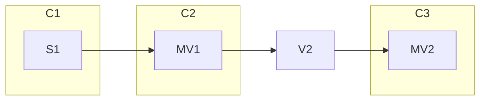

# Resolving customer tradeoffs optimizer changes

- Associated: [#30233 optimizer release engineering](https://github.com/MaterializeInc/materialize/pull/30233),
[#8768 optimizer crate](https://github.com/MaterializeInc/database-issues/issues/8768)

## The Problem

Customers run operational workloads on Materialize.
Changes to Materialize can threaten the stability of those workloads---particularly changes in the optimizer.

To date, we have managed optimizer changes using feature flags (e.g., `enable_cast_elimination`, `enable_eager_delta_joins`).
Not every feature can be feature flagged (e.g., changing `MirRelationExpr` to hold `Repr*` types), though, and we do not have much in the way of tooling for feature flags.

It is hard for us to make changes in the optimizer that won't cause some customers to have a bad time---even if some customers have a much better time with those changes.
We need a way to change the optimizer without disrupting customer workloads.

## Success Criteria

Customers---self-hosted or cloud---will be able to qualify new optimizers before migrating to them.

Optimizer engineers will be able to develop features with confidence, namely:

  - introducing new transforms (e.g., cost-informed late materialization)
  - updating existing transforms (e.g., new join planning)
  - targeting new dataflow operators (e.g., many-to-many reduce)
  - changing AST types for HIR, MIR, or LIR (e.g., LIR many-to-many reduce, MIR window functions)

Optimizer engineers will be able to deploy hotfixes to any active optimizer using the normal weekly release.

## Out of Scope

Mztrail---testing on customer workloads---would help us predict when optimizer changes will affect customers.
(It would also help the most proactive customers, who could run tests themselves.)
While pushing in this direction is good, important work, it's a bigger bite than what's proposed here.
Moreover, it's not clear how to use mztrail in a self-managed context.

There are two closely related but not identical problems:
 1. **`our-bad`** MZ optimizer changed and it broke on redeploy.
 2. **`your-bad`** You changed something and it broke in staging.
We are addressing the **`our-bad`** case exclusively.
It is very important that we solve the "optimizer image" problem (you should be able to write SQL to get the good dataflow) and the "optimizer discontinuity" problem (you should be able to make small changes and not experience discontinuous performance, part of **`your-bad`**)---at some point, but not with this.


## Weighing Alternatives

- **`optimizer-versions`** Separate optimizer versions, settable per-cluster using a system-level privilege.
- **`feature-flags`** Feature flag everything, building tooling to support eng, field eng, and customers.
- **`plan-pinning`** Offer an explicit way to fix a query plan.
- **`query-hints`** Offer query hints or special syntax to control query plans.

What are the pros and cons of each approach?

### `optimizer-versions`

Pros:

  + Fixed, known configurations.
  + Per-cluster control.
  + Forces more unified optimizer interface.
  + Ties in neatly with related ideas of "a separate optimizer process".
  + Moderately flexible versioning: we can cut new optimizer versions as we please, and do not need to fix a support window in advance.

Cons:

  - Code duplication. (Somewhat mitigated by `git subtree`.)
  - We do not know what kind of support window we will want, and may get backed into things we end up disliking.
  - Coarse-grained offramp: you can change versions, but that's it.
  - Coarse-grained application: regressions are typically local, even within a customer. So optimizer versions may not cut it fine enough---it may be just one query on the cluster that needs a different optimizer.
  - Engineering burden of refactor.
  - Engineering burden of backporting.
  - Punts on release qualification.

### `feature-flags`

Pros:

  + The status quo (less the tooling).
  + Fine-grained control: you can offramp from old feature settings flag-by-flag. (In principle, at least.)
  + Flexible: we can create new feature flags as we plase, and we do not need to fix their support windows in advance.

Cons:

  - Difficult scaling granularity: not every feature is easy to flag. `**optimizer-versions**` is essentially a particular approach to `feature-flags`, where the flag granularity is "set of optimizer features and types."
  - Exponentially many configurations---we can't test every combination of flags, and flags interact.
  - Who flips the bits? If it's us: high support burden. If it's someone else: what if they break things?
  - Unknown support windows, and we have not historically done a good job managing feature flags.

### `plan-pinning`

Pros:

  + Ties in neatly with related ideas of "production clusters", guarantees, and auto-scaling.
  + Ties in neatly with related ideas of "DDIR" or some other stable, low-level interface.
  + Offers the most reliable possible experience---a fixed LIR plan would be stable even if bugfixes in MIR cause queries to change.

Cons:

  - Any changes to the plan and you lose your pin. (Mitigation: use MVs on different clusters to separate the units you care about.)
  - LIR is a not currently stored anywhere (but is a stable interface between MIR and rendering). DDIR does not actually exist.
  - Once we are committed, may be hard to back out of. (Mitigation: deploy this is as an unstable feature with a customer partner.)
  - More durable state.
  - Need to manage migrations for LIR. (Mitigation: best effort.)

### `query-hints`

Pros:

  + The finest-grained control.
  + Avoids/defers the need to have smart query planning.

Cons:

  - Major parser overhaul.
  - Major AST overhaul.
  - Major transform overhaul.
  - All known forms of this are brittle.
  - Hard to specify emergent properties (e.g., what to do with operators that do not syntactically appear in the query plan).
  - One-way door: once it's in, it's not going away.
  - Devolves to plan pinning.

## Solution Proposal

We propose using **`plan-pinning`**.
The ability to pin plans _exactly_ solves the **`our-bad`** problem.
It's also superior to the alternatives.
We see it as superior to **`feature-flags`** because we can work more flexibly (change types!) with less uncertainy (known configs!).
(Feature flags will of course continue to exist!)
We see it as superior to **`query-hints`** because we don't want to add query hints.

A prior version of this design doc and [the prior design doc in #30233](https://github.com/MaterializeInc/materialize/pull/30233) proposed **`optimizer-versions`**.
Why have we changed our minds?

`**optimizer-versions**` overfits to particular engineering challenges (wanting to make certain AST changes).
But recent work on repr types has shown that we can change the tires while the car is moving---we simply have to be careful.
Versioning the optimizer has a high engineering burden up front and promises a high maintenance burden in the future.
Refactoring to have a clean optimizer crate is a good idea, but versioning is a heavyweight way to achieve what could be a lightweight goal.

The balance tips further in **`plan-pinning`**'s favor when we consider that pinned plans are not merely a useful way for customers to have more confidence in Materialize, they are a way to help us identify clusters that are candidates for autoscaling and immediate incident escalation---production clusters.

## Minimal Viable Prototype

We will pin plans at the level of clusters.

Two new DDL commands:

```sql
ALTER CLUSTER foo FREEZE;
ALTER CLUSTER foo UNFREEZE;
```

We will store the LIR for all of the dataflows on `foo`, and automatically use those LIR plans on reboot.
These plans will be stored in the catalog.
No changes can be made to `foo`: no new dataflows, no removals.
It will not be part of this work, but it seems sensible to limit other actions on frozen clusters, e.g., you many only run fast-path `SELECT`s and `SUBSCRIBE`s (with the possible exception of queries that touch introspection sources).

### What is the SLA?

Our pinning will start off as "best effort".
At any point, we may simply throw up our hands and replan.
Users should be notified if pinned plans are replanned, but it should not necessarily rise to the level of pinging an on-call engineer---say, an escalation rather than an incident.
A possible success metric for plan pinning (beyond e.g., overall usage/number of pinned plans) is how _few_ replans are forced to occur.

### What can change?

Suppose we have the following dependency diagram, where `S` means "source", `V` means "view", `MV` means "materialized view", and `C` means cluster:



If we freeze `C3`, we certainly can't make changes to `C3`.
What about `V2` (which is inlined into the definition of `MV2`)?
What about `MV1` (which is read from persist)?
What about `S1`?
We don't need to fix opinions permanently on these questions up front, but we will need to _have_ opinions to start.

As a first cut, it seems safe to say:
 1. Frozen clusters block `DROP ... CASCADE` and must be unfrozen first.
 2. Anything but `V2` may change in business logic; schema alterations have to be additive (cf. `ALTER MATERIALIZED VIEW`).
That is, we would treat persist as a barrier: a frozen cluster will block changes to things it depends on that are not persisted.
If `S1` or `MV1` change by altering a computation (but not its type) or by adding a new column, that should be fine (though we may need to generate an intermediate dataflow to project out the new column, since we will not want to change the pinned LIR plan of `MV2`).

It is important for us and for customers to know how things would be replanned if clusters were unfrozen.
In the long term, we will want to know which plans are pinned and how far those pins have drifted from what we would output.
It is merely engineering for us to know about drift in cloud---replan, emitting a diff of the new plan and the pinned one to store---but less so in self-managed.
(These diffs will not address the question of "which MZ changes caused the plan changes", though, and we will only get information at release time.
A proactive, Mztrail-like thing would help as well.)
We would want to make `mz-debug` aware of frozen clusters.
Some kind of `COPY CLUSTER` comand may help users experiment: copy a frozen cluster, unfreeze it, find a new plan you like, freeze _that_, and then green/blue the new one into place.

### Why at the cluster level?

We propose freezing at the cluster level.
The environment and organization level is far too coarse.
The replica and dataflow levels are too fine---freezing these but not the rest of the cluster seems like a recipe for confusion (two replicas on the same cluster with different plans? multiple versions of dependencies?).

### How does LIR change?

LIR is the interface between the optimizer and rendering.
While "stable", it's not persisted and has a purely internal contract.

LIR has a large surface---`MirScalarExpr` (and with it, `UnaryFunc`, `BinaryFunc`, `VariadicFunc`, and `UnmaterializableFunc`), `AggregateExpr` and `AggregateFunc`, `TableFunc`, `Row`, etc.---and any changes across that surface could cause a pinned plan to no longer be runnable.
It would be unwise to freeze things as they are in place: there is no support for migrations, and `MirScalarExpr` and the various `*Func` would be locked in time.
Worse still, several of these `*Func` types reference external types, like `regex::Regex`---if we froze these things, upgrading the `regex` crate would break pinned plans and/or force a migration.

We propose the following shift:

 - Generate `Lir` versions of the various `*Func`s. This will require a preparatory PR to improve the associated macros, but should not be too complex (even though it generates a fair bit of code; we can engineer that code to point to common implementations of `eval`, so we won't get major code duplication). We will likely want to fold this in to work that parameterizes type holding `*Func`s to hold _either_ `Sql*Type` or `Repr*Type`.
 - Write `LirScalarExpr`, which omits `CallUnmaterializable` (because it should be resolved before LIR).
 - Ensure that we only serialize the MZ-controlled bits. Wherever `Lir*Func` would include an external structure, ensure we store the information that lets us regenerate that structure using `#[serde(default=...)]` (e.g., store the original regex string, not the `regex::Regex` value).
 - Add a version number to top-level `LIR`.
 - Use `serde_reflection` to generate a schema (using `Registry`) that lives in the repo. Any change in LIR serialization will yield a schema change. We can programmatically require migrations/LIR version bumps for certain kinds of schema changes.
   + We _must_ eventually tolerate schema changes like new LIR operators, new `*Func`s, new fields on existing structures, or pins will break too often.

LIR will be stored in the catalog.

## Open questions

### What is the concrete syntax?

We should pick ergonomic, sensible DDL syntax for this.
How will users interact with it in DBT, etc.?

### How do alterations work?

Consider the dependency diagram above (["What can change?"](#what-can-change)).
What are the pragmatics of making changes to `S1` and `MV1`?
These changes could be changes to business logic or the addition of a column.

- What does the workflow look like for changes to business logic upstream? _Should be fine._
- What about additive schema changes? _Should be fine._
- What about changes to a hypothetical `MV3` what depends on `MV2`? _Should be fine._

Suppose the logic in `MV2` is broken.
What is the workflow for fixing that?
_Any_ change to `MV2` will lead to replanning, and there is no possibility of "spot" fixes.
How do we communicate to customers that pinning is "best effort"?

### What is the serialization format for LIR?

Based on ad hoc, not particularly well informed research:

| Format      | Compactness | Evolution     |
| :------     | :---------- | :------------ |
| bincode     | +++         | none          |
| JSON        | ---         | roll your own |
| MessagePack | ++          | roll your own |
| CBOR        | +           | roll your own |
| protobuf    | ~           | theirs        |

MessagePack seems like a strong possibility, but "roll your own" as a migration/evolution story is not my favorite.
In addition to our schema registry management, we would need some kind of lint to ensure the serde annotations were correct for MessagePack (i.e., defaults are required on new struct fields, or we'll break at runtime when reading old data). Having some kind of CI test that reads a broad variety of pinned plans through an upgrade would help.

Protobuf has a natural form of evolution, but it is not clear that it aligns with _ours_.
We will likely end up maintaining protobuf wrappers by hand, which is a bad combination of "their weird defaults" and "roll your own".

As an MVP, bincode is fine: we check the version number, and don't use pinned plans if anything changed. The downside is that improving that level of "best effort" to something better is moderately complex.

Another alternative is explicitly versioned LIR enums, where we use version numbers to dispatch and manually write migrations between formats.
This would allow us to use `bincode`, but would mean far more migrations: any change at all would force one.
In this case, we would want good tooling to generate migrations and keep migration code to a minimum.

### Where does LIR live in the catalog?

It could go in `CatalogPlans` (all currently keyed by global ID), in `CatalogState` (alongside per-cluster metadata), or as a sidecar (like the `ExpressionCacheHandle`).
This part of the catalog seems to be in flux, but `CatalogState` seems right---plans for frozen clusters should be stored alongside those clusters.
That is, whether or not a cluster is frozen is not a boolean---it's an `Option<FrozenLirPlans>`, with `Some(...)` holding the plans.

### What happens when we move to DDIR?

A nice property of plan pinning is that we're always free to go lower.
Currently, a pinned LIR plan will render directly.
If we rearchitect things to convert that LIR plan to DDIR, that will be "transparent" to the pinned plan (if we do a good job).
If we later decide to save the DDIR rather than LIR, that will be as transparent as the original move was.

### What happens to `EXPLAIN OPTIMIZED PLAN` for pinned LIR plans?

Right now, I believe only Gábor uses `EXPLAIN OPTIMIZED PLAN`.
But in the event someone would like to see MIR for a pinner LIR plan, we would simply not have it.
We _could_ store a cached version, either a text (with fixed options) or as some kind of structure---though our aim was to _not_ have to serialize MIR.
I think the best approach here is to improve the default LIR-based `EXPLAIN PLAN` enough so that Gábor stops using `EXPLAIN OPTIMIZED PLAN`.
