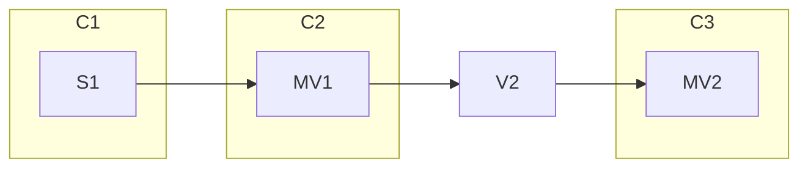

# Resolving customer tradeoffs with multiple optimizer crates

- Associated: [#30233 optimizer release engineering](https://github.com/MaterializeInc/materialize/pull/30233),
[#8768 optimizer crate](https://github.com/MaterializeInc/database-issues/issues/8768)

## The Problem

Customers run operational workloads on Materialize.
Changes to Materialize can threaten the stability of those workloads---particularly changes in the optimizer.

To date, we have managed optimizer changes using feature flags (e.g., `enable_cast_elimination`, `enable_eager_delta_joins`).
Not every feature can be feature flagged (e.g., changing `MirRelationExpr` to hold `Repr*` types), though, and we do not have much in the way of tooling for feature flags.

It is hard for us to make changes in the optimizer that won't cause some customers to have a bad time---even if some customers have a much better time with those changes.
We need a way to change the optimizer without disrupting customer workloads.

## Success Criteria

Customers---self-hosted or cloud---will be able to qualify new optimizers before migrating to them.

Optimizer engineers will be able to develop features with confidence, namely:

  - introducing new transforms (e.g., cost-informed late materialization)
  - updating existing transforms (e.g., new join planning)
  - targeting new dataflow operators (e.g., many-to-many reduce)
  - changing AST types for HIR, MIR, or LIR (e.g., LIR many-to-many reduce, MIR window functions)

Optimizer engineers will be able to deploy hotfixes to any active optimizer using the normal weekly release.

## Out of Scope

Mztrail---testing on customer workloads---would help us predict when optimizer changes will affect customers.
(It would also help the most proactive customers, who could run tests themselves.)
While pushing in this direction is good, important work, it's a bigger bite than what's proposed here.
Moreover, it's not clear how to use mztrail in a self-managed context.

There are two closely related but not identical problems:
 1. **`our-bad`** MZ optimizer changed and it broke on redeploy.
 2. **`your-bad`** You changed something and it broke in staging.
We are addressing the `our-bad` case exclusively.
It is very important that we solve the "optimizer image" problem (you should be able to write SQL to get the good dataflow) and the "optimizer discontinuity" problem (you should be able to make small changes and not experience discontinuous performance).


## Weighing Alternatives

- **`optimizer-versions`** Separate optimizer versions, settable per-cluster using a system-level privilege.
- **`feature-flags`** Feature flag everything, building tooling to support eng, field eng, and customers.
- **`plan-pinning`** Offer an explicit way to fix a query plan.
- **`query-hints`** Offer query hints or special syntax to control query plans.

What are the pros and cons of each approach?

### `optimizer-versions`

Pros:

  + Fixed, known configurations.
  + Per-cluster control.
  + Forces more unified optimizer interface.
  + Ties in neatly with related ideas of "a separate optimizer process".
  + Moderately flexible versioning: we can cut new optimizer versions as we please, and do not need to fix a support window in advance.

Cons:

  - Code duplication. (Somewhat mitigated by `git subtree`.)
  - We do not know what kind of support window we will want, and may get backed into things we end up disliking.
  - Coarse-grained offramp: you can change versions, but that's it.
  - Coarse-grained application: regressions are typically local, even
    within a customer. So optimizer versions may not cut it fine enough---it may be just one query on the cluster that needs a different optimizer.
  - Engineering burden of refactor.
  - Engineering burden of backporting.
  - Punts on but doesn't resolve issues with release qualification.

NB

### `feature-flags`

Pros:

  + The status quo (less the tooling).
  + Fine-grained control: you can offramp from old feature settings flag-by-flag. (In principle, at least.)
  + Flexible: we can create new feature flags as we plase, and we do not need to fix their support windows in advance.

Cons:

  - Difficult scaling granularity: not every feature is easy to flag. `**optimizer-versions**` is essentially a particular approach to `feature-flags`, where the flag granularity is "set of optimizer features and types."
  - Exponentially many configurations---we can't test every combination of flags, and flags interact.
  - Who flips the bits? If it's us: high support burden. If it's someone else: what if they break things?
  - Unknown support windows.

### `plan-pinning`

Pros:

  + Ties in neatly with related ideas of "production clusters", guarantees, and auto-scaling.
  + Ties in neatly with related ideas of "DDIR" or some other stable, low-level interface.
  + Offers the most reliable possible experience---a fixed LIR plan would be stable even if bugfixes in MIR cause queries to change.

Cons:

  - Any changes to the plan and you lose your pin. (Mitigation: use MVs to separate the units you care about.)
  - LIR is a not a stable interface. DDIR does not actually exist.
  - Once we are committed, may be hard to back out of. (Mitigation: deploy this is as an unstable feature with a customer partner.)

### `query-hints`

Pros:

  + The finest-grained control.
  + Avoids/defers the need to have smart query planning.

Cons:

  - Major parser overhaul.
  - Major AST overhaul.
  - Major transform overhaul.
  - All known forms of this are brittle.
  - Hard to specify emergent properties (e.g., what to do with operators that do not syntactically appear in the query plan).
  - Devolves to plan pinning.

## Solution Proposal

We propose using **`plan-pinning`**.
The ability to pin plans solves exactly the **`our-bad`** problem.
It's also superior to the alternatives.
We see it as superior to **`feature-flags`** because we can work more flexibly (change types!) with less uncertainy (known configs!).
(Feature flags will of course continue to exist!)
We see it as superior to **`query-hints`** because we don't want to add query hints.

A prior version of this design doc and [the prior design doc in #30233](https://github.com/MaterializeInc/materialize/pull/30233) proposed **`optimizer-versions`**.
Why have we changed our minds?

`**optimizer-versions**` overfits to particular engineering challenges (wanting to make certain AST changes).
But recent work on repr types has shown that we can change the tires while the car is moving---we simply have to be careful.
It has a high engineering burden up front and promises a high maintenance burden in the future.
Refactoring to have a clean optimizer crate is a good idea, but versioning is a heavyweight way to achieve what could be a lightweight goal.

The balance tips further in **`plan-pinning`**'s favor when we consider that pinned plans are not merely a useful way for customers to have more confidence in Materialize, they are a way to help us identify clusters that are candidates for autoscaling and immediate incident escalation---production clusters.

## Minimal Viable Prototype

We will pin plans at the level of clusters.

Two new DDL commands:

```sql
ALTER CLUSTER foo FREEZE;
ALTER CLUSTER foo UNFREEZE;
```

We will store the LIR for all of the dataflows on `foo`, and automatically use those LIR plans on reboot.
No changes can be made to `foo`: no new dataflows, no removals.
It will not be part of this work, but it seems sensible to limit other actions on frozen clusters, e.g., you many only run fast-path `SELECT`s and `SUBSCRIBE`s (with the possible exception of queries that touch introspection sources).

### Why at the cluster level?

We propose freezing at the cluster level.
The environment and organization level is far too coarse.
Going finer, the replica and dataflow levels are too fine---freezing these but not the rest of the cluster seems like a recipe for a mismatch with dependencies.

## Open questions

Suppose we have the following dependency diagram, where `S` means "source", `V` means "view", `MV` means "materialized view", and `C` means cluster:



If we freeze `C3`, we certainly can't make changes to `C3`.
What about `V2` (which is inlined into the definition of `MV2`)?
What about `MV1` (which is read from persist)?
What about `S1`?
We don't need to fix opinions permanently on these questions up front, but we will need to _have_ opinions to start.

One sensible possibility is that you can only freeze things whose dependencies are frozen.
That is, if `C3` is frozen, then `C1` and `C2` must also be frozen.
Changes to `V2` might be allowed, with a warning that these changes will not affect downstream frozen objects (which we could then name).
In this world, we would likely want a `COPY CLUSTER foo TO bar` DDL command, that creates a copied cluster that could then be safely altered.
What else might we do?
