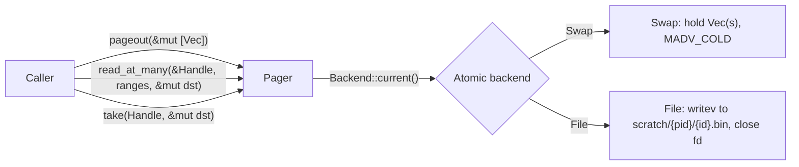

# Pager

* Associated: [CLU-65](https://linear.app/materializeinc/issue/CLU-65/pager), depends on [CLU-64](https://linear.app/materializeinc/issue/CLU-64/remove-lgalloc-from-columnar) (`Column::Aligned` becomes `Vec<u64>`).

## The problem

Materialize spills working sets to Linux swap.
The kernel decides which anonymous pages to evict, conflating application state with arbitrary heap allocations and forcing user threads into direct reclaim when memory pressure rises.
Direct reclaim shows up as user-visible latency in dataflow operators and as elevated `pgscan_direct` in `/proc/vmstat` during hydration.
We need an explicit pager so the application can mark cold data, ask for it back on demand, and choose whether the cold storage lives in anonymous memory (with kernel hints) or on a dedicated scratch volume.
This unblocks the columnar end-to-end project: once `Column::Aligned` is a `Vec<u64>` (CLU-64), the pager is the natural seam between in-memory columnar buffers and out-of-core storage.

## Success criteria

The design succeeds when:

* Cold columnar data can be paged out and back in via a single API regardless of backend.
* The swap backend introduces no copies on the page-out path; the page-in path costs at most a `madvise` plus the unavoidable read.
* The file backend uses one syscall per logical operation where the OS supports it (`writev`, `pread`/coalesced `pread`).
* Switching backends is a runtime configuration flip, not a recompile or a restart.
* Existing handles remain usable across backend flips.
* The API supports both write-once/read-once 2 MiB-scale spill blocks and write-once/read-many large blobs with random offset and length access.
* Caller-side allocation is reusable: the buffers handed to `pageout` and the buffers passed to `pagein`-style reads return to the caller in a state that preserves their capacity where the backend permits.
* Out-of-core scenarios (working set 2x system RAM) actually offload pages: peak resident set size drops compared to leaving the data resident.

## Out of scope

* Eviction policy.
  The pager is a mechanism; callers decide what and when to page out.
* Generic element types.
  The API is `Vec<u64>` only.
  We will revisit if a non-`u64` consumer appears.
* Compression and encryption.
  Both can wrap the pager externally.
* Async or `io_uring`.
  Sync syscalls only for v1.
  An async wrapper is a follow-up if profiles motivate it.
* Cross-handle file pooling (one shared scratch file with a free-list).
  Each handle owns one named file in the scratch directory; pooling is a follow-up if inode pressure shows up.
* Non-Linux production support.
  Both backends compile on macOS and others as in-memory no-ops, but the production target is Linux.

## Solution proposal

A single `mz_ore::pager` module exposes a backend-agnostic API around a `Handle` type.
A global atomic selects the backend at `pageout` time; the chosen backend is baked into each handle so live flips do not invalidate existing data.
Two backends ship: `Swap` (keep allocations resident, hint the kernel via `MADV_COLD`) and `File` (write to a named file in a per-process scratch subdirectory).
The API is sync; the file backend uses `writev` and `pread` to keep syscall counts low.
The file backend never holds a file descriptor in the handle: each operation opens, runs syscalls, and closes the fd, so per-handle state is a tiny `(scratch_id, length)` tuple regardless of how many handles a process has alive.

### Architecture



The handle's variant captures which backend produced it, so reads dispatch on the handle alone.
A backend flip changes only future `pageout` calls; a handle taken under `Swap` continues to read from memory after a flip to `File`.

### API

```rust
//! src/ore/src/pager.rs

pub enum Backend { Swap, File }

/// Sets the active backend for future pageouts. Existing handles are unaffected.
pub fn set_backend(b: Backend);

pub fn backend() -> Backend;

/// Configures the scratch directory for the file backend.
/// Must be called before the first file-backend pageout.
pub fn set_scratch_dir(path: PathBuf);

pub struct Handle { /* private: SwapInner | FileInner */ }

impl Handle {
    /// Logical length in u64s.
    pub fn len(&self) -> usize;
    pub fn len_bytes(&self) -> usize { self.len() * 8 }
    pub fn is_empty(&self) -> bool { self.len() == 0 }
}

impl Drop for Handle { /* swap: drops Vec(s). file: unlinks the scratch file. */ }

/// Scatter pageout. Logical layout = chunks concatenated in input order.
/// After return: each Vec in `chunks` is empty.
/// File backend preserves capacity; swap backend moves the alloc into the handle.
/// Empty input returns a `len == 0` handle and performs no I/O.
pub fn pageout(chunks: &mut [Vec<u64>]) -> Handle;

/// Reads multiple ranges. Output appended to `dst` in request order (concat).
/// Panics if any range is out of bounds.
pub fn read_at_many(handle: &Handle, ranges: &[(usize, usize)], dst: &mut Vec<u64>);

/// Single-range convenience.
pub fn read_at(handle: &Handle, offset: usize, len: usize, dst: &mut Vec<u64>);

/// Consumes handle, writing the entire payload into `dst` (cleared first), then reclaims storage.
/// Swap fast path: single-chunk handle into empty `dst` swaps in place, no copy.
pub fn take(handle: Handle, dst: &mut Vec<u64>);
```

### Swap backend

Storage is `Vec<Vec<u64>>` plus a prefix-sum `Vec<usize>` of cumulative lengths in u64s.

`pageout`.
Move each input Vec via `mem::take`.
For each chunk, compute the page-aligned subrange of its byte buffer and call `madvise(ptr, len, MADV_COLD)`.
`MADV_COLD` deactivates the pages without freeing them; the kernel reclaims under pressure without a synchronous swap-out.
Skip the syscall when the page-aligned region is empty (sub-page chunks).

`read_at_many`.
For each range, binary-search the prefix-sum to find the starting chunk, then `extend_from_slice` across chunk boundaries.
Optionally call `MADV_WILLNEED` on the touched pages before the copy.
Output appends in request order to `dst`.

`take`.
A single-chunk handle paired with an empty `dst` triggers `mem::swap` for a zero-copy take.
Otherwise concat all chunks into `dst`.
The handle drops; the `Vec<Vec<u64>>` reclaims.

### File backend

Storage per handle is `(scratch_id: u64, len_u64s: usize)`.
File descriptors are never retained: the handle is 16 bytes regardless of file state.
The pager owns a per-process subdirectory `{scratch_dir}/mz-pager-{pid}-{boot_nonce}/` and writes each handle to `{subdir}/{scratch_id}.bin` where `scratch_id` is allocated from a process-wide `AtomicU64`.

`pageout`.
Allocate `scratch_id`.
`File::create_new(path)` to open exclusively, build an iovec from each chunk's byte slice, issue one `writev` covering all chunks, then close the fd.
Clear each input Vec after the write so the caller keeps capacity.
On I/O failure, log a warning, unlink the path if it was created, and fall back by constructing a `SwapInner` from the same chunks; the contract on input Vecs and the returned handle is unchanged.

`read_at_many`.
`File::open(path)`, then for each range compute byte offset and byte length and call `pread`.
Coalesce adjacent ranges (`offset_i + len_i == offset_{i+1}`) into a single `pread`.
Append into `dst`, then close the fd.
A future optimization is `preadv2` once a profile shows it matters.

`take`.
`File::open(path)`, one `pread` for the whole length into `dst`, close the fd, `unlink(path)`, drop the handle.

`Drop` (without `take`).
`unlink(path)`. The kernel reclaims the inode.

### Scratch directory lifecycle

`set_scratch_dir(root)` creates `{root}/mz-pager-{pid}-{boot_nonce}/`.
`boot_nonce` is a random 64-bit value sampled at config time so two processes that briefly share the same pid cannot collide.
On `set_scratch_dir`, the pager runs a reaper that walks `{root}` and removes any sibling `mz-pager-*` subdirectory whose owning pid is no longer alive (`/proc/{pid}` missing on Linux); this reclaims storage from crashed predecessors.
On clean process exit, a `Drop` on the global pager state removes the per-process subdirectory.
The reaper is best-effort and logs failures rather than panicking.

### Configuration

Two pieces of global state, both behind atomics or `OnceLock`:

* `BACKEND: AtomicU8`, set by `set_backend`.
* `SCRATCH_DIR: OnceLock<PathBuf>`, set by `set_scratch_dir` before the first file-backend pageout. Subsequent calls log a warning and become no-ops to avoid mid-run path changes.

A LaunchDarkly-style param wires `set_backend` from cluster configuration, mirroring `mz_ore::region::ENABLE_LGALLOC_REGION`.

### Concurrency

`Handle: Send`.
`pageout` and `take` consume by value, so they are single-threaded with respect to a handle by construction.
`read_at` and `read_at_many` take `&Handle` and are concurrent-safe: the file path uses `pread` (thread-safe positional read); the swap path reads through an immutable `&Vec`.
`set_backend` racing with `pageout` is benign: `pageout` reads the atomic once at entry, and existing handles keep their backend.

### Errors

File I/O on `pageout` failure: log at `warn`, fall back to a swap-backed handle.
File I/O on read failure: panic.
The data lives only on the spill path; partial reads indicate corruption or device loss, both unrecoverable.
Out-of-bounds range in `read_at*`: panic.
Empty input to `pageout`: returns a `len == 0` handle with no syscalls on either backend.

### File layout

```
src/ore/src/pager.rs           # Public API, dispatch, Handle enum, config
src/ore/src/pager/swap.rs      # Swap backend
src/ore/src/pager/file.rs      # File backend (per-process subdir, writev, pread)
src/ore/benches/pager.rs       # Criterion benches
src/ore/Cargo.toml             # Feature `pager`: deps libc, bytemuck
```

The `pager` feature gates the module so non-Linux builds compile.
On non-Linux, both backends degrade to no-op variants that hold data in memory and skip syscalls.

## Minimal viable prototype

A working in-tree prototype is the first implementation step: both backends, end-to-end tests, and the benchmark harness described below.
The prototype validates three risks early.
First, that `MADV_COLD` actually offloads pages under pressure; we measure this by allocating 2x system RAM in handles and watching peak RSS via `/proc/self/status`.
Second, that the file backend's vectored I/O is competitive with swap on sequential workloads; the bench compares 1 x 2 MiB and 64 x 32 KiB layouts on both backends.
Third, that the API survives integration with `Column` post-CLU-64; a follow-up branch wires `Column::Aligned` to `pageout`/`take` end-to-end and runs an existing columnar bench.

The bench harness lives at `src/ore/benches/pager.rs` and uses Criterion.
Knobs: backend (Swap, File), payload size (4 KiB, 64 KiB, 1 MiB, 16 MiB), chunk count (1, 2, 64), scratch dir (`MZ_PAGER_SCRATCH` env var, default `$TMPDIR`).
Cases:

* `pageout` wall time, single chunk, varying size.
* `pageout` scatter, fixed total size, varying chunk count, both backends; isolates `writev` benefit.
* `read_at` whole-block after a configurable idle delay so the kernel actually reclaims swap pages.
* `read_at_many` random ranges, 1, 8, 64 ranges per call, sorted vs unsorted to exercise coalescing.
* Sustained round-trip `pageout` -> `read_at` -> drop, measuring ops/s.
* Working-set scenario: 2x system RAM in handles, page out half, read random handles; gated behind `cargo bench --features pager-stress` since CI cannot run it.

Unit tests in `src/ore/src/pager.rs` and per-backend modules cover round-trip on both backends, scatter/gather correctness (random ranges including overlapping and adjacent), drop-without-read reclaim, the swap fast path for `take` (assert pointer identity), backend flip mid-run (handle taken under one backend reads through after flip), and capacity-preservation rules.
miri runs the swap backend; the file backend skips on miri due to syscalls.

## Operational characteristics

A merge-batcher-style example (`src/ore/examples/pager_merge.rs`) builds two chains of 2 MiB chunks, then merges them while reading every cache line of the input.
Run under `systemd-run --user --scope -p MemoryMax=...` to constrain memory and force real eviction.
Numbers below were collected on a Linux box with an encrypted NVMe (~1.4 GB/s sustained R+W ceiling) running the example with `--chain-gib 16` (32 GiB total working set) and `--prefetch-depth 4`.

### Throughput sweep

`through` is total bytes pumped through the merge divided by wall time, summed across threads.

| RAM cap | threads | swap GiB/s | file GiB/s | file/swap |
|--------:|--------:|-----------:|-----------:|----------:|
|    16 G |       1 |       0.15 |       0.50 |      3.4× |
|    16 G |      16 |       0.36 |       1.47 |      4.0× |
|     8 G |       1 |       0.12 |       0.44 |      3.5× |
|     8 G |      16 |       0.37 |       0.79 |      2.1× |
|     4 G |       1 |       0.12 |       0.36 |      3.0× |
|     4 G |      16 |       0.36 |       1.21 |      3.4× |

Headlines:

* The file backend can saturate the disk: 1.47 GiB/s at 16 G cap with 16 threads is ~100 % of the encrypted-NVMe ceiling.
* The swap backend caps at ~0.36 GiB/s regardless of cap or parallelism, leaving 70 %+ of the disk capacity unused.
* File scales with parallelism (3× from 1 to 16 threads); swap scales sublinearly and floors near 90 s wall.

### Why swap stalls

Single-threaded merge with a 4 GiB chain (8 GiB working set) under a 2 G cap, instrumented via `perf stat` plus `/proc/vmstat` deltas:

| metric | swap | file | ratio |
|---|---:|---:|---:|
| wall time | 65.5 s | 24.0 s | 2.7× |
| sys time | 63.8 s | 9.0 s | 7.1× |
| user time | 1.5 s | 1.5 s | 1× |
| major-faults | 65,516 | 1,913 | 34× |
| minor-faults | 5,187,868 | 3,986 | 1300× |
| dTLB-load-misses | 42 M | 12 M | 3.4× |
| pswpin (4 KiB pages) | 2.12 M | 2.2 K | 970× |
| pswpout | 3.64 M | 3.1 K | 1180× |

Of swap's 65 s wall, 64 s is sys time — the kernel runs the user thread's fault handler.
2.1 M page-ins through the swap path means every 4 KiB granule of the 8 GiB working set page-faults synchronously on the user thread.
The disk does not become the bottleneck: 8 GiB / 65 s = 130 MB/s, less than 10 % of NVMe capacity.
Page-table churn from `MADV_COLD` reclaim and subsequent re-faulting also drives 3.4× more dTLB misses on the swap path; each unmap broadcasts a TLB-shootdown IPI to every CPU running the task.

The file backend issues one `writev` per chunk on pageout and one `pread` per coalesced range on read, lets kernel readahead overlap I/O with the user thread's compute, and never pays the per-page fault tax.
9 s of sys time covers all of its kernel work for the same 8 GiB scan.

### Operational guidance

* Pick the swap backend when the working set is comfortably resident.
  `MADV_COLD` is essentially free in that regime and operations run at memory bandwidth.
* Pick the file backend whenever the working set may exceed RAM.
  The kernel I/O pipeline scales; swap-in does not.
* The runtime atomic switch is the right place for an operator-level policy: a controller can flip the global at startup based on cluster size or under a pressure signal.
* Prefetch hints (`prefetch` / `prefetch_at`) help the file backend by ~5 % at depth 16 on this workload; they do not help the swap backend because under pressure the kernel is reclaim-bound, not stall-bound.

## Alternatives

### Generic over `T: Pod`

The columnar use case is `Vec<u64>` and the spec is explicit on `&[u64]`.
A generic over `T: bytemuck::Pod` would let callers spill `Vec<u8>` or `Vec<u32>` without manual casts.
The cost is API-wide: the handle must track element size, the file backend must validate alignment on read, and `take` round-tripping a `Vec<u8>` cannot return a `Vec<u64>` without reallocation.
The simpler `u64`-only design wins until a concrete non-`u64` consumer appears; an additive `pageout_pod<T: Pod>` later would not break existing callers.

### Per-pager configuration instead of a global atomic

A `Pager` struct constructed with its backend would compose better than a global, especially in tests.
But the project intent is "the cluster runs on swap or on file, not both at once", and a global atomic encodes that operational reality directly.
A per-pager design would either duplicate the global flag at the struct level or invite confusion about which configuration wins.
We can add a per-instance constructor later for tests if the global proves awkward; the global stays as the production path.

### One pager per use case (transient spill vs long-lived blob)

The two named use cases differ only in handle lifetime and access pattern, not in storage.
Both want `pageout` once, both want random-offset reads, both want `Drop` to reclaim.
Two pagers would duplicate the global flag, the scratch directory, and the syscall code paths.
One pager covers both with the same API; UC1 calls `pageout` then `take`; UC2 calls `pageout` once and `read_at` many times.

### Async API

The dataflow callers run on synchronous timely worker threads, and bridging async out of an operator costs context switches and complicates lifetimes.
Sync `pread`/`writev` on a thread that already exists is the simplest correct choice for v1.
An async wrapper that offloads to a blocking pool can be added later without breaking the sync core.

### `MADV_PAGEOUT` / `MADV_SWAPOUT`

`MADV_PAGEOUT` (Linux 5.4+) actively reclaims pages synchronously, which is the closest to the file backend's eager-write semantics.
The cost is a synchronous, expensive syscall that we would issue from operator threads; under pressure this re-creates the direct-reclaim problem we are trying to escape.
`MADV_COLD` deactivates pages and lets the kernel reclaim asynchronously when it actually wants to, which matches our goal of moving work off the user thread.
We pick `MADV_COLD` for v1; if profiles show pages are not reclaimed quickly enough, `MADV_PAGEOUT` is a one-line swap on a feature-gate.

### `O_TMPFILE` with the fd held in the handle

`O_TMPFILE` creates an unnamed inode that auto-deletes when the last fd closes, so it would skip the explicit `unlink` step on reclaim.
The cost is one fd per handle: 100k live handles would exhaust the process fd ulimit and require an OS configuration change to operate at scale.
The chosen design instead opens a named file, writes, and closes the fd within `pageout`, so the handle holds 16 bytes and no fd, and reads reopen as needed.

### Single shared scratch file with an offset table

One file with handle-owned offsets reduces inode pressure and enables better physical layout.
It also requires a free-list, fragmentation handling, and a different reclaim story (truncation does not free arbitrary middles).
The complexity is unjustified at expected handle counts; revisit if inode count per handle becomes a measurable bottleneck.

## Open questions

* Should `pageout` accept `impl IntoIterator<Item = Vec<u64>>` for ergonomics?
  Iterators lose caller capacity reuse on the file path because we have no `&mut` access to put the cleared Vec back.
  Recommend sticking with `&mut [Vec<u64>]`; revisit if the slice form proves awkward at call sites.

* Should `set_backend` be allowed to flip multiple times during a process lifetime?
  Yes for v1, since live LaunchDarkly flips are an explicit goal.
  The per-handle stability rule (existing handles keep their backend) keeps this safe; document it in the rustdoc.

* Should we add `read_at_into(&Handle, offset: usize, dst: &mut [u64])` for callers that have a sized buffer and do not want `Vec` semantics?
  The columnar consumer is `Vec<u64>` and `read_at` already reuses the caller's allocation via `&mut Vec<u64>`.
  Defer; add additively if a caller needs slice-only reads.

* Should we add `pageout_each(&mut [Vec<u64>]) -> Vec<Handle>` for timely-spill-style integration?
  Timely's `BytesSpill` needs one handle per chunk; with the fd-less file backend, a "shared file under N handles" design becomes "N handles each pointing at independent files" and the `writev`-batching benefit disappears.
  An alternative is `pageout_each` that writes all chunks into one shared scratch file and returns N handles each carrying `(scratch_id, byte_offset, byte_len)` plus a refcount so the file is unlinked once all handles drop.
  Defer until the timely-spill integration concretely wants it; the existing `pageout` already covers the columnar primary use case.

## Interaction with timely-dataflow spill

Timely's `MergeQueue` exposes `BytesSpill`/`BytesFetch` traits ([PR 791](https://github.com/TimelyDataflow/timely-dataflow/pull/791) demonstrates the file-backed strategy).
The shapes differ: timely's `spill(&mut Vec<Bytes>, &mut Vec<Box<dyn BytesFetch>>)` takes N chunks and returns N independent fetch handles; the pager takes N chunks and returns one composite handle.
A `mz_timely_util::spill` adapter is the integration point, not the pager itself.
The adapter can be implemented in two ways once both pieces exist.

The simple form calls `pager::pageout` once per chunk and stores each `pager::Handle` inside a `BytesFetch` impl.
This costs one scratch file per chunk; for 256 KiB chunks at 50 GiB total, that's roughly 200k inodes, which is workable on tmpfs but stressful on disk filesystems.
The richer form is the deferred `pageout_each` API above, which lets one writev produce one file with N handles and matches timely's design exactly.

The element-type boundary needs care.
Timely passes `bytes::arc::Bytes` (byte-aligned); the pager wants `Vec<u64>` (8-byte aligned).
Materialize's columnar serialization already produces 8-byte-aligned bytes, so the adapter can cast where alignment is statically guaranteed and copy where it is not.
A future enhancement is a parallel byte-oriented pager API; deferred until the adapter exists and motivates it.

The pager's swap backend is novel relative to timely's example: timely's "no-spill" baseline relies on the OS to manage memory, while the pager actively hints `MADV_COLD`.
This makes the swap backend an additional spill strategy that timely does not currently offer, suitable for cases where eager file write is too expensive but kernel-driven reclaim alone is too slow.
