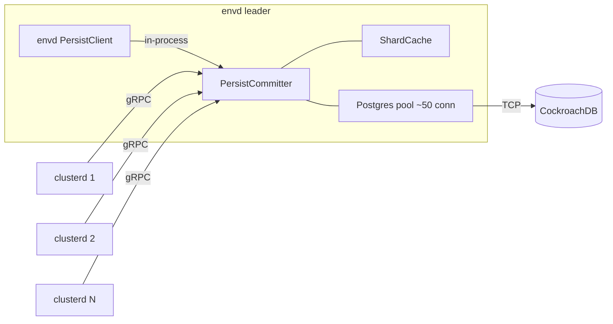

# Persist committer

* Associated: (issue/epic TBD)

## The problem

Every Materialize process that talks to persist opens its own connection pool to the consensus database (CockroachDB).
Each `PersistClientCache` instantiates a `PostgresConsensus` with a default pool size of 50 connections (`CONSENSUS_CONNECTION_POOL_MAX_SIZE` in `src/persist-client/src/cfg.rs`).
In an environment with one `environmentd` and N `clusterd` replicas, the consensus DB sees up to `(N + 1) * 50` open connections, and that grows linearly with replica count.
As deployments scale, this pressures CRDB connection limits, increases scheduling overhead inside each clusterd, and amplifies tail latency under contention.
The connection budget is the constraint we want to relieve.

There is no open issue tracking this work yet; this document opens the discussion.

## Success criteria

A successful design reduces the number of CRDB connections opened per environment from `O(replicas)` to `O(envds)` without regressing persist correctness, latency, or availability.
Reads and writes against consensus continue to satisfy the existing `Consensus` trait contract.
Rollout is gated by a runtime flag so the change can be enabled per environment and rolled back without redeploying.
Existing persist test suites pass against the new transport with no semantic changes.

## Out of scope

* The persist Blob layer (S3/MinIO).
  Blob uses cheap HTTP connections and does not exhibit the same pressure.
* Coalescing or merging the *payloads* of `compare_and_set` requests across callers.
  Caller-provided new-state depends on caller-observed old-state, so payload merging is not semantically sound.
* Cross-environment consensus sharing.
  Each environment retains its own consensus DB.
* A standalone `persistd` binary.
  The committer ships inside `environmentd` for v1.

## Solution proposal

### Overview

Introduce a **persist committer**: an in-process service hosted by `environmentd` that owns the single `PostgresConsensus` connection pool for the environment and exposes the `Consensus` trait over a new gRPC service.
Clusterds (and `environmentd` itself) use a new RPC-backed `Consensus` implementation that routes every operation to the committer.
The committer maintains a small in-memory cache of the latest head per shard to serve `head` reads without round-tripping to CRDB.
The cache is advisory: CRDB remains the single source of truth, every `compare_and_set` is forwarded unconditionally, and cache state only ever moves forward in sequence number.

### Components

The committer lives in a new `mz-persist-committer` crate.
It composes the existing `PostgresConsensus`, a per-shard cache, and a tonic gRPC server.

**`PersistCommitter`** owns the only `Arc<dyn Consensus>` backed by CRDB in the environment.
It accepts RPC requests, consults the cache, dispatches to the underlying `Consensus`, and broadcasts updates to subscribers.

**`ShardCache`** is a `BTreeMap<ShardId, Arc<Mutex<CachedState>>>` where `CachedState` holds the latest observed `VersionedData` and the set of active subscribers.
Inserts compare sequence numbers and only move forward, never backward.
The map is bounded by `persist_committer_max_cached_shards`; entries with zero subscribers are LRU-evicted when the cap is reached.

**`ProtoPersistConsensus`** is the new gRPC service.
It exposes four unary RPCs mirroring the `Consensus` trait — `Head`, `Scan`, `CompareAndSet`, `Truncate` — plus a server-streaming `Subscribe(ShardId)` that pushes `VersionedData` diffs.
The diff wire format matches the existing `ProtoPubSubMessage::PushDiff` so the cluster-side persist subscriber can reuse decoders.

**`RpcConsensus`** is a new `Consensus` implementation in `mz-persist-client` that wraps a tonic channel.
It is the only persist-client-side change; once a `PersistClientCache` decides to use it, every existing persist consumer is unaffected.
`environmentd` uses the same `RpcConsensus`, but its tonic channel is an in-process channel that short-circuits TCP.

### Data flow

**Write path (`compare_and_set`):**

1. Caller invokes `Consensus::compare_and_set(shard, new)` on the persist client.
   The expected sequence number is implicit in `new.seqno - 1`, matching the underlying `Consensus` trait.
2. `RpcConsensus` sends `CompareAndSet { shard, new }` to the committer.
3. The committer forwards the call to its `PostgresConsensus` unconditionally.
   CRDB arbitrates.
4. On `Committed`, the committer updates the cache for `shard` (monotonic merge), then publishes the new `VersionedData` to every subscriber of that shard.
5. On `ExpectationMismatch`, the underlying trait does not return the current state.
   The committer replies to the caller with the mismatch and concurrently spawns a fire-and-forget `head()` against CRDB to refresh the cache so the caller's follow-up `fetch_current_state` can be served from cache.
   A per-shard mutex around this refresh prevents concurrent mismatches from stampeding the underlying store.

We do not fast-reject CaS against the cache.
With two `environmentd` instances briefly coexisting during failover, the cache may lag CRDB, and a cache-based reject could incorrectly fail a legitimate CaS.
Forwarding every write keeps CRDB authoritative.

**Read path (`head`):**

1. Caller invokes `Consensus::head(shard)`.
2. `RpcConsensus` sends `Head { shard }` to the committer.
3. If the cache has an entry, the committer returns the cached `VersionedData`.
   Otherwise it reads CRDB, populates the cache, and returns the value.
4. On cache miss, the committer marks the shard warm and begins delivering diffs to any subsequent subscriber.

Stale cache reads are safe because the cache moves forward monotonically.
A caller that reads sequence number N from cache when CRDB holds N+1 simply learns about N+1 on its next CaS failure, then retries.
This is identical to the behavior persist already handles when two clients race.

**Read path (`scan`):**

`scan` always falls through to CRDB.
It is used for state replay on shard open, returns arbitrarily large result sets, and runs cold.
Caching it has limited value and unbounded memory cost.

**Read path (`list_keys`):**

`list_keys` is an administrative operation that enumerates every shard ever created.
The committer forwards it to CRDB unchanged and collects the streaming result into a vector for the gRPC response.
It is not on the hot path and is rarely called.

**Read path (`truncate`):**

`truncate` is forwarded to CRDB.
The underlying trait returns `Result<Option<usize>, _>` — the count is `None` when the backing store cannot report one — so the gRPC response uses an `optional uint64` field.
The cache is unaffected because truncation only removes historical sequence numbers, not the current head.

**Subscribe path:**

When a clusterd's `PersistClient` opens a shard, it opens a `Subscribe(shard)` server-stream to the committer.
The committer registers the subscriber, sends the current cached `VersionedData` as the first message, then streams every subsequent `VersionedData` update produced by its own CaS commits.
The subscription tears down when the clusterd closes the shard or the gRPC stream.

### Cache freshness with multiple writers

The cache is necessarily best-effort because the committer is not always the only writer to CRDB:

* During zero-downtime upgrade, two `environmentd` instances briefly coexist and both run a committer.
* During rollout, some clusterds may still hold direct CRDB connections (`persist_consensus_use_committer = off`).
* External tooling (backups, admin scripts) may read or write directly.

To bound staleness, the committer refreshes cached shards on a TTL (default 5s, `persist_committer_cache_refresh_interval`) whenever the shard has active subscribers.
The TTL refresh issues a `head` to CRDB, monotonic-merges the result, and broadcasts any diff.
A second refresh trigger fires on every `ExpectationMismatch` from CaS, since that strongly signals the cache is behind whoever just wrote.
Combined with monotonic insert and the no-fast-reject CaS rule, the cache cannot serve a stale value that causes incorrect behavior; it can only delay observation of newer state by at most the TTL.

### Connectivity and failover

Each `environmentd` runs its own committer.
Clusterds connect to the leader `environmentd` (the same one that issues controller commands) and reconnect to the new leader during failover, reusing the existing leader-discovery mechanism.
In-flight RPCs against the demoted committer fail with a retryable error, and the persist client's existing `next_listen_batch_retryer` handles the backoff.
The new leader's cache starts empty and warms naturally on first access.

The brief overlap window during failover is safe because CRDB arbitrates CaS regardless of which committer issues it, and cache monotonicity holds within each committer independently.

### Error handling

When the committer is unreachable from a clusterd, `RpcConsensus` returns `ExternalError::Indeterminate("committer unreachable")`, the same error class persist already returns when CRDB itself is unreachable.
The persist client retries with existing exponential backoff.
The replica makes no progress until reconnect, which matches today's behavior when CRDB is down; controllers are also unreachable in that scenario, so the cluster is effectively idle anyway.

When the committer cannot reach CRDB, the underlying `PostgresConsensus` error propagates verbatim to in-flight RPCs.
Subscribe streams stay open and continue to serve cached reads under the monotonic guarantee.

Overload is bounded by a per-shard outstanding-request queue (default 1024).
Beyond the limit the server returns `RESOURCE_EXHAUSTED`, which the client treats as a retryable backoff signal.

### Configuration

All flags are LaunchDarkly-backed and evaluated dynamically:

* `persist_consensus_use_committer` (bool, default `false`):
  selects `RpcConsensus` over `PostgresConsensus` at `PersistClientCache` construction time.
* `persist_committer_cache_enabled` (bool, default `true` once the previous flag is on):
  disables the in-memory cache while keeping the RPC path.
  Acts as a safety valve if the cache turns out to be a regression source.
* `persist_committer_max_cached_shards` (usize, default `10000`):
  hard cap on cache size; LRU evicts shards with no subscribers.
* `persist_committer_cache_refresh_interval` (duration, default `5s`):
  TTL for periodic re-`head` of subscribed shards.

### Metrics

New metrics, exposed by `environmentd`:

* `mz_persist_committer_rpc_total{op, result}` and `mz_persist_committer_rpc_duration_seconds{op}`:
  per-RPC counters and histograms.
* `mz_persist_committer_cache_hits_total{op}` / `_misses_total{op}`:
  measures how often the cache short-circuits reads.
* `mz_persist_committer_cached_shards` (gauge) and `mz_persist_committer_subscribers{shard}` (gauge):
  cache footprint.
* `mz_persist_committer_inflight_rpcs` (gauge) and `mz_persist_committer_queue_depth{shard}` (gauge):
  overload visibility.
* `mz_persist_consensus_pool_connections{state}` (gauge):
  open/idle/wait, missing today, useful regardless of this work.

The headline metric for rollout is the count of active CRDB connections per environment, which should drop from `O(replicas)` to `O(envds)` after enable.

### Testing strategy

The `Consensus` trait abstraction lets us reuse every existing persist correctness test against `RpcConsensus` simply by parameterizing the test harness on the trait implementation.
On top of that:

* Unit tests in `mz-persist-committer` verify monotonic-insert (random-order property test), per-shard mutex serialization, and cache eviction semantics.
* An mzcompose composition under `test/persist-committer/` runs `environmentd` plus several `clusterd` replicas, exercises CaS contention, kills the committer mid-flight, and verifies retry semantics.
* A platform check (`mz-platform-checks`) verifies that shard state survives `environmentd` restart with the committer enabled.
* Parallel-workload runs with the committer enabled surface panics or deadlocks under concurrent DDL/DML.

## Minimal viable prototype

The minimal viable prototype runs in `mzcompose` and consists of:

1. Skeleton `mz-persist-committer` crate with the gRPC service defined and a pass-through `PostgresConsensus` (no cache).
2. `RpcConsensus` implementing the `Consensus` trait against the gRPC service.
3. `PersistClientCache` wired to choose between `PostgresConsensus` and `RpcConsensus` based on the LD flag.
4. An mzcompose check that opens a shard from two clusterds with the flag on, verifies CaS arbitration, and confirms CRDB connection count is bounded.

Caching, TTL refresh, and metrics layer on after the prototype demonstrates the basic transport works.

## Transport choice

We chose gRPC (tonic + prost) for v1.
Both endpoints (clusterd ↔ committer, envd ↔ committer) are single-revision in practice: every binary in an environment ships from the same release, and upgrades are atomic.
gRPC's wire schema and per-RPC encode/decode therefore buy us no compatibility we cannot get with a simpler transport.

Costs of gRPC at v1:
* Two prost build steps (one in `mz-persist-committer`, the indirect dep in `mz-persist-client`).
* Per-RPC protobuf encode/decode of `VersionedData.data` between `Bytes` and `Vec<u8>`.
* HTTP/2 framing on every request.

Cheaper alternatives, ordered by ceremony:
* `tower::Service` over a custom length-prefixed bincode/postcard codec on raw framed TCP. Drops protobuf but keeps the async-server abstraction.
* `capnp-rpc` (Cap'n Proto): zero-copy reads, fast, but more setup than bincode.
* Hand-rolled binary protocol over `tokio::net::TcpStream`. Maximum perf, maximum maintenance.

Decision (v1): keep gRPC.
The work to swap transports is unblocked and orthogonal to everything else in this design, and gRPC matches the pubsub precedent.
Benchmark the committer once it has miles; if the per-RPC overhead is a meaningful share of total persist latency, swap to a leaner transport.

## Alternatives

**Dumb RPC proxy without caching.**
Same gRPC surface, no `ShardCache`.
Achieves the connection-reduction goal because all CRDB traffic funnels through one pool.
Adds one network hop to every `head`, which is non-trivial because persist clients call `head` often during state-machine convergence.
We chose the caching variant to keep tail latency closer to today's behavior; the cache can be disabled via flag if it turns out to be a regression source.

**Caching committer with same-shard write serialization.**
Like the proposal, plus a per-shard mutex that serializes inbound CaS at the committer so that N concurrent attempts from N clusterds do not all hit CRDB only for N-1 to fail.
This reduces CRDB CaS retry traffic but adds tail-latency variance on hot shards.
We defer this to a follow-up.
The proposal's per-shard `Arc<Mutex<CachedState>>` is held only across cache updates, not across the CaS itself, so adding serialization would require extending the critical section, not introducing new locking.
We can flip serialization on once we have metrics that justify it.

**Piggyback on the existing `ProtoPersistPubSub` stream.**
Reuse the bidirectional pubsub channel to carry consensus requests and responses.
Saves one TCP connection per clusterd but conflates two protocols, complicates reconnect logic, and entangles the pubsub stream's backpressure with consensus latency.
A dedicated gRPC service is cleaner and matches the existing pattern.

**Piggyback on the compute or storage controller channel.**
Reuse the controller RPC to carry persist consensus.
Couples persist availability to controller protocol churn and forces every controller channel change to consider persist implications.
The prompt itself flagged this as harder, and we agree.

**Per-replica fallback to a direct CRDB connection.**
When the committer is unreachable, open a local pool.
This defeats the connection-reduction goal at the worst possible moment (envd failover triggers a thundering herd of N clusterds each opening 50 connections), so we reject it in favor of stall-with-backoff.

## Open questions

* What is the appropriate default cache TTL?
  5s is a starting guess; we should measure CaS-retry rates with multiple values during rollout.
* How does the committer interact with the existing `StateCache` inside each `PersistClient`?
  Both are caches with similar semantics; we should confirm the marginal benefit of the committer-side cache empirically before committing to it long-term.
* What is the right transport for the in-process committer client used by `environmentd` itself?
  Decision (v1): a direct trait-dispatch adapter (`InProcessConsensus`) that calls `PersistCommitter::*_inner` directly, mirroring the pubsub `new_same_process_connection` pattern.
  An earlier draft routed `environmentd`'s own traffic through a tonic in-memory channel, but pgwire and sqllogictest integration tests deadlocked because the same tokio runtime was driving both the gRPC server and its client.
  This is a transient workaround that disappears once the committer moves into a separate `persistd` process (see "Future architecture" below).
* Should we add per-shard authentication or rate limiting?
  Today persist clients are trusted in-cluster, so we propose no authn for v1, but the gRPC service is the natural place to add it later if needed.
* What is the migration plan for environments where some clusterds still hold direct CRDB pools during the LD flag rollout?
  The design tolerates it (monotonic cache + no fast-reject), but we should document the supported overlap window.
* How exactly does a clusterd discover the leader `environmentd` for its committer gRPC channel?
  Decision (v1): a new `--persist-committer-url` clap argument on clusterd, supplied by the orchestrator at process launch.
  This mirrors how other envd-provided endpoints reach clusterd today.
  On leader failover, the orchestrator restarts clusterd with a new URL; hot-reload via the controller channel is a follow-up.
* How does `environmentd` expose the committer gRPC service?
  Decision (v1): a dedicated new listener on a configurable port (default `6882`).
  Multiplexing onto the existing controller port was rejected to keep the committer's lifecycle independent of controller protocol churn.

## Out of scope

The timestamp oracle keeps its own direct connection to CockroachDB.
The oracle does not use persist or the `Consensus` trait, so it falls outside the committer's reach.
This is a wart — the oracle is a second per-environment persistent connection to the same database — but resolving it is out of scope for this work and tracked separately.

## Future architecture: extract `persistd` as a separate service

The committer's interaction with `environmentd` during this PR's bring-up surfaced a deeper issue.
Hosting the committer's gRPC server on `environmentd`'s tokio runtime forced us to invent an `InProcessConsensus` adapter (above) to avoid a self-loopback deadlock; gRPC for the in-process path was unworkable on the same runtime.
Compaction work also lives in `environmentd` today for similar historical reasons, and pubsub's `new_same_process_connection` is a similar accommodation for the same architectural mistake.

The deeper signal is that `environmentd` should not be persist's host process.
A dedicated `persistd` binary, deployed alongside `environmentd` in Kubernetes (and as a sibling process under the process orchestrator), should own:

* The sole CockroachDB consensus connection pool for the environment.
* The committer cache, refresh task, and gRPC service.
* The persist pubsub server (eventually; see "Protocol consolidation" below).
* Persist compaction workers, which currently squat in `environmentd`.

`environmentd` becomes a client of `persistd` just like any `clusterd`.
The `InProcessConsensus` adapter introduced in this PR disappears.
There is exactly one tier holding consensus connections, and it does only persist work — making capacity planning, blast radius, and lifecycle reasoning all simpler.

Resilience: `persistd` is a single-leader role.
The current envd HA story (two envds during zero-downtime upgrade, leader-discovery via Kubernetes Service readiness) extends naturally to `persistd`.

This work is out of scope for v1.
The v1 committer ships hosted in `environmentd`; extraction is a follow-up project once both the committer and (separately) the pubsub server have soaked.

## Future direction: protocol consolidation with pubsub

`ProtoPersistPubSub` and the committer's `ProtoPersistConsensus` overlap substantially.
Both are about per-shard state and diff propagation; pubsub today only broadcasts diffs, while the committer is the canonical writer that produces every diff.
A future `PersistRouter` service can subsume both:

* `compare_and_set`, `head`, `scan`, `truncate`, `list_keys` from the committer.
* `subscribe(shard) -> stream<diff>` from pubsub.
* `push_diff(shard, diff)` — meaningful only during the rollout window when some clients still write directly to CRDB; deprecated once the committer is the universal write path.

Benefits: one TCP connection per clusterd, one schema, one ownership boundary.
Cost: pubsub has significant production miles and a separate reconnect / backpressure story.
This is a follow-up after both surfaces have stabilized in their own right; not bundled with v1.

## Future direction: single-writer batched CaS

In the steady state, only one `environmentd` writes a given shard partition.
Two-writer overlap occurs only during zero-downtime upgrade handover, orchestration anomalies, or external tooling — rare and transient.
The v1 committer treats every CaS independently: one RPC, one CRDB row write, one round trip.

A future revision can exploit the single-writer invariant:

* **Pipelined batch RPC.** Caller streams `[CaS(shard_A, vA1), CaS(shard_B, vB1), CaS(shard_A, vA2), ...]`.
  The committer serializes per shard via the existing per-shard slot in `ShardCache`, then bundles across shards into a single CRDB multi-row `INSERT`.
  Returns per-element results as a response stream.
  Collapses N round trips into one CRDB transaction.
* **Multi-writer fast-fail.** The committer remembers the last `seqno` it itself wrote per shard.
  If a batch element's implicit `expected = new.seqno - 1` disagrees with that view (because another writer landed in between), the batch aborts at that point and the caller learns the position; the rare two-writer case stays correct and surfaces quickly rather than silently degrading every element.
* **Apply-API (longer term).** Caller sends *intent* rather than state — e.g. "advance frontier", "register compaction" — and the committer holds the canonical state in memory, runs the intent against it, and CaSes the result.
  Eliminates the entire `fetch_current_state` retry loop in persist clients and slims them dramatically.
  This is a major architectural shift in `mz-persist-client` and depends on extracting `persistd` first; tracked here only as the long-term north star.

The pipelined batch RPC is the most actionable next step.
It does not require any client API change beyond an additional batch entry point.
