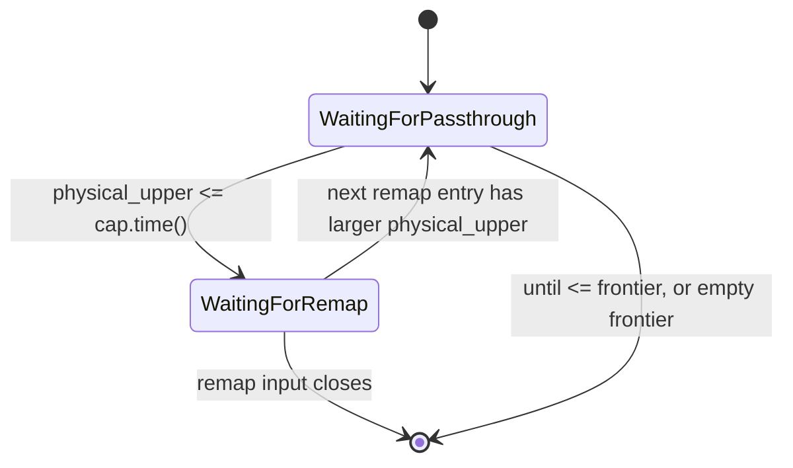

# Deasync `txns_progress_frontiers`

## Summary

Convert the `txns_progress_frontiers` operator in `src/txn-wal/src/operator.rs` from `AsyncOperatorBuilder` to the synchronous `OperatorBuilderRc`.
The operator's only awaits are on timely input handles, so no async runtime work is required; the async state machine exists purely to express "block until the next input event."
Two earlier attempts (PRs 36537, 36548) were reverted or abandoned after the conversion silently changed behavior.
This document specifies a conversion whose correctness rests on two provable facts rather than on a re-derivation of the operator's per-activation logic.

## Motivation

The goal is to drop the `builder_async` dependency for this operator and to make its logic auditable as plain Rust.
The async lowering also produces large debug-mode stack frames, but the stack-overflow fix (PR 36538) is a separate concern and is out of scope here.
The async state machine's semantics are subtle: it blocks on two independent inputs and its correctness depends on the precise interleaving of those blocking points.
A naive flattening into a per-activation drain loses that interleaving, which is how both prior attempts introduced bugs.

## Scope

In scope:

* `txns_progress_frontiers` only.

Out of scope:

* `txns_progress_source_global`, whose awaits are genuine persist I/O (`rx.recv`, `open_writer`, `data_subscribe`) and which legitimately needs async.
* The `forget_at` debug-mode stack-overflow boxing (PR 36538).

## Reference: The async operator's semantics

The async operator holds one output capability `cap`; `cap.time()` records how far the passthrough input has been copied.
It maintains `remap: Option<DataRemapEntry<T>>`, initialized to `{physical: min, logical: min}`, where `None` signals shutdown.
A `DataRemapEntry` carries the invariant `physical_upper <= logical_upper`, and `[physical_upper, logical_upper)` is known empty of writes in the definite sense.

The operator blocks on exactly one input at a time, selected by a single comparison:

* When `remap.physical_upper <= cap.time()` (enough data copied), it advances `cap` to `logical_upper` and blocks on the **remap** input for the next entry.
  The passthrough frontier is not consulted in this mode.
* Otherwise (more data needed), it blocks on the **passthrough** input, emitting data at `cap` and advancing `cap` via passthrough progress.
  The `until` and empty-frontier shutdown checks run only in this mode.



The "two modes" are not extra state; they are derived from `remap.physical_upper <= cap.time()`.

## Prior failures

All three known bugs came from flattening the two independently-blocking awaits into one stateless per-activation `for_each` drain:

* **PER-4 stall** (fixed in 36537): the async impl drops the last remap entry when the remap input reaches the empty antichain, after which `cap` can only advance via the passthrough frontier, which is bounded by the data shard's physical upper.
  `cap` then stalls below `logical_upper`.
* **replica-targeted-select-abort** (addressed in 36537): consulting the passthrough frontier while waiting for remap drops the capability prematurely, so `SELECT AS OF MAX` completes empty instead of blocking.
* **SQL-299 data loss** (attempted in 36548): applying the `until`-driven capability drop before draining the buffered passthrough data discards buffered rows at the tail of a `SUBSCRIBE ... UP TO`.

A mechanical async-to-sync recipe does not prevent these, because the hard part is semantic, not mechanical.

## Approach

Keep the operator as a synchronous `OperatorBuilderRc` with `builder_async::button` providing the `PressOnDropButton` return.
Persist three pieces of state across activations in the schedule closure:

* `capability: Option<Capability<T>>` — `cap.time()` is how far passthrough data has been copied; `None` means shut down.
* `remap: DataRemapEntry<T>` — the last observed entry, retained even after the remap input closes; initialized to `{min, min}`.
* `remap_closed: bool` — whether the remap input has reached the empty antichain.

No `VecDeque` and no `latest_remap_log` (both present in 36548).
The stepwise advance those provided is recovered by folding remap eagerly each activation plus the per-activation decision below.

### The two facts

Correctness reduces to two provable facts.

**Fact 1 — buffered passthrough data is always safe to emit at the pre-activation cap.**
`cap` only moves forward.
Before an activation, every data record with time `< cap.time()` was already emitted, because `cap` is only advanced past a time after the data input frontier passed it.
So every record still buffered has time `>= cap.time()`, and emitting at the pre-activation `cap` satisfies `send_time <= record_time` unconditionally.

**Fact 2 — no data exists in `[physical_upper, logical_upper)`.**
This is the definition of `DataRemapEntry`.
When the decision logic downgrades `cap` to `logical_upper`, every not-yet-emitted record has time `< physical_upper` (already emitted) or `>= logical_upper`, never strictly between.
So the remap-driven downgrade never strands a record below the new cap.

### Per-activation algorithm

```text
1. if shutdown button pressed locally -> wedge (keep capability, leave inputs
                                          undrained, reschedule) until ALL
                                          workers pressed; then capability =
                                          None and drain inputs
                                          (mirrors builder_async two-phase
                                          shutdown; early local drop would let
                                          the downstream frontier advance past
                                          this worker's discarded input during
                                          cross-worker teardown skew)
2. drain remap_input.for_each         -> fold into `remap`:
                                          keep larger logical_upper, assert physical monotone
3. fold remap frontier:                  Some(l) -> bump remap.logical_upper
                                          None    -> remap_closed = true
4. EMIT all buffered passthrough data at current cap     // Fact 1; BEFORE any downgrade
5. waiting_for_remap = !remap_closed && remap.physical_upper <= cap.time()
   if waiting_for_remap:
       if cap.time() < remap.logical_upper: cap.downgrade(logical_upper)   // Fact 2
   else:
       pf = passthrough frontier
       if until <= pf            -> capability = None
       else if pf == empty       -> capability = None
       else if cap.time() < pf   -> cap.downgrade(pf)
6. after remap close, still advance cap to logical_upper  // Fact 2 / PER-4 divergence
```

Step 4 before step 5 is the SQL-299 fix, forced by Fact 1 rather than bolted on.
Steps 2 and 3 plus the `waiting_for_remap` gate are the replica-select-abort fix.

The async `loop`/`continue` that walked remap entries one at a time collapses here, because step 2 folds all buffered remap entries to the one with the largest `logical_upper` (asserting `physical_upper` stays monotone), and step 3 bumps `logical_upper` from the remap frontier.
When several entries arrive in one activation this skips the intermediate `logical_upper`s and advances `cap` straight to the latest once its `physical_upper` is reached; the frontier still reaches the same final value, so it is a granularity, not a correctness, difference.
This is the structure that shipped in the reverted PR 36537 (whose only defect was the SQL-299 ordering bug fixed by step 4), so it is production-proven for frontier advancement; the fuzz test additionally confirms no data loss under arbitrary interleavings.

### Intentional divergence from async

The async impl sets `remap = None` on remap-input close, which disables the whole `cap.downgrade(logical_upper)` path and leaves the passthrough frontier as the only driver.
That frontier is bounded by the physical upper, producing the PER-4 stall.
The sync impl deliberately diverges: it **retains the last `remap`** after close and keeps advancing `cap` to `logical_upper` (step 6).
This is the single legitimate point of divergence from the async impl.

## Testing

All tests live in a single-worker harness that drives the operator on a scripted sequence of actions (send remap entry, advance remap frontier, send passthrough data, advance passthrough frontier, step) via `scope.new_input`, captures the output stream, and reports the final output frontier.

1. **Targeted regression tests, one per known failure.**
   Deterministic, hand-driven schedules:
   * PER-4 stall: `cap` advances to `logical_upper` after the remap input closes.
   * replica-targeted-select-abort: `SELECT AS OF MAX` blocks (capability retained) rather than completing empty.
   * SQL-299: a record buffered when the passthrough frontier crosses `until` in one activation is emitted, not dropped.
   Each test was confirmed to fail when its corresponding fix is reverted in the operator, proving it has teeth.
2. **Oracle-free property fuzz test, the backstop against unknown interleavings.**
   Generate randomized interleavings of remap entries, passthrough data, and frontier advances, and assert two sound properties of the sync operator directly:
   * No data loss or duplication: the emitted payload multiset equals the sent payload multiset.
     The operator passes through all passthrough data while it holds a capability, so this holds under arbitrary interleavings — including schedules that violate the remap emptiness contract, which only strengthens the test.
   * No premature shutdown: with `until = ∅` and no passthrough close, the operator never legitimately drops its capability, so the output frontier stays finite.

   An earlier design compared the sync operator against the async impl as a differential oracle.
   That was abandoned: the async impl strands data on contract-violating random schedules (it trusts the emptiness contract and advances its capability past buffered data), so it is not a sound oracle in a synthetic harness, and making it sound would require faithfully re-modeling the data-shard/txns protocol in the generator — a second layer of subtle invariants as error-prone as the operator itself.
   The direct property assertions catch the same bug classes (data loss, premature shutdown) without that risk.
3. **Existing crate tests stay green.**
   `data_subscribe`, `subscribe_shard_finalize`, `subscribe_shard_register_forget`, and `as_of_until` (relaxed: the deasynced operator emits each batch at its current capability, so per-batch stream timestamps are cadence-dependent and not contractual; the test now asserts the record set and the differential invariant `stream_ts <= record_time`).

The async impl is removed entirely once the sync impl lands; it is not retained as a test oracle.

## Risks

* The sync timely API exposes data via `for_each` and the frontier as a post-activation snapshot, not as the interleaved one-at-a-time event stream the async impl consumed.
  The conversion therefore relies on Fact 1 and Fact 2 to reorder work safely rather than reproducing the interleaving directly.
* The fuzz test asserts data preservation and non-shutdown but not exact frontier advancement; the specific frontier behaviors (PER-4 advance, AS-OF-MAX block) are covered by the targeted regression tests instead.
