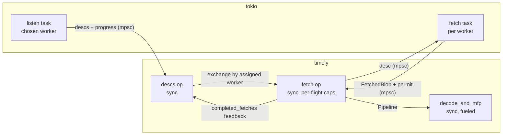

# Persist source: deasync and fetch backpressure

- Associated:
  - [#36910](https://github.com/MaterializeInc/materialize/pull/36910) (phase 1 implementation)
  - [#36810](https://github.com/MaterializeInc/materialize/pull/36810) (txn-wal deasync precedent)
  - `compute_dataflow_max_inflight_bytes` / `compute_dataflow_max_inflight_bytes_cc` dyncfgs

## The problem

The persist source places no bound on fetched-but-undecoded blob data by default.
`shard_source_fetch` downloads parts and emits `FetchedBlob`s into an unbounded timely channel, where they queue until `decode_and_mfp` drains them.
Decode costs roughly twice the CPU of fetch, so during hydration the fetch side outpaces decode and raw blob buffers accumulate.
A production heap profile of a compute replica showed ~91% of live heap attributed to the blob coalescing buffer in `S3Blob::get` (`src/persist/src/s3.rs`), with a 14× spike during hydration over steady state.

Two bounds exist, and neither is effective.
The `granular_backpressure` scope in `persist_source` limits in-flight encoded bytes, driven by `compute_dataflow_max_inflight_bytes` (default `None`) and `compute_dataflow_max_inflight_bytes_cc` (default `None`).
The cc variant was defaulted off on the assumption that persist lgalloc would absorb the memory pressure, but lgalloc is disabled on the affected replicas and the project is moving away from lgalloc entirely.
The flow-control mechanism is also complex: it encodes per-part retirement into a `Subtime` component of the timestamp, runs in a dedicated inner scope, and feeds back progress through a probe, with documented overshoot at batch granularity.

Separately, persist itself already implements exactly the RAII byte-semaphore this design originally proposed: `BatchFetcher::fetch_leased_part` acquires permits from a `MetricsSemaphore` before each download (`src/persist-client/src/fetch.rs`), the permit is stored in `FetchedBlob.fetch_permit`, cloned into `ShardSourcePart` at `parse()`, and released only when `decode_and_mfp` retires the part.
But its budget is `memory_limit × persist_fetch_semaphore_permit_adjustment` (default 1.0) on cc replicas — allowing in-flight fetched bytes up to the entire process memory limit, justified by the same lgalloc-spills assumption — and `Semaphore::MAX_PERMITS` (unbounded) on non-cc replicas, on the assumption that `granular_backpressure` covers them.
The affected replicas run without lgalloc and without `granular_backpressure`, so in practice the fetch pipeline is unbounded.

Separately, the persist source is built on `AsyncOperatorBuilder`, and we are migrating timely operators off the async bridge (see #36810).
Solving the backpressure problem inside the async operators would build new plumbing on machinery scheduled for removal.

## Success criteria

* Fetched-but-undecoded bytes are bounded per worker by default, without operator configuration.
* Flow control no longer uses timely frontier machinery: no `Subtime`, no inner scope, no probe feedback.
* The persist source operators (`shard_source_descs`, `shard_source_fetch`, `decode_and_mfp`) no longer use `AsyncOperatorBuilder`.
* Leases are not released before their part's fetch completes, and the source frontier remains correct.
* No deadlocks or stalls, including parts larger than the budget, shutdown mid-fetch, and fetch task panics.
* Hydration throughput is unchanged when the budget is not the bottleneck.

## Out of scope

* Bounding decoded data downstream of `decode_and_mfp` (exchange channels, merge batchers).
* Migrating storage ingestion's `storage_dataflow_max_inflight_bytes` machinery; it can follow the same pattern later.
* Changing part distribution: one subscribe on a chosen worker plus timely exchange is retained.
* lgalloc policy.

## Solution proposal

Rewrite the persist source as synchronous timely operators (`OperatorBuilderRc`) paired with tokio tasks that own all async work.
Backpressure is the existing fetch semaphore: `fetch_leased_part` already acquires byte permits that are released when decode retires the part, so no new mechanism is added.
Instead, the semaphore's gating is fixed: the `is_cc_active` condition is removed so non-cc replicas are bounded too, and the budget is tuned via the existing `persist_fetch_semaphore_permit_adjustment` dyncfg.
The `granular_backpressure` scope, `FlowControl`, `Subtime`, and both compute dyncfgs are deleted in a later phase, as they are redundant with the semaphore.



### Operators and tasks

**Listen task (tokio, chosen worker only).**
Owns the snapshot, listen, and leased reader, and applies the stats-based `filter_fn` and audit budget (which gain `Send` bounds, as do `listen_sleep` and `start_signal`).
Pushes parts (split into `ExchangeableBatchPart` plus `Lease`) and progress frontiers over an unbounded channel and wakes the descs operator through a `SyncActivator`-backed activator.
Sends the empty frontier as its final message before exiting (shutdown signal pattern from #36810).
The descs operator holds its `AbortOnDropHandle` and releases the listen handle (and with it the reader's SeqNo hold) through a oneshot only once the completed-fetches frontier is empty, so the reader outlives all in-flight fetches.

**Descs operator (sync, all workers).**
Built on all workers; non-chosen workers drain inputs and hold no capabilities.
The separate `shard_source_descs_return` operator is merged in: the completed-fetches stream becomes a disconnected second input.
The chosen worker drains the listen channel, downgrades capabilities to the received progress frontier, stores each part's `Lease` in the existing `LeaseManager`, and exchanges `ExchangeableBatchPart`s by their randomly assigned worker index.
The `completed_fetches` feedback input advances the `LeaseManager` exactly as today.

**Fetch operator (sync, per worker) + fetch task (tokio, per worker).**
The operator forwards each incoming desc to its fetch task over a channel and retains per-flight capabilities for both outputs:

```rust
inflight_caps.push_back((cap.delayed(cap.time(), 0), cap.delayed(cap.time(), 1)));
```

The fetch task runs the backpressure loop:

```rust
while let Some(part) = desc_rx.recv().await {
    // `fetch_leased_part` internally acquires byte permits from the persist
    // fetch semaphore before downloading; the permit is stored in the
    // returned `FetchedBlob` and released when decode retires the part.
    let fetched = fetcher.fetch_leased_part(part).await?;
    blob_tx.send(fetched)?;
    activator.activate()?;
}
```

On activation the operator drains the blob channel, marries each result to its capability pair in order (the task processes descs in order, so FIFO matching is sound), emits the `FetchedBlob` at the first capability, and drops the second.
Dropping the second capability advances the `completed_fetches` feedback frontier, which releases the lease on the chosen worker — the same contract as today, where the lease is released once the bytes are downloaded.

**Decode operator (sync, per worker).**
`decode_and_mfp` is already a synchronous operator with a fueled `do_work` loop and activator-based self-rescheduling; it requires no changes.
The fetch permit already reaches it today: `FetchedBlob.fetch_permit` is cloned into `ShardSourcePart` at `parse()` and dropped when `PendingWork` retires the part, so the budget covers fetch start through row emission.

### Backpressure semantics

* The budget is the existing process-wide persist fetch semaphore: `memory_limit × persist_fetch_semaphore_permit_adjustment` permits, costed at `encoded_size_bytes × persist_fetch_semaphore_cost_adjustment` per part.
* The `is_cc_active` gate on the budget is removed, so non-cc replicas are bounded as well; without it they get `Semaphore::MAX_PERMITS`.
* The defaults (`1.0` and `1.2`) were sized for lgalloc spill and are too lax for heap-resident buffers; retuning happens via the existing dyncfgs and does not require this rewrite (see open questions for the new default).
* A blocked fetch task leaves descs queued in its channel and, transitively, in the fetch operator's input; descs are small (metadata, the lease stays on the chosen worker).
* `compute_dataflow_max_inflight_bytes{,_cc}` are removed in phase 2 together with the `granular_backpressure` scope.

Compared to `granular_backpressure`:

| | `granular_backpressure` (flag on) | fetch semaphore |
|---|---|---|
| bound window | desc emission → decode frontier | fetch start → rows emitted |
| overshoot | batch granularity | ≤ 1 part per acquire |
| mechanism | `Subtime` + probe + capabilities | RAII permit (already shipped) |
| default | off | on for cc; on for all after this change |
| scope | per dataflow | per process |

### Safety

* **No deadlock.**
  Permits are released by decode progress on the same worker; fetch → decode is `Pipeline`, so no cross-worker wait cycle exists.
  `MetricsSemaphore::acquire_permits` already clamps requests to the total permit count, so any single part can always acquire.
* **No premature lease release.**
  The per-flight capability on the completed-fetches output is held until the fetched blob is emitted, which is stricter than the implicit input→output frontier tracking of the async builder.
* **Shutdown.**
  Dropping the operators drops the channel senders and `AbortOnDropHandle`s; tasks observe closed channels and exit; dropped permits release the budget.
* **Task failure.**
  Sending on a closed desc channel is a panic (`expect`), and a disconnected fetch-result channel with fetches still in flight is an assertion failure, so a dead task cannot silently stall the dataflow.
  Fetch and listen errors route through the existing `ErrorHandler`; the reporting operator then freezes, retaining its capabilities so no spurious progress is observable while a restart is pending.
* **Frontier correctness.**
  Buffered data is emitted at retained capabilities before any downgrade, following the SQL-299 fix-by-construction approach from #36810.

### Phasing

1. Deasync `shard_source_descs` (merging its `_return` lease operator) and `shard_source_fetch`; remove the `is_cc_active` gate from the fetch semaphore.
   `decode_and_mfp` and the permit plumbing are untouched; behavior on cc replicas is unchanged.
2. Retune `persist_fetch_semaphore_permit_adjustment` for heap-resident (non-lgalloc) operation, first via LaunchDarkly, then as the code default.
3. Remove `compute_dataflow_max_inflight_bytes{,_cc}` and the `granular_backpressure` scope, `FlowControl`, and `Subtime`, which are redundant with the semaphore.
   Removing the inner scope flattens `persist_source_core` timestamps from `(Timestamp, Subtime)` to `Timestamp`, which touches every consumer of the decoded stream and lands as its own mechanical change.

### Observability

* Gauge: in-flight fetched bytes per source (`budget - available_permits`), replacing the `backpressure_*` shard metrics.
* Histogram: permit acquisition wait time, to detect budget-bound hydrations.
* Decode remains on timely workers, so dataflow introspection of decode cost is unchanged.

### Testing

Delivered in phase 1:

* Existing `shard_source` unit tests pass unchanged.
* New regression tests: end-to-end data fetch (a written batch is emitted as a `FetchedBlob` and the frontier reaches the upper), shutdown mid-stream (dropping tokens drains the dataflow to the empty frontier), and error freeze (an unserveable `as_of` reports through the `ErrorHandler` and the frontier stays at the `as_of`).
* The txn-wal suite, including `stress_correctness`, which surfaced a test-harness liveness assumption: harnesses that park workers indefinitely (`step_or_park(None)`) while polling state that does not activate the worker relied on the async operators' listen retry timers as accidental wakeups; with the listen in a task, a caught-up source produces no activations, so such parks must be bounded.

Deferred:

* A fuzz test over random interleavings of desc arrival, fetch completion, and shutdown, per #36810's approach.
* Hydration benchmark before/after retuning the budget (phase 2).

## Minimal viable prototype

Phase 1 is implemented in [#36910](https://github.com/MaterializeInc/materialize/pull/36910): `shard_source_fetch` first (per-flight capabilities, fetch task), then `shard_source_descs`, leaving decode untouched.
Remaining validation: a heap profile of a hydration confirming the `mz_persist_semaphore_available_permits{name="fetch"}` gauge tracks the `S3Blob::get` allocation site.

## Alternatives

* **Tune the existing knobs only.**
  Lowering `persist_fetch_semaphore_permit_adjustment` (cc replicas) or setting `compute_dataflow_max_inflight_bytes` (non-cc) fixes the incident with zero code.
  Worth doing as an immediate production mitigation independent of this design, but it keeps the unbounded non-cc default, the `Subtime` machinery, and the async bridge dependency.
* **A new per-dataflow semaphore in the operators.**
  The original draft of this design; superseded by the discovery that the persist fetch semaphore already implements the same RAII lifecycle process-wide.
  Adding a second, per-dataflow budget on top remains possible later if process-wide coupling proves problematic.
* **Full async rewrite including part distribution.**
  Per-worker listens would multiply consensus and pubsub load by the worker count, and moving decode to tokio loses worker-scaled CPU and dataflow introspection.
  Rejected; the hybrid keeps timely where timely earns its place.

## Open questions

* New default for `persist_fetch_semaphore_permit_adjustment` once heap-resident: needs sizing against typical replica memory limits and arrangement footprints; likely well below 1.0.
* Per-process budget couples dataflows (one slow decoder starves other dataflows' fetches); whether that needs a per-dataflow refinement in practice.
* Whether `announce_memory_limit` is populated on all deployment paths the semaphore should bound; processes without it remain unbounded.
* Ordering with #36810: both touch the async-to-sync conversion patterns; land txn-wal first to validate the shared patterns, or in parallel?
* ~~Whether `desc_transformer` users (txn-wal) constrain the desc-channel handoff in the fetch operator.~~ Resolved: the transformer interposes on the descs stream and is unaffected; the txn-wal suite passes unchanged.
