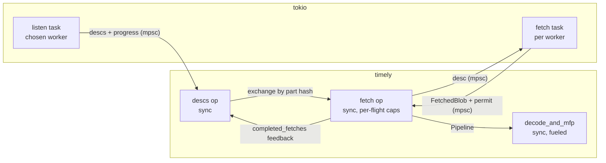

# Persist source: deasync and fetch backpressure

- Associated:
  - [#36810](https://github.com/MaterializeInc/materialize/pull/36810) (txn-wal deasync precedent)
  - `compute_dataflow_max_inflight_bytes` / `compute_dataflow_max_inflight_bytes_cc` dyncfgs

## The problem

The persist source places no bound on fetched-but-undecoded blob data by default.
`shard_source_fetch` downloads parts and emits `FetchedBlob`s into an unbounded timely channel, where they queue until `decode_and_mfp` drains them.
Decode costs roughly twice the CPU of fetch, so during hydration the fetch side outpaces decode and raw blob buffers accumulate.
A production heap profile of a compute replica showed ~91% of live heap attributed to the blob coalescing buffer in `S3Blob::get` (`src/persist/src/s3.rs`), with a 14× spike during hydration over steady state.

A bound exists, but it is opt-in and disabled.
The `granular_backpressure` scope in `persist_source` limits in-flight encoded bytes, driven by `compute_dataflow_max_inflight_bytes` (default `None`) and `compute_dataflow_max_inflight_bytes_cc` (default `None`).
The cc variant was defaulted off on the assumption that persist lgalloc would absorb the memory pressure, but lgalloc is disabled on the affected replicas and the project is moving away from lgalloc entirely.
The flow-control mechanism is also complex: it encodes per-part retirement into a `Subtime` component of the timestamp, runs in a dedicated inner scope, and feeds back progress through a probe, with documented overshoot at batch granularity.

Separately, the persist source is built on `AsyncOperatorBuilder`, and we are migrating timely operators off the async bridge (see #36810).
Solving the backpressure problem inside the async operators would build new plumbing on machinery scheduled for removal.

## Success criteria

* Fetched-but-undecoded bytes are bounded per worker by default, without operator configuration.
* Flow control no longer uses timely frontier machinery: no `Subtime`, no inner scope, no probe feedback.
* The persist source operators (`shard_source_descs`, `shard_source_fetch`, `decode_and_mfp`) no longer use `AsyncOperatorBuilder`.
* Leases are not released before their part's fetch completes, and the source frontier remains correct.
* No deadlocks or stalls, including parts larger than the budget, shutdown mid-fetch, and fetch task panics.
* Hydration throughput is unchanged when the budget is not the bottleneck.

## Out of scope

* Bounding decoded data downstream of `decode_and_mfp` (exchange channels, merge batchers).
* Migrating storage ingestion's `storage_dataflow_max_inflight_bytes` machinery; it can follow the same pattern later.
* Changing part distribution: one subscribe on a chosen worker plus timely exchange is retained.
* lgalloc policy.

## Solution proposal

Rewrite the persist source as synchronous timely operators (`OperatorBuilderRc`) paired with tokio tasks that own all async work.
Backpressure becomes a byte-budget `tokio::sync::Semaphore` acquired by the fetch task before each download; the permit rides with the data and drops when decode retires the part.
The `granular_backpressure` scope, `FlowControl`, `Subtime`, and both compute dyncfgs are deleted.



### Operators and tasks

**Listen task (tokio, chosen worker only).**
Owns the `Subscribe` and the leased reader.
Pushes `(parts, progress frontier)` over an unbounded channel and wakes the descs operator through a `SyncActivator`.
Sends the empty frontier as its final message before exiting (shutdown signal pattern from #36810).
Its `AbortOnDropHandle` is shared via `Rc` with the descs operator so the reader (and its SeqNo hold) outlives all in-flight fetches.

**Descs operator (sync, all workers).**
Built on all workers; non-chosen workers drain inputs and hold no capabilities.
The chosen worker drains the listen channel, downgrades capabilities to the received progress frontier, stores each part's `Lease` in the existing `LeaseManager`, and exchanges `ExchangeableBatchPart`s by part hash.
The `completed_fetches` feedback input advances the `LeaseManager` exactly as today.

**Fetch operator (sync, per worker) + fetch task (tokio, per worker).**
The operator forwards each incoming desc to its fetch task over a channel and retains per-flight capabilities for both outputs:

```rust
inflight_caps.push_back((cap.retain_for_output(0), cap.retain_for_output(1)));
```

The fetch task runs the backpressure loop:

```rust
while let Some(part) = desc_rx.recv().await {
    let bytes = part.encoded_size_bytes().min(budget_bytes); // jumbo parts overshoot, never deadlock
    let permit = semaphore.acquire_many_owned(to_permits(bytes)).await?;
    let fetched = fetcher.fetch_leased_part(part).await?;
    blob_tx.send((fetched, permit))?;
    activator.activate()?;
}
```

On activation the operator drains the blob channel, marries each result to its capability pair in order (the task processes descs in order, so FIFO matching is sound), emits the `FetchedBlob` at the first capability, and drops the second.
Dropping the second capability advances the `completed_fetches` feedback frontier, which releases the lease on the chosen worker — the same contract as today, where the lease is released once the bytes are downloaded.

**Decode operator (sync, per worker).**
`decode_and_mfp` keeps its `PendingWork` queue and fueled `do_work` loop, converted from `AsyncOperatorBuilder` to `OperatorBuilderRc`.
Yielding on fuel exhaustion becomes self-reactivation through the operator's activator instead of an await point.
The semaphore permit moves from the `FetchedBlob` into `PendingWork` and drops when the part is fully drained, so the budget covers fetch start through row emission.

### Backpressure semantics

* The budget is a per-worker byte semaphore: `persist_source_max_inflight_fetch_bytes / peers`, with permits in KiB units to stay within tokio's permit limit.
* The dyncfg defaults to a finite value (see open questions); `compute_dataflow_max_inflight_bytes{,_cc}` are removed.
* A blocked fetch task leaves descs queued in its bounded desc channel and, transitively, in the fetch operator's input; descs are small (metadata, the lease stays on the chosen worker).
* Overshoot is at most one clamped part per worker, replacing the batch-granularity overshoot of the current scope.

Compared to `granular_backpressure`:

| | today (flag on) | this design |
|---|---|---|
| bound window | desc emission → decode frontier | fetch start → rows emitted |
| overshoot | batch granularity | ≤ 1 clamped part per worker |
| mechanism | `Subtime` + probe + capabilities | RAII permit |
| default | off | on |

### Safety

* **No deadlock.**
  Permits are released by decode progress on the same worker; fetch → decode is `Pipeline`, so no cross-worker wait cycle exists.
  The jumbo-part clamp guarantees any single part can always acquire.
* **No premature lease release.**
  The per-flight capability on the completed-fetches output is held until the fetched blob is emitted, which is stricter than the implicit input→output frontier tracking of the async builder.
* **Shutdown.**
  Dropping the operators drops the channel senders and `AbortOnDropHandle`s; tasks observe closed channels and exit; dropped permits release the budget.
* **Task failure.**
  Channel disconnect in an operator is a panic (`expect`), not a silent stall; fetch errors route through the existing `ErrorHandler` via an error channel drained on activation.
* **Frontier correctness.**
  Buffered data is emitted at retained capabilities before any downgrade, following the SQL-299 fix-by-construction approach from #36810.

### Phasing

1. Deasync the three operators with the semaphore present but the budget effectively unbounded.
   This isolates the structural risk; behavior matches today with flags unset.
2. Flip the budget default to a finite value; remove `compute_dataflow_max_inflight_bytes{,_cc}` and the `granular_backpressure` scope, `FlowControl`, and `Subtime`.
   Removing the inner scope flattens `persist_source_core` timestamps from `(Timestamp, Subtime)` to `Timestamp`, which touches every consumer of the decoded stream and lands as its own mechanical change.

### Observability

* Gauge: in-flight fetched bytes per source (`budget - available_permits`), replacing the `backpressure_*` shard metrics.
* Histogram: permit acquisition wait time, to detect budget-bound hydrations.
* Decode remains on timely workers, so dataflow introspection of decode cost is unchanged.

### Testing

* Existing `shard_source` unit tests, converted.
* Regression tests per #36810's approach: lease-release ordering (capability held until emission), shutdown mid-fetch, jumbo part progress, fetch task panic propagation.
* A fuzz test over random interleavings of desc arrival, fetch completion, fuel exhaustion, and shutdown, asserting no data loss, no stall, and budget compliance.
* Hydration benchmark before/after with the budget unbounded (phase 1) and bounded (phase 2).

## Minimal viable prototype

Prototype phase 1 in a worktree: deasync `shard_source_fetch` only, with the semaphore and per-flight capabilities, leaving descs and decode async.
Validate with the existing test suite plus a heap profile of a hydration under `bin/environmentd`, confirming the in-flight gauge tracks the `S3Blob::get` allocation site.
The timely-deasync skill patterns (per-flight capabilities, shared task handles) come from a prior prototype of exactly this operator, which de-risks the approach.

## Alternatives

* **Enable the existing flags.**
  Setting `compute_dataflow_max_inflight_bytes_cc` fixes the incident with zero code, but keeps the `Subtime` machinery, keeps the async bridge dependency, and keeps a default-off footgun that already misfired once.
  Worth doing as an immediate production mitigation independent of this design.
* **Semaphore inside the async operators.**
  A small change (acquire in `shard_source_fetch`'s async body), but it builds on `AsyncOperatorBuilder`, which is being removed; the plumbing would be throwaway.
* **Full async rewrite including part distribution.**
  Per-worker listens would multiply consensus and pubsub load by the worker count, and moving decode to tokio loses worker-scaled CPU and dataflow introspection.
  Rejected; the hybrid keeps timely where timely earns its place.

## Open questions

* Default budget value: a multiple of `BLOB_TARGET_SIZE` per worker versus a fixed per-process number; needs sizing against typical replica memory limits.
* Per-dataflow versus per-process budget: per-process caps pod memory directly but couples dataflows (one slow decoder starves other dataflows' fetches); this design proposes per-dataflow, matching today's accounting.
* Ordering with #36810: both touch the async-to-sync conversion patterns; land txn-wal first to validate the shared patterns, or in parallel?
* Whether `desc_transformer` users (txn-wal) constrain the desc-channel handoff in the fetch operator.
