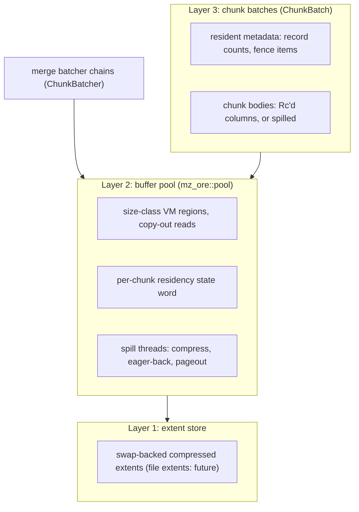

# Buffer-managed dataflow state

* Associated: [20260504_pager.md](20260504_pager.md) (the explicit pager this design succeeds), [CLU-65](https://linear.app/materializeinc/issue/CLU-65/pager).

## The problem

Materialize keeps dataflow state — merge-batcher chains, arrangement batches, upsert state — in resident memory, and treats disk as a reactive spill target.
The current mechanism is `mz_ore::pager`: a blob store that serializes a whole ~2 MiB columnar chunk and either hints it cold to the kernel (`Swap` backend) or writes it to a per-chunk scratch file (`File` backend).

Production experience with this design surfaced four structural problems.

First, the pager is a blob store, and the blob model caps what it can do.
Chunks page out whole and rehydrate whole; the partial-read API (`read_at_many`) has no production consumer.
Every page-in is a full deserialize-and-copy even when the reader needed a fraction of the data, and a resident chunk and its paged form are different types (`PagedColumn::Resident` vs `Paged` vs `Compressed`), so residency decisions are baked in at pageout time by a policy that can see only the chunk's size.

Second, the file backend pays filesystem metadata per chunk.
One named file per 2 MiB chunk means create, writev, open, pread, unlink per chunk per merge generation.
Profiling showed the hot cost is unlink and inode eviction — journaled extent deallocation plus page-cache invalidation under the inode lock — at 35.6 s versus 4.3 s for opens in the measured workload.
This is structural: the cost scales with chunk turnover, and merge-heavy workloads turn chunks over constantly.

Third, the swap backend trades control for laziness.
It wins when the working set mostly fits (data re-read before reclaim never touches disk, and translation is free) but under real pressure the kernel pages synchronously, per 4 KiB, on the worker thread: the pager design doc measured 64 s of sys time in a 65 s single-threaded merge, with TLB shootdowns and direct reclaim as user-visible latency.
The kernel also cannot know that a chunk consumed by a merge is dead, so it dutifully writes garbage to disk.

Fourth, and most importantly, on the columnar path only the pre-seal batcher stash spills at all.
Sealed spine batches — the arrangements proper, the dominant long-lived memory — are fully resident and invisible to any spill budget.
Columnation-era arrangements retain a transparent disk story through lgalloc's file-backed mappings (see Background), but the columnar containers removed lgalloc by design, and nothing replaced it past the batcher.
Hydration of a large arrangement holds the entire state in RSS regardless of how much of it is actively needed.

Buffer management for larger-than-memory state is an old and intensely studied problem in the database literature — not a solved one, as a decade of successive buffer-manager redesigns attests, but one rich in measured designs and documented failure modes to build on.
This design replaces the spill-a-blob model with a buffer-managed architecture in the style of Umbra and vmcache, adapted to the properties that make Materialize's problem easier than the general one: state is immutable once sealed, recreatable from persist (no durability requirement), and its lifecycle (just-built, sealed, queued-for-merge, dead) is known to the engine rather than guessed by a cache.

## Success criteria

The criteria, each annotated with how the implementation accompanying this design satisfies it:

* Resident access to a chunk costs no translation, no serialization, no copy.
  *Satisfied, with sharpened meaning:* a resident chunk is not in the pool at all, but a direct borrow of an `Rc`-shared column on the heap.
  A spilled body costs exactly one copy-out per read (a memcpy from a resident pool slot, a decompress from an evicted extent), never a hash-table translation and never a reference into pool memory.
* A chunk that dies before pressure forces it out never touches disk.
  *Satisfied:* freeing an `UnbackedResident` chunk is a pure memory operation, counted as `writes_elided`, and freeing a chunk with a write queued or in flight cancels the write.
* Workers never enter kernel direct reclaim on the state path, and any state-path I/O a worker performs is explicit, bounded, and chunk-granular at a point the engine chose — never an unscheduled page fault.
  *Satisfied:* compression and `MADV_PAGEOUT` run on spill threads, and reads are bounded, chunk-granular decompresses at the call sites the consumer chose.
* Chunk turnover performs no per-chunk filesystem metadata operations: no create, no unlink, no inode churn.
  *Satisfied by construction:* the implemented extent store is swap-backed anonymous memory and creates no filesystem objects at all. File extents remain future work.
* Sealed arrangement batches can be paged: a merge of two batches holds a bounded resident window rather than both batches.
  *Satisfied for the upsert feedback arrangement:* its trace is a spine of chunk batches whose bodies spill, and the fueled batch merger holds a bounded burst of loaded chunks. Compute's row spines still hold sealed batches resident (their chunk port is open). The criterion's cursor clause ("faults at most one leaf page per cold seek") is superseded: the design builds no cursor path over spilled bodies, and cold reads are batched copy-out probes instead.
* Hydration of an arrangement larger than the memory budget completes with RSS bounded by the budget, not by state size.
  *Satisfied for the upsert path, measured:* see Measured under Performance estimates.
* One budget pool covers batcher chains and arrangement batches; exceeding it triggers eviction of cold chunks rather than gating pageout decisions per chunk.
  *Satisfied:* one process-wide pool serves storage's stash and feedback arrangement and compute's batchers, correction buffers, and temporal buckets, under one budget.
* The swap and file backends of `mz_ore::pager`, and the `PagedColumn` residency enum, are deleted at the end of the migration.
  *Satisfied:* the migration deletes `mz_ore::pager`, `ColumnPager`, `PagedColumn`, `PagingPolicy`, and the tiered-pager dyncfgs, and reduces the `column_pager` module to `mz_timely_util::pool_config`, which only installs and configures the pool.

## Out of scope

* Durability and crash consistency.
  State is recreatable from persist; the scratch volume is a cache.
  No WAL, no manifest, no fsync anywhere in this design.
* Async restructuring of timely operators.
  Reads stay synchronous; a cold access stalls the worker for one bounded decompress.
  ForSt-style asynchronous state access is a separate project.
* Warm restart (reattaching to scratch state across process restarts).
  Unreachable on the swap-backed extent store, whose extents are anonymous memory and die with the process. It becomes reachable when the file extent store ships.
* Sharing on-disk format with persist parts.
  A north star (see Remote extents), not a requirement.
* Key-value separation (WiscKey-style out-of-line values).
  The value container stays abstract enough to add it; see Open questions.
* Non-Linux production support, as with the pager before it.

## Background

### Three generations of disk offload

Materialize has approached larger-than-memory state three times.

The first generation was [lgalloc](https://crates.io/crates/lgalloc) (integrated October 2023): a size-classed allocator that serves large allocations from memory-mapped files on the scratch volume.
Columnation-backed arrangement regions and persist's arrow buffers allocate through it (`enable_columnation_lgalloc`, default on), which is why columnation-era arrangements have a disk story today — but a transparent one: the kernel owns writeback and reclaim of the file-backed pages, including dirty-page writeback at its own discretion.
Operating it has meant approximating policy from below the allocation boundary: a background worker returning freed memory, eager-return and file-growth-dampener knobs, and eventually a disk usage limiter (May 2025) — all compensating for the fact that an allocator sees only `alloc` and `free`, never "this region is cold", "this run will be read sequentially next", or "this data is dead".

The second generation was kernel swap: provision swap on the cluster nodes and let the kernel page anonymous heap memory under pressure.
Swap subsumes the allocator seam — every allocation is implicitly offloadable, nothing opts in — but it conflates dataflow state with arbitrary heap allocations and hands eviction to the kernel at anonymous-page granularity.
The pager design doc records the endpoint: direct reclaim running on worker threads, `pgscan_direct` spikes during hydration, synchronous per-4 KiB faults serializing single-threaded merges.

The third generation is the explicit pager of [20260504_pager.md](20260504_pager.md): the application marks cold data and chooses a backend.
The columnar end-to-end project deliberately removed lgalloc from the columnar containers ([CLU-64](https://linear.app/materializeinc/issue/CLU-64/remove-lgalloc-from-columnar): `Column::Aligned` becomes a plain `Vec<u64>`) to create the seam the pager plugs into; the lgalloc copies in persist's arrow path are being removed in parallel.
The pager fixed the control problem at blob granularity but inherited the ceilings described under The problem.

This design is the fourth step, in two moves.
The buffer pool (`mz_ore::pool`) replaces the pager as the spill mechanism, first behind the pager's own seam and then without it.
Differential's `Chunk` abstraction ([PR #744](https://github.com/TimelyDataflow/differential-dataflow/pull/744), which the workspace builds against via a patched checkout carrying that work and the follow-on `UnloadChunk` bulk-read capability) then becomes the unit the pool manages end to end: the same chunk transits the collection, the batcher's chains, and the sealed spine batch, and its body's residency is the pool's decision throughout.
One piece of an earlier revision of this design inverts along the way.
Instead of pins and epochs making cursor borrows into pool memory sound, the read surface is copy-out at every layer, and the reader-accounting machinery is deleted rather than built (see "Reads are copy-out" under Layer 2 and the closed Open questions).
With the last pager consumer migrated, `mz_ore::pager`, its two backends, and the `PagedColumn` enum go with it.

This trajectory matters to the present design in two ways.
First, the first two generations differ only in where the kernel's transparency attaches — file-backed mappings versus anonymous memory — and share the failure mode, which the third generation answers only partially: the entity that owns eviction must be the entity that knows data lifecycle, and neither the kernel nor a size-only pageout policy can know it.
Second, lgalloc's address-space layout — size-classed regions over a scratch volume — is structurally Layer 2's layout; what changes is the direction of control, from file-backed mmap with kernel paging to anonymous memory with engine-scheduled explicit I/O.
In that sense Layer 2 is less a new mechanism than lgalloc with the kernel taken out of the loop.

### The workload, from first principles

The state this design serves has properties a general-purpose storage engine cannot assume:

* **Immutable after seal.** Columnar chunks and arrangement batches never mutate; the only state transitions are residency transitions.
  This deletes dirty tracking, write-back ordering, reader/writer latching on content, and torn-read hazards.
* **Recreatable.** Everything can be rebuilt from persisted sources, so every durability mechanism is deletable.
* **Lifecycle known to the engine.** The merge batcher knows which chains merge next; a consumed chunk is dead; hydration output is write-once-read-rarely by construction.
  A generic buffer manager spends real machinery (LeanStore's cooling stage, LRU approximations) guessing at coldness the engine here simply knows.
* **Maintenance is sequential; the update path is random and delta-proportional.**
  Merges, extraction, and hydration are linear scans and dominate bytes moved.
  The latency-critical path has the opposite shape: incremental operators do work proportional to arriving deltas — a join probes arrangements at exactly the updated keys, upsert reads back the keys in the input batch — and interactive peeks are fully random.
  How much each side matters is workload-dependent, and this is the assumption in this document most likely to draw disagreement: a design that follows the sequential framing too closely becomes a batch processor.
  Several choices below (batched probe extraction, the resident safety valve for cursor consumers, the record-cache open question) exist specifically to keep per-key probes cheap; see "Access patterns, read amplification, and policy" under Layer 3.
* **Already log-structured.** A differential spine is a tiered LSM: batches are immutable sorted runs, the fueled merge scheduler is the compactor, batcher chains are L0.
  The design question is not "adopt an LSM" but "give the existing LSM a paged run format and a buffer manager."

Tuning within the blob model continued alongside this design, and its best-known endpoint is instructive.
The strongest measured swap-backend strategy ([#36948](https://github.com/MaterializeInc/materialize/pull/36948), benchmarked in [CLU-108](https://linear.app/materializeinc/issue/CLU-108/correctionv2-pager-lz4-compress-spilled-chunks-madv-pageout-swap)) couples lz4 compression with an eager `MADV_PAGEOUT` over the compressed bytes at spill time: peak RSS holds at the budget (0.40 GiB versus 0.97 GiB with lazy hints, where RSS drifts to the cgroup cap and is relieved only at the kernel's pressure cliff).
The eager eviction pays precisely because compression shrinks the re-fault volume ~5.6×; on the uncompressed path the same hint is a measured net loss.
That result is this design's thesis expressed through kernel primitives — compress at the spill boundary, release physical memory eagerly, keep RSS honest against the budget — and it simultaneously marks the blob model's ceiling: re-access still faults synchronously per 4 KiB on worker threads, a chunk consumed moments after spill was evicted (and must be re-faulted) anyway because the kernel cannot know it was about to die, and the compress-and-evict decision remains irrevocable at pageout time.
Layer 2 keeps the converged policy — cold data compressed past the memory boundary, physical memory released eagerly — while replacing the mechanism with one the engine schedules, prioritizes, and can cancel.

The disk-versus-memory question is not binary.
Treating disk as the first-class home of all state (every chunk written at seal) buys pressure-free eviction and warm restart but imposes a write-bandwidth floor proportional to merge traffic — fatal for young data that dies in seconds, and for EBS-class disks.
Treating disk as a pure spill target avoids the floor but makes pressure handling a write storm at the worst moment and leaves nothing on disk to reattach to.
The resolution is that both modes share one mechanism and differ in a single policy bit — when must a chunk be backed — and the spine's geometric level structure supplies a principled threshold: lazy backing for young, churning data; eager backing for sealed, deep, long-lived data.

## Solution proposal

Three layers, built bottom-up.
The accompanying implementation carries Layers 1 and 2 in their swap-backed form, and Layer 3 on differential's chunk seam: end to end for the upsert path, and for batcher chains at every adopted arrange site, with the compute spine port remaining open.

### Layer 1: extent store

The extent store is an interface — allocate, write, read, free, in chunk-class-sized extents — not a single mechanism.
It has one implementation today and one future one, because production nodes provision the entire disk as swap and mount no scratch filesystem: file extents have nowhere to live until volume topology changes, and the design does not wait for that.

#### Swap-backed extents (implemented)

Where no filesystem exists, the extent store is anonymous memory the engine deliberately hands to kernel swap.
An extent is an extent-sized anonymous allocation, sized to the compressed payload (page-rounded), and residency on the device is a second, separate decision from writing: "write" compresses the chunk into the allocation, which *stays resident* — the compressed-but-resident tier of the residency ladder below — until the pool's RSS target forces a `pageout`, which pushes the pages to the swap device with `MADV_PAGEOUT`; "read" issues `MADV_WILLNEED` ahead of the decompress and makes the pages resident again; "free" is a plain deallocation, with any swapped copy discarded for free.
Nothing is ever both uncompressed and on the device: slots never reach swap (eviction discards them), and extents reach it only in compressed form.

This is the lz4 + `MADV_PAGEOUT` strategy of [#36948](https://github.com/MaterializeInc/materialize/pull/36948) generalized from a spill-path special case into the pool's backing layer — the same measured costs, the same ~5.6× reduction in swap traffic from compression, now with the pool's write elision and lifecycle policy above it — and then split in two: compression at write time, device pageout only when the resident ledger demands it.
Both halves run on spill threads (see I/O execution); `MADV_PAGEOUT` in particular is synchronous reclaim — page-table walks, TLB shootdowns, writeback submission — and belongs off the workers for exactly the reasons eviction does.

The backend has no metadata costs at all; its weakness is the read path, where the kernel owns fault servicing when a paged-out extent is read back — mitigated by compression (5.6× fewer bytes to fault) and `MADV_WILLNEED` prefetch, but not eliminated.

#### File extents (future)

Replace the anonymous extents with a few large preallocated files per worker (or `O_TMPFILE` inodes) and a userspace extent allocator.

* Allocation rounds to the chunk size classes (see Layer 2), so the free list is per-class and fragmentation is bounded by construction.
* Free is a free-list push.
  No unlink, no journal transaction, no inode eviction — the measured 35.6 s cost class becomes pointer arithmetic.
  Space is returned to the filesystem lazily and batched via `fallocate(FALLOC_FL_PUNCH_HOLE)` only if scratch-volume pressure demands it.
* I/O is `O_DIRECT`: the buffer pool (Layer 2) is the cache, and the kernel page cache would be a second copy of everything plus unpredictable writeback.
  Aligned buffers are natural for the serialized chunk format.
* The DuckDB temp-file model is precedent: slotted, recycled temp files in native block format rather than create-unlink per object.

This backend slots in behind the pool's extent interface with no changes above it, and lights up per cluster class as scratch volumes appear.
It benches head to head against the swap-backed store wherever hardware allows, and it is what makes warm restart reachable.

### Layer 2: buffer manager

#### Address space and translation

Reserve large anonymous virtual-memory regions per size class (Umbra's design).
The pool runs eight classes, 64 KiB through 8 MiB in powers of two: the top of the range covers the batcher's bimodal chunk shapes (see Measured), the bottom keeps small committed bodies out of oversized slots.
Classes of 2 MiB and up are hugepage-aligned and marked `MADV_HUGEPAGE`, so a slot's fault-in is a handful of hugepage faults rather than ~512 base-page faults.
Virtual reservation is `MAP_NORESERVE`-cheap; physical memory materializes on use and is released on eviction with `MADV_DONTNEED` — except for a bounded *warm pool* of freed slots (an eighth of the budget, capped at 1 GiB) that keep their pages mapped, so allocation-heavy phases reuse warm slots with zero page faults and zero kernel page-zeroing instead of re-faulting every insert.
The warm pool is deliberate, bounded RSS overshoot above the resident budget; the residency-tier section below accounts for it.
The pool memory is not file-backed: the pool is a cache over the extent store, not a view of it, and data moves between the two only through explicit, engine-scheduled I/O — the kernel never transfers a byte in either direction, unlike both lgalloc (where the mapping is the file) and swap (where anonymous memory is implicitly device-backed).

Slots are scoped to residency, and residency only descends.
A chunk is inserted resident, holds its slot until eviction, and once evicted serves every later read from its extent without ever reacquiring a slot.
No pointer into a slot exists outside the pool: reads copy out under the chunk's state lock (see "Reads are copy-out" below), so there is nothing to invalidate when eviction returns the slot and its physical pages to the free list.
This is the classical buffer-manager position (frame and data identity decoupled, access mediated by the owner) rather than vmcache's, and the divergence is deliberate.
vmcache fixes every page's address for the lifetime of the *database* in order to serve two consumers Materialize does not have: optimistic lock-free readers (which must be restartable — differential's cursors hand out borrows that cannot retry, and timely's worker-sharded arrangements make reader-side contention structurally absent anyway) and arbitrary reference graphs without pointer fix-up (all access here is copy-out through the handle).
What lifetime-stable addresses would cost is decisive at Materialize's scale: slot demand would track the *live* set — for backlog-shaped consumers, an unbounded un-drained backlog — putting a virtual-address ceiling on backlog size and, worse, accreting ~0.2% of peak backlog as unevictable page-table memory (vmcache budgets exactly this, ~2 GB DRAM per TB, and accepts it because its mapped entity is a bounded, purchased database; a transient queue inverts that economics).
Residency-scoped slots make slot demand track the budget instead: touched address space, and therefore page tables, are bounded by peak residency, and reservations can be absurdly generous (the pool reserves 1 TiB per class) without ever costing anything.

Translation while resident is arithmetic on the chunk handle: slot index times class size, no page table, no hash map.
The only synchronization on the read path is the chunk's own state lock, held for the duration of the copy.

#### Chunk states

Residency is a state, not a type.
Each chunk carries one state word (the vmcache per-page word, minus the dirty states immutability deletes):

* `UnbackedResident` — lives only in the pool; no extent copy exists.
* `WriteInFlight` — handed to a spill thread for compression; the chunk remains readable in its slot, and freeing it cancels the work.
  Completion lands an evicting chunk in `Evicted` and an eagerly backed one in `BackedResident`.
* `BackedResident` — an identical extent copy exists; eviction is a pure page release, no compression and no I/O.
* `Evicted` — extent copy only; the extent itself may still be RAM-resident (the compressed tier) or paged out to the device.
  Reads decompress the extent straight into the caller's buffer, and the chunk stays evicted.
* `Oversize` — payload exceeded the largest size class and fell back to an unpageable heap allocation; also the degraded landing state when an insert finds its size class exhausted (counted as `slot_exhausted_fallbacks`).
  A prototype limitation, counted and bounded but outside the budget.

The state word is guarded by a per-chunk mutex rather than a lock-free atomic, and there is no `Faulting` state, because nothing ever faults into a slot: reads copy out of whatever home the chunk currently has, and residency never ascends.

#### Reads are copy-out

Readers never hold references into pool memory.
`ChunkHandle::read_into` copies the whole body into a caller-owned buffer under the chunk's state lock: a resident slot is memcpy'd out directly, and an evicted extent decompresses straight into the destination without allocating a slot.
A read leaves residency untouched, raises no resident bytes, and converts no state, so read-only traffic over spilled data costs zero pool memory.
`ChunkHandle::take` is `read_into` followed by the free, and `ChunkHandle::prefetch` hints an evicted extent's pages back in ahead of need (`MADV_WILLNEED`), an advisory consumers may issue before a bulk read.

Because no reference into pool memory exists outside the pool, eviction needs no reader accounting at all.
There are no pins, no pin counts, no epochs, and no fault-in bookkeeping, and the evictor never has to ask whether a reader is active: it takes the same per-chunk lock the reader takes, so the two serialize by construction.
(Reading a paged-out extent does revive its compressed pages, which the pool re-counts against the compressed tier and re-enforces after the unlock.)

The trade is one copy per read of a spilled body.
Every consumer that adopted the seam reads in bulk (a merge loads a whole front, a probe pass extracts a whole hit set), so the copy amortizes over the chunk, and the design gives up nothing it uses: the per-record borrow that copy-out forecloses is exactly the cursor path Layer 3 deliberately does not offer over spilled bodies.

#### Write-behind, and never writing dead data

"Page out" becomes a state transition, not an I/O.
Two producers feed `WriteInFlight`, with different intents:

* **Budget eviction.** When resident bytes exceed the budget, enforcement selects a victim (spending its second chance), a spill thread compresses it into an extent, and the slot is released — the chunk lands `Evicted`.
  A chunk that was already `BackedResident` skips the spill thread entirely: its eviction is a pure page release inline.
* **Eager backing.** Spill threads with an empty eviction queue walk the candidate queue and compress unbacked chunks into extents *without* evicting them: the chunk lands `BackedResident`, still readable in its slot, and its eventual eviction becomes the cheap kind.
  A backing pass never spends a chunk's second chance — it must not age anything toward eviction.
  This is the eager/lazy policy bit of "Backing policy" below as implemented today: opt-in (`column_paged_batcher_eager_backing`), idle-cycle work, converting future pressure response from compress-under-deadline into page release.

This captures what made the pager's swap backend fast — laziness, free re-access before reclaim — while keeping what made its file backend controllable, and adds the one thing neither backend could do: freeing an `UnbackedResident` chunk is a pure memory operation, and freeing a `WriteInFlight` chunk cancels the write.
In a merge-heavy workload most chunks die young; avoided writes are the largest available win, and only the engine knows liveness.

#### Residency tiers and the RSS target

With the warm pool and the compressed-resident extents, "resident" is a ladder of four rungs, each bounded, cheapest to reclaim first:

1. **Slots** (uncompressed, directly readable) — bounded by the resident-bytes budget; crossing it compresses the coldest chunks into extents.
2. **Warm free slots** (pages kept mapped for reuse) — bounded by `min(budget / 8, 1 GiB)`.
3. **Compressed-resident extents** — bounded by the headroom the *pool RSS target* leaves above the first two rungs: `compressed cap = rss target − budget − warm cap`.
   Crossing it pages the oldest extents out to the device, FIFO.
4. **The swap device** — unbounded, holding whatever the ladder pushed down.

The identity that makes the ladder auditable: pool RSS ≤ budget + warm cap + compressed cap = max(rss target, budget + warm cap).
A target of zero (or anything at or below budget plus warm cap) collapses rung 3 — every extent pages out as soon as it is written — so the tier is strictly additive and disabled by dialing one knob.
The motivation is the same observation that makes zswap work: most evicted-then-refaulted data is refaulted soon, and serving those reads from compressed RAM (a decompress, microseconds) instead of the swap device (a device read, milliseconds) is a large win for a bounded RSS premium.
Rung 3 is zswap with the engine's lifecycle knowledge: dead extents free without writeback, and the engine chooses what enters the tier rather than the kernel intercepting pageouts.

Both bounds derive from *physical RAM* — `/proc/meminfo` `MemTotal` clamped by the cgroup limit — never from the announced memory limit, which on swap-provisioned nodes deliberately includes swap and would inflate a "fraction of memory" to a fraction of the disk.

#### Eviction policy

The pool itself speaks only a small second-chance FIFO, the backstop policy for unannotated chunks: the budget bounds resident bytes, and exceeding it selects eviction victims rather than gating pageout decisions per chunk.
It never receives hints.
Lifecycle knowledge is applied by the consumer, in the forms it actually takes:

* Dead chunks are freed, not evicted (there is nothing to keep), and the pool elides or cancels any pending write.
* Chunks reach the pool only at `settle`, the chunk API's commit point, so merge intermediates and in-flight output are never offered for spilling at all.
* Bodies below the smallest size class (64 KiB) stay resident, since spilling them trades no meaningful memory for slot waste.

LeanStore's cooling stage exists because a generic buffer manager must speculate about coldness; the engine here knows it, so the speculation machinery reduces to the backstop.
Richer hints (merge-imminent, write-once-read-rarely) can still be added if a consumer turns up that needs them; none has.

#### I/O execution

Transfers are chunk-granular.
A worker that needs a spilled body reads it synchronously: one bounded decompress into its own buffer, plus kernel swap-in first when the extent's pages were paged out (softened by the compressed-resident tier and `prefetch`).
Eviction-side I/O — compression and `MADV_PAGEOUT` — is a separate question with two candidate executors, and for the swap-backed store the staging prototype decided it: off-worker.

**Synchronous, on-worker — Umbra's model.**
The evicting worker writes the victim chunk itself.
Published Umbra works exactly this way — synchronous `pread`/`pwrite` from worker threads throughout, chosen explicitly for simplicity — and the simplicity is just as real here: no queues, no completion tracking, no cross-thread chunk-state transitions, and natural backpressure, since the worker causing spill pays for spill.
For a file-extent write the stall arithmetic may well be acceptable: a 2 MiB `O_DIRECT` write at device speed is roughly a millisecond, bounded, chunk-granular, and taken at a point the engine chose — categorically different from swap's unbounded per-4 KiB fault storms even though both are "synchronous".
This option remains live for the file-extent backend.

**Asynchronous, off-worker — LeanStore's page-provider model, the implemented shape.**
A small pool of dedicated spill threads consumes the eviction and backing queues, so workers never perform eviction I/O.
For the swap-backed store, eviction cost is `MADV_PAGEOUT` page-table work rather than a device write; unguarded on-worker enforcement pinned CPUs on staging, and off-worker spill threads behind single-flight budget enforcement and a bounded queue resolved it.
The implemented shape: a configurable number of spill threads, spawned once at first enable (thread count changes apply at the next process start); budget enforcement is single-flighted, while compressed-tier enforcement is deferred to the spill threads by notification, with two backstops — workers enforce inline when no spill threads exist, and when the tier overshoots to twice its cap (the queue has demonstrably fallen behind, and a late bound beats no bound).
Workers also still evict inline when the spill queue is full — the backpressure path.

The chunk state machine is identical in both shapes; only the executor of the `WriteInFlight` transition differs, so the choice stays contained behind one interface and revisitable per backend.
Eviction throughput is bounded by `madvise` page-table work and TLB shootdowns (the vmcache paper's measured ceiling; their fix, the exmap kernel module, is not shippable here).
Mitigation is granularity: 2 MiB chunks are ~500× fewer page-table operations per byte than 4 KiB pages, and `MADV_DONTNEED` calls are batched.

#### Compression

Compression is a property of the extent, not the residency state.
A chunk's slot form is always uncompressed.
lz4 (or stronger, see BtrBlocks under Prior art) is applied at write time on the spill threads, keeping compression CPU off the workers entirely in the implemented executor.
Decompression runs on the reading thread as part of the copy-out, bounded and at a call site the consumer chose.
Compressed bytes *do* live in resident memory, deliberately: that is the compressed-resident tier (see Residency tiers), bounded, engine-accounted, and engine-paged when its cap is crossed.

### Layer 3: paged sealed batches on the chunk seam

#### The foundation: differential's `Chunk`

Differential [PR #744](https://github.com/TimelyDataflow/differential-dataflow/pull/744) introduced `trait Chunk`: a consolidated, sorted, cheaply-cloned run of `(data, time, diff)` updates with a size bound and a maximal-packing ("grading") invariant.
One abstraction backs the containers collections transit, the merge batcher's chains, and, as a `Vec<Chunk>` plus a time description, a whole batch (`ChunkBatch`).
The harness code is generic — binary merger, fueled batch merger, batcher, builder, spine — and three aliases (`ChunkBatcher`, `ChunkBuilder`, `ChunkSpine`) expand one implementor into a full trace.
All layout-aware work lives behind the trait.

The trait splits into metadata and data operations, and the split is the paging seam.
Metadata operations (`len`, and `bounds` on the cursor capability) must be lightweight and answerable while a chunk's body is paged out.
Data operations (`merge`, `extract`, `advance`, `settle`) transform whole deques of chunks, do roughly one chunk's worth of work per call, and can afford to fetch, compress, and page.
`settle` is the designated commit point: it grades a sequence to maximal packing, and the trait documentation names it as the moment to compress or spill.
Every producer in the harness settles its committed output as it goes — the batcher's merge and extract, the fueled batch merger at every yield, the builder per push — so held chunk state is graded and spillable at every suspension point.

Reading a chunk's contents is optional, as one of two capabilities:

* `NavigableChunk` — the cursor capability, serving the classic per-record navigation path.
* `UnloadChunk` — the bulk-read capability: sorted probe keys in, matching updates appended to caller-owned staging.

`UnloadChunk` is the read surface for chunks whose bodies may not be resident, and its contract is the borrow-safety strategy of this design: no borrow of chunk contents crosses the trait boundary.
`Staging` is caller-owned, any fetch a paged implementor needs is scoped inside a single method call, and `locate`, the one comparison the batch-level driver needs, must be answerable from resident metadata without touching a body.
This is the inverse of protecting borrows with pins or epochs: rather than making references into pool memory safe to hold, the read surface ensures they never exist, and the pool's copy-out read (Layer 2) is the same contract one layer down.
Sound eviction therefore requires no reader accounting anywhere in the stack.

A batch's chunks are one globally sorted sequence cut at arbitrary points, so a key's updates may straddle consecutive chunks.
`ChunkBatch::extract_into` carries that invariant as a protocol: it gallops the chunk list by `locate` (resident metadata only) and opens only the chunks a probe touches, and each chunk consumes every probe strictly below its last key while a probe *equal* to its last key is extracted but not consumed, so the driver re-offers it to the next chunk and staging's append stitches the continuation.
Consumers detect misses as keys absent from staging.
`fetch_into` is the scan path.

#### `ColumnChunk`, the implementor

Materialize's implementor is `ColumnChunk<D, T, R>` (`mz_timely_util::columnar::chunk`): a sorted, consolidated run of updates in the flat columnar layout, in one of two homes.

* **Resident**: an `Rc`-shared `Column` on the heap. Fresh input, merge output, and small tails live here, and access is a direct borrow.
* **Spilled**: the serialized body in the process pool, with the resident metadata every `Chunk` must answer without fetching: the record count, and the first and last data items held as one-element containers (the fence entries `locate` consults).

`settle` is where spilling happens.
Chunks moved to settled output are committed, and a committed body is handed to the pool when spilling is enabled and the body is worth a slot (64 KiB or more).
Grading is by serialized bytes, a monotone threshold just under the 2 MiB ship size, rather than by the record-count `TARGET`: record count does not bound bytes for variable-width data, so `TARGET` stays as an advisory ceiling for harness bookkeeping and byte-based grading remains standing feedback for the upstream API.
Already-spilled chunks pass through `settle` untouched.

`merge` decides the disjoint-ranges case from resident fences before loading anything: when one front lies strictly below the other's first data item, that front moves to the output verbatim, and neither body is read.
Overlapping fronts are read copy-out and merged through the shared horizon with gallop bulk copies and semigroup consolidation, cutting output at the ship threshold.
A survivor consumed partway is rewritten from its remainder.
A survivor whose position never advanced goes back exactly as it was: a spilled body keeps its spilled form, neither rebuilt nor re-spilled.

`advance` is live, driven by the spine's fueled batch merger on every compacting merge: it advances times to the compaction frontier and consolidates, withholding the trailing data group as a carry so output stays consolidated across calls.
Output is cut at the commit size, checked amortized by emitted records, and a cut may fall inside a data group, so even a single group carrying many advanced times cannot grow a chunk past the pool's size classes.

Reads of a spilled body are scoped to the trait-method call that needs them, through a thread-local scratch buffer, and no reference into pool memory survives the call.
This holds uniformly: `merge`, `extract`, and `advance` load whole fronts to transform them, and `extract_into` and `fetch_into` load only touched bodies to copy hits out.

For chunks whose data is a `(key, val)` pair, `ColumnChunk` implements `UnloadChunk`:

* `Staging` is the flat columnar container of the same update shape, so appends are bulk column-range copies and a group straddling consecutive chunks stitches by plain concatenation.
* `Probes` is a borrowed key-column view, typically of a `Column` the consumer assembled from its sorted, deduplicated probe keys.
* `locate` answers from the resident fence items only, never fetching a body, so a probe set faults exactly the chunk bodies it touches.

#### No cursor path over spilled bodies

`NavigableChunk` is deliberately not implemented for `ColumnChunk`.
A cursor hands out borrows that live as long as its consumer wants, so a cursor over a paged body would have to fetch the body and keep it resident for the cursor's whole lifetime, which nothing bounds.
That is a fetch-and-cache-forever read path, and offering it would silently convert cursor-read arrangements back into resident ones while appearing to page them.
Cursor consumers get a path when a chunk layout designed for them exists (the row-spine port under Open questions), with the consequence stated up front: cursor-read chunks make themselves permanently resident, so serving cursors is a residency decision, not just an API.

#### Access patterns, read amplification, and policy

* **Spine compaction**: linear scans through the fueled merger's bounded burst of loaded chunks; GB-scale batch merges hold a bounded resident window.
* **Joins**: probe traffic is delta-proportional — each input batch probes the arrangement at its updated keys.
  Probes arrive in key order but may touch an arbitrarily sparse subset of chunks; dense probe sets approximate scans, sparse ones are point lookups in disguise.
* **Upsert feedback**: point lookups, batched and sorted before issue — the implemented `UnloadChunk` consumer.
* **Interactive peeks**: genuinely random and latency-sensitive — cursor-served, therefore resident-served today.

Read amplification is the central tension for everything except compaction.
A cold probe reads a whole ~2 MiB chunk body (a decompress) to extract one key's updates: three-plus orders of magnitude of amplification, and a design tuned only for scan throughput would pay it constantly.
The mechanisms that bound it, from implemented to future:

* **Batched probe extraction (implemented).** Probe traffic arrives in batches, and a batched pass sees its future: `locate` plans the touched chunk set against resident fences with zero I/O, each touched body is read once per pass regardless of how many probes land in it, and misses cost no I/O at all when fences exclude them.
  The probe set is bounded per pass (the upsert drain probes one sealed stash chunk's worth of keys at a time), so staging is bounded by one pass's hits rather than the whole drain.
* **Chunk sizing (implemented).** Commit targets ~2 MiB; bodies under 64 KiB stay resident.
  Per-consumer chunk sizes are available if a lookup-heavy consumer needs smaller fault units.
* **The safety valve is structural (implemented).** An arrangement whose consumers need cursor reads is simply kept resident, because no cursor path over spilled bodies exists.
  The design degrades to the status quo, not below it.
* **Prefetch over the probe plan (future).** The plan phase already names the touched chunk set; hinting it in ahead of the drain needs only the advisory (`ChunkHandle::prefetch` exists) and, if overlap wants completion tracking, a `Faulting` state in the pool.
* **Per-run filters (future).** Reject absent keys without a fence pass, with the LSM filter-allocation results (Monkey) applying directly since spine runs are levels.
* **Record-granular caching (open question).** If sparse cold probes dominate some workload despite all of the above, the chunk is the wrong caching unit for that traffic, and a record cache above the pool (the Bf-Tree mini-page idea) becomes worth its complexity.

#### What is free to vary, and what is not

The index-structure literature is a zoo: update-in-place B+-trees, LSM variants, hybrids that buffer writes in tree leaves (Bf-Tree), record-granular hot/cold migration (2-Tree, anti-caching), key-value separation, per-run filters, learned indexes.
This design does not adjudicate the zoo, and its choices should not be mistaken for a claim to have done so.
The narrowing principle is that differential's spine semantics are load-bearing: operators rely on batches being immutable, sorted, timestamped, consolidated, and merged under frontier control, so the macro-structure — immutable sorted runs compacted by the fueled scheduler — is an input to this design, not a choice it gets to make.
Replacing it with an update-in-place tree or a record-migrating hybrid is a differential redesign, out of scope here.

The `Chunk` trait formalizes what remains free: within-chunk layout is opaque to the harness, so key representation, deduplication, compression, and value placement are contested per-implementor.
`ColumnChunk`'s flat layout is one point in that space, chosen for bulk-copy merges and copy-out extraction.
The trie layout of today's row spines (key-deduplicated, offset-indexed) is another, and porting it into a chunk is the substance of the row-spine work under Open questions.
This narrowing is also the precise answer to "why not a B+-tree": the spine already fixes the macro-structure, and an immutable sorted run with resident fences is what falls out of indexing it.

#### Hydration

Build chunks during hydration, settle, spill, evict eagerly.
Hydration proceeds with RSS bounded by the budget regardless of state size — the co-tenancy problem the stash-merge fueling work attacks from the demand side, solved from the supply side.
Measured end to end for the upsert stash (see Measured under Performance estimates).

#### Values

Large `Row` values dominate some arrangements and are rewritten by every merge.
WiscKey-style full key-value separation conflicts with differential consolidation — merges compare `(key, val)` pairs, and out-of-line values would cost a dereference per comparison — but values are only compared when keys and times tie, so with mostly-unique keys the dereference rate may be low enough that separation wins for large rows.
The template is Umbra's string layout: small values inline, large values out-of-line in write-once extents referenced by pointer, threshold chosen by measurement.
The chunk trait keeps the layout per-implementor, so this needs no format break to add.

### Consumers

The implementation covers all of the following.

#### The upsert-v2 source stash

The source stash runs on the stock `ChunkBatcher` over `ColumnChunk<UpsertKey, T, UpsertDiff>` chunks.
Raw input is sorted and consolidated by a chunker, the batcher maintains geometric chains via the chunk `merge`/`extract`/`settle` operations, and committed chunks spill, so the not-yet-eligible backlog (the snapshot and persist-lag window) pages out of RSS instead of growing it.
Consolidation is "latest source offset wins", expressed as a `Semigroup` on the diff so the generic batcher machinery does the upsert-specific work.
No bespoke batcher remains on this path.

#### The upsert-v2 feedback arrangement and drain

The persist-feedback arrangement is a `ChunkSpine` over `ColumnChunk<(UpsertKey, Row), T, Diff>` end to end: batcher chains and sealed spine batches are both chunk sequences, so the arrangement proper — the dominant long-lived memory — spills under the same budget, and the fueled spine merges settle their output so a suspended merge holds only graded, spillable chunks.

The drain reads prior state by bulk probing rather than per-key cursor seeks.
Sealed stash chunks are loaded one at a time and dropped before the next, and each chunk's eligible keys are probed in windows of at most 1024 distinct keys, so what is resident at any moment is one loaded stash chunk plus one window's staged hits, regardless of drain size.
Per window:

1. **Plan.** Collect the window's eligible keys as a sorted, deduplicated probe column (the chunk is sorted by key, so a window is a contiguous record range and dedup is a neighbor test).
   The window bound exists because probe hits carry full values: a byte-graded chunk of small records can hold tens of thousands of eligible keys, where the old per-key cursor walk held one value at a time.
2. **Probe.** Run one `ChunkBatch::extract_into` per trace batch (from `batches_through` over the whole trace): resident fences select the touched feedback chunks, and only those bodies are read back, copy-out.
   Hits arrive per batch, so equal `(key, val)` pairs from different batches are non-adjacent: the drain sorts the hit references by key and value, folds diffs, and asserts on every positive sum that the count is exactly one and that each key has a single positive value — the same invalid-state detection the v1 per-key path enforced.
3. **Emit.** Classify the window's entries against the persist frontier and emit retractions and insertions, fueled.

#### Compute arrange sites

Compute's arrange sites, behind the replica-scoped `enable_column_paged_batcher` dyncfg, run `ChunkChunker` plus `ChunkBatcher<ColumnChunk<(Row, Row), T, Diff>>` into `UnchunkBuilder<RowRowColPagedBuilder>`, landing in the unchanged `RowRowSpine`.
The batcher's chains spill; the `UnchunkBuilder` shim loads each chunk's body copy-out and feeds the existing row-spine builders, so spine layouts, cursors, and every cursor consumer are untouched.
At `seal`, the shim loads the sealed chain into columns and hands it to the row-spine builder whole, so the arrange-site rehydration cost lives in exactly one named place and falls away with the spine port.
The spines' own chunk migration is the row-spine port under Open questions.

#### Temporal buckets and correction buffers

`temporal_bucket`, compute's staging structure for far-future updates, wraps a `ChunkBatcher` per bucket and moves chunks between buckets whole: sealing at a bucket boundary feeds the resulting chunks to the destination batcher by handle, so spilled bodies migrate without being loaded, and bodies load only at reveal time when updates are handed to the output builder.

`correction_v2`, the materialized-view sink's correction buffer, spills through the pool directly, storing a body as a `ChunkHandle` beside cached length and boundary times.
It cannot use `ColumnChunk` because its chunks must be `Sync` — cursors hold them across the persist writer's await points — so it guards the handle with a `Mutex` and materializes lazily into a `OnceLock` on first read: a fetch-and-cache read path, appropriate there because a materialized chunk is consumed and dropped by the merge front that loaded it.

### Backing policy: lazy and eager

One policy bit per chunk — when must it be backed — with the data's position in the implicit LSM choosing the value:

* **Batcher chunks and young/small spine batches**: lazy.
  Write-behind under pressure only, with die-young elision.
  This is the memtable/L0 of the LSM; eager backing here is waste, and even maximally disk-first storage engines keep their write buffers in memory.
* **Sealed batches past a size or level threshold**: eager.
  A deep batch survives long, is read sporadically, and merges rarely; one write at seal is cheap against its lifetime, and it is exactly the data that should leave RSS.
  The spine's geometric structure supplies the threshold.
* **Hydration-era output**: eager, always.

Eager backing converts pressure response from a write storm at the worst moment into "release clean pages," a pure memory operation: the degradation curve goes from a cliff to a slope.
The implemented mechanism is the pool-level flag (`column_paged_batcher_eager_backing`, idle spill-thread work over all unbacked chunks); the per-level thresholds above remain policy work on top of it.

### Configuration

Dyncfg-driven.

* `enable_column_paged_batcher` (replica-scoped) selects the chunk path at compute arrange sites; off, arranges use the columnation batcher and builder.
* Spill gating is two OR'd process-wide gates.
  `enable_column_paged_batcher_spill` writes compute's leg (`chunk::set_compute_spill_enabled`) and `enable_upsert_paged_spill` writes storage's leg (`set_storage_spill_enabled`).
  Chunks carry no subsystem identity, so committed chunks spill while either gate is set, and each config protocol writes only its own leg, which is why the flags compose as an OR instead of clobbering each other.
* Resolution is per commit: the spill decision reads `pool_config::active_pool()` at every `settle`, so gate flips apply to running dataflows, and chunks stay resident until a config apply has installed and budgeted the pool.
* `column_paged_batcher_budget_fraction` (default 0.05 of physical RAM, floored at 128 MiB), `column_paged_batcher_pool_rss_target_fraction` (default 0.25), `column_paged_batcher_spill_worker_count` (default 2, spawn-once), and `column_paged_batcher_eager_backing` (default off) feed `pool_config::apply_pool_config`, called from compute's config handler.
  Storage and compute run in the same `clusterd` process and share the one pool and the one budget, so storage's flag gates participation only.
* The pool is a process singleton whose budget and target retune in place, keeping live handles' accounting coherent through the one instance.
  The spill-thread count applies at first enable (threads spawn once per process).

Fractions resolve against physical RAM (cgroup-clamped), never against the announced memory limit — on swap-provisioned nodes that limit includes swap, and a budget derived from it would defeat the point of having one.

## Performance estimates

Measured numbers come from the pager design doc's benches ([20260504_pager.md](20260504_pager.md), reproduced where load-bearing), the CLU-108 benchmarks behind [#36948](https://github.com/MaterializeInc/materialize/pull/36948), the upsert-hydration profile that motivated Layer 1, and the staging runs recorded under Measured.
Estimates deriving from device arithmetic are marked as such.

### Cost model

Per 2 MiB chunk, on the pager doc's two reference boxes (single encrypted NVMe at ~1.4 GB/s sustained; r8gd striped instance NVMe at ~7 GB/s):

* `O_DIRECT` read or write: ~0.3 ms (striped) to ~1.4 ms (encrypted single disk).
* lz4: ~2–3 ms to compress (≈0.7–1 GB/s per core), ~0.4–0.5 ms to decompress (≈4–5 GB/s); CLU-108 measured ~5.6× ratio on arrangement data.
  Note the asymmetry: compression costs more than a device write, which is part of why the implemented executor keeps the codec on spill threads.
* Kernel swap path for the same 2 MiB: 512 synchronous 4 KiB faults; the pager doc measured 2.12 M page-ins for an 8 GiB working set with 64 of 65 wall-seconds spent in the kernel.
* Per-chunk filesystem metadata (the deleted file backend): dominant at scale — 35.6 s of unlink/inode-eviction against 4.3 s of opens over one measured hydration; the extent allocator's equivalent is a free-list push, effectively zero.

### Headline comparison

"Swap" is the pager's swap backend (`MADV_COLD`, plus the lz4+`MADV_PAGEOUT` variant of #36948 where noted); "lgalloc" is kernel-paged file-backed mmap; "file" is the pager's per-chunk scratch files; "this design" is Layer 2 on the swap-backed extent store, with file-extent cells marked as estimates.

| Dimension | Swap | lgalloc | File (pager) | This design |
|---|---|---|---|---|
| Hot re-access, resident | memory speed, unless already reclaimed (refault) | memory speed | full round trip every time (~1–4 ms/chunk) | resident chunk: pointer deref; pool slot: one memcpy copy-out |
| Merge throughput, 1 thread, 2–4× pressure | 0.12–0.15 GiB/s (measured) | ≈ swap (same fault path) | 0.36–0.50 GiB/s (measured) | ~0.6 GiB/s sync executor; ~0.7 GiB/s (device/2) with read overlap (file-extent estimate) |
| Merge throughput, 16–64 threads, fast disk | ~1.5 GiB/s overall, ~2.5 merge-phase (measured) | ≈ swap | 1.73 GiB/s, disk-bound (measured) | ≥ file; same disk ceiling raised by write elision and, where data compresses, by the lz4 ratio (5.6× measured) on disk traffic |
| RSS under pressure | pins to cgroup cap; 0.40 GiB with lz4+PAGEOUT (measured) | kernel-managed, opaque | working window, ~376 MB at 64 threads (measured) | budget, by construction (measured, see Measured) |
| Worker stall profile | unbounded; 97% sys time single-threaded (measured) | ≈ swap, plus dirty-page writeback at kernel discretion | bounded but eager: every pageout pays serialize+write | ~0 on eviction (off-worker); bounded decompress per cold read |
| Per-chunk metadata | none | none | dominant at scale (measured, see model) | none |
| Cold point lookup into sealed state | n/a (resident); per-touched-4 KiB fault if it paged | per-touched-4 KiB fault | whole-chunk rehydrate minimum | one chunk copy-out per touched chunk, amortized across the batched probe set |
| Hydration RSS | working set (kernel may lag) | working set, kernel-paced relief | unbounded on the columnar path | budget (measured, see Measured) |

No dedicated lgalloc benchmarks exist in our record; its column is inferred from sharing the kernel fault path with swap, with the added caveat of file-backed dirty writeback.
Treat it as qualitatively-swap rather than independently measured.

On the swap-backed extent store, write costs match the measured lz4+`MADV_PAGEOUT` line (compress plus synchronous reclaim of the compressed range, off-worker), and a cold read of a paged-out extent is kernel-serviced swap-in over 5.6× fewer bytes followed by the decompress — the low-thread reclaim ceilings soften the merge-throughput rows toward the swap column while the RSS, stall-bounding, metadata, and elision rows hold.

### What the estimates assume, and where they could be wrong

* **Write elision rate.**
  The merge-throughput gains assume a meaningful fraction of chunks die unbacked (lazy tier).
  In steady-state merging this fraction is high (chains turn over continuously); under eager backing it is zero by definition.
  The staging prototype observed the mechanism directly (see Measured): early-hydration churn produced spill-cancellation rates of 100–400/s, each an avoided compress-and-pageout.
* **Compression ratio.**
  The 5.6× figure is one workload's arrangement data; the disk-ceiling multiplier scales directly with it and drops to 1× on incompressible data.
* **Eviction overhead.**
  Batched `MADV_DONTNEED` at 2 MiB granularity is assumed cheap; the vmcache results say page-table work serializes at high eviction rates, and our margin comes from chunk granularity (~500× fewer operations per byte than 4 KiB paging).
  A workload that thrashes the budget boundary could still expose this.
* **Copy-out cost.**
  Reads pay one memcpy (slot) or decompress (extent) per body per pass.
  The consumers amortize it over bulk operations; a consumer issuing per-record reads through this surface would multiply it, which is exactly why no such surface is offered.
* **Single-thread sync-executor estimate.**
  The ~0.6 GiB/s figure is for the future file-extent backend and assumes read-process-write serialization per chunk with no overlap.

### Measured: the staging prototype (June 2026)

The swap-backed pool ran on staging under the upsert-v2 source stash — a hydration workload that accumulates backlog while persist catches up — and replaced several estimates above with measurements.

* **Bounded accumulation holds, at ~3000× past the budget.**
  The workload accumulated ~395 GiB of logical stash (70.6 GiB of lz4 extents on the swap device; the 5.6× ratio reproduced on production-shaped data) while pool residency held at the configured 128 MiB floor and the process's anonymous RSS stayed under ~8.5 GiB.
  Of that, ~3 GiB is the merge engine's working set, flat as the backlog grew — it scales with chunk size and concurrency, not state size.
* **The kernel never reclaimed.**
  Cgroup `pgscan` stayed zero across the run, and the pool VMAs showed `Swap: 0` throughout: the engine evicts ahead of pressure by construction, and slots are only ever discarded, never kernel-paged.
* **Page tables tracked the compressed ledger at ~0.2–0.4%** (82–250 MiB against 20–70 GiB of extents) — the slot-per-resident economics the Address space section argues for, observed.
* **Die-young elision is real and visible.**
  Early in hydration the chains are small and merge constantly, so chunks die younger than the spill queue's latency: cancellations ran at 100–400/s — each an avoided write — decaying to zero as chains matured and lifetimes stretched.
  The same churn saturated the bounded spill queue and pushed eviction inline onto workers.
  Both identified follow-ups resolved consumer-side rather than in the pool: the spill-thread count stayed spawn-once (made configurable), and instead of churn-aware victim selection the batcher stopped offering doomed chunks at all — short chains stayed resident (the chunk-era equivalent is spilling only at `settle`, the commit point) — which eliminated the cancellation storms at their source.
* **Eviction must not run on workers unguarded.**
  A first cut let every worker attempt budget enforcement concurrently; `madvise` plus lock contention pinned CPUs.
  Single-flight enforcement over a resident-only queue plus dedicated spill threads resolved it — for the swap-backed store, where page-table work dominates eviction cost, the off-worker executor is the measured answer to the I/O execution question.
* **Extents must be sized to the compressed payload.**
  Allocating lz4's worst case inflated swap writeback ~5.6×; at hydration eviction rates this backed up device writeback and bloated the working set with in-flight pages.
  Compressing into reused scratch and allocating exact (page-rounded) extents fixed it.
* **Size classes must cover the chunk shapes the ship heuristic actually produces.**
  The batcher's capacity heuristic yields bimodal chunks (≈1.8–2.0 and 3.6–4.0 MiB serialized); without 4 and 8 MiB classes the large mode silently fell back to unpageable heap.
* **Boundedness is phase-scoped, and drains are the sharp edge.**
  Accumulation is budget-bounded; the drain initially was not: `Batcher::seal` materialized the entire ship side before the drain consumed it, an O(backlog) rehydration observed live at ~80 GiB RSS when persist caught up.
  The stash drain now rehydrates sealed chunks one at a time; the analogous whole-chain materialization survives only at `UnchunkBuilder::seal` on the compute shim (see Consumers and Open questions).
* **Working-set metrics misread this architecture.**
  `MADV_PAGEOUT` leaves clean swap-cache copies that the kernel, absent pressure, never drops; cgroup working-set charges them, so dashboards show the ledger as linear "memory growth" that is actually droppable cache.
  Anonymous RSS is the honest health signal.
  The cache also earns its keep: ~99% of observed fault-ins were served from it as minor faults — an accidental free middle tier between the pool and the device.
  The compressed-resident tier (see Residency tiers) is that accident made deliberate: the same fault-absorbing middle layer, but engine-bounded and engine-accounted instead of at the kernel's pressure-dependent mercy.
* **The residency ladder behaves as specified.**
  A later run with the tier enabled (RSS target at the 0.25 default on a ~180 GiB-RAM box, ≈45 GiB of tier headroom; budget floored at 128 MiB) showed the configured signature: anonymous RSS climbed to ≈53 GiB — extents accumulating compressed-resident — and only then did device pageouts begin, oldest first, holding RSS flat at the target while the backlog kept growing.
  The node's first genuine kernel pressure event during these runs passed without worker stalls or `pgscan` involvement on the pool.
* **Bounded now costs roughly nothing.**
  Head-to-head on the same sources, tier-enabled pool hydration came within single-digit percent of the upsert-v1 RocksDB baseline (RocksDB on an in-memory emulated filesystem — its fastest case) — while the v1 run held the entire state in RSS plus RocksDB's working copies, with a far higher peak, and the pool run held residency at the target by construction.
  The original benchmark motivation was "how much does boundedness cost"; the measured answer is parity.

## Status

The milestones, as a status record of the implementation accompanying this design.

1. **Buffer pool under the batcher** — implemented first, on the swap-backed extent store, and measured on staging (see Measured): RSS bounded by the budget, die-young elision observed, the off-worker executor decided.
2. **The chunk seam** — implemented.
   Differential's `Chunk` API adopted wholesale, `ColumnChunk` as the implementor, copy-out reads in place of the planned pins and epochs, and the pager, both its backends, `PagedColumn`, and the bespoke paged batcher deleted.
   The planned borrow-safety prototype milestone dissolved with the inversion: there are no borrows to audit.
3. **Paged sealed batches for one spine** — implemented, for the upsert feedback arrangement: a `ChunkSpine` end to end, with the copy-out `UnloadChunk` drain replacing per-key cursor seeks.
4. **Compute arrange sites** — implemented behind `enable_column_paged_batcher`: chunk batcher chains spill, `UnchunkBuilder` bridges to the unchanged row spines.
   `temporal_bucket` and `correction_v2` run on the pool.
5. **File extents** — open (Layer 1's file half; warm restart and `O_DIRECT` reads hang off it).
6. **General arrangements and peek-aware policy** — open: the row-spine chunk port (see Open questions), eager-backing thresholds, per-dataflow priorities.

## Incremental migration: coexisting with swap

"Swap" names two different things.

The *pager's swap backend* ends with this migration: the pool absorbs both pager backends' consumers, and the pager goes with them.

*Node-level swap* is the process-wide backstop under every anonymous allocation — lgalloc-backed columnation arrangements, persist's arrow buffers, operator heap state, allocator headroom — and it is also, deliberately, the device the pool's extent store targets.
It must remain provisioned until every source of large allocations has a different mechanism, a long tail that includes projects outside this design's scope.
Nothing here assumes swap is absent; nothing here breaks when it is present.

### Coexistence semantics

Pool-resident pages are ordinary anonymous memory, so under global pressure the kernel may swap them — engine-managed and kernel-managed reclaim overlap, with two consequences.

The first is wasted swap write-out: the kernel may page out pool-resident chunks the engine would have dropped (dead soon) or written more cheaply (compressed, to an extent).
This is bounded by keeping the pool budget comfortably under the container limit, so kswapd rarely finds pool pages in its reclaim scans; pressure signals (PSI, `pgscan` rates) feed the existing dyncfg machinery to shrink the budget when the rest of the process grows.

The second would be double I/O on refill — writing into pages the kernel swapped out triggers swap-in of data about to be overwritten — but slot refill is overwrite-by-construction, so the engine issues `MADV_DONTNEED` on the destination range first: any swap copy is discarded, the range refills as zero pages, and no swap-in occurs.
The lifecycle-knowledge advantage survives coexistence intact.

`mlock`ing the pool would partition cleanly — pool memory engine-managed only, everything else kernel-managed — at the cost of a `RLIMIT_MEMLOCK`/capability dependency in the container environment.
It is a hardening option, not a requirement; budget headroom plus pre-write `MADV_DONTNEED` covers the common case without it.

Swap also keeps a role this design is glad to have: defense in depth.
A misconfigured budget degrades into kernel paging rather than an OOM kill, and operators retain the existing knob while confidence in the pool's accounting builds.

### No filesystem yet: deployment starts swap-backed

Production nodes provision the entire disk as swap, so the file extent store has nowhere to live, and the deployment order inverts the layer order: Layers 2 and 3 run on the swap-backed extent store first, and file extents light up per cluster class as scratch volumes appear.
This is less of a detour than it looks.
The swap-backed store is a generalization of the already-measured lz4+`MADV_PAGEOUT` strategy, not new I/O infrastructure, and everything above the extent interface — the pool, the state machine, the policy, the chunk seam — is backend-agnostic by construction.
Switching a cluster from swap-backed to file extents is a configuration change, not a migration; the bytes are recreatable, so the switch does not even need to preserve them.
It also reframes the volume-topology question for operators: provisioning a scratch filesystem becomes a per-cluster-class performance decision (buying the explicit read path and `O_DIRECT` writes) rather than a prerequisite for the architecture.

### What shrinks, and when

Each consumer the pool absorbs leaves the swap working set: the batcher chunks and the upsert path's sealed chunk batches already have, and general compute arrangements follow with the row-spine port.
Columnation-era arrangements stay on lgalloc until the columnar path subsumes them — a separate project — and persist's buffers and operator heap state have their own timelines.
Swap provisioning shrinks correspondingly, from working-set-sized toward insurance-sized; turning it off is a per-cluster operational decision for when monitoring shows negligible swap traffic, not a milestone of this design.

## Remote extents: the object-store direction

The extent store's contract — write compressed bytes, get an opaque handle; explicit, non-faulting reads; free — is already an object-store contract, and nothing in Layers 2–3 assumes the backing device is local.
An S3-backed extent store is therefore an extension point of this design rather than a successor to it.
This section records where the literature sits so the option stays deliberately reachable; none of it is committed work.

The relevant literature splits into four veins.

* **Cloud-native database tiering** (Snowflake, NSDI 2020; Socrates/SQL Hyperscale, SIGMOD 2019; Neon) is unanimous on architecture: object storage is never placed directly behind a synchronous miss; a local cache tier — Snowflake's ephemeral SSD file cache, Socrates' RBPEX buffer-pool extension — always sits between.
  Translated here: S3 extents would not replace swap or file extents but sit below them, a third rung on the ladder (RAM pool → local extents → object segments).
* **Object-store I/O economics** (AnyBlob — Durner, Leis & Neumann, VLDB 2023) quantifies the device: ~10–30 ms first-byte latency regardless of size, bandwidth effectively free, requests priced.
  Saturating throughput takes ~8–16 MiB requests at dozens-to-hundreds of concurrent in-flight GETs under an engine-integrated download scheduler.
  Two consequences: compressed extents are far too small to be objects and must coalesce into multi-extent **segments** with an extent → (segment, offset) indirection; and the batched probe plan (see Layer 3) stops being an optimization and becomes the API that lets a download manager turn a probe set into few, large, parallel requests.
* **Far memory** (Infiniswap, NSDI 2017; Fastswap; Hermit, NSDI 2023; versus AIFM, OSDI 2020) settles the interface question: transparent page-granular remote paging amplifies unacceptably over high-latency links, and application-integrated, object-granular access with explicit dereference scopes wins decisively.
  AIFM's deref scope is this design's call-scoped fetch, one network hop further out — the discipline that every read is explicit and scoped to a call (unavailable to lgalloc-style always-valid pointers) is precisely what makes a remote backend viable at all.
* **Log-structured lifecycle** (LFS and its cleaning literature; RAMCloud's log cleaner; RocksDB-Cloud) names the new problem the tier brings: immutable remote segments turn `free` from a deallocation into garbage accumulation, so live-ratio tracking and segment compaction — machinery the swap backend's plain `dealloc` made unnecessary — arrive with the tier.

What changes if this ships: synchronous cold reads die (a 10+ ms remote stall is not a 100 µs decompress, so the prefetch pass stops being an optimization and becomes mandatory), and `free` becomes refcounted segment GC.
What does not change: the pool, the budget, the chunk states, the copy-out read surface, and the extent seam itself.

Two pragmatics temper the ambition.
First, a zero-code intermediate exists: swapping to network block storage (EBS-class) extends capacity past the local device with no engine changes at all — the kernel does not care that the swap device is network-attached — and should be benched before any of this is built.
Second, Materialize already operates an S3-backed, locally-cached, compacted store of immutable blobs: persist.
Remote extents would reconstruct persist's bottom half (blob interface, cache, GC) for pre-consolidation state, so the load-bearing design question is not how to talk to S3 but whether cold extents become a tenant of persist's blob and cache layers or a deliberately separate mini-store.
The prize that makes the question worth eventually answering is durability of state across process death: today a restart re-ingests the backlog from the source, where re-attaching to remote segments would turn restart into cache warming — the Snowflake/Neon elasticity story, and the reason warm restart sits in Out of scope as a follow-up rather than a non-goal.

## Prior art

The design is an application of the modern buffer-manager literature to a workload with unusually favorable properties; the mapping is deliberate and close.

* **Umbra** (Neumann & Freitag, CIDR 2020, [pdf](https://db.in.tum.de/~freitag/papers/p29-neumann-cidr20.pdf)).
  Size-class anonymous VM regions, `MADV_DONTNEED` release, variable-size pages so large objects stay contiguous, and the stance that all data structures share one buffer-managed budget — Layers 1–2 adopt all four.
  Umbra's versioned latches and pointer swizzling are replaced by copy-out reads over residency-scoped slots, because immutability and the bulk-read contract make reader-side protection unnecessary.
* **LeanStore** (Leis et al., ICDE 2018, [pdf](https://db.in.tum.de/~leis/papers/leanstore.pdf); NVMe redesign VLDB 2024).
  The governing insight: make the resident path free and pay translation only at the disk boundary.
  Its cooling-FIFO replacement policy survives here only as a backstop, because the engine has lifecycle knowledge LeanStore must speculate about.
  Its page-provider threads are the implemented spill-thread executor.
* **vmcache** (Leis et al., SIGMOD 2023, [pdf](https://www.cs.cit.tum.de/fileadmin/w00cfj/dis/_my_direct_uploads/vmcache.pdf)).
  Per-page state words and explicit fault/evict over anonymous memory; Layer 2's chunk model is vmcache minus dirty states.
  Its lifetime-stable page addresses, however, are deliberately *not* adopted: vmcache maps virtual memory one-to-one with storage (paying a budgeted ~2 GB of page tables per TB) to serve optimistic restartable readers and pointer graphs, neither of which exists here, and backlog-shaped state inverts the economics — see "Address space and translation".
  Its companion measurement — eviction throughput ceilinged by `madvise`/TLB-shootdown costs, fixed there by the exmap kernel module — is the constraint our 2 MiB granularity is designed around.
* **mmap critique** (Crotty et al., CIDR 2022, [pdf](https://db.cs.cmu.edu/papers/2022/cidr2022-p13-crotty.pdf)).
  Why kernel-controlled paging (including the pager's swap backend) fails: unschedulable synchronous faults, single-threaded reclaim, TLB shootdowns.
  The pager design doc's swap-backend measurements are an independent reproduction.
* **NVMe I/O stack** (Haas & Leis, VLDB 2023, [pdf](https://vldb.org/pvldb/vol16/p2090-haas.pdf)).
  `O_DIRECT` plus engine-managed buffering; deep async queues matter at 4 KiB pages, synchronous threads suffice at large transfers.
  Grounds the spill-thread choice and the io_uring deferral for the file-extent backend.
* **LSM design space** (Dong et al., CIDR 2017; Dayan & Idreos, *Dostoevsky*, SIGMOD 2018; Lu et al., *WiscKey*, FAST 2016, [pdf](https://www.usenix.org/system/files/conference/fast16/fast16-papers-lu.pdf)).
  Compaction math and key-value separation.
  With durability deleted, an LSM reduces to exactly what a differential spine already is; WiscKey informs the value-separation option, tempered by the consolidation conflict noted above.
* **DuckDB** ([memory management](https://duckdb.org/2024/07/09/memory-management)).
  Native-format spill (eviction = unpin, no serialization) and recycled temp-file slots — the file-extent design's direct precedent.
* **Flink on RocksDB** ([guide](https://flink.apache.org/2021/01/18/using-rocksdb-state-backend-in-apache-flink-when-and-how/)); **ForSt** (Mei et al., VLDB 2025, [pdf](https://www.vldb.org/pvldb/vol18/p4846-mei.pdf)).
  The negative example: a byte-API KV store under a dataflow engine pays serialization on every access and fights two compaction schedulers and two caches.
  ForSt's disaggregated architecture (durable state remote, local disk a cache) is the architecture Materialize already has with persist; its async state access is out of scope here.
* **BtrBlocks** (Kuschewski et al., SIGMOD 2023).
  Compression applied at the pool/storage boundary with hot data uncompressed in buffer-managed pages; grounds the compression placement and is the natural format conversation for the persist-alignment north star.
* **B-tree alternatives** (LMDB; Wang et al. on the Bw-tree, SIGMOD 2018; Callaghan's amplification framework; Hao & Chandramouli, *Bf-Tree*, VLDB 2024, [pdf](https://vldb.org/pvldb/vol17/p3442-hao.pdf)).
  An update-in-place or COW disk B-tree pays random-write amplification to buy point-read latency that immutable runs plus resident fence indexes can serve at one read per cold seek.
  Bf-Tree's variable-length mini-pages — simultaneously a record cache and a write buffer — are the precedent for the record-granular caching open question.
* **Hot/cold hybrids and filter sizing** (Zhou et al., *2-Tree*, CIDR 2023; DeBrabant et al., *Anti-Caching*, VLDB 2013; Dayan, Athanassoulis & Idreos, *Monkey*, SIGMOD 2017).
  Record-granular hot/cold migration (2-Tree, anti-caching) is the deferred alternative if probe traffic defeats chunk-granular residency; Monkey's optimal per-level filter allocation applies directly to per-run filters, since spine runs are LSM levels in all but name.

## Alternatives

### Embed RocksDB (or any general-purpose KV store)

Rejected.
Flink's experience is the controlled experiment: per-access serialization across a byte-oriented API, a second compaction scheduler fighting differential's fueled merges, a second cache (block cache) double-buffering against ours, and opaque memory accounting.
Differential already owns sorted-run maintenance; the missing piece is run storage, not a storage engine.

### File-backed mmap of scratch files (the lgalloc architecture)

This alternative is not hypothetical: lgalloc is its production-tested instance, and it still backs columnation arrangements today (see Background).
Rejected for new work per Crotty et al., our own swap-backend data, and the operational record: faults are synchronous and unschedulable on worker threads, reclaim is kernel-paced, writeback timing is invisible, and policy has to be approximated from below the allocation boundary with an accumulating set of knobs.
This design keeps what lgalloc got right — size-classed regions over a scratch volume — and keeps virtual memory as a translation mechanism (anonymous regions, explicit I/O) while rejecting kernel-controlled paging: the vmcache position.

### Keep the two-backend pager and optimize it

Extent pooling fixes the file backend's inode churn, and `MADV_PAGEOUT` batching could soften swap's reclaim storms, but the blob model itself caps the ceiling: whole-chunk rehydration on every access, residency decided irrevocably at pageout time, no path to paging sealed batches, and two backends each accidentally good at half the workload.
Layer 2 subsumes both backends' strengths in one mechanism, and the deletion has happened.

### Pure disk-first (every chunk written at seal)

Rejected as a universal policy, adopted as a per-level policy.
Universal eager backing imposes a write floor proportional to merge traffic — most batcher chunks die in seconds, and differential rewrites each record O(log n) times — which is unaffordable on EBS-class scratch and wasteful everywhere.
The eager/lazy threshold (see Backing policy) keeps disk-first's benefits where they are real: deep, sealed, long-lived state.

### Borrowed reads (pins, epochs, or optimistic latches) instead of copy-out

A read surface that hands out references into pool memory needs machinery to keep eviction from invalidating them: pin counts that block eviction per chunk, epochs that defer reclaim past a grace period, or Umbra-style optimistic validation that permits eviction and restarts the reader.
Differential cursor consumers dereference borrows in arbitrary downstream code that cannot be re-executed, which rules out validate-and-restart outright, leaving pins or epochs.
This design rejects the whole family.
Every reader that adopted the chunk seam reads in bulk, a bulk read amortizes its one copy over a whole chunk, and copy-out makes reader accounting vanish from the pool entirely: no pin counts, no pinned-victim skips, no pin-cancellation paths, no epoch advancement to stall reclaim behind a stuck worker.
Borrowed reads return, deliberately and locally, only with a future cursor-serving chunk layout, and there they take the simplest sound form: a cursor-read chunk makes itself permanently resident.

## Open questions

Questions the earlier revision of this document left open, now closed:

* **Epoch mechanics.**
  Never built.
  Copy-out reads made reader accounting unnecessary entirely: the pool has no pins, no epochs, and no reader-side state for eviction to synchronize with.
* **Owned vs. pinned API.**
  Copy-out, permanently.
  The owned-first recommendation held all the way: the implementation removes pinning even inside the pool.
  The insert side remains zero-staging: `Pool::insert_with` hands serialization the slot memory to fill in place, so a chunk's single copy is written directly into the pool.
* **Drain-side materialization in `arrange_core`.**
  On the chunk path, nothing rehydrates in the batcher-to-builder handoff: sealed chunks move by handle, and the upsert path's `ChunkBuilder` assembles batches without loading a body.
  The exception is `UnchunkBuilder::seal` on the compute shim, which loads the sealed chain to feed the row-spine builder and falls away with the spine port.
  The upsert drain bounds its staging by probe passes, one sealed stash chunk at a time.
* **I/O execution model.**
  Off-worker spill threads for the swap-backed store, decided on staging.
  On-worker synchronous writes stay a live option for the file-extent backend, where the write is a single bounded `pwrite`.

Still open:

* **The row-spine chunk port.**
  A trie-layout chunk for compute's spines: the key-deduplicated within-chunk layout of today's row-spine batches, a `NavigableChunk` cursor with `DatumSeq` GATs so existing cursor consumers work unchanged, and `UnloadChunk` staging via a meld-style builder that appends key-grouped ranges.
  The explicit consequence carries over from Layer 3: cursor-read chunks make themselves permanently resident, so which arrangements serve cursors is a residency policy decision, and the port's payoff is paging the arrangements whose consumers can live on the bulk path.
* **Prefetch over the probe plan.**
  `locate` is zero-I/O by contract, so a plan/prefetch/drain split needs only an advisory hint pass over the touched chunk set (`ChunkHandle::prefetch` exists) and, if overlap wants completion tracking, a `Faulting` state in the pool.
* **File extents.**
  Layer 1's file half: preallocated files, a per-class extent allocator, `O_DIRECT`.
  Warm restart and the explicit cold-read path hang off it, and it re-opens the on-worker executor question with different constants.
* **Byte-graded settle as upstream feedback.**
  The trait's `TARGET` and grading invariant count records; `ColumnChunk` grades by serialized bytes because bytes are what paging and I/O care about.
  The divergence is tolerated today and remains feedback for the upstream API.
* **Batcher memory telemetry.**
  `Merger::allocation` reports zeros for chunk batchers, so byte-accurate batcher memory telemetry (capacity and allocation accounting per chain) needs restoring on the chunk path.
* **Budget topology.**
  One global pool with per-dataflow priorities, or partitioned pools per cluster replica role?
  Peek-serving arrangements need protection from hydration floods either way; the simplest sufficient mechanism is preferred.
* **Eager-backing threshold.**
  Spine level, batch byte size, or batch age?
  Level is the principled choice; byte size is the robust one when spines are shallow.
* **Value separation threshold.**
  Inline-vs-out-of-line cutoff for large rows, pending the dereference-rate measurement during merges of real upsert state.
* **Record-granular hot caching.**
  If sparse cold probes dominate some workloads even with batched extraction and filters, the chunk is the wrong caching unit for that traffic, and a record cache above the pool (Bf-Tree's mini-pages are the precedent) becomes worth its complexity.
  Decide on spine-port evidence rather than speculation.
* **Scratch exhaustion.**
  When the extent store fills: stop evicting and let RSS grow (current behavior, in effect), or backpressure ingestion?
  Needs an answer before eager backing is on by default, since eager mode writes more.
