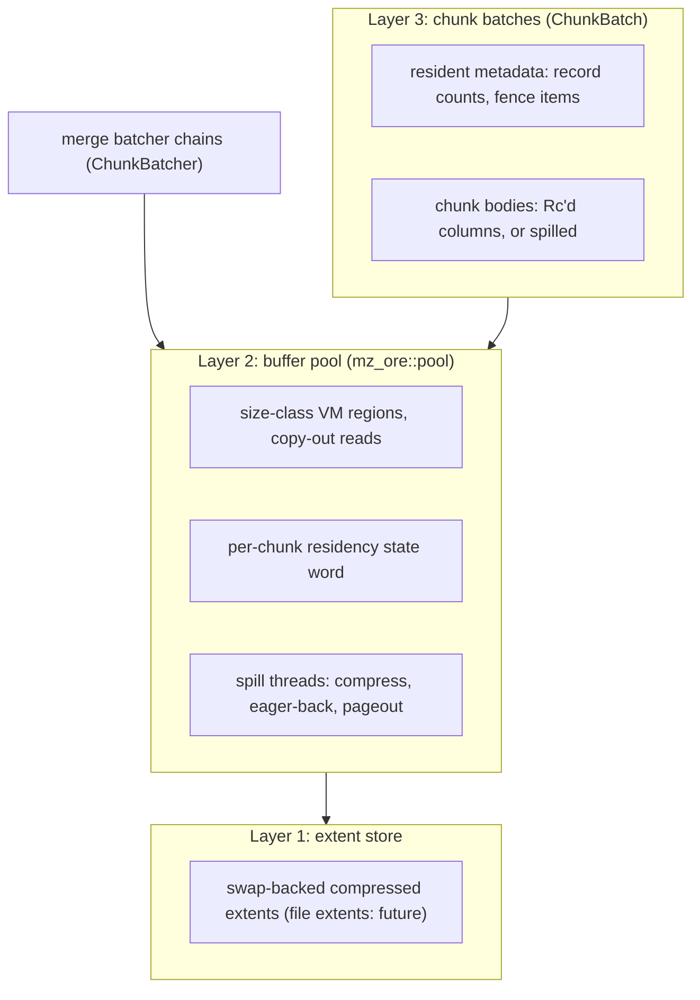

# Buffer-managed dataflow state

* Associated: [20260504_pager.md](20260504_pager.md) (the explicit pager this design succeeds), [CLU-65](https://linear.app/materializeinc/issue/CLU-65/pager).

## The problem

Materialize currently keeps dataflow state (batcher chains, arrangement batches, upsert state) in memory and uses `mz_ore::pager` to spill whole ~2 MiB columnar blobs. Its `Swap` backend hints anonymous memory cold; its `File` backend writes one scratch file per chunk.

That model has four structural limits:

* A blob pages in and out whole. `read_at_many` has no production user, and a miss re-reads the entire body into a fresh allocation before any record is accessible. Interpreting those bytes as a `Column` is zero-copy, so the cost is the all-or-nothing I/O and allocation, not deserialization. A size-only policy must therefore make an irreversible residency decision at pageout.
* Per-chunk files require create, writev, open, pread, and unlink for every merge generation. In one workload, unlink and inode eviction took 35.6 s versus 4.3 s for opens. Merge churn makes this cost unavoidable.
* Swap makes re-reads free until reclaim, but under pressure faults synchronously, per 4 KiB, on workers. The pager benchmark spent 64 of 65 seconds of a single-threaded merge in system time. The kernel also writes chunks that the next merge immediately kills.
* Only the pre-seal columnar batcher spills. Sealed spine batches, the dominant long-lived state, remain resident and unbudgeted. Columnation arrangements retain their lgalloc path, but lgalloc is disabled in production (it runs only in the emulator), so in production sealed state has no offload mechanism at all.

This design replaces blob spilling with an Umbra/vmcache-style buffer manager. Materialize can simplify the general problem because sealed state is immutable, recreatable from persist, and has an engine-known lifecycle.

## Success criteria

Each criterion states an observable outcome and the metric or measurement that proves it, tying back to the limits above. Which PR of the accompanying stack delivers each piece is tracked in the Status section.

* Resident access to a chunk costs no translation, no serialization, no copy, and a spilled body costs exactly one copy-out per read (a memcpy from a pool slot, a decompress from an evicted extent), never a hash-table translation and never a reference into pool memory. Proved by construction, and visible in the hot re-access row of the headline comparison.
* A chunk that dies before pressure forces it out never touches disk. Proved by the `writes_elided` counter staying material under steady-state merging (early hydration measured 100–400 elisions per second).
* Workers never enter kernel direct reclaim on the state path, and any state-path I/O a worker performs is explicit, bounded, and chunk-granular at a point the engine chose. Proved by cgroup `pgscan_direct` and pool-VMA swap staying zero under memory pressure, and by worker profiles free of fault stalls (both held in the staging run, see Measured).
* Chunk turnover performs no per-chunk filesystem metadata operations: no create, no unlink, no inode churn. Proved by construction: swap-backed extents create no filesystem objects at all.
* Sealed arrangement batches can be paged: a merge of two batches holds a bounded resident window rather than both batches. In scope for the upsert feedback arrangement, whose trace is a spine of chunk batches with spillable bodies, while compute's row spines hold sealed batches resident until the spine port. Proved by pool residency gauges holding at budget through fueled merges of larger-than-budget traces.
* Hydration of an arrangement larger than the memory budget completes with RSS bounded by the budget, not by state size. In scope for the upsert path. Proved by the staging measurement: a ~395 GiB logical stash hydrated under ~8.5 GiB of anonymous RSS (see Measured).
* One budget pool covers batcher chains and arrangement batches, and exceeding it triggers eviction of cold chunks rather than gating pageout decisions per chunk. Proved by a single budget gauge covering storage's stash and feedback arrangement and compute's batchers, correction buffers, and temporal buckets.
* The swap and file backends of `mz_ore::pager`, the `PagedColumn` residency enum, `ColumnPager`, `PagingPolicy`, and the tiered-pager dyncfgs are deleted at the end of the migration, leaving only `mz_timely_util::pool_config` to install and configure the pool.

## Out of scope

* Durability or crash consistency. State is recreatable and scratch is a cache, so there is no WAL, manifest, or fsync.
* Asynchronous operator APIs. Spill threads already run compression and pageout off-worker, but operators never observe that asynchrony: a worker's read is a synchronous call with one bounded cold decompress. Restructuring operators to suspend on state I/O, as Flink's ForSt state backend does (see Prior art), is separate work.
* Warm restart on swap-backed extents, which are anonymous and die with the process. File extents make it possible.
* WiscKey-style value separation. The container can accommodate it later.
* Non-Linux production support, as with the pager.

## Background

### Three generations of disk offload

Materialize has approached larger-than-memory state three times.

Generation one, [lgalloc](https://crates.io/crates/lgalloc) (2023), used size-classed file-backed mappings. Columnation arrangements and persist Arrow buffers retain the code path, but production runs with lgalloc disabled, and it is on only in the emulator. The kernel controls reclaim and writeback, and its knobs approximate policy below an allocator boundary that sees only allocation and free. Layer 2 retains lgalloc's size-classed layout but replaces file-backed mmap and kernel paging with anonymous memory and engine-scheduled I/O.

Generation two was kernel swap: every anonymous allocation was implicitly spillable, with worker-side direct reclaim, `pgscan_direct` spikes, and synchronous 4 KiB faults.

Generation three is explicit paging, and this design is its continuation: the [pager](20260504_pager.md) never reached production, and the pool replaces it directly. The pager lets the application mark blobs cold and choose a backend. Removing lgalloc from columnar containers ([CLU-64](https://linear.app/materializeinc/issue/CLU-64/remove-lgalloc-from-columnar)) created its seam, but retained the blob limits above. This design completes the generation with two moves: `mz_ore::pool` replaces the pager, and differential's [`Chunk` abstraction](https://github.com/TimelyDataflow/differential-dataflow/pull/744), including `UnloadChunk`, becomes the unit managed from collection through batcher and sealed spine. The last migration deletes the pager, both backends, and `PagedColumn`.

The through-line of the generations is that eviction keeps moving toward the component that knows lifecycle: from the kernel, to allocator-level knobs, to the engine itself.

### The workload, from first principles

The state this design serves has properties a general-purpose storage engine cannot assume:

* **Immutable after seal.** Only residency changes, eliminating dirty tracking, writeback ordering, content latches, and torn reads.
* **Predictably sized.** Grading cuts chunks just below a ~2 MiB target with a bounded maximum, so a handful of size classes fits every body and fragmentation stays bounded.
* **Recreatable.** Persist can rebuild everything, eliminating durability machinery.
* **Lifecycle known.** The batcher knows its next merge and when a chunk dies. Hydration output is write-once, read-rarely. Generic managers must guess this.
* **Sequential maintenance, random updates.** Merges, extraction, and hydration are scans and move most bytes. Joins and upsert probes are delta-proportional, and peeks are random. How much each side matters is workload-dependent and is the assumption here most likely to draw disagreement. Batched extraction, a resident-only cursor path, and a possible record cache protect probe latency.
* **Already log structured.** A differential spine is a tiered LSM: immutable sorted runs, a fueled compactor, and batcher chains as L0. It needs paged runs and a buffer manager, not an LSM.

The best measured blob strategy ([#36948](https://github.com/MaterializeInc/materialize/pull/36948), [CLU-108](https://linear.app/materializeinc/issue/CLU-108/correctionv2-pager-lz4-compress-spilled-chunks-madv-pageout-swap)) lz4-compresses then eagerly `MADV_PAGEOUT`s: peak RSS was 0.40 GiB versus 0.97 GiB with lazy hints, because compression reduces refault bytes ~5.6×. It validates compression and eager release, but re-access still causes worker-side 4 KiB faults, dead-soon chunks still spill and refault, and pageout decisions are irreversible. Layer 2 keeps that policy but with a mechanism the engine schedules, prioritizes, and can cancel.

Disk-first state buys pressure-free eviction and warm restart, but imposes a merge-proportional write floor that is fatal for short-lived data and EBS-class disks. Pure spill avoids that floor but turns pressure into a write storm and leaves nothing to reattach. Both use the same mechanism and differ only in when a chunk must be backed: lazy for young, churning data and eager for deep, long-lived sealed data.

### What the design borrows

Each source below contributes one core insight, and the design is the composition of them (full citations under Prior art):

* **Faults are the wrong interface** (the CIDR 2022 mmap critique, confirmed by generation two in production). The kernel schedules faults, reclaim, and writeback at times the engine cannot choose. Everything below follows from taking that scheduling back: state I/O is explicit, engine-chosen, and off the worker's critical path.
* **Size-classed anonymous regions make variable-size residency cheap** (Umbra). Reserve one large region per power-of-two class, let physical memory appear on use and leave with `MADV_DONTNEED`, and a slot can be any class size with no fragmentation, while resident translation is a multiply rather than a hash lookup.
* **Residency is a state word, not a type** (vmcache). Each chunk carries one small lock-guarded state machine, and eviction, backing, and re-admission are transitions on it. vmcache also supplies the throughput ceiling, `madvise` page-table work and TLB shootdowns, which is why the unit here is a ~2 MiB chunk rather than a 4 KiB page.
* **Resident access must cost nothing, and reclaim needs a stock of cheap victims** (LeanStore). Translation is paid only at the disk boundary, and a cooling stock of reclaimable-but-resident pages supplies frames at demand time. Eager backing builds that stock here, and clean-victim steal is the demand-time supply.
* **Compression belongs at the eviction boundary** (BtrBlocks, measured here by #36948). lz4 between slot and extent cut refault bytes ~5.6×, which makes a compressed-resident tier the cheap middle rung between uncompressed slots and the device.
* **The spine is already an LSM** (the WiscKey lineage). Differential owns sorted immutable runs and a fueled compactor, so the design needs paged runs under an existing LSM, not a storage engine.

Materialize adds the simplification none of those systems could assume: sealed state is immutable, recreatable from persist, and lifecycle-known, so dirty tracking, durability machinery, and lifetime guessing disappear.

The composition is the three-layer structure of the proposal: an extent store for cold compressed bytes (Layer 1), a budgeted buffer manager over size-classed slots with state-word residency and copy-out reads (Layer 2), and a chunk seam that makes batcher chains and sealed batches pageable units behind differential's `Chunk` trait (Layer 3).

## Solution proposal

Three layers, built bottom-up. Layers 1 and 2 are implemented on swap-backed extents. Layer 3 runs end to end for upsert and for batcher chains at adopted arrange sites. The compute spine port remains open.

### Layer 1: extent store

The extent store is an interface for allocating, writing, reading, and freeing chunk-class-sized extents. Today it uses swap. File extents follow when volume topology provides scratch space, without blocking the design.

#### Swap-backed extents (implemented)

Without a filesystem, extents are page-rounded anonymous allocations that the engine deliberately offers to kernel swap. A write compresses a chunk into an extent, which stays in the compressed-resident tier until the RSS ledger pages it out with `MADV_PAGEOUT`. A read `MADV_WILLNEED`s then decompresses it. Freeing deallocates the extent and discards any swap copy. Slots never reach swap, and extents reach it only compressed.

This generalizes [#36948](https://github.com/MaterializeInc/materialize/pull/36948)'s lz4-plus-`MADV_PAGEOUT` spill path. It retains its ~5.6× reduction in swap traffic, adds lifecycle-based write elision, and separates compression at write time from pageout when the RSS ledger demands it. Spill threads perform both. `MADV_PAGEOUT` is synchronous reclaim, involving page-table walks, TLB shootdowns, and writeback submission, so it stays off workers.

The backend has no metadata cost. A paged-out read still leaves kernel fault servicing on the read path. Compression and `MADV_WILLNEED` reduce that cost, but cannot remove it.

##### Follow-on: pageout is advisory, so the ledger must observe residency

A July 2026 staging run found anonymous RSS growing 10–19 GiB per hour despite capped gauges. Fifteen to twenty percent of pageout traffic stayed resident while the ledger marked it on-device.

`MADV_PAGEOUT` may decline pages while returning success: extra references can defeat isolation, `reclaim_pages`' result is ignored, and the kernel does not check swap availability. Large folios add another cause where they occur, since a partially covered folio needs a split that can fail. The process requests THP only via `MADV_HUGEPAGE` on the large slot classes, but per-size THP policy for anonymous memory is a host kernel and distro choice the process does not control. Rather than diagnose which cause dominates, the design removes the folio cause structurally by placing extents in `MADV_NOHUGEPAGE` arena regions and observes the outcome for the rest.

The ledger must therefore observe residency: after the advice, read the page-table present bits from `/proc/self/pagemap`, retain accounting for extents the kernel declined, cap retries per extent, and expose `extent_pageout_incomplete`. A node or cgroup without usable swap then increments the counter instead of silently diverging from RSS. Page-table reads deserve caution. A `pagemap` read walks the page tables under `mmap_lock`, the lock worker page faults and the pool's own `madvise` calls also take, so long scans would contend with the hot paths. The observation is therefore deliberately narrow: spill threads, never workers, read present bits over just-advised extent ranges only, so each hold is short and bounded to one pass per pageout attempt. And because the snapshot is unsynchronized, the result feeds accounting alone, never correctness, so a stale answer costs at most one enforcement cycle. The alternatives answer the wrong question. Trusting the advice's return value is what produced the divergence above, and `mincore` reports swap-cache pages as in core: successful asynchronous reclaim unmaps the PTE to a swap entry while the page's clean copy lingers in the kernel's swap cache, which would misclassify essentially every healthy pageout (and retrying the advice cannot change that outcome, since `madvise` skips already-unmapped PTEs).

#### File extents (future)

Use a few large preallocated files per worker, or `O_TMPFILE` inodes, with a userspace extent allocator:

* Round allocation to chunk classes, giving per-class free lists and bounded fragmentation.
* Free by pushing the free list, with no unlink, journal transaction, or inode eviction. Return space lazily and in batches with `fallocate(FALLOC_FL_PUNCH_HOLE)` only under scratch pressure.
* Use `O_DIRECT`. The pool is the cache, so kernel page cache would duplicate data and make writeback unpredictable. The serialized format naturally supplies aligned buffers.
* Follow DuckDB's native-format, recycled temp-file slots rather than one file per object.

The backend fits the existing extent interface, activates per cluster class with scratch volumes, and can be benchmarked directly against swap.

#### Swapless environments: the emulator

The emulator runs without swap, and it is also the one environment where lgalloc remains enabled, so the migration must not strand it. The pieces are independent: lgalloc is untouched by this design and keeps serving columnation arrangements in the emulator, while the pool degrades gracefully on a swapless host. Budget eviction still compresses cold chunks into the compressed-resident tier and die-young elision still works, so uncompressed residency stays budget-bounded. Tier pageout finds no swap, `extent_pageout_incomplete` counts the declined extents, and the ledger keeps charging them, so cold compressed state accumulates in RAM, honestly accounted, rather than silently diverging.

Compression-only offload holds several times more state than resident slots at equal RSS (~5.6× measured), but it is not the disk offload the pager's file backend offered the emulator. File extents are the complete answer for swapless hosts, since the emulator has a filesystem, and the emulator is a reason to prioritize them.

### Layer 2: buffer manager

#### Address space and translation

Following Umbra, the pool reserves large anonymous regions in eight power-of-two classes from 64 KiB to 8 MiB. The 2 MiB-and-larger classes are hugepage-aligned and `MADV_HUGEPAGE`d, so a slot fault-in is a few hugepage faults rather than ~512 base-page faults. Reservation uses `MAP_NORESERVE`; physical memory appears on use and normally leaves with `MADV_DONTNEED`.

A warm pool retains freed mapped slots up to `min(budget / 8, 1 GiB)`. This deliberate, bounded RSS overshoot avoids page faults and zeroing during allocation-heavy phases. The pool is a cache over, not a mapping of, extents: all transfers are explicit and engine-scheduled.

Slots exist only while a chunk is resident. Residency descends through eviction, and an admitting read ascends: re-admission refills a slot from free budget or by stealing a colder backed chunk's slot in place. Reads copy out under the chunk state lock, so no external pointer needs invalidation. Unlike vmcache's lifetime-stable addresses, demand and page tables track the budget, not the unbounded live backlog. Resident translation is `slot index * class size`, with no page table or hash lookup.

#### Chunk states

Residency is a state, not a type. Each chunk has one vmcache-like state word, without dirty states:

* `UnbackedResident`: lives only in the pool, no extent copy exists.
* `WriteInFlight`: a spill thread compresses it while its slot remains readable. Freeing cancels the work. Completion yields `Evicted` or, for eager backing, `BackedResident`.
* `BackedResident`: an identical extent copy exists. Eviction is a pure page release, no compression and no I/O.
* `Evicted`: extent only, either compressed in RAM or on the device. Plain reads decompress directly into the caller buffer and keep this state. An admitting read can return a probed chunk to `BackedResident`.
* `Oversize`: a payload larger than the largest class, counted as `oversize_payloads`, or a class-exhaustion fallback, counted as `slot_exhausted_fallbacks`. Either way it is bounded and outside the budget.

A per-chunk mutex guards the word. There is no `Faulting` state: copy-out reads and re-admission serialize under that mutex.

#### Reads are copy-out

Readers never hold pool references. Under the state lock, `ChunkHandle::read_into` memcpy's a resident slot or decompresses an extent directly into caller storage. Plain reads do not change residency or consume pool memory; an admitting read (`read_into_admit`) is the exception. `take` reads then frees; `prefetch` gives an evicted extent `MADV_WILLNEED`; `insert_with` serializes directly into a slot.

Copy-out eliminates pins, epochs, and reader accounting: eviction takes the same lock. A paged-out read re-counts revived compressed pages and re-enforces the tier after unlocking. The cost is one body copy per bulk read, not an unbounded cursor borrow.

#### Reader discipline

Copy-out moves the residency question from the pool to the caller. Every read materializes an uncompressed copy on the ordinary heap, where no pool gauge, budget, or eviction can see it. The pool bounds its own memory by construction. Reader memory is bounded only by the rules below, and the memory limiter is the backstop when a consumer breaks them.

* **Buffers are pass-scoped.** A fetched body lives for the trait call or drain window that fetched it and no longer. The implemented consumers obey this structurally: `extract_into` and `fetch_into` fill caller-owned staging that is drained per pass, the upsert drain holds one sealed chunk and one window of hits, and `merge` and `advance` load fronts into owned columns that live for the transformation.
* **Reuse amortizes within a pass, and capacity ratchets across passes.** `read_into` clears the destination but keeps its capacity, so a reused buffer grows to the largest chunk it ever carried and stays there. Reuse a buffer across the reads of one pass. After a read above the ~2 MiB chunk target, shrink it back, mirroring the write side's scratch policy: retain full capacity only on dedicated threads with a bounded population, release it on per-worker paths.
* **Name the per-worker bound.** Reader memory multiplies as buffers-per-pass times workers, at the ~2 MiB chunk target per buffer (8 MiB worst case). A retained worst-case buffer per worker on a 64-worker replica is half a gibibyte invisible to every gauge. A new consumer states its bound in a comment at the buffer's owner.
* **No fetch-and-cache.** Holding a decompressed body beyond its pass recreates the resident copy the pool evicted, restoring the double residency the design exists to avoid, in memory the budget cannot reclaim. Caching read results is record-cache policy work, not a consumer-local choice. The one existing exception, `correction_v2`'s first-read materialization, is safe because the loading merge front consumes and drops it. A new exception needs the same consume-and-drop argument, written where the cache lives.
* **No copies across suspension points.** Today's consumers are synchronous operators: a copy must not park in operator state across invocations. If async consumers arrive, the same rule covers await points.
* **Probe reads may admit, consume-once reads must not.** `read_into_admit` is for demand reads on probe paths, where the chunk is likely to be read again. Merge, drain, and other consume-once paths use `read_into` or `take`: admitting there churns the clean-victim stock that eager backing exists to build.

#### Write-behind, and never writing dead data

Pageout is a state transition with two sources:

* **Budget eviction:** enforcement spends a victim's second chance, a spill thread compresses it, and releases its slot to reach `Evicted`. `BackedResident` skips the thread and releases pages inline.
* **Eager backing:** idle spill threads create extents without evicting, yielding `BackedResident`. This opt-in `column_paged_batcher_eager_backing` work never spends a second chance, turns later pressure into page release, and stocks the clean victims re-admission steals from.

Freeing `UnbackedResident` is memory-only, and freeing `WriteInFlight` cancels the write. That elides the many writes for merge chunks that die young.

#### Residency tiers and the RSS target

With warm slots and compressed extents, residency is a four-rung, cheapest-first ladder:

1. **Slots** (uncompressed, directly readable): bounded by the resident-bytes budget. Crossing it compresses the coldest chunks into extents.
2. **Warm free slots** (pages kept mapped for reuse): bounded by `min(budget / 8, 1 GiB)`.
3. **Compressed-resident extents**: bounded by the headroom the *pool RSS target* leaves above the first two rungs, `compressed cap = max(0, rss target − budget − warm cap)`.
   Crossing it pages the oldest extents out to the device, FIFO.
4. **The swap device**: unbounded, holding whatever the ladder pushed down.

Thus, `pool RSS ≤ budget + warm cap + compressed cap = max(rss target, budget + warm cap)`. A target no larger than the first two rungs disables rung 3. Like zswap, it trades bounded RAM for microsecond decompression rather than millisecond device reads, but the engine selects entries and frees dead extents without writeback. Limits use physical RAM (`MemTotal`, cgroup-clamped), never the swap-inclusive announced memory limit.

#### Eviction policy

The backstop is a small, single-flighted second-chance FIFO. Every size-classed chunk begins with a clear touched bit, which reads set under the state lock. Candidates are FIFO queues by generational depth, scanned deepest first. Freed or evicted entries drop out; a touched entry clears its bit and returns to the back; an untouched entry is evicted. Busy locks requeue, avoiding I/O convoys. Eager backing rotates entries without clearing touched bits.

`ChunkHints` selects a depth band, making older sealed data preferred for backing and eviction. Every pool consumer annotates real merge depth: a fresh chunk is depth 0, a merge output is one generation past its deepest input, and rewrites within a generation (compaction, coalescing, survivor remainders) preserve depth. `correction_v2` derives this from its chain merges and the `ColumnChunk` path (the stash, the feedback arrangement, compute arranges) from the batcher's geometric merges. Consumers supply the remaining lifecycle knowledge:

* Dead chunks are freed, not evicted (there is nothing to keep), and the pool elides or cancels any pending write.
* Chunks reach the pool only at `settle`, the chunk API's commit point, so merge intermediates and in-flight output are never offered for spilling at all.
* Bodies below the smallest size class (64 KiB) stay resident, since spilling them trades no meaningful memory for slot waste.

The touched bit covers data-dependent probe hotness that lifecycle cannot predict. LeanStore-style cooling reduces to this scan. Richer hints remain available if needed.

#### Re-admission: bounded ascent for hot data (pool mechanism implemented; consumer wiring pending)

Descend-only residency never returns an evicted chunk to a slot: a hot probe target pays a ~2 MiB decompress (about 0.4–0.5 ms, plus swap-in) on every pass, forever. Free budget cannot be the only admission gate, because enforcement runs only above the budget, so a steady-state pool sits pinned full and headroom exists only in transient lulls.

Re-admission (the pool's `read_into_admit`, implemented in the stacked pool PR; the `extract_into` and `fetch_into` consumer wiring, never `take` or the merge paths, lands with the consumers) adds `Evicted → BackedResident`, decompressing into a slot under the existing lock and retaining the extent. The slot comes from free budget when any exists, otherwise by stealing in place from the coldest clean victim: a `BackedResident` chunk with a clear touched bit, deepest band first. The victim lands `Evicted` without I/O (its extent already exists) and the admitting decompress overwrites its still-mapped pages, so a steal costs no madvise, no fault, and no zeroing. The ledger nets the payload difference, and a steal that would grow resident bytes past the budget is denied like any other admission. No clean victim means no admission, and admission itself never compresses or pages anything out (a read that revives a device-resident extent still re-enforces the compressed tier afterwards, as every read does).

This is LeanStore's frame supply adapted to immutable data. LeanStore keeps ~10% of its pool cooling (unswizzled but resident) and takes frames from the FIFO tail at demand time, flushing dirty ones. Eager backing plays the cooling role here by stocking cold `BackedResident` chunks whose reclaim is free, and immutability deletes the flush. Sizing that clean-victim stock is the analogue of the cooling percentage.

Keeping the extent bounds transient double residency by the compression ratio and normally lets the tier drop clean swap-cache pages without writeback. Above roughly half-full swap (`vm_swap_full`), swap-in can free the swap slot and make the next pageout write again, so a re-pageout-writeback counter is needed. A wrong admission costs one decompress and a clean drop. A hot probe set larger than the budget cycles through the clean victims at that bounded cost, and the durable answer there is record caching, not admission policy.

#### I/O execution

Workers synchronously read one cold chunk into caller storage, after any swap-in. The compressed tier and `prefetch` soften this cost. Eviction-side compression and `MADV_PAGEOUT` are off-worker for the swap-backed store: unguarded on-worker enforcement pinned CPUs during staging.

The implemented form uses configurable, spawn-once spill threads, single-flighted budget enforcement, and notifications for tier enforcement. Workers enforce inline if there are no threads, the tier exceeds twice its cap, or the queue is full. For future file extents, on-worker execution remains viable because it is a bounded ~1 ms `O_DIRECT` write with natural backpressure. Both forms share a state machine and differ only in the `WriteInFlight` executor. `madvise` page-table work and TLB shootdowns cap eviction throughput, mitigated by 2 MiB chunks, roughly 500 times fewer operations per byte than 4 KiB paging, and batched `MADV_DONTNEED`.

#### Compression

Compression belongs to extents, never slots. Spill threads lz4-compress at write time, or can use a stronger BtrBlocks-style codec. Readers decompress during bounded copy-out. Compressed bytes deliberately occupy the bounded, engine-accounted compressed tier.

### Layer 3: paged sealed batches on the chunk seam

#### The foundation: differential's `Chunk`

Differential [PR #744](https://github.com/TimelyDataflow/differential-dataflow/pull/744) adds `Chunk`: a sorted, consolidated, cheaply cloned, bounded run of `(data, time, diff)` with maximal-packing (grading). It represents collection containers, batcher chains, and batches (`Vec<Chunk>` plus a time description). Generic mergers, batchers, builders, and spines, exposed through `ChunkBatcher`, `ChunkBuilder`, and `ChunkSpine`, keep layout work behind the trait.

The trait's metadata/data split is the paging seam. Metadata works while a body is paged out. `merge`, `extract`, `advance`, and `settle` operate on whole deque fronts and may fetch, compress, and page. `settle` grades committed output, making every held suspension-point state spillable.

Reading a chunk's contents is optional, as one of two capabilities:

* `NavigableChunk`: the cursor capability, serving the classic per-record navigation path.
* `UnloadChunk`: the bulk-read capability. Sorted probe keys in, matching updates appended to caller-owned staging.

`UnloadChunk` is the paged read surface: no body borrow crosses the trait boundary. `Staging` is caller-owned, fetches are method-scoped, and `locate` uses resident metadata. Together with pool copy-out, this removes reader accounting from the stack.

A batch is a globally sorted sequence split at arbitrary points, so keys can straddle chunks. `ChunkBatch::extract_into` gallops by `locate`, opens only touched bodies, and re-offers a probe equal to a last key to stitch continuations. Misses are absent from staging. `fetch_into` scans.

#### `ColumnChunk`, the implementor

Materialize's `ColumnChunk<D, T, R>` (`mz_timely_util::columnar::chunk`) is a sorted, consolidated flat-columnar run in two homes:

* **Resident**: an `Rc`-shared `Column` on the heap. Fresh input, merge output, and small tails live here, and access is a direct borrow.
* **Spilled**: the serialized body in the process pool, with the resident metadata every `Chunk` must answer without fetching: the record count, and the first and last data items held as one-element containers (the fence entries `locate` consults).

At `settle`, committed bodies of at least 64 KiB enter the pool when spilling is enabled. Serialized-byte grading, just below the 2 MiB ship size, bounds variable-width bodies where record-count `TARGET` cannot. Existing spilled chunks pass through unchanged.

`merge` uses resident fences to move disjoint fronts unchanged. It copy-out loads and consolidates overlapping fronts, cuts output at the threshold, rewrites partial survivors, and preserves untouched spilled survivors. `advance` compacts times, carries the final data group across calls, and can cut inside a group so even many advanced times cannot exceed a size class. Spilled reads are scoped to the trait call that needs them. Extraction and scan read only touched bodies through a thread-local scratch, while transformations (`merge`, `advance`) load whole fronts into owned columns that live for the transformation.

For chunks whose data is a `(key, val)` pair, `ColumnChunk` implements `UnloadChunk`:

* `Staging` is the flat columnar container of the same update shape, so appends are bulk column-range copies and a group straddling consecutive chunks stitches by plain concatenation.
* `Probes` is a borrowed key-column view, typically of a `Column` the consumer assembled from its sorted, deduplicated probe keys.
* `locate` answers from the resident fence items only, never fetching a body, so a probe set faults exactly the chunk bodies it touches.

#### No cursor path over spilled bodies

`ColumnChunk` deliberately omits `NavigableChunk`. A cursor holds unbounded borrows, forcing a paged body to remain resident for its lifetime and silently reintroducing a fetch-and-cache-forever path. The row-spine port can add a cursor-specific layout, but cursor support is then a residency choice.

#### Access patterns, read amplification, and policy

* **Spine compaction:** scans through a bounded burst of loaded chunks, so even GB-scale merges hold a bounded window.
* **Joins:** delta-proportional, key-ordered probes. Dense sets scan while sparse sets approach point lookups.
* **Upsert feedback:** batched, sorted point lookups and the implemented `UnloadChunk` consumer.
* **Interactive peeks:** random and latency-sensitive, so cursor- and resident-served today.

Except for compaction, a cold point probe decompresses a ~2 MiB body, over three orders of magnitude of amplification. The mitigations are:

* **Batched extraction (implemented):** `locate` finds touched chunks without I/O, each is read once per pass, fence-rejected misses cost nothing, and staging is pass-bounded.
* **Sizing (implemented):** target ~2 MiB and retain bodies below 64 KiB, with smaller consumer-specific chunks available.
* **Structural safety valve (implemented):** cursor consumers keep their arrangements resident, preserving the status quo.
* **Read-refreshed second chance (implemented)** and **re-admission (pool mechanism implemented; consumer wiring pending)** keep or return hot probes to slots.
* **Prefetch (future):** the plan identifies bodies for `ChunkHandle::prefetch`; overlap may require `Faulting`.
* **Per-run filters (future)** and **record caching (open)** can reject misses or use Bf-Tree-like mini-pages if sparse probes still dominate.

#### What is free to vary, and what is not

The design does not choose among general index structures. Differential requires immutable, sorted, timestamped, consolidated runs merged under frontier control, so the macro-structure is fixed. The opaque `Chunk` layout can still vary in keys, deduplication, compression, and value placement. `ColumnChunk` favors bulk copies and copy-out; row spines use tries. This also answers "why not a B+-tree": the spine already fixes the macro-structure.

#### Hydration

Hydration builds, settles, spills, and eagerly evicts chunks, keeping RSS budget-bounded regardless of state size. This is measured end to end for the upsert stash.

#### Values

Large rows are rewritten on every merge. WiscKey-style separation adds dereferences to `(key, val)` comparisons, but keys and times must tie first, so it may win for mostly unique, large values. Umbra's template is inline small values and write-once out-of-line extents for large values, with a measured threshold. The trait allows it without a format break.

### A chunk's lifetime, end to end

The normal feedback-chunk lifecycle is:

1. **Build:** batchers create an `Rc`-shared heap `ColumnChunk`; merge intermediates never reach the pool.
2. **Settle:** a spillable, ≥64 KiB chunk is byte-graded just below 2 MiB and `insert_with` writes it into a matching warm or fresh slot. It is `UnbackedResident`; only its handle, count, and fences remain outside the pool.
3. **Die young:** a soon-consumed sibling returns its slot to the warm pool and increments `writes_elided`, or cancels an in-flight write. Early hydration observed 100–400 such elisions per second.
4. **Back:** idle eager backing lz4-compresses a surviving sealed chunk to a ~0.36 MiB extent without spending a second chance. It becomes `BackedResident`.
5. **Evict:** budget pressure selects it through second-chance FIFO and `MADV_DONTNEED`s its backed slot, yielding `Evicted` with a compressed-RAM extent. An unbacked victim first uses `WriteInFlight`.
6. **Page out:** tier pressure `MADV_PAGEOUT`s oldest extents, with observed-residency accounting, and holds RSS at target.
7. **Probe:** fences plan without I/O; `extract_into` `MADV_WILLNEED`s, swaps in if needed, decompresses into thread-local scratch, and copies hits into staging. A plain read leaves it evicted, and an admitting read returns it to `BackedResident` from free budget or a clean-victim steal.
8. **Merge away:** disjoint fronts move without a read; overlapping ones copy out and consolidate into new chunks. Freeing the consumed `Evicted` chunk drops its extent and any swapped copy without device or filesystem I/O.

### Consumers

The implementation covers all of the following.

#### The upsert-v2 source stash

The source stash uses stock `ChunkBatcher<ColumnChunk<UpsertKey, T, UpsertDiff>>`. A chunker sorts and consolidates raw input; geometric chains use `merge`/`extract`/`settle`, so the snapshot and persist-lag backlog spills rather than grows RSS. A diff `Semigroup` expresses "latest source offset wins", eliminating the bespoke batcher.

#### The upsert-v2 feedback arrangement and drain

The persist-feedback arrangement is end-to-end `ChunkSpine<ColumnChunk<(UpsertKey, Row), T, Diff>>`. Its batcher chains and sealed batches share the budget, and fueled merges settle output so a suspension holds only graded, spillable chunks.

The drain bulk-probes rather than cursor-seeks. It loads one sealed stash chunk at a time and probes at most 1024 distinct eligible keys, bounding residency to that chunk and one window of hits. Per window:

1. **Plan:** make a sorted, deduplicated probe column. A chunk is key-sorted, so the window is contiguous and deduplication is a neighbor test. The limit accommodates full-value hits from byte-graded chunks with many small records.
2. **Probe:** run `ChunkBatch::extract_into` for each `batches_through` trace batch. Fences select the only feedback bodies to copy out. Sort references by key and value, fold diffs, and retain v1's assertions that every positive sum is one and each key has one positive value.
3. **Emit:** classify entries against the persist frontier and fuel retractions and insertions.

#### Compute arrange sites

Behind replica-scoped `enable_column_paged_batcher`, arrange sites use `ChunkChunker` and `ChunkBatcher<ColumnChunk<(Row, Row), T, Diff>>`, then `UnchunkBuilder<RowRowColPagedBuilder>` into the unchanged `RowRowSpine`. Chains spill, while the shim copy-out loads chunks into existing builders. At `seal` it loads the whole chain, isolating rehydration in one place until the row-spine port lands.

#### Temporal buckets and correction buffers

`temporal_bucket` wraps one `ChunkBatcher` per far-future bucket and moves bodies by handle, loading only at reveal. `correction_v2` stores a `ChunkHandle` with cached length and times. It needs `Sync`, so it uses a `Mutex` and first-read `OnceLock` materialization. This fetch-and-cache path is safe because the loading merge front consumes and drops it.

### Backing policy: lazy and eager

One per-chunk policy bit decides when it must be backed, based on implicit-LSM position:

* **Young batcher and small spine batches:** lazy, allowing die-young elision. They are L0/memtable data.
* **Deep or large sealed batches:** eager. One write at seal is cheap over their long, sparse-read lifetime, and their geometric level supplies the threshold.
* **Hydration output:** always eager.

Eager backing changes pressure from a write storm to clean page release. Today the pool-level `column_paged_batcher_eager_backing` flag drives idle work over unbacked chunks. Per-level thresholds remain policy work.

### Configuration

Dyncfg controls the feature:

* Replica-scoped `enable_column_paged_batcher` selects the chunk path at compute arranges. Otherwise they use the columnation batcher and builder.
* `enable_column_paged_batcher_spill` and `enable_upsert_paged_spill` are independent OR'd compute and storage gates. The compute gate is replica-scoped like `enable_column_paged_batcher`, while the storage gate applies system-wide. What is process-wide is the pool singleton they feed. Chunks have no subsystem identity, and either gate spills committed chunks. Either gate also installs the pool: compute's config handler applies the pool configuration when either flag is on, since storage gates only participation.
* `settle` reads `pool_config::active_pool()`, so gate flips affect running dataflows, but chunks remain resident until configuration installs a budgeted pool.
* Compute's handler applies the pool config only when a spill gate (`enable_column_paged_batcher_spill` or `enable_upsert_paged_spill`) is on. The first application with a gate on installs the pool from `column_paged_batcher_budget_fraction` (0.05 physical RAM, minimum 128 MiB), `column_paged_batcher_pool_rss_target_fraction` (0.25), `column_paged_batcher_spill_worker_count` (2, spawn-once), and `column_paged_batcher_eager_backing` (off). Later applications retune the installed pool in place. A process where no gate was ever on never constructs the pool.

Storage and compute share one retunable singleton pool and budget in `clusterd`. Storage gates only participation. Fractions use cgroup-clamped physical RAM, not the swap-inclusive announced limit.

## Performance estimates

Measurements are from the [pager benches](20260504_pager.md), [#36948](https://github.com/MaterializeInc/materialize/pull/36948) and CLU-108, the motivating upsert-hydration profile, and the staging runs below. Device-arithmetic results are marked estimates.

### Cost model

Per 2 MiB chunk, on a ~1.4 GB/s encrypted NVMe and a ~7 GB/s striped r8gd NVMe:

* `O_DIRECT` read or write: ~0.3 ms (striped) to ~1.4 ms (encrypted single disk).
* lz4: ~2–3 ms to compress (≈0.7–1 GB/s per core), ~0.4–0.5 ms to decompress (≈4–5 GB/s), and ~5.6× on CLU-108 arrangement data. Compression costs more than a device write, hence spill threads.
* Kernel swap path for the same 2 MiB: 512 synchronous 4 KiB faults. The pager doc measured 2.12 M page-ins for an 8 GiB working set with 64 of 65 wall-seconds spent in the kernel.
* Per-chunk filesystem metadata (the deleted file backend): dominant at scale, 35.6 s of unlink/inode-eviction against 4.3 s of opens over one measured hydration. The extent allocator's equivalent is a free-list push, effectively zero.

### Headline comparison

"Swap" is the pager's swap backend (`MADV_COLD`, plus the lz4+`MADV_PAGEOUT` variant of #36948 where noted). "File" is the pager's per-chunk scratch files. "This design" is Layer 2 on the swap-backed extent store, with file-extent cells marked as estimates. lgalloc has no column because it was not measured. It shares swap's kernel fault path, plus file-backed dirty writeback at kernel discretion.

| Dimension | Swap | File (pager) | This design |
|---|---|---|---|
| Hot re-access, resident | memory speed, unless already reclaimed (refault) | full round trip every time (~1–4 ms/chunk) | resident chunk: pointer deref; pool slot: one memcpy copy-out |
| Merge throughput, 1 thread, 2–4× pressure | 0.12–0.15 GiB/s (measured) | 0.36–0.50 GiB/s (measured) | ~0.6 GiB/s sync executor; ~0.7 GiB/s (device/2) with read overlap (file-extent estimate) |
| Merge throughput, 16–64 threads, fast disk | ~1.5 GiB/s overall, ~2.5 merge-phase (measured) | 1.73 GiB/s, disk-bound (measured) | ≥ file; same disk ceiling raised by write elision and, where data compresses, by the lz4 ratio (5.6× measured) on disk traffic |
| RSS under pressure | pins to cgroup cap; 0.40 GiB with lz4+PAGEOUT (measured) | working window, ~376 MB at 64 threads (measured) | budget, by construction (measured, see Measured) |
| Worker stall profile | unbounded; 97% sys time single-threaded (measured) | bounded but eager: every pageout pays serialize+write | ~0 on eviction (off-worker); bounded decompress per cold read |
| Per-chunk metadata | none | dominant at scale (measured, see model) | none |
| Cold point lookup into sealed state | n/a (resident); per-touched-4 KiB fault if it paged | whole-chunk rehydrate minimum | one chunk copy-out per touched chunk, amortized across the batched probe set |
| Hydration RSS | working set (kernel may lag) | unbounded on the columnar path | budget (measured, see Measured) |

On the swap-backed extent store, writes match the measured lz4+`MADV_PAGEOUT` line and a cold read of a paged-out extent is kernel swap-in over 5.6× fewer bytes plus the decompress. Low-thread reclaim ceilings soften the merge-throughput rows toward the swap column while the RSS, stall, metadata, and elision rows hold.

### What the estimates assume, and where they could be wrong

* **Write elision:** throughput gains require chunks to die unbacked. This is high in steady-state merging and zero under eager backing. Early hydration measured 100–400 cancellations/s.
* **Compression:** 5.6× is one arrangement workload. The disk multiplier scales with it and becomes 1× for incompressible data.
* **Eviction:** batched 2 MiB `MADV_DONTNEED` is assumed cheap, but budget-boundary thrashing could expose vmcache's serialized page-table work despite ~500× fewer operations per byte than 4 KiB paging.
* **Copy-out:** each pass pays one slot memcpy or extent decompression. Bulk consumers amortize it. Per-record access would not.
* **Single-thread executor:** the ~0.6 GiB/s future file-extent estimate assumes serialized read, process, and write with no overlap.

### Measured: the staging prototype (June 2026)

The swap-backed pool ran under the upsert-v2 source-stash hydration workload, which accumulates backlog while persist catches up.

* **Bounded accumulation:** ~395 GiB logical stash became 70.6 GiB of lz4 swap extents. Pool residency stayed at its 128 MiB floor and anonymous RSS below ~8.5 GiB. About 3 GiB was a backlog-independent merge working set.
* **No kernel reclaim:** cgroup `pgscan` and pool-VMA `Swap` remained zero. Slots are discarded before pressure, not kernel-paged.
* **Bounded page tables:** 82–250 MiB, or ~0.35–0.4% of 20–70 GiB of extents (against a theoretical 8-bytes-per-4-KiB-PTE floor of ~0.2%), confirmed slot-per-resident accounting.
* **Elision and execution:** early 100–400/s cancellations showed die-young elision, but saturated queues pushed eviction onto workers. Offering chunks only at `settle` removed that churn; single-flight resident-only enforcement plus spill threads prevented `madvise` and lock contention from pinning CPUs.
* **Extent and slot sizing:** worst-case lz4 allocation inflated writeback ~5.6×, fixed by reused scratch plus exact page-rounded extents. The 1.8–2.0 and 3.6–4.0 MiB bimodal chunk shapes require 4 and 8 MiB classes to avoid heap fallback.
* **Phase boundary:** accumulation is bounded, but the former `Batcher::seal` drain materialized O(backlog) state, reaching ~80 GiB RSS. The stash now rehydrates one sealed chunk at a time. `UnchunkBuilder::seal` retains the analogous compute-shim issue.
* **Metrics and tier:** cgroup working-set charges clean swap-cache pages as growth, so anonymous RSS is the health signal. About 99% of fault-ins were cache minor faults. With a 0.25 target on ~180 GiB RAM, ~45 GiB headroom let anonymous RSS reach ~53 GiB before oldest-first device pageout held it flat. A genuine pressure event caused neither worker stalls nor pool `pgscan`.
* **Cost:** tier-enabled hydration was within single-digit percent of the in-memory-filesystem RocksDB baseline, while keeping residency at target. Boundedness reached parity.

## Status

1. **Pool under the batcher:** implemented in the stacked pool PR and staging-measured on swap-backed extents. Budgeted RSS, die-young elision, and off-worker execution are established.
2. **Chunk seam:** lands in a subsequent PR of the accompanying stack. Differential `Chunk`, `ColumnChunk`, and copy-out reads replace the pager, its backends, `PagedColumn`, and the bespoke paged batcher.
3. **Sealed batches:** lands in a subsequent PR of the accompanying stack, for the upsert feedback `ChunkSpine`, whose `UnloadChunk` drain replaces per-key cursor seeks.
4. **Compute:** lands in a subsequent PR of the accompanying stack, behind `enable_column_paged_batcher`. Chains spill through an `UnchunkBuilder` bridge to unchanged row spines. `temporal_bucket` and `correction_v2` use the pool.
5. **Open:** file extents, including warm restart, `O_DIRECT` reads, and disk offload for swapless environments (the emulator).
6. **Open:** row-spine chunks, peek-aware policy, eager-backing thresholds, the consumer wiring for hot-chunk re-admission, and per-dataflow priorities.

## Incremental migration: coexisting with swap

The *pager's swap backend* ends with this migration. The pool absorbs both pager consumers and the pager is deleted.

*Node-level swap* remains the process-wide backstop for columnation arrangements, persist Arrow buffers, operator heap state, and allocator headroom. It is also the pool's extent device. It remains provisioned until every large allocation has another mechanism, including work outside this design.

### Coexistence semantics

Pool slots are ordinary anonymous memory and can still be kernel-swapped. The result is wasted writes for chunks the engine would discard or write better. Keeping the budget below the container limit and using PSI or `pgscan` to shrink it bounds this. Refill avoids double I/O by `MADV_DONTNEED`ing the overwrite destination first. `mlock` is optional hardening with an `RLIMIT_MEMLOCK` dependency. Swap remains defense in depth for a bad budget.

### No filesystem yet: deployment starts swap-backed

Production disks are fully swap, so Layers 2 and 3 start on swap-backed extents. File extents activate per cluster class when scratch volumes exist. Above the backend-agnostic extent interface, recreatable bytes make this a configuration change. Scratch is a performance choice for explicit reads and `O_DIRECT` writes, not an architectural prerequisite.

### What shrinks, and when

Each pooled consumer reduces swap working set. Batcher chunks and upsert sealed batches already do. General compute follows with row-spine chunks, while columnation arrangements, persist buffers, and operator heap state have separate timelines. Swap can move from working-set to insurance sizing, and can be disabled only after monitoring shows negligible traffic.

## Remote extents: the object-store direction

The extent-store contract, compressed write to opaque handle, explicit non-faulting read, and free, already matches object storage. S3 is therefore an extension, not a successor. It is not committed work. The literature establishes:

* **Local cache is required:** Snowflake, Socrates, and Neon place local extents between RAM and object segments.
* **Requests reshape the unit:** 10–30 ms first-byte latency makes compressed extents too small. AnyBlob implies multi-extent segments and probe-plan-driven, large parallel downloads.
* **Explicit access wins:** AIFM avoids high-latency page-fault amplification. Call-scoped reads provide the required dereference discipline.
* **GC joins the tier:** immutable segments turn free into live-ratio tracking and segment compaction.

Remote cold reads require prefetch, not a synchronous 10+ ms stall, and `free` becomes refcounted segment GC. Pool, budget, states, copy-out reads, and the extent seam remain unchanged. First benchmark EBS-class network block storage, which requires no engine change. Then decide whether cold extents use persist's existing S3 blob and cache layers or a separate store. Remote segments enable warm restart by turning reingestion into cache warming.

## Prior art

This applies modern buffer-manager work to an unusually favorable workload:

* **Umbra** ([CIDR 2020](https://db.in.tum.de/~freitag/papers/p29-neumann-cidr20.pdf)): size-class anonymous regions, `MADV_DONTNEED`, contiguous variable pages, and one budget. Copy-out replaces latches and swizzling.
* **LeanStore** ([ICDE 2018](https://db.in.tum.de/~leis/papers/leanstore.pdf)): free resident access, translation paid only at the disk boundary, and demand-time frame reclaim from a cooling FIFO of reclaimable-but-resident pages, the model behind clean-victim re-admission. The paper cools synchronously on workers; our spill threads take the background alternative it names.
* **vmcache** ([SIGMOD 2023](https://www.cs.cit.tum.de/fileadmin/w00cfj/dis/_my_direct_uploads/vmcache.pdf)): explicit anonymous-memory state and eviction, without dirty states or lifetime-stable addresses. Its `madvise` and TLB ceiling motivates 2 MiB granularity.
* **mmap critique** ([CIDR 2022](https://db.cs.cmu.edu/papers/2022/cidr2022-p13-crotty.pdf)): rejects unschedulable faults, single-threaded reclaim, and TLB shootdowns. Pager measurements independently reproduce this.
* **NVMe I/O** ([VLDB 2023](https://vldb.org/pvldb/vol16/p2090-haas.pdf)): `O_DIRECT` plus engine buffering. The paper prescribes deep asynchronous queues for small pages, but large transfers saturate bandwidth at low queue depth, so a few synchronous threads suffice at the ~2 MiB extent granularity here.
* **LSM and WiscKey** ([FAST 2016](https://www.usenix.org/system/files/conference/fast16/fast16-papers-lu.pdf)): the differential spine is already the non-durable LSM. WiscKey informs value separation.
* **DuckDB** ([memory management](https://duckdb.org/2024/07/09/memory-management)): native spill and recycled temp-file slots guide file extents.
* **Flink/RocksDB and ForSt** ([guide](https://flink.apache.org/2021/01/18/using-rocksdb-state-backend-in-apache-flink-when-and-how/), [VLDB 2025](https://www.vldb.org/pvldb/vol18/p4846-mei.pdf)): avoid a byte API, competing compaction, and double caching. Persist already provides ForSt's remote-state shape.
* **BtrBlocks** (SIGMOD 2023): places compression at the pool boundary.
* **B-trees, Bf-Tree ([VLDB 2024](https://vldb.org/pvldb/vol17/p3442-hao.pdf)), 2-Tree (CIDR 2023), anti-caching, and Monkey (SIGMOD 2017):** immutable runs plus fences avoid B-tree write amplification. Bf-Tree informs record caching, and Monkey informs per-run filters.

## Alternatives

### Embed RocksDB (or any general-purpose KV store)

Rejected. Flink demonstrates the costs of byte-API serialization, competing compaction, double caching, and opaque memory. Differential already owns run maintenance. It needs run storage, not a storage engine.

### File-backed mmap of scratch files (the lgalloc architecture)

lgalloc shipped to production in 2023 and still backs columnation arrangements where it is enabled, today only the emulator. Rejected for new work because faults are synchronous and unschedulable, reclaim and writeback are kernel-paced, and policy becomes allocator-level knobs. The design retains size-classed VM regions but uses anonymous mappings and explicit I/O.

### Keep the two-backend pager and optimize it

Extent pooling and batched `MADV_PAGEOUT` help, but blobs still rehydrate whole, make irreversible residency decisions, cannot page sealed batches, and divide strengths between backends. Layer 2 subsumes both. The pager is deleted.

### Pure disk-first (every chunk written at seal)

Rejected universally and adopted per level. Universal eager backing writes proportional to merge traffic, and most batcher chunks die in seconds while differential rewrites each record O(log n) times, so the write floor is unaffordable on EBS-class scratch and wasteful everywhere. Eager backing belongs only with deep, sealed, long-lived state.

### Borrowed reads (pins, epochs, or optimistic latches) instead of copy-out

Borrowed pool references require pins, epochs, or restart. Restart cannot rerun downstream cursor dereferences, and bulk readers amortize copy-out while eliminating reader accounting. Borrowed reads return only with a cursor-specific layout whose chunks stay resident.

## Open questions

* **Row-spine chunks:** a trie layout with `NavigableChunk` and `DatumSeq` GATs for existing cursors, plus meld-style `UnloadChunk` staging. Cursor chunks remain resident, so the port pages only bulk-readable arrangements.
* **Probe prefetch:** `locate` permits a plan/prefetch/drain pass via existing `ChunkHandle::prefetch`; overlapping work may need `Faulting`.
* **Observed pageout:** staging saw 15–20% of pageout bytes remain resident while gauges capped. Implemented in the stacked pool PR: pagemap-present-bit accounting (not `mincore`, which counts clean swap-cache copies of reclaimed pages as resident), capped queue retries, an `extent_pageout_incomplete` counter, and `MADV_NOHUGEPAGE` arena regions fix the unchecked `MADV_PAGEOUT` contract. Remaining open: validating the retry cap against real decline causes in production.
* **Hot re-admission:** pending probe-read admission from free budget or a clean-victim steal, retaining the extent as `BackedResident`. Reads already refresh touched bits. Validate clean-victim stock sizing (the cooling-percentage analogue) under skew and count re-pageout writebacks.
* **File extents:** preallocated files, per-class allocation, and `O_DIRECT` provide warm restart and explicit cold reads, and revisit on-worker execution.
* **Byte grading:** `ColumnChunk` uses bytes while the upstream `TARGET` uses records. Feed this divergence back upstream.
* **Batcher telemetry:** restore byte-accurate capacity and allocation reporting where `Merger::allocation` currently returns zero.
* **Budget topology:** choose one prioritized global pool or replica-role partitions, protecting peek-serving arrangements from hydration floods.
* **Eager threshold:** choose level, batch size, or age. Level is principled, size robust for shallow spines.
* **Value threshold:** measure the inline versus out-of-line cutoff for large-row upsert merges.
* **Record cache:** add Bf-Tree-like mini-pages only if sparse cold probes still dominate after spine-port evidence.
* **Scratch exhaustion:** decide whether a full extent store grows RSS, as now, or backpressures ingestion before eager backing becomes default.
