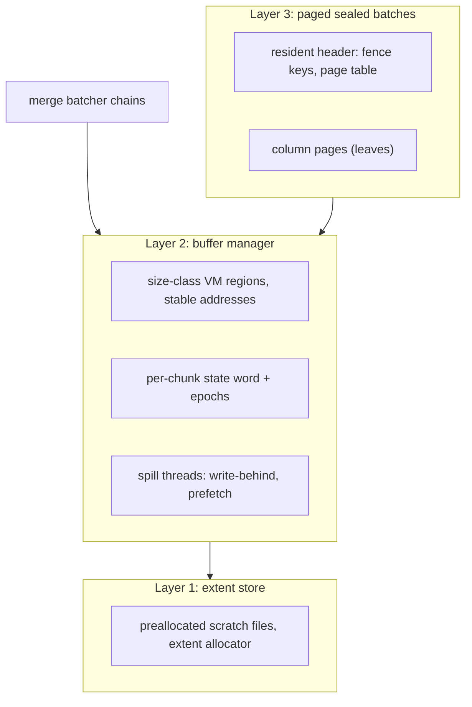

# Buffer-managed dataflow state

* Associated: [20260504_pager.md](20260504_pager.md) (the explicit pager this design succeeds), [CLU-65](https://linear.app/materializeinc/issue/CLU-65/pager).

## The problem

Materialize keeps dataflow state — merge-batcher chains, arrangement batches, upsert state — in resident memory, and treats disk as a reactive spill target.
The current mechanism is `mz_ore::pager`: a blob store that serializes a whole ~2 MiB columnar chunk and either hints it cold to the kernel (`Swap` backend) or writes it to a per-chunk scratch file (`File` backend).

Production experience with this design surfaced four structural problems.

First, the pager is a blob store, and the blob model caps what it can do.
Chunks page out whole and rehydrate whole; the partial-read API (`read_at_many`) has no production consumer.
Every page-in is a full deserialize-and-copy even when the reader needed a fraction of the data, and a resident chunk and its paged form are different types (`PagedColumn::Resident` vs `Paged` vs `Compressed`), so residency decisions are baked in at pageout time by a policy that can see only the chunk's size.

Second, the file backend pays filesystem metadata per chunk.
One named file per 2 MiB chunk means create, writev, open, pread, unlink per chunk per merge generation.
Profiling showed the hot cost is unlink and inode eviction — journaled extent deallocation plus page-cache invalidation under the inode lock — at 35.6 s versus 4.3 s for opens in the measured workload.
This is structural: the cost scales with chunk turnover, and merge-heavy workloads turn chunks over constantly.

Third, the swap backend trades control for laziness.
It wins when the working set mostly fits (data re-read before reclaim never touches disk, and translation is free) but under real pressure the kernel pages synchronously, per 4 KiB, on the worker thread: the pager design doc measured 64 s of sys time in a 65 s single-threaded merge, with TLB shootdowns and direct reclaim as user-visible latency.
The kernel also cannot know that a chunk consumed by a merge is dead, so it dutifully writes garbage to disk.

Fourth, and most importantly, on the columnar path only the pre-seal batcher stash spills at all.
Sealed spine batches — the arrangements proper, the dominant long-lived memory — are fully resident and invisible to any spill budget.
Columnation-era arrangements retain a transparent disk story through lgalloc's file-backed mappings (see Background), but the columnar containers removed lgalloc by design, and nothing replaced it past the batcher.
Hydration of a large arrangement holds the entire state in RSS regardless of how much of it is actively needed.

Buffer management for larger-than-memory state is an old and intensely studied problem in the database literature — not a solved one, as a decade of successive buffer-manager redesigns attests, but one rich in measured designs and documented failure modes to build on.
This design replaces the spill-a-blob model with a buffer-managed architecture in the style of Umbra and vmcache, adapted to the properties that make Materialize's problem easier than the general one: state is immutable once sealed, recreatable from persist (no durability requirement), and its lifecycle (just-built, sealed, queued-for-merge, dead) is known to the engine rather than guessed by a cache.

## Success criteria

The design succeeds when:

* Resident access to a chunk costs one atomic load; no hash-table translation, no serialization, no copy.
* A chunk that dies before pressure forces it out never touches disk.
* Workers never enter kernel direct reclaim on the state path, and any state-path I/O a worker performs is explicit, bounded, and chunk-granular at a point the engine chose — never an unscheduled page fault.
  Whether write-back runs on workers or dedicated spill threads is a measured choice (see I/O execution).
* Chunk turnover performs no per-chunk filesystem metadata operations: no create, no unlink, no inode churn.
* Sealed arrangement batches can be paged: a merge of two batches holds a bounded resident window rather than both batches; an arrangement cursor faults at most one leaf page per cold seek.
* Hydration of an arrangement larger than the memory budget completes with RSS bounded by the budget, not by state size.
* One budget pool covers batcher chains and arrangement batches; exceeding it triggers eviction of cold chunks rather than gating pageout decisions per chunk.
* The swap and file backends of `mz_ore::pager`, and the `PagedColumn` residency enum, are deleted at the end of the migration.

## Out of scope

* Durability and crash consistency.
  State is recreatable from persist; the scratch volume is a cache.
  No WAL, no manifest, no fsync anywhere in this design.
* Async restructuring of timely operators.
  Cursors and containers stay synchronous; cold accesses stall the worker for one NVMe read.
  ForSt-style asynchronous state access is a separate project.
* Warm restart (reattaching to scratch state across process restarts) ships as a follow-up, not in the initial milestones.
  The design keeps it reachable: the eager-backed format is versioned and self-describing from day one.
* Sharing on-disk format with persist parts.
  A north star (see Future work), not a requirement.
* Key-value separation (WiscKey-style out-of-line values).
  The value container stays abstract enough to add it; see Open questions.
* Non-Linux production support, as with the existing pager.

## Background

### Three generations of disk offload

Materialize has approached larger-than-memory state three times.

The first generation was [lgalloc](https://crates.io/crates/lgalloc) (integrated October 2023): a size-classed allocator that serves large allocations from memory-mapped files on the scratch volume.
Columnation-backed arrangement regions and persist's arrow buffers allocate through it (`enable_columnation_lgalloc`, default on), which is why columnation-era arrangements have a disk story today — but a transparent one: the kernel owns writeback and reclaim of the file-backed pages, including dirty-page writeback at its own discretion.
Operating it has meant approximating policy from below the allocation boundary: a background worker returning freed memory, eager-return and file-growth-dampener knobs, and eventually a disk usage limiter (May 2025) — all compensating for the fact that an allocator sees only `alloc` and `free`, never "this region is cold", "this run will be read sequentially next", or "this data is dead".

The second generation was kernel swap: provision swap on the cluster nodes and let the kernel page anonymous heap memory under pressure.
Swap subsumes the allocator seam — every allocation is implicitly offloadable, nothing opts in — but it conflates dataflow state with arbitrary heap allocations and hands eviction to the kernel at anonymous-page granularity.
The pager design doc records the endpoint: direct reclaim running on worker threads, `pgscan_direct` spikes during hydration, synchronous per-4 KiB faults serializing single-threaded merges.

The third generation is the explicit pager of [20260504_pager.md](20260504_pager.md): the application marks cold data and chooses a backend.
The columnar end-to-end project deliberately removed lgalloc from the columnar containers ([CLU-64](https://linear.app/materializeinc/issue/CLU-64/remove-lgalloc-from-columnar): `Column::Aligned` becomes a plain `Vec<u64>`) to create the seam the pager plugs into; the lgalloc copies in persist's arrow path are being removed in parallel.
The pager fixed the control problem at blob granularity but inherited the ceilings described under The problem.

This trajectory matters to the present design in two ways.
First, the first two generations differ only in where the kernel's transparency attaches — file-backed mappings versus anonymous memory — and share the failure mode, which the third generation answers only partially: the entity that owns eviction must be the entity that knows data lifecycle, and neither the kernel nor a size-only pageout policy can know it.
Second, lgalloc's address-space layout — size-classed regions over a scratch volume — is structurally Layer 2's layout; what changes is the direction of control, from file-backed mmap with kernel paging to anonymous memory with engine-scheduled explicit I/O.
In that sense Layer 2 is less a new mechanism than lgalloc with the kernel taken out of the loop.

### The workload, from first principles

The state this design serves has properties a general-purpose storage engine cannot assume:

* **Immutable after seal.** Columnar chunks and arrangement batches never mutate; the only state transitions are residency transitions.
  This deletes dirty tracking, write-back ordering, reader/writer latching on content, and torn-read hazards.
* **Recreatable.** Everything can be rebuilt from persisted sources, so every durability mechanism is deletable.
* **Lifecycle known to the engine.** The merge batcher knows which chains merge next; a consumed chunk is dead; hydration output is write-once-read-rarely by construction.
  A generic buffer manager spends real machinery (LeanStore's cooling stage, LRU approximations) guessing at coldness the engine here simply knows.
* **Maintenance is sequential; the update path is random and delta-proportional.**
  Merges, extraction, and hydration are linear scans and dominate bytes moved.
  The latency-critical path has the opposite shape: incremental operators do work proportional to arriving deltas — a join probes arrangements at exactly the updated keys, upsert reads back the keys in the input batch — and interactive peeks are fully random.
  How much each side matters is workload-dependent, and this is the assumption in this document most likely to draw disagreement: a design that follows the sequential framing too closely becomes a batch processor.
  Several choices below (per-arrangement residency policy, per-arrangement leaf sizes, uncompressed lookup tiers, the record-cache open question) exist specifically to keep per-key probes cheap; see "Access patterns, read amplification, and policy" under Layer 3.
* **Already log-structured.** A differential spine is a tiered LSM: batches are immutable sorted runs, the fueled merge scheduler is the compactor, batcher chains are L0.
  The design question is not "adopt an LSM" but "give the existing LSM a paged run format and a buffer manager."

Tuning within the current blob model has continued, and its best-known endpoint is instructive.
The strongest measured swap-backend strategy ([#36948](https://github.com/MaterializeInc/materialize/pull/36948), benchmarked in [CLU-108](https://linear.app/materializeinc/issue/CLU-108/correctionv2-pager-lz4-compress-spilled-chunks-madv-pageout-swap)) couples lz4 compression with an eager `MADV_PAGEOUT` over the compressed bytes at spill time: peak RSS holds at the budget (0.40 GiB versus 0.97 GiB with lazy hints, where RSS drifts to the cgroup cap and is relieved only at the kernel's pressure cliff).
The eager eviction pays precisely because compression shrinks the re-fault volume ~5.6×; on the uncompressed path the same hint is a measured net loss.
That result is this design's thesis expressed through kernel primitives — compress at the spill boundary, release physical memory eagerly, keep RSS honest against the budget — and it simultaneously marks the blob model's ceiling: re-access still faults synchronously per 4 KiB on worker threads, a chunk consumed moments after spill was evicted (and must be re-faulted) anyway because the kernel cannot know it was about to die, and the compress-and-evict decision remains irrevocable at pageout time.
Layer 2 keeps the converged policy — cold data compressed past the memory boundary, physical memory released eagerly — while replacing the mechanism with one the engine schedules, prioritizes, and can cancel.

The disk-versus-memory question is not binary.
Treating disk as the first-class home of all state (every chunk written at seal) buys pressure-free eviction and warm restart but imposes a write-bandwidth floor proportional to merge traffic — fatal for young data that dies in seconds, and for EBS-class disks.
Treating disk as a pure spill target avoids the floor but makes pressure handling a write storm at the worst moment and leaves nothing on disk to reattach to.
The resolution is that both modes share one mechanism and differ in a single policy bit — when must a chunk be backed — and the spine's geometric level structure supplies a principled threshold: lazy backing for young, churning data; eager backing for sealed, deep, long-lived data.

## Solution proposal

Three layers, built bottom-up, each independently shippable.

### Layer 1: extent store

Replace per-chunk scratch files with a few large preallocated files per worker (or `O_TMPFILE` inodes) and a userspace extent allocator.

* Allocation rounds to the chunk size classes (see Layer 2), so the free list is per-class and fragmentation is bounded by construction.
* Free is a free-list push.
  No unlink, no journal transaction, no inode eviction — the measured 35.6 s cost class becomes pointer arithmetic.
  Space is returned to the filesystem lazily and batched via `fallocate(FALLOC_FL_PUNCH_HOLE)` only if scratch-volume pressure demands it.
* I/O is `O_DIRECT`: the buffer pool (Layer 2) is the cache, and the kernel page cache would be a second copy of everything plus unpredictable writeback.
  Aligned buffers are natural for the paged format.
* The DuckDB temp-file model is precedent: slotted, recycled temp files in native block format rather than create-unlink per object.

This layer is shippable behind the existing `Handle` API as a drop-in replacement for the file backend's storage, before any of Layer 2 exists.

### Layer 2: buffer manager

#### Address space and translation

Reserve large anonymous virtual-memory regions per size class (Umbra's design): a 2 MiB class for batcher chunks and large column pages, hugepage-aligned, plus one or two smaller classes for Layer 3 pages and headers.
Virtual reservation is `MAP_NORESERVE`-cheap; physical memory materializes on use and is released on eviction with batched `MADV_DONTNEED`, keeping the virtual slot.
The pool memory is not file-backed: the pool is a cache over the extent store, not a view of it, and data moves between the two only through explicit, engine-scheduled I/O — the kernel never transfers a byte in either direction, unlike both lgalloc (where the mapping is the file) and swap (where anonymous memory is implicitly device-backed).

A chunk's virtual address is fixed for its lifetime, vmcache-style: fault-in is a `pread` into the same reserved range, so a fault never invalidates a pointer.
This is the load-bearing property for Layer 3 — borrowed reads into pool memory survive evict/reload cycles — and it is why this design takes vmcache's stable identity over Umbra's pointer swizzling: swizzling permits relocation on reload and therefore requires fixing up an owner pointer, which would thread relocation logic through container code and invalidate outstanding borrows.
Address-space slots are recycled only after a chunk is freed and an epoch grace period passes.

Translation is arithmetic on the chunk handle.
There is no page table, no hash map, no latch on the resident path.

#### Chunk states

Residency is a state, not a type.
Each chunk carries one atomic state word (the vmcache per-page word, minus the dirty states immutability deletes):

* `UnbackedResident` — lives only in the pool; no disk copy exists.
* `WriteInFlight` — write to an extent has been enqueued or issued; the chunk remains readable.
* `BackedResident` — clean; a disk copy exists; eviction is free (release physical pages, no I/O).
* `Evicted` — disk copy only; access faults it back in.
* `Faulting` — read in flight; concurrent accessors wait or retry.

The `PagedColumn` enum and its `Resident`/`Paged`/`Compressed` variants disappear; callers hold a chunk handle and access it uniformly.

#### Write-behind, and never writing dead data

"Page out" becomes a state transition, not an I/O.
Under budget pressure (or eager-backing policy, below) a chunk transitions to `WriteInFlight` and its write-back is performed by the evicting worker or queued to spill threads (see I/O execution); on completion it is `BackedResident`; physical pages are released only when the budget actually demands it.

This captures what makes the swap backend fast — laziness, free re-access before reclaim — while keeping what makes the file backend controllable, and adds the one thing neither backend can do: freeing an `UnbackedResident` chunk is a pure memory operation, and freeing a `WriteInFlight` chunk cancels the write.
In a merge-heavy workload most chunks die young; avoided writes are the largest available win, and only the engine knows liveness.

#### Eviction policy

Lifecycle hints drive eviction; a small second-chance FIFO is the backstop for unannotated chunks.

* Dead chunks are freed immediately (not evicted — there is nothing to keep).
* Chunks in chains scheduled to merge soon are pinned-equivalent hot.
* Chunks in long chains awaiting more input are cold.
* Hydration-era output is write-once-read-rarely: eager-evict FIFO.

LeanStore's cooling stage exists because a generic buffer manager must speculate about coldness; the engine here knows it, so the speculation machinery reduces to a backstop.
The budget is the existing `TieredPolicy` atomic pool reinterpreted: it bounds resident bytes, and exceeding it selects eviction victims rather than gating pageout decisions per chunk.

#### Borrow safety: epochs

Readers take no per-access locks.
Workers advance an epoch counter at operator yield points; the evictor releases physical pages only for chunks unpinned for a full epoch.
Borrows into pool memory never cross a yield (cursor positions stored across activations are indices; re-access goes through the container, which re-faults if needed), so epoch protection is sound with zero reader-side cost beyond the state-word load.

This deliberately departs from Umbra's optimistic versioned latches: optimistic validate-and-restart requires restartable readers, and differential cursor consumers dereference borrows in arbitrary downstream code that cannot be re-executed.
The trade is explicit: we give up evicting a page out from under an active reader — which we do not need, because borrows are yield-bounded — for zero per-access synchronization.

#### I/O execution

Common to every option: transfers are chunk-granular `pread`/`pwrite` with `O_DIRECT`, and a worker that needs evicted data immediately faults it in synchronously (one bounded NVMe read, ~100 µs–1 ms for 2 MiB-class transfers depending on device).
The Haas/Leis NVMe results size the stack: io_uring with deep queues matters at 4 KiB OLTP page sizes; at ≥256 KiB transfers, synchronous calls at modest concurrency saturate the device, so 2 MiB chunks need no exotic submission machinery either way.

Who performs write-back and readahead is a design choice with two candidates, decided by measurement at milestone 2.

**Synchronous, on-worker — Umbra's model.**
The evicting worker writes the victim chunk itself; merge code prefetches by issuing reads early.
Published Umbra works exactly this way — synchronous `pread`/`pwrite` from worker threads throughout, chosen explicitly for simplicity — and the simplicity is just as real here: no queues, no completion tracking, no cross-thread chunk-state transitions, and natural backpressure, since the worker causing spill pays for spill.
The stall arithmetic may well be acceptable: a 2 MiB `O_DIRECT` write at device speed is roughly a millisecond (plus sub-millisecond lz4), bounded, chunk-granular, and taken at a point the engine chose — categorically different from swap's unbounded per-4 KiB fault storms even though both are "synchronous".
The structural weakness is the read side: one thread cannot overlap I/O with compute, so a cold merge serializes read-then-process per chunk and runs at device latency rather than device bandwidth — a gap kernel readahead used to hide on the buffered path and `O_DIRECT` forfeits.

**Asynchronous, off-worker — LeanStore's page-provider model.**
A small pool of dedicated spill threads consumes a write-behind queue and services readahead, so workers never perform eviction I/O and merges overlap fault-in with compute.
This is the LeanStore 2018 pattern; io_uring (which LeanStore adopted only in its 2024 NVMe redesign) stays deferred behind the same interface until transfer sizes shrink enough to need it.
The costs are the machinery — queues, completions, sizing knobs, cross-thread state-word transitions — and a longer cancellation path for dead chunks with writes in flight.

A middle path exists if measurement splits the difference: workers take write stalls synchronously but submit their own readahead through a small per-worker io_uring, checking completions at access time — read-side overlap without dedicated threads.
The chunk state machine is identical in all three shapes; only the executor of the `WriteInFlight` and `Faulting` transitions differs, so the choice is contained behind one interface and revisitable.

Eviction throughput is bounded by `madvise` page-table work and TLB shootdowns (the vmcache paper's measured ceiling; their fix, the exmap kernel module, is not shippable here).
Mitigation is granularity: 2 MiB chunks are ~500× fewer page-table operations per byte than 4 KiB pages, and `MADV_DONTNEED` calls are batched.

#### Compression

Compression is a property of the extent, not the residency state.
Resident form is always uncompressed at its stable address; lz4 (or stronger, see BtrBlocks under Prior art) is applied at write time by whichever thread performs the write (see I/O execution) and reversed at fault-in.
This keeps codec CPU off the access path — and off worker threads entirely in the off-worker option — and removes today's oddity where `CompressedInner::Memory` holds lz4 bytes in resident memory — softened by the eager `MADV_PAGEOUT` of [#36948](https://github.com/MaterializeInc/materialize/pull/36948), but still kernel-managed on the way back in.

### Layer 3: paged sealed batches

#### The integration seam

Differential batch storage is generic over containers: `OrdValBatch` is parameterized by a `Layout` whose `KeyContainer`, `ValContainer`, offset, time, and diff containers each implement `BatchContainer`, and Materialize already substitutes its own containers in `mz_row_spine`.
A paged container — elements stored across Layer 2 chunks plus a small resident header — implements `BatchContainer` without forking `OrdValBatch` or cursor logic.
Stable addresses make this sound: `index` returns a borrow into pool memory, valid because eviction cannot reclaim a page mid-borrow (epochs) and fault-in never moves data.

#### What is free to vary, and what is not

The index-structure literature is a zoo: update-in-place B+-trees, LSM variants, hybrids that buffer writes in tree leaves (Bf-Tree), record-granular hot/cold migration (2-Tree, anti-caching), key-value separation, per-run filters, learned indexes.
This design does not adjudicate the zoo, and its choices should not be mistaken for a claim to have done so.
The narrowing principle is that differential's spine semantics are load-bearing: operators rely on batches being immutable, sorted, timestamped, consolidated, and merged under frontier control, so the macro-structure — immutable sorted runs compacted by the fueled scheduler — is an input to this design, not a choice it gets to make.
Replacing it with an update-in-place tree or a record-migrating hybrid is a differential redesign, out of scope here.

What remains genuinely free, per arrangement, and where the zoo maps onto it:

* **Within-run layout**: leaf page size; key representation — inline, prefix-truncated, or out-of-line (`UpsertKey` is already an out-of-line key: a fixed-width hash standing in for the real key); value placement (inline vs WiscKey-style extents).
* **Cross-run read path**: resident fence keys always; per-run filters where probe traffic warrants them, with the LSM filter-allocation results (Monkey) applying directly since spine runs are levels; the record-granular hot cache as the explicitly open question.
* **Hot/cold mechanism**: page-granular residency is the committed mechanism; record-granular migration is the deferred alternative if probe traffic defeats page granularity.

This narrowing is also the precise answer to "why not a B+-tree": not because B-trees lose some abstract benchmark, but because the spine already fixes the macro-structure, and a static B+-tree per run is simply what falls out of indexing an immutable sorted run.

#### Run format

A paged batch is, structurally, a static bulk-loaded B+-tree:

* **Resident header** (small, never evicted): fence keys — the first key of each page, owned — a page table mapping logical index ranges to chunk handles, and optionally a filter.
  Resident overhead is tens of bytes per 2 MiB page, four orders of magnitude below the data.
* **Column pages** (leaves): the batch's parallel columns split at aligned boundaries.
  Size classes per column density: small pages for offsets/times/diffs, large pages for key and val data.

`seek_key` binary-searches fence keys with zero I/O and faults at most one leaf page.
This is Umbra's B+-tree read path with the write path amputated: because batches are immutable and built bottom-up at seal, there are no structure-modification operations, no latch coupling, no insert path — every hard problem in the mutable-tree literature is absent by construction.

#### Access patterns, read amplification, and policy

* **Spine compaction**: two linear scans; readahead keeps a bounded resident window, making GB-scale batch merges RSS-bounded.
* **Joins**: probe traffic is delta-proportional — each input batch probes the arrangement at its updated keys.
  Probes arrive in key order but may touch an arbitrarily sparse subset of pages; dense probe sets approximate scans, sparse ones are point lookups in disguise.
* **Upsert feedback**: point lookups, batched and sortable before issue.
* **Interactive peeks**: genuinely random and latency-sensitive.

Read amplification is the central tension for everything except compaction.
A cold probe faults a whole leaf page to read one row: at 2 MiB pages that is roughly four orders of magnitude of amplification, plus a decompress if the page carried a codec — "decode a megabyte to read a row" is exactly the failure mode a page-granular design courts, and a design tuned only for scan throughput would court it constantly.
Four mechanisms bound it, in escalating order:

* Leaf size is a per-arrangement choice, not a constant: lookup-heavy arrangements use small leaves (64 KiB-class, ~30× less worst-case amplification) at the cost of more header entries; scan-heavy arrangements keep large leaves.
* Compression is per-page policy, not format: lookup-serving tiers skip the codec, so a faulted page is readable without decode.
* Per-run filters reject absent keys without faulting anything.
* The residency policy is per-arrangement, and the safety valve is total: an arrangement whose probe traffic makes paging a net loss is simply kept resident — exactly today's behavior.
  The design degrades to the status quo, not below it.

If sparse cold probes remain on the hot path after all four, page granularity itself is the wrong caching unit for that traffic, and the remaining option is record-granular caching above the page layer (the Bf-Tree mini-page idea) — an open question, not a committed mechanism.
Arrangements serving interactive peeks additionally keep recent batches and headers resident under a priority-aware budget (see Open questions).

#### Hydration

Build pages during hydration, seal, write-behind, evict eagerly.
Arrangement hydration proceeds with RSS bounded by the budget regardless of state size — the co-tenancy problem the stash-merge fueling work attacks from the demand side, solved from the supply side.

#### Values

Large `Row` values dominate some arrangements and are rewritten by every merge.
WiscKey-style full key-value separation conflicts with differential consolidation — merges compare `(key, val)` pairs, and out-of-line values would cost a dereference per comparison — but values are only compared when keys and times tie, so with mostly-unique keys the dereference rate may be low enough that separation wins for large rows.
The template is Umbra's string layout: small values inline in the leaf page, large values out-of-line in write-once extents referenced by pointer, threshold chosen by measurement.
The initial format keeps the val container abstract enough to add this without a format break.

### Backing policy: lazy and eager

One policy bit per chunk — when must it be backed — with the data's position in the implicit LSM choosing the value:

* **Batcher chunks and young/small spine batches**: lazy.
  Write-behind under pressure only, with die-young elision.
  This is the memtable/L0 of the LSM; eager backing here is waste, and even maximally disk-first storage engines keep their write buffers in memory.
* **Sealed batches past a size or level threshold**: eager.
  A deep batch survives long, is read sporadically, and merges rarely; one write at seal is cheap against its lifetime, it is exactly the data that should leave RSS, and it is what makes warm restart cover the bytes that matter.
  The spine's geometric structure supplies the threshold.
* **Hydration-era output**: eager, always.

Eager backing converts pressure response from a write storm at the worst moment into "release clean pages," a pure memory operation: the degradation curve goes from a cliff to a slope.

### Configuration

Dyncfg-driven, mirroring the existing pager flags:

* enable flags per consumer (compute batchers, storage upsert stash, paged sealed batches), so rollout is independent per surface;
* resident-bytes budget (the reinterpreted `TieredPolicy` pool);
* eager-backing threshold (batch size or spine level);
* I/O executor selection (and spill-thread count where applicable), codec, scratch sizing.

The existing `ColumnPager`/`PagingPolicy` seam is the Layer 2 integration point for batchers; live reconfiguration semantics carry over.

## Performance estimates

Measured numbers come from the pager design doc's benches ([20260504_pager.md](20260504_pager.md), reproduced where load-bearing), the CLU-108 benchmarks behind [#36948](https://github.com/MaterializeInc/materialize/pull/36948), and the upsert-hydration profile that motivated Layer 1.
Estimates for this design derive from device arithmetic and are marked as such; milestone 2 exists to replace them with measurements.

### Cost model

Per 2 MiB chunk, on the pager doc's two reference boxes (single encrypted NVMe at ~1.4 GB/s sustained; r8gd striped instance NVMe at ~7 GB/s):

* `O_DIRECT` read or write: ~0.3 ms (striped) to ~1.4 ms (encrypted single disk).
* lz4: ~2–3 ms to compress (≈0.7–1 GB/s per core), ~0.4–0.5 ms to decompress (≈4–5 GB/s); CLU-108 measured ~5.6× ratio on arrangement data.
  Note the asymmetry: on-worker compression costs more than the write itself, which weights the codec decision toward the off-worker executor or toward compressing only eager-backed (cold) tiers.
* Kernel swap path for the same 2 MiB: 512 synchronous 4 KiB faults; the pager doc measured 2.12 M page-ins for an 8 GiB working set with 64 of 65 wall-seconds spent in the kernel.
* Per-chunk filesystem metadata (today's file backend): dominant at scale — 35.6 s of unlink/inode-eviction against 4.3 s of opens over one measured hydration; the extent allocator's equivalent is a free-list push, effectively zero.

### Headline comparison

"Swap" is the current swap backend (`MADV_COLD`, plus the lz4+`MADV_PAGEOUT` variant of #36948 where noted); "lgalloc" is kernel-paged file-backed mmap; "file" is today's per-chunk scratch files; "this design" is Layer 2 with extents.

| Dimension | Swap | lgalloc | File (today) | This design (estimate) |
|---|---|---|---|---|
| Hot re-access, resident | memory speed, unless already reclaimed (refault) | memory speed | full round trip every time (~1–4 ms/chunk) | pointer deref + one atomic load |
| Merge throughput, 1 thread, 2–4× pressure | 0.12–0.15 GiB/s (measured) | ≈ swap (same fault path) | 0.36–0.50 GiB/s (measured) | ~0.6 GiB/s sync executor; ~0.7 GiB/s (device/2) with read overlap |
| Merge throughput, 16–64 threads, fast disk | ~1.5 GiB/s overall, ~2.5 merge-phase (measured) | ≈ swap | 1.73 GiB/s, disk-bound (measured) | ≥ file; same disk ceiling raised by write elision and, where data compresses, by the lz4 ratio (5.6× measured) on disk traffic |
| RSS under pressure | pins to cgroup cap; 0.40 GiB with lz4+PAGEOUT (measured) | kernel-managed, opaque | working window, ~376 MB at 64 threads (measured) | budget, by construction |
| Worker stall profile | unbounded; 97% sys time single-threaded (measured) | ≈ swap, plus dirty-page writeback at kernel discretion | bounded but eager: every pageout pays serialize+write | ≤ ~1 ms bounded per eviction (sync executor); ~0 (off-worker) |
| Per-chunk metadata | none | none | dominant at scale (measured, see model) | none (free-list) |
| Cold point lookup into sealed state | n/a today (resident); per-touched-4 KiB fault if it paged | per-touched-4 KiB fault | whole-chunk rehydrate minimum | one page read, ~0.1–1 ms (Layer 3) |
| Hydration RSS | working set (kernel may lag) | working set, kernel-paced relief | unbounded on the columnar path | budget, with build at device write bandwidth (Layer 3) |

No dedicated lgalloc benchmarks exist in our record; its column is inferred from sharing the kernel fault path with swap, with the added caveat of file-backed dirty writeback.
Treat it as qualitatively-swap rather than independently measured.

### What the estimates assume, and where they could be wrong

* **Write elision rate.**
  The merge-throughput gains assume a meaningful fraction of chunks die unbacked (lazy tier).
  In steady-state merging this fraction is high (chains turn over continuously); under eager backing it is zero by definition.
  No measurement exists yet; milestone 2's elision-rate metric is the check.
* **Compression ratio.**
  The 5.6× figure is one workload's arrangement data; the disk-ceiling multiplier scales directly with it and drops to 1× on incompressible data.
* **Eviction overhead.**
  Batched `MADV_DONTNEED` at 2 MiB granularity is assumed cheap; the vmcache results say page-table work serializes at high eviction rates, and our margin comes from chunk granularity (~500× fewer operations per byte than 4 KiB paging).
  A workload that thrashes the budget boundary could still expose this.
* **Epoch latency.**
  Eviction waits one epoch (one yield cycle) per chunk; a worker stuck in a long-running operator step delays reclaim process-wide.
  This is an accounting hazard, not a throughput one, but it can transiently overshoot the budget.
* **Single-thread sync-executor estimate.**
  The ~0.6 GiB/s figure assumes read-process-write serialization per chunk with no overlap; it degrades toward the file backend's numbers if compression runs on-worker (see cost model) and improves toward device/2 with the io_uring middle path.

## Minimal viable prototype and milestones

1. **Extent store under the existing file backend.**
   Same `Handle` API; per-chunk files replaced by pooled extents.
   Validates: inode-churn elimination (re-run the workload that measured 35.6 s of unlink), `O_DIRECT` alignment plumbing, allocator fragmentation under merge churn.
2. **Buffer pool under the batcher.**
   Size-class regions, state words, write-behind, lifecycle eviction; integrated behind `ColumnPager` so the merge batcher is unchanged above the seam.
   Validates: RSS bounded by budget under the pager design doc's merge benches; dead-chunk write elision rate; worker threads never in reclaim (`pgscan_direct` flat); throughput at least matching the better of today's two backends at 1, 16, and 64 threads.
   Also decides the I/O execution model: run the same benches under the on-worker and off-worker executors, measuring operator-step time inflation from on-worker stalls and cold-merge throughput with and without read overlap.
   At this milestone the swap and file backends are deletable.
3. **Borrow-safety prototype for Layer 3.**
   A paged `BatchContainer` for one container type plus an audit (and assertion machinery) that no consumer holds a container borrow across a yield.
   This is the step most likely to send the design back for revision; do it before committing to the full format.
4. **Paged sealed batches for one spine.**
   `ValRowSpine` (upsert feedback) first: single consumer, batched lookups, no interactive peeks.
   Validates: bounded-RSS hydration end to end; merge throughput with readahead; cold-seek latency.
5. **General arrangements and peek-aware policy.**
   Eager-backing thresholds, per-dataflow priorities, rollout to compute indexes.

## Prior art

The design is an application of the modern buffer-manager literature to a workload with unusually favorable properties; the mapping is deliberate and close.

* **Umbra** (Neumann & Freitag, CIDR 2020, [pdf](https://db.in.tum.de/~freitag/papers/p29-neumann-cidr20.pdf)).
  Size-class anonymous VM regions, `MADV_DONTNEED` release, variable-size pages so large objects stay contiguous, and the stance that all data structures share one buffer-managed budget — Layers 1–2 adopt all four.
  Umbra's versioned latches and pointer swizzling are replaced (see vmcache and epochs above) because immutability and yield-bounded borrows make them unnecessary.
* **LeanStore** (Leis et al., ICDE 2018, [pdf](https://db.in.tum.de/~leis/papers/leanstore.pdf); NVMe redesign VLDB 2024).
  The governing insight: make the resident path free and pay translation only at the disk boundary.
  Its cooling-FIFO replacement policy survives here only as a backstop, because the engine has lifecycle knowledge LeanStore must speculate about.
* **vmcache** (Leis et al., SIGMOD 2023, [pdf](https://www.cs.cit.tum.de/fileadmin/w00cfj/dis/_my_direct_uploads/vmcache.pdf)).
  Stable virtual addresses as page identity, per-page atomic state words, explicit fault/evict.
  Layer 2's chunk model is vmcache minus dirty states.
  Its companion measurement — eviction throughput ceilinged by `madvise`/TLB-shootdown costs, fixed there by the exmap kernel module — is the constraint our 2 MiB granularity is designed around.
* **mmap critique** (Crotty et al., CIDR 2022, [pdf](https://db.cs.cmu.edu/papers/2022/cidr2022-p13-crotty.pdf)).
  Why kernel-controlled paging (including our swap backend) fails: unschedulable synchronous faults, single-threaded reclaim, TLB shootdowns.
  The pager design doc's swap-backend measurements are an independent reproduction.
* **NVMe I/O stack** (Haas & Leis, VLDB 2023, [pdf](https://vldb.org/pvldb/vol16/p2090-haas.pdf)).
  `O_DIRECT` plus engine-managed buffering; deep async queues matter at 4 KiB pages, synchronous threads suffice at large transfers.
  Grounds the spill-thread choice and the io_uring deferral.
* **LSM design space** (Dong et al., CIDR 2017; Dayan & Idreos, *Dostoevsky*, SIGMOD 2018; Lu et al., *WiscKey*, FAST 2016, [pdf](https://www.usenix.org/system/files/conference/fast16/fast16-papers-lu.pdf)).
  Compaction math and key-value separation.
  With durability deleted, an LSM reduces to exactly what a differential spine already is; WiscKey informs the value-separation option, tempered by the consolidation conflict noted above.
* **DuckDB** ([memory management](https://duckdb.org/2024/07/09/memory-management)).
  Native-format spill (eviction = unpin, no serialization) and recycled temp-file slots — Layer 1's direct precedent.
* **Flink on RocksDB** ([guide](https://flink.apache.org/2021/01/18/using-rocksdb-state-backend-in-apache-flink-when-and-how/)); **ForSt** (Mei et al., VLDB 2025, [pdf](https://www.vldb.org/pvldb/vol18/p4846-mei.pdf)).
  The negative example: a byte-API KV store under a dataflow engine pays serialization on every access and fights two compaction schedulers and two caches.
  ForSt's disaggregated architecture (durable state remote, local disk a cache) is the architecture Materialize already has with persist; its async state access is out of scope here.
* **BtrBlocks** (Kuschewski et al., SIGMOD 2023).
  Compression applied at the pool/storage boundary with hot data uncompressed in buffer-managed pages; grounds the compression placement and is the natural format conversation for the persist-alignment north star.
* **B-tree alternatives** (LMDB; Wang et al. on the Bw-tree, SIGMOD 2018; Callaghan's amplification framework; Hao & Chandramouli, *Bf-Tree*, VLDB 2024, [pdf](https://vldb.org/pvldb/vol17/p3442-hao.pdf)).
  An update-in-place or COW disk B-tree pays random-write amplification to buy point-read latency that immutable runs plus resident fence-key indexes can serve at one read per cold seek.
  Bf-Tree's variable-length mini-pages — simultaneously a record cache and a write buffer — are the precedent for the record-granular caching open question.
* **Hot/cold hybrids and filter sizing** (Zhou et al., *2-Tree*, CIDR 2023; DeBrabant et al., *Anti-Caching*, VLDB 2013; Dayan, Athanassoulis & Idreos, *Monkey*, SIGMOD 2017).
  Record-granular hot/cold migration (2-Tree, anti-caching) is the deferred alternative if probe traffic defeats page-granular residency; Monkey's optimal per-level filter allocation applies directly to per-run filters, since spine runs are LSM levels in all but name.

## Alternatives

### Embed RocksDB (or any general-purpose KV store)

Rejected.
Flink's experience is the controlled experiment: per-access serialization across a byte-oriented API, a second compaction scheduler fighting differential's fueled merges, a second cache (block cache) double-buffering against ours, and opaque memory accounting.
Differential already owns sorted-run maintenance; the missing piece is run storage, not a storage engine.

### File-backed mmap of scratch files (the lgalloc architecture)

This alternative is not hypothetical: lgalloc is its production-tested instance, and it still backs columnation arrangements today (see Background).
Rejected for new work per Crotty et al., our own swap-backend data, and the operational record: faults are synchronous and unschedulable on worker threads, reclaim is kernel-paced, writeback timing is invisible, and policy has to be approximated from below the allocation boundary with an accumulating set of knobs.
This design keeps what lgalloc got right — size-classed regions over a scratch volume — and keeps virtual memory as a translation mechanism (anonymous regions, explicit I/O) while rejecting kernel-controlled paging: the vmcache position.

### Keep the two-backend pager and optimize it

Extent pooling (Layer 1) fixes the file backend's inode churn, and `MADV_PAGEOUT` batching could soften swap's reclaim storms, but the blob model itself caps the ceiling: whole-chunk rehydration on every access, residency decided irrevocably at pageout time, no path to paging sealed batches, and two backends each accidentally good at half the workload.
Layer 2 subsumes both backends' strengths in one mechanism.

### Pure disk-first (every chunk written at seal)

Rejected as a universal policy, adopted as a per-level policy.
Universal eager backing imposes a write floor proportional to merge traffic — most batcher chunks die in seconds, and differential rewrites each record O(log n) times — which is unaffordable on EBS-class scratch and wasteful everywhere.
The eager/lazy threshold (see Backing policy) keeps disk-first's benefits where they are real: deep, sealed, long-lived state.

### Optimistic latches instead of epochs

Umbra's readers validate a version counter and restart on conflict, which permits eviction under active readers.
Differential cursor consumers receive borrows and cannot be restarted, so validation has nowhere to jump back to.
Epochs cost nothing on the read path and only delay eviction by one yield cycle; the flexibility lost is flexibility this workload cannot use.

## Open questions

* **Epoch mechanics.**
  Per-worker epoch counters advanced at yield, with the evictor taking a min — or a pin-count fallback for any consumer found to hold borrows across yields?
  Milestone 3 exists to answer this empirically; the assertion machinery should ship regardless.
* **Owned vs. pinned API for the first cut of Layer 2.**
  Keeping `take`-style owned rehydration (one memcpy out of the pool) eases migration; pinned borrows are the end state; builders allocating pool memory directly (zero-copy seal) is the end-end state.
  Recommend owned-first, with the chunk handle designed so pinning is additive.
* **Budget topology.**
  One global pool with per-dataflow priorities, or partitioned pools per cluster replica role?
  Peek-serving arrangements need protection from hydration floods either way; the simplest sufficient mechanism is preferred.
* **I/O execution model.**
  On-worker synchronous (Umbra's simplicity), dedicated spill threads (LeanStore's page provider), or the middle path of on-worker io_uring readahead with synchronous writes?
  Milestone 2 decides on measured operator-step inflation and cold-merge throughput; if threads win, count and placement (per-process vs per-worker, NUMA) follow as second-order questions.
* **Eager-backing threshold.**
  Spine level, batch byte size, or batch age?
  Level is the principled choice; byte size is the robust one when spines are shallow.
* **Value separation threshold.**
  Inline-vs-out-of-line cutoff for large rows, pending the dereference-rate measurement during merges of real upsert state.
* **Record-granular hot caching.**
  If sparse cold probes dominate some workloads even with small leaves, filters, and uncompressed lookup tiers, the page is the wrong caching unit for that traffic, and a record cache above the pool (Bf-Tree's mini-pages are the precedent) becomes worth its complexity.
  Decide on milestone 4 evidence rather than speculation.
* **Scratch exhaustion.**
  When the extent store fills: stop evicting and let RSS grow (current behavior, in effect), or backpressure ingestion?
  Needs an answer before eager backing ships, since eager mode writes more.
