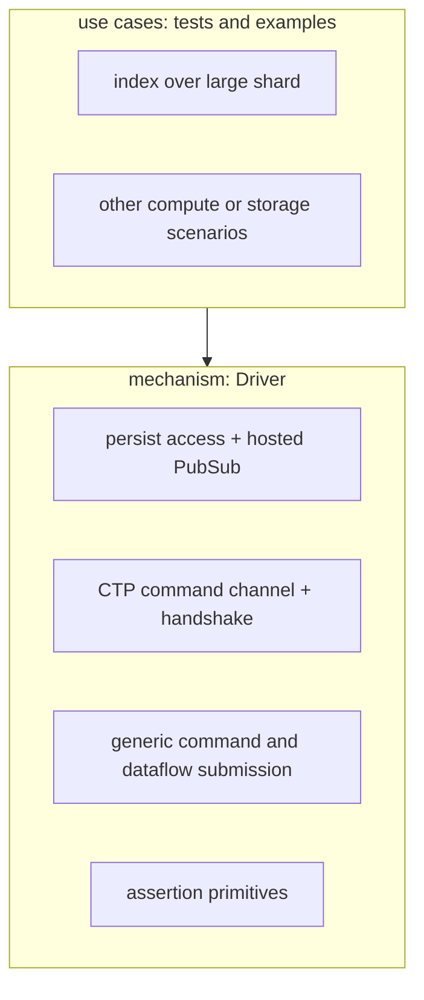
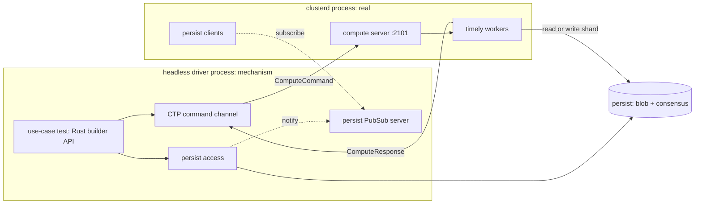

# Headless clusterd test driver

## Summary

This document designs a headless test driver for `clusterd`.
The driver is a generic alternate frontend that replaces `environmentd`'s controller for scripted compute and storage tests.
It hosts the persist infrastructure, drives the cluster command and response protocol over the wire, accesses persist directly, and asserts on responses.
The design separates two layers.
The mechanism is the generic headless frontend and stays free of any particular workload.
A use case is a test written on top of the mechanism, such as building an index over a large shard, and lives outside the core.

## Motivation

`environmentd` couples the cluster protocol to the full SQL and catalog stack, which makes targeted compute and storage experiments slow to set up and hard to control.
A test that wants to drive a specific dataflow against specific shard contents must currently go through SQL, the catalog, the optimizer, and the controller's timestamp and read-hold machinery.
A headless driver removes that coupling by speaking the cluster protocol directly, so a test controls the exact persist state, the exact commands the replica receives, and the exact timestamps.
This gives a faithful exercise of the real worker process and protocol while keeping the test deterministic and scriptable.
The same crate runs both as a `cargo test` for a fast local loop and as an `mzcompose` workflow against a real `clusterd`.

## Layering

The central constraint is that the mechanism is generic and the use cases are not.
The mechanism knows how to host persist, connect to a replica, send any command, read or write any shard, and observe responses.
It does not know about index building, data sizes, or timestamp distributions.
A use case composes those primitives into a workload and its assertions.
This keeps the mechanism reusable for compute and storage tests that have nothing to do with the motivating index scenario.

## Goals

### Mechanism

* Host the persist PubSub server, as `environmentd` does, so the replica's persist clients receive push notifications.
* Provide a persist client for direct shard access: open shards, write batches, read snapshots, downgrade `since`, observe `upper`.
* Connect to a real `clusterd` over the compute Cluster Transport Protocol (CTP) and replicate the controller handshake.
* Send arbitrary `ComputeCommand`s, including hand-assembled `CreateDataflow`s, and optionally `StorageCommand`s.
* Demultiplex responses: track per-id frontiers, route peek responses, surface status.
* Provide assertion primitives: wait for a frontier to advance within a timeout, peek an index, read a shard snapshot, and count rows.
* Run as a `cargo test` and as an `mzcompose` workflow.

### Use cases (out of the mechanism)

* Produce data by either of two strategies, selected per test:
  * write synthetic rows directly to a persist shard via the persist write API, or
  * submit a dataflow whose sink writes to a persist shard, producing data through the cluster itself.
* The motivating scenario: create a shard of a chosen size, at a single timestamp or spread across many, build an index, and measure or assert.

## Non-goals

* The SQL layer, catalog, optimizer, and timestamp oracle.
* The txn-wal system.
  Direct persist writes target the data shard with `txns_shard = None`.
* Baking any specific workload, data size, or timestamp distribution into the mechanism.
* Optimizer-quality plan generation.
  Dataflows are assembled by the caller or by small shared helpers, not by lowering SQL.
* Automatic controller behavior.
  The driver does not issue `Schedule`, `AllowCompaction`, or read-hold management on its own.
  The test drives every side-effecting command explicitly, which is what makes side effects controllable.

## Architecture

The driver and `clusterd` share a persist blob store and consensus, configured in `mzcompose` via the environment-selected metadata store (CockroachDB or Postgres) and an object store.
The driver hosts the persist PubSub server so the replica's persist clients receive low-latency notifications, matching the `environmentd` deployment.
A use case drives the flow: it writes or arranges persist state through the mechanism, submits commands, and asserts on responses.

## Mechanism

The mechanism lives in a new crate, `src/clusterd-test-driver`, exposing a library with the `Driver` API and a thin binary for `mzcompose` workflows.

### Persist access and PubSub host

* The driver starts the persist PubSub gRPC server, the same server `environmentd` hosts, and configures both the replica and its own client with that URL.
* It exposes a persist client for generic shard access, not a workload-specific writer.
* Primitives: open a writer or reader for a shard given a schema, append a batch at a chosen `[lower, upper)`, read a snapshot at a timestamp, downgrade `since`, and inspect `upper`.
* Schema choices, encodings, and the contents of batches are caller concerns.

### CTP command channel

* It uses `transport::Client<ComputeCommand, ComputeResponse>` directly, because `ReplicaClient` and `SequentialHydration` are `pub(super)` and unavailable to an external crate.
* Connecting sends only `Hello { nonce }` (the transport/version step). The rest of the controller handshake — `CreateInstance(InstanceConfig)`, `UpdateConfiguration`, `InitializationComplete` — is driven by explicit script commands (`create-instance`, `update-configuration`, `initialization-complete`), so a script controls the instance config, arbitrary dyncfg, and exactly when the reconciliation window opens and closes. `create-instance` carries the settable `InstanceConfig` knobs (`expiration-offset`, `arrangement-dictionary-compression`); it also force-disables the peek-response stash (so peeks return inline), patched in the driver rather than exposed, since a stashed peek would break `peek`/`count`.
* The protocol version is `BUILDINFO.semver_version()`.
* A background receive loop demultiplexes responses.
  `Frontiers` updates a per-id output-frontier watch.
  `PeekResponse` is routed to a pending peek by `uuid`.
  `Status` is surfaced for diagnostics.
* The storage CTP channel is structurally the same and is added when a use case needs it; the compute channel is the first cut.

### Command and dataflow submission

* The mechanism submits any `ComputeCommand` the caller constructs, including `CreateDataflow`, `Schedule`, `AllowCompaction`, `Peek`, and `CancelPeek`.
* Dataflow assembly goes through `DataflowBuilder` rather than a single opinionated constructor (see below).

### Dataflow construction: `DataflowBuilder`

The first cut shipped a single `index_dataflow(source_id, index_id, shard, location, desc, key_cols, as_of, upper)` function.
That function bakes in five choices a test should control independently: the number of storage inputs, the shape of the computation, the number and kind of exports, the temporal bounds, and the identifiers.
The reusable part is none of those; it is the *mechanism*, which is the MIR-to-LIR lowering, the `RenderPlan::try_from` conversion, the `CollectionMetadata` attachment, and the `SqlRelationType`-versus-`ReprRelationType` bookkeeping.
`DataflowBuilder` owns exactly that mechanism and exposes the five axes as verbs.

* `new(name)` starts an empty builder holding a MIR `DataflowDescription` and a side map from `GlobalId` to the persist metadata (`shard`, `location`, `desc`, `upper`) for each import.
* `import_persist(id, PersistSource { shard, location, desc, upper })` registers a storage collection: it calls `import_source` on the MIR description and records the metadata for the augment step.
  It returns a typed input handle whose `get()` produces the correctly typed `global_get` node, so the test never constructs a `ReprRelationType` by hand.
* `build(id, expr)` inserts a MIR object to compute, wrapping the caller's `MirRelationExpr` via `OptimizedMirRelationExpr::declare_optimized`.
  A pure index over a source skips this verb, since `export_index` arranges its `on_id` directly.
* `export_index(index_id, on_id, key_cols)` exports an index, deriving the `on_type` from the referenced object rather than taking it as an argument.
* `as_of(t)` and `until(t)` set the temporal bounds.
* `finish()` runs the lowering and augment and returns the `DataflowDescription<RenderPlan, CollectionMetadata>` the protocol expects.
  It is fallible: lowering and `RenderPlan` conversion failures return errors rather than panicking, so a caller driving the builder from external input — notably the script reader — surfaces a clean failure instead of crashing the process.

The contract is deliberately narrow: by default the caller supplies MIR, and the builder lowers it faithfully and attaches persist wiring.
Optimization, including fusion, predicate pushdown, and join-implementation selection, stays the caller's responsibility, which matches the original `index_dataflow` behavior of lowering hand-built minimal MIR without optimizing.
The opt-in `optimize()` verb runs the MIR dataflow optimizer (`mz_transform::optimize_dataflow`) over the accumulated MIR before lowering, for the shapes that don't lower from raw MIR — notably a `Join`, whose `implementation` defaults to `Unimplemented` and is rejected by the LIR lowering until `JoinImplementation` fills it in — or to reproduce the plan `environmentd` would ship for a logical expression rather than the literal one written.
It hands the optimizer an index oracle built from the dataflow's own `index_imports`, so imported arrangements are recognized — the same index information `environmentd`'s catalog oracle would supply for those imports — and a `Get` over an imported (but not persisted) collection is planned as an arrangement read rather than a phantom persist read.
The statistics oracle is empty (no catalog stats), so a join falls back to a differential implementation; the cost is a dependency on `mz-transform`, paid by the whole crate but exercised only by scenarios that set the flag.

With this boundary, `index_dataflow` becomes thin sugar: import one persist source, set `as_of`, export one index, and finish.

### Assertion primitives

* `expect_frontier(id, target).within(timeout)` waits until the tracked output frontier for an id reaches a target, and fails otherwise.
* `peek(target, ts)` sends `Peek` against a `PeekTarget` — an index, or a `PeekTarget::Persist` over a materialized view's output shard — and collects the `PeekResponse`.
* `peek_count` is a convenience over `peek`.
* `await_subscribe(id, up_to)` drains the updates a subscribe sink has streamed back once its upper reaches `up_to`.

## Use cases

Use cases are tests and examples built on the mechanism, kept out of the core crate's library surface.

### Data production strategies

* Direct persist write.
  The test opens a writer with `open_writer::<SourceData, (), Timestamp, StorageDiff>`, passing the `RelationDesc` as the key schema and `UnitSchema` as the value schema, then appends batches of `(SourceData(Ok(row)), (), ts, +1)` with `txns_shard = None`.
* Dataflow that writes to persist.
  The test submits a `CreateDataflow` whose sink export writes to a persist shard, producing data through the cluster itself rather than out-of-band.

### Motivating scenario: index over a large shard

* Produce a shard of a chosen size, for example roughly 10 GB, using a production strategy above.
* Choose a timestamp distribution: all rows at one timestamp, or rows spread across a timestamp range with one append per step.
* Build an index by submitting a `CreateDataflow` that imports the shard and applies an `ArrangeBy` on the index key, exporting an `index_export` of `IndexDesc { on_id, key }`, then `Schedule`.
* Set `as_of` to the chosen read timestamp, within `[since, upper)`, and `until` above it.
* Wait for the index frontier to advance, then peek and assert the row count.
* Measure timing or memory, or attach a profiler to the `clusterd` process.

### Further scenarios

* Hydration with deep history.
  Produce a shard with `since` held back and many distinct timestamps up to `upper`, then build a dataflow with `as_of` at `since`.
  Hydration must replay the full history rather than a single snapshot, which stresses the catch-up path and exposes its cost.
* Multi-dataflow plans.
  Submit several `CreateDataflow`s, or a single plan spanning multiple dataflows, against the same replica.
  This is expected to fail today; the value is that the mechanism can express it, so the failure is reproducible and documented rather than only reachable through SQL.
* Controlling side effects.
  Drive the side-effecting commands the controller normally issues automatically, on the test's own schedule: when `Schedule` fires, when and how far `AllowCompaction` advances `since`, and when `UpdateConfiguration` changes parameters.
  This lets a test hold a frontier, delay compaction, or reconfigure mid-flight to observe the replica's response deterministically.

These scenarios, and the motivating one above, are implemented as text command scripts under `test/clusterd-test-driver/scripts/` (`index.spec`, `deep_history.spec`, `side_effects.spec`, `multi_dataflow.spec`, `reconciliation.spec`, `error_behavior.spec`, `reduce.spec`, `materialized_view.spec`, `subscribe.spec`, `join.spec`, `index_and_mv.spec`; `custom_schema.spec` demonstrates `define-schema`) and run by the driver's script runner, not as compiled Rust scenarios.
The scripting layer below is the mechanism they share.

### RenderPlan assembly for the index (resolved)

* Hand-building a `RenderPlan` from outside `mz-compute-types` is impossible: `LirId` has a private constructor and `LetFreePlan`'s `nodes`/`root`/`topological_order` fields are private.
  The "hand-build" option in the original design is therefore not available to an external crate.
* The implementation uses the lowering pipeline `environmentd` itself uses.
  It builds a `DataflowDescription<OptimizedMirRelationExpr, ()>` via `import_source` + `export_index`, lowers it with `Plan::finalize_dataflow`, then converts each object with `RenderPlan::try_from` and attaches `CollectionMetadata` to the source import.
  `LirId`s and topological order come from production code, not hand-rolling.
* This was verified end to end: the `mzcompose` workflow built the index over a persist shard, the index hydrated, and a peek returned the expected row count.

## mzcompose integration

A composition runs the environment-selected metadata store for consensus, an object store for blob, a real `clusterd`, and the driver binary as a workflow.
The metadata store is pulled in via `metadata_store_companions()` rather than hardcoded, so it dispatches to whichever DB the environment configures (default Postgres, or `EXTERNAL_METADATA_STORE`); the consensus URI is derived from its name.

* `clusterd` is configured with the compute controller listen address on `:2101` and the driver's PubSub URL.
* The driver binary connects to `:2101`, hosts PubSub, runs a text command script, and exits non-zero on assertion failure.
* The composition directory is mounted at `/workdir` (the convention `testdrive` uses), so the scripts under `scripts/` are readable in the container; each run is pointed at one via `DRIVER_SCRIPT`.
* Without `environmentd`, the driver is the sole PubSub host, so the replica's persist notifications flow through it.

## Testing

* The driver never spawns `clusterd`; `mzcompose` brings up the full stack (the metadata store, an object store, `clusterd`, and the driver image) and is the faithful end-to-end path that CI runs.
  `workflow_default` runs every scenario script in turn, restarting `clusterd` between them for a clean compute state. Each command's output is compared to its `----` golden block, failing the run on a mismatch: `index.spec`, `deep_history.spec`, `side_effects.spec`, and `reconciliation.spec` assert counts; `reduce.spec` asserts a reduce's output via `peek`; `materialized_view.spec` reads a sink's output shard back through a persist `peek`; `subscribe.spec` asserts the streamed updates; `join.spec` joins two sources (using `optimize`) and counts the result; `index_and_mv.spec` exports both an index and a materialized view over one binding in a single dataflow and peeks each; `error_behavior.spec` asserts a set of error messages; `multi_dataflow.spec` reproduces a current limitation and stays deterministic via `allow-timeout`'s fixed `awaited` output.
* Crate-level `cargo test` covers the infra-free units (direct persist write round-trip via `mem://`, spread-timestamp write, response demux merge, dataflow structure).
  The end-to-end integration test (`tests/index_smoke.rs`) skips unless `CLUSTERD_COMPUTE_ADDR` is set, so `cargo test` stays green without a running stack.

## Local runs and profiling

`bin/pyactivate test/clusterd-test-driver/run-local.py` runs the whole thing on the host without docker images.
It reuses or starts a CockroachDB container for consensus, uses a `file://` blob directory, builds and launches a local `clusterd`, and runs the `headless-driver` against it.
Because every process is on localhost, one PubSub address (`127.0.0.1:6879`) and one persist location serve both the driver and `clusterd`, so none of the container-networking caveats apply.
It is a Python script so it can reuse Materialize's mzcompose helpers; in particular it builds the timely config via the same `timely_config` and `DEFAULT_*_EXERT_PROPORTIONALITY` constants as the `Clusterd` service, so the arrangement merge effort stays in sync with CI defaults. Configuration is via environment variables (`SCRIPT`, `WRAPPER`, `PROFILE`, …).

`SCRIPT` selects the command script to run (default `scripts/index.spec`), passed to the driver via `DRIVER_SCRIPT`; `REWRITE=1` regenerates the script's golden blocks in place. Run duration is governed by the row counts in the script; for a heavier profiling run, point `SCRIPT` at a script with larger `count`s.

To profile `clusterd` (heaptrack, perf, samply), set `WRAPPER` to a command the runner prepends to the `clusterd` invocation, e.g. `WRAPPER="heaptrack" bin/pyactivate test/clusterd-test-driver/run-local.py` or `WRAPPER="perf record -g --" …`.
On exit the script terminates the inner `clusterd` rather than the wrapper, so the profiler observes its child exit and flushes its output before exiting on its own.
For `heaptrack` the script builds `clusterd` with `--no-default-features`, since the default `mz-alloc-default` feature uses jemalloc, which bypasses the system allocator heaptrack hooks; force this for other tools with `CLUSTERD_NO_DEFAULT_FEATURES=1`.
For full manual control instead, launch `clusterd` yourself using the command the script prints under "clusterd command:", then run with `RUN_CLUSTERD=0` so the script only drives the already-running `clusterd`.
The script builds with the `optimized` cargo profile by default (release-like but with debug symbols), so the numbers are representative; override with `PROFILE=dev` for a quicker unoptimized build.

## Interoperability notes

* **Protocol version.** The CTP handshake checks the client version against the replica's.
  The driver uses `mz_persist_client::BUILD_INFO` (a release-versioned crate, synced by `bin/bump-version`) rather than its own crate version, which is `0.0.0` and would fail the check.
* **Peek stash.** The replica stashes large peek results in persist by default (above a 10 KB threshold).
  `create-instance` force-disables `enable_compute_peek_response_stash` so peeks return their rows inline; it is patched in the driver rather than left to `update-configuration`, since the driver only reads inline peeks.
* **Read-only mode.** Every dataflow starts read-only; indexes, subscribes, and peeks work regardless, but a materialized-view sink withholds all persist writes until `AllowWrites`. The `allow-writes` command sends it for a sink id, so a materialized-view scenario does `create-dataflow` → `schedule` → `allow-writes` → `peek`.

## Risks

* The `RenderPlan` risk is resolved: the lowering pipeline is used and verified end to end (see above).
* The persist data-shard schema and `SourceData` encoding must match exactly what a compute persist-import expects, or decoding fails at read time.
  This risk is confined to the direct-write use case; the dataflow-write strategy produces correctly encoded data by construction.
* Bypassing txn-wal means a directly written shard has no transactional coordination, which is acceptable for synthetic single-writer tests but must not be presented as production-faithful storage behavior.

## Scripting

Encoding interactions in Rust was the first step, but the goal is something easier to iterate on than recompiling a test.
The script format is a hand-writable, `datadriven`-style text file (the `text` module), not JSON: JSON is awkward to author by hand, especially once a build carries an MIR spec inside a string.
Each stanza is a command — a directive line plus an optional indentation-structured body — followed by a `----` separator and the expected output.
The expected block is the assertion, and `REWRITE=1` regenerates it in place; a `#` at column 0 is a comment, and comments and blank lines survive a rewrite.

The driver is solely a script runner (the `script` module), not a one-shot scenario binary: it parses the file named by `DRIVER_SCRIPT` (or stdin), executes each command against `clusterd`, and compares its output to the expected block, returning non-zero on any mismatch.
A command that fails renders as `error: <message>`, so an expected failure is asserted by its golden block rather than a special command.
The command set is the `Driver` and `DataflowBuilder` surface; the original Rust scenarios are fully replaced by scripts, with nothing scenario-specific in the binary.
The orchestration verbs (`create-instance`, `update-configuration`, `initialization-complete`, `define-schema`, `write-single-ts`, `write-spread`, `write-rows`, `define-index`, `create-dataflow`, `schedule`, `allow-compaction`, `allow-writes`, `await-frontier`, `count`, `peek`, `await-subscribe`, `reconnect`) map directly to `Driver`/`DataflowBuilder` calls; shards are named by a string alias allocated on first use, and object ids are raw `u64`s.
The handshake is explicit: a script opens with `create-instance` and `initialization-complete` (and an optional `update-configuration` between them) before its workload.
`create-instance` carries the settable `InstanceConfig` knobs (`expiration-offset`, `arrangement-dictionary-compression`) and force-disables the peek-response stash so peeks return inline; `update-configuration` applies an arbitrary table of `name type value` dyncfg updates.
Assertions are level-triggered waits on monotonic frontiers, so the order in which a script waits across objects — and the real-time interleaving of the dataflows — does not change the result; the golden output is deterministic.
`await-frontier` takes an `allow-timeout` flag that emits a fixed `awaited` token regardless of outcome, so a reproduction like `multi_dataflow`, whose hydration is nondeterministic, still has stable golden output.
Synthetic writes take a `start` offset so successive batches use disjoint id ranges that accumulate rather than consolidate, which the `index` tick phase relies on.
`reconnect` drops the connection and re-sends only `Hello`; the script then re-issues `create-instance` (reopening the reconciliation window), replays the dataflows the replica should keep, and sends `initialization-complete` to close it, so `reconciliation.spec` exercises reconcile-and-keep rather than rehydrate.
`error_behavior.spec` covers bad input (unknown schema, wrong arity or type, out-of-range index key) and replica behavior (an unscheduled dataflow's frontier never advancing), each command's error message being its golden output.
The builder's `finish`/`augment` path returns errors instead of panicking on malformed input (see `DataflowBuilder` above), and `define_index` validates key columns against the schema's arity up front, so those errors are clean.

### Assertions run through compute

A count assertion belongs in a dataflow, not in the driver.
`peek` is the generic output assertion: it peeks an index and emits the returned rows (sorted), and the stanza's `----` block holds the expected rows.
`count` is sugar over it: it builds an ephemeral dataflow that index-imports the target index, computes a `count(*)` `Reduce` over it, and peeks the single-row result, so the count runs through a real reduce operator rather than being tallied with `.len()` in the driver.
The ephemeral dataflows take global ids from a high reserved range so they never collide with script objects; over an empty input the reduce emits no row, which `count` reads as `0`.
`reduce.spec` spells the pattern out directly with `create-dataflow` + `peek`, which is what `count` expands to.

### `create-dataflow` and index import

`create-dataflow` is the generic abstraction behind index / materialized-view / subscribe / copy-to: a command carrying `imports`, `builds`, `exports`, an `as_of`, and an optional `optimize` flag over the `DataflowBuilder` API, with `define-index` as sugar over it.
The `optimize` flag runs the MIR optimizer before lowering; it is what lets a `Join` lower (`join.spec` joins two sources on a key), since a raw join's `implementation` is `Unimplemented` and the lowering rejects it otherwise.
The `explain` verb renders a dataflow's lowered LIR plan (the `EXPLAIN PHYSICAL PLAN` form, via a no-catalog `DummyHumanizer` so ids render as `u<n>` and columns as `#n`) as its golden output, instead of submitting.
It takes the dataflow either inline (the same body as `create-dataflow`) or by reference — `explain ref=<name>` renders a dataflow a prior `create-dataflow name=<name>` declared, without repeating its body (the recorded spec is re-lowered, so the plan matches what was submitted).
With `optimize`, this asserts the optimizer's plan shape, so subtle optimizer or lowering drift that a result-only assertion would miss is caught (`join.spec` declares the join, then `explain ref=join` asserts the differential-join plan alongside the count).
Because the render spans multiple objects separated by blank lines, an `explain` golden uses the `datadriven` doubled-`----` block form (see `text`), which `REWRITE` emits automatically.
Each export selects a `kind`: `index` (an arrangement), `materialized-view` (a persist sink), and `subscribe` (a sink streaming changes back) are implemented; `copy-to` (matching the last `ComputeSinkConnection` variant) is rejected as unimplemented.
A sink export declares its output `schema`, which the builder validates against the exported object's column types before submission. A subscribe also takes an optional `up-to` (the exclusive upper at which it completes); the materialized-view sink does not support `UP TO` (the real optimizer leaves it empty too), so the driver always passes an empty one.
The augment step splices each materialized-view sink's target `CollectionMetadata` into its connection — the same fill-in `compute-client`'s `Instance::create_dataflow` does — while subscribe carries no storage metadata. A materialized-view sink begins read-only and writes nothing until `allow-writes`; indexes, subscribes, and peeks need no such permission.
Imports are either a persist `source` (id, shard, schema, upper) or an existing `index` (by id, its arranged collection, key, and type recovered from a registry the prior `create-dataflow`/`define_index` populated).

A materialized view is verified by reading its output shard back through `peek`: a `peek` of a sink id resolves to a `PeekTarget::Persist` against the sink's target shard — exactly the path `SELECT * FROM mv` takes — rather than a `PeekTarget::Index`.
The persist peek blocks (async-friendly) until the shard seals through the peek timestamp, so it doubles as a wait for the writing sink to catch up, needing no separate read-back command.
A subscribe, by contrast, streams `ComputeResponse::SubscribeResponse` batches that arrive out of band of the command that created the sink, so the response pump buffers them per sink id as they land; `await-subscribe` waits for the buffered upper to reach `up-to`, then renders the consolidated `<ts> <diff> <datums>` updates (sorted for determinism).
Each build's computation is *not* a hand-rolled JSON vocabulary: `MirRelationExpr` derives serde, but it is not hand-authorable — `Row` serializes as opaque bytes so every literal (including `count(*)`, which is `Literal(true)`) is unwritable, and `Get` carries a full `ReprRelationType`.
So a build's `expr` is a pretty-form MIR spec parsed by `mz-expr-parser` — the readable `.spec` syntax the transform tests use, e.g. `Reduce aggregates=[count(*)]` over `Get u1000`.
`mz-expr-parser` is MzReflect-free (it parses with `syn`), unlike the `mz-lowertest` family, which the codebase intends to retire.
`try_parse_mir` parses against a `TestCatalog` seeded from the imports, which resolves each `Get` by its global-id name and supplies the relation type, so the dual-type footgun never reaches the author; the catalog assigns its own ids, so the driver remaps the parsed `Get`s back to the script's ids by name.
This reuses the maintained MIR vocabulary (all nodes, all aggregates, friendly literals) rather than maintaining a parallel one.
Index import is what lets a reduce read an existing arrangement: `DataflowBuilder::import_index` registers the index on the MIR description, and the lowering registers its arrangement under `Get(on_id)` automatically, so faithful (unoptimized) MIR picks it up with no `mz-transform` and no storage metadata — the augment step leaves index imports untouched.

A script declares relations with `define-schema` (a `name` plus a body of `col type [nullable]` lines), building a `RelationDesc` stored under a name; the other commands reference it by `schema` (defaulting to the built-in `(bigint, text)` sample relation).
The type vocabulary is intentionally small — `int16`/`int32`/`int64`, `bool`, `string`, `bytes`, with SQL aliases — and extends alongside the matching `Cell` cases.
Rows come two ways against that schema: `write-single-ts`/`write-spread` take a `count` and generate synthetic rows by type, while `write-rows` takes explicit space-separated row values.

One caveat was load bearing.
`Row` derives its serde over a packed byte buffer, so a `Literal` or `Constant` serializes the internal datum encoding as an opaque byte array, which is not hand-authorable — the reason native `MirRelationExpr` serde is unusable for authoring.
The fix is surgical: explicit `write-rows` values are written as plain tokens and typed against the schema column-by-column via `cell_from_token`, which reuses `mz_repr::strconv` (the canonical PostgreSQL-compatible text parser `mz_pgrepr` uses); `create-dataflow`'s MIR literals are parsed from their friendly form by `mz-expr-parser`.
`testdrive` and `sqllogictest` don't have a reusable row parser to lean on here — they compare formatted result strings rather than parsing expected rows into datums — but `strconv` is the shared token-to-datum path.

Scripts live at `test/clusterd-test-driver/scripts/`; run one locally with `SCRIPT=<path> bin/pyactivate test/clusterd-test-driver/run-local.py`.

## Future work

The build order was incremental and each step stands alone: `DataflowBuilder` as the semantic core with `index_dataflow` refactored onto it, the persistent command-reader driver, and the full-MIR `create-dataflow` with its literal shim, index import, and `Reduce`-backed assertions.
All three are implemented.
What remains:

* `create-dataflow` reuses `mz-expr-parser` for the build expressions, so the full MIR node and aggregate vocabulary is already available; what remains is to exercise more of it in scenarios and to confirm the `Repr`→`Sql`→`Repr` round trip on imported `Get` types holds for richer schemas.
* `create-dataflow`'s `index`, `materialized-view`, and `subscribe` exports are implemented (`materialized_view.spec`, `subscribe.spec`); `copy-to` (an S3 oneshot needing an AWS connection) is the remaining sink kind, deferred until a scenario needs it.
* The `optimize` flag and joins are implemented (`join.spec`): a `create-dataflow ... optimize` runs the MIR optimizer before lowering, which fills a `Join`'s implementation. The optimizer's index oracle is built from the dataflow's `index_imports`, so it recognizes imported arrangements; richer optimizer-dependent shapes (multi-way joins, index selection against real catalog stats) are exercised as scenarios need them.
* The storage CTP channel, structurally the same as compute, added when a use case needs it.
