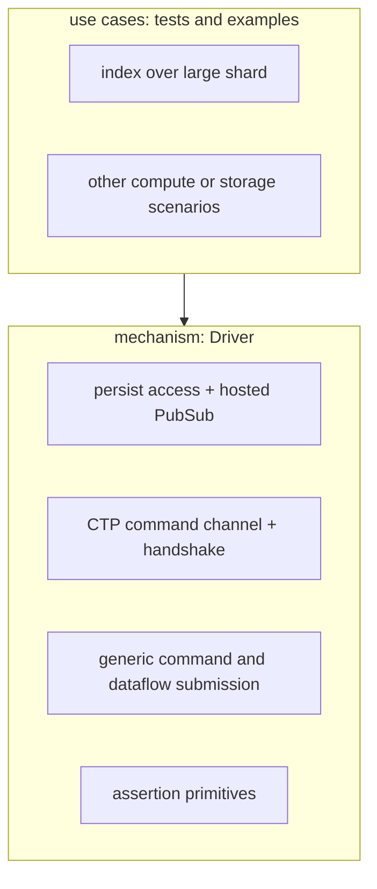
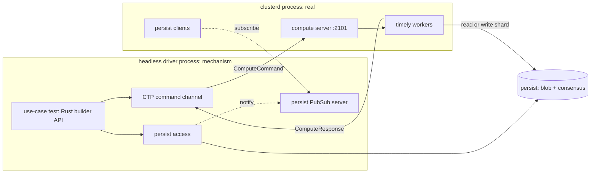

# Headless clusterd test driver

## Summary

This document designs a headless test driver for `clusterd`.
The driver is a generic alternate frontend that replaces `environmentd`'s controller for scripted compute and storage tests.
It hosts the persist infrastructure, drives the cluster command and response protocol over the wire, accesses persist directly, and asserts on responses.
The design separates two layers.
The mechanism is the generic headless frontend and stays free of any particular workload.
A use case is a test written on top of the mechanism, such as building an index over a large shard, and lives outside the core.

## Motivation

`environmentd` couples the cluster protocol to the full SQL and catalog stack, which makes targeted compute and storage experiments slow to set up and hard to control.
A test that wants to drive a specific dataflow against specific shard contents must currently go through SQL, the catalog, the optimizer, and the controller's timestamp and read-hold machinery.
A headless driver removes that coupling by speaking the cluster protocol directly, so a test controls the exact persist state, the exact commands the replica receives, and the exact timestamps.
This gives a faithful exercise of the real worker process and protocol while keeping the test deterministic and scriptable.
The same crate runs both as a `cargo test` for a fast local loop and as an `mzcompose` workflow against a real `clusterd`.

## Layering

The central constraint is that the mechanism is generic and the use cases are not.
The mechanism knows how to host persist, connect to a replica, send any command, read or write any shard, and observe responses.
It does not know about index building, data sizes, or timestamp distributions.
A use case composes those primitives into a workload and its assertions.
This keeps the mechanism reusable for compute and storage tests that have nothing to do with the motivating index scenario.

## Goals

### Mechanism

* Host the persist PubSub server, as `environmentd` does, so the replica's persist clients receive push notifications.
* Provide a persist client for direct shard access: open shards, write batches, read snapshots, downgrade `since`, observe `upper`.
* Connect to a real `clusterd` over the compute Cluster Transport Protocol (CTP) and replicate the controller handshake.
* Send arbitrary `ComputeCommand`s, including hand-assembled `CreateDataflow`s, and optionally `StorageCommand`s.
* Demultiplex responses: track per-id frontiers, route peek responses, surface status.
* Provide assertion primitives: wait for a frontier to advance within a timeout, peek an index, read a shard snapshot, and count rows.
* Run as a `cargo test` and as an `mzcompose` workflow.

### Use cases (out of the mechanism)

* Produce data by either of two strategies, selected per test:
  * write synthetic rows directly to a persist shard via the persist write API, or
  * submit a dataflow whose sink writes to a persist shard, producing data through the cluster itself.
* The motivating scenario: create a shard of a chosen size, at a single timestamp or spread across many, build an index, and measure or assert.

## Non-goals

* The SQL layer, catalog, optimizer, and timestamp oracle.
* The txn-wal system.
  Direct persist writes target the data shard with `txns_shard = None`.
* Baking any specific workload, data size, or timestamp distribution into the mechanism.
* Optimizer-quality plan generation.
  Dataflows are assembled by the caller or by small shared helpers, not by lowering SQL.
* Automatic controller behavior.
  The driver does not issue `Schedule`, `AllowCompaction`, or read-hold management on its own.
  The test drives every side-effecting command explicitly, which is what makes side effects controllable.

## Architecture

The driver and `clusterd` share a persist blob store and consensus, configured in `mzcompose` via CockroachDB and an object store.
The driver hosts the persist PubSub server so the replica's persist clients receive low-latency notifications, matching the `environmentd` deployment.
A use case drives the flow: it writes or arranges persist state through the mechanism, submits commands, and asserts on responses.

## Mechanism

The mechanism lives in a new crate, `src/clusterd-test-driver`, exposing a library with the `Driver` API and a thin binary for `mzcompose` workflows.

### Persist access and PubSub host

* The driver starts the persist PubSub gRPC server, the same server `environmentd` hosts, and configures both the replica and its own client with that URL.
* It exposes a persist client for generic shard access, not a workload-specific writer.
* Primitives: open a writer or reader for a shard given a schema, append a batch at a chosen `[lower, upper)`, read a snapshot at a timestamp, downgrade `since`, and inspect `upper`.
* Schema choices, encodings, and the contents of batches are caller concerns.

### CTP command channel

* It uses `transport::Client<ComputeCommand, ComputeResponse>` directly, because `ReplicaClient` and `SequentialHydration` are `pub(super)` and unavailable to an external crate.
* It replicates the controller handshake: `Hello { nonce }`, then `CreateInstance(InstanceConfig)`, then `InitializationComplete`.
* The protocol version is `BUILDINFO.semver_version()`.
* A background receive loop demultiplexes responses.
  `Frontiers` updates a per-id output-frontier watch.
  `PeekResponse` is routed to a pending peek by `uuid`.
  `Status` is surfaced for diagnostics.
* The storage CTP channel is structurally the same and is added when a use case needs it; the compute channel is the first cut.

### Command and dataflow submission

* The mechanism submits any `ComputeCommand` the caller constructs, including `CreateDataflow`, `Schedule`, `AllowCompaction`, `Peek`, and `CancelPeek`.
* Dataflow assembly goes through `DataflowBuilder` rather than a single opinionated constructor (see below).

### Dataflow construction: `DataflowBuilder`

The first cut shipped a single `index_dataflow(source_id, index_id, shard, location, desc, key_cols, as_of, upper)` function.
That function bakes in five choices a test should control independently: the number of storage inputs, the shape of the computation, the number and kind of exports, the temporal bounds, and the identifiers.
The reusable part is none of those; it is the *mechanism*, which is the MIR-to-LIR lowering, the `RenderPlan::try_from` conversion, the `CollectionMetadata` attachment, and the `SqlRelationType`-versus-`ReprRelationType` bookkeeping.
`DataflowBuilder` owns exactly that mechanism and exposes the five axes as verbs.

* `new(name)` starts an empty builder holding a MIR `DataflowDescription` and a side map from `GlobalId` to the persist metadata (`shard`, `location`, `desc`, `upper`) for each import.
* `import_persist(id, PersistSource { shard, location, desc, upper })` registers a storage collection: it calls `import_source` on the MIR description and records the metadata for the augment step.
  It returns a typed input handle whose `get()` produces the correctly typed `global_get` node, so the test never constructs a `ReprRelationType` by hand.
* `build(id, expr)` inserts a MIR object to compute, wrapping the caller's `MirRelationExpr` via `OptimizedMirRelationExpr::declare_optimized`.
  A pure index over a source skips this verb, since `export_index` arranges its `on_id` directly.
* `export_index(index_id, on_id, key_cols)` exports an index, deriving the `on_type` from the referenced object rather than taking it as an argument.
* `as_of(t)` and `until(t)` set the temporal bounds.
* `finish()` runs the lowering and augment and returns the `DataflowDescription<RenderPlan, CollectionMetadata>` the protocol expects.

The contract is deliberately narrow: the caller supplies MIR, and the builder lowers it faithfully and attaches persist wiring.
Optimization, including fusion, predicate pushdown, and join-implementation selection, stays the caller's responsibility, which matches the original `index_dataflow` behavior of lowering hand-built minimal MIR without optimizing.
This keeps the dependency surface minimal, with no dependency on `mz-transform`.
The one shape that does not lower from raw MIR is a `Join`, whose `implementation` defaults to `Unimplemented` and is rejected by the LIR lowering; supporting joins later adds an opt-in `optimize()` verb that runs the `JoinImplementation` transform, paid for only by the tests that need it.

With this boundary, `index_dataflow` becomes thin sugar: import one persist source, set `as_of`, export one index, and finish.

### Assertion primitives

* `expect_frontier(id, target).within(timeout)` waits until the tracked output frontier for an id reaches a target, and fails otherwise.
* `peek(id, ts)` sends `Peek` targeting `PeekTarget::Index { id }` and collects the `PeekResponse`.
* `peek_count` is a convenience over `peek`.
* `snapshot(shard, ts)` reads a shard directly through the persist client for cross-checking.

## Use cases

Use cases are tests and examples built on the mechanism, kept out of the core crate's library surface.

### Data production strategies

* Direct persist write.
  The test opens a writer with `open_writer::<SourceData, (), Timestamp, StorageDiff>`, passing the `RelationDesc` as the key schema and `UnitSchema` as the value schema, then appends batches of `(SourceData(Ok(row)), (), ts, +1)` with `txns_shard = None`.
* Dataflow that writes to persist.
  The test submits a `CreateDataflow` whose sink export writes to a persist shard, producing data through the cluster itself rather than out-of-band.

### Motivating scenario: index over a large shard

* Produce a shard of a chosen size, for example roughly 10 GB, using a production strategy above.
* Choose a timestamp distribution: all rows at one timestamp, or rows spread across a timestamp range with one append per step.
* Build an index by submitting a `CreateDataflow` that imports the shard and applies an `ArrangeBy` on the index key, exporting an `index_export` of `IndexDesc { on_id, key }`, then `Schedule`.
* Set `as_of` to the chosen read timestamp, within `[since, upper)`, and `until` above it.
* Wait for the index frontier to advance, then peek and assert the row count.
* Measure timing or memory, or attach a profiler to the `clusterd` process.

### Further scenarios

* Hydration with deep history.
  Produce a shard with `since` held back and many distinct timestamps up to `upper`, then build a dataflow with `as_of` at `since`.
  Hydration must replay the full history rather than a single snapshot, which stresses the catch-up path and exposes its cost.
* Multi-dataflow plans.
  Submit several `CreateDataflow`s, or a single plan spanning multiple dataflows, against the same replica.
  This is expected to fail today; the value is that the mechanism can express it, so the failure is reproducible and documented rather than only reachable through SQL.
* Controlling side effects.
  Drive the side-effecting commands the controller normally issues automatically, on the test's own schedule: when `Schedule` fires, when and how far `AllowCompaction` advances `since`, and when `UpdateConfiguration` changes parameters.
  This lets a test hold a frontier, delay compaction, or reconfigure mid-flight to observe the replica's response deterministically.

These scenarios, and the motivating one above, are implemented as JSON command scripts under `test/clusterd-test-driver/scripts/` (`index.jsonl`, `deep_history.jsonl`, `side_effects.jsonl`, `multi_dataflow.jsonl`) and run by the driver's script reader, not as compiled Rust scenarios.
The scripting layer below is the mechanism they share.

### RenderPlan assembly for the index (resolved)

* Hand-building a `RenderPlan` from outside `mz-compute-types` is impossible: `LirId` has a private constructor and `LetFreePlan`'s `nodes`/`root`/`topological_order` fields are private.
  The "hand-build" option in the original design is therefore not available to an external crate.
* The implementation uses the lowering pipeline `environmentd` itself uses.
  It builds a `DataflowDescription<OptimizedMirRelationExpr, ()>` via `import_source` + `export_index`, lowers it with `Plan::finalize_dataflow`, then converts each object with `RenderPlan::try_from` and attaches `CollectionMetadata` to the source import.
  `LirId`s and topological order come from production code, not hand-rolling.
* This was verified end to end: the `mzcompose` workflow built the index over a persist shard, the index hydrated, and a peek returned the expected row count.

## mzcompose integration

A composition runs CockroachDB for consensus, an object store for blob, a real `clusterd`, and the driver binary as a workflow.

* `clusterd` is configured with the compute controller listen address on `:2101` and the driver's PubSub URL.
* The driver binary connects to `:2101`, hosts PubSub, runs a JSON command script, and exits non-zero on assertion failure.
* The composition directory is mounted at `/workdir` (the convention `testdrive` uses), so the scripts under `scripts/` are readable in the container; each run is pointed at one via `DRIVER_SCRIPT`.
* Without `environmentd`, the driver is the sole PubSub host, so the replica's persist notifications flow through it.

## Testing

* The driver never spawns `clusterd`; `mzcompose` brings up the full stack (CockroachDB, an object store, `clusterd`, and the driver image) and is the faithful end-to-end path that CI runs.
  `workflow_default` runs every scenario script in turn, restarting `clusterd` between them for a clean compute state: `index.jsonl`, `deep_history.jsonl`, and `side_effects.jsonl` assert via `expect_count` and fail the run on mismatch; `multi_dataflow.jsonl` reproduces a current limitation and exits 0 by design (its awaits set `allow_timeout`).
* Crate-level `cargo test` covers the infra-free units (direct persist write round-trip via `mem://`, spread-timestamp write, response demux merge, dataflow structure).
  The end-to-end integration test (`tests/index_smoke.rs`) skips unless `CLUSTERD_COMPUTE_ADDR` is set, so `cargo test` stays green without a running stack.

## Local runs and profiling

`bin/pyactivate test/clusterd-test-driver/run-local.py` runs the whole thing on the host without docker images.
It reuses or starts a CockroachDB container for consensus, uses a `file://` blob directory, builds and launches a local `clusterd`, and runs the `headless-driver` against it.
Because every process is on localhost, one PubSub address (`127.0.0.1:6879`) and one persist location serve both the driver and `clusterd`, so none of the container-networking caveats apply.
It is a Python script so it can reuse Materialize's mzcompose helpers; in particular it builds the timely config via the same `timely_config` and `DEFAULT_*_EXERT_PROPORTIONALITY` constants as the `Clusterd` service, so the arrangement merge effort stays in sync with CI defaults. Configuration is via environment variables (`SCRIPT`, `WRAPPER`, `PROFILE`, …).

`SCRIPT` selects the JSON command script to run (default `scripts/index.jsonl`), passed to the driver via `DRIVER_SCRIPT`. Run duration is governed by the row counts in the script; for a heavier profiling run, point `SCRIPT` at a script with larger `count`s.

To profile `clusterd` (heaptrack, perf, samply), set `WRAPPER` to a command the runner prepends to the `clusterd` invocation, e.g. `WRAPPER="heaptrack" bin/pyactivate test/clusterd-test-driver/run-local.py` or `WRAPPER="perf record -g --" …`.
On exit the script terminates the inner `clusterd` rather than the wrapper, so the profiler observes its child exit and flushes its output before exiting on its own.
For `heaptrack` the script builds `clusterd` with `--no-default-features`, since the default `mz-alloc-default` feature uses jemalloc, which bypasses the system allocator heaptrack hooks; force this for other tools with `CLUSTERD_NO_DEFAULT_FEATURES=1`.
For full manual control instead, launch `clusterd` yourself using the command the script prints under "clusterd command:", then run with `RUN_CLUSTERD=0` so the script only drives the already-running `clusterd`.
The script builds with the `optimized` cargo profile by default (release-like but with debug symbols), so the numbers are representative; override with `PROFILE=dev` for a quicker unoptimized build.

## Interoperability notes

* **Protocol version.** The CTP handshake checks the client version against the replica's.
  The driver uses `mz_persist_client::BUILD_INFO` (a release-versioned crate, synced by `bin/bump-version`) rather than its own crate version, which is `0.0.0` and would fail the check.
* **Peek stash.** The replica stashes large peek results in persist by default (above a 10 KB threshold).
  The driver disables `enable_compute_peek_response_stash` via `UpdateConfiguration` during the handshake so peeks return their rows inline; a use case wanting stashed results would read them back from persist.

## Risks

* The `RenderPlan` risk is resolved: the lowering pipeline is used and verified end to end (see above).
* The persist data-shard schema and `SourceData` encoding must match exactly what a compute persist-import expects, or decoding fails at read time.
  This risk is confined to the direct-write use case; the dataflow-write strategy produces correctly encoded data by construction.
* Bypassing txn-wal means a directly written shard has no transactional coordination, which is acceptable for synthetic single-writer tests but must not be presented as production-faithful storage behavior.

## Future work

### Scripting via JSON

Encoding interactions in Rust is the first step, but the goal is something easier to iterate on than recompiling a test.
The natural script format is JSON, authored directly rather than through a Python or fluent client, because an agent can write the JSON form of a query plan and MIR already derives a JSON serialization.
This removes the layer a conventional DSL would need: there is no curated relational or scalar sub-language to maintain, since the serde tags of `MirRelationExpr`, `MirScalarExpr`, and the function enums are themselves the vocabulary, read straight from the source.

The driver becomes a persistent command reader instead of a one-shot `SCENARIO` binary: it reads JSON-line commands, executes them against `clusterd`, and streams responses back, reusing the existing response pump for the return path.
The command set is the serialized `Driver` and `DataflowBuilder` surface.
Orchestration commands are coarse and map almost directly: `write`, `define`, `schedule`, `allow_compaction`, `await_frontier`, and `peek`.
A `define` command carries the builder's inputs, namely the imports with their persist metadata, the objects as MIR expressions, the index exports as an `on_id` plus key, and the temporal bounds.
Authoring happens at the MIR level, so the impossible-to-hand-build `RenderPlan` is produced by the lowering exactly as today, and the dual relation-type footgun stays inside the builder.

One caveat is load bearing.
`Row` derives its serde over a packed byte buffer, so a `Literal` or `Constant` serializes the internal datum encoding as an opaque byte array, which is not hand-authorable.
The fix is surgical: the `define` schema accepts native MIR serde everywhere except at literal payloads, where it takes a friendly datum form (for example `{"Int64": 5}`) plus a `ColumnType` and packs it to a `Row` server-side via a `RowPacker`, reusing an existing datum parser if one exists.
Everything else stays native serde, so the function-variant explosion never reaches the schema.

The build order is incremental and each step stands alone.
First, `DataflowBuilder` as the semantic core, with `index_dataflow` refactored onto it.
Second, the persistent command-reader driver.
Third, the full-MIR `define` schema with the literal shim.
Joins and the opt-in `optimize()` verb remain the single open decision, deferred to the step that needs them.

Steps one and two are implemented, and the literal shim from step three is built early because schema and row authoring need it.
The driver is now solely a script reader (the `script` module): it reads JSON-line commands from the file named by `DRIVER_SCRIPT` (or stdin), executes each against `clusterd`, and writes one JSON response per line, returning non-zero if any command failed.
The four original Rust scenarios are fully replaced by scripts; nothing scenario-specific remains in the binary.
The orchestration verbs (`write_single_ts`, `write_spread`, `write_rows`, `schedule`, `allow_compaction`, `await_frontier`, `peek_count`, `expect_count`) map directly to `Driver` calls; shards are named by a string alias allocated on first use, and object ids are raw `u64`s.
`expect_count` asserts a peek's row count (failing the run on mismatch) — the scripted form of a scenario's count assertion — while `await_frontier` takes an `allow_timeout` flag so a reproduction like `multi_dataflow` can report a non-hydrating dataflow without failing the run.
Synthetic writes take a `start` offset so successive batches use disjoint id ranges that accumulate rather than consolidate, which the `index` tick phase relies on.

A script declares relations with `define_schema { name, columns: [{name, type, nullable}] }`, building a `RelationDesc` stored under a name; the other commands reference it by `schema` (defaulting to the built-in `(bigint, text)` sample relation).
The type vocabulary is intentionally small — `int16`/`int32`/`int64`, `bool`, `string`, `bytes`, with SQL aliases — and extends alongside the matching `Cell` cases.
Rows come two ways against that schema: `write_single_ts`/`write_spread` take a `count` and generate synthetic rows by type, while `write_rows` takes explicit JSON values.
The explicit path runs through `cell_from_json`, the `JSON value + ColumnType -> Datum` mapping that is exactly the literal shim the full-MIR `define` will reuse for literal constants — so the load-bearing `Row` caveat above is already resolved.

`define_index` covers the common single-index shape via the `index_dataflow` sugar; generalizing it to a full-MIR `define` (reusing `cell_from_json` for literals) is the remaining step three.
Sample scripts live at `test/clusterd-test-driver/scripts/` (`index.jsonl`, `custom_schema.jsonl`), run locally with `SCENARIO=script SCRIPT=<path> bin/pyactivate test/clusterd-test-driver/run-local.py`.
