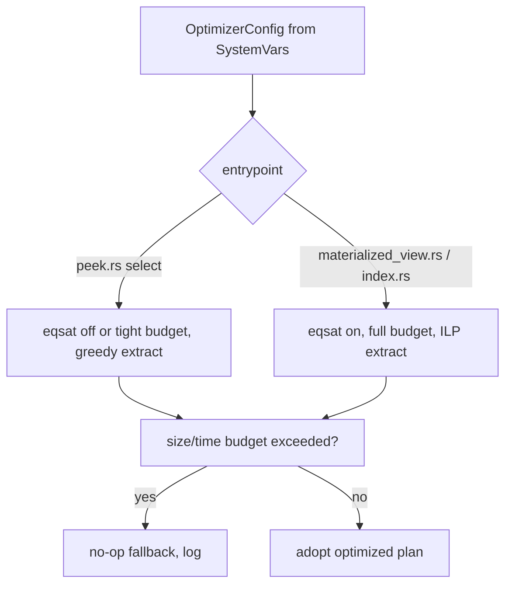

# Integrating the eqsat optimizer into Materialize: knobs and placement

## Purpose

This note specifies how the equality-saturation MIR optimizer (`mz_transform::eqsat`) should be exposed to operators and users, and where it should run.
It separates two question: which knobs control the pass, and how those knobs should differ between ad-hoc selects and maintained objects.
The driving asymmetry is that saturation cost is paid per optimization while its payoff (arrangement sharing, delta joins) is realized per execution, so a query optimized once and run once values the pass differently than a dataflow optimized once and run forever.
The recommendation is to keep the global enable flags, add an explicit budget knob, and gate the pass per optimizer entrypoint so selects fall back cheaply while maintained objects get the full pass.

## Current state

The pass is controlled today by three boolean feature flags plus two hardcoded caps.

* `enable_eqsat_optimizer` gates the logical pass `EqSatTransform` (`src/transform/src/lib.rs:823`), defaulted on.
* `enable_eqsat_physical_optimizer` gates the physical placement `PhysicalEqSatTransform` (`src/transform/src/lib.rs:898`), defaulted on.
* `enable_eqsat_ilp_extraction` selects the ILP extractor over greedy (`src/transform/src/eqsat/transform.rs:166`).
* `MAX_PLAN_SIZE = 200` (`src/transform/src/eqsat/transform.rs:26`) skips the whole pass for plans above 200 nodes, in both the logical and physical pass, with a no-op fallback.
* A second cap `total_nodes > 600` (`src/transform/src/eqsat/extract.rs:143`) defers the ILP to greedy for large e-graphs.

Two properties of the current wiring matter for integration.
First, there is no time budget anywhere: both caps are node counts, and a plan just under the cap can still saturate for seconds, so the only protection against a slow optimization is the static size limit.
Second, the flags are global.
`OptimizerConfig` is built once `From<&SystemVars>` (`src/adapter/src/optimize.rs:302`) and handed to every per-object optimizer unchanged, so a select and a materialized view see identical eqsat settings today.

## The select versus maintained asymmetry

Materialize already splits optimization by object type into separate entrypoints under `src/adapter/src/optimize/`: `peek.rs` for selects, `materialized_view.rs` and `index.rs` for maintained objects, plus `subscribe.rs`, `view.rs`, and `copy_to.rs`.
A select is latency-sensitive and its plan is used once, so every millisecond of saturation is pure tail latency with little to amortize against, and the eqsat wins that depend on shared maintained arrangements do not apply to a one-shot peek.
A maintained object is optimized once at creation and then runs indefinitely, so a multi-second saturation that finds a better arrangement-sharing or delta-join plan pays for itself over the lifetime of the dataflow.
This asymmetry argues for different defaults per entrypoint rather than one global setting, which is exactly the seam the per-object optimizer modules provide.

## Proposed knobs

The integration adds one budget knob and one placement decision on top of the existing flags.

* Keep the three enable flags as the master switches; they remain the way to disable the pass entirely for an incident.
* Replace the hardcoded `MAX_PLAN_SIZE` with a feature flag `eqsat_max_plan_size` so the size cap is tunable without a deploy, defaulting to 200.
* Add a wall-clock budget `eqsat_time_budget_ms` checked inside saturation, with a no-op fallback on expiry, so a pathological plan under the size cap cannot stall optimization.
  This is the one genuinely missing safety knob; the size caps approximate it but do not bound time directly.
* Gate the pass per entrypoint: default the logical and physical passes on for `materialized_view.rs` and `index.rs`, and default them off (or to a tight budget with greedy extraction) for `peek.rs`.

## How a user sets them

The existing three-layer override mechanism (`src/adapter/src/optimize.rs:245-269`) already gives the surface; the new flags plug into the same layers.

* System-wide: each flag is a `SystemVar`, set via LaunchDarkly or `ALTER SYSTEM SET`, mirroring how `enable_eqsat_optimizer` is bound today (`src/sql/src/session/vars/definitions.rs:2091`).
* Per cluster: `CLUSTER ... FEATURES(...)` lets an operator turn the pass on for one cluster's maintained objects while leaving it off elsewhere, which suits a staged rollout.
* Per query: `EXPLAIN ... WITH(...)` lets an engineer inspect the plan difference for a single statement before changing any default, the intended debugging path.

The per-entrypoint default is not a user knob; it is a code decision in the optimizer modules, overridable by the three layers above.
An operator who wants eqsat on selects sets the flag at the system or cluster layer, which overrides the conservative peek default.

## Recommended integration sequence

1. Promote `MAX_PLAN_SIZE` to the `eqsat_max_plan_size` flag, no behavior change at the default.
2. Add `eqsat_time_budget_ms` and the in-saturation deadline check with no-op fallback.
3. Branch the per-entrypoint defaults: full pass for maintained objects, off-or-tight for peeks, all overridable.
4. Measure peek latency with the pass on versus off on a representative select workload before flipping the peek default, since that is the only path where the pass is pure overhead.

## Open questions for the user

* Should selects run eqsat at all by default, or only when explicitly opted in per cluster?
  The conservative default is off for peeks; the aggressive default is on with a tight budget.
* Is a wall-clock budget acceptable given that optimization must be deterministic for plan stability and EXPLAIN reproducibility?
  A time budget makes the chosen plan depend on machine speed, so the deterministic alternative is to keep node-count caps only and accept that a plan under the cap can be slow.
* Should the ILP node cap (600) also become a flag, or stay an internal constant?
