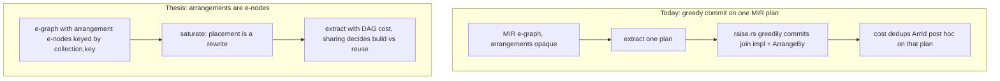

# Arrangements as e-nodes: modeling the build-vs-reuse distinction in the e-graph

> **Status: PROBED, closed negative. See `20260704_eqsat_research_verdict.md`.**
> The de-risking probes ran. The arrangement-sharing thesis does not yield a
> capability win: rendering already builds each `(collection, key)` arrangement
> once and shares it (so redundant `ArrangeBy` nodes are not physical waste), the
> sharing that matters is CSE-driven (portable, outside the e-graph), and
> arrangement keys are predicate-determined by the equi-join equivalence, so join
> order cannot manufacture a share CSE misses. The mechanism works but buys no
> plan-cost win over production. Retained as the record of the probe.
>
> **Original status (superseded):** design thesis and de-risking plan, naming the
> one physical capability axis the E0-E5 arc had not yet tested.

## Thesis in one line

Model arrangements as first-class e-nodes keyed by `(collection, key)`, so that
build-once and reuse-free become a structural consequence of sharing in the
extracted DAG, decided during extraction rather than by a greedy post-extraction
commit.

## The problem: `ArrangeBy` is overloaded, and the distinction is not in MIR

MIR's `ArrangeBy` carries one meaning in its syntax and two meanings in its
cost.
It can mean "build an arrangement here", which costs memory and time.
It can also mean "assert or reuse an arrangement that already exists", which is
free.
MIR carries no bit to distinguish the two.
The distinction is decided later, during LIR lowering and dataflow rendering,
where an arrangement for a given `(collection, key)` is built once and every
further consumer shares it.

The consequence is that an `ArrangeBy`'s cost is not a property of the node.
It is a property of whether that `(collection, key)` arrangement already exists
somewhere reachable in the committed dataflow.
This is why arrangement availability is context-dependent, and why any
cost accounting that runs on MIR is structurally handicapped: the fact it needs
to price the node does not exist at the layer it runs on.
The same shape appears elsewhere in the cost-model taxonomy under
"per-arrangement MFP reuse", where the optimum is not representable in MIR and
the note there defers the fix to LIR.

## Where this bites today

The eqsat native join commit chooses join order and delta-vs-differential
greedily, on one extracted MIR plan, in the `raise.rs` `Rel::Join` arm.
It computes an availability picture with `per_input_available`
(`raise.rs:530`) and commits delta only when delta needs no new arrangements
(strict `delta_new == 0`, or eager `delta_new <= diff_new`,
`raise.rs:260-265`), otherwise falls through to `commit_differential`
(`raise.rs:288`).

`per_input_available` reads the raised `MirRelationExpr`, not e-classes, and
credits an input as arranged when its leading error-free Map/Filter/Project run
reaches one of:

* a `Get` whose `GlobalId` has an index in the passed-in `available` map,
* an `ArrangeBy` (its keys, plus the underlying `Get`'s index),
* a `Reduce` (its `group_key`),
* an `IndexedFilter` join.

Everything else hits the `_ => {}` arm and is credited with nothing.
`TopK` is in that everything-else set.
So a single-key star join whose input is a `TopK::MonotonicTop1`, as in
`test/sqllogictest/outer_join.slt`, sees `delta_new > 0` and commits
differential where JoinImplementation would have committed delta.

This is a local, per-input heuristic run once on a fixed plan.
It cannot see that two separate joins in the plan would share one arrangement,
because sharing is a global property and this check is per input.

## What the cost model already does right

The memory cost is DAG-aware, not tree-aware.
`collect_memory_into` (`cost.rs:444`) threads a `seen: BTreeSet<ArrId>` and
inserts each arrangement identity at most once, so a shared arrangement is
charged once (`cost.rs:434-437`, `452`, `490`, `518`, `537`).
`ArrId` (`cost.rs:80`) identifies an arrangement by its `Rel` subtree, or by a
`JoinInput { input, key }`, or by an `ArrangeBy`.

So the charge-shared-once machinery exists, and it is already keyed by
arrangement identity.
What it lacks is not the accounting.
What it lacks is that arrangement placement is not an extraction choice: the
`ArrangeBy` nodes are committed greedily upstream, and the cost model only
dedups whatever identities happen to appear in the one plan it is handed.
Sharing is recognized after the fact, on a fixed plan, rather than being a
degree of freedom the extractor optimizes over.

## The thesis, stated fully

Introduce arrangement e-nodes into the relational language, keyed by the pair of
the collection e-class and the arrangement key.
An arrangement node names "the collection `C` arranged by key `K`".
Because e-graphs hash-cons, two requests for the same `(C, K)` become the same
e-node automatically.
Under a DAG-aware cost that charges each distinct arrangement identity once (the
`ArrId` dedup already does this), the first materialization of `(C, K)` carries
the memory and time cost and every further consumer is free.
Build-once and reuse-free then fall out of sharing in the extracted DAG.
They are not a separate iterative analysis, they are a property of the term.

If this holds, it is not parity with JoinImplementation's iterative
`build_availability`.
It is a more principled mechanism, because sharing is structural in the term
rather than reconstructed by a fixpoint.
That is where a genuine capability win over JoinImplementation would live.

## Why this is the one untested capability axis

The E0-E5 showcase arc tested logical and rewrite capability, asking whether
eqsat finds rewrites the directional loop misses.
Every such win came back portable, which is why the effort reframed as
consolidation rather than capability.
The arc did not test physical arrangement-sharing or global-cost capability.
The one physical-cost case that was studied, the VOJ cross join in the
cost-model findings, concluded that the cost model is the bottleneck and that a
delta-aware cost is the lever, and then the shipped native commit chose greedy
parity rather than superiority.
So physical-arrangement superiority is neither proven nor refuted.
It was deprioritized under the consolidation framing, not tested and rejected.
The arrangement-as-e-node thesis says where that superiority would come from and
why MIR cannot reach it, which turns a vibe into a testable claim.

## The hard parts

**The layer question is the crux.**
The distinguishing fact, build versus assert, is LIR-native.
To model it in the e-graph, the e-graph's language must carry a distinction that
today lives only below MIR.
There are three candidate layers, and choosing among them is the central design
decision:

* Enrich MIR into a physical-MIR that gives `ArrangeBy` a build-or-assert bit
  and adds arrangement e-nodes. This keeps the MIR-to-MIR shape but blurs the
  MIR/LIR boundary.
* Reposition the e-graph as the MIR-to-LIR lowering, where the distinction is
  already native. This is the largest move and inherits LIR's constraints.
* Introduce a new physical algebra between MIR and LIR that is the e-graph's
  language, designed for saturation.

**Today's LIR may not model generic join plans.**
LIR represents committed plans, one implementation each, `LinearJoinPlan` and
`DeltaPathPlan`.
It is an adequate extraction target because extraction picks one plan.
It is not obviously an adequate saturation language, because holding alternative
join plans as equal-cost members of a class is not what it was built for.
This is the first constraint on the layer choice, and it argues against the
naive "just extract to LIR" reading.

**Availability is still context-dependent, and the e-node model must actually
dissolve that.**
The claim is that hash-consing plus DAG cost dissolves the context-dependence,
because sharing becomes structural.
This must be validated, not assumed.
If placement decisions interact (lifting an arrangement for one consumer changes
what is free for another in a way that is not captured by identity alone), the
context-dependence returns and would need a context-sensitive e-class analysis,
which is what the colored layer provides.
The colored layer is therefore the likely home for any residual availability
analysis that identity-based sharing does not capture.

**Termination and cost blowup.**
Making placement a rewrite adds arrangement nodes and their permutations to the
search.
Any such extension must carry a compile-time and blowup gate, tied to the E0
optimize-time budget, exactly as the variadic-set rules do.

## Relationship to current work

This is independent of SP2b.
SP2b unifies the scalar rewrite rules into the DSL and is a rewrite-layer
consolidation.
This thesis is a physical-layer capability question about arrangement modeling.
They do not share machinery and should not be interleaved.

This is also independent of the near-term availability-parity fix.
That fix credits `TopK` (and any other missing arranged outputs) in
`per_input_available` so the greedy commit matches JoinImplementation.
That fix is worth doing regardless, because it makes the greedy commit correct
under the current architecture.
The thesis here is a different and larger bet that would eventually subsume the
greedy commit entirely, not patch it.

## De-risking plan

Confirm the pieces in order, cheapest first, and stop at the first refutation.

1. Instrument `per_input_available` on the `outer_join.slt` query and confirm the
   `TopK` input is the uncredited arrangement, so the concrete miss is understood
   before any modeling work.
2. Confirm the `ArrId` dedup in `collect_memory_into` charges a shared
   arrangement once across two consumers in a synthetic two-join plan, so the
   charge-shared-once premise is verified for arrangements and not only assumed
   from the code shape.
3. On paper, model one shared-arrangement case as arrangement e-nodes and check
   that hash-consing collapses the two requests and the DAG cost charges one
   materialization. If it does not, the thesis is wrong here and stops.
4. Decide the layer. Prototype the arrangement e-node in a physical-MIR spike,
   the least invasive option, and measure whether placement-as-rewrite stays
   within the E0 optimize-time budget.
5. Only then consider whether the larger LIR-positioning or new-algebra options
   buy anything the physical-MIR spike could not.

## Open questions

* Does the `ArrId` dedup already treat two structurally identical arrangements
  under different parents as one identity, and is that always sound for sharing?
* Can placement be expressed as a confluent rewrite, or does it need the same
  cost-tiebreak canonicalization that other physical choices needed?
* Is `TopK` the only uncredited arranged output, or are there others behind the
  `_ => {}` arm that the availability-parity fix must also cover?
* Does modeling arrangements interact with the colored layer's existing
  soundness guard around distinct spellings?
