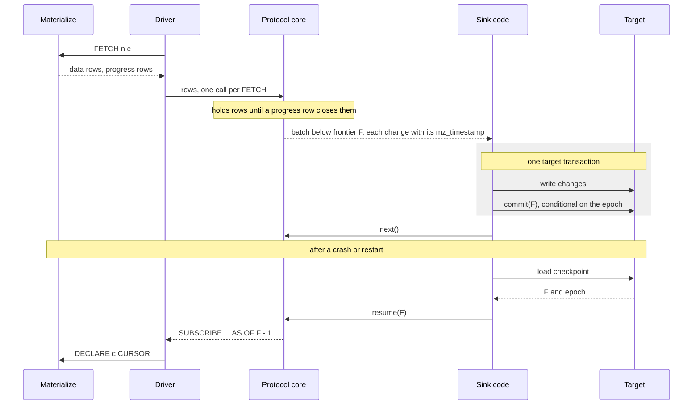

# Materialize SDK: correct `SUBSCRIBE` consumption and a framework for custom sinks

- Associated:
  - Product requirements: [Sink SDK PRD](https://app.notion.com/p/materialize/Sink-SDK-3dd13f48d37b8024985ce70b1d96e9cd) (PRD-85). Overlapping proposal: PRD-87 (`mzq`).
  - Tracking: Linear project "Subscribe SDK" (DEX).
  - [#38468](https://github.com/MaterializeInc/materialize/pull/38468): durable subscribe design, the server primitive this SDK moves onto later.
  - [#37483](https://github.com/MaterializeInc/materialize/pull/37483), [#37517](https://github.com/MaterializeInc/materialize/pull/37517): prototype Rust and Python packages.
  - [#37905](https://github.com/MaterializeInc/materialize/pull/37905): server-side bound on subscribe output buffering.
  - SQL-528: `SUBSCRIBE ... WITH (PROGRESS) ... UP TO` emits no final progress row.
  - [database-issues#5182](https://github.com/MaterializeInc/database-issues/issues/5182): dataflow errors poison a subscribe.
  - [Durable subscriptions pattern](https://materialize.com/docs/transform-data/patterns/durable-subscriptions/): the manual protocol this SDK packages.
  - Prior art: [mz-redis-sync](https://github.com/MaterializeIncLabs/mz-redis-sync), [novu-materialize-integration](https://github.com/MaterializeIncLabs/novu-materialize-integration), [mz-turbopuffer-sink](https://github.com/MaterializeInc/mz-turbopuffer-sink).

## The Problem

Customers want Materialize results in systems we do not sink to natively:
caches, search indexes, their own Postgres, notification services, live UIs,
and agents. `SUBSCRIBE` is the primitive for all of them, and every team that
uses it re-derives the same protocol by hand. The use cases behind the product
requirements are representative:

- A cache that keeps a Valkey or Redis keyspace equal to a materialized view.
  It needs the initial snapshot and a fast, gap-free restart.
- A search index that keeps two turbopuffer namespaces equal to two views, at
  one consistent timestamp, exactly once. Today this runs through Kafka.
- A relational target that writes several views into an application's
  Postgres, transactionally across tables.

The protocol for consuming `SUBSCRIBE` durably is:

1. Subscribe `WITH (PROGRESS, SNAPSHOT = true)`.
2. Buffer updates until a progress message proves a timestamp is closed.
3. Apply the closed batch and persist its frontier atomically.
4. On restart, resume `WITH (PROGRESS, SNAPSHOT = false) AS OF frontier - 1`.
5. Keep history readable at the stored frontier, and fail loudly when it is not.

Each step has a failure mode that is invisible in testing. Every existing
implementation we could find gets a different one wrong:

| Codebase | Commit discipline | Resume | Idempotency | Retractions |
| --- | --- | --- | --- | --- |
| mz-redis-sync | Correct: data and frontier commit together at progress rows | Omits `SNAPSHOT` on resume, so every restart replays the full snapshot | Inherent (keyed writes) | Delegated to `ENVELOPE UPSERT`, but `key_violation` crashes the process and poisons restarts |
| novu-materialize-integration | Persists the timestamp of the first row of a batch, so a crash mid-batch loses the rest of that timestamp | Wall-clock guess of whether the checkpoint is still retained | Content-hash keys, which false-dedup identical payloads across time | Maps a retraction to a revoke, with two bugs |
| A work-queue subscriber in an internal project | No `PROGRESS`, so batch boundaries are a heuristic | Re-snapshots on every restart | Relies on the target being idempotent | Ignored |

None of them reconnects on failure, and none has tests. Our per-language client
docs teach a bare `DECLARE`/`FETCH` loop with no progress handling and no
resume. The durable-subscriptions pattern page is correct, but it is prose that
every user turns into code again.

The rest of this section describes the server behavior a correct consumer has
to account for. Each item was checked against the code.

### Resume arithmetic

With `SNAPSHOT = false`, an `AS OF t` emits times strictly greater than `t`
(`src/compute/src/sink/subscribe.rs:115-122`). A consumer that holds everything
below frontier `F` resumes with `AS OF F - 1`.

### Retention window

`RETAIN HISTORY` sets `since = upper - window`. After an environment outage or
upgrade the upper catches up and the window slides with it, so a one-hour
window can expire during a one-hour outage. A `REFRESH EVERY` view's upper
jumps to the next refresh, so a sink that is down across a refresh can lose
history however short the downtime. Retention belongs to the view's owner, and
any `ALTER` changes every sink's margin without telling it.

A connected subscribe holds its input readable up to what it has emitted. Only
a disconnect puts history at risk, and the consumer then resumes from its
committed frontier, which can trail what it received.

### Indexed targets

If the subscribed object has an index on the cluster the subscribe runs on, the
dataflow imports the index instead of the persist shard
(`src/adapter/src/optimize/dataflows.rs:326-343`,
`src/adapter/src/coord/indexes.rs:88-93`), and `AS OF` is checked against the
index's `since` (`src/adapter/src/coord/timestamp_selection.rs:277-297`). An
index's default window is one second (`src/adapter-types/src/compaction.rs:20`),
and the view's `RETAIN HISTORY` does not carry over to its indexes. So
`AS OF F - 1` fails on an indexed view, however long the view's retention. An
index on a different cluster does not count. Index-level `RETAIN HISTORY`
requires `enable_index_options`, which is off by default.

### Snapshot elision

`SUBSCRIBE <object>` with `SNAPSHOT = false` never reads the snapshot
(`src/transform/src/dataflow.rs:464-522`,
`src/persist-client/src/operators/shard_source.rs:438-448`). Any query form,
including `SELECT * FROM mv` or a projection and filter, reads the whole
snapshot at the `AS OF` before emitting anything. A non-materialized view is
inlined, so its inputs' snapshots are read too.

### Stream shape

Diff output is ordered by (time, row bytes) and consolidated
(`src/compute/src/sink/subscribe.rs:212-217`). Upsert and Debezium envelopes
order by (time, key, row). Retractions do not come first.
`WITHIN TIMESTAMP ORDER BY` changes the order but requires
`enable_within_timestamp_order_by_in_subscribe`, off by default.

Everything between two progress messages arrives together, so one batch spans
many timestamps. "At most one row per key" holds per timestamp, not per batch.

`UP TO` ends without a final progress row (SQL-528), so data after the last
progress row is never closed by the server.

### Buffering limits

When a subscribe's backlog in `environmentd` exceeds
`subscribe_max_buffered_bytes` (default 128 MiB), the subscribe is retired with
`SubscribeFellBehind`, SQLSTATE 53200 (#37905). A single result larger than
`max_result_size` also ends the subscription.

### Errors

| Condition | SQLSTATE | Message |
| --- | --- | --- |
| `AS OF` below the readable frontier | `22000` (`DATA_EXCEPTION`, shared) | "could not find a valid timestamp for the query" |
| Subscribed object or cluster dropped | `42704` | "relation 'x' was dropped" and similar |
| Client fell behind | `53200` | `SubscribeFellBehind` |
| Dataflow error | varies | the evaluation error, repeated on every retry |

The history-loss message has changed once already (#34712), which broke the
one client that matched its text. A dataflow error repeats until the data or
the view changes (database-issues#5182), so retrying cannot fix it.

## Success Criteria

"PRD" marks a requirement from the product requirements. "Design" marks one
this document adds.

| # | Requirement | Source |
| --- | --- | --- |
| R1 | Exactly-once state in the target, across restarts and crashes | PRD |
| R2 | Back off and retry while the target is unavailable | PRD |
| R3 | Dead-letter a batch after too many retries, and reject single rows the target cannot take | PRD |
| R4 | One consistent timestamp across several views | PRD |
| R5 | Transactional writes when the target supports them | PRD |
| R6 | Every change carries its `mz_timestamp` | PRD |
| R7 | Live streaming with no target (UIs, caches, agents) | Design |
| R8 | Bounded client memory, and no server-side buffering on behalf of a slow client | Design |
| R9 | A small set of typed errors, with history loss stopping the consumer by default | Design |
| R10 | Several languages with identical behavior, checked by machines | Design |
| R11 | Sink authors can test without a live environment | Design |

A user following the happy path cannot commit an unclosed timestamp, cannot
get the `AS OF` arithmetic wrong, and cannot silently lose or duplicate updates
across a restart. The check is a sink that converges to `SELECT ... AS OF` its
committed frontier after being killed at random points.

## Out of Scope

- Rewriting subscribe internals. The server changes this program depends on are
  listed under "Materialize-side workstream".
- Exactly-once side effects. No client can make an HTTP call exactly once, so
  event targets get at-least-once delivery with idempotency keys.
- A general Materialize client. Drivers already run queries well. See "Naming".
- Scale-out of one subscription across parallel workers, which has no server
  support.
- Stateless workers (functions, lambdas). They need the server to own the
  resume point, which durable subscriptions (#38468) provide.
- Private-preview subscribe features (`ENVELOPE DEBEZIUM`,
  `WITHIN TIMESTAMP ORDER BY`), which are behind flags.

## Solution Proposal

The SDK will hold the subscribe protocol in one Rust library, the protocol core,
which performs no I/O and is compiled into a thin package per language. Each
package will use that language's own database driver for the connection and
will expose two modules: `subscribe` for live and durable consumption, and
`sink` for writing to targets. Every change will keep its `mz_timestamp`.
Durable consumption will store its checkpoint in the target, fenced by an epoch,
and will read one object plus an optional projection, filter, and envelope. The
first sink will be turbopuffer. The spec, conformance vectors, and an end-to-end
suite will live in this repository and run in the nightlies.

### Naming

This document proposes **Materialize SDK**, with `subscribe` and `sink` as its
first modules. This is the decision we most want reviewers to push on.

"Sink SDK" names the most visible use and excludes live UIs, cache warmers, and
agents that watch a view with no sink at all (R7). "Subscribe SDK" names the
primitive accurately, but the package will need things that are not
`SUBSCRIBE`: checking a view's retention margin, choosing a cluster, attaching
to a durable subscription, and later the WebSocket transport. "Materialize SDK"
gives those a home without renaming the package after the first publish, which
is expensive once users pin it. The risk is that the name reads as a general
client. The scope rules that out: drivers stay the way to run queries, and the
SDK only adds modules for things drivers get wrong.

Package names will be `materialize-sdk` on PyPI, `@materializeinc/sdk` on npm,
and `materialize-sdk` on crates.io.

### Architecture

```
   +---------------------------------------------------------------+
   |  sink:       targets (turbopuffer first), retry, dead-letter  |
   +---------------------------------------------------------------+
   |  subscribe:  durable consumption (checkpoints, fencing,       |
   |              history-loss policy) and live streams            |
   +---------------------------------------------------------------+
   |  transport, per language: the native driver                   |
   |  (psycopg, node-postgres, tokio-postgres), owns connections   |
   +---------------------------------------------------------------+
   |  protocol core, Rust, no I/O: decode, release engine,         |
   |  multi-view cut, tokens, statements, error classification     |
   +---------------------------------------------------------------+
```

The protocol core is a library, not a service. It runs inside the user's
process, compiled into whichever package they install, and never opens a
connection. The package's driver fetches rows from Materialize and passes them
to the protocol core in a function call. The protocol core returns decoded
changes, closed batches, resume tokens, SQL text, and typed errors. "Language
and generation strategy" explains the choice.

### Batches

A batch will hold every change below its frontier that was not in an earlier
batch, and nothing at or above it. Apart from the partial snapshot chunks
described under "Live streams", users will not be able to observe a
half-delivered timestamp.

Every change will keep its `mz_timestamp` (R6). Changes in a batch will be
ordered by timestamp and consolidated per timestamp, never across timestamps.
Consolidating across a batch drops the timestamps that targets need to stamp
rows, to order a delete before a re-insert of the same key, and to derive
idempotency keys that survive a resume. A helper will give the net change per
key across the batch for keyed targets that only want the final state.

Progress will be an exclusive frontier: everything below `F` is committed. The
`- 1` will exist in exactly one function in the protocol core.

Committing and fetching will be separate calls. `commit(frontier)` will run
inside the target's transaction and `next()` outside it. A combined call would
keep the target transaction open while the SDK waits for Materialize, which can
take seconds, or hours for a `REFRESH` view.



### Subscription scope

A durable subscription, one that checkpoints and resumes, will read one object
plus an optional projection, filter, and envelope. Arbitrary SQL will be
accepted only for live streams that never resume.

Resuming a general query rehydrates its whole dataflow and needs history on
every input of the query. Durable subscriptions (#38468) accept exactly this
narrower surface, so starting narrow makes the later move a transport change,
not an API break. Widening later is compatible, and narrowing is not.
Structured input also lets the SDK build the statement and place `ENVELOPE`
before `WITH` without parsing user SQL.

Projections and filters still read the snapshot on resume (see "Snapshot
elision"). The docs will recommend the plain object form for large views, and
the SDK will log the resume cost at startup.

The SDK will refuse an indexed object at startup. It will check whether the
subscribed object has an index on the subscribing cluster and fail with an error
that names the remedy: a dedicated subscribe cluster with no index on the object.

### Live streams

A background loop will fetch with `FETCH <n> c WITH (timeout = ...)` into a
bounded buffer, independent of the consumer's pace. If the consumer falls
behind, the client will fail with a typed error. Pausing the fetch loop instead
would push the backlog into `environmentd` until the server retires the
subscribe (R8).

The initial snapshot is one timestamp and can exceed client memory. It will
arrive as chunks marked partial, with the token on the closing chunk. The sink
module's generations (see "Sink module") give atomic snapshot visibility to
targets that need it.

A frontier advance with no data will yield an empty batch with a fresh token,
so checkpoints keep moving through quiet hours.

`UP TO` will be supported. Until SQL-528 is fixed, the SDK will release
everything below `UP TO` when a bounded stream ends without error, so no closed
data is lost.

### Checkpoints and fencing

A checkpoint store will have `load(name)` and `commit(name, epoch, frontier)`.
The target is the recommended store, because writing data and checkpoint in
one transaction gives exactly-once state (R1, R5). A Materialize-table store and
a local file store will ship for targets with no transaction.

Each worker start will take the next epoch. A commit will be conditional on the
stored epoch not being newer, and a stale worker will get a typed `Fenced`
error. Without the fence, a second instance of one sink would overwrite the
first one's progress.

Every durable subscription will require an explicit name, which is its
checkpoint identity. A default derived from a class name would give two
deployments one checkpoint, and they would fence each other. Rows from several
views will be tagged by view name, because tagging by list position remaps rows
when the list is reordered.

The checkpoint will also record a fingerprint of the subscription: the object,
projection, filter, envelope, and output column types. A resume whose
fingerprint differs fails with `SchemaMismatch` instead of mixing rows of two
shapes in one target.

### Delivery guarantees

The user will choose one of two guarantees. Under `transactional`, the target
commits the batch and the checkpoint together, so state is exactly once. Under
`at_least_once`, effects run first and the checkpoint commits after. The SDK
will provide an idempotency key built from the subscription name,
`mz_timestamp`, the key columns, and an ordinal within the timestamp. An ordinal
within the batch would break deduplication, because batch boundaries move
across a resume.

When delivery fails, a policy will return `retry` (back off and deliver the
same batch again), `skip` (the user has dead-lettered it, advance past it), or
`stall` (exit, and an operator resumes from the checkpoint). The default will be
exponential backoff from 1s to 1m for ten attempts, then `stall` (R2, R3).
`skip` moves the checkpoint past real data, so it will never be a default and
will always be logged. A target that cannot represent a single row will call
`reject(row, error)`. The row will be logged with its key and timestamp, and the
rest of the batch will commit.

`commit_interval` will be the minimum time between commits, for targets that
prefer fewer, larger writes.

### History loss and retention margin

When the checkpoint is older than the readable frontier, a policy will decide:
`stall` (the default), `resnapshot` (rebuild the target, for keyed targets that
can reconcile), or `skip_to_now` (accept a gap, for notification-style
consumers). Detection will use the error type (R9).

At startup and periodically, the SDK will compare the checkpoint to the
object's readable frontier and report the margin as a metric, with a warning
below a configured threshold. Retention has to outlast an operator's response
to a stall, not only the retry budget.

Blue/green deploys recreate the subscribed object, which ends the stream with a
dropped-object error. A `refollow` policy will re-resolve the name and resume if
the new object's fingerprint and retained history allow it, and otherwise fall
back to the history-loss policy.

On a signal, the SDK will finish the in-flight batch, commit, close the cursor,
and disconnect.

### Multi-view consistency

A multi-view subscription (R4) will release changes only up to the minimum
frontier across its members, so every released moment is a consistent cut
across all views. A Materialize timestamp is a global commit order, so one
stored frontier names that cut. Log-position systems cannot do this from
positions alone, which is worth saying in the product story.

The SDK will pick one `AS OF` and pass it to every member, and startup will fail
if any member cannot be read there. Members that pick their own `AS OF` values
hand out one view's snapshot before another's exists.

The lag budget will count only changes the joint frontier holds back. A member's
own snapshot waiting for its own progress row will not count.

Each view's `RETAIN HISTORY` counts from its own upper, so a lagging view can
leave the stored cut readable on one view and compacted on another. The
retention-margin check will run per member.

A multi-view subscription will hold one connection per member. Any member error
will end all members, and recovery will resume every member at the stored cut.

### Typed errors

| Error | Detected by | Default |
| --- | --- | --- |
| `Transient` | no SQLSTATE (connection-level) | reconnect and resume |
| `FellBehind` | `53200` | resume from the last commit, report a metric |
| `HistoryLost` | `22000` plus the timestamp-selection message | history-loss policy |
| `ObjectDropped` | `42704` | `refollow` policy, else stop |
| `StreamPoisoned` | dataflow error | stop |
| `SchemaMismatch` | checkpoint fingerprint | history-loss policy |
| `Fenced` | checkpoint commit | stop |
| `IndexedTarget` | startup check | stop with remedy |
| `Fatal` | anything else (auth, TLS, SQL) | stop |

The `HistoryLost` text match will be the only message matching in the SDK, kept
in one function and gated on server version until a dedicated SQLSTATE exists.

### Connections

Each subscription will hold one session for its whole life. Transaction-mode
poolers break `DECLARE`/`FETCH`, and a session-mode pool gains nothing because
the session is never returned. The SDK will take a connection factory as well as
a URL, so rotating credentials (OIDC tokens, app passwords) can plug in. A
multi-view subscription of N views will use N connections.

The WebSocket SQL API supports `SUBSCRIBE` but is experimental. It is the
natural transport for browsers and functions. The protocol core is
transport-agnostic, so adding it later will not change the model.

### Sink module

A sink author will implement three things: open the target, write a batch and
call `commit(frontier)` inside the target's transaction, and optionally
`reject` rows the target cannot take. The SDK will drive everything else:
snapshot, resume, retry, fencing, and the history-loss policy.

Keyed-state targets (caches, search indexes, tables) will read the upsert
envelope. When they re-snapshot, the SDK will write the snapshot under a new
generation and, at the end, call a sweep that removes keys from older
generations. That removes keys deleted while the sink was offline, which a plain
re-snapshot leaves behind. A target that needs the snapshot to appear at once
will make the new generation visible only at the sweep.

Event targets (webhooks, queues, notifications) will read the diff envelope
under `at_least_once`, with the idempotency key above. They will declare what a
retraction means: ignore it, or call a compensating function. Compensation will
use a correlation key built from the row's key columns only, because the
idempotency key includes the timestamp and so differs between an insert and its
later retraction.

### turbopuffer sink

The first sink will keep turbopuffer namespaces equal to views. It answers the
search-index use case and will run against our internal context graph, which
has no Kafka, so the existing Kafka-based sink does not fit there.

turbopuffer's documentation states that one write request to one namespace is
applied atomically and is durable on return, and that there are no transactions
across namespaces. Conditional writes compare the stored document with the
incoming one (`$ref_new`) and silently skip rows whose condition fails. An
upsert to a document that does not exist is applied unconditionally, and a
delete's condition sees `null` for every `$ref_new` attribute.

Conditional writes alone therefore do not make a replay safe. If a later batch
deleted a key, replaying an earlier upsert of that key finds no document and
recreates it. The sink will instead write a checkpoint document into each
namespace in the same request as that namespace's data, so a namespace's data
and its frontier commit atomically. On restart the sink will resume from the
lowest checkpoint across its namespaces, and for each namespace it will drop
every change below that namespace's own checkpoint. Batch boundaries move across
a resume, so the comparison is per change, using its `mz_timestamp`. That gives
each namespace exactly-once state.

Upserts will also be conditional on the stored `mz_timestamp` being older, and
deletes on it being below the batch frontier, passed as a literal because a
delete's `$ref_new` values are `null`. A stale worker that slips past fencing
writes the same rows at the same timestamps as the live worker, because
Materialize output is deterministic per timestamp. The condition only has to
stop its older rows from replacing newer ones.

Writes across namespaces are not atomic. Between the writes of one cut, a reader
can see one namespace at the new cut and another at the old one. Each namespace
converges to every cut, and a reader that needs a joint view filters on
`mz_timestamp`. The sink's docs will state this.

Embedding cost will follow the existing sink's transform model: a transform
declares the columns it reads, and runs only for rows where those columns
changed.

### Durable subscriptions

Durable subscriptions (#38468) give the server a per-consumer hold advanced by
`ACKNOWLEDGE`, with a wall-clock deadline in place of a window measured from the
upper. When they land, the SDK will attach with
`SUBSCRIBE USING DURABLE SUBSCRIPTION` in place of `AS OF F - 1`, and will
acknowledge only after the target commit. The target-side checkpoint will stay
mandatory, because the server alone is at-least-once. `START AT` will migrate an
existing sink at its stored frontier without a gap. A consumer that resumes by
filtering on its own position will check the opening progress message, because
recreating the subscription can move the start past that position without an
error. Stateless workers become possible at that point, because the server owns
the resume point.

Durable subscriptions will remove the retention sizing problem, the
`AS OF F - 1` arithmetic on the default path, and most of the retention-margin
check, because the server holds history for each consumer. The rest of the
protocol core stays. Rows still need decoding and release at progress, the
server can resend data the target already committed, a multi-view cut still
spans several subscriptions, and fencing, retry, and dead-lettering do not
depend on where history lives.

### Security

The SDK will hold Materialize credentials and target credentials in the user's
process. The docs will recommend a dedicated role with `SELECT` on the object and
`USAGE` on the subscribe cluster, and nothing else. The protocol core performs no
network I/O, so it adds no network surface of its own.

A resume token is not secret but is also not authenticated. Anyone who can
write the checkpoint can move the frontier forward and make the sink skip data,
so the checkpoint needs the same write protection as the target data it sits
next to. A browser transport would put credentials in the browser, which is one
reason it waits for a stable WebSocket API with scoped credentials.

## Language and generation strategy

The options, from least to most shared:

- A. Hand-written per language, one spec, shared test vectors.
- B. Types, errors, tokens, and statement templates generated from one schema,
  with the engine hand-written per language.
- C. One protocol core in Rust with no I/O, compiled into each language package.
- D. SDKs generated by an agent from a precise spec, accepted when they pass the
  conformance suite.

The SDK will use C. The prototype Rust package is already most of this protocol
core: its decoder, release engine, multi-view engine, tokens, statements, and
classification are pure, and only the transport does I/O. A gives every
language its own copy of the state machine, and the prototypes already show the
drift that follows (text values in Rust, native values in Python). B removes
drift in the generated parts but leaves the engine, where the bugs found so far
live, duplicated. D puts all the weight on the spec and suite, which C needs
anyway.

The usual objection to a shared core is that it owns TLS, authentication, and
async integration in every runtime. A protocol core with no I/O owns none of
that. Each language keeps its native driver for the connection, which users
already trust, and feeds rows into the protocol core.

The protocol core will ship in two builds. Python will bind the native build
through PyO3 and maturin (abi3 wheels), and the Rust package will use the
library directly. Node will use the WebAssembly build, the same one browsers and
edge runtimes use, so the Node package is one artifact for every platform. This
repository already publishes Rust compiled to WebAssembly to npm
(`ci/deploy/npm.py`). WebAssembly runs slower than native code, which matters
little here because rows will cross into the protocol core in one call per
`FETCH`, not one call per row. The protocol core will not panic across the
boundary, and its errors will become each language's native exceptions. It will
not depend on Materialize workspace crates, so it builds and versions on its
own.

The WebAssembly build also covers later languages without native builds. Go can
run it through wazero and JVM languages through Chicory, both written in their
own language, which avoids cgo and JNI. If that proves too slow, the language is
hand-written against the conformance vectors.

The costs are a Python wheel per platform, Rust stack traces in Python bug
reports, and a source build that needs a Rust toolchain wherever no wheel
exists. If native packaging proves too costly, the fallback is B plus A.

### Generated and hand-written parts

The binding glue and each package's type definitions will be generated from the
protocol core. wasm-bindgen emits TypeScript declarations, and the Python package
will ship type stubs generated from the PyO3 module. Type mapping lives in the
protocol core: it decodes each Materialize type into one documented value
model, and each binding converts that model to the language's native types
(for example `numeric` to `Decimal` in Python), with the conversions covered by
the vectors. Each package will hand-write only the transport over its driver,
the idiomatic API surface (iterators in Python, async iterators in Node), and
the sink modules.

### Repository layout and releases

```
misc/materialize-sdk/
  core/          protocol core (Rust library)
  spec/          behavior spec, versioned
  conformance/   vectors, shared by every package
  python/        package: PyO3 binding, psycopg transport, sinks
  node/          package: WebAssembly build, node-postgres transport, sinks
  rust/          package: protocol core directly, tokio-postgres transport, sinks
  test/          mzcompose end-to-end suite, run in the nightlies
```

The SDK will start in its own Cargo workspace under `misc/`, outside the
Materialize workspace, so its dependencies and lockfile stay independent. A
spec change and its fallout in every package then land in one PR, and server
changes run against every package in the nightlies.

Releases will work the way `dbt-materialize` releases do. A pull request bumps
the SDK version and merges to `main`. The deploy pipeline, which runs on every
`main` build (`ci/deploy/pipeline.template.yml`), publishes each package whose
version is not yet on its registry, as `ci/deploy/pypi.py` does today. Releases
need no tags. Python wheels will be built on the existing Linux x86-64, Linux
ARM, and macOS ARM Buildkite queues, with macOS x86-64 cross-compiled on the ARM
agent. Windows has no queue, so it gets the source package, which needs a Rust
toolchain to install. Publishing to crates.io needs a new deploy step. Go is the
exception to the pattern: Go modules are versioned by git tags, so a Go package
needs tags in this repository or a repository of its own.

Each release will publish every package at the same version, built from the
same protocol core, so a version number means the same behavior in every
language. Versions follow semantic versioning. Resume tokens and checkpoints
carry a format version, so a checkpoint written by an older release resumes
after an upgrade or fails with a clear error. The nightlies define which
Materialize versions a release supports.

## Testing

The conformance suite is the contract, whatever the generation strategy.

1. Conformance vectors: language-agnostic JSON files, each with inputs and
   expected outputs for one function (decode, batch release, multi-view release,
   token encoding, statement SQL, and error classification from SQLSTATE and
   message). The protocol core will run them natively, and each package will run
   them through its binding.
2. End-to-end suite: the spec, vectors, and end-to-end suite will live in this
   repository and run in the nightly pipeline against `main` through mzcompose.
   One runner will drive a thin adapter per language over stdin and stdout.
   Scenarios: snapshot then stream, resume after a kill, resume after a server
   restart, history loss, dropped object, poisoned dataflow, fell-behind,
   indexed object refused, bounded stream. A server change that breaks the SDK,
   such as a changed error message, then breaks a nightly before it reaches a
   customer.
3. Convergence test: kill a sink at random points (mid-batch, between write and
   commit, mid-snapshot), restart, repeat, then compare the target with
   `SELECT ... AS OF` the committed frontier, for both guarantees.
4. Fencing test: two workers share one checkpoint, the stale one is refused, and
   the target stays consistent.
5. User test kit: the recorded-stream player from the vectors will ship to users,
   so sink authors can test their targets offline (R11).

Keeping the vectors and the end-to-end suite next to the server is what lets a
server change fail a test before it fails a customer. See "Repository layout and
releases".

## Observability

The SDK will report frontier lag (wall clock minus frontier), retention margin,
batches and changes applied, retries, dead-letters, reconnects, checkpoint age,
and buffer occupancy, the same in every language. They will be exposed as
callbacks in the libraries and as OpenTelemetry metrics and spans for connect,
snapshot, apply, and commit.

## Materialize-side workstream

Where correct behavior needs the database, the database change is part of this
program.

1. Dedicated SQLSTATEs for history loss and for dataflow errors.
2. SQL-528: a final progress row clamped to `UP TO`.
3. Durable subscriptions (#38468).
4. Snapshot elision for a projection and filter without a temporal predicate,
   which #38468 also needs.
5. Non-poisoning subscribe errors (database-issues#5182).
6. Docs that cross-link the durable-subscriptions pattern from every client page
   now, and lead with the SDK once it ships.
7. A stable WebSocket `SUBSCRIBE`, the gate for browser and function transports.

The server-side buffering bound (#37905) has landed and needs no further work.

## Minimal Viable Prototype

The prototype will be the protocol core extracted from the Rust package, one
language package, and the turbopuffer sink running against the internal context
graph. It tests the three riskiest claims:

- that a protocol core with no I/O binds into a language package without
  packaging or performance problems,
- that per-namespace checkpoint documents give each turbopuffer namespace
  exactly-once state under random kills,
- that the nightly end-to-end suite catches server changes that break the SDK.

## Delivery plan

October: the prototype above, with the end-to-end suite in the nightlies. Exit
criteria are a passing convergence test, a passing fencing test, and every typed
error reproduced in the end-to-end suite.

November and December: the second language, durable subscriptions as they land,
and a Redis or Postgres reference sink chosen by demand.

GA requires dedicated SQLSTATEs released, the client docs rewritten on the SDK,
and both languages passing the same vectors and end-to-end suite.

## Future work

The name leaves room for modules beyond `subscribe` and `sink`. The candidates
are places where an ordinary driver behaves unexpectedly against Materialize:

- After its first query, a read transaction is confined to one time domain, and
  reading objects outside it fails with SQLSTATE 25000
  (`RelationOutsideTimeDomain` in `src/adapter/src/error.rs`). Drivers and ORMs
  that open a transaction for every query hit this. A module could default reads
  to autocommit and offer one call that reads several views at one timestamp.
- A transaction becomes write-only after its first write, and some DDL refuses to
  run inside a transaction. Typed errors could name the fix for each.
- A cursor cannot outlive its transaction (`WITH HOLD` is rejected in
  `src/sql-parser/src/parser.rs`), and only `FETCH ... WITH (timeout = ...)` lets a
  cursor loop idle. `subscribe` already handles both.
- Drivers return types they do not know, such as `mz_timestamp`, as text. The
  protocol core's value model could serve plain queries too.

Each module adds maintenance: it tracks server behavior, needs vectors and
end-to-end scenarios, and multiplies across languages. A module will be added
only when support or field evidence shows users hitting the problem, and only
with nightly end-to-end coverage. Plain query execution, DDL management (owned
by mz-deploy and the Terraform provider), and ORM integration stay out of scope.

## Alternatives

### The product strawman

The product requirements include a strawman API with a `Cursor` and a
`SinkConnector`. Its boundary between tracking progress and delivering data is
right, and this design keeps it. The parts that change:

| Strawman | This design | Why |
| --- | --- | --- |
| `update()` commits and fetches | `commit()` inside the transaction, `next()` outside | A target transaction must not wait on Materialize |
| `queries` as SQL strings, split at `ENVELOPE` | Object, projection, filter, envelope as structured input | Resume cost, durable subscription compatibility, no string splicing |
| One cursor per query | One `AS OF` for all members, release at the minimum frontier | Independent cursors produce torn cuts |
| Rows stamped with the batch frontier | Every change keeps its `mz_timestamp` | Batches span timestamps |
| Retractions come first | Order by timestamp, net per key within a timestamp | Not true by default |
| `name` defaults to the class name, rows keyed by list index | Required names, rows tagged by view name | Shared checkpoints fence each other, reordering remaps rows |
| `commit_interval` in progress messages | Minimum time between commits | Progress cadence is not a user-facing unit |
| Snapshot handling left to the user | Partial snapshot chunks, generation sweep, history-loss policy | Large snapshots and orphan keys are the common failure |
| Conditional turbopuffer writes for replay safety | A checkpoint document per namespace, written with the data | A replayed upsert recreates a key a later batch deleted |

### Build only on durable subscriptions

The semantics would be simplest, but nothing ships until the server does, and
the target-side checkpoint is needed either way. The narrow subscription scope
lets the SDK ship now and move over without an API break.

### Native server-side sinks per target

This is the best eventual experience for a few high-volume targets. Each target
becomes a server feature with its own release train, and the long tail of
targets never ends. The SDK serves the long tail and shows which targets deserve
native sinks.

### Kafka and the connector ecosystem

This is right for organizations already running Kafka Connect. It makes everyone
else run Kafka to reach a cache, adds a hop, and loses the mapping between target
state and a Materialize timestamp unless the connector is consistency-aware.

### A native message queue

`mzq` (PRD-87) overlaps with this design. If it lands, it is another transport
under the same protocol core and sink API, not a replacement for them. This
needs settling with the product owner.

### Docs only

The pattern doc already exists. The table in "The Problem" shows what docs alone
produce.

## Open questions

1. Name: Materialize SDK, Subscribe SDK, or Sink SDK? The reasoning is under
   "Naming". This is cheap to change now and expensive after the first publish.
2. October language: Python matches the existing turbopuffer sink, the
   turbopuffer client, and the field team's tooling. Rust is where the protocol
   core already lives. Recommendation: the Rust protocol core plus the Python
   package.
3. Generation strategy: is a protocol core with bindings acceptable for
   packaging and support, or do we start with B plus A?
4. turbopuffer checkpoint document: the per-namespace checkpoint document is what
   makes replay safe, but every query must exclude it. The alternative is
   tombstones in place of deletes, swept later, with the checkpoint in a
   Materialize table. Which cost is easier for users?
5. Retention margin check: can a sink role read the catalog state it needs (the
   object's readable frontier and the cluster's indexes) without extra grants?
6. `mzq`: a transport under this SDK, or a separate path?
7. Object swaps: how often do blue/green deploys swap a subscribed view, and is
   `refollow` the behavior deploy tooling wants?
8. Egress cost: data leaves through `environmentd`. What does a sink with a large
   snapshot cost a customer, and does the docs story need a sizing page?
9. Stateless workers before durable subscriptions: is there demand that cannot
   wait?
10. Repository home: should the packages stay under `misc/` in this repository
    for good, or move to their own repository once the spec settles, keeping
    the protocol core, vectors, and end-to-end suite here?
11. Future-work modules: are any of them worth their maintenance cost, and what
    evidence should trigger one?
