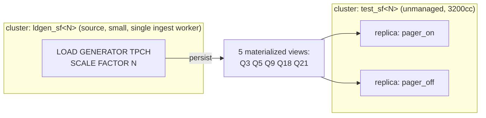

# Pager hydration experiment

## Goal

Measure the impact of the column-paged batcher's spill-to-disk mechanism (the
"pager") on hydration time, as a function of workload size.
The experiment holds the replica size fixed and sweeps the TPCH scale factor, so
the only thing that changes within a size is how much arrangement data the
workload produces, and therefore how much the pager pushes to disk.

The question we answer: for a given workload, how much slower (or faster) does a
replica hydrate on the paged batcher with spill versus the legacy batcher it
replaces?

## Background

The pager is the spill path of the column-paged merge batcher, active at arrange
sites when building arrangements.
Three replica-scoped dynamic configuration parameters govern it.

* `enable_column_paged_batcher`: use the paged batcher at all.
  When `false`, arrange sites use the legacy columnation path.
* `enable_column_paged_batcher_spill`: allow the pager to evict chunks to the
  disk backend under memory pressure.
  This is the on/off switch for the pager.
  With it `false`, the pager keeps every chunk resident regardless of budget, so
  no disk is used.
* `column_paged_batcher_lz4`: compress spilled chunks.

Two related parameters are global, not replica-scoped, so they cannot differ
between two replicas of one cluster.
`column_paged_batcher_budget_fraction` sets the resident-byte budget before
spill (code default 5% of the replica memory limit, floored at 128 MiB; set to
0.01 environment-wide on the target region).
`column_paged_batcher_swap_pageout` eagerly evicts compressed swap-backend
chunks (code default off; set on environment-wide on the target region).
They only affect the `pager_on` replica, because `pager_off` runs the legacy
batcher and does not use the pager at all.

Hydration is measured by wall-clock, using `mz_internal.mz_hydration_statuses`,
which exposes `object_id`, `replica_id`, and `hydrated`.
The script records a start timestamp, then polls this view for the five named
materialized views on both replicas, recording the timestamp at which each
`(object_id, replica_id)` pair first flips to `hydrated=true`.
The hydration time for a pair is that timestamp minus the start.

The internally-measured `mz_internal.mz_compute_hydration_times.time_ns` is not
usable here. Verified against the target region, that collection populates
`time_ns` for index (arrangement) exports but leaves it NULL for materialized
view exports, which never appear in the underlying per-worker hydration-time log.
Since the workload is materialized views, wall-clock is the only reliable metric.
This gap is tracked as CLU-175
(https://linear.app/materializeinc/issue/CLU-175); it does not block the
experiment.

Wall-clock resolution equals the poll interval (about 2 seconds). Hydration at
the scale factors of interest runs for many seconds to minutes, so the interval
is negligible against the measured durations.

## Flag mapping

The two replicas differ only by name.
The name-to-flag mapping is applied out of band, outside this script, through
per-replica scoped system-parameter overrides.
The script only creates replicas with the fixed names `pager_on` and
`pager_off`.

The mechanism, verified against the staging region via
`mz_internal.mz_replica_system_parameters`, is minimal.
The environment-wide `ALTER SYSTEM` settings already have the pager fully on:
`enable_column_paged_batcher=on`, `enable_column_paged_batcher_spill=on`,
`column_paged_batcher_lz4=on`, `column_paged_batcher_swap_pageout=on`, and
`column_paged_batcher_budget_fraction=0.01`.
`pager_on` carries no scoped override, so it inherits that fully-on state.
`pager_off` carries exactly one scoped override, `enable_column_paged_batcher=false`,
which routes it to the legacy columnation batcher and makes the spill and lz4
settings moot.

| Effective state | `pager_on` | `pager_off` |
| --- | --- | --- |
| `enable_column_paged_batcher` | on (inherited) | `false` (override) |
| `enable_column_paged_batcher_spill` | on (inherited) | moot |
| `column_paged_batcher_lz4` | on (inherited) | moot |
| `column_paged_batcher_swap_pageout` | on (inherited) | moot |
| `column_paged_batcher_budget_fraction` | 0.01 (inherited) | moot |

`pager_on` therefore runs the paged batcher with spill, lz4 compression, and
eager swap pageout, at a 1% resident budget.
`pager_off` runs the legacy columnation batcher (`Col2ValBatcher` /
`RowRowBuilder`), the path that shipped before the paged batcher.
This makes `pager_off` the real-world production alternative rather than a
never-spilling paged batcher.

The measured delta therefore covers the whole package: adopting the paged
batcher and enabling spill.
It does not separate the batcher-adoption cost from the disk-I/O cost.
That separation is possible by adding a third replica that runs the paged
batcher with spill disabled, but it is out of scope here.

## Topology

The experiment runs against a single Materialize region in staging, driven over
pgwire.

The load generator runs on its own cluster, one per scale factor, separate from
the cluster under test.
Ingestion CPU never contaminates hydration timing.

The test cluster is unmanaged with two explicitly-named replicas.
Unmanaged is required because managed replicas are identical, but the experiment
needs two replicas that differ by name so the out-of-band mapping applies
different pager flags.
Both replicas are the same size, `3200cc` (62 vCPU, 470 GiB memory, 705 GiB
disk, single process), so the only difference between them is the flag.
The `r8gd_cpu-62` size the design first targeted exists in the size map but is
not among this region's `allowed_cluster_replica_sizes`; `3200cc` matches its
shape (62 vCPU, ~470 GiB memory, ~705 GiB disk) and is permitted.
`M.1-8xlarge` (equivalently `xlarge`) is a whole-machine size with the same
62 vCPU and 470 GiB memory but 2820 GiB disk, four times the disk of `3200cc`.
It is the preferred fixed size because the larger disk removes any spill
capacity confound at high scale factors, with no compute difference.
This size is the `--size` default; the flag exists to retarget the experiment,
and whatever value it holds applies to both replicas identically.

Both replicas sit in the same cluster, so they hydrate the exact same
materialized-view dataflows, are directly comparable, and each reports its own
`time_ns`.

## Load generator lifecycle

The TPCH load generator is single-threaded, so it is slow and must not be
restarted needlessly.

* Each scale factor gets its own dedicated `ldgen_sf<N>` cluster and TPCH source,
  created and ingested exactly once.
* The source cluster is small; extra workers do not speed up single-threaded
  ingest.
* On start, if `ldgen_sf<N>` exists and its snapshot frontier has advanced
  (ingest complete), the script skips straight to the compute phase.
  It never restarts an already-ingested source.
* Teardown never touches sources by default.
  Only the test cluster's replicas churn between trials.
  A `--purge` flag is required to remove sources.

## Workload

Five join- and aggregation-heavy TPCH queries are materialized: Q3, Q5, Q9, Q18,
Q21.
These build the largest internal arrangements, which is where the pager is
exercised.
Lighter TPCH queries are excluded because they dilute the pager signal.

The source is created with
`CREATE SOURCE ... FROM LOAD GENERATOR TPCH (SCALE FACTOR N) FOR ALL TABLES`,
which exposes the eight TPCH tables (`lineitem`, `orders`, `customer`,
`supplier`, `nation`, `region`, `part`, `partsupp`) with the standard TPCH
column names (`l_*`, `o_*`, and so on).

The materialized-view bodies are the `SELECT` statements for Q03, Q05, Q09, Q18,
and Q21 in `test/sqllogictest/tpch_create_materialized_view.slt`.
That file models the same table and column names the load generator exposes, so
the query bodies are reused verbatim, wrapped in
`CREATE MATERIALIZED VIEW q<NN> IN CLUSTER test_sf<N> AS <body>`.
The script reads the bodies from that file rather than transcribing them, so the
queries stay in sync with the canonical definitions.

## Measured scenarios

Two hydration paths are measured per scale factor, because materialized views
behave differently on first build versus replica restart.

**Initial hydration.**
With both replicas up and idle, create the five materialized views.
Each replica builds arrangements from the source snapshot, and one replica wins
the persist write.
This measures compute-from-scratch plus writing output.

**Re-hydration.**
The materialized views are already populated.
For each flavor, drop the cluster replica then re-create it, which is the
replication-factor 0 to 1 transition.
The fresh replica rebuilds all in-memory arrangements from persisted inputs.
This measures arrangement rebuild without recomputing output.

Only replicas churn during re-hydration trials.
The materialized views are never dropped, so their dataflows stay live and a
re-added replica genuinely receives the dataflow and rehydrates it, producing a
real `time_ns`.

## Sweep and matrix

* Scale factors: 1, 10, 30, 100.
* Objects: five materialized views (Q3, Q5, Q9, Q18, Q21).
* Flavors: `pager_on`, `pager_off`.
* Scenarios: initial and re-hydration, three trials each.
  An initial trial drops and re-creates all five views (with both replicas up),
  then measures.
  A re-hydration trial drops and re-creates both replicas (views left in place),
  then measures.

A full measurement cell is identified by
`scale_factor x scenario x flavor x query x trial`.
Per scale factor this is 2 scenarios x 3 trials x 2 flavors x 5 queries = 60
`time_ns` values, and 240 across the four scale factors.
Both flavors are measured within the same trial, since the two replicas coexist.

With the environment-wide budget at 1% of memory (~4.7 GiB on the 470 GiB
`3200cc` size), `pager_on` should start spilling at a lower scale factor than
the 5% default would require.
The pager metrics (see Live monitoring) confirm per trial whether spill actually
occurred; if a scale factor shows no spill, the budget fraction can be lowered
further, which touches only `pager_on`.

## Measurement procedure

For one trial:

1. Record the start timestamp `t0` from `SELECT now()`.
2. Bring both replicas into the target state for the scenario (create views, or
   drop and re-create replicas).
3. Poll `mz_internal.mz_hydration_statuses`, filtered to the five named views on
   both replicas, about every 2 seconds. On each poll, for any
   `(object_id, replica_id)` pair newly `hydrated=true` and not yet recorded,
   capture `now()` as that pair's hydration completion time. Stop when all ten
   pairs are recorded or a timeout is hit.
4. Append one row per pair to the results CSV:
   `sf, scenario, flavor, query, trial, hydration_seconds`, where
   `hydration_seconds = completion - t0` and `query` is the stable view name.

The poll must filter to the five named views. `mz_hydration_statuses` lists every
dataflow-backed object on a replica, including system introspection arrangements,
so an unfiltered count reaches the target long before the views hydrate.
Results are keyed by the stable view name because `object_id` changes every time
a view is dropped and re-created, which happens on every initial-hydration
trial. Correlating by `object_id` across trials would break.

Both replicas coexist in the cluster and hydrate the same dataflows, so a single
trial measures both flavors at once.
All completion times are captured while the replicas are alive, before any
teardown.

## Live monitoring

The wall-clock hydration time answers how long, but not why.
While the experiment runs, resource metrics are read from Grafana (Prometheus)
to characterize each trial: memory utilization, user and system CPU time
(rtime and stime), CPU utilization, and disk throughput.

To correlate Grafana series with trials, the script records a window manifest in
addition to the results CSV.
Each trial emits one row: `sf, scenario, flavor, replica_id, started_at,
ended_at`, where the timestamps bracket the hydration window (replica or view
creation until all objects report hydrated).
`replica_id` is the catalog replica id, read from `mz_cluster_replicas`, used to
select the replica's series in Prometheus.

Metrics read per window:

* Memory: replica RSS and memory-limit utilization.
* CPU: user and system CPU seconds (rtime, stime) and CPU utilization.
* Disk: read and write throughput to the spill backend.
* Pager activity, from the process-wide pager metrics, which directly show
  whether and how much the `pager_on` replica spilled: `mz_column_pager_pageouts_total`,
  `mz_column_pager_paged_bytes_out_total`, `mz_column_pager_pageins_total`,
  `mz_column_pager_pagein_bytes_total`, `mz_column_pager_budget_remaining_bytes`,
  `mz_column_pager_budget_configured_bytes`.

The pager metrics are only nonzero on `pager_on`, since `pager_off` runs the
legacy batcher.
Their delta across a window confirms the spill volume that the hydration-time
delta is attributed to.

Monitoring is read-only and does not gate the experiment.
The script proceeds on the wall-clock signal; Grafana queries run alongside,
keyed by the window manifest, so metric collection can also happen after the run
over the recorded windows.

## Script

A single Python program drives the experiment over pgwire.

* Idempotent and resumable per scale factor.
  Existing ingested sources are detected and reused.
* Flags: `--scale-factors`, `--trials`, `--size`, `--keep` (skip teardown),
  `--purge` (also remove sources).
* Output: a CSV of raw `hydration_seconds` rows, a window-manifest CSV
  (`sf, scenario, flavor, replica_id, started_at, ended_at`) for Grafana
  correlation, and a printed summary table of median `hydration_seconds` per
  `scale_factor x scenario x flavor`.
* Designed to run overnight, since SF 100 initial hydration recomputes the views
  three times.

## Out of scope

* Sweeping replica disk_limit across size families.
  That confounds disk with cpu, memory, and worker count, since those scale
  together.
* Sweeping `column_paged_batcher_budget_fraction` as an independent axis.
  It is global and cannot differ between the two replicas in one cluster.
* Separating batcher-adoption cost from disk-I/O cost via a third
  spill-disabled paged-batcher replica.
  The two-replica design compares the paged batcher with spill against the
  legacy batcher as a single package.
* Eager swap pageout (`column_paged_batcher_swap_pageout`).
  Left at its default; a follow-on variant once the base spill effect is
  characterized. lz4 compression is in scope and enabled on `pager_on`.
