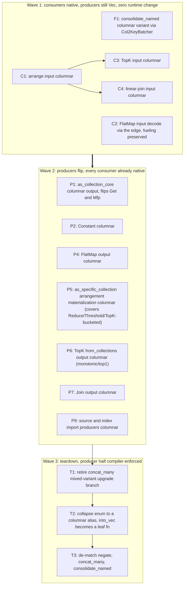

# Columnar dataflow edges: VecCollection to Columns migration

- Associated: [#36507](https://github.com/MaterializeInc/materialize/pull/36507)

This document is a plan, not an implementation.
It decomposes the migration of compute dataflow edges from row-based `VecCollection` to columnar `Column` batches into fine-grained changes with an explicit dependency DAG.
Each change is scoped to a single stacked pull request, executed in later sessions.

## The Problem

Compute renders dataflow edges between Plan nodes as row-based `VecCollection` updates.
Row-based edges force per-record handling at every consumer, and they block downstream work that wants to operate on columnar batches.
PR #36507 scaffolded `CollectionEdge<'scope, T>`, an enum with `Vec` and `Columnar` arms, and wired it as the carrier of `CollectionBundle.collection`.
Today no producer emits the columnar arm, so the columnar path is dead in production, and the migration from row-based to columnar edges has no plan.

The risk in migrating is complexity.
A naive migration maintains two parallel implementations per operator, or gates the change behind a per-operator progress flag, and either approach grows code complexity to unbounded levels over the course of a long migration.

## Success Criteria

* Every compute dataflow edge carries columnar `Column` batches.
* The `Vec` arm of `CollectionEdge` is deleted, and the enum collapses to a single columnar type.
* No internal consumer decodes an edge to rows, except for a small set of explicitly sanctioned decode points named in this document.
  `into_vec` otherwise survives only as a leaf helper for consumers that serialize rows anyway.
* The migration proceeds as a sequence of small, independently landable pull requests, each with a test gate.
* No single code path maintains both representations at once.
  There is no feature flag.
* No permanent performance regression, and no seam-heavy intermediate state on `main` (see the producer-flip invariant below).
  Transient upgrade seams are acceptable.

### Sanctioned decode points

Two internal consumers retain a `ColumnarToVec` decode for now, deferring the native rewrite to a fast-follow.
They do not serialize rows, so they are exceptions to the no-internal-decode criterion, not instances of it.
The prototype (see below) confirmed both are feasible to make native but not worth the cost or risk on the critical path.

* LetRec (node C7).
  `branch_when` is not the blocker, it is container-generic and type-checks on a columnar stream as-is.
  The blocker is the feedback machinery: `Variable::set` needs `ResultsIn`, `Collection::negate` needs `Negate`, and `leave_dynamic` mutates each record's time in place, all impl'd only for `Vec`.
  Going native means forking differential's `PointStamp` time arithmetic into our tree, a standing liability.
  Decode is today's exact code, so it is deferred.
* Union temporal-bucketing (node C8).
  `maybe_apply_temporal_bucketing` hardwires `StreamVec` in and out, and its operator is the most correctness-sensitive in the migration (cap, peel, fuel).
  The internals are already columnar, so native input would remove an internal `Vec` staging round-trip.
  It fires only on a consolidating Union under `ENABLE_COMPUTE_TEMPORAL_BUCKETING`, so the decode cost is narrow, and native is a worthwhile fast-follow if it shows up hot.

Both decode points are leaf `columnar_to_vec` calls, compatible with the final enum collapse.

## Out of Scope

* **Generalizing `CollectionExt`.**
  The trait is a dead-end.
  We do not make it container-generic.
  This is a bet that the columnar edge method set stays small.
  Each method the migration needs gets a parallel columnar free function, as `columnar_negate` and `vec_to_columnar` already are.
  For the current small set this is tolerable localized duplication.
  A future feature that wants a new `CollectionExt` method on a columnar edge will add another bespoke function.
* **Intra-operator `Vec` use.**
  `explode_one` and `ensure_monotonic` run on `Vec` collections inside reduce and top-k.
  The compute contract lets operators materialize `Vec` collections internally.
  Only the inter-node edge format is constrained, so these stay on `VecCollection`.
* **Generalizing batcher selection.**
  The columnar `consolidate_named` uses the `Col2KeyBatcher` family as a second variant alongside the `Vec` `KeyBatcher` variant.
  We do not invest in a generic batcher-selection abstraction.
  When the `Vec` arm is deleted, the columnar variant becomes the sole implementation.
* **The columnar persist blob format.**
  Sinks change to consume columnar input, but the on-blob encoding that persist writes is unchanged.
  A sink that serializes rows may decode locally at the leaf.

## Solution Proposal

Migrate consumers first, then producers, then delete the `Vec` arm.
The enum stays as the single locus of representation-matching for the whole migration, so operators call enum methods and stay representation-agnostic, and producers flip one at a time under type unification.
Each operator has one code path at a time.
We accept transient upgrade seams during the transition rather than duplicating operators or feature-flagging the change.

### The producer-flip invariant

A producer flips to columnar only after every one of its consumers is columnar-native.

This invariant is the core of the plan.
It splits the work cleanly into a consumer wave and a producer wave.
During the consumer wave every producer still emits `Vec`, so the columnar arms are dead code and there is zero runtime change on `main`.
During the producer wave every consumer is already native, so a producer flip inserts no `ColumnarToVec` decode.
The only seam that can appear is a cheap `VecToColumnar` upgrade at a Union that still mixes a `Vec` input with a columnar one, which copies bytes but allocates no per-record `Row`.
The expensive direction, a `ColumnarToVec` decode that allocates an owned `Row` per record, never appears in an intermediate state.

This is why the plan needs no feature flag.
There is no seam-heavy intermediate state to roll back from.
The consumer wave is behaviorally identical to today, and the producer wave only ever adds cheap upgrades.
See the rollback discussion below for the residual incident story.

The invariant supersedes the earlier framing of choosing a per-edge direction to minimize churn.
Producer-first flips maximize churn, because they force the expensive decode at every not-yet-native consumer.
Consumer-first per subgraph is the churn minimum, so we make it a hard rule rather than a per-edge judgment call.

### Rollback and incident response

There is no runtime kill-switch.
The incident response to a regression introduced by a landed pull request is to revert that pull request and cut a release.
Because later stacked pull requests may sit on top of a reverted one, the revert can require manual conflict resolution.

We judge this acceptable for this migration specifically, because the producer-flip invariant removes the seam-heavy intermediate state that would otherwise be the regression risk.
The consumer wave changes no runtime behavior, so it cannot regress.
The producer wave only adds cheap `VecToColumnar` upgrades, bounded to mixed-input Unions.
The residual risk is a correctness bug in a columnar arm, which a revert addresses, not a systemic performance or availability regression that would demand a fast runtime toggle.
If a columnar arm is found to regress memory enough to threaten a replica, the mitigation is to revert the single producer flip that introduced it, which restores the `Vec` edge for that operator.

### Current operator map

The table records how each Plan node reads its input and produces its output today, and the seam that blocks columnar flow.
Verified against the tree at `cb4b1d2e6f`, the parent of the commit that adds this document.

| Node | Input read | Output produced | Seam today |
|---|---|---|---|
| Source and index imports | persist or trace | `from_collections` into `Vec` (`render.rs:374, 474, 668`) | producer emits `Vec` |
| Constant | none | `to_stream` into `Vec` | producer emits `Vec` |
| Get::PassArrangements | carries the bundle | passes the bundle | none |
| Get::Arrangement, Get::Collection, Mfp | native `flat_map` or arrangement | `as_collection_core` into `Vec` | producer output builder is `Vec` |
| FlatMap | `as_specific_collection` then `into_vec` | `Vec` | consumer seam plus producer `Vec` |
| Join, linear and delta | `as_specific_collection` or `flat_map` | `Vec` | consumer seam plus producer `Vec` |
| Reduce | arranged input, internals on `Vec` intra-operator | `Vec` | producer `Vec` |
| TopK | `as_specific_collection(None)` then `into_vec` | `Vec` | consumer seam plus producer `Vec` |
| Negate | edge | `negate()` | native |
| Threshold | `render_threshold` | `Vec` | producer `Vec` |
| Union | edges | `concat_many` then `consolidate_named` | columnar consolidate round-trips |
| ArrangeBy | `ensure_collections` then `into_vec` | arrangement plus passthrough edge | arrange input seam |
| Let, LetRec | edge | consolidate plus `branch_when` into `Vec` | `into_vec` in the recursive path |

Three grounding mechanism facts:

* `arrange_collection` in `context.rs` already emits `ColumnBuilder<((Row, Row), T, Diff)>` (`context.rs:1147`) and arranges via `columnar_exchange` (`context.rs:1189`).
  The batcher is `Col2ValPagedBatcher` when `ENABLE_COLUMN_PAGED_BATCHER` is set and `Col2ValBatcher` otherwise (`context.rs:1093, 1190-1206`).
  The arrangement pipeline is already columnar internally.
  The only `Vec`-ness is the input, fed by `into_vec` at `context.rs:1071`, and the passthrough re-wrap at `context.rs:1102`.
* `as_collection_core` (`context.rs:906`) and `as_specific_collection` (`context.rs:560`) hardwire `VecCollection<Row>` output.
  Flipping the `flat_map`-family producers means building into a `ColumnBuilder` there.
  Note `as_specific_collection` serves both a producer role and a consumer role, so it is split during the migration, see node P1.
* The columnar batcher family exists: `ColumnMergeBatcher` (`timely-util/src/columnar/merge_batcher.rs`), `Col2KeyBatcher<K, T, R>` which is `Col2ValBatcher<K, (), T, R>` (`timely-util/src/columnar.rs:50`), and the paged `ColumnChunker` (`timely-util/src/columnar/batcher.rs`).

### Change DAG



The bold edge from Wave 1 to Wave 2 is the producer-flip invariant: no producer node starts until every consumer node has landed.
Within Wave 1, C1 gates the three nodes that reuse its columnar key-forming pattern.
F1 and C2 are independent roots.
F1 gives the native columnar `consolidate_named` that Union's `concat_many` then `consolidate_named` path uses once its inputs are columnar in Wave 2.
Within Wave 2, each producer feeds only native consumers, so the nodes are mutually independent and land in any order.
Wave 3 collapses the enum.
Its producer half is compiler-enforced, see the completeness note.

### Completeness and its limits

Deleting the `Vec` arm removes the `CollectionEdge::Vec` constructor, so every producer site must switch to columnar or fail to compile.
This makes the producer half of the migration compiler-enforced.

The consumer half is not compiler-enforced.
`into_vec` survives as a leaf free function after T2, so an internal consumer that still calls it compiles and runs, silently inserting a `ColumnarToVec` decode.
Consumer nativeness is therefore verified by the introspection tests described in the testing strategy, which assert that no `ColumnarToVec` operator appears on a consumer's path, plus a whole-plan differential test that renders a plan corpus both ways and asserts identical output.
The differential test is the behavioral safety net that the type system does not provide.

### Per-node change specification

Each node is one stacked pull request.
The base names the parent the branch stacks on.

**F1: columnar `consolidate_named`.**
Replace the decode, consolidate, re-encode round-trip in the `Columnar` arm of `CollectionEdge::consolidate_named` with a native consolidation using `Col2KeyBatcher`.
Keep the `Vec` arm unchanged.
Files: `src/compute/src/render/columnar.rs`, possibly a helper in `src/timely-util/src/columnar.rs`.
Test: extend `consolidate_named_preserves_columnar` to assert the operator no longer contains a `ColumnarToVec`.
Base: `upstream/main`.

**C1: columnar arrange input.**
Generalize `ensure_collections` and `arrange_collection` (`context.rs:1129-1186`) to accept a `CollectionEdge`.
The `Columnar` arm iterates `data.borrow().into_index_iter()` and borrows datums from the columnar row to form the key, mirroring the proven pattern in the `flat_map_datums` Columnar arm (`columnar.rs:234-242`).
The passthrough output preserves the input variant, so `context.rs:1102` re-wraps `Columnar` when the input was columnar.
The key-value output builder and the batcher are unchanged, since they are already columnar.
This unblocks ArrangeBy, index-export, Reduce, and Threshold, all of which consume a plan-inserted arrangement.
Files: `src/compute/src/render/context.rs`.
Test: arrangement sqllogictest, plus a unit test that a columnar input yields no `ColumnarToVec` on the arrange path.
Base: `upstream/main`.

**C2: FlatMap input decode via the edge, fueling preserved.**
`render_flat_map` (`flat_map.rs:44-118`) reads its input via `as_specific_collection` and expands table functions under a fuel budget (`COMPUTE_FLAT_MAP_FUEL`) with activator-based yielding.
The fueling must survive.
Replace only the input decode so the bespoke `FlatMapStage` reads from the columnar edge, keeping the fuel queue and re-activation.
Do not route FlatMap through `flat_map_datums`, which drains a full batch with no fuel and would regress availability on large `generate_series`.
Files: `src/compute/src/render/flat_map.rs`, possibly a fuel-aware columnar input helper.
Test: FlatMap sqllogictest, plus a large `generate_series` that asserts yielding still occurs.
Base: `upstream/main`.

**C3: TopK input columnar.**
TopK reads its input via `as_specific_collection(None)` then `into_vec` (`top_k.rs:67`) and arranges by a hash and group key internally.
Form that key off the columnar batch using the C1 pattern.
The intra-operator `explode_one` and `ensure_monotonic` on `Vec` stay unchanged.
Files: `src/compute/src/render/top_k.rs`.
Test: top-k sqllogictest including monotonic and limit cases.
Base: `C1`.

**C4: linear-join input columnar.**
The linear-join source-key path decodes via `as_specific_collection` (`linear_join.rs:245`).
Rework it to consume the columnar batch using the C1 pattern.
Files: `src/compute/src/render/join/linear_join.rs`.
Test: linear-join sqllogictest.
Base: `C1`.

**C5: delta-join input.** No work, subsumed by C1.
The premise that delta-join has an unarranged input to rework does not hold.
Unlike linear join, delta join requires every input pre-arranged, guarded by the "Arrangement promised by the planner is absent!" panics in `delta_join.rs`.
`render_delta_join` reads inputs only via `inputs[..].arrangement(&key)`, never `.collection`/`as_specific_collection`/`into_vec`.
The per-relation update stream is arrangement-derived: `build_update_stream` walks an `Arranged` trace's `stream` with a batch cursor, not a raw collection.
The `CollectionEdge` decode for delta-join inputs therefore lives entirely in `arrange_collection`, which C1 already migrated.
Confirmed by an adversarial trace of `delta_join.rs`; no separate node exists.
The delta-join output flip remains real and is covered by P7.

**C6: sink columnar input.** No work, subsumed by the #36507 scaffolding.
The sink already consumes `bundle.collection` (the `CollectionEdge`) directly and leaf-decodes via `oks.clone().into_vec()` at `sinks.rs:71`, which is the sink render boundary right before persist/subscribe serialize rows.
The edge stays columnar all the way to that point, with no pre-boundary `VecCollection` forced in between, so when a producer flips columnar in Wave 2 the `into_vec` decodes the columnar arm at this leaf, exactly C6's goal.
The arranged-input branch reads an arrangement via `as_collection_core`, itself columnar-internal through C1, and produces `Vec` because the sink serializes rows, a second sanctioned leaf.
Confirmed by inspection of `sinks.rs`; no separate node exists.
NOTE for T2: `sinks.rs:71` is a leaf-decode call site that T2 must adapt when `into_vec` changes from an enum method to a free function.

**C7: LetRec sanctioned decode.** No work, subsumed by the #36507 scaffolding.
LetRec already consumes `bundle.collection` (the `CollectionEdge`) directly and leaf-decodes via `into_vec` at `render.rs:941/997`, then runs `consolidate_named` + `branch_when` + the iteration limit on the resulting `Vec`.
That is exactly the desired sanctioned-decode end state: when a producer flips columnar in Wave 2, `into_vec` decodes the columnar arm at this leaf.
The feedback machinery stays `Vec` deliberately (`branch_when` type-checks on a columnar stream, but `Variable::set`/`Collection::negate`/`leave_dynamic` are `Vec` only; going native would fork differential's `PointStamp` arithmetic, a liability), so no native rewrite is attempted.
The consolidation uses the raw `CollectionExt::consolidate_named` on the already-decoded `Vec`, post-decode, so F1 is irrelevant here.
Confirmed by inspection of `render.rs`; no separate node exists.
NOTE for T2: `render.rs:941/997` are leaf-decode call sites T2 must adapt when `into_vec` becomes a free function.

**C8: Union temporal-bucket sanctioned decode.** No work, subsumed by the #36507 scaffolding plus F1.
Union already reads its inputs as edges directly (`render.rs:1344-1347`, no `as_specific_collection`, no pre-boundary `Vec`).
The temporal-bucket `into_vec` at `render.rs:1358` is already a local, gated sanctioned leaf: it fires only on `strategy == TemporalBucketing && ENABLE_COMPUTE_TEMPORAL_BUCKETING`, decodes locally right before `maybe_apply_temporal_bucketing` (which hardwires `StreamVec`), and re-wraps as `CollectionEdge::Vec`; every other input keeps the edge undecoded.
The Union body already uses the edge methods `concat_many` then `consolidate_named` (`render.rs:1370-1372`), so F1's columnar-native consolidate arm handles it once inputs are columnar.
Native temporal-bucketing stays deferred as a fast-follow (the operator is correctness-sensitive; internals are already columnar, so native input would delete an internal `Vec` staging round-trip).
Confirmed by inspection of `render.rs`; no separate node exists.
NOTE for T2: the `into_vec` at 1358 and the `CollectionEdge::Vec` re-wrap at 1359 are leaf sites T2 adapts; the re-wrap re-encodes the bucketed `StreamVec` via `vec_to_columnar` (a sanctioned-decode return, see T1).

**P1: columnar output for the `flat_map` family.**
Generalize `as_collection_core` to build into a `ConsolidatingColumnBuilder` and return a columnar edge, which flips the Get and Mfp producers.
Rework its identity fast-path (`context.rs:927-929`) so it no longer delegates a `Vec` to `as_specific_collection`.
Leave `as_specific_collection` returning `Vec` as a consumer leaf until its remaining callers are retired.
This keeps P1's base at the arrange path and the sink, both native by Wave 2.

STANDING PRODUCER RULE (all producer flips): use `ConsolidatingColumnBuilder` with an OWNED give, not plain `ColumnBuilder`, for the producer output.
The pre-migration producers used `ConsolidatingContainerBuilder`, which owned-staged and folded duplicates within a batch.
A plain `ColumnBuilder` drops that consolidation, a permanent regression on the broad Mfp-to-sink class (more rows reach the sink `ColumnarToVec` and persist re-consolidation).
Consolidation inherently needs owned staging (you cannot sort a columnar batch without materialized comparable rows), so `ConsolidatingColumnBuilder` is owned-give only.
This is not a regression: a producer computes its output `Row` fresh (`mfp_plan.evaluate` already yields an owned `Row` per record), so the owned give is a move into staging, not a new allocation or clone, exactly as pre-P1.
The borrowed-push, no-owned-`Row` property is a CONSUMER optimization (reading an existing columnar batch, as in C1/C3/C4), not applicable to producers that compute new rows.

FAST-FOLLOW (tracked, not blocking): owned-give staging holds N live owned `Row`s per batch (one heap buffer each), same as pre-P1.
A ref-accepting consolidating builder that stages row bytes into a `Column` arena on a borrowed push and consolidates via a sorted `Vec<usize>` permutation (`RowRef: Ord`) would hold ~1 live owned `Row` plus the arena, a real allocator-churn and peak-memory win on the broad Mfp-to-sink path.
It is a new `mz-timely-util` consolidation primitive with its own correctness surface (merge, zero-drop, stable order), so it lands as its own focused, adversarially-reviewed PR, after which the producer output-builder choice (localized) swaps to it.
Deferred so the new-primitive risk does not block the producer wave.
Files: `src/compute/src/render/context.rs`, `src/compute/src/render.rs`.
Test: physical-plan goldens unchanged, plus sqllogictest for Get and Mfp chains feeding an ArrangeBy or sink.
Base: Wave 1 complete.

**P2: columnar Constant.**
Build the constant collection into a `Column` in the `Constant` arm of `render_plan_expr`.
Files: `src/compute/src/render.rs`.
Base: Wave 1 complete.

**P3: columnar ArrangeBy passthrough.** No work, subsumed by C1 + P1.
The `Vec` force-wraps this node targeted no longer exist: C1 made `arrange_collection` return a variant-preserving passthrough (Vec arm to `CollectionEdge::Vec`, columnar arm forwards the input `Column` via `give_container` to `CollectionEdge::Columnar`), and P1's raw-collection-store rework dropped the last `CollectionEdge::Vec(oks)` wrap so `as_collection_core`'s edge is stored as-is.
With P1 live the ArrangeBy path is columnar end to end (columnar Get/Mfp to `as_collection_core` columnar to the columnar arrange arm to a columnar passthrough), no `ColumnarToVec`.
Covered by `arrange_collection_arms_agree` (C1) and `get_arrange_by_carries_columnar_end_to_end` (P1); T2's compiler check is the backstop.
Confirmed by inspection of `context.rs`; no separate node exists.

**P4: columnar FlatMap output.**
Build the FlatMap output into a `ColumnBuilder`.
Files: `src/compute/src/render/flat_map.rs`.
Base: Wave 1 complete.

**P5: columnar arrangement-to-collection materialization (`as_specific_collection`).**
Producers split in two: collection producers (Get/Mfp, Constant, FlatMap, TopK monotonic/top1, join outputs) build a `ColumnBuilder` directly; arrangement producers (Reduce `from_columns`, Threshold `from_expressions`, TopK-bucketed `from_columns`) emit an arrangement, not a collection.
An arrangement producer's arrangement is already columnar-internal (C1); its output becomes `Vec` only at the shared `as_specific_collection` arrangement-materialization path (the identity-keyed path P1 deliberately left `Vec`).
This path READS an already-consolidated arrangement cursor (RowRowSpine yields distinct `(row,t,diff)` per time, no within-batch dups), so it is a CONSUMER read, not a producer computing new rows.
Therefore it uses the C1/C3/C4 consumer pattern: a plain `ColumnBuilder` with a BORROWED push of the cursor's `RowRef`, NOT `ConsolidatingColumnBuilder`.
The standing producer rule (`ConsolidatingColumnBuilder`, owned give) does not apply here: the data is already distinct, so consolidation would be pure wasted sort and would change the deliberate non-consolidating semantics (the current builder is a non-consolidating `CapacityContainerBuilder`).
Flip the path to build a `ColumnBuilder` borrowed and return a columnar edge, retiring the last Vec-producing arrangement-to-collection site.
This single node covers the outputs of Reduce, Threshold, and TopK-bucketed at once.
It is real materialization logic, not a mechanical rename, so it lands before T2 (keeping T2 mechanical), and the materialized collection becomes an internal `.collection` edge that can feed any operator, so it must be columnar by T2, not a sanctioned leaf.
Investigate-first: map `as_specific_collection`'s callers and its two paths (the `Some(key)` arrangement-materialization path is the one to flip; the `None` `into_vec` path is the unarranged-collection consumer leaf, report its remaining callers).
Files: `src/compute/src/render/context.rs`.
Base: Wave 1 complete.

**P6: columnar TopK output (`from_collections` paths).**
The TopK monotonic and top1 variants build a result collection via `from_collections` (`top_k.rs:303/329`); flip these to `ConsolidatingColumnBuilder`.
The bucketed variant emits an arrangement (`from_columns`, `top_k.rs:206`), covered by P5's shared materialization, not here.
Files: `src/compute/src/render/top_k.rs`.
Base: Wave 1 complete.

**P7: columnar Join output.**
Build the linear and delta join outputs into a `ColumnBuilder`.
Confirmed feasible by the prototype, builder swaps with no blocker.
Delta join: `half_join_internal_unsafe` is generic over its output `ContainerBuilder` (`differential-dogs3 half_join2.rs:121-140`); swap `CapacityContainerBuilder<Vec>` (`delta_join.rs:406`) for `ColumnBuilder` and the heavy operator emits `Column` directly.
Linear join: swap the `flat_map_fallible::<ConsolidatingContainerBuilder, ..>` (`linear_join.rs:300`) for the existing `ConsolidatingColumnBuilder` (`columnar/consolidate.rs`), preserving output consolidation.
The carried-time `(Row, T)` payload is `Columnar`.
Join input is untouched here: linear-join input is C4, and delta-join input is arrangement-only, subsumed by C1.
Files: `src/compute/src/render/join/linear_join.rs`, `src/compute/src/render/join/delta_join.rs`.
Base: Wave 1 complete.

**P8: Threshold output.** No separate work, subsumed by P5.
Threshold emits an arrangement (`from_expressions`, `threshold.rs:85/94`), columnar-internal via C1.
Its output materializes to a collection only through the shared `as_specific_collection` path flipped in P5, so there is no Threshold-specific output-collection site.

**P9: columnar import producers.**
The source imports (`render.rs:374, 474`) and the `SnapshotMode::Exclude` index import (`render.rs:647-668`) build `from_collections` with a `VecCollection`.
Build a `Column` at these boundaries.
Imports read from persist or a trace, so a `vec_to_columnar` upgrade at the boundary is acceptable, symmetric to the sink leaf.
Files: `src/compute/src/render.rs`.
Test: source and index import sqllogictest and testdrive coverage.
Base: Wave 1 complete.

**T1: retire the `concat_many` mixed-variant upgrade branch.**
Once every producer emits columnar, no edge carries `Vec`, so `concat_many` never sees a mixed set of arms.
Delete its mixed-variant upgrade branch.
Do NOT delete `vec_to_columnar`.
It survives as a leaf ENCODE primitive for producers whose source data is genuinely row-shaped and must be placed on the columnar edge: P9 imports (row data from persist or a trace), and the sanctioned-decode returns C7 LetRec and C8 Union temporal-bucketing, which decode to `Vec`, operate via `branch_when` / `maybe_apply_temporal_bucketing` (both `Vec`-only), then re-encode to the columnar edge.
Symmetrically `into_vec` / `columnar_to_vec` survive as leaf DECODE primitives (sinks, the same sanctioned decodes).
The teardown collapses the enum, not the leaf conversions.
Files: `src/compute/src/render/columnar.rs`.
Base: all P nodes.

**T2: collapse the enum.**
Replace `CollectionEdge` with a `ColumnarCollection` type alias.
Demote `into_vec` / `columnar_to_vec` (leaf decode) and `vec_to_columnar` (leaf encode) to free functions used at leaves: consumers that serialize rows, the sanctioned decode-and-re-encode points, and row-shaped producers. These leaf conversions are NOT deleted; only the enum and its arms collapse.
Update `CollectionBundle.collection` and all construction sites.
This is the widest diff, touching `context.rs` and every construction site, so alias the enum first and land the construction-site churn as a mechanical rename reviewed separately.
Files: `src/compute/src/render/columnar.rs`, `src/compute/src/render/context.rs`, `src/compute/src/render.rs`, and every construction site.
Base: `T1`.

**T3: de-match the carrier methods.**
Simplify `negate`, `concat_many`, and `consolidate_named` from arm matches to single columnar implementations.
The columnar `consolidate_named` becomes the sole implementation.
Files: `src/compute/src/render/columnar.rs`.
Base: `T2`.

### One linear gh-stack chain

Work happens in a fork, and GitHub stacked pull requests require same-repository branches, so the DAG cannot be realized as parallel lanes of fork-to-upstream PRs.
gh-stack is strictly linear anyway: each branch has exactly one parent and one child.
So the DAG is flattened into a single chain, managed with gh-stack, where each branch is based on the one before it and carries one PR whose diff is only that layer.

The chain is a topological order of the DAG, so every dependency edge points backward:

```
C1 -> C3 -> C4 -> F1 -> C2
   -> P1 -> P2 -> P4 -> P5 -> P6 -> P7 -> P9
   -> T1 -> T2 -> T3
```

C5, C6, C7, C8, P3, and P8 are not in the chain (subsumed, see their nodes): delta-join input by C1; the sink, LetRec, and Union temporal-bucketing already leaf-decode the edge; the ArrangeBy passthrough by C1+P1; and the Threshold output by P5's shared arrangement materialization.
Wave 1 is complete: C1, C3, C4, F1, C2 landed and C5, C6, C7, C8 subsumed.
Producer wave in progress: P1, P2, P4 landed; P3, P8 subsumed; P5, P6, P7, P9 remain.
The taxonomy: collection producers (P1, P2, P4, P6, P7) build a `ColumnBuilder` directly; arrangement producers (Reduce, Threshold, TopK-bucketed) are covered by P5's single `as_specific_collection` materialization flip.

Order constraints honored by this chain:

* C1 precedes C3 and C4, which reuse its columnar key-forming pattern.
* All consumer nodes, C and F, precede all producer nodes P, per the producer-flip invariant.
* The teardown T1, T2, T3 is last, in order.

The `Base` field in each node spec records the nearest semantic dependency.
In the chain, a branch's git base is simply the entry before it, which transitively includes every earlier dependency.
Linearizing serializes the work: there is no cross-node parallelism, which is the cost of the fork constraint and the linear-stack model.

Practical notes for the executor:

* Manage the chain with the `gh-stack` skill, non-interactively: `gh stack init C1`, then `gh stack add <node>` per layer, `gh stack submit --auto` for draft PRs, `gh stack sync --prune` after a bottom PR merges.
* The repository must have stacked PRs enabled, or `submit` exits with code 9.
* A 21-layer chain is deep. If rebases become unwieldy, land it as three sequential sub-stacks, Wave 1 then Wave 2 then teardown, each rooted on `upstream/main` after the previous has merged.
* There is no runtime rollback, so a layer merges only after its tests pass and its diff is reviewed.

### Testing strategy

* Every consumer node lands a unit test that asserts the columnar path introduces no `ColumnarToVec` operator, reusing the introspection-visible seam names.
* A whole-plan differential test renders a corpus of plans both ways and asserts identical output.
  This is the behavioral gate that the compiler does not provide, and it must pass before T2.
* Every producer node keeps physical-plan and EXPLAIN text goldens unchanged, since the edge representation is not part of the plan text.
* Operator-introspection goldens are a separate concern and will churn.
  Each node that moves a seam changes the operator set in `mz_dataflow_operators` and related views.
  Inventory the introspection-based sqllogictest goldens and the platform-checks that assert on dataflow shape up front, decide whether seam operators should be filtered from those views, and budget the golden rewrites into each pull request.
* Cross-arm agreement follows the `flat_map_datums_arms_agree` pattern.
  The vec and columnar arms must extract identical updates.
* A feature-benchmark reduce and top-k run guards against a regression that outlives the transition.

## Minimal Viable Prototype

The prototype de-risked the mechanisms whose feasibility was genuinely uncertain.
It was a type-level analysis of the load-bearing trait bounds against timely 0.31, differential-dataflow 0.25, and differential-dogs3 0.25.1, resolving each verdict on whether a specific generic impl exists, named at file:line.
Results:

* C7 LetRec: feasible but deferred to a sanctioned decode.
  The uncertainty was misattributed to `branch_when`; the real blocker is the `ResultsIn`, `Negate`, and `leave_dynamic` feedback machinery, all `Vec` only.
  See the C7 node.
* C8 Union temporal-bucketing: feasible but deferred to a sanctioned decode.
  Not inherently row-shaped, the internals are already columnar, but the operator is correctness-sensitive and the path is narrow.
  See the C8 node.
* P7 join output: feasible, go native.
  Builder swaps only, delta join included.
  See the P7 node.

Nothing was infeasible, so the enum collapse (T2) can complete and the stack is not gated by an unresolvable mechanism.
The C1 arrange-input key-forming pattern was already confirmed low-risk and was not re-spiked.

## Alternatives

* **Two parallel implementations per operator.**
  Maintain both the `Vec` and columnar code paths at every operator until the migration completes.
  Rejected because the complexity grows to unbounded levels over a long migration.
* **Per-operator progress flag.**
  Gate each operator's representation behind config.
  Rejected because it multiplies the states to reason about, the enum times the flag.
* **Coarse force-Vec kill-switch.**
  A single dyncfg checked once at edge construction, disabled meaning today's exact `Vec` behavior.
  This would give a runtime rollback for an intermediate regression.
  Not adopted, because the producer-flip invariant removes the seam-heavy intermediate state that motivates a kill-switch: the consumer wave changes no behavior and the producer wave only adds cheap upgrades.
  The residual risk is a correctness bug, which a revert addresses.
  Revisit this if the prototype shows the producer wave carries a memory risk after all.
* **Generalize `CollectionExt` over its container.**
  Make the trait container-generic so a columnar collection is a first-class implementation.
  Rejected because the trait is a dead-end.
  Intra-operator `Vec` uses stay as they are, and `consolidate_named` gets a second variant.
* **Collapse the enum to a columnar-only edge with local adapters now.**
  Make the edge type columnar immediately and insert `vec_to_columnar` and `columnar_to_vec` adapters at unmigrated boundaries.
  Rejected because it doubles conversions at unmigrated producer-consumer pairs, a worse transient cost, and the enum-as-carrier keeps the representation-matching in one place.
* **Producer-first, or per-edge direction chosen ad hoc.**
  Flip producers early, or decide direction edge by edge.
  Rejected because producer-first flips force the expensive `ColumnarToVec` decode at every not-yet-native consumer, and an ad-hoc rule lets two sessions make conflicting choices at a shared edge.
  The producer-flip invariant is the churn minimum and is unambiguous.

## Open questions

* **Join node granularity.**
  Resolved: linear-join input is C4 (landed), delta-join input is subsumed by C1 (C5 dropped), and the output flip for both join kinds is P7.
  Whether P7 should split by join kind depends on the diff size, resolved when the producer wave starts.
* **LetRec and Union temporal-bucketing.**
  Resolved in the prototype: both are sanctioned decode points for now, with a native fast-follow tracked if either shows up hot.
  See the C7 and C8 nodes.
* **Introspection golden filtering.**
  Whether seam operators should be filtered from `mz_dataflow_operators` for the duration of the migration, or expected to churn per pull request, is decided when the golden inventory is done.
