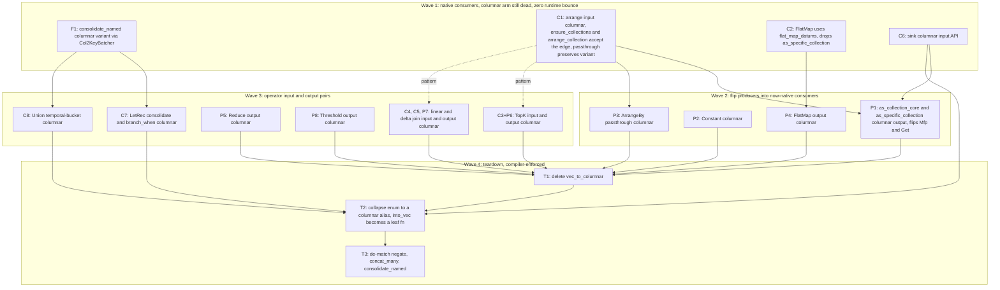

# Columnar dataflow edges: VecCollection to Columns migration

- Associated: [#36507](https://github.com/MaterializeInc/materialize/pull/36507)

This document is a plan, not an implementation.
It decomposes the migration of compute dataflow edges from row-based `VecCollection` to columnar `Column` batches into fine-grained changes with an explicit dependency DAG.
Each change is scoped to a single stacked pull request, executed in later sessions.

## The Problem

Compute renders dataflow edges between Plan nodes as row-based `VecCollection` updates.
Row-based edges force per-record handling at every consumer, and they block downstream work that wants to operate on columnar batches.
PR #36507 scaffolded `CollectionEdge<'scope, T>`, an enum with `Vec` and `Columnar` arms, and wired it as the carrier of `CollectionBundle.collection`.
Today no producer emits the columnar arm, so the columnar path is dead in production, and the migration from row-based to columnar edges has no plan.

The risk in migrating is complexity.
A naive migration maintains two parallel implementations per operator, or gates the change behind a feature flag, and either approach grows code complexity to unbounded levels over the course of a long migration.

## Success Criteria

* Every compute dataflow edge carries columnar `Column` batches.
* The `Vec` arm of `CollectionEdge` is deleted, and the enum collapses to a single columnar type.
* No internal consumer decodes an edge to rows.
  `into_vec` survives only as a leaf helper for consumers that serialize rows anyway.
* The migration proceeds as a sequence of small, independently landable pull requests, each with a test gate.
* No single code path maintains both representations at once.
  There is no feature flag.
* No permanent performance regression.
  Transient regressions during the transition are acceptable.

## Out of Scope

* **Generalizing `CollectionExt`.**
  The trait is a dead-end.
  We do not make it container-generic.
* **Intra-operator `Vec` use.**
  `explode_one` and `ensure_monotonic` run on `Vec` collections inside reduce and top-k.
  The compute contract lets operators materialize `Vec` collections internally.
  Only the inter-node edge format is constrained, so these stay on `VecCollection`.
* **Generalizing batcher selection.**
  The columnar `consolidate_named` uses the `Col2KeyBatcher` family as a temporary second variant.
  We do not invest in a generic batcher-selection abstraction.
* **The columnar persist blob format.**
  Sinks change to consume columnar input, but the on-blob encoding that persist writes is unchanged.
  A sink that serializes rows may decode locally at the leaf.

## Solution Proposal

Migrate consumers first, then producers, then delete the `Vec` arm.
The enum stays as the single locus of representation-matching for the whole migration, so operators call enum methods and stay representation-agnostic, and producers flip one at a time under type unification.
Each operator has one code path at a time.
We accept a temporary performance impact during the transition rather than duplicating operators or feature-flagging the change.
The migration direction for each edge is chosen to minimize churn: we pair a producer flip with the consumer work that makes its downstream native, so no decode-back seam lingers.
The `Vec`-arm deletion is the completeness test.
The teardown will not compile until every producer is columnar and every internal consumer is columnar-native.

### Current operator map

The table records how each Plan node reads its input and produces its output today, and the seam that blocks columnar flow.
Verified against the tree at `cb4b1d2e6f`.

| Node | Input read | Output produced | Seam today |
|---|---|---|---|
| Constant | none | `to_stream` into `Vec` | producer emits `Vec` |
| Get::PassArrangements | carries the bundle | passes the bundle | none |
| Get::Arrangement, Get::Collection, Mfp | native `flat_map` or arrangement | `as_collection_core` into `Vec` | producer output builder is `Vec` |
| FlatMap | `as_specific_collection` then `into_vec` | `Vec` | consumer seam plus producer `Vec` |
| Join, linear and delta | `as_specific_collection` or `flat_map` | `Vec` | consumer seam plus producer `Vec` |
| Reduce | arranged input, internals on `Vec` intra-operator | `Vec` | producer `Vec` |
| TopK | `as_specific_collection(None)` then `into_vec` | `Vec` | consumer seam plus producer `Vec` |
| Negate | edge | `negate()` | native |
| Threshold | `render_threshold` | `Vec` | producer `Vec` |
| Union | edges | `concat_many` then `consolidate_named` | columnar consolidate round-trips |
| ArrangeBy | `ensure_collections` then `into_vec` | arrangement plus passthrough edge | arrange input seam |
| Let, LetRec | edge | consolidate plus `branch_when` into `Vec` | `into_vec` in the recursive path |

Three grounding mechanism facts:

* `arrange_collection` in `context.rs` already emits `ColumnBuilder<((Row, Row), T, Diff)>` and arranges via `columnar_exchange` plus `Col2ValPagedBatcher`.
  The arrangement pipeline is already columnar internally.
  The only `Vec`-ness is the input, fed by `into_vec` at `context.rs:1071`, and the passthrough re-wrap at `context.rs:1102`.
* `as_collection_core` and `as_specific_collection` hardwire `VecCollection<Row>` output through `SharedRow` packing.
  Flipping the `flat_map`-family producers means building into a `ColumnBuilder` there.
* The columnar batcher family exists: `ColumnMergeBatcher`, `Col2KeyBatcher<K, T, R>`, and the paged chunker.

### Change DAG

Wave 1 makes the high fan-out consumers columnar-native while every producer still emits `Vec`, so the columnar arm stays dead and there is zero runtime bounce, with a single code path throughout.
Wave 2 and later flip producers paired with their now-native consumers, so no decode-back seam lingers, which is the per-subgraph churn minimization.
The enum stays the carrier the whole time.
Wave 4 collapses it once T1 proves no `Vec` producer remains, and the teardown is compiler-enforced.

### Per-node change specification

Each node is one stacked pull request.
The base names the parent the branch stacks on.

**F1: columnar `consolidate_named`.**
Replace the decode, consolidate, re-encode round-trip in the `Columnar` arm of `CollectionEdge::consolidate_named` with a native consolidation using `Col2KeyBatcher`.
Keep the `Vec` arm unchanged.
This is the temporary second variant.
Files: `src/compute/src/render/columnar.rs`, possibly a helper in `src/timely-util/src/columnar.rs`.
Test: extend `consolidate_named_preserves_columnar` to assert the operator no longer contains a `ColumnarToVec`.
Base: `upstream/main`.

**C1: columnar arrange input.**
Generalize `ensure_collections` and `arrange_collection` to accept a `CollectionEdge`.
The `Columnar` arm iterates `data.borrow().into_index_iter()` and borrows datums from the columnar row to form the key, mirroring `flat_map_datums`.
The passthrough output preserves the input variant, so `context.rs:1102` re-wraps `Columnar` when the input was columnar.
The key-value output builder and the batcher are unchanged, since they are already columnar.
This unblocks ArrangeBy, index-export, and every plan-inserted arrangement.
Files: `src/compute/src/render/context.rs`.
Test: arrangement sqllogictest, plus a unit test that a columnar input yields no `ColumnarToVec` on the arrange path.
Base: `upstream/main`.

**C2: FlatMap decode via `flat_map_datums`.**
`render_flat_map` calls `as_specific_collection` then iterates rows.
Switch it to consume the edge through `flat_map_datums`, which handles both arms natively.
Files: `src/compute/src/render/flat_map.rs`.
Test: FlatMap sqllogictest, plus cross-arm agreement as in `flat_map_datums_arms_agree`.
Base: `upstream/main`.

**C6: columnar sink input.**
Change the sink input path so it consumes a columnar edge.
`sinks.rs:70` clones and calls `into_vec`.
Persist and subscribe serialize rows, so the decode is acceptable at the leaf, but the API accepts the columnar edge and decodes locally rather than forcing `into_vec` at the boundary.
Files: `src/compute/src/render/sinks.rs`.
Test: subscribe and materialized-view sink sqllogictest and testdrive coverage.
Base: `upstream/main`.

**P1: columnar output for the `flat_map` family.**
Generalize `as_collection_core` and `as_specific_collection` to build into a `ColumnBuilder` and return a columnar edge.
This flips the Mfp and Get producers.
Files: `src/compute/src/render/context.rs`, `src/compute/src/render.rs`.
Test: physical-plan goldens unchanged, plus sqllogictest for Get and Mfp chains feeding an ArrangeBy or sink.
Base: `C1`, `C6`.

**P2: columnar Constant.**
Build the constant collection into a `Column` in the `Constant` arm of `render_plan_expr`.
Files: `src/compute/src/render.rs`.
Test: constant-fed sqllogictest.
Base: `C1`.

**P3: columnar ArrangeBy passthrough.**
Once C1 preserves the input variant on the passthrough, ensure the passthrough emits `Columnar` when its producer is columnar, and drop any remaining `Vec` re-wrap.
Files: `src/compute/src/render/context.rs`.
Test: ArrangeBy followed by a consumer that reads the passthrough collection.
Base: `C1`.

**P4: columnar FlatMap output.**
Build the FlatMap output into a `ColumnBuilder`.
Files: `src/compute/src/render/flat_map.rs`.
Test: FlatMap feeding a downstream arrange or union.
Base: `C2`.

**C3+P6: TopK input and output columnar.**
TopK reads its input via `as_specific_collection(None)` then `into_vec` and arranges by a hash and group key internally.
Form that key off the columnar batch using the C1 pattern, and build the TopK output into a `ColumnBuilder`.
The intra-operator `explode_one` and `ensure_monotonic` on `Vec` stay unchanged.
Files: `src/compute/src/render/top_k.rs`.
Test: top-k sqllogictest including monotonic and limit cases.
Base: `C1`.

**C4, C5, P7: linear and delta join input and output columnar.**
The linear-join source-key path and the delta-join input path decode via `as_specific_collection` or local `into_vec`.
Rework each to consume the columnar batch, and build the join output into a `ColumnBuilder`.
Split into C4 for linear-join input, C5 for delta-join input, and P7 for the shared output flip if the diffs are large.
Files: `src/compute/src/render/join/linear_join.rs`, `src/compute/src/render/join/delta_join.rs`.
Test: join sqllogictest across linear and delta plans.
Base: `C1`.

**P5: columnar Reduce output.**
Build the final Reduce output into a `ColumnBuilder`.
Internals stay on `Vec`.
Files: `src/compute/src/render/reduce.rs`.
Test: reduce sqllogictest across accumulable, hierarchical, and basic plans.
Base: `upstream/main`, or the Wave 3 tip if it shares helpers.

**P8: columnar Threshold output.**
Build the Threshold output into a `ColumnBuilder`.
Files: `src/compute/src/render/threshold.rs`.
Test: threshold sqllogictest.
Base: `upstream/main`.

**C7: columnar LetRec.**
Run the LetRec consolidation and the `branch_when` iteration-limit logic on the columnar stream.
Depends on F1 for the native columnar consolidate.
This is the least-trodden path.
If `branch_when` on columnar resists, keep LetRec as a decode point longer and record why.
Files: `src/compute/src/render.rs`.
Test: recursive-view sqllogictest including the iteration limit and the error-distinctness path.
Base: `F1`.

**C8: columnar Union temporal-bucket.**
`render.rs:1358` decodes via `into_vec` to apply temporal bucketing inside a consolidating Union.
Make `maybe_apply_temporal_bucketing` operate on the columnar stream, or keep the decode and document it as a leaf if bucketing is inherently row-shaped.
Files: `src/compute/src/render.rs`, the timestamp trait sites for `maybe_apply_temporal_bucketing`.
Test: temporal and temporal-bucketing sqllogictest.
Base: `F1` if it shares the consolidate, else `upstream/main`.

**T1: delete `vec_to_columnar`.**
Once every producer emits columnar, no edge carries `Vec`, so `vec_to_columnar` is dead.
Delete it and the mixed-variant upgrade branch in `concat_many`.
Files: `src/compute/src/render/columnar.rs`.
Base: the merge of all P nodes and the Wave 3 consumer nodes.

**T2: collapse the enum.**
Replace `CollectionEdge` with a `ColumnarCollection` type alias.
Demote `into_vec` to a free function used only by leaf consumers that serialize rows.
Update `CollectionBundle.collection` and all construction sites.
Files: `src/compute/src/render/columnar.rs`, `src/compute/src/render/context.rs`, `src/compute/src/render.rs`, and every construction site.
Base: `T1`, `C6`, `C7`, `C8`.

**T3: de-match the carrier methods.**
Simplify `negate`, `concat_many`, and `consolidate_named` from arm matches to single columnar implementations.
Remove the temporary second consolidate variant.
Files: `src/compute/src/render/columnar.rs`.
Base: `T2`.

### Stacked pull requests

The DAG is not a single chain, so it is several stacks off `upstream/main` that converge at the teardown.

* Lane A, off `C1`: `P1` also needs `C6`, then `P3`.
* Lane B: `C2` then `P4`.
* Lane C: `C6` feeds `P1` and `T2`.
* Lane D: `F1` then `C7`, `C8`.
* Lane E, off `C1`: `C3+P6`, `C4`, `C5`, `P7`.
* Independent: `P2` off `C1`, `P5` and `P8` off `upstream/main`.
* Convergence: `T1` rebases on all producer and Wave 3 consumer lanes, then `T2`, then `T3`.

gh-stack reference: https://github.github.com/gh-stack/#get-started

### Testing strategy

* Every consumer node lands a unit test that asserts the columnar path introduces no `ColumnarToVec` operator, reusing the introspection-visible seam names.
* Every producer node keeps physical-plan goldens unchanged, since the edge representation is not part of the plan text.
* Cross-arm agreement follows the `flat_map_datums_arms_agree` pattern.
  The vec and columnar arms must extract identical updates.
* A feature-benchmark reduce and top-k run guards against a regression that outlives the transition, not against transient cost.

## Minimal Viable Prototype

The prototype validates the two load-bearing mechanisms end to end: the columnar arrange input (C1) and the `flat_map`-family producer flip (P1).
Land C1 and P1, then render a `SELECT` that flows Get into an ArrangeBy.
Assert that the rendered dataflow contains no `ColumnarToVec` operator on that path, and that results match the row-based rendering.
This de-risks the C1 key-forming pattern that C3, C4, and C5 reuse, before committing to the operator-local arrange diffs.

## Alternatives

* **Two parallel implementations per operator.**
  Maintain both the `Vec` and columnar code paths at every operator until the migration completes.
  Rejected because the complexity grows to unbounded levels over a long migration.
* **Feature-flag the change.**
  Gate columnar edges behind a config flag.
  Rejected for the same complexity reason, and because the flag plus the enum multiplies the states to reason about.
* **Generalize `CollectionExt` over its container.**
  Make the trait container-generic so a columnar collection is a first-class implementation.
  Rejected because the trait is a dead-end.
  Behavior-specific needs are met by keeping intra-operator `Vec` uses as they are and giving `consolidate_named` a temporary second variant.
* **Collapse the enum to a columnar-only edge with local adapters now.**
  Make the edge type columnar immediately and insert `vec_to_columnar` and `columnar_to_vec` adapters at unmigrated boundaries.
  Rejected because it doubles conversions at unmigrated producer-consumer pairs, a worse transient cost, and the enum-as-carrier keeps the representation-matching in one place.
* **Strict consumer-first with a dead columnar arm throughout.**
  Migrate every consumer natively before any producer flips, so there is no transient perf hit.
  Not chosen as a strict rule, since it front-loads per-operator native code before any producer benefits.
  The chosen per-subgraph direction pairs each producer flip with its consumer work instead.

## Open questions

* **Join node granularity.**
  C4, C5, and P7 are grouped.
  The split into linear-input, delta-input, and shared-output depends on how large the diffs are, resolved when the join work starts.
* **`branch_when` on columnar.**
  LetRec, C7, runs the iteration-limit `branch_when` on the stream.
  Whether that is clean on a columnar stream, or whether LetRec stays a decode point, is unresolved until C7 is attempted.
* **Union temporal-bucketing.**
  Whether `maybe_apply_temporal_bucketing` can operate on a columnar stream, or is inherently row-shaped and stays a leaf decode, is unresolved until C8 is attempted.
