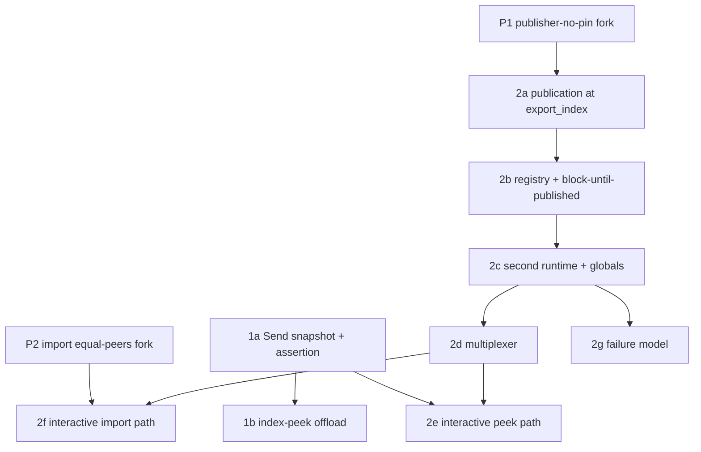

# Two-runtime compute implementation plan

> **For agentic workers:** REQUIRED SUB-SKILL: use `superpowers:subagent-driven-development` or `superpowers:executing-plans` to execute this plan task by task.
> Steps use checkbox (`- [ ]`) syntax for tracking.
> This is a *stacked-PR roadmap*, not a single bite-sized task list.
> The near-term slices (primitive fixes, Stage 1) are planned to executable granularity.
> The Stage 2 slices are planned to PR boundary and definition-of-done granularity, and each requires its own detailed sub-plan before execution, because several depend on open questions the design leaves to measurement.

**Goal:** isolate latency-sensitive reads from CPU-bound maintenance in a compute replica, first by offloading the index-peek walk off the maintenance worker (Stage 1), then by running a second in-process timely runtime that serves reads against shared arrangements (Stage 2).

**Architecture:** build on the Arc-batches branch so arrangement batches are `Arc`-backed and their contents are `Send + Sync`.
Stage 1 takes a `Send` point-in-time snapshot of a local arrangement on the maintenance worker and runs the cursor walk on an async task, mirroring the existing persist-peek offload.
Stage 2 adds a second timely runtime, a per-process publication registry, and a process-level command/response multiplexer, so reads execute on threads that are not maintenance workers.

**Tech stack:** Rust, timely-dataflow, differential-dataflow (Materialize fork), `mz-compute`, `mz-compute-client`, `mz-clusterd`, `mz-row-spine`.

## Global constraints

* **Base branch.** All Materialize work stacks on `upstream/claude/spines-differential-arc-j93mho` (the Arc-batches branch, materialize #37743), *not* `main`.
  All differential-fork work stacks on `antiguru/differential-dataflow@claude/spines-differential-arc-j93mho`.
  Every file and line reference in this plan is to those branches.
* **Design source.** The design is PR #37747, `doc/developer/design/20260720_two_runtime_compute/README.md` and `doc/developer/design/20260719_shared_arrangements_across_runtimes/README.md`.
  Where this plan and the design prose disagree, this plan wins, because it is grounded in the current fork code (see "Corrections to the design" below).
* **No `as_conversions`.** Use `mz_ore::cast::CastFrom` / `CastLossy`.
* **No `std::HashMap`.** Use `BTreeMap`.
* **No `unsafe`** in the sharing layer or the compute integration.
  Any unsafe block requires a `SAFETY` comment, and the design forbids it here.
* **Feature-flag new behavior.** Every new peek or runtime path is gated behind a compute dyncfg flag, defaulted off in production and enabled in CI and test configs, following the project convention for new optimizer and compute flags.
* **Formatting and checks.** Run `bin/fmt` and `cargo check` before reporting any task done, and `bin/lint` plus `cargo clippy` before committing.
* **Squash-merge, sequential landing.** PRs squash-merge.
  Land the stack bottom-up: primitive fixes, then Stage 1, then Stage 2 in order.

## Corrections to the design

Grounding against the current fork code found that the design's "Compaction: controller authority and required primitive changes" section is partly stale.
Two of the four primitive changes it lists are already implemented on the fork branch.

* **Already done, verify only.** `snapshot_at` already enforces the `since <= t` gate (`sharing.rs:205-207`).
  `batches_through` already fail-stops on a straddling batch with an assertion (`sharing.rs:286-289`), rather than silently including it.
* **Still open, this plan implements them.** The publisher still pins compaction (`sharing.rs:449`, forwarded at `499-500`, TODO at `430-438`).
  `import` still does not assert equal peers (only a TODO at `sharing.rs:548-553`).
* **API differs from the design prose.** There is no bare `snapshot`, only `snapshot_at` (`sharing.rs:190`).
  There is no `ReaderWakeup` enum.
  Reader wakeup is a `Condvar upper_changed` field on `SharedTrace` (`sharing.rs:117`), with import wakeups driven through the replay queue's `SyncActivator`.
  Plan against the real types.

---

## Task graph and sequencing



Stage 1 (`1a`, `1b`) is independent of the fork fixes and of Stage 2.
It is the recommended first landing because it delivers a real latency win with no second runtime.
The fork fixes (`P1`, `P2`) gate the Stage 2 slices that consume the shared trace (`2a`, `2f`).

---

## P1: publisher must not pin compaction (differential fork)

**Repo:** `antiguru/differential-dataflow`, branch stacked on `claude/spines-differential-arc-j93mho`.
Clone into a worktree and repoint the Materialize `[patch.crates-io]` entry at the new branch when integrating.

**Files:**
* Modify: `src/operators/arrange/sharing.rs:430-500` (the publisher's compaction-forwarding block).
* Test: add to the existing `sharing` test module (the module already runs a main and a query runtime as two `timely::execute` instances).

**Interfaces:**
* Consumes: `TraceAgent::{get_logical_compaction, set_logical_compaction, set_physical_compaction}`, `compaction_target` (`sharing.rs:94`), `SharedTraceState.{logical_holds, physical_holds, since}` (`sharing.rs:60`).
* Produces: unchanged public API.
  Behavior change only: publishing with no registered import holds no longer freezes the trace's `since`.

**Rationale (from the design and the in-code TODO at `sharing.rs:430-438`):**
the publisher owns a `TraceAgent` clone whose counted hold in `TraceBox` currently sits at the publish-time `since` and never advances, because with no readers `compaction_target` returns that same `since` and `set_logical_compaction` re-applies it as a no-op.
So merely publishing an index freezes its compaction for the life of the index.
The fix: publishing carries no independent compaction floor.
The trace's writer and the controller drive `since`.
Only a live import's own `as_of` hold (released on drop) may hold the trace back, and the publisher forwards the meet of those holds when any exist.
The existing safety rule stays: never forward the destructive empty meet, because that permanently releases the publisher's read capability and makes `batches_through` panic.
With no holds, the publisher must let its agent follow the writer-driven `since` rather than re-pinning at publish time.

- [ ] **Step 1: Write the failing test** — publish, no importers, writer advances `since`, assert the trace compacts.

```rust
#[test]
fn publish_without_readers_does_not_pin_compaction() {
    // Main runtime: arrange a collection, publish it, no importers.
    // Advance the input and let the arrange operator seal past an initial time.
    // Drive the writer's AllowCompaction (set_logical_compaction) forward on the
    // source TraceAgent to `t`.
    // Assert: after the publisher's next activation, the published `since`
    // (state.since) has advanced to `t`, and a `snapshot_at(t0)` for a time
    // `t0 < t` returns `None` (compacted away), where before the fix it stayed
    // pinned at the publish-time since and `snapshot_at(t0)` still succeeded.
}
```

- [ ] **Step 2: Run it, verify it fails** on the current pinned behavior (`snapshot_at(t0)` still succeeds, `since` stuck at publish time).
- [ ] **Step 3: Implement.** In the compaction-forwarding block (`sharing.rs:449` onward), stop sourcing the floor from the publisher agent's own `get_logical_compaction`.
  Compute `logical_target` as the meet of `state.logical_holds` when non-empty, else the writer-driven `since` the agent already reflects (do not re-introduce the publish-time floor).
  Keep the "never forward the empty meet" guard.
  Forward `logical_target` / `physical_target` to the agent at `499-500` as today.
  Update the `430-438` TODO into a doc comment stating the contract: publishing pins nothing, holds come only from live imports.
- [ ] **Step 4: Run the full `sharing` test suite,** including the existing "read holds keep the main trace from compacting, and release on drop" test, and verify the new test passes and none regress.
- [ ] **Step 5: Commit** (`fix(sharing): publishing no longer pins compaction`).

**DoD:** with no importers, publishing an index does not hold its `since`.
A registered import still holds its `as_of` and releases on drop.
The empty-meet guard is intact.
No test regresses.

---

## P2: `import` asserts equal peers (differential fork)

**Files:**
* Modify: `src/operators/arrange/sharing.rs:543-556` (`import`), and `SharedTrace` / `publish_named` (`sharing.rs:115-118, 373`) to record the publisher's peer count at publish time.
* Test: `sharing` test module.

**Interfaces:**
* Consumes: `scope.peers()` on the importing scope, timely worker peer count at publish.
* Produces: `import` panics with a clear message when `scope.peers()` differs from the publisher's recorded peer count.

**Rationale:** pairwise import (importer worker `i` reads publisher worker `i`) is sound only when both sides shard by `key.hashed() % peers` with equal *total* peers, which is `workers_per_process * num_processes`, not just workers-per-process.
The current code only has a TODO (`sharing.rs:548-553`).

- [ ] **Step 1: Write the failing test** — publish on a runtime with `peers = A`, import on a runtime with `peers = B != A`, expect a panic.

```rust
#[test]
#[should_panic(expected = "peers")]
fn import_asserts_equal_peers() { /* two timely::execute with different worker counts */ }
```

- [ ] **Step 2: Run it, verify it fails** (no panic today, silent wrong-shard read).
- [ ] **Step 3: Implement.** Record `peers` in `SharedTrace` at `publish_named`.
  In `import`, `assert_eq!(scope.peers(), recorded_peers, "shared-trace import requires equal total peers")` before registration.
- [ ] **Step 4: Run the `sharing` suite,** verify the new test panics as expected and the equal-peer import tests still pass.
- [ ] **Step 5: Commit** (`fix(sharing): import asserts equal peers`).

**DoD:** a mismatched-peer import fails loudly at import time.
Equal-peer imports are unaffected.

---

## Stage 1: offload the index-peek walk (Materialize, no second runtime)

Stage 1 mirrors the existing persist-peek async offload for fast-path index peeks.
The maintenance worker still takes the snapshot on its command loop (this is the design's acknowledged smaller-win first increment, the "offload only the walk" shape, which the design rejects *as a substitute for* Stage 2 but endorses as the Stage 1 stepping stone).
The win is removing the cursor walk (dominant for full scans and large results) from the worker's critical path.

### Task 1a: `Send` point-in-time snapshot of a local arrangement + compile-time assertion

**Files:**
* Create: `src/compute/src/compute_state/local_snapshot.rs` (new module for the owned, `Send` snapshot cursor over `Arc` batches taken from a local trace via `cursor_through`).
* Modify: `src/compute/src/compute_state.rs` (module declaration) and `src/compute/src/compute_state/peek_result_iterator.rs:25-39` (allow `PeekResultIterator` to be built over the owned snapshot cursor).
* Modify: `src/compute/src/compute_state/peek_stash.rs:45-47` (update the `!Send` note once the assertion holds).
* Test: unit test in `local_snapshot.rs` plus a `static_assertions::assert_impl_all!` for `Send`.

**Interfaces:**
* Consumes: the local `TraceAgent`'s `cursor_through(upper)` returning `Arc`-backed batches (available on the Arc branch), `mz-row-spine` batch contents asserted `Send + Sync` (added by #37743).
* Produces:
  * `pub struct LocalSnapshot<Tr> { cursor: CursorList<BatchCursor<Tr>>, since: Antichain<T>, upper: Antichain<T> }`, `Send`.
  * `pub fn snapshot_local(trace: &mut TraceBundle-or-handle, as_of: &Antichain<T>) -> Result<LocalSnapshot<Tr>, SnapshotError>` taking the `Arc` batch chain via `cursor_through` and building an owned `CursorList`.
  * `PeekResultIterator::new_over_snapshot(snapshot, mfp, timestamp, ...)` constructing the iterator over a `LocalSnapshot` instead of the borrowed `TraceCursor`.

**Rationale:** the walk can only move to another thread if the whole iterator is `Send`.
Today it is `!Send` because the trace reader is `Rc` (`peek_stash.rs:45-47`).
On the Arc branch, batches are `Arc` and their contents are `Send + Sync`, so an *owned* `CursorList` over `Arc` batch cursors (not the `Rc` `TraceAgent`) is `Send`.
The snapshot must own the `Arc` batches so the maintenance runtime may merge and compact freely while the walk proceeds, with no torn read.

- [ ] **Step 1: Write the failing compile-time assertion** in `local_snapshot.rs`.

```rust
#[cfg(test)]
mod tests {
    use static_assertions::assert_impl_all;
    // Over the production Row/Timestamp/Diff layout.
    assert_impl_all!(super::LocalSnapshot<crate::typedefs::RowRowSpine>: Send);
    assert_impl_all!(crate::compute_state::peek_result_iterator::PeekResultIterator<crate::typedefs::RowRowSpine>: Send);
}
```

- [ ] **Step 2: Run it, verify it fails to compile** (`PeekResultIterator` is `!Send` today).
- [ ] **Step 3: Implement `LocalSnapshot` and `snapshot_local`.**
  Take `cursor_through(as_of)` to obtain the covering `Arc` batches, build an owned `CursorList` of their cursors, capture `since`/`upper`.
  Add `PeekResultIterator::new_over_snapshot` that holds the owned cursor and storage.
  The assertion covers the batch cursor and the columnation containers, not just the batch wrapper, per the design's requirement.
- [ ] **Step 4: Run `cargo check -p mz-compute` and the assertion test,** verify `Send` holds.
- [ ] **Step 5: Commit** (`compute: Send point-in-time snapshot over Arc batches`).

**DoD:** `LocalSnapshot` and a `PeekResultIterator` built over it are statically `Send`.
The snapshot owns its `Arc` batches, so concurrent maintenance merge and compaction cannot tear the read.

**Risk:** if any columnation container in the production batch layout is not yet `Send + Sync` on the branch, the assertion fails and the gap must be closed in `mz-row-spine` first.
Fail loud at compile time, do not paper over with a wrapper.

### Task 1b: index-peek async offload

**Files:**
* Modify: `src/compute/src/compute_state.rs`: `handle_peek:674`, `process_peek:934` and the `seek_fulfillment` call site `981-987`, the `PendingPeek` enum, mirroring the persist offload at `1254-1326`.
* Modify: the compute dyncfg definitions (new flag `enable_index_peek_offload`).
* Test: `src/compute/src/compute_state.rs` unit coverage plus an integration test under `test/` exercising a fast-path index peek while the worker is busy.

**Interfaces:**
* Consumes: `snapshot_local` and `PeekResultIterator::new_over_snapshot` from Task 1a, the `PendingPeek::persist` offload pattern (oneshot `result_tx`/`result_rx`, `mz_ore::task::spawn`, `activator.activate()`), the since-gate at `1536-1542`.
* Produces: a `PendingPeek::Index` async variant that takes the snapshot on the worker loop, spawns a task running the walk, and returns the `PeekResponse` over a oneshot, waking the worker via the activator.

**Rationale:** the persist path (`compute_state.rs:1254-1326`) already spawns an async task, sends `PeekResponse` over a oneshot, and activates the worker on completion.
Index peeks take the fast path but run the walk synchronously on the worker (`process_peek` -> `seek_fulfillment`).
Stage 1 gives index peeks the same offload, now possible because the snapshot is `Send`.

- [ ] **Step 1: Write the failing test.** Create an index, issue a fast-path peek, assert correct rows, and assert (via a busy-worker fixture or a timing/counter assertion) the walk ran off the worker step. Reuse the persist-peek test harness shape.
- [ ] **Step 2: Run it, verify it fails** (flag off / variant absent, walk still inline).
- [ ] **Step 3: Add the `enable_index_peek_offload` dyncfg,** default off in prod, on in CI/test config.
- [ ] **Step 4: Implement `PendingPeek::Index`.**
  On the worker loop, apply the since-gate (`1536-1542`), take `snapshot_local`, spawn a task that runs `PeekResultIterator::new_over_snapshot` and produces `PeekResponse::Rows` / `PeekResponse::Error`, send over the oneshot, `activator.activate()`.
  Hold an `abort_on_drop` handle so `CancelPeek` and drop abort the task, mirroring `PendingPeek::Persist`.
  Gate the whole path on the flag, falling back to the current synchronous walk when off.
- [ ] **Step 5: Run the peek test suite** (`bin/sqllogictest --optimized` for the relevant files, plus the new integration test), verify correctness with the flag on and off.
- [ ] **Step 6: Commit** (`compute: offload fast-path index peek walk to an async task`).

**DoD:** with the flag on, a fast-path index peek's walk runs off the worker step and returns the same rows as with the flag off.
The since-gate error is unchanged.
Cancel and drop abort the task.
The point-lookup latency is unchanged (correctly, per the design's non-criterion).

**Open item for 1b:** whether the async task runs on the tokio pool (as persist does) or a dedicated reader pool is an implementation choice deferred to measurement.
Start with the tokio pool to match persist, and revisit under Stage 2.

---

## Stage 2: second timely runtime serving reads

Stage 2 slices are planned to PR boundary and DoD.
Each requires its own detailed sub-plan (via `superpowers:writing-plans`) before execution, because they are large and several touch open questions the design defers to measurement.
They land in the order below.

### Task 2a: publication at `export_index`

**Depends on:** P1.
**Files:** `src/compute/src/render.rs`: `export_index:688`, `ArrangementFlavor::Local` arm `713`, `traces.set` `734-737`, `ArrangementFlavor::Trace` re-export arm `739-743`, and `export_index_iterative:767` (Local arm `793`, `traces.set` `836-838`, Trace arm `841-845`).

**Behavior:** in the `Local` arm, alongside `traces.set`, sink the arrange output stream into a `sharing::publish`-backed publication point and record a `Send` handle in the per-process registry (Task 2b) keyed by `GlobalId`, one entry per worker ordinal.
The `Trace` re-export arm re-registers the same published handle under the new id.
`export_index_iterative` mirrors this.
Publishing does not change what `traces.set` stores, so the local trace and its compaction are exactly as today.

**DoD:** every maintained index publishes.
Local trace behavior and compaction are byte-for-byte unchanged.
Publication cost is one `Arc` clone plus a mutex push per batch, no per-record work.
With no importers, publishing does not pin compaction (relies on P1).

### Task 2b: per-process publication registry + block-until-published handshake

**Depends on:** 2a.
**Files:** new module `src/compute/src/sharing_registry.rs` (or similar), wired through `ComputeState::new` (`compute_state.rs:179-187`) and `server::serve` (`server.rs:85`) the way the persist client cache is shared (created once, handed to both `serve` calls).

**Behavior:** a first-class per-process object keyed by `GlobalId`, one entry per worker ordinal, shared into both runtimes.
Interactive worker `i` finds maintenance worker `i`'s handle.
A read for an unregistered `GlobalId` *blocks* until the publication point appears, woken when it registers, rather than erroring or reading an empty snapshot.
This closes the reconciliation and replica-restart race where a `Peek` reaches the interactive side before the maintenance runtime has re-rendered and re-published.

**DoD:** a peek for a not-yet-published id blocks and then resolves once published.
Reconciliation replay (`CreateDataflow` then `Peek` from history) is safe.
The handshake has no lost-wakeup window.

### Task 2c: second "interactive" timely runtime + process-global reconciliation

**Depends on:** 2b.
**Files:** `src/clusterd/src/lib.rs` (second `serve`/`ClusterSpec` instance, equal-peers assertion near `425-429`), `src/compute/src/compute_state.rs` (`DICTIONARY_COMPRESSION:497`, lgalloc/pager init `255-361`, metrics `538-541`).

**Behavior:** one replica process runs two compute timely runtimes sharing per-process resources (persist client cache, tracing handle, metrics), exactly as storage and compute share them today.
Reconcile the three process-globals the design names.
`DICTIONARY_COMPRESSION`: both runtimes must agree, or it moves to per-runtime state.
lgalloc and pager config: initialized once per process, the second runtime must not re-initialize.
Metrics: add per-runtime labels to tell maintenance and interactive apart.
Assert *equal peers* (`workers_per_process * num_processes`), stronger than the current workers-per-process assertion at `clusterd:425-429`.

**DoD:** two runtimes boot in one process.
Process-globals are initialized exactly once and agree.
Equal peers is asserted at configuration and fails loudly otherwise.
Metrics distinguish the two runtimes.

### Task 2d: process-level command/response multiplexer

**Depends on:** 2c.
**Files:** new component under `src/compute-client/src/` (explicitly *not* `PartitionedComputeState:79`, which merges homogeneous partitions with a meet).

**Behavior:** a genuinely new component between the controller connection and the two runtimes, doing ownership-based demux and pass-through.
Route by the bespoke policy "maintained work to maintenance, one-shot reads to interactive": `Peek`, `CancelPeek` (keyed by `uuid`), and transient `CreateDataflow` / `AllowCompaction` to interactive; maintained `CreateDataflow` / `Schedule` / `AllowWrites` / `AllowCompaction` to maintenance; lifecycle (`CreateInstance`, `UpdateConfiguration`, `InitializationComplete`) to both.
Distinguish a subscribe (which exports transient ids but stays on maintenance) by the subscribe sink in its `DataflowDescription` (`dataflows.rs:348-356`).
Learn transient-id ownership by observing `CreateDataflow`.
Merge responses: pass `PeekResponse` through from whichever side produced it, report maintained `Frontiers` from maintenance, and guarantee exactly one `PeekResponse` per peek including for point-lookups (the cancel-race open question).

**DoD:** the controller sees one endpoint and one protocol.
Every command reaches the correct runtime by the policy above.
Exactly one `PeekResponse` per peek, cancel races included.

### Task 2e: interactive peek path off the registry

**Depends on:** 2d, 1a.
**Files:** `src/compute/src/compute_state.rs`: replace the local `TraceManager` lookup in `handle_peek` (`674`, lookup at `678`) with a registry lookup for the target id on the interactive side.

**Behavior:** the interactive side looks up the published handle, gates on published `upper`/`since`, takes a `Send` snapshot (a handful of `Arc` clones plus frontiers), and runs `PeekResultIterator` over it, reusing Stage 1's offload.
A snapshot peek holds nothing on the trace.

**DoD:** a fast-path peek is served on the interactive runtime and never touches a maintenance worker thread.
Correctness and the since-gate are unchanged.
The snapshot pins no compaction.

### Task 2f: interactive temporary-dataflow import path

**Depends on:** 2d, P2.
**Files:** `src/compute/src/render.rs`: a new import path analogous to `import_index:591` that sources the imported `Arranged` from the registry handle via `sharing::import` (change-stream replay from the dataflow's `as_of`), instead of the local `TraceManager`.

**Behavior:** a slow-path peek or ad-hoc query renders as a temporary dataflow on the interactive runtime, importing maintenance arrangements as ordinary `Arranged` collections, then dropping.
The import registers a real read hold at its `as_of`, released on drop.
Add the import-queue backpressure bound the design flags as an open question, because across runtimes the replay queue is no longer bounded by a shared worker step.

**DoD:** a slow-path peek renders on the interactive runtime importing a maintenance arrangement, and drops cleanly.
The import holds only its own `as_of`, released on drop, and never below the controller's hold (relies on P1 and criterion 1).
The replay queue is bounded.

### Task 2g: failure model confirmation

**Depends on:** 2c.
**Files:** the process abort path in `clusterd` / `compute` server setup.

**Behavior:** confirm a panic on any worker or reader thread of *either* runtime aborts the whole process, so an import's read hold and a half-served read cannot leak.
Shared fate is what makes the import hold safe without a lease-expiry mechanism.

**DoD:** a panic on either runtime's worker or reader thread aborts the process.
There is no partial-failure path and no fallback that reroutes interactive reads onto the maintenance runtime.

---

## Deferred to measurement or follow-up design (open questions)

These are explicitly out of the executable plan and must not be silently resolved by an implementer.

* **Core-sharing policy** between the two runtimes (pinning, priorities, oversubscription).
  Worker counts are fixed by equal peers.
* **Reader pool vs tokio pool** for the walk (Task 1b / 2e), deferred to measurement.
* **Import-queue backpressure** bound and publisher backpressure (Task 2f), grows in importance if long-lived imports such as subscribes move to the interactive runtime.
* **Introspection and per-runtime memory attribution.**
  Under one endpoint the controller cannot see which runtime holds what memory, and a shared arrangement reachable from both runtimes' size loggers can be double-counted.
  `mz_arrangement_sizes` and friends need a per-runtime view eventually.
* **Cancellation and exactly-one response** semantics for point-lookups (folded into 2d, but the general contract may need its own design).
* **`batches_through` straddle:** already fail-stops (`sharing.rs:286-289`).
  Confirm every `cursor_through` frontier that reaches a `SharedTraceHandle` is batch-aligned, so the assertion never trips on a legitimate read.
* **Lease expiry:** the design assumes same-process trust (RAII holds, shared fate).
  Revisit only if a query thread stuck in a long computation holding compaction back becomes a real problem.

## Self-review notes

* **Spec coverage.** Every "New components this design requires" bullet maps to a task: multiplexer (2d), registry plus handshake (2b), interactive peek path (2e), interactive import path (2f), the two primitive changes (P1, P2 plus the verify-only note on `snapshot_at` and `batches_through`), and the `Send` assertion (1a).
  The equal-peers requirement is 2c plus P2.
  The process-global reconciliation is 2c.
  The failure model is 2g.
* **Stale-design corrections** are called out up front so an implementer does not re-add an already-present gate or straddle guard.
* **Granularity.** P1, P2, 1a, and 1b are executable now.
  2a through 2g are PR boundaries with DoD and need per-task sub-plans before execution.
